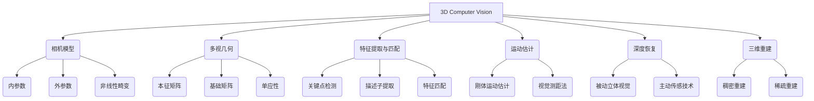

以下是《3D Computer Vision 原理与代码实战案例讲解》的正文内容：

# 3D Computer Vision 原理与代码实战案例讲解

## 1. 背景介绍

### 1.1 问题的由来

在现代计算机视觉领域,三维(3D)视觉技术正日益受到重视。与传统的二维图像处理相比,3D视觉能够从多个角度捕获场景的深度信息,为机器赋予更加逼真的空间感知能力。这种能力在多个领域都有广泛的应用前景,如增强现实(AR)、虚拟现实(VR)、自动驾驶、机器人导航等。

然而,要实现高质量的3D视觉并非易事。它需要解决多个复杂的计算机视觉和几何问题,如相机标定、特征提取与匹配、运动估计、深度恢复、三维重建等。这些问题往往需要综合运用多种算法和数学模型,并结合大量的优化技术,才能获得满意的结果。

### 1.2 研究现状

近年来,随着深度学习技术的不断发展,3D视觉领域也取得了长足的进步。基于卷积神经网络(CNN)的深度模型能够自动从大量数据中学习到有效的3D特征表示,显著提高了3D目标检测、语义分割等任务的性能。同时,生成对抗网络(GAN)的出现也为高质量的3D模型生成提供了新的思路。

不过,现有的3D视觉方法仍然存在一些局限性。例如,大多数方法只能处理单一的传感器输入,而结合多种传感器(如RGB相机、深度相机、激光雷达等)的信息可能会带来更好的性能。此外,如何在保证精度的同时提高3D视觉系统的鲁棒性和实时性,也是一个亟待解决的挑战。

### 1.3 研究意义

3D视觉技术的发展将为众多领域带来深远的影响。在AR/VR领域,它可以实现更加沉浸式的用户体验;在自动驾驶领域,它可以大幅提升车辆的环境感知能力,从而提高行驶安全性;在机器人领域,3D视觉则是实现智能导航和操作的关键。

因此,深入研究3D视觉的原理与实践是非常有意义的。本文将系统地介绍3D视觉的核心概念、算法原理、数学模型,并结合大量的代码实例,帮助读者全面掌握这一领域的理论基础和工程实践。

### 1.4 本文结构

本文共分为9个部分:

1. 背景介绍
2. 核心概念与联系
3. 核心算法原理与具体操作步骤
4. 数学模型和公式详细讲解与案例分析
5. 项目实践:代码实例和详细解释说明
6. 实际应用场景
7. 工具和资源推荐
8. 总结:未来发展趋势与挑战
9. 附录:常见问题与解答

## 2. 核心概念与联系

3D计算机视觉(3D Computer Vision)是一个交叉学科,它综合了计算机视觉、几何学、优化理论等多个领域的知识。上图展示了3D视觉的核心概念及它们之间的联系。

其中,相机模型描述了如何将三维世界映射到二维图像平面,是3D视觉的基础。多视几何研究多个视角之间的几何关系,为运动估计、三维重建等提供了理论支撑。

特征提取与匹配则是建立图像之间的对应关系,为后续的几何计算提供输入。运动估计旨在从图像序列中恢复相机的运动轨迹,而深度恢复则是计算每个像素对应的三维坐标。最终,三维重建将会把所有的信息整合起来,生成精确的三维模型。

这些概念相互关联、环环相扣,共同构建了3D视觉的理论框架。掌握它们对于开发3D视觉应用程序至关重要。

## 3. 核心算法原理与具体操作步骤

### 3.1 算法原理概述

3D视觉涉及多种核心算法,它们的原理各不相同,但都植根于多视几何、优化理论等数学基础。这些算法可大致分为以下几类:

1. **相机标定算法**:用于估计相机的内外参数模型,是3D视觉的基础。常用算法有张正友标定法、RPnP等。

2. **特征提取与匹配算法**:检测图像中的关键点,并为它们构建描述子,用于后续的特征匹配。常用算法有SIFT、SURF、ORB等。

3. **运动估计算法**:根据图像序列中的特征点对应关系,估计相机的运动轨迹。常用算法有八点算法、RANSAC等。

4. **深度估计算法**:利用被动立体视觉(如双目视觉)或主动传感技术(如结构光)来恢复每个像素的深度值。常用算法有SGM、ToF等。

5. **三维重建算法**:将深度数据与相机位姿结合,重建出三维模型。可分为稠密重建(如TSDF融合)和稀疏重建(如PnP)。

这些算法往往需要结合多种数学工具,如投影几何、优化理论、图论等,并广泛应用迭代、RANSAC等鲁棒性策略。

### 3.2 算法步骤详解

以下我们将详细介绍基于特征的视觉测距法(SfM)的完整流程,它是3D视觉中一种常用的三维重建方法。

1. **相机标定**:使用张正友标定法估计相机的内外参数模型。

2. **特征提取与匹配**:在所有图像上使用SIFT算法检测并提取特征点,然后在图像对之间用KD树或暴力匹配的方式建立特征点对应关系。

3. **运动估计**:
    a. 选择一对具有足够基线的图像,使用八点算法和RANSAC估计它们之间的本征矩阵。
    b. 通过本征矩阵分解,计算出这两个相机的相对姿态和部分三维点。
    c. 将其余图像及其特征点依次三角化到已重建的模型中,使用PnP算法估计新的相机姿态。

4. **三维重建**:
    a. 使用三角测量法由已知的相机姿态和特征点对应关系,重建出所有三维点的空间坐标。
    b. 使用统计去除错误的三维点。
    c. 对三维点云进行泊松面片化以获得完整的三维模型。

5. **模型优化**:使用Bundle Adjustment等优化技术,同时优化所有相机参数和三维点的位置,以获得最优的重建结果。

上述过程中,每个步骤都可能涉及多种具体算法的选择,需要结合实际情况进行权衡。此外,还需要注意各种鲁棒性策略(如RANSAC)的应用,以提高系统的可靠性。

### 3.3 算法优缺点

基于特征的视觉测距法具有以下优缺点:

**优点**:

1. 原理简单,容易实现。
2. 可以只利用普通的RGB图像作为输入,无需其他特殊传感器。
3. 重建过程高度自动化,无需人工干预。
4. 可以获得较为精确的相机运动轨迹和稀疏三维点云。

**缺点**:

1. 依赖于提取的特征点质量,对纹理缺失、光照变化等场景敏感。
2. 只能重建静止场景,无法处理动态目标。
3. 无法直接获得完整的三维模型,需要额外的面片化步骤。
4. 重建效率较低,无法满足实时性要求。

### 3.4 算法应用领域

基于特征的视觉测距法主要应用于以下领域:

1. **三维重建**:可用于重建建筑物、景观、文物等静态场景,在测绘、文化遗产保护等领域有广泛应用。

2. **增强现实**:通过将虚拟物体准确地插入到重建的三维场景中,可实现多种增强现实应用。

3. **机器人导航**:利用视觉测距法重建的三维地图,可为机器人提供环境感知和路径规划的支持。

4. **无人机测绘**:通过无人机拍摄的图像序列,可实现大规模区域的三维重建。

5. **视频特效**:在电影制作中,可将真实的人物或场景与虚拟的三维环境进行无缝融合。

总的来说,基于特征的视觉测距法擅长对静态场景进行高精度的三维重建,在各种需要获取环境三维信息的应用中都可以发挥作用。

## 4. 数学模型和公式详细讲解与举例说明

### 4.1 数学模型构建

在3D视觉中,我们需要构建数学模型来描述相机成像的过程。最基本的是针孔相机模型(Pinhole Camera Model),它将三维世界点$\mathbf{P} = (X, Y, Z)^T$通过下式映射到二维图像平面上的像素点$\mathbf{p} = (u, v)^T$:

$$
\begin{bmatrix}u\v\1\end{bmatrix} =
\begin{bmatrix}
f_x & 0 & c_x\\
0 & f_y & c_y\\
0 & 0 & 1
\end{bmatrix}
\begin{bmatrix}
r_{11} & r_{12} & r_{13} & t_1\\
r_{21} & r_{22} & r_{23} & t_2\\
r_{31} & r_{32} & r_{33} & t_3
\end{bmatrix}
\begin{bmatrix}
X\\
Y\\
Z\\
1
\end{bmatrix}
$$

其中$\mathbf{K}$为内参数矩阵,描述了相机的内在特性;$\mathbf{R}$和$\mathbf{t}$则为外参数,描述了相机在世界坐标系下的旋转和平移。通过这个模型,我们可以建立起三维空间与二维图像平面之间的数学关联。

### 4.2 公式推导过程

在3D视觉中,我们还需要研究多个视角之间的几何约束关系。以两个相机视角为例,它们之间的几何关系可由本征矩阵(Fundamental Matrix)$\mathbf{F}$描述:

$$
\mathbf{p}_2^T\mathbf{F}\mathbf{p}_1 = 0
$$

其中$\mathbf{p}_1$和$\mathbf{p}_2$为同一三维空间点在两个视角下的像素坐标。

我们可以利用相机的内外参数推导出本征矩阵$\mathbf{F}$的具体形式:

$$
\begin{align*}
\mathbf{F} &= [\mathbf{e}]_\times\mathbf{P}\\
           &= [\mathbf{e}]_\times\begin{bmatrix}\mathbf{R} & \mathbf{t}\end{bmatrix}\\
           &= [\mathbf{e}]_\times\begin{bmatrix}\mathbf{r}_1 & \mathbf{r}_2 & \mathbf{r}_3 & \mathbf{t}\end{bmatrix}\\
           &= [\mathbf{t}]_\times\mathbf{R}
\end{align*}
$$

这里$[\mathbf{e}]_\times$为反对称矩阵,用于表示向量的叉乘运算;$\mathbf{R}$和$\mathbf{t}$为两个相机视角之间的相对旋转和平移。通过这个公式,我们可以从已知