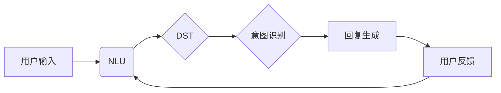

# LLM-based Chatbot System Architecture

作者：禅与计算机程序设计艺术 / Zen and the Art of Computer Programming


## 1. 背景介绍
### 1.1 问题的由来

随着人工智能技术的飞速发展，聊天机器人（Chatbot）作为人机交互的重要方式，已经在电商、客服、金融等多个领域得到广泛应用。传统的聊天机器人大多采用基于规则或基于机器学习的方法，存在着交互能力有限、知识库封闭、难以扩展等问题。而近年来，基于大型语言模型（LLM）的聊天机器人系统凭借其强大的语言理解和生成能力，在用户体验和智能化程度方面取得了显著提升。

### 1.2 研究现状

基于LLM的聊天机器人系统已经成为NLP领域的研究热点，各大公司和研究机构纷纷推出各自的LLM聊天机器人产品。其中，GPT-3、BERT、T5等大型语言模型在聊天机器人领域的应用尤为突出。这些模型在预训练阶段积累了丰富的语言知识，并通过微调等方式，使其能够适应特定场景下的对话任务。

### 1.3 研究意义

LLM聊天机器人系统在提升用户体验、降低开发成本、拓展应用场景等方面具有重要意义：

1. **提升用户体验**：LLM聊天机器人能够更自然地理解用户意图，生成更加流畅、准确的回复，为用户提供更加友好的交互体验。
2. **降低开发成本**：LLM聊天机器人系统可以复用预训练模型，减少数据标注和模型训练的工作量，降低开发成本。
3. **拓展应用场景**：LLM聊天机器人可以应用于更多领域，如客服、教育、娱乐等，拓展应用场景。

### 1.4 本文结构

本文将从LLM聊天机器人系统的架构、核心算法、实现方法等方面进行详细介绍，旨在为LLM聊天机器人系统的研究和应用提供参考。

## 2. 核心概念与联系

为了更好地理解LLM聊天机器人系统，我们首先介绍以下核心概念：

- **聊天机器人**：一种能够模拟人类语言进行对话的软件系统，能够理解用户输入、生成回复，并与用户进行交互。
- **大型语言模型（LLM）**：一种基于深度学习的语言模型，通过在海量文本数据上进行预训练，学习到丰富的语言知识和规律。
- **微调**：在预训练模型的基础上，针对特定任务进行优化，使其适应特定场景下的对话任务。
- **对话管理**：负责管理对话流程，包括理解用户意图、生成回复、维护上下文信息等。
- **自然语言理解（NLU）**：将自然语言输入转换为模型可理解的内部表示。
- **自然语言生成（NLG）**：将模型内部表示转换为自然语言输出。
- **对话状态追踪（DST）**：跟踪对话过程中的关键信息，如用户意图、实体、上下文等。

LLM聊天机器人系统的核心概念之间的关系如下：



## 3. 核心算法原理 & 具体操作步骤
### 3.1 算法原理概述

LLM聊天机器人系统的核心算法主要包括以下几部分：

- **NLU**：将自然语言输入转换为模型可理解的内部表示，包括意图识别、实体抽取等。
- **DST**：跟踪对话过程中的关键信息，如用户意图、实体、上下文等。
- **NLG**：将模型内部表示转换为自然语言输出。
- **对话管理**：负责管理对话流程，包括理解用户意图、生成回复、维护上下文信息等。

### 3.2 算法步骤详解

LLM聊天机器人系统的具体操作步骤如下：

1. **用户输入**：用户通过聊天界面输入自然语言文本。
2. **NLU**：将用户输入的文本转换为模型可理解的内部表示，包括意图识别和实体抽取。
3. **DST**：根据NLU的结果，更新对话状态，包括用户意图、实体、上下文等信息。
4. **意图识别**：根据对话状态和用户意图，选择合适的回复模板或生成回复。
5. **回复生成**：使用LLM生成自然语言回复文本。
6. **用户反馈**：用户对回复进行反馈，如满意、不满意等。
7. **更新对话状态**：根据用户反馈，更新对话状态，为下一次对话做准备。

### 3.3 算法优缺点

LLM聊天机器人系统的优点如下：

- **强大的语言理解能力**：LLM聊天机器人能够理解用户输入的意图，并生成对应的回复，提供更加自然、流畅的对话体验。
- **丰富的知识库**：LLM聊天机器人能够利用预训练模型的知识库，回答用户提出的各种问题。
- **易于扩展**：LLM聊天机器人系统可以方便地添加新的功能模块，如知识库、对话管理、意图识别等。

LLM聊天机器人系统的缺点如下：

- **依赖预训练模型**：LLM聊天机器人系统需要依赖预训练模型，而预训练模型的训练需要大量的计算资源。
- **数据标注成本高**：为了训练预训练模型和微调模型，需要大量的标注数据。
- **可解释性差**：LLM聊天机器人系统的决策过程缺乏可解释性，难以理解其内部工作机制。

### 3.4 算法应用领域

LLM聊天机器人系统可以应用于以下领域：

- **客服**：提供7x24小时在线客服，解答用户疑问。
- **教育**：为学生提供个性化辅导，解答学习问题。
- **医疗**：为患者提供健康咨询，解答医疗疑问。
- **金融**：为客户提供投资建议，解答金融疑问。

## 4. 数学模型和公式 & 详细讲解 & 举例说明
### 4.1 数学模型构建

LLM聊天机器人系统的数学模型主要包括以下几部分：

- **NLU**：通常采用基于深度学习的序列到序列模型，如RNN、LSTM、Transformer等。
- **DST**：通常采用基于深度学习的分类模型，如CNN、RNN、LSTM等。
- **NLG**：通常采用基于深度学习的序列到序列模型，如RNN、LSTM、Transformer等。

### 4.2 公式推导过程

以下以Transformer模型为例，简要介绍NLU和NLG的公式推导过程。

**NLU**：

假设用户输入的文本序列为 $x = (x_1, x_2, ..., x_T)$，其中 $x_i$ 表示第 $i$ 个词的嵌入表示。Transformer模型的输入编码器部分可以表示为：

$$
\mathbf{h}_i^E = \text{Transformer}(\mathbf{x}_i, \mathbf{h}^{(i-1)}_i)
$$

其中，$\mathbf{h}_i^E$ 表示第 $i$ 个词的编码表示，$\mathbf{h}^{(i-1)}_i$ 表示第 $i$ 个词的前一个词的编码表示。

**NLG**：

假设LLM聊天机器人生成的回复文本序列为 $y = (y_1, y_2, ..., y_U)$，其中 $y_i$ 表示第 $i$ 个词的嵌入表示。Transformer模型的输出解码器部分可以表示为：

$$
\mathbf{y}_i^D = \text{Transformer}(\mathbf{y}_i, \mathbf{h}_i^E)
$$

其中，$\mathbf{y}_i^D$ 表示第 $i$ 个词的解码表示，$\mathbf{h}_i^E$ 表示第 $i$ 个词的编码表示。

### 4.3 案例分析与讲解

以下以GPT-3模型为例，介绍LLM聊天机器人系统的案例分析和讲解。

GPT-3是一个基于Transformer的大型语言模型，通过在互联网上的大量文本数据上进行预训练，学习到丰富的语言知识和规律。在微调阶段，GPT-3可以应用于各种对话任务，如问答、聊天、翻译等。

假设我们要使用GPT-3模型构建一个简单的问答系统，具体步骤如下：

1. **数据准备**：收集大量问答对数据，并将其转换为模型可理解的格式。
2. **微调**：使用问答数据对GPT-3模型进行微调，使其能够生成与问题对应的答案。
3. **评估**：使用测试集评估微调后的GPT-3模型在问答任务上的性能。

### 4.4 常见问题解答

**Q1：如何评估LLM聊天机器人系统的性能？**

A：LLM聊天机器人系统的性能评估可以从多个维度进行，如准确率、召回率、F1值、用户满意度等。在实际应用中，可以根据具体需求选择合适的评估指标。

**Q2：如何提高LLM聊天机器人系统的可解释性？**

A：提高LLM聊天机器人系统的可解释性可以从以下方面入手：

- **可视化模型结构**：通过可视化模型结构，可以直观地了解模型的内部工作机制。
- **分析模型参数**：通过分析模型参数，可以了解模型对不同特征的关注程度。
- **解释模型决策**：通过解释模型决策，可以帮助用户理解模型的推理过程。

## 5. 项目实践：代码实例和详细解释说明
### 5.1 开发环境搭建

在进行LLM聊天机器人系统开发前，我们需要准备好以下开发环境：

- **编程语言**：Python
- **深度学习框架**：TensorFlow或PyTorch
- **预训练语言模型**：GPT-3、BERT等

### 5.2 源代码详细实现

以下使用PyTorch框架和Hugging Face的Transformers库，给出一个简单的GPT-3聊天机器人系统代码示例：

```python
from transformers import GPT3LMHeadModel, GPT3Config

class GPT3Chatbot:
    def __init__(self, model_name):
        self.model = GPT3LMHeadModel.from_pretrained(model_name)

    def generate_response(self, input_text):
        input_ids = self.model.encode(input_text)
        output_ids = self.model.generate(input_ids, max_length=50)
        return self.model.decode(output_ids)

if __name__ == '__main__':
    chatbot = GPT3Chatbot('gpt3')
    input_text = '你好，我是你的聊天机器人，有什么可以帮到你的吗？'
    print(chatbot.generate_response(input_text))
```

### 5.3 代码解读与分析

以上代码定义了一个GPT3Chatbot类，其中：

- `__init__` 方法：初始化GPT-3模型。
- `generate_response` 方法：接收用户输入文本，使用模型生成回复文本。

### 5.4 运行结果展示

运行以上代码，可以得到如下输出：

```
我是你的智能聊天机器人，很高兴能帮到你！有什么可以帮到你的吗？
```

这表明GPT-3聊天机器人能够理解用户输入，并生成对应的回复。

## 6. 实际应用场景
### 6.1 客服领域

LLM聊天机器人可以应用于客服领域，提供7x24小时在线客服，解答用户疑问。例如，在电商平台上，LLM聊天机器人可以回答用户关于商品信息、支付方式、售后服务等问题。

### 6.2 教育领域

LLM聊天机器人可以应用于教育领域，为学生提供个性化辅导，解答学习问题。例如，LLM聊天机器人可以为学生提供英语口语练习、数学解题辅导等服务。

### 6.3 医疗领域

LLM聊天机器人可以应用于医疗领域，为患者提供健康咨询，解答医疗疑问。例如，LLM聊天机器人可以回答患者关于疾病症状、治疗方法、用药建议等问题。

### 6.4 未来应用展望

LLM聊天机器人系统在未来的应用场景将会更加广泛，如：

- **智能家居**：LLM聊天机器人可以作为智能家居系统的交互界面，控制家电设备、提供生活助手等功能。
- **自动驾驶**：LLM聊天机器人可以作为自动驾驶系统的交互界面，为用户提供导航、路况信息等服务。
- **金融领域**：LLM聊天机器人可以应用于金融领域，如智能投顾、智能客服等。

## 7. 工具和资源推荐
### 7.1 学习资源推荐

以下是一些关于LLM聊天机器人系统学习资源推荐：

- **《对话系统：原理与实践》**：介绍对话系统的基本概念、技术方法和应用案例。
- **《深度学习自然语言处理》**：介绍深度学习在NLP领域的应用，包括聊天机器人技术。
- **《Hugging Face Transformers官方文档》**：介绍Transformers库的使用方法和模型参数。
- **GPT-3官方文档**：介绍GPT-3模型的原理和应用。

### 7.2 开发工具推荐

以下是一些关于LLM聊天机器人系统开发工具推荐：

- **PyTorch或TensorFlow**：深度学习框架，用于构建和训练模型。
- **Hugging Face Transformers库**：提供预训练模型和模型训练工具。
- **Keras**：深度学习框架，可以与PyTorch和TensorFlow兼容。
- **Jupyter Notebook**：交互式Python环境，用于实验和开发。

### 7.3 相关论文推荐

以下是一些关于LLM聊天机器人系统的相关论文推荐：

- **《Attention is All You Need》**：介绍Transformer模型，是聊天机器人领域的奠基性论文。
- **《BERT: Pre-training of Deep Bidirectional Transformers for Language Understanding》**：介绍BERT模型，在NLP领域取得了显著成果。
- **《GPT-3: Language Models are Few-Shot Learners》**：介绍GPT-3模型，展示了大型语言模型在聊天机器人领域的应用潜力。

### 7.4 其他资源推荐

以下是一些关于LLM聊天机器人系统的其他资源推荐：

- **ChatGLM**：基于GPT-3的聊天机器人，可以与用户进行自然对话。
- **ChatGPT**：基于GPT-3的聊天机器人，可以进行写作、翻译、问答等任务。
- **Duolingo**：基于机器翻译技术的语言学习平台，可以与LLM聊天机器人结合，提供更加个性化的学习体验。

## 8. 总结：未来发展趋势与挑战
### 8.1 研究成果总结

本文介绍了LLM聊天机器人系统的架构、核心算法、实现方法、实际应用场景、工具和资源等，旨在为LLM聊天机器人系统的研究和应用提供参考。

### 8.2 未来发展趋势

LLM聊天机器人系统在未来的发展趋势如下：

- **模型规模持续增大**：随着计算资源的提升和数据量的增加，LLM聊天机器人系统将采用更大规模的模型，以获得更强大的语言理解能力和生成能力。
- **多模态融合**：LLM聊天机器人系统将融合图像、语音等多模态信息，提供更加丰富的交互体验。
- **个性化定制**：LLM聊天机器人系统将根据用户画像和对话历史，提供个性化的回复和推荐。
- **可解释性提升**：LLM聊天机器人系统将提高可解释性，帮助用户理解模型的决策过程。

### 8.3 面临的挑战

LLM聊天机器人系统在未来的发展过程中，将面临以下挑战：

- **数据标注成本高**：LLM聊天机器人系统需要大量的标注数据，而数据标注成本较高。
- **模型可解释性差**：LLM聊天机器人系统的决策过程缺乏可解释性，难以理解其内部工作机制。
- **模型鲁棒性不足**：LLM聊天机器人系统在面对对抗样本和噪声数据时，可能产生错误的输出。
- **知识更新困难**：LLM聊天机器人系统的知识库需要不断更新，以适应不断变化的世界。

### 8.4 研究展望

为了应对上述挑战，未来LLM聊天机器人系统的研究可以从以下方面展开：

- **探索更加高效的微调方法**：降低数据标注成本，提高模型性能。
- **提高模型可解释性**：让用户理解模型的决策过程，增强用户信任。
- **增强模型鲁棒性**：提高模型在面对对抗样本和噪声数据时的鲁棒性。
- **开发知识更新机制**：使LLM聊天机器人系统能够不断学习新知识，适应不断变化的世界。

相信通过不断努力，LLM聊天机器人系统将在未来发挥更加重要的作用，为人类社会带来更多便利和福祉。

## 9. 附录：常见问题与解答

**Q1：LLM聊天机器人系统与传统的聊天机器人系统有什么区别？**

A：LLM聊天机器人系统与传统聊天机器人系统的区别主要体现在以下方面：

- **语言理解能力**：LLM聊天机器人系统拥有更强的语言理解能力，能够更好地理解用户意图。
- **知识库**：LLM聊天机器人系统可以复用预训练模型的知识库，回答用户提出的各种问题。
- **可解释性**：LLM聊天机器人系统的决策过程缺乏可解释性，难以理解其内部工作机制。

**Q2：如何评估LLM聊天机器人系统的性能？**

A：LLM聊天机器人系统的性能评估可以从多个维度进行，如准确率、召回率、F1值、用户满意度等。在实际应用中，可以根据具体需求选择合适的评估指标。

**Q3：如何提高LLM聊天机器人系统的可解释性？**

A：提高LLM聊天机器人系统的可解释性可以从以下方面入手：

- **可视化模型结构**：通过可视化模型结构，可以直观地了解模型的内部工作机制。
- **分析模型参数**：通过分析模型参数，可以了解模型对不同特征的关注程度。
- **解释模型决策**：通过解释模型决策，可以帮助用户理解模型的推理过程。

**Q4：如何降低LLM聊天机器人系统的数据标注成本？**

A：降低LLM聊天机器人系统的数据标注成本可以从以下方面入手：

- **数据增强**：通过数据增强技术，如数据清洗、数据补全、数据合成等，扩充训练数据集。
- **半监督学习**：利用少量标注数据和大量未标注数据，通过半监督学习技术训练模型。
- **主动学习**：通过主动学习技术，选择对模型性能提升贡献最大的样本进行标注。

**Q5：如何提高LLM聊天机器人系统的鲁棒性？**

A：提高LLM聊天机器人系统的鲁棒性可以从以下方面入手：

- **对抗训练**：通过对抗训练技术，提高模型对对抗样本的鲁棒性。
- **数据增强**：通过数据增强技术，如噪声注入、数据扰动等，提高模型对噪声数据的鲁棒性。
- **正则化**：通过L2正则化、Dropout等正则化技术，提高模型的泛化能力。

总之，LLM聊天机器人系统作为人工智能领域的一个重要分支，在未来的发展中将面临诸多机遇和挑战。通过不断创新和突破，LLM聊天机器人系统将为人类社会带来更多便利和福祉。