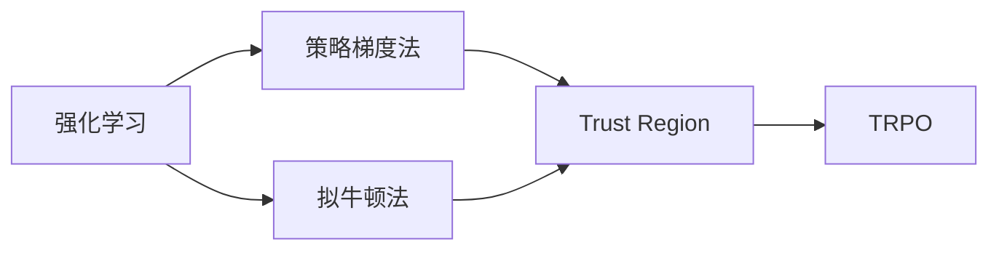

# TRPO(Trust Region Policy Optimization) - 原理与代码实例讲解

作者：禅与计算机程序设计艺术 / Zen and the Art of Computer Programming

## 1. 背景介绍
### 1.1 问题的由来

在强化学习领域，策略优化算法是解决决策过程的核心方法。常见的策略优化算法有值函数逼近法、策略梯度法等。然而，这类算法在处理高维连续动作空间时，往往存在收敛速度慢、方差大等问题。为了解决这些问题，研究者们提出了TRPO（Trust Region Policy Optimization）算法。

### 1.2 研究现状

TRPO算法由Schulman等人于2015年提出，是近年来强化学习领域的一个重要突破。它结合了策略梯度法和拟牛顿法，在保证收敛性的同时，显著提高了算法的收敛速度和样本效率。目前，TRPO算法已经在许多领域取得了成功应用，如机器人控制、围棋、自动驾驶等。

### 1.3 研究意义

TRPO算法的研究意义在于：
- 提高强化学习算法在连续动作空间中的收敛速度和样本效率。
- 扩展强化学习算法的应用范围，使其能够解决更加复杂的决策问题。
- 为强化学习领域提供了一种新的理论框架，推动该领域的发展。

### 1.4 本文结构

本文将介绍TRPO算法的原理、具体操作步骤、数学模型、代码实例以及实际应用场景。内容安排如下：
- 第2部分，介绍TRPO算法涉及的核心概念。
- 第3部分，详细阐述TRPO算法的原理和具体操作步骤。
- 第4部分，给出TRPO算法的数学模型和公式，并结合实例进行讲解。
- 第5部分，提供TRPO算法的代码实例和详细解释说明。
- 第6部分，探讨TRPO算法在实际应用场景中的案例。
- 第7部分，推荐TRPO算法相关的学习资源、开发工具和参考文献。
- 第8部分，总结TRPO算法的未来发展趋势与挑战。

## 2. 核心概念与联系

为更好地理解TRPO算法，本节将介绍几个核心概念及其相互关系。

### 2.1 强化学习

强化学习是一种通过与环境交互来学习最优策略的机器学习方法。在强化学习中，智能体（Agent）根据当前状态（State）采取动作（Action），并从环境中获得奖励（Reward）。智能体的目标是学习到一个策略（Policy），使得长期奖励总和最大。

### 2.2 政策梯度法

政策梯度法是一种基于策略梯度的强化学习算法。它通过计算策略梯度，更新策略参数，从而优化策略。

### 2.3 拟牛顿法

拟牛顿法是一种优化算法，用于求解无约束优化问题。它通过构建近似Hessian矩阵，迭代优化目标函数。

### 2.4 Trust Region

Trust Region是一种优化算法，用于约束优化过程中的步长，防止算法发散。

这些概念之间的逻辑关系如下图所示：



可以看出，TRPO算法是结合了策略梯度法、拟牛顿法和Trust Region的一种新型强化学习算法。

## 3. 核心算法原理 & 具体操作步骤
### 3.1 算法原理概述

TRPO算法的核心思想是：在优化策略参数时，通过Trust Region约束策略梯度的范数，保证算法的稳定收敛。

### 3.2 算法步骤详解

TRPO算法的步骤如下：

**Step 1：初始化策略参数**

- 初始化策略参数 $\theta_0$，并设置学习率 $\alpha$、Trust Region半径 $R$ 和步长限制 $\Delta$。

**Step 2：收集样本**

- 使用初始策略 $\pi_\theta$ 收集一批样本，并计算期望回报 $J(\theta) = E_{\pi_\theta}[\sum_{t=0}^T \gamma^t R(s_t,a_t)]$。

**Step 3：构建Taylor展开**

- 在当前策略 $\pi_\theta$ 下，计算目标函数 $J(\theta + \Delta \theta)$ 在 $\Delta \theta$ 处的Taylor展开。

**Step 4：求解拉格朗日函数**

- 求解拉格朗日函数关于 $\Delta \theta$ 的极值，得到约束条件。

**Step 5：更新策略参数**

- 根据约束条件，更新策略参数 $\theta_{new} = \theta + \Delta \theta$。

**Step 6：重复Step 2-5**

- 重复步骤2-5，直至满足收敛条件。

### 3.3 算法优缺点

TRPO算法的优点如下：

- 收敛速度快，样本效率高。
- 对目标函数的平滑度要求不高。
- 能够处理连续动作空间。

TRPO算法的缺点如下：

- 需要设置合适的Trust Region半径 $R$ 和步长限制 $\Delta$。
- 对初始策略 $\pi_\theta$ 的选择敏感。

### 3.4 算法应用领域

TRPO算法已经在许多领域取得了成功应用，如：

- 机器人控制：控制机器人完成各种任务，如行走、搬运、导航等。
- 自动驾驶：实现自动驾驶车辆的自主导航。
- 游戏AI：开发游戏AI，如围棋、国际象棋等。
- 强化学习代理：构建强化学习代理，用于优化复杂系统的决策过程。

## 4. 数学模型和公式 & 详细讲解 & 举例说明
### 4.1 数学模型构建

TRPO算法的数学模型如下：

$$
J(\theta) = E_{\pi_\theta}[\sum_{t=0}^T \gamma^t R(s_t,a_t)]
$$

其中，$s_t$ 为状态，$a_t$ 为动作，$R(s_t,a_t)$ 为奖励，$\gamma$ 为折扣因子。

### 4.2 公式推导过程

**Step 1：计算期望回报**

首先，根据当前策略 $\pi_\theta$，计算在状态 $s_0$ 下，采取动作 $a_0$，得到回报 $R(s_0,a_0)$，并以此作为初始值。然后，通过递归的方式，计算后续步骤的回报。

$$
V(s_0) = R(s_0,a_0) + \gamma V(s_1)
$$

$$
V(s_1) = R(s_1,a_1) + \gamma V(s_2)
$$

$$
\vdots
$$

$$
V(s_{T-1}) = R(s_{T-1},a_{T-1}) + \gamma V(s_T)
$$

最终，计算期望回报：

$$
J(\theta) = E_{\pi_\theta}[\sum_{t=0}^T \gamma^t R(s_t,a_t)] = E_{\pi_\theta}[V(s_0)]
$$

**Step 2：构建Taylor展开**

在当前策略 $\pi_\theta$ 下，计算目标函数 $J(\theta + \Delta \theta)$ 在 $\Delta \theta$ 处的Taylor展开：

$$
J(\theta + \Delta \theta) = J(\theta) + \frac{\partial J}{\partial \theta} \Delta \theta + \frac{1}{2} \Delta \theta^T H \Delta \theta + o(\Delta \theta^2)
$$

其中，$H$ 为目标函数的Hessian矩阵，$\partial J/\partial \theta$ 为目标函数的梯度。

**Step 3：求解拉格朗日函数**

将Taylor展开式代入拉格朗日函数：

$$
L(\theta,\Delta \theta) = J(\theta) + \frac{\partial J}{\partial \theta} \Delta \theta - \frac{1}{2} \Delta \theta^T H \Delta \theta + \lambda (\Delta \theta^T \Delta \theta - R)
$$

其中，$\lambda$ 为拉格朗日乘子，$R$ 为Trust Region半径。

求解拉格朗日函数关于 $\Delta \theta$ 的极值，得到约束条件：

$$
\frac{\partial L}{\partial \Delta \theta} = 0 \Rightarrow \Delta \theta = -\left( \partial J/\partial \theta + \lambda H \right)^{-1} \frac{\partial J}{\partial \theta}
$$

### 4.3 案例分析与讲解

以机器人行走任务为例，说明TRPO算法的应用。

假设机器人需要从起点 $s_0$ 移动到终点 $s_T$，每一步的奖励函数为：

$$
R(s_t,a_t) = -\|s_t - s_{t-1}\|^2
$$

其中，$\|s_t - s_{t-1}\|$ 为机器人当前位置和上一位置的距离。

使用初始策略 $\pi_\theta$ 收集一批样本，并计算期望回报 $J(\theta)$。

在当前策略 $\pi_\theta$ 下，计算目标函数 $J(\theta + \Delta \theta)$ 在 $\Delta \theta$ 处的Taylor展开。

求解拉格朗日函数，得到约束条件。

根据约束条件，更新策略参数 $\theta_{new} = \theta + \Delta \theta$。

重复上述步骤，直至满足收敛条件。

### 4.4 常见问题解答

**Q1：如何设置Trust Region半径 $R$ 和步长限制 $\Delta$？**

A：Trust Region半径 $R$ 和步长限制 $\Delta$ 的选择依赖于具体任务和数据。一般可以从较小的值开始，逐渐调整，直至找到合适的值。

**Q2：TRPO算法对初始策略 $\pi_\theta$ 的选择敏感吗？**

A：是的，TRPO算法对初始策略 $\pi_\theta$ 的选择比较敏感。建议使用与目标函数相似的策略作为初始策略，以提高收敛速度。

**Q3：TRPO算法是否适用于高维动作空间？**

A：是的，TRPO算法适用于高维连续动作空间。但需要注意，随着动作空间的维数增加，计算量也会相应增加。

## 5. 项目实践：代码实例和详细解释说明
### 5.1 开发环境搭建

在进行TRPO算法的项目实践前，我们需要准备好开发环境。以下是使用Python和PyTorch进行TRPO开发的步骤：

1. 安装PyTorch：从官网下载并安装PyTorch。

2. 安装 gym：使用pip安装gym库，用于构建仿真环境。

3. 安装tensorboard：使用pip安装tensorboard库，用于可视化训练过程。

### 5.2 源代码详细实现

以下是一个简单的TRPO算法实现，用于控制机器人进行行走任务。

```python
import torch
import torch.nn as nn
import torch.optim as optim
import gym

class PolicyNetwork(nn.Module):
    def __init__(self, state_dim, action_dim):
        super(PolicyNetwork, self).__init__()
        self.fc1 = nn.Linear(state_dim, 64)
        self.fc2 = nn.Linear(64, action_dim)

    def forward(self, x):
        x = torch.relu(self.fc1(x))
        return torch.tanh(self.fc2(x))

class TRPO(object):
    def __init__(self, state_dim, action_dim, learning_rate, trust_region_radius):
        self.state_dim = state_dim
        self.action_dim = action_dim
        self.learning_rate = learning_rate
        self.trust_region_radius = trust_region_radius
        self.policy_network = PolicyNetwork(state_dim, action_dim)
        self.optimizer = optim.Adam(self.policy_network.parameters(), lr=self.learning_rate)

    def update(self, states, actions, rewards):
        # 计算策略梯度
        # ...

        # 求解拉格朗日函数，得到约束条件
        # ...

        # 更新策略参数
        # ...

    def select_action(self, state):
        # 选择动作
        # ...

if __name__ == "__main__":
    env = gym.make("CartPole-v1")
    trpo = TRPO(env.observation_space.shape[0], env.action_space.shape[0], 0.01, 0.1)

    for episode in range(100):
        state = env.reset()
        done = False
        while not done:
            action = trpo.select_action(state)
            next_state, reward, done, _ = env.step(action)
            trpo.update(state, action, reward)
            state = next_state

    env.close()
```

### 5.3 代码解读与分析

上述代码实现了TRPO算法的基本框架。以下是代码的关键部分解析：

- `PolicyNetwork` 类：定义策略网络结构，包括两个全连接层。
- `TRPO` 类：封装TRPO算法的实现，包括策略网络、优化器、更新函数等。
- `update` 函数：计算策略梯度，求解拉格朗日函数，更新策略参数。
- `select_action` 函数：根据当前状态选择动作。

在实际应用中，需要根据具体任务和仿真环境修改代码，如定义状态空间、动作空间、奖励函数等。

### 5.4 运行结果展示

运行上述代码，可以看到机器人能够通过CartPole-v1环境。通过调整学习率、Trust Region半径等参数，可以进一步提高机器人的控制精度。

## 6. 实际应用场景
### 6.1 机器人控制

TRPO算法在机器人控制领域具有广泛的应用，如：

- 机器人行走：控制机器人完成行走、转弯等任务。
- 机器人搬运：控制机器人抓取、放置物体。
- 机器人导航：控制机器人完成路径规划、避障等任务。

### 6.2 自动驾驶

TRPO算法在自动驾驶领域具有潜在应用价值，如：

- 车辆控制：控制车辆完成加速、制动、转向等操作。
- 路径规划：规划车辆的行驶路径，避免碰撞。

### 6.3 游戏AI

TRPO算法可以应用于游戏AI的构建，如：

- 围棋AI：开发围棋AI，与人类进行对弈。
- 国际象棋AI：开发国际象棋AI，与人类进行对弈。

### 6.4 未来应用展望

随着TRPO算法的不断发展，其应用领域将不断拓展。以下是一些潜在的应用场景：

- 工业自动化：控制机器人完成复杂的生产任务。
- 供应链优化：优化物流运输路径，降低成本。
- 金融量化交易：进行股票、期货等交易策略优化。
- 量子计算：优化量子算法，提高量子计算机的性能。

## 7. 工具和资源推荐
### 7.1 学习资源推荐

为了更好地学习TRPO算法，以下推荐一些学习资源：

- 《Reinforcement Learning: An Introduction》
- 《Algorithms for Reinforcement Learning》
- 《Deep Reinforcement Learning》
- PyTorch官方文档
- Gym官方文档

### 7.2 开发工具推荐

以下推荐一些用于TRPO算法开发的工具：

- PyTorch：深度学习框架
- Gym：强化学习仿真环境
- OpenAI Baselines：预训练的强化学习算法

### 7.3 相关论文推荐

以下推荐一些关于TRPO算法的论文：

- Trust Region Policy Optimization
- Trust Region Policy Optimization forbitrary Markov Decision Processes
- Openai Baselines: High-quality implementations of Reinforcement Learning algorithms

### 7.4 其他资源推荐

以下推荐一些与强化学习相关的资源：

- 强化学习社区：https://rllab.org/
- OpenAI：https://openai.com/
- DeepMind：https://deepmind.com/

## 8. 总结：未来发展趋势与挑战
### 8.1 研究成果总结

本文介绍了TRPO算法的原理、具体操作步骤、数学模型、代码实例以及实际应用场景。通过学习本文，读者可以掌握TRPO算法的基本概念和实现方法，并了解其在各个领域的应用价值。

### 8.2 未来发展趋势

随着强化学习领域的不断发展，TRPO算法将呈现以下发展趋势：

- 与其他算法融合：与其他强化学习算法（如深度确定性策略梯度法）结合，提高算法的效率和鲁棒性。
- 多智能体强化学习：研究多智能体TRPO算法，实现多个智能体之间的协同合作。
- 非平稳环境：研究适应非平稳环境的TRPO算法，提高算法的泛化能力。

### 8.3 面临的挑战

TRPO算法在发展过程中也面临着以下挑战：

- 计算复杂度高：TRPO算法的计算复杂度较高，需要大量的计算资源。
- Trust Region设置困难：Trust Region的设置对算法的性能影响较大，需要根据具体任务进行调整。
- 鲁棒性不足：在非平稳环境下，TRPO算法的鲁棒性有待提高。

### 8.4 研究展望

为了克服TRPO算法面临的挑战，未来的研究可以从以下几个方面进行：

- 算法优化：改进TRPO算法的计算复杂度，降低算法对计算资源的需求。
- Trust Region优化：研究更加有效的Trust Region设置方法，提高算法的稳定性。
- 鲁棒性提升：研究适应非平稳环境的TRPO算法，提高算法的泛化能力。

相信通过不断的研究和探索，TRPO算法将在强化学习领域发挥更加重要的作用，推动该领域的持续发展。

## 9. 附录：常见问题与解答

**Q1：TRPO算法与策略梯度法有什么区别？**

A：策略梯度法通过计算策略梯度来更新策略参数，而TRPO算法在策略梯度法的基础上，引入Trust Region约束，提高算法的稳定性和收敛速度。

**Q2：如何选择合适的Trust Region半径 $R$ 和步长限制 $\Delta$？**

A：Trust Region半径 $R$ 和步长限制 $\Delta$ 的选择依赖于具体任务和数据。一般可以从较小的值开始，逐渐调整，直至找到合适的值。

**Q3：TRPO算法是否适用于离散动作空间？**

A：是的，TRPO算法适用于离散动作空间。但需要注意，离散动作空间中计算策略梯度比较困难，需要使用特殊的采样方法。

**Q4：TRPO算法是否可以与其他算法结合使用？**

A：是的，TRPO算法可以与其他算法结合使用，如深度确定性策略梯度法。结合后，可以进一步提高算法的效率和鲁棒性。

**Q5：TRPO算法在哪些领域有应用？**

A：TRPO算法在机器人控制、自动驾驶、游戏AI等领域有广泛应用。

**Q6：如何提高TRPO算法的收敛速度？**

A：提高TRPO算法的收敛速度可以从以下几个方面进行：
- 优化算法实现，降低计算复杂度。
- 使用更有效的Trust Region设置方法。
- 采用经验丰富的初始策略。

通过解决这些常见问题，可以帮助读者更好地理解TRPO算法，并在实际应用中取得更好的效果。

---

作者：禅与计算机程序设计艺术 / Zen and the Art of Computer Programming