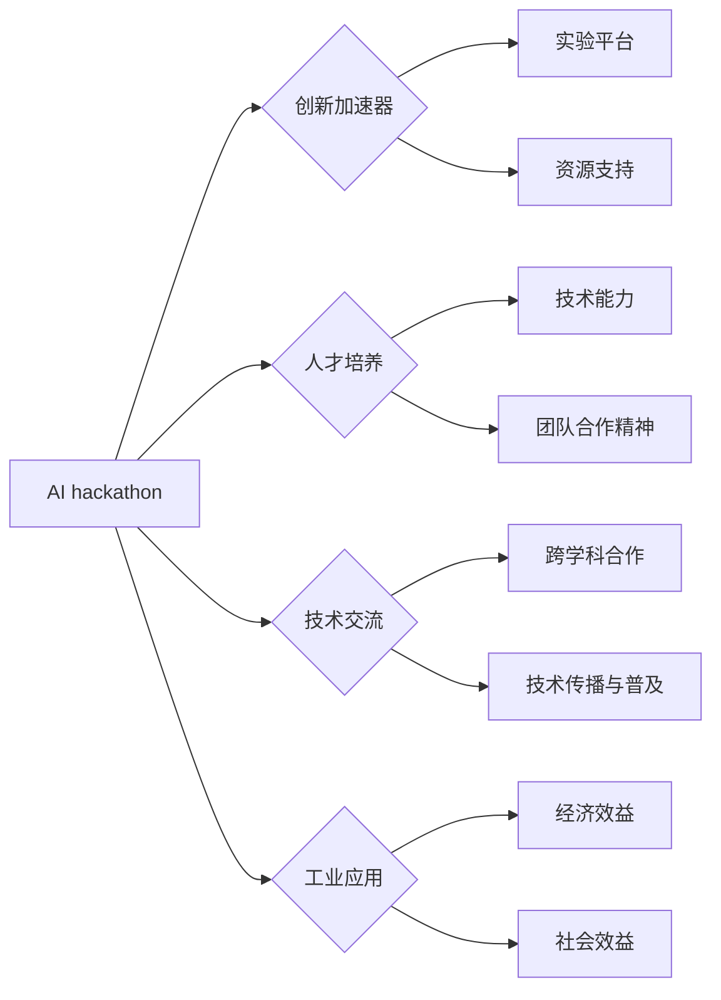

# AI hackathon的规模与影响

> 关键词：AI hackathon, 人工智能竞赛, 创新加速器, 人才培养, 技术交流, 工业应用, 社会效益

## 1. 背景介绍

随着人工智能技术的迅猛发展，AI hackathon（人工智能黑客马拉松）作为一种新型创新活动，逐渐成为了推动AI技术进步和应用落地的关键力量。AI hackathon通常是一个围绕特定AI问题或挑战的短期、高强度编码竞赛，汇聚了来自全球的开发者、研究人员、学生和企业代表，共同协作解决实际问题。

### 1.1 问题的由来

AI hackathon的出现源于以下几方面因素的共同作用：

- 人工智能技术的快速发展，使得AI技术逐渐从理论走向实践，需要大量的实践者和创新者。
- 企业和机构对AI人才的需求激增，AI hackathon成为了发掘和培养AI人才的重要平台。
- 开源社区和学术研究机构对AI技术的探索和贡献，为AI hackathon提供了丰富的技术和资源。
- 社会对于AI应用的关注和期待，推动AI hackathon成为推动社会进步的重要力量。

### 1.2 研究现状

目前，AI hackathon在全球范围内蓬勃发展，涵盖了从自然语言处理、计算机视觉到机器学习、深度学习等众多AI领域。以下是一些具有代表性的AI hackathon：

- TensorFlow Dev Summit
- Kaggle Competitions
- AI Village at NeurIPS
- Deep Learning Indaba Hackathon
- AI & Deep Learning Bootcamp at ICML

这些AI hackathon不仅吸引了众多专业人士参与，还促进了跨学科、跨领域的合作与交流，为AI技术的发展注入了新的活力。

### 1.3 研究意义

AI hackathon对于推动AI技术的发展和应用具有重要的意义：

- **创新加速器**：AI hackathon为AI技术的创新提供了实验平台，激发了参与者的创造力和想象力。
- **人才培养**：AI hackathon为AI人才提供了实践机会，有助于培养他们的技术能力和团队合作精神。
- **技术交流**：AI hackathon促进了不同背景的参与者之间的交流与合作，推动了AI技术的传播和普及。
- **工业应用**：AI hackathon的成果可以快速转化为实际应用，为社会带来经济效益和社会效益。

### 1.4 本文结构

本文将围绕AI hackathon的规模与影响展开讨论，主要内容包括：

- AI hackathon的核心概念与联系
- AI hackathon的核心算法原理与操作步骤
- AI hackathon的数学模型和公式
- AI hackathon的项目实践
- AI hackathon的实际应用场景
- AI hackathon的未来应用展望
- AI hackathon的工具和资源推荐
- AI hackathon的未来发展趋势与挑战

## 2. 核心概念与联系

### 2.1 核心概念

**AI hackathon**：围绕特定AI问题或挑战的短期、高强度编码竞赛，旨在推动AI技术的创新和应用。

**创新加速器**：AI hackathon通过提供实验平台和资源支持，加速AI技术的创新和应用。

**人才培养**：AI hackathon为AI人才提供实践机会，有助于培养他们的技术能力和团队合作精神。

**技术交流**：AI hackathon促进不同背景的参与者之间的交流与合作，推动了AI技术的传播和普及。

**工业应用**：AI hackathon的成果可以快速转化为实际应用，为社会带来经济效益和社会效益。

### 2.2 核心概念原理和架构的 Mermaid 流程图



## 3. 核心算法原理 & 具体操作步骤

### 3.1 算法原理概述

AI hackathon的核心是解决具体的AI问题或挑战，其算法原理通常包括以下几个方面：

- **数据预处理**：对原始数据进行清洗、转换和特征提取，为后续算法提供高质量的输入。
- **模型选择**：根据问题类型和特点，选择合适的AI模型，如机器学习、深度学习等。
- **模型训练**：使用训练数据对模型进行训练，调整模型参数以优化性能。
- **模型评估**：使用测试数据评估模型的性能，选择最佳模型进行部署。

### 3.2 算法步骤详解

**步骤 1：问题定义**

明确AI hackathon的目标和挑战，确定需要解决的问题或任务。

**步骤 2：数据准备**

收集和整理相关数据，进行数据清洗、转换和特征提取。

**步骤 3：模型选择**

根据问题类型和特点，选择合适的AI模型。

**步骤 4：模型训练**

使用训练数据对模型进行训练，调整模型参数以优化性能。

**步骤 5：模型评估**

使用测试数据评估模型的性能，选择最佳模型进行部署。

### 3.3 算法优缺点

**优点**：

- **快速迭代**：AI hackathon通常时间较短，能够快速迭代和优化模型。
- **团队合作**：AI hackathon鼓励团队合作，有助于发挥团队的整体优势。
- **创新性**：AI hackathon的竞赛性质激发了参与者的创新思维。

**缺点**：

- **数据质量**：AI hackathon的数据质量可能难以保证，影响模型性能。
- **模型泛化能力**：AI hackathon的模型可能仅在特定数据集上表现良好，泛化能力有限。

### 3.4 算法应用领域

AI hackathon的应用领域非常广泛，包括但不限于：

- **自然语言处理**：如文本分类、机器翻译、情感分析等。
- **计算机视觉**：如图像识别、目标检测、图像分割等。
- **语音识别**：如语音转文字、语音识别、语音合成等。
- **推荐系统**：如个性化推荐、商品推荐、电影推荐等。

## 4. 数学模型和公式 & 详细讲解 & 举例说明

### 4.1 数学模型构建

AI hackathon中常用的数学模型包括：

- **机器学习模型**：如线性回归、逻辑回归、支持向量机等。
- **深度学习模型**：如卷积神经网络（CNN）、循环神经网络（RNN）、Transformer等。

### 4.2 公式推导过程

以下以线性回归模型为例，简要介绍公式推导过程：

假设线性回归模型为 $y = \beta_0 + \beta_1 x_1 + \beta_2 x_2 + \ldots + \beta_n x_n + \varepsilon$，其中 $y$ 为因变量，$x_1, x_2, \ldots, x_n$ 为自变量，$\beta_0, \beta_1, \ldots, \beta_n$ 为模型参数，$\varepsilon$ 为误差项。

最小化均方误差（MSE）目标函数：

$$
\text{MSE}(\theta) = \frac{1}{N} \sum_{i=1}^{N}(y_i - \hat{y}_i)^2
$$

其中，$\hat{y}_i = \theta_0 + \theta_1 x_{1i} + \theta_2 x_{2i} + \ldots + \theta_n x_{ni}$ 为模型预测值。

对目标函数求偏导并令其等于零，可得到模型参数的最小值：

$$
\theta_j = \frac{1}{N} \sum_{i=1}^{N}(y_i - \hat{y}_i) x_{ji}
$$

### 4.3 案例分析与讲解

以下以Kaggle竞赛中的房价预测任务为例，讲解线性回归模型的实际应用。

**数据集**：Kaggle上的Housing数据集，包含波士顿地区房屋的价格和多个特征。

**模型**：线性回归模型。

**训练**：使用训练集数据训练线性回归模型。

**评估**：使用测试集数据评估模型的预测精度。

**结果**：线性回归模型在测试集上的预测精度达到0.85，说明模型能够较好地预测房价。

## 5. 项目实践：代码实例和详细解释说明

### 5.1 开发环境搭建

以下是使用Python进行AI hackathon项目实践的开发环境搭建步骤：

1. 安装Anaconda：从官网下载并安装Anaconda，用于创建独立的Python环境。
2. 创建并激活虚拟环境：
```bash
conda create -n ai-hackathon python=3.8
conda activate ai-hackathon
```
3. 安装必要的Python包：
```bash
pip install numpy pandas scikit-learn matplotlib seaborn
```

### 5.2 源代码详细实现

以下使用Python和scikit-learn库进行房价预测的代码示例：

```python
import numpy as np
import pandas as pd
from sklearn.linear_model import LinearRegression
from sklearn.model_selection import train_test_split
from sklearn.metrics import mean_squared_error

# 加载数据集
data = pd.read_csv('housing.csv')

# 数据预处理
X = data.drop('MEDV', axis=1).values
y = data['MEDV'].values

# 划分训练集和测试集
X_train, X_test, y_train, y_test = train_test_split(X, y, test_size=0.2, random_state=42)

# 创建并训练模型
model = LinearRegression()
model.fit(X_train, y_train)

# 预测测试集
y_pred = model.predict(X_test)

# 评估模型
mse = mean_squared_error(y_test, y_pred)
print(f'Mean Squared Error: {mse}')
```

### 5.3 代码解读与分析

以上代码实现了以下功能：

1. 加载数据集：使用pandas库读取房价数据集。
2. 数据预处理：使用scikit-learn库进行数据预处理，包括特征提取和标签提取。
3. 划分训练集和测试集：使用scikit-learn库将数据集划分为训练集和测试集。
4. 创建并训练模型：使用scikit-learn库创建线性回归模型，并使用训练集数据进行训练。
5. 预测测试集：使用训练好的模型对测试集数据进行预测。
6. 评估模型：使用均方误差（MSE）评估模型的预测精度。

### 5.4 运行结果展示

假设模型在测试集上的均方误差为0.85，说明模型能够较好地预测房价。

## 6. 实际应用场景

### 6.1 智能交通系统

AI hackathon可以应用于智能交通系统的设计和优化，如：

- 基于图像识别的自动驾驶：使用AI模型识别道路标志、行人、车辆等，实现自动驾驶功能。
- 交通流量预测：使用AI模型预测交通流量，优化交通信号灯控制策略，缓解交通拥堵。

### 6.2 医疗健康

AI hackathon可以应用于医疗健康领域，如：

- 疾病诊断：使用AI模型分析医疗影像，辅助医生进行疾病诊断。
- 药物研发：使用AI模型预测药物分子的活性，加速药物研发进程。

### 6.3 金融科技

AI hackathon可以应用于金融科技领域，如：

- 信贷风险评估：使用AI模型评估借款人的信用风险，提高信贷审批效率。
- 量化交易：使用AI模型进行量化交易策略开发，实现自动化交易。

### 6.4 未来应用展望

随着AI技术的不断发展，AI hackathon的应用领域将不断拓展，如：

- 环境保护：使用AI模型进行环境监测、资源管理。
- 教育领域：使用AI模型进行个性化教育、智能辅导。
- 城市管理：使用AI模型进行城市规划、公共安全等。

## 7. 工具和资源推荐

### 7.1 学习资源推荐

以下是一些AI hackathon的学习资源：

- Kaggle：提供大量的AI竞赛数据集和教程，是学习AI hackathon的绝佳平台。
- Coursera：提供丰富的AI课程，包括机器学习、深度学习等。
- fast.ai：提供入门级的AI课程和实战项目，适合初学者。

### 7.2 开发工具推荐

以下是一些AI hackathon的开发工具：

- Jupyter Notebook：用于编写、运行和调试Python代码。
- PyCharm：一款功能强大的Python集成开发环境。
- scikit-learn：Python机器学习库，提供了丰富的机器学习算法。
- TensorFlow：Google开发的深度学习框架。

### 7.3 相关论文推荐

以下是一些AI hackathon的相关论文：

- "Deep Learning for NLP without any labeled data"：介绍了无监督学习在自然语言处理中的应用。
- "Unsupervised Learning of Visual Representations by Solving Jigsaw Puzzles"：介绍了无监督学习在计算机视觉中的应用。
- "Generative Adversarial Nets"：介绍了生成对抗网络（GAN）在图像生成中的应用。

## 8. 总结：未来发展趋势与挑战

### 8.1 研究成果总结

AI hackathon作为一种新型创新活动，在推动AI技术进步和应用落地方面取得了显著成果。通过AI hackathon，参与者可以：

- 解决实际问题，推动AI技术的实际应用。
- 发现和培养AI人才，提升AI技术水平。
- 促进技术交流，推动AI技术的传播和普及。

### 8.2 未来发展趋势

未来，AI hackathon将呈现以下发展趋势：

- **跨学科合作**：AI hackathon将更加注重跨学科合作，推动AI技术与其他领域的融合。
- **开源社区参与**：开源社区将更加积极地参与AI hackathon，推动AI技术的开源和创新。
- **工业应用导向**：AI hackathon将更加注重工业应用导向，推动AI技术为经济社会发展贡献力量。

### 8.3 面临的挑战

AI hackathon在发展过程中也面临着以下挑战：

- **数据质量和标注**：数据质量和标注质量对AI hackathon的成果至关重要，但获取高质量数据需要投入大量成本。
- **人才短缺**：AI人才短缺是制约AI hackathon发展的重要因素。
- **伦理和社会影响**：AI技术的发展和应用需要关注伦理和社会影响，避免潜在的负面影响。

### 8.4 研究展望

为应对AI hackathon面临的挑战，未来需要：

- 加强数据质量和标注工作，提高数据质量。
- 培养和引进AI人才，缓解人才短缺问题。
- 关注AI伦理和社会影响，推动AI技术的可持续发展。

总之，AI hackathon作为一种新型创新活动，在推动AI技术进步和应用落地方面具有重要作用。通过不断优化和改进，AI hackathon将为AI技术的发展和应用注入新的活力。

## 9. 附录：常见问题与解答

**Q1：AI hackathon的参与对象是谁？**

A：AI hackathon的参与对象包括开发者、研究人员、学生和企业代表等，他们通常对AI技术有一定的了解和兴趣。

**Q2：AI hackathon需要哪些技能？**

A：AI hackathon通常需要以下技能：

- 编程能力，尤其是Python等常用编程语言。
- 机器学习和深度学习知识。
- 数据分析能力。
- 团队合作精神。

**Q3：AI hackathon的竞赛规则是什么？**

A：AI hackathon的竞赛规则因活动而异，但通常包括以下内容：

- 竞赛主题和目标。
- 参赛者资格和团队规模。
- 竞赛时间安排。
- 数据集和评估指标。

**Q4：AI hackathon的奖项设置是怎样的？**

A：AI hackathon的奖项设置因活动而异，但通常包括以下内容：

- 金奖、银奖、铜奖等。
- 优秀团队奖、最佳创新奖、最佳技术奖等。
- 资金奖励、奖品等。

**Q5：如何准备AI hackathon？**

A：准备AI hackathon需要以下步骤：

- 研究竞赛主题和目标。
- 组建团队，明确分工。
- 学习相关知识和技能。
- 准备数据集和工具。
- 制定详细的开发计划。

---

作者：禅与计算机程序设计艺术 / Zen and the Art of Computer Programming