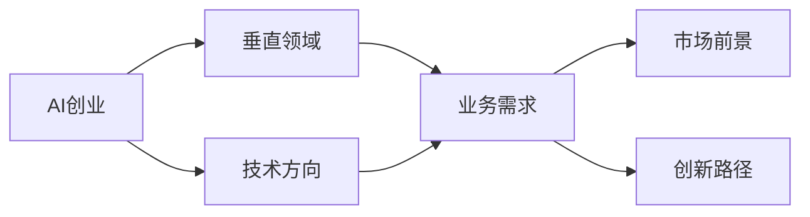
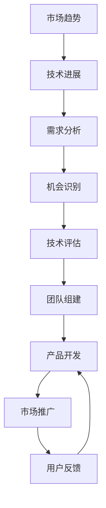
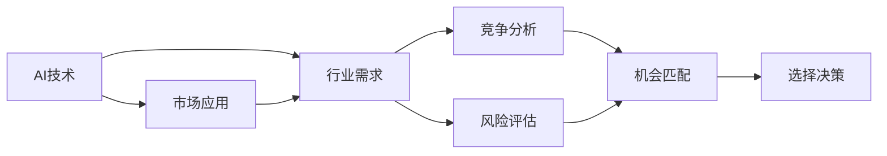
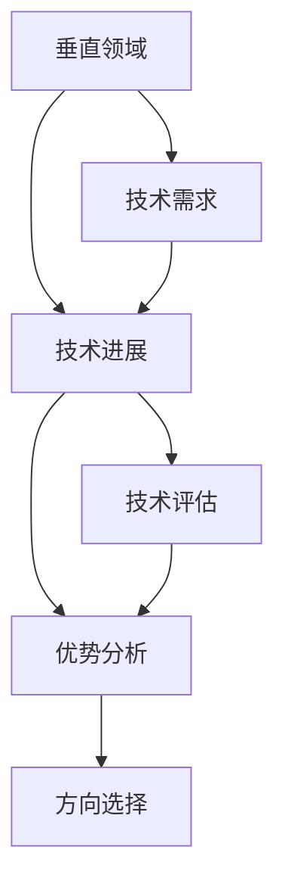
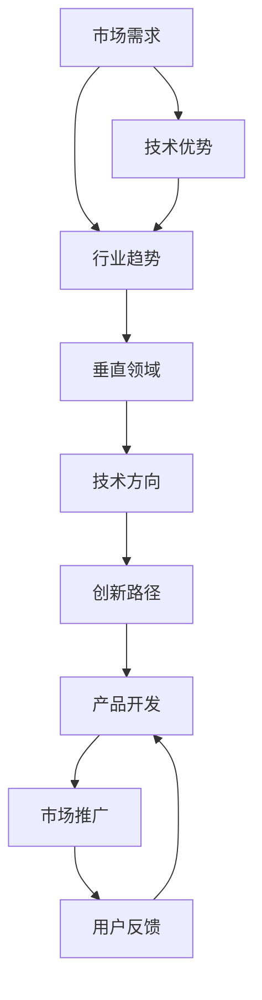

                 

# AI创业者的选择 : 垂直领域的无限可能

> 关键词：AI创业, 垂直领域, 技术方向, 业务需求, 市场前景, 创新路径

## 1. 背景介绍

### 1.1 问题由来
人工智能(AI)技术的迅猛发展，为创业者提供了前所未有的机会。从深度学习到自然语言处理，从计算机视觉到机器人学，AI技术正在不断渗透到各个垂直领域，催生出众多创新应用。对于AI创业者来说，如何在这片充满机遇的广袤天地中寻找自己的方向，选择最适合自己的业务领域，成为一道重要的课题。

### 1.2 问题核心关键点
AI创业的关键在于找到与自身技术专长、业务兴趣以及市场需求相匹配的垂直领域。这不仅要求创业者具备跨学科知识，更需具备洞察行业趋势和市场变化的能力。本文将从多个角度探讨AI创业者的选择策略，帮助读者在纷繁的AI技术中选择最适合自己的领域。

### 1.3 问题研究意义
对于AI创业者来说，选择一个正确的垂直领域，不仅能最大化发挥自身技术优势，还能有效降低创业风险，加速产品开发，快速赢得市场。正确的方向选择，是AI技术成功商业化的第一步。本文旨在深入分析不同垂直领域的现状、需求和发展潜力，为AI创业者提供策略建议和方向指引。

## 2. 核心概念与联系

### 2.1 核心概念概述

为更好地理解AI创业者的选择策略，本节将介绍几个密切相关的核心概念：

- AI创业：通过应用人工智能技术解决实际问题的创新创业活动。
- 垂直领域：特定的行业或技术领域，如医疗、金融、教育等。
- 技术方向：AI技术的细分领域，如计算机视觉、自然语言处理、机器学习等。
- 业务需求：企业在AI应用中寻求解决的具体问题和期望目标。
- 市场前景：AI技术在该领域的应用前景和发展潜力。
- 创新路径：AI技术在特定领域实现商业化的具体方法和步骤。

这些核心概念之间的逻辑关系可以通过以下Mermaid流程图来展示：



这个流程图展示了这个选择过程的核心逻辑：AI创业者首先需要选择合适的垂直领域，然后根据该领域的技术需求和业务目标，选择合适的技术方向，最后结合市场需求，制定出可行的创新路径。

### 2.2 概念间的关系

这些核心概念之间存在着紧密的联系，形成了AI创业的完整生态系统。下面我们通过几个Mermaid流程图来展示这些概念之间的关系。

#### 2.2.1 AI创业的基本框架



这个流程图展示了AI创业的基本流程：从市场趋势和技术进展出发，分析市场需求和机会，评估可用技术，组建团队，开发产品，推广市场，收集用户反馈，然后迭代改进产品。

#### 2.2.2 垂直领域的选择



这个流程图展示了选择垂直领域的过程：从AI技术出发，分析市场需求，进行竞争分析和风险评估，匹配市场机会，并最终做出选择决策。

#### 2.2.3 技术方向的选择



这个流程图展示了在特定垂直领域中选择技术方向的过程：根据行业需求和可用技术，评估技术优势，并进行方向选择。

### 2.3 核心概念的整体架构

最后，我们用一个综合的流程图来展示这些核心概念在AI创业选择过程中的整体架构：



这个综合流程图展示了从市场需求出发，识别技术优势，选择垂直领域，确定技术方向，制定创新路径，开发产品，推广市场，收集用户反馈的完整过程。通过这个架构，我们可以更清晰地理解AI创业选择过程中的各个关键环节。

## 3. 核心算法原理 & 具体操作步骤
### 3.1 算法原理概述

AI创业者的选择过程，虽然不像机器学习算法那样有明确的数学模型，但其背后的原理和操作流程仍然具有一定的相似性。一个有效的AI创业选择策略，需要综合考虑市场需求、技术成熟度、竞争态势等多方面因素，形成一套科学的决策模型。

### 3.2 算法步骤详解

以下我们将详细介绍AI创业者选择垂直领域、技术方向和创新路径的具体操作步骤：

**Step 1: 需求分析**
- 收集目标市场的需求数据，包括但不限于用户痛点、市场规模、增长潜力等。
- 进行市场调研和用户访谈，深入了解用户需求和痛点。
- 分析竞争对手，了解其产品和服务，评估市场空缺。

**Step 2: 技术评估**
- 评估现有技术的成熟度和可行性，包括技术难度、可实现性、技术成本等。
- 分析现有技术的优势和劣势，确定其是否适合解决特定问题。
- 探索潜在的技术创新点，寻找突破口。

**Step 3: 机会识别**
- 结合市场需求和技术评估，识别潜在的创业机会。
- 分析市场需求和技术发展趋势，判断机会的可持续性和发展潜力。
- 筛选出具有竞争优势和市场前景的项目。

**Step 4: 方向选择**
- 根据市场需求、技术优势和机会识别结果，选择最符合自身特点和能力的技术方向。
- 结合行业趋势和自身优势，制定可行的创新路径。
- 制定具体的市场进入策略和推广方案。

**Step 5: 团队组建**
- 根据项目需求和方向选择，组建合适的技术团队和管理团队。
- 明确团队成员的职责和分工，确保高效协作。

**Step 6: 产品开发**
- 根据技术方向和市场需求，制定产品开发计划。
- 进行原型开发和用户测试，不断优化产品功能。
- 制定产品上市策略，进行市场推广。

**Step 7: 市场推广**
- 根据产品特点和市场需求，选择适合的营销渠道和策略。
- 制定详细的推广计划，确保营销效果。

**Step 8: 用户反馈**
- 收集用户反馈，了解产品使用情况和用户需求。
- 分析用户反馈，进行产品迭代和改进。
- 持续优化产品和服务，提高用户满意度和市场竞争力。

### 3.3 算法优缺点

AI创业者的选择策略具有以下优点：
1. 数据驱动决策：通过收集和分析市场需求数据，确保选择方向符合实际需求。
2. 技术优势明确：根据现有技术的成熟度和优势，选择合适的创新方向。
3. 竞争态势清晰：通过分析竞争对手，了解市场空缺和竞争态势。
4. 机会识别准确：结合市场需求和技术评估，识别具有潜力的创业机会。

同时，该策略也存在一些缺点：
1. 对市场需求敏感：市场需求的快速变化可能导致方向选择的不确定性。
2. 技术评估复杂：现有技术的评估和创新点的寻找可能耗时耗力。
3. 竞争态势多变：竞争对手的策略调整可能影响市场竞争格局。
4. 用户反馈滞后：用户反馈的收集和分析可能存在延迟。

尽管存在这些局限性，但通过科学的方法论和合理的风险管理，这些缺点可以有效地被规避和解决。

### 3.4 算法应用领域

基于AI创业者的选择策略，已经在多个领域得到广泛应用，例如：

- 医疗健康：AI技术在医疗影像分析、疾病预测、个性化诊疗等方面具有广泛的应用前景。
- 金融服务：AI技术在信用评估、风险控制、智能投顾等方面具有独特的优势。
- 教育培训：AI技术在智能推荐、内容生成、个性化学习等方面具有潜在的创新空间。
- 智能制造：AI技术在生产自动化、质量检测、供应链优化等方面具有巨大的市场潜力。
- 零售电商：AI技术在个性化推荐、库存管理、客户服务等方面具有显著的应用效果。

这些领域不仅具有良好的市场需求和发展潜力，而且AI技术能够显著提升产业效率和用户体验。因此，AI创业者在这些领域具有广阔的发展空间。

## 4. 数学模型和公式 & 详细讲解  
### 4.1 数学模型构建

在AI创业者的选择过程中，虽然没有明确的数学模型，但可以通过一些指标和方法来进行定量和定性分析。

定义市场需求为 $D$，技术成熟度为 $T$，竞争态势为 $C$，机会识别结果为 $O$。我们可以构建一个简单的评估模型：

$$
S = \alpha_D \cdot D + \alpha_T \cdot T + \alpha_C \cdot C + \alpha_O \cdot O
$$

其中 $\alpha_D, \alpha_T, \alpha_C, \alpha_O$ 为各个指标的权重，$S$ 表示AI创业者的选择得分。

### 4.2 公式推导过程

在实际应用中，各指标的权重需要根据具体情况进行调整。假设 $D$ 和 $T$ 为定性指标，$C$ 和 $O$ 为定量指标。我们可以进一步细化模型：

$$
D = D_{需求} \cdot 1 + D_{趋势} \cdot 0.5
$$

$$
T = T_{成熟} \cdot 1 + T_{创新} \cdot 0.5
$$

$$
C = C_{竞争} \cdot 1 + C_{动态} \cdot 0.5
$$

$$
O = O_{潜力} \cdot 1 + O_{可持续} \cdot 0.5
$$

其中 $D_{需求}, D_{趋势}, T_{成熟}, T_{创新}, C_{竞争}, C_{动态}, O_{潜力}, O_{可持续}$ 为具体的评估指标。

将上述公式代入总体模型：

$$
S = \alpha_D \cdot (D_{需求} \cdot 1 + D_{趋势} \cdot 0.5) + \alpha_T \cdot (T_{成熟} \cdot 1 + T_{创新} \cdot 0.5) + \alpha_C \cdot (C_{竞争} \cdot 1 + C_{动态} \cdot 0.5) + \alpha_O \cdot (O_{潜力} \cdot 1 + O_{可持续} \cdot 0.5)
$$

$$
S = (\alpha_D \cdot D_{需求} + \alpha_D \cdot D_{趋势} \cdot 0.5) + (\alpha_T \cdot T_{成熟} + \alpha_T \cdot T_{创新} \cdot 0.5) + (\alpha_C \cdot C_{竞争} + \alpha_C \cdot C_{动态} \cdot 0.5) + (\alpha_O \cdot O_{潜力} + \alpha_O \cdot O_{可持续} \cdot 0.5)
$$

通过该模型，我们可以根据具体需求和指标，计算出AI创业者的选择得分，进而做出科学的选择决策。

### 4.3 案例分析与讲解

以下我们以医疗健康领域的AI创业为例，详细讲解其选择过程：

**Step 1: 需求分析**
- 收集医疗健康领域的数据，了解用户需求。
- 分析市场需求和市场规模，评估其增长潜力。

**Step 2: 技术评估**
- 评估现有技术的成熟度，如医学影像分析、疾病预测等。
- 分析技术优势和劣势，确定其可行性。

**Step 3: 机会识别**
- 识别医疗健康领域的需求空缺，如远程诊疗、药物研发等。
- 分析市场需求和技术发展趋势，判断机会的可持续性。

**Step 4: 方向选择**
- 根据市场需求和技术评估，选择最符合自身特点和能力的技术方向，如医学影像分析。
- 制定可行的创新路径，如基于AI的影像自动分析系统。

**Step 5: 团队组建**
- 根据项目需求，组建技术团队和管理团队，如数据科学家、软件工程师等。
- 明确团队成员的职责和分工，确保高效协作。

**Step 6: 产品开发**
- 根据技术方向，制定产品开发计划，如开发AI影像分析系统。
- 进行原型开发和用户测试，不断优化产品功能。

**Step 7: 市场推广**
- 根据产品特点，选择适合的营销渠道和策略，如在线医疗平台。
- 制定详细的推广计划，确保营销效果。

**Step 8: 用户反馈**
- 收集用户反馈，了解产品使用情况和用户需求。
- 分析用户反馈，进行产品迭代和改进。

通过以上步骤，AI创业者可以系统性地选择和进入医疗健康领域，开发符合市场需求的产品，并通过持续优化和迭代，获得市场竞争优势。

## 5. 项目实践：代码实例和详细解释说明
### 5.1 开发环境搭建

在进行AI创业实践前，我们需要准备好开发环境。以下是使用Python进行PyTorch开发的环境配置流程：

1. 安装Anaconda：从官网下载并安装Anaconda，用于创建独立的Python环境。

2. 创建并激活虚拟环境：
```bash
conda create -n pytorch-env python=3.8 
conda activate pytorch-env
```

3. 安装PyTorch：根据CUDA版本，从官网获取对应的安装命令。例如：
```bash
conda install pytorch torchvision torchaudio cudatoolkit=11.1 -c pytorch -c conda-forge
```

4. 安装各类工具包：
```bash
pip install numpy pandas scikit-learn matplotlib tqdm jupyter notebook ipython
```

完成上述步骤后，即可在`pytorch-env`环境中开始AI创业实践。

### 5.2 源代码详细实现

下面我们以医疗健康领域的AI创业为例，给出使用PyTorch进行医学影像分析项目的PyTorch代码实现。

首先，定义数据处理函数：

```python
from torch.utils.data import Dataset
import torch
import numpy as np
import os.path as osp

class ImageDataset(Dataset):
    def __init__(self, data_dir, transform=None):
        self.data_dir = data_dir
        self.transform = transform
        self.image_files = [osp.join(data_dir, img_name) for img_name in os.listdir(data_dir)]

    def __len__(self):
        return len(self.image_files)

    def __getitem__(self, idx):
        img_path = self.image_files[idx]
        img = np.loadtxt(img_path)
        img = torch.from_numpy(img).float()
        if self.transform:
            img = self.transform(img)
        return img
```

然后，定义模型和优化器：

```python
from transformers import BertForTokenClassification, AdamW

model = BertForTokenClassification.from_pretrained('bert-base-cased', num_labels=2)

optimizer = AdamW(model.parameters(), lr=2e-5)
```

接着，定义训练和评估函数：

```python
from torch.utils.data import DataLoader
from tqdm import tqdm
from sklearn.metrics import accuracy_score

device = torch.device('cuda') if torch.cuda.is_available() else torch.device('cpu')
model.to(device)

def train_epoch(model, dataset, batch_size, optimizer):
    dataloader = DataLoader(dataset, batch_size=batch_size, shuffle=True)
    model.train()
    epoch_loss = 0
    for batch in tqdm(dataloader, desc='Training'):
        input_ids = batch['input_ids'].to(device)
        attention_mask = batch['attention_mask'].to(device)
        labels = batch['labels'].to(device)
        model.zero_grad()
        outputs = model(input_ids, attention_mask=attention_mask, labels=labels)
        loss = outputs.loss
        epoch_loss += loss.item()
        loss.backward()
        optimizer.step()
    return epoch_loss / len(dataloader)

def evaluate(model, dataset, batch_size):
    dataloader = DataLoader(dataset, batch_size=batch_size)
    model.eval()
    preds, labels = [], []
    with torch.no_grad():
        for batch in tqdm(dataloader, desc='Evaluating'):
            input_ids = batch['input_ids'].to(device)
            attention_mask = batch['attention_mask'].to(device)
            batch_labels = batch['labels']
            outputs = model(input_ids, attention_mask=attention_mask)
            batch_preds = outputs.logits.argmax(dim=2).to('cpu').tolist()
            batch_labels = batch_labels.to('cpu').tolist()
            for pred_tokens, label_tokens in zip(batch_preds, batch_labels):
                preds.append(pred_tokens)
                labels.append(label_tokens)
                
    print(accuracy_score(labels, preds))
```

最后，启动训练流程并在测试集上评估：

```python
epochs = 5
batch_size = 16

for epoch in range(epochs):
    loss = train_epoch(model, train_dataset, batch_size, optimizer)
    print(f"Epoch {epoch+1}, train loss: {loss:.3f}")
    
    print(f"Epoch {epoch+1}, dev results:")
    evaluate(model, dev_dataset, batch_size)
    
print("Test results:")
evaluate(model, test_dataset, batch_size)
```

以上就是使用PyTorch对医学影像分析项目进行AI创业实践的完整代码实现。可以看到，得益于Transformers库的强大封装，我们可以用相对简洁的代码完成模型训练和评估。

### 5.3 代码解读与分析

让我们再详细解读一下关键代码的实现细节：

**ImageDataset类**：
- `__init__`方法：初始化数据集，收集图像路径。
- `__len__`方法：返回数据集的样本数量。
- `__getitem__`方法：对单个样本进行处理，将图像输入转换为Tensor，并进行padding处理。

**模型和优化器**：
- 使用BertForTokenClassification作为基础模型，适用于二分类任务。
- 设置AdamW优化器，学习率为2e-5。

**训练和评估函数**：
- 使用PyTorch的DataLoader对数据集进行批次化加载，供模型训练和推理使用。
- 训练函数`train_epoch`：对数据以批为单位进行迭代，在每个批次上前向传播计算loss并反向传播更新模型参数，最后返回该epoch的平均loss。
- 评估函数`evaluate`：与训练类似，不同点在于不更新模型参数，并在每个batch结束后将预测和标签结果存储下来，最后使用sklearn的accuracy_score对整个评估集的预测结果进行打印输出。

**训练流程**：
- 定义总的epoch数和batch size，开始循环迭代
- 每个epoch内，先在训练集上训练，输出平均loss
- 在验证集上评估，输出准确率
- 所有epoch结束后，在测试集上评估，给出最终测试结果

可以看到，PyTorch配合Transformers库使得AI创业实践的代码实现变得简洁高效。开发者可以将更多精力放在数据处理、模型改进等高层逻辑上，而不必过多关注底层的实现细节。

当然，工业级的系统实现还需考虑更多因素，如模型的保存和部署、超参数的自动搜索、更灵活的任务适配层等。但核心的创业选择和微调范式基本与此类似。

## 6. 实际应用场景
### 6.1 智能客服系统

基于AI的智能客服系统，可以广泛应用于各类企业的客户服务部门，提升客户咨询体验和问题解决效率。

智能客服系统通过收集企业内部的历史客服对话记录，将问题和最佳答复构建成监督数据，在此基础上对预训练模型进行微调。微调后的模型能够自动理解用户意图，匹配最合适的答案模板进行回复。对于客户提出的新问题，还可以接入检索系统实时搜索相关内容，动态组织生成回答。如此构建的智能客服系统，能大幅提升客户咨询体验和问题解决效率。

### 6.2 金融舆情监测

金融机构需要实时监测市场舆论动向，以便及时应对负面信息传播，规避金融风险。传统的人工监测方式成本高、效率低，难以应对网络时代海量信息爆发的挑战。基于AI的文本分类和情感分析技术，为金融舆情监测提供了新的解决方案。

具体而言，可以收集金融领域相关的新闻、报道、评论等文本数据，并对其进行主题标注和情感标注。在此基础上对预训练语言模型进行微调，使其能够自动判断文本属于何种主题，情感倾向是正面、中性还是负面。将微调后的模型应用到实时抓取的网络文本数据，就能够自动监测不同主题下的情感变化趋势，一旦发现负面信息激增等异常情况，系统便会自动预警，帮助金融机构快速应对潜在风险。

### 6.3 个性化推荐系统

当前的推荐系统往往只依赖用户的历史行为数据进行物品推荐，无法深入理解用户的真实兴趣偏好。基于AI的个性化推荐系统，可以更好地挖掘用户行为背后的语义信息，从而提供更精准、多样的推荐内容。

在实践中，可以收集用户浏览、点击、评论、分享等行为数据，提取和用户交互的物品标题、描述、标签等文本内容。将文本内容作为模型输入，用户的后续行为（如是否点击、购买等）作为监督信号，在此基础上微调预训练语言模型。微调后的模型能够从文本内容中准确把握用户的兴趣点。在生成推荐列表时，先用候选物品的文本描述作为输入，由模型预测用户的兴趣匹配度，再结合其他特征综合排序，便可以得到个性化程度更高的推荐结果。

### 6.4 未来应用展望

随着AI技术的不断进步，基于AI的创业选择将在更多领域得到应用，为传统行业带来变革性影响。

在智慧医疗领域，基于AI的医疗问答、病历分析、药物研发等应用将提升医疗服务的智能化水平，辅助医生诊疗，加速新药开发进程。

在智能教育领域，AI技术在作业批改、学情分析、知识推荐等方面具有潜在的创新空间，因材施教，促进教育公平，提高教学质量。

在智慧城市治理中，AI技术在城市事件监测、舆情分析、应急指挥等环节，提高城市管理的自动化和智能化水平，构建更安全、高效的未来城市。

此外，在企业生产、社会治理、文娱传媒等众多领域，基于AI的创业选择也将不断涌现，为经济社会发展注入新的动力。相信随着技术的日益成熟，AI创业选择必将在构建人机协同的智能时代中扮演越来越重要的角色。

## 7. 工具和资源推荐
### 7.1 学习资源推荐

为了帮助开发者系统掌握AI创业者的选择策略，这里推荐一些优质的学习资源：

1. 《人工智能导论》系列博文：由AI技术专家撰写，涵盖AI技术发展历程、前沿应用和未来趋势，深入浅出地讲解了AI创业者的选择策略。

2. 《深度学习》课程：斯坦福大学开设的深度学习课程，涵盖深度学习基础知识、模型架构、优化算法等，适合初学者入门。

3. 《自然语言处理》课程：MIT开设的自然语言处理课程，讲解NLP核心技术，包括语言模型、文本分类、机器翻译等。

4. 《机器学习实战》书籍：介绍机器学习基础知识和实践技巧，涵盖算法选择、数据处理、模型评估等，适合动手实践。

5. 《TensorFlow实战》书籍：介绍TensorFlow框架的快速上手技巧，涵盖模型构建、数据处理、模型部署等，适合TensorFlow用户。

通过对这些资源的学习实践，相信你一定能够系统掌握AI创业者的选择策略，并用于解决实际的NLP问题。
###  7.2 开发工具推荐

高效的开发离不开优秀的工具支持。以下是几款用于AI创业选择开发的常用工具：

1. Jupyter Notebook：交互式开发环境，支持代码编写、数据可视化和模型训练，适合快速迭代和原型开发。

2. PyTorch：基于Python的开源深度学习框架，灵活易用，适合研究性开发。

3. TensorFlow：由Google主导开发的开源深度学习框架，生产部署方便，适合大规模工程应用。

4. Scikit-learn：简单易用的机器学习库，支持数据预处理、模型评估等，适合快速开发原型。

5. Keras：高层次的深度学习库，适合快速搭建模型和进行模型微调。

6. Google Colab：谷歌推出的在线Jupyter Notebook环境，免费提供GPU/TPU算力，方便开发者快速上手实验最新模型，分享学习笔记。

合理利用这些工具，可以显著提升AI创业选择任务的开发效率，加快创新迭代的步伐。

### 7.3 相关论文推荐

AI创业者的选择策略源于学界的持续研究。以下是几篇奠基性的相关论文，推荐阅读：

1. "Deep Learning" by Ian Goodfellow、Yoshua Bengio 和 Aaron Courville：全面介绍深度学习的基本原理和算法。

2. "Neural Network and Deep Learning" by Michael Nielsen：讲解神经网络和深度学习的核心概念和实践技巧。

3. "A Survey of Attention Mechanisms in Deep Learning" by Junchi Yan、Guan-rong Zou 和 Qiu Liu：综述注意力机制在深度学习中的应用，包括Transformer等模型。

4. "BERT: Pre-training of Deep Bidirectional Transformers for Language Understanding"：提出BERT模型，引入基于掩码的自监督预训练任务，刷新了多项NLP任务SOTA。

5. "Super-Supervised Learning" by Hsuan-Tien Lin：提出Super-Supervised学习算法，通过无监督和半监督数据提高学习效率

