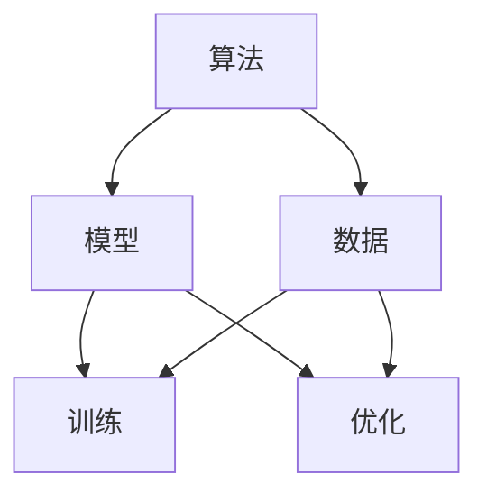
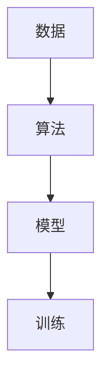
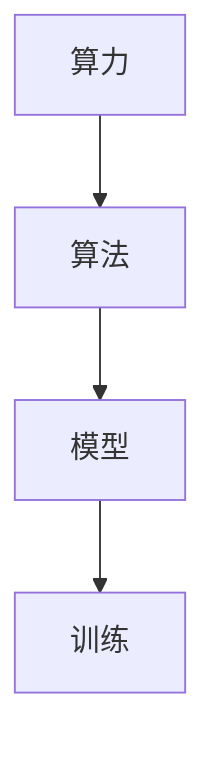
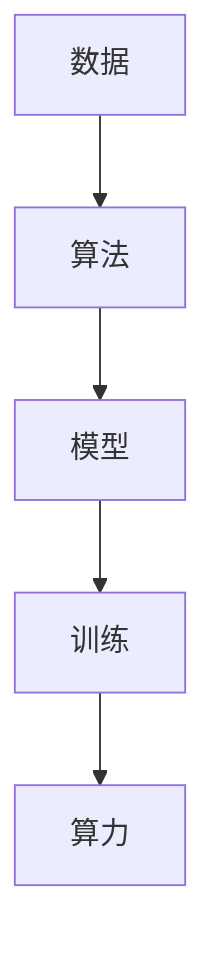
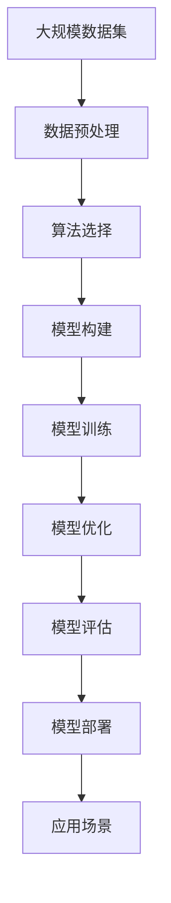

                 

# AI发展的三匹马：算法、算力与数据

在AI的世界里，有三匹马在并驾齐驱，推动着技术的不断前进：算法、算力与数据。它们相互依存、相互促进，共同构建了人工智能的基石。本文将从这三方面出发，深入探讨它们的原理、联系和应用，揭示它们如何协同作用，引领AI的发展方向。

## 1. 背景介绍

### 1.1 问题由来

随着AI技术的迅猛发展，人们开始思考一个核心问题：究竟是什么力量在驱动AI的进步？经过多年的实践和研究，专家们发现算法、算力与数据这三者缺一不可。其中，算法提供了方法论的指引，算力提供了实现这些方法论的硬件支持，数据则是训练模型和优化算法的原材料。三者的完美结合，才能推动AI技术的不断创新和突破。

### 1.2 问题核心关键点

算法、算力与数据三者之间的关系是紧密相连的。算法决定了我们如何处理和分析数据，算力提供了计算的资源，而数据则是我们训练和优化算法的依据。它们之间的关系可以总结为以下几个关键点：

- **算法**：指导如何处理和分析数据，是AI的核心思想。
- **算力**：提供计算资源，是算法实现的基础。
- **数据**：提供训练和优化的原材料，是算法表现的关键。

理解这三大要素之间的联系，有助于我们更好地构建AI系统，推动技术的发展。

### 1.3 问题研究意义

研究算法、算力与数据三者的关系，对于推动AI技术的进步具有重要意义：

- **提升模型效果**：通过算法优化和数据预处理，可以显著提升模型的预测准确度和泛化能力。
- **加速模型训练**：高效的算力可以缩短模型训练时间，加快新模型和算法的研究进程。
- **数据驱动创新**：大量的数据可以推动新算法的出现，为AI技术的发展提供新思路。
- **技术落地应用**：算法、算力与数据三者协同，可以加速AI技术在实际应用中的落地和推广。
- **推动产业升级**：AI技术的成熟应用，可以为传统行业带来新的商业机会，推动产业升级。

## 2. 核心概念与联系

### 2.1 核心概念概述

为更好地理解算法、算力与数据三者的关系，本节将介绍几个关键概念：

- **算法**：指导如何处理和分析数据，是AI的核心思想。
- **算力**：提供计算资源，是算法实现的基础。
- **数据**：提供训练和优化的原材料，是算法表现的关键。
- **模型**：算法和数据结合的产物，是AI应用的具体体现。
- **训练与优化**：通过数据和算法，不断调整模型的参数，提升模型性能。

这些概念之间的联系可以通过以下Mermaid流程图来展示：



这个流程图展示了算法、数据、模型、训练和优化之间的紧密联系。算法和数据共同决定了模型的初始化和训练过程，通过不断的训练和优化，模型逐渐提高其性能，最终应用于实际问题解决中。

### 2.2 概念间的关系

这些关键概念之间存在着紧密的联系，形成了AI技术的整体生态系统。下面我通过几个Mermaid流程图来展示这些概念之间的关系。

#### 2.2.1 算法与数据的关系



这个流程图展示了算法如何指导数据的处理和分析。数据是算法的输入，经过算法的处理和分析，形成了模型，通过训练和优化，最终提升模型的性能。

#### 2.2.2 算力与算法的关系



这个流程图展示了算力如何支持算法的实现。算力提供了计算资源，使得算法可以高效地实现，从而训练出性能更好的模型。

#### 2.2.3 数据与算力的关系



这个流程图展示了数据如何与算力协同作用。数据提供了训练和优化的原材料，算力提供了计算的资源，共同推动了模型的训练和优化过程。

### 2.3 核心概念的整体架构

最后，我们用一个综合的流程图来展示这些核心概念在大数据与AI技术的整体架构中的作用：



这个综合流程图展示了从数据预处理到模型部署的整个流程，算法、算力与数据三者在其中的协同作用。大规模数据集是整个流程的起点，经过数据预处理、算法选择、模型构建、模型训练、模型优化和模型评估后，最终在应用场景中得到应用。

## 3. 核心算法原理 & 具体操作步骤

### 3.1 算法原理概述

算法是大数据与AI技术的核心，它决定了我们如何处理和分析数据，是实现AI目标的关键。算法可以分为监督学习、无监督学习和强化学习三类，每种算法都有其特定的应用场景和优势。

#### 3.1.1 监督学习

监督学习是利用有标签的数据进行模型训练的一种方法。其核心思想是，通过已知的输入和输出对来训练模型，使得模型能够预测未知的数据。监督学习的常用算法包括线性回归、逻辑回归、决策树、支持向量机等。

#### 3.1.2 无监督学习

无监督学习是在没有标签数据的情况下进行模型训练的一种方法。其核心思想是，通过数据的自身特征来发现数据的结构和规律。无监督学习的常用算法包括聚类、降维、关联规则挖掘等。

#### 3.1.3 强化学习

强化学习是通过奖励和惩罚机制来训练模型的一种方法。其核心思想是，通过不断尝试和调整，使模型在特定的环境中获得最大的奖励。强化学习的常用算法包括Q-learning、策略梯度等。

### 3.2 算法步骤详解

在实际应用中，算法的实现通常包括以下步骤：

1. **数据预处理**：对原始数据进行清洗、归一化、特征提取等处理，以便于算法的训练。
2. **模型构建**：根据任务需求选择合适的算法和模型结构。
3. **模型训练**：使用训练数据对模型进行训练，调整模型的参数，使其能够更好地拟合数据。
4. **模型优化**：通过正则化、Dropout等技术，防止模型过拟合。
5. **模型评估**：使用测试数据对模型进行评估，评估其性能和泛化能力。
6. **模型部署**：将训练好的模型部署到实际应用中，进行推理和预测。

### 3.3 算法优缺点

算法在提高模型性能的同时，也存在一些局限性：

- **优点**：
  - 能够处理复杂的数据结构，适应性强。
  - 在已有标注数据集上表现良好，能够直接利用标注数据进行训练。
  - 经过适当的调整，可以适应不同的应用场景。

- **缺点**：
  - 需要大量的标注数据，数据获取成本高。
  - 对于新的数据，模型可能无法很好地泛化。
  - 算法的选择和调参需要一定的经验和技巧。

### 3.4 算法应用领域

算法在大数据与AI技术的各个领域都有广泛的应用，以下是一些典型的应用场景：

- **图像识别**：利用卷积神经网络进行图像分类、目标检测等任务。
- **自然语言处理**：利用RNN、LSTM等算法进行文本分类、情感分析等任务。
- **推荐系统**：利用协同过滤、矩阵分解等算法进行用户行为分析和个性化推荐。
- **金融分析**：利用决策树、随机森林等算法进行风险评估、股票预测等任务。
- **医疗诊断**：利用深度学习算法进行疾病诊断、影像分析等任务。

## 4. 数学模型和公式 & 详细讲解 & 举例说明

### 4.1 数学模型构建

在本节中，我们将通过数学模型来详细讲解算法的原理。

以线性回归模型为例，假设我们有一组数据集 $(x_i,y_i)$，其中 $x_i$ 是输入特征，$y_i$ 是输出标签。我们的目标是通过这些数据训练一个线性回归模型 $f(x) = \theta^T x$，其中 $\theta$ 是模型参数。

### 4.2 公式推导过程

线性回归模型的最小二乘损失函数为：

$$
\mathcal{L}(\theta) = \frac{1}{2N} \sum_{i=1}^N (y_i - f(x_i))^2
$$

其中 $N$ 是数据点的数量。我们的目标是最小化这个损失函数，以找到最佳的 $\theta$ 值。

利用梯度下降算法，我们可以计算出 $\theta$ 的更新规则为：

$$
\theta \leftarrow \theta - \alpha \nabla_{\theta}\mathcal{L}(\theta)
$$

其中 $\alpha$ 是学习率，$\nabla_{\theta}\mathcal{L}(\theta)$ 是损失函数对 $\theta$ 的梯度，可以通过链式法则计算得到。

### 4.3 案例分析与讲解

假设我们有一组数据集，包含房价信息 $x$ 和实际房价 $y$。我们希望通过这个数据集训练一个线性回归模型，预测新房屋的房价。

首先，我们需要对数据进行预处理，例如归一化处理，以避免梯度爆炸或消失的问题。然后，我们可以使用梯度下降算法来训练模型，调整 $\theta$ 的值，使其能够更好地拟合数据。最后，我们可以使用测试集来评估模型的性能，调整超参数，进一步优化模型。

## 5. 项目实践：代码实例和详细解释说明

### 5.1 开发环境搭建

在进行项目实践前，我们需要准备好开发环境。以下是使用Python进行PyTorch开发的环境配置流程：

1. 安装Anaconda：从官网下载并安装Anaconda，用于创建独立的Python环境。

2. 创建并激活虚拟环境：
```bash
conda create -n pytorch-env python=3.8 
conda activate pytorch-env
```

3. 安装PyTorch：根据CUDA版本，从官网获取对应的安装命令。例如：
```bash
conda install pytorch torchvision torchaudio cudatoolkit=11.1 -c pytorch -c conda-forge
```

4. 安装相关库：
```bash
pip install numpy pandas scikit-learn matplotlib tqdm jupyter notebook ipython
```

5. 安装Transformers库：
```bash
pip install transformers
```

完成上述步骤后，即可在`pytorch-env`环境中开始项目实践。

### 5.2 源代码详细实现

下面我们以线性回归为例，给出使用PyTorch进行模型训练的代码实现。

首先，定义训练数据集和测试数据集：

```python
import torch
import numpy as np

# 定义训练数据集
x_train = np.array([[1.0], [2.0], [3.0], [4.0], [5.0]], dtype=float)
y_train = np.array([2.0, 4.0, 6.0, 8.0, 10.0], dtype=float)

# 定义测试数据集
x_test = np.array([[6.0], [7.0], [8.0], [9.0], [10.0]], dtype=float)
y_test = np.array([12.0, 14.0, 16.0, 18.0, 20.0], dtype=float)
```

然后，定义模型和优化器：

```python
from torch import nn, optim

# 定义线性回归模型
class LinearRegression(nn.Module):
    def __init__(self, input_dim, output_dim):
        super(LinearRegression, self).__init__()
        self.linear = nn.Linear(input_dim, output_dim)
        
    def forward(self, x):
        return self.linear(x)
        
# 创建模型和优化器
model = LinearRegression(input_dim=1, output_dim=1)
optimizer = optim.SGD(model.parameters(), lr=0.01)
```

接着，定义训练和评估函数：

```python
# 定义训练函数
def train(model, optimizer, x_train, y_train, x_test, y_test, num_epochs=100):
    mse_loss = nn.MSELoss()
    for epoch in range(num_epochs):
        optimizer.zero_grad()
        predictions = model(x_train)
        loss = mse_loss(predictions, y_train)
        loss.backward()
        optimizer.step()
        
        test_predictions = model(x_test)
        test_loss = mse_loss(test_predictions, y_test)
        print(f"Epoch {epoch+1}, Training Loss: {loss.item():.4f}, Test Loss: {test_loss.item():.4f}")
    
    return model

# 调用训练函数
model = train(model, optimizer, x_train, y_train, x_test, y_test)
```

最后，在测试集上评估模型：

```python
# 定义测试函数
def test(model, x_test, y_test):
    mse_loss = nn.MSELoss()
    predictions = model(x_test)
    loss = mse_loss(predictions, y_test)
    print(f"Test Loss: {loss.item():.4f}")
    
# 调用测试函数
test(model, x_test, y_test)
```

以上就是使用PyTorch进行线性回归模型训练的完整代码实现。可以看到，通过简单的代码，我们就可以实现模型的训练和测试。

### 5.3 代码解读与分析

让我们再详细解读一下关键代码的实现细节：

**训练函数**：
- 首先，定义了均方误差损失函数（MSE Loss）。
- 在每个epoch中，对训练数据进行前向传播，计算预测值和实际值之间的误差。
- 使用反向传播算法计算梯度，并使用优化器更新模型参数。
- 在每个epoch结束时，使用测试集计算测试误差，输出训练误差和测试误差。

**测试函数**：
- 首先，定义了均方误差损失函数（MSE Loss）。
- 在测试集上计算模型预测值和实际值之间的误差。
- 输出测试误差。

可以看出，PyTorch的深度学习框架使得模型的训练和测试变得简单高效。开发者可以专注于模型的设计和调参，而不必过多关注底层的实现细节。

## 6. 实际应用场景

### 6.1 智能推荐系统

智能推荐系统是算法和大数据技术的重要应用场景之一。它通过分析用户的行为数据，推荐用户可能感兴趣的商品或内容。

在推荐系统中，通常使用协同过滤、矩阵分解等算法进行用户行为分析和推荐。这些算法需要大量的用户行为数据作为输入，通过分析和建模，找出用户之间的相似性和商品之间的关联性，从而生成个性化的推荐结果。

### 6.2 金融风险预测

金融风险预测是算法和大数据技术在金融领域的重要应用。它通过分析历史金融数据，预测未来的市场走势和风险。

在金融风险预测中，通常使用回归分析和决策树等算法进行模型训练。这些算法需要大量的历史金融数据作为输入，通过分析和建模，找出市场变化规律和风险因素，从而生成风险预测结果。

### 6.3 自然语言处理

自然语言处理是算法和大数据技术在NLP领域的重要应用。它通过分析文本数据，实现文本分类、情感分析、机器翻译等任务。

在自然语言处理中，通常使用RNN、LSTM等算法进行文本建模。这些算法需要大量的文本数据作为输入，通过分析和建模，找出文本的语义和语法结构，从而生成文本分类和翻译结果。

## 7. 工具和资源推荐

### 7.1 学习资源推荐

为了帮助开发者系统掌握算法和大数据技术，这里推荐一些优质的学习资源：

1. 《深度学习》系列书籍：由Ian Goodfellow等专家撰写，全面介绍了深度学习的理论和实践。
2. Coursera《深度学习专项课程》：由Andrew Ng等人开设的深度学习课程，包含视频讲授和实践练习。
3. Kaggle竞赛平台：提供大量数据集和竞赛，是实践深度学习算法的好地方。
4. Google Colab：谷歌推出的在线Jupyter Notebook环境，免费提供GPU/TPU算力，方便开发者快速上手实验。
5. GitHub资源库：提供大量开源项目和代码，是学习算法和大数据技术的绝佳资源。

通过对这些资源的学习实践，相信你一定能够快速掌握算法和大数据技术的精髓，并用于解决实际的AI问题。

### 7.2 开发工具推荐

高效的开发离不开优秀的工具支持。以下是几款用于算法和大数据技术开发的常用工具：

1. PyTorch：基于Python的开源深度学习框架，灵活动态的计算图，适合快速迭代研究。大部分算法和大数据技术都有PyTorch版本的实现。
2. TensorFlow：由Google主导开发的开源深度学习框架，生产部署方便，适合大规模工程应用。同样有丰富的算法和大数据技术资源。
3. Scikit-learn：基于Python的机器学习库，提供了大量常用的机器学习算法和大数据处理工具。
4. Apache Spark：基于内存计算的分布式计算框架，支持大数据处理和机器学习。
5. Hadoop：基于分布式计算的框架，支持大规模数据处理和存储。

合理利用这些工具，可以显著提升算法和大数据技术的开发效率，加快创新迭代的步伐。

### 7.3 相关论文推荐

算法和大数据技术的发展源于学界的持续研究。以下是几篇奠基性的相关论文，推荐阅读：

1. "On the Importance of Initialization and Momentum in Deep Learning"：探讨了深度学习中初始化参数和动量参数的选择。
2. "Deep Learning for Natural Language Processing"：介绍了深度学习在自然语言处理中的应用。
3. "Scalable Deep Learning"：介绍了大规模深度学习模型的训练和优化技术。
4. "Big Data: Concepts, Techniques, and Strategies"：介绍了大数据技术的概念、技术和策略。
5. "Large-scale Distributed Deep Learning"：介绍了大规模分布式深度学习技术的实现。

这些论文代表了大数据与AI技术的最新进展，是深入理解算法和大数据技术的重要参考资料。

除上述资源外，还有一些值得关注的前沿资源，帮助开发者紧跟算法和大数据技术的前沿发展：

1. arXiv论文预印本：人工智能领域最新研究成果的发布平台，包括大量尚未发表的前沿工作，学习前沿技术的必读资源。
2. 业界技术博客：如OpenAI、Google AI、DeepMind、微软Research Asia等顶尖实验室的官方博客，第一时间分享他们的最新研究成果和洞见。
3. 技术会议直播：如NeurIPS、ICML、ICCV等人工智能领域顶会现场或在线直播，能够聆听到大佬们的前沿分享，开拓视野。
4. GitHub热门项目：在GitHub上Star、Fork数最多的算法和大数据相关项目，往往代表了该技术领域的发展趋势和最佳实践，值得去学习和贡献。
5. 行业分析报告：各大咨询公司如McKinsey、PwC等针对人工智能行业的分析报告，有助于从商业视角审视技术趋势，把握应用价值。

总之，对于算法和大数据技术的学习和实践，需要开发者保持开放的心态和持续学习的意愿。多关注前沿资讯，多动手实践，多思考总结，必将收获满满的成长收益。

## 8. 总结：未来发展趋势与挑战

### 8.1 研究成果总结

本文对算法、算力与数据三者的关系进行了全面系统的介绍。首先阐述了算法、算力与数据三者在大数据与AI技术中的重要作用，明确了它们如何协同作用，推动AI的发展方向。其次，从原理到实践，详细讲解了算法的实现步骤和优缺点，展示了其在实际应用中的广泛应用。最后，本文推荐了大量的学习资源和开发工具，帮助开发者更好地掌握算法和大数据技术。

通过本文的系统梳理，可以看到，算法、算力与数据三者在大数据与AI技术的各个环节中扮演着关键角色。它们相互依存、相互促进，共同构建了AI技术的坚实基础。

### 8.2 未来发展趋势

展望未来，算法、算力与数据三者将继续推动AI技术的进步，呈现以下几个发展趋势：

1. **算法自动化**：自动化的算法选择和调参方法将不断涌现，使得算法设计更加高效和精确。
2. **算力普惠化**：随着算力资源的普惠化，越来越多的企业和研究机构能够获取到高性能计算资源，推动AI技术的发展。
3. **数据质量提升**：大数据技术的不断进步，使得数据获取和处理更加高效和准确，数据质量将不断提升。
4. **模型可解释性**：随着AI技术的深入应用，对模型可解释性的需求日益增加，相关的研究将更加深入。
5. **跨领域融合**：算法、算力与数据三者将与更多的跨领域技术进行融合，推动AI技术在更广泛的领域中应用。

### 8.3 面临的挑战

尽管算法、算力与数据三者在推动AI技术的发展中扮演着重要角色，但在实现过程中仍然面临一些挑战：

1. **数据隐私与安全**：大数据的应用带来了数据隐私和安全问题，如何保护用户数据隐私，防止数据滥用，是未来的一大挑战。
2. **算法透明与可解释**：算法的复杂性导致其透明度和可解释性不足，如何增强算法的可解释性，使其更加透明和可信，是未来研究的重要方向。
3. **算力资源分配**：随着算力需求的不断增加，如何合理分配和利用算力资源，提高算力的利用效率，是一个重要的课题。
4. **算法性能提升**：虽然现有算法已经取得了显著的进展，但在特定应用场景下，算法的性能仍需进一步提升。
5. **模型规模与效率**：大规模模型虽然性能优异，但在计算效率和资源占用方面仍需进一步优化。

### 8.4 研究展望

面对算法、算力与数据三者面临的挑战，未来的研究需要在以下几个方面寻求新的突破：

1. **模型压缩与优化**：开发更加高效的模型压缩和优化技术，提高模型的计算效率和资源利用率。
2. **算法自动化**：发展自动化的算法选择和调参方法，提升算法设计和开发的效率和质量。
3. **跨领域融合**：将算法、算力与数据三者与更多的跨领域技术进行融合，推动AI技术在更广泛的领域中应用。
4. **数据隐私保护**：研究和开发隐私保护技术，确保数据使用的合法性和安全性。
5. **可解释性增强**：开发更具有可解释性的算法，增强AI系统的透明度和可信度。

这些研究方向的探索，必将引领算法、算力与数据技术迈向更高的台阶，为AI技术的发展和应用带来新的突破。相信随着学界和产业界的共同努力，这些挑战终将一一被克服，算法、算力与数据三者将继续推动AI技术的发展，为构建更加智能、普适的AI系统提供坚实的基础。

## 9. 附录：常见问题与解答

**Q1：如何理解算法、算力与数据三者的关系？**

A: 算法、算力与数据三者在大数据与AI技术中扮演着关键角色。算法决定了如何处理和分析数据，算力提供了计算资源，数据则是算法训练和优化的原材料。三者相互依存、相互促进，共同构建了AI技术的坚实基础。

**Q2：如何选择适合的数据集进行模型训练？**

A: 选择适合的数据集进行模型训练，需要考虑以下几个因素：
1. 数据集的规模和质量。规模越大，数据质量越高，模型训练效果越好。
2. 数据集的特征和标签。特征和标签的完备性和准确性，直接影响模型的训练效果。
3. 数据集的分布和领域。数据集的分布和领域与模型应用场景一致，能够提高模型的泛化能力。

**Q3：如何优化算法和大数据技术的性能？**

A: 优化算法和大数据技术的性能，需要从以下几个方面入手：
1. 选择合适的算法。根据具体任务需求，选择最合适的算法和模型结构。
2. 优化数据预处理和特征工程。通过数据清洗、归一化、特征提取等处理，提高数据质量和特征表达能力。
3. 调整超参数。通过调参，找到最佳的模型参数和算法参数，提高模型的性能和泛化能力。
4. 采用高效的数据处理技术。通过分布式计算和存储技术，提高数据处理和计算效率。

**Q4：如何保护数据隐私和安全？**

A: 保护数据隐私和安全，需要从以下几个方面入手：
1. 数据匿名化和脱敏。通过数据匿名化和脱敏处理，保护用户隐私。
2. 访问控制和权限管理。通过访问控制和权限管理，限制数据访问和使用范围。
3. 数据加密和安全传输。通过数据加密和安全传输，防止数据泄露和篡改。
4. 隐私保护算法。通过使用隐私保护算法，如差分隐私、联邦学习等，保护用户数据隐私。

**Q5：如何在实际应用中合理分配和利用算力资源？**

A: 在实际应用中，合理分配和利用算力资源，需要考虑以下几个因素：
1. 算力资源的类型和性能。不同类型的算力资源和性能，适用于不同的计算任务。
2. 任务的计算需求和优先级。根据任务的计算需求和优先级，合理分配算力资源。
3. 资源分配的策略和算法。通过合理的资源分配策略和算法，提高

