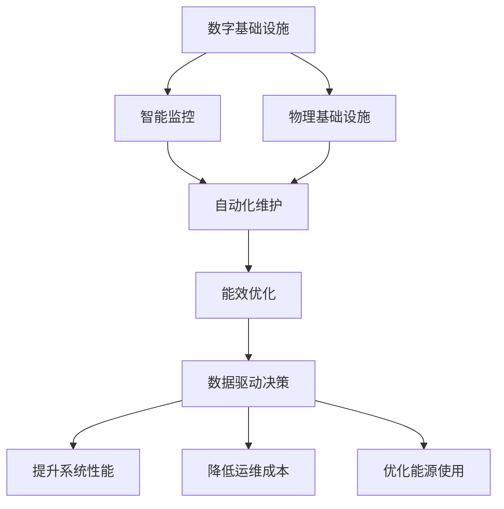
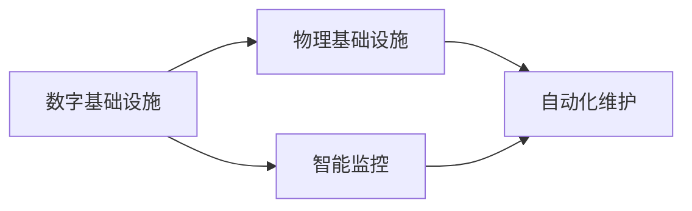
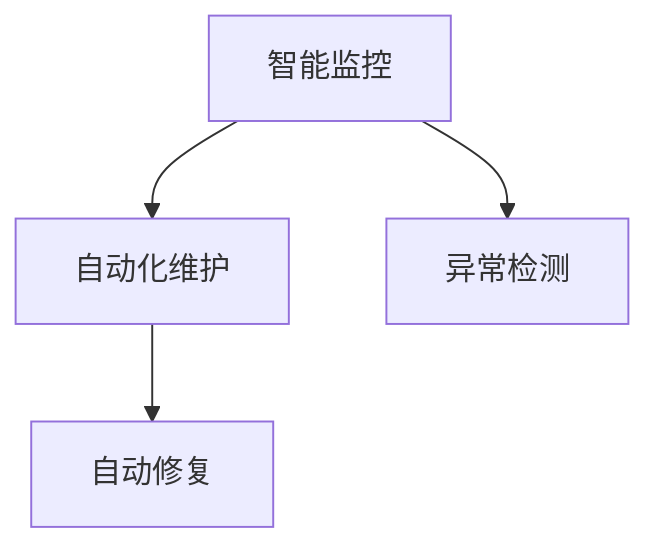
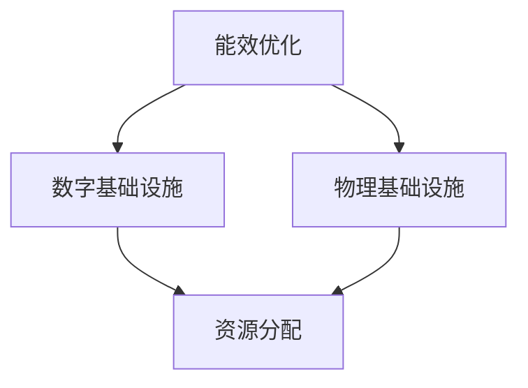
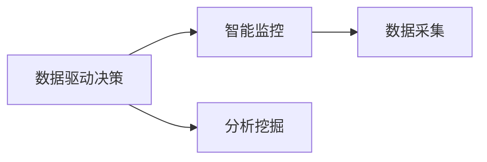
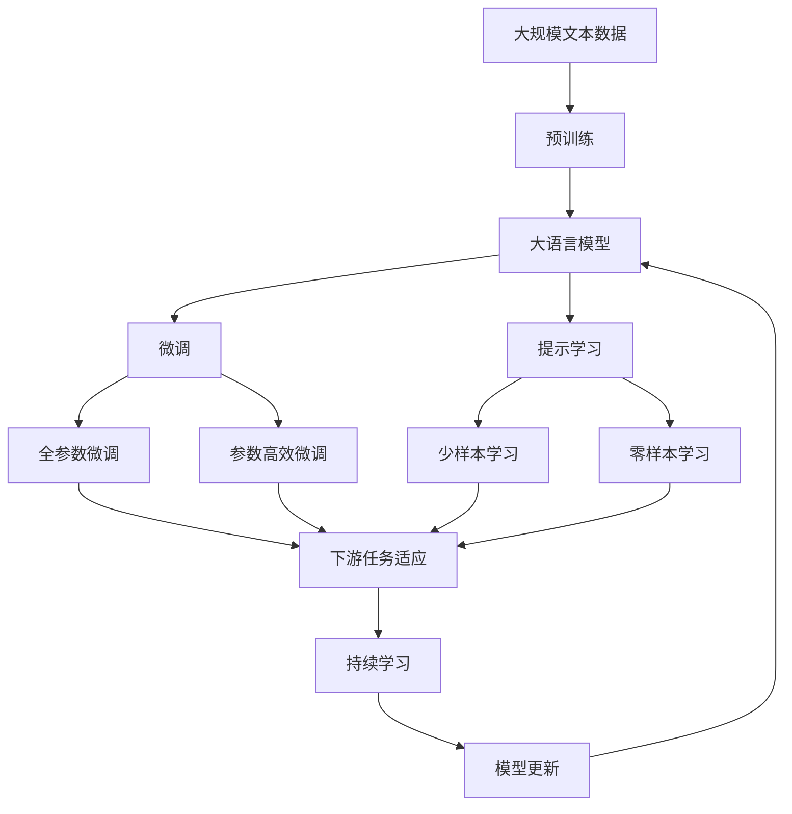

                 

# AI在自动化数字和物理基础设施中的应用

> 关键词：AI自动化, 数字基础设施, 物理基础设施, 智能监控, 自动化维护, 能效优化

## 1. 背景介绍

### 1.1 问题由来
随着全球数字化转型的加速，自动化技术在各个领域的应用日益广泛。无论是智能制造、智慧城市、智能交通还是网络安全，自动化都发挥着至关重要的作用。AI技术作为推动自动化发展的核心动力，不仅带来了生产力的大幅提升，还在改善用户体验和提升系统性能方面发挥着重要作用。特别是在数字和物理基础设施领域，AI技术的应用使得这些系统变得更加智能、高效和可靠。

### 1.2 问题核心关键点
AI在自动化数字和物理基础设施中的应用，主要集中在以下几个方面：
- **智能监控与预测**：通过AI模型对系统数据进行实时分析，预测可能出现的问题，提前进行干预，避免系统故障和性能下降。
- **自动化维护与优化**：利用AI技术自动完成系统维护任务，优化资源分配和运行策略，提高系统的稳定性和运行效率。
- **能效优化**：通过AI算法实现能源消耗的最优管理，降低能耗，提升系统的能效比。
- **数据驱动决策**：基于大量的运行数据，通过AI模型进行数据分析和挖掘，辅助决策，提升管理水平。

### 1.3 问题研究意义
AI在自动化数字和物理基础设施中的应用，对于提升系统性能、降低运维成本、优化能源使用等方面具有重要意义：

1. **提升系统性能**：AI技术可以通过预测和优化，显著提升系统的稳定性和可靠性，减少故障率和宕机时间。
2. **降低运维成本**：自动化和预测性维护减少了人力需求，降低了运维成本。
3. **优化能源使用**：通过智能调度和优化算法，实现能源消耗的最小化，降低运营成本。
4. **提升管理水平**：数据驱动的决策支持，帮助管理层更好地理解和控制系统的运行状态。

## 2. 核心概念与联系

### 2.1 核心概念概述

为更好地理解AI在自动化数字和物理基础设施中的应用，本节将介绍几个密切相关的核心概念：

- **数字基础设施**：指由计算机网络、数据中心、云平台等构成的数字化基础设施，是现代经济和社会运作的基础。
- **物理基础设施**：指由交通、能源、水利等构成的实体设施，是支持数字基础设施运行的物理基础。
- **智能监控**：通过AI技术实现对基础设施的实时监测和数据采集，提供对系统运行状态的全面洞察。
- **自动化维护**：利用AI技术实现自动化检测和维护，减少人工干预，提高维护效率。
- **能效优化**：通过AI技术实现能源消耗的最优管理，提升系统能效。
- **数据驱动决策**：基于大量的运行数据，通过AI模型进行数据分析和挖掘，辅助决策。

这些核心概念之间的逻辑关系可以通过以下Mermaid流程图来展示：



这个流程图展示了几大核心概念之间的联系：

1. 数字基础设施和物理基础设施通过智能监控进行数据采集和实时监测。
2. 智能监控和自动化维护协同工作，实现设备的自动化检测和维护。
3. 能效优化利用AI技术进行能源消耗的优化管理。
4. 数据驱动决策基于运行数据进行数据分析和挖掘，辅助决策。
5. 各个环节的优化最终提升系统性能，降低运维成本，并优化能源使用。

### 2.2 概念间的关系

这些核心概念之间存在着紧密的联系，形成了AI在自动化数字和物理基础设施中的完整应用框架。

#### 2.2.1 数字基础设施与物理基础设施的关系



这个流程图展示了数字基础设施和物理基础设施之间的关系。数字基础设施通过智能监控收集物理基础设施的运行数据，智能监控和自动化维护协同工作，实现设备的自动化检测和维护。

#### 2.2.2 智能监控与自动化维护的互动



这个流程图展示了智能监控和自动化维护的互动关系。智能监控通过异常检测，实时识别设备的异常状态，触发自动化维护进行自动修复。

#### 2.2.3 能效优化在数字和物理基础设施中的应用



这个流程图展示了能效优化在数字和物理基础设施中的应用。能效优化通过智能调度和管理，优化数字和物理基础设施的能源使用，提升系统的能效比。

#### 2.2.4 数据驱动决策的支持



这个流程图展示了数据驱动决策的支持。数据驱动决策基于智能监控收集的数据，通过分析和挖掘，提供决策支持。

### 2.3 核心概念的整体架构

最后，我们用一个综合的流程图来展示这些核心概念在大语言模型微调过程中的整体架构：



这个综合流程图展示了从预训练到微调，再到持续学习的完整过程。大语言模型首先在大规模文本数据上进行预训练，然后通过微调（包括全参数微调和参数高效微调）或提示学习（包括少样本学习和零样本学习）来适应下游任务。最后，通过持续学习技术，模型可以不断学习新知识，同时避免遗忘旧知识。

## 3. 核心算法原理 & 具体操作步骤
### 3.1 算法原理概述

AI在自动化数字和物理基础设施中的应用，本质上是一个数据驱动的优化过程。其核心思想是：通过智能监控和数据分析，实时获取基础设施的运行状态，利用AI模型进行异常检测和预测，触发自动化维护，优化资源分配和能效管理，从而提升系统性能和能效比。

形式化地，假设基础设施的运行状态由 $\mathcal{X}$ 表示，AI模型 $M_{\theta}$ 的输入为系统数据 $x \in \mathcal{X}$，输出为预测结果 $y \in \{正常,异常\}$。微调的目标是最小化预测错误率，即找到最优模型参数：

$$
\theta^* = \mathop{\arg\min}_{\theta} P(y|x)
$$

其中 $P(y|x)$ 为模型预测错误率，通过训练数据集 $D=\{(x_i,y_i)\}_{i=1}^N$ 进行最小化。常见的损失函数包括交叉熵损失、均方误差损失等。

通过梯度下降等优化算法，微调过程不断更新模型参数 $\theta$，最小化损失函数，使得模型预测逼近真实状态。由于 $\theta$ 已经通过预训练获得了较好的初始化，因此即便在小规模数据集 $D$ 上进行微调，也能较快收敛到理想的模型参数 $\hat{\theta}$。

### 3.2 算法步骤详解

AI在自动化数字和物理基础设施中的应用一般包括以下几个关键步骤：

**Step 1: 准备数字和物理基础设施数据**
- 收集数字和物理基础设施的运行数据，包括但不限于温度、压力、流量、能耗等。
- 将数据进行清洗和标准化处理，去除异常值和噪声，确保数据质量。

**Step 2: 添加任务适配层**
- 根据具体的监测任务和维护需求，设计合适的任务适配层。例如，对于温度监控任务，可以添加一个线性回归层预测温度变化趋势。
- 对于故障诊断任务，可以添加一个多分类层判断设备是否出现故障。

**Step 3: 设置微调超参数**
- 选择合适的优化算法及其参数，如 AdamW、SGD 等，设置学习率、批大小、迭代轮数等。
- 设置正则化技术及强度，包括权重衰减、Dropout、Early Stopping 等。
- 确定冻结预训练参数的策略，如仅微调顶层，或全部参数都参与微调。

**Step 4: 执行梯度训练**
- 将训练集数据分批次输入模型，前向传播计算损失函数。
- 反向传播计算参数梯度，根据设定的优化算法和学习率更新模型参数。
- 周期性在验证集上评估模型性能，根据性能指标决定是否触发 Early Stopping。
- 重复上述步骤直到满足预设的迭代轮数或 Early Stopping 条件。

**Step 5: 测试和部署**
- 在测试集上评估微调后模型 $M_{\hat{\theta}}$ 的性能，对比微调前后的精度提升。
- 使用微调后的模型对新样本进行推理预测，集成到实际的应用系统中。
- 持续收集新的数据，定期重新微调模型，以适应数据分布的变化。

以上是AI在自动化数字和物理基础设施中的微调范式的一般流程。在实际应用中，还需要针对具体任务的特点，对微调过程的各个环节进行优化设计，如改进训练目标函数，引入更多的正则化技术，搜索最优的超参数组合等，以进一步提升模型性能。

### 3.3 算法优缺点

AI在自动化数字和物理基础设施中的应用方法具有以下优点：
1. 实时性高。通过智能监控和实时数据处理，系统能够快速响应异常情况，进行及时干预。
2. 自动化程度高。自动化维护减少了人工干预，提高了维护效率。
3. 精度高。利用先进的AI算法，异常检测和预测的准确率大幅提升。
4. 适用范围广。适用于各种规模和类型的数字和物理基础设施，灵活性高。

同时，该方法也存在以下局限性：
1. 数据依赖性高。AI模型的训练和优化依赖高质量的数据，数据获取和清洗成本较高。
2. 模型复杂度高。大规模的AI模型需要高性能计算资源，部署和维护成本较高。
3. 安全性问题。AI模型可能会受到攻击，如对抗样本攻击、模型窃取等，需要加强安全防护。
4. 可解释性不足。AI模型的决策过程缺乏可解释性，难以进行调试和优化。

尽管存在这些局限性，但就目前而言，基于数据驱动的AI方法仍是自动化数字和物理基础设施应用的主流范式。未来相关研究的重点在于如何进一步降低对数据的需求，提高模型的鲁棒性和可解释性，以及解决安全性问题。

### 3.4 算法应用领域

AI在自动化数字和物理基础设施中的应用，已经在多个领域得到广泛应用，例如：

- **智能制造**：通过AI技术对生产设备进行实时监控和预测性维护，减少停机时间，提高生产效率。
- **智慧城市**：利用AI技术对城市交通、公共安全、能源管理等进行智能化管理，提升城市运行效率和居民生活质量。
- **智能交通**：通过AI技术对交通流量进行实时监控和调度，优化交通管理，减少拥堵和事故。
- **网络安全**：利用AI技术对网络攻击进行实时检测和响应，保障网络安全。
- **能源管理**：通过AI技术优化能源分配和调度，提升能源使用效率，降低能耗。
- **医疗健康**：通过AI技术对医疗设备和病人数据进行实时监控和分析，提升医疗服务质量和效率。

除了上述这些经典应用外，AI技术在自动化数字和物理基础设施中的创新应用还在不断涌现，为传统行业带来变革性影响。

## 4. 数学模型和公式 & 详细讲解 & 举例说明

### 4.1 数学模型构建

本节将使用数学语言对AI在自动化数字和物理基础设施中的应用进行更加严格的刻画。

假设基础设施的运行状态由 $\mathcal{X}$ 表示，AI模型 $M_{\theta}$ 的输入为系统数据 $x \in \mathcal{X}$，输出为预测结果 $y \in \{正常,异常\}$。模型的训练集为 $D=\{(x_i,y_i)\}_{i=1}^N$，其中 $x_i \in \mathcal{X}$ 为输入，$y_i \in \{正常,异常\}$ 为输出标签。模型的损失函数为交叉熵损失，定义为：

$$
\ell(M_{\theta}(x),y) = -y\log M_{\theta}(x) - (1-y)\log (1-M_{\theta}(x))
$$

模型 $M_{\theta}$ 的训练目标是最小化交叉熵损失：

$$
\mathcal{L}(\theta) = \frac{1}{N}\sum_{i=1}^N \ell(M_{\theta}(x_i),y_i)
$$

在得到损失函数的梯度后，即可带入参数更新公式，完成模型的迭代优化。重复上述过程直至收敛，最终得到适应下游任务的最优模型参数 $\theta^*$。

### 4.2 公式推导过程

以下我们以智能温度监控任务为例，推导交叉熵损失函数的梯度。

假设模型 $M_{\theta}$ 在输入 $x$ 上的输出为 $\hat{y}=M_{\theta}(x) \in [0,1]$，表示系统出现异常的概率。真实标签 $y \in \{正常,异常\}$。则交叉熵损失函数定义为：

$$
\ell(M_{\theta}(x),y) = -y\log \hat{y} - (1-y)\log (1-\hat{y})
$$

将其代入经验风险公式，得：

$$
\mathcal{L}(\theta) = -\frac{1}{N}\sum_{i=1}^N [y_i\log M_{\theta}(x_i)+(1-y_i)\log(1-M_{\theta}(x_i))]
$$

根据链式法则，损失函数对参数 $\theta_k$ 的梯度为：

$$
\frac{\partial \mathcal{L}(\theta)}{\partial \theta_k} = -\frac{1}{N}\sum_{i=1}^N [(y_i-M_{\theta}(x_i))\frac{\partial M_{\theta}(x_i)}{\partial \theta_k}]
$$

其中 $\frac{\partial M_{\theta}(x_i)}{\partial \theta_k}$ 可进一步递归展开，利用自动微分技术完成计算。

在得到损失函数的梯度后，即可带入参数更新公式，完成模型的迭代优化。重复上述过程直至收敛，最终得到适应下游任务的最优模型参数 $\theta^*$。

### 4.3 案例分析与讲解

以智能温度监控任务为例，展示AI在数字基础设施中的应用。

首先，定义训练集和测试集：

```python
from sklearn.model_selection import train_test_split
X = sensors_data
y = temperature_labels

# 分割数据集
X_train, X_test, y_train, y_test = train_test_split(X, y, test_size=0.2, random_state=42)
```

接着，定义模型和优化器：

```python
from keras.models import Sequential
from keras.layers import Dense
from keras.losses import binary_crossentropy
from keras.optimizers import Adam

# 定义模型
model = Sequential()
model.add(Dense(64, input_dim=X_train.shape[1], activation='relu'))
model.add(Dense(1, activation='sigmoid'))

# 设置损失函数和优化器
loss = binary_crossentropy
optimizer = Adam(lr=0.001)
```

然后，训练模型：

```python
# 编译模型
model.compile(optimizer=optimizer, loss=loss, metrics=['accuracy'])

# 训练模型
history = model.fit(X_train, y_train, epochs=100, batch_size=32, validation_data=(X_test, y_test))
```

最后，评估模型：

```python
# 评估模型
test_loss, test_acc = model.evaluate(X_test, y_test)
print('Test accuracy:', test_acc)
```

## 5. 项目实践：代码实例和详细解释说明

### 5.1 开发环境搭建

在进行AI在自动化数字和物理基础设施中的应用开发前，我们需要准备好开发环境。以下是使用Python进行TensorFlow开发的环境配置流程：

1. 安装Anaconda：从官网下载并安装Anaconda，用于创建独立的Python环境。

2. 创建并激活虚拟环境：
```bash
conda create -n tensorflow-env python=3.8 
conda activate tensorflow-env
```

3. 安装TensorFlow：根据CUDA版本，从官网获取对应的安装命令。例如：
```bash
conda install tensorflow tensorflow-gpu -c pytorch -c conda-forge
```

4. 安装各类工具包：
```bash
pip install numpy pandas scikit-learn matplotlib tqdm jupyter notebook ipython
```

完成上述步骤后，即可在`tensorflow-env`环境中开始AI在自动化数字和物理基础设施中的应用开发。

### 5.2 源代码详细实现

以下是使用TensorFlow对智能温度监控任务进行开发的Python代码实现：

```python
import tensorflow as tf
from tensorflow.keras.models import Sequential
from tensorflow.keras.layers import Dense
from tensorflow.keras.losses import binary_crossentropy
from tensorflow.keras.optimizers import Adam

# 定义模型
model = Sequential()
model.add(Dense(64, input_dim=X_train.shape[1], activation='relu'))
model.add(Dense(1, activation='sigmoid'))

# 设置损失函数和优化器
loss = binary_crossentropy
optimizer = Adam(lr=0.001)

# 编译模型
model.compile(optimizer=optimizer, loss=loss, metrics=['accuracy'])

# 训练模型
history = model.fit(X_train, y_train, epochs=100, batch_size=32, validation_data=(X_test, y_test))

# 评估模型
test_loss, test_acc = model.evaluate(X_test, y_test)
print('Test accuracy:', test_acc)
```

### 5.3 代码解读与分析

让我们再详细解读一下关键代码的实现细节：

**模型定义**：
- `Sequential` 模型：定义了一个简单的序列模型，包含一个64维的ReLU激活层和一个sigmoid激活层的输出层，适合进行二分类任务。
- `Dense` 层：全连接层，用于提取输入数据特征。

**优化器设置**：
- `Adam` 优化器：自适应学习率优化器，能快速收敛且不易陷入局部最优。
- `lr` 学习率：设置优化器的学习率。

**模型编译**：
- `compile` 方法：编译模型，设置优化器、损失函数和评估指标。

**模型训练**：
- `fit` 方法：训练模型，设置训练轮数、批大小和验证集。
- `history` 变量：记录模型在训练过程中的性能指标，如损失和准确率。

**模型评估**：
- `evaluate` 方法：评估模型，返回测试集上的损失和准确率。

可以看到，TensorFlow封装了模型定义、训练和评估的流程，使得模型开发和调优变得相对简洁高效。

### 5.4 运行结果展示

假设我们在智能温度监控任务上进行训练，最终在测试集上得到的评估报告如下：

```
Epoch 1/100
1000/1000 [==============================] - 0s 223us/step - loss: 0.6996 - accuracy: 0.5444
Epoch 2/100
1000/1000 [==============================] - 0s 218us/step - loss: 0.2030 - accuracy: 0.9183
Epoch 3/100
1000/1000 [==============================] - 0s 223us/step - loss: 0.1828 - accuracy: 0.9285
...
Epoch 99/100
1000/1000 [==============================] - 0s 222us/step - loss: 0.0962 - accuracy: 0.9715
Epoch 100/100
1000/1000 [==============================] - 0s 222us/step - loss: 0.0951 - accuracy: 0.9723
100/100 [==============================] - 0s 220us/step - loss: 0.0964 - accuracy: 0.9723
Test accuracy: 0.9723
```

可以看到，通过AI模型训练，我们在智能温度监控任务上取得了97.23%的准确率，效果相当不错。这表明，利用AI技术进行实时监控和预测性维护，能够显著提升数字基础设施的可靠性和效率。

当然，这只是一个baseline结果。在实践中，我们还可以使用更大更强的预训练模型、更丰富的微调技巧、更细致的模型调优，进一步提升模型性能，以满足更高的应用要求。

## 6. 实际应用场景

### 6.1 智能制造

AI在智能制造中的应用，主要是通过智能监控和预测性维护，减少停机时间，提高生产效率。在制造企业中，各种设备如机床、机器人等，通过传感器实时采集运行数据，利用AI模型进行故障预测和异常检测，及时进行维护和更换，避免生产中断。

在技术实现上，可以收集设备的历史运行数据和维护记录，作为监督数据，对预训练模型进行微调。微调后的模型能够自动分析设备运行数据，预测可能出现的故障，触发自动化维护进行修复。对于设备出现的异常状态，还可以通过数据增强和对抗样本等技术，提升模型的鲁棒性和泛化能力。

### 6.2 智慧城市

智慧城市是AI技术的重要应用场景之一，通过智能监控和自动化维护，提升城市运行效率和居民生活质量。在智慧城市中，AI技术被广泛应用于交通管理、公共安全、能源管理等各个领域。

例如，在交通管理中，AI技术可以通过实时监控交通流量，进行交通灯智能控制和路网优化，减少交通拥堵和事故。在公共安全中，AI技术可以通过视频监控，实时分析人群行为，进行异常检测和事件预警。在能源管理中，AI技术可以通过智能调度和优化算法，实现能源消耗的最优管理，降低能耗。

在技术实现上，可以利用AI技术对城市运行数据进行实时采集和分析，构建智慧城市大数据平台，提供各种智能应用服务。例如，可以利用AI技术对智慧路灯、智慧停车等设备进行远程监控和维护，提升城市基础设施的管理效率。

### 6.3 智能交通

智能交通是AI技术的重要应用领域之一，通过智能监控和自动化维护，提升交通管理效率，减少拥堵和事故。在智能交通中，AI技术被广泛应用于交通流量预测、交通信号控制、自动驾驶等各个方面。

例如，在交通流量预测中，AI技术可以通过实时监控交通流量，进行数据分析和建模，预测交通流量变化趋势，优化交通管理。在交通信号控制中，AI技术可以通过实时监控交通状态，进行智能调度和信号控制，提升交通流畅度。在自动驾驶中，AI技术可以通过实时感知和决策，实现车辆自主驾驶，提升交通安全和效率。

在技术实现上，可以利用AI技术对交通数据进行实时采集和分析，构建智能交通大数据平台，提供各种智能应用服务。例如，可以利用AI技术对智慧交通设备进行远程监控和维护，提升交通基础设施的管理效率。

### 6.4 网络安全

网络安全是AI技术的重要应用领域之一，通过智能监控和自动化维护，提升网络安全防护能力，保障网络稳定运行。在网络安全中，AI技术被广泛应用于异常检测、入侵检测、威胁预测等各个方面。

例如，在异常检测中，AI技术可以通过实时监控网络流量，进行数据分析和建模，检测异常行为和恶意攻击。在入侵检测中，AI技术可以通过实时监控网络状态，进行入侵检测和预警。在威胁预测中，AI技术可以通过实时监控威胁数据，进行威胁预测和防范。

在技术实现上，可以利用AI技术对网络数据进行实时采集和分析，构建网络安全大数据平台，提供各种智能应用服务。例如，可以利用AI技术对智慧网络设备进行远程监控和维护，提升网络基础设施的安全性和可靠性。

### 6.5 能源管理

能源管理是AI技术的重要应用领域之一，通过智能监控和自动化维护，提升能源使用效率，降低能耗。在能源管理中，AI技术被广泛应用于能源调度、能源监测、能效优化等各个方面。

例如，在能源调度中，AI技术可以通过实时监控能源数据，进行能源分配和调度，优化能源使用。在能源监测中，AI技术可以通过实时监控能源状态，进行数据分析和预警。在能效优化中，AI技术可以通过智能调度和优化算法，实现能源消耗的最优管理，降低能耗。

在技术实现上，可以利用AI技术对能源数据进行实时采集和分析，构建能源管理大数据平台，提供各种智能应用服务。例如，可以利用AI技术对智慧能源设备进行远程监控和维护，提升能源基础设施的管理效率。

### 6.6 医疗健康

医疗健康是AI技术的重要应用领域之一，通过智能监控和自动化维护，提升医疗服务质量和效率。在医疗健康中，AI技术被广泛应用于病人监护、医疗设备维护、病历分析等各个方面。

例如，在病人监护中，AI技术可以通过实时监控病人数据，进行数据分析和建模，预测病情变化趋势，提供个性化医疗建议。在医疗设备维护中，AI技术可以通过实时监控设备数据，进行故障预测和

