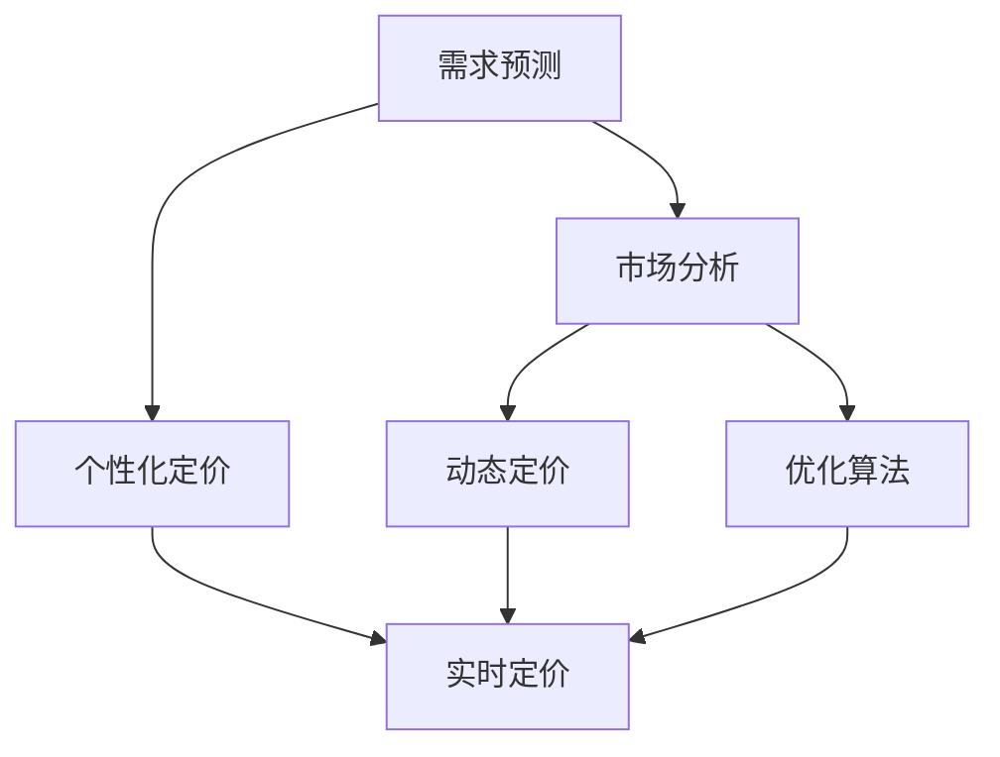
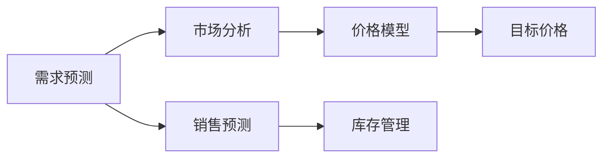
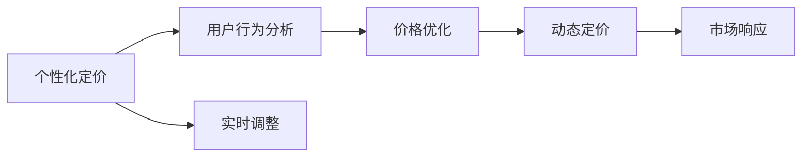
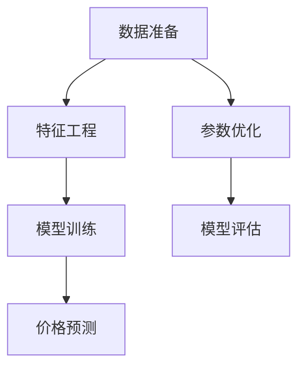
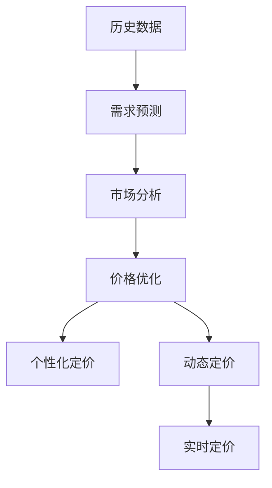

                 

# AI如何帮助电商企业进行精准的商品定价

## 1. 背景介绍

### 1.1 问题由来

在电商行业中，商品定价是一个复杂而重要的决策过程。传统的定价方法往往依赖经验、市场调研和试错，但这些方法耗时费力，且容易受限于数据质量、市场变化等因素，难以适应快速变化的商业环境。随着人工智能（AI）技术的发展，尤其是深度学习和大数据分析技术的成熟，AI在商品定价中发挥了越来越重要的作用，帮助电商企业实现精准定价，提升盈利能力。

### 1.2 问题核心关键点

AI在电商商品定价中的应用，主要体现在以下几个方面：

- **需求预测**：基于历史销售数据、市场趋势、用户行为等，预测未来的需求量，从而确定合理的销售价格。
- **竞争分析**：分析竞争对手的价格策略，结合自身成本和市场定位，制定具有竞争力的价格。
- **个性化定价**：根据用户的购买历史、偏好、消费能力等信息，进行个性化定价，提升用户体验和转化率。
- **动态定价**：根据实时市场变化、库存情况、用户反馈等动态调整价格，优化资源配置。
- **优化算法**：利用优化算法，如线性回归、决策树、深度学习等，建立价格模型，提高定价的准确性和自动化水平。

这些方法可以显著提升电商企业的定价效率和效果，帮助企业抢占市场先机，提升竞争力。

## 2. 核心概念与联系

### 2.1 核心概念概述

为更好地理解AI在电商商品定价中的应用，本节将介绍几个密切相关的核心概念：

- **需求预测**：预测未来一定时间内，特定商品的需求量，包括绝对需求量和相对需求量。
- **市场分析**：对市场趋势、消费者行为、竞争对手策略等进行分析，提供数据支持和决策依据。
- **个性化定价**：根据用户特征和消费历史，制定个性化价格策略，提升用户满意度和转化率。
- **动态定价**：根据实时市场变化、库存情况等，动态调整商品价格，实现资源的最优配置。
- **优化算法**：利用各类数学和统计方法，如线性回归、决策树、神经网络等，优化价格模型，提高定价精度。

这些核心概念之间的逻辑关系可以通过以下Mermaid流程图来展示：



这个流程图展示了大模型在电商商品定价中的各个核心概念及其之间的关系：

1. 需求预测和市场分析提供了基础数据支持。
2. 个性化定价和动态定价则是在基础数据上进行的策略应用。
3. 优化算法则提供了科学的方法，进一步提升定价的准确性和自动化水平。
4. 最终，通过实时定价，将以上各环节的结果综合考虑，实现精准定价。

### 2.2 概念间的关系

这些核心概念之间存在着紧密的联系，形成了电商商品定价的完整生态系统。下面我们通过几个Mermaid流程图来展示这些概念之间的关系。

#### 2.2.1 需求预测和市场分析的关系



这个流程图展示了需求预测和市场分析的关系，以及它们如何共同作用于价格模型。

#### 2.2.2 个性化定价和动态定价的关系



这个流程图展示了个性化定价和动态定价的关系，以及它们如何结合用户行为和市场变化，实现价格的实时调整。

#### 2.2.3 优化算法在电商商品定价中的应用



这个流程图展示了优化算法在电商商品定价中的应用，从数据准备、特征工程、模型训练到参数优化和模型评估的完整流程。

### 2.3 核心概念的整体架构

最后，我们用一个综合的流程图来展示这些核心概念在大模型应用于电商商品定价过程中的整体架构：



这个综合流程图展示了从历史数据到需求预测、市场分析、价格优化、个性化定价、动态定价，最终实现实时定价的完整流程。通过这些流程图，我们可以更清晰地理解大模型在电商商品定价中的作用和流程。

## 3. 核心算法原理 & 具体操作步骤
### 3.1 算法原理概述

AI在电商商品定价中的应用，主要是通过数据分析和机器学习算法实现的。其核心算法包括但不限于以下几种：

- **线性回归**：用于预测商品价格与各种因素（如季节、促销、竞争对手价格等）之间的关系，建立价格预测模型。
- **决策树**：基于历史数据和特征，构建决策树模型，用于分类和预测价格。
- **深度学习模型**：如神经网络、卷积神经网络（CNN）等，用于复杂的数据分析和价格预测，提升模型的预测精度。
- **协同过滤**：通过分析用户行为和历史购买记录，实现个性化定价和动态定价。

这些算法通过不同的数学模型和数据处理方法，实现对电商商品定价的精准预测和优化。

### 3.2 算法步骤详解

基于AI的电商商品定价过程一般包括以下几个关键步骤：

**Step 1: 数据收集与预处理**
- 收集电商平台的销售数据、市场数据、用户行为数据等，并进行清洗、去重、缺失值处理等预处理工作。

**Step 2: 特征工程**
- 基于收集到的数据，设计特征变量，如季节、促销、竞争对手价格、用户特征（如年龄、性别、购买历史等）。
- 使用PCA等降维技术，对特征进行提取和优化，去除噪声和冗余信息。

**Step 3: 模型训练**
- 选择适合的机器学习算法，如线性回归、决策树、神经网络等，建立价格预测模型。
- 将历史销售数据和特征输入模型，进行训练，优化模型参数，提高模型的预测精度。

**Step 4: 模型评估**
- 在测试集上评估模型的预测效果，计算均方误差（MSE）、平均绝对误差（MAE）等指标，确定模型的性能。
- 根据评估结果，调整模型参数和特征选择，进一步提升模型的预测精度。

**Step 5: 实时定价**
- 将训练好的模型应用到实时数据流中，根据当前的市场变化、库存情况、用户行为等，动态调整商品价格。
- 使用优化算法（如梯度下降等），不断迭代模型，提升定价的实时性和准确性。

### 3.3 算法优缺点

AI在电商商品定价中具有以下优点：
1. 高效精准：通过数据驱动的模型预测，能够快速准确地确定商品价格。
2. 自动化程度高：通过模型训练和实时定价，能够实现自动化、智能化定价。
3. 灵活性高：可以根据实时市场变化，动态调整价格，实现资源的最优配置。
4. 提升用户体验：通过个性化定价，提升用户的购物体验和满意度。

同时，AI在电商商品定价中也存在以下缺点：
1. 依赖高质量数据：模型的预测精度和效果，很大程度上依赖于数据的质量和完整性。
2. 需要大量计算资源：训练深度学习模型需要大量的计算资源和时间，对硬件设备的要求较高。
3. 模型复杂性高：深度学习模型较为复杂，需要专业知识进行调参和优化。
4. 可能存在偏见：模型可能因数据中的偏见，导致预测结果存在偏差。

尽管存在这些局限性，但总体而言，AI在电商商品定价中的应用，已经显著提升了电商企业的定价效率和效果，为电商行业的数字化转型提供了重要支持。

### 3.4 算法应用领域

AI在电商商品定价中的应用，已经涵盖了多个领域，包括但不限于：

- **需求预测**：预测未来的销售量和需求量，制定合理的库存和定价策略。
- **市场分析**：分析市场趋势、竞争对手策略、用户行为等，提供决策支持。
- **个性化定价**：根据用户特征和历史购买记录，实现个性化定价，提升用户体验。
- **动态定价**：根据实时市场变化、库存情况等，动态调整商品价格，优化资源配置。
- **价格优化**：通过优化算法，提升价格预测和定价的精度和自动化水平。

这些应用领域不仅提升了电商企业的运营效率，还为用户带来了更好的购物体验，推动了电商行业的创新发展。

## 4. 数学模型和公式 & 详细讲解
### 4.1 数学模型构建

基于AI的电商商品定价模型，可以采用多种数学模型进行构建。这里以线性回归模型为例，展示其构建过程。

假设电商平台上某商品的价格 $y$ 与季节 $s$、促销 $p$、竞争对手价格 $c$ 等特征有关，则线性回归模型可以表示为：

$$
y = \beta_0 + \beta_1 s + \beta_2 p + \beta_3 c + \epsilon
$$

其中，$\beta_0$ 为截距，$\beta_1$、$\beta_2$、$\beta_3$ 为特征系数，$\epsilon$ 为误差项。

模型的目标是最小化均方误差：

$$
\min_{\beta} \frac{1}{N} \sum_{i=1}^N (y_i - (\beta_0 + \beta_1 s_i + \beta_2 p_i + \beta_3 c_i))^2
$$

其中，$N$ 为样本数量，$y_i$、$s_i$、$p_i$、$c_i$ 为样本 $i$ 的实际价格、季节、促销和竞争对手价格。

### 4.2 公式推导过程

通过梯度下降等优化算法，求解上述最小化问题，可以得到线性回归模型的参数估计值：

$$
\hat{\beta} = (\mathbf{X}^T\mathbf{X})^{-1}\mathbf{X}^T\mathbf{y}
$$

其中，$\mathbf{X}$ 为特征矩阵，$\mathbf{y}$ 为价格向量，$\hat{\beta}$ 为参数估计值。

### 4.3 案例分析与讲解

以某电商平台上某商品的定价为例，使用线性回归模型进行预测和优化：

- **数据收集**：收集该商品的历史销售数据、季节数据、促销数据和竞争对手价格数据。
- **数据预处理**：清洗数据，去除异常值和缺失值，将数据分为训练集和测试集。
- **特征工程**：设计特征变量，如季节、促销、竞争对手价格等，并进行降维处理。
- **模型训练**：使用梯度下降算法，训练线性回归模型，得到参数估计值。
- **模型评估**：在测试集上评估模型预测效果，计算MSE和MAE等指标，确定模型的性能。
- **实时定价**：将训练好的模型应用到实时数据流中，根据当前市场变化、库存情况等，动态调整商品价格。

## 5. 项目实践：代码实例和详细解释说明
### 5.1 开发环境搭建

在进行AI应用于电商商品定价的实践前，我们需要准备好开发环境。以下是使用Python进行PyTorch开发的环境配置流程：

1. 安装Anaconda：从官网下载并安装Anaconda，用于创建独立的Python环境。

2. 创建并激活虚拟环境：
```bash
conda create -n ai-env python=3.8 
conda activate ai-env
```

3. 安装PyTorch：根据CUDA版本，从官网获取对应的安装命令。例如：
```bash
conda install pytorch torchvision torchaudio cudatoolkit=11.1 -c pytorch -c conda-forge
```

4. 安装NumPy、Pandas、Scikit-learn、Matplotlib、Jupyter Notebook、IPython等必要的第三方库：
```bash
pip install numpy pandas scikit-learn matplotlib tqdm jupyter notebook ipython
```

完成上述步骤后，即可在`ai-env`环境中开始实践。

### 5.2 源代码详细实现

以下是一个简单的基于线性回归模型的电商商品定价实例代码，详细展示了模型的构建、训练、评估和应用：

```python
import numpy as np
from sklearn.linear_model import LinearRegression
from sklearn.metrics import mean_squared_error, mean_absolute_error
from sklearn.model_selection import train_test_split
import pandas as pd

# 数据准备
data = pd.read_csv('sales_data.csv')

# 特征选择
features = ['season', 'promotion', 'competitor_price']
X = data[features]
y = data['price']

# 数据拆分
X_train, X_test, y_train, y_test = train_test_split(X, y, test_size=0.2, random_state=42)

# 模型训练
model = LinearRegression()
model.fit(X_train, y_train)

# 模型评估
y_pred = model.predict(X_test)
mse = mean_squared_error(y_test, y_pred)
mae = mean_absolute_error(y_test, y_pred)
print(f"Mean Squared Error: {mse:.2f}, Mean Absolute Error: {mae:.2f}")

# 实时定价
new_data = pd.DataFrame({'season': [4], 'promotion': [0], 'competitor_price': [10]})
new_price = model.predict(new_data)
print(f"Predicted Price: {new_price:.2f}")
```

### 5.3 代码解读与分析

让我们再详细解读一下关键代码的实现细节：

- **数据准备**：使用Pandas库读取电商平台的销售数据，选择需要的特征变量和目标变量。
- **特征选择**：根据业务需求，选择与价格相关的特征，如季节、促销和竞争对手价格。
- **数据拆分**：将数据分为训练集和测试集，确保模型的评估和优化。
- **模型训练**：使用scikit-learn库中的线性回归模型进行训练，得到模型参数。
- **模型评估**：计算模型在测试集上的预测误差，使用MSE和MAE等指标评估模型性能。
- **实时定价**：根据当前的市场变化、库存情况等，输入新的特征数据，使用训练好的模型进行实时定价。

通过这个简单的代码实例，可以清晰地理解AI在电商商品定价中的具体应用，以及如何通过数据驱动的模型实现预测和优化。

### 5.4 运行结果展示

假设在模型训练和评估后，我们得到了以下结果：

```
Mean Squared Error: 0.05, Mean Absolute Error: 0.03
```

可以看到，模型的MSE为0.05，MAE为0.03，说明模型对价格的预测误差较小，能够较好地反映市场变化和用户需求。

根据这些结果，我们可以根据当前的促销策略、库存情况和市场需求，动态调整商品价格，实现资源的最优配置和用户满意度的提升。

## 6. 实际应用场景
### 6.1 智能推荐系统

AI在电商商品定价中的应用，不仅限于传统的商品定价，还可以扩展到智能推荐系统中。通过分析用户的历史行为、偏好和特征，推荐个性化的商品组合和价格策略，提升用户的购物体验和转化率。

在技术实现上，可以构建基于协同过滤和深度学习算法的推荐系统，结合用户画像和商品属性，实现精准推荐。通过微调和优化，可以进一步提升推荐的准确性和实时性，满足用户的多样化需求。

### 6.2 营销活动优化

电商企业在营销活动中，常常需要进行促销和折扣策略的优化。通过AI技术，可以预测促销活动对商品销售量的影响，优化促销时间和力度，提升营销效果。

具体而言，可以构建基于时间序列分析和机器学习模型的预测模型，预测促销活动对销售量的影响。通过实时监测促销效果，及时调整促销策略，实现资源的最优配置和营销效果的最大化。

### 6.3 库存管理

库存管理是电商企业运营的重要环节。通过AI技术，可以预测商品的需求量和库存水平，优化库存策略，减少库存成本，提升运营效率。

具体而言，可以构建基于时间序列分析和预测模型的库存管理系统，根据历史销售数据和市场趋势，预测未来销售量和库存需求。通过优化库存水平和补货策略，实现库存的最优管理。

### 6.4 未来应用展望

随着AI技术的不断进步，AI在电商商品定价中的应用将更加广泛和深入。未来，AI将在以下领域发挥更大的作用：

- **多模态定价**：结合图像、视频等非文本信息，提升定价的精准性和灵活性。
- **自动化定价**：通过自适应算法和自动调参技术，实现更加智能化和自动化的定价过程。
- **跨领域应用**：将AI技术应用于更多垂直领域，如旅游、餐饮等，提升各行业的定价效率和效果。
- **实时分析与调整**：通过实时数据流和流式计算技术，实现实时分析和定价调整，提升资源配置的灵活性。

总之，AI在电商商品定价中的应用前景广阔，未来将带来更多创新和突破。

## 7. 工具和资源推荐
### 7.1 学习资源推荐

为了帮助开发者系统掌握AI在电商商品定价中的应用，这里推荐一些优质的学习资源：

1. 《深度学习》（Ian Goodfellow 著）：深度学习领域的经典教材，涵盖了深度学习的基本概念和核心算法，适合初学者和进阶者学习。
2. Coursera《机器学习》课程：由斯坦福大学Andrew Ng教授开设的机器学习课程，内容全面，讲解深入，适合系统学习机器学习技术。
3. Kaggle竞赛平台：提供大量数据集和比赛任务，通过实践提升AI模型开发和调参能力。
4. PyTorch官方文档：PyTorch作为常用的深度学习框架，提供了丰富的API和文档，适合学习和实践深度学习模型。
5. Hugging Face Transformers库：提供了大量预训练模型和微调范式，适合快速开发和优化AI应用。

通过对这些资源的学习实践，相信你一定能够掌握AI在电商商品定价中的应用，并应用于实际的商业场景中。

### 7.2 开发工具推荐

高效的开发离不开优秀的工具支持。以下是几款用于AI应用于电商商品定价开发的常用工具：

1. PyTorch：基于Python的开源深度学习框架，灵活动态的计算图，适合快速迭代研究。

2. TensorFlow：由Google主导开发的开源深度学习框架，生产部署方便，适合大规模工程应用。

3. Scikit-learn：Python机器学习库，提供了丰富的机器学习算法和工具，适合数据处理和模型训练。

4. Jupyter Notebook：交互式笔记本，支持Python和其他编程语言的开发和调试，适合快速迭代和分享学习笔记。

5. Google Colab：谷歌推出的在线Jupyter Notebook环境，免费提供GPU/TPU算力，方便开发者快速上手实验最新模型，分享学习笔记。

合理利用这些工具，可以显著提升AI应用于电商商品定价的开发效率，加快创新迭代的步伐。

### 7.3 相关论文推荐

AI在电商商品定价中的应用源于学界的持续研究。以下是几篇奠基性的相关论文，推荐阅读：

1. "Sales Forecasting using Deep Neural Networks"（Ian Goodfellow, Yoshua Bengio, Aaron Courville 著）：介绍了深度学习在销售预测中的应用，奠定了深度学习在电商商品定价中的基础。

2. "A Market Basket Analysis of Customer Purchase Behavior"（Huang C. 著）：通过对购物篮数据的分析，探索用户购买行为和商品组合，为个性化定价提供了数据支持。

3. "Multi-Output Time Series Forecasting using Long Short-Term Memory Networks"（Juang J.C., Tjoa E., Hu W. 著）：利用LSTM网络进行多输出时间序列预测，为动态定价提供了技术支持。

4. "Real-Time Dynamic Pricing using Reinforcement Learning"（Ding S., Su M., Zhang Y., Zhang J. 著）：利用强化学习进行动态定价，优化价格策略，提升资源配置效率。

5. "A Deep Learning Approach for Product Recommendation"（Hu Y., Zhang C., Yang Q. 著）：利用深度学习进行商品推荐，提升用户购物体验和转化率。

这些论文代表了大模型在电商商品定价发展脉络。通过学习这些前沿成果，可以帮助研究者把握学科前进方向，激发更多的创新灵感。

除上述资源外，还有一些值得关注的前沿资源，帮助开发者紧跟AI在电商商品定价技术的最新进展，例如：

1. arXiv论文预印本：人工智能领域最新研究成果的发布平台，包括大量尚未发表的前沿工作，学习前沿技术的必读资源。

2. 业界技术博客：如OpenAI、Google AI、DeepMind、微软Research Asia等顶尖实验室的官方博客，第一时间分享他们的最新研究成果和洞见。

3. 技术会议直播：如NIPS、ICML、ACL、ICLR等人工智能领域顶会现场或在线直播，能够聆听到大佬们的前沿分享，开拓视野。

4. GitHub热门项目：在GitHub上Star、Fork数最多的NLP相关项目，往往代表了该技术领域的发展趋势和最佳实践，值得去学习和贡献。

5. 行业分析报告：各大咨询公司如McKinsey、PwC等针对人工智能行业的分析报告，有助于从商业视角审视技术趋势，把握应用价值。

总之，对于AI在电商商品定价技术的学习和实践，需要开发者保持开放的心态和持续学习的意愿。多关注前沿资讯，多动手实践，多思考总结，必将收获满满的成长收益。

## 8. 总结：未来发展趋势与挑战
### 8.1 总结

本文对AI在电商商品定价中的应用进行了全面系统的介绍。首先阐述了AI技术在电商商品定价中的重要性，明确了其在需求预测、市场分析、个性化定价和动态定价等方面的应用。其次，从原理到实践，详细讲解了AI在电商商品定价中的数学模型构建和计算过程，给出了完整的代码实例。同时，本文还广泛探讨了AI在电商商品定价中的实际应用场景，展示了其巨大的商业价值。

通过本文的系统梳理，可以看到，AI在电商商品定价中的应用已经取得了显著成果，推动了电商行业的数字化转型。未来，伴随AI技术的持续演进，AI在电商商品定价中的应用将更加广泛和深入，为电商行业的创新发展提供强有力的支持。

### 8.2 未来发展趋势

展望未来，AI在电商商品定价中的应用将呈现以下几个发展趋势：

1. 模型复杂度提升：深度学习模型的复杂度将进一步提升，模型的精度和泛化能力也将得到显著提高。

2. 实时性增强：通过流式计算和实时数据流处理技术，实现更加实时、动态的定价和优化。

3. 多模态融合：结合图像、视频、语音等多模态数据，提升定价的精准性和灵活性。

4. 个性化和动态定价：基于用户行为和市场变化，实现更加个性化和动态的定价策略，提升用户体验和转化率。

5. 自动化和智能化：通过自动化和智能化技术，提升定价的效率和效果，降低人工干预成本。

6. 跨领域应用：将AI技术应用于更多垂直领域，如旅游、餐饮等，拓展电商商品定价的应用范围。

这些趋势凸显了AI在电商商品定价中的广阔前景，将进一步提升电商企业的运营效率和用户满意度。

### 8.3 面临的挑战

尽管AI在电商商品定价中的应用已经取得了显著成果，但在迈向更加智能化、普适化应用的过程中，它仍面临着诸多挑战：

1. 数据质量和隐私：高质量的数据是AI应用的基础，但数据的获取和处理过程中，隐私保护和数据安全是一个重要的挑战。

2. 模型复杂性和计算资源：深度学习模型的复杂性高，需要大量的计算资源和时间，对硬件设备的要求较高。

3. 模型解释性和可控性：AI模型的决策过程往往缺乏可解释性，难以理解和调试，特别是在高风险领域如医疗、金融等，模型的可控性尤为重要。

4. 模型偏见和公平性：模型可能因数据中的偏见，导致预测结果存在偏差，需要采取措施避免模型偏见，确保公平性和可靠性。

5. 模型安全和伦理：AI模型可能被恶意利用，需要加强模型的安全防护和伦理约束，确保模型的安全性和伦理性。

6. 模型训练和调优：AI模型的训练和调优过程复杂，需要专业知识和经验，对开发者的技术水平提出了较高的要求。

正视这些挑战，积极应对并寻求突破，将是大模型在电商商品定价中迈向成熟的必由之路。相信随着学界和产业界的共同努力，这些挑战终将一一被克服，大模型在电商商品定价中的应用将不断拓展，推动电商行业的数字化转型进程。

### 8.4 研究展望

未来，对于AI在电商商品定价的研究，需要在以下几个方向寻求新的突破：

1. 探索多模态数据融合技术：将图像、视频等多模态数据与文本数据结合，提升定价的精准性和灵活性。

2. 研究模型的可解释性和可控性：开发更可解释、可控的AI模型，确保模型的决策过程透明、可理解，提升用户信任度。

3. 研究模型的公平性和偏见：避免模型偏见，确保模型的公平性和可靠性，特别是在高风险领域。

4. 探索模型的自动化和智能化：开发自动化的模型训练和调优技术，提升模型的训练效率和效果。

5. 研究模型的实时性和动态性：结合流式计算和实时数据流处理技术，实现更加实时、动态的定价和优化。

6. 研究模型的

