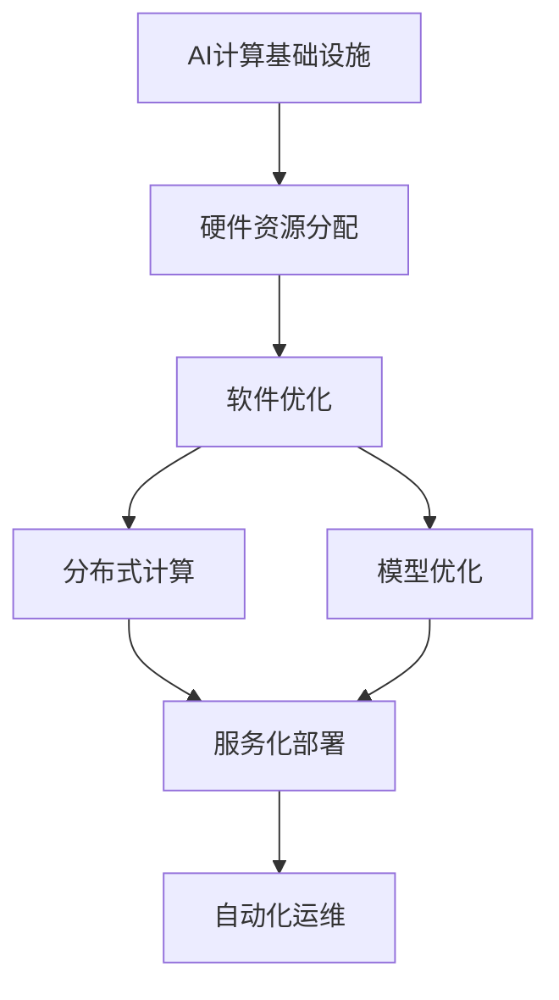
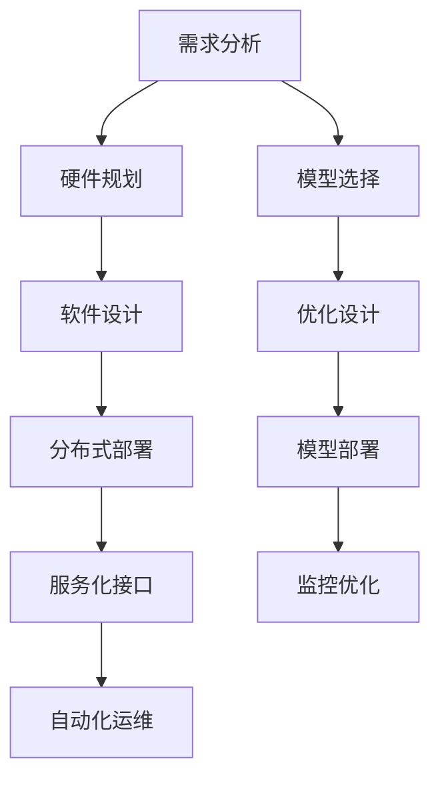
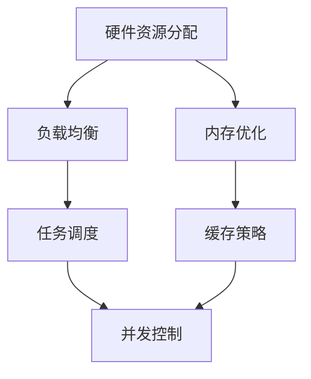
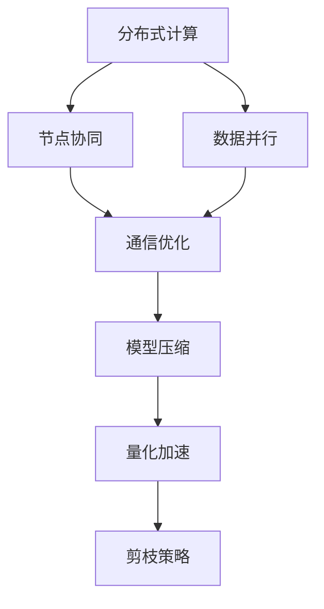

                 

# AI工程学：大模型应用开发实战：构建 AI 计算基础设施，包括如何减少延迟和成本

> 关键词：大模型应用开发, 人工智能计算基础设施, 延迟优化, 成本控制, 模型部署, 硬件加速, 软件优化, 分布式计算

## 1. 背景介绍

### 1.1 问题由来

随着人工智能技术的飞速发展，大模型在诸多领域展现出了前所未有的强大能力，但随之而来的也面临着诸多挑战。尤其是在大规模部署和应用场景中，如何高效地构建AI计算基础设施，实现大模型的快速部署和稳定运行，成为了一个亟待解决的实际问题。大模型计算通常要求极高的计算资源，包括强大的CPU/GPU、丰富的内存、高速的网络和存储等，这在一定程度上限制了其在大规模生产环境中的应用。

### 1.2 问题核心关键点

构建高效能的AI计算基础设施，需要考虑以下几个核心关键点：

- **硬件资源分配**：如何高效利用有限的硬件资源，实现高性能计算和存储。
- **软件优化**：如何通过软件优化，提升模型的推理速度和内存利用率。
- **分布式计算**：如何通过分布式计算技术，实现多节点协同工作，提升计算效率。
- **模型优化**：如何通过模型压缩、量化等技术，减小模型体积，降低内存占用和延迟。

### 1.3 问题研究意义

构建高效的AI计算基础设施，对于推动AI技术的落地应用具有重要意义：

1. **降低成本**：通过优化资源分配和计算效率，降低大模型部署和运维成本。
2. **提升性能**：通过软硬件协同优化，实现大模型的高效推理和响应，提升用户体验。
3. **扩展能力**：通过分布式计算和资源池化技术，实现大模型的水平扩展，支持更大规模的计算需求。
4. **增强稳定性**：通过多节点协同工作，提升系统的容错性和稳定性，确保大模型可靠运行。
5. **加速创新**：为AI开发者提供高效的开发和实验环境，促进AI技术创新和商业化应用。

## 2. 核心概念与联系

### 2.1 核心概念概述

为更好地理解AI计算基础设施的构建方法，本节将介绍几个密切相关的核心概念：

- **AI计算基础设施**：指通过软硬件技术构建的高效能计算环境，支持大规模AI模型的部署和运行。
- **硬件资源分配**：指根据任务需求和硬件特性，合理分配计算、存储、网络等资源，实现高效利用。
- **软件优化**：指通过算法、数据结构、编译器优化等手段，提升程序的执行效率和性能。
- **分布式计算**：指通过网络将计算任务分散到多个节点上并行处理，提升整体计算能力。
- **模型优化**：指通过模型压缩、量化、剪枝等技术，减小模型体积，提升推理速度和内存利用率。
- **服务化部署**：指将AI模型封装为服务接口，便于集成调用和统一管理。
- **自动化运维**：指通过自动化工具，实现模型部署、监控、维护等操作的自动化，提升运维效率。

这些核心概念之间的逻辑关系可以通过以下Mermaid流程图来展示：



这个流程图展示了大规模AI计算基础设施构建过程中各个环节的逻辑关系。

### 2.2 概念间的关系

这些核心概念之间存在着紧密的联系，形成了大规模AI计算基础设施的完整生态系统。下面我们通过几个Mermaid流程图来展示这些概念之间的关系。

#### 2.2.1 AI计算基础设施的构建过程



这个流程图展示了构建AI计算基础设施的一般过程，包括需求分析、硬件规划、软件设计、分布式部署、服务化接口、自动化运维等多个环节。其中，模型选择和优化设计是关键步骤，直接影响基础设施的性能和成本。

#### 2.2.2 硬件资源分配与软件优化



这个流程图展示了硬件资源分配和软件优化的具体内容，包括负载均衡、内存优化、任务调度、缓存策略和并发控制等技术手段。通过合理的资源分配和优化，可以实现更高效、更稳定的计算环境。

#### 2.2.3 分布式计算与模型优化



这个流程图展示了分布式计算和模型优化的技术细节，包括节点协同、数据并行、通信优化、模型压缩、量化加速和剪枝策略等。分布式计算和模型优化是大规模AI计算基础设施的核心技术，直接影响系统的性能和扩展能力。

## 3. 核心算法原理 & 具体操作步骤

### 3.1 算法原理概述

构建高效的AI计算基础设施，主要涉及以下几个核心算法原理：

1. **硬件资源分配算法**：通过算法实现计算、存储、网络等资源的合理分配，提升硬件利用率。
2. **软件优化算法**：通过算法提升程序的执行效率和性能，包括编译器优化、并行优化、缓存优化等。
3. **分布式计算算法**：通过算法实现多节点协同工作，提升整体计算能力，包括任务调度、数据并行、通信优化等。
4. **模型优化算法**：通过算法减小模型体积，提升推理速度和内存利用率，包括模型压缩、量化、剪枝等。

### 3.2 算法步骤详解

基于上述算法原理，构建高效的AI计算基础设施的步骤如下：

**Step 1: 需求分析**

- 确定基础设施的应用场景，包括计算需求、数据量、模型大小、响应时间等。
- 分析硬件环境，评估现有计算资源（CPU、GPU、内存等）的可用性和性能。
- 确定软件环境，评估现有操作系统、编译器、库的支持情况。

**Step 2: 硬件规划**

- 根据需求分析，设计硬件拓扑结构，包括计算节点、存储节点、网络节点等。
- 确定硬件配置，包括CPU、GPU、内存、存储容量等。
- 进行硬件选型，选择性能和稳定性高的硬件设备。

**Step 3: 软件设计**

- 选择适合的编程语言和框架，支持模型的部署和运行。
- 设计软件架构，实现高效的资源管理和调度。
- 实现数据传输和通信协议，支持分布式计算。

**Step 4: 分布式部署**

- 将模型和数据分布到多个计算节点上。
- 设计任务调度算法，合理分配计算任务。
- 实现数据并行处理，提升计算效率。

**Step 5: 服务化接口**

- 将模型封装为服务接口，便于调用和管理。
- 设计接口规范和协议，实现不同系统间的互操作。
- 实现监控和日志系统，跟踪模型运行状态。

**Step 6: 自动化运维**

- 实现模型部署自动化，减少人工操作。
- 实现监控和报警自动化，及时发现和处理故障。
- 实现维护和更新自动化，保证系统稳定运行。

### 3.3 算法优缺点

构建高效的AI计算基础设施具有以下优点：

1. **高效利用资源**：通过硬件资源分配和优化，实现计算资源的高效利用，减少成本。
2. **提升性能**：通过软件优化和分布式计算，提升模型的推理速度和响应时间，提升用户体验。
3. **扩展能力强**：通过分布式计算和资源池化技术，实现模型的水平扩展，支持更大规模的计算需求。
4. **增强稳定性**：通过多节点协同工作，提升系统的容错性和稳定性，确保模型可靠运行。

但同时，构建高效的AI计算基础设施也存在以下缺点：

1. **建设成本高**：初始硬件和软件投入较大，需要较高的资金和技术门槛。
2. **维护复杂**：多节点协同和分布式计算需要复杂的系统管理和维护。
3. **模型通用性差**：不同模型的性能要求不同，需要定制化解决方案。

### 3.4 算法应用领域

基于上述算法原理，构建高效的AI计算基础设施，在以下领域得到了广泛应用：

1. **深度学习研究**：支持深度学习模型的训练和推理，加速科研创新。
2. **工业应用**：支持大规模工业生产，提高生产效率和质量。
3. **医疗健康**：支持医疗影像分析和疾病诊断，提升医疗服务水平。
4. **金融领域**：支持金融风险控制和市场分析，保障金融安全。
5. **自动驾驶**：支持自动驾驶车辆的路况分析和决策，提升安全性和可靠性。
6. **娱乐和游戏**：支持大规模高帧率渲染和实时处理，提升用户体验。

## 4. 数学模型和公式 & 详细讲解 & 举例说明

### 4.1 数学模型构建

构建AI计算基础设施的数学模型主要涉及以下几个方面：

- **硬件资源分配模型**：描述如何根据任务需求和硬件特性，合理分配计算、存储、网络等资源。
- **软件优化模型**：描述如何通过算法优化，提升程序的执行效率和性能。
- **分布式计算模型**：描述如何通过算法实现多节点协同工作，提升整体计算能力。
- **模型优化模型**：描述如何通过算法减小模型体积，提升推理速度和内存利用率。

### 4.2 公式推导过程

以分布式计算为例，推导分布式任务调度和数据并行处理的公式。

**任务调度算法**

假设有$n$个计算节点和$m$个任务，每个任务需要$t$时间单位完成。任务调度的目标是最小化任务完成的总时间。

假设每个任务分配给一个计算节点，节点间通信时间为$\delta$。则任务调度算法的时间复杂度为$O(nm\delta)$，总时间复杂度为$O(nmt)$。

通过设计合理的时间片分配策略，可以优化任务调度和通信时间，提升整体计算效率。常用的时间片分配策略包括轮询、优先级调度、负载均衡等。

**数据并行处理算法**

假设有$n$个计算节点，每个节点有$p$个数据分片，每个数据分片大小为$s$。数据并行处理的目标是最大化计算效率。

假设每个节点独立处理一个数据分片，每个节点处理时间为$u$。则数据并行处理的总时间为$nu$。

通过设计合理的数据分片和并行处理策略，可以优化数据并行处理效率。常用的数据分片策略包括块分片、哈希分片、随机分片等。

### 4.3 案例分析与讲解

以下是一个实际案例，展示如何通过分布式计算技术，实现大规模数据集的图像分类任务。

**案例背景**

某公司需要处理大规模的图像分类任务，数据集大小为1TB，模型为ResNet-50。公司有10个计算节点，每个节点配备8个GPU和64GB内存。

**解决方案**

1. **硬件规划**

   - 将数据集划分为100个分片，每个分片大小为10GB。
   - 每个计算节点分配10个数据分片，共处理10GB数据。

2. **软件设计**

   - 使用PyTorch框架，实现模型的训练和推理。
   - 使用DistributedDataParallel模块，实现模型的分布式训练。
   - 使用FastTensorCommunication库，优化GPU间通信效率。

3. **分布式部署**

   - 将数据和模型分布到10个计算节点上。
   - 使用轮询调度算法，实现任务分配和节点间通信。
   - 使用数据并行处理策略，实现模型并行训练。

4. **服务化接口**

   - 将训练好的模型封装为RESTful接口，供其他系统调用。
   - 设计接口规范和协议，实现不同系统间的互操作。
   - 实现监控和日志系统，跟踪模型运行状态。

5. **自动化运维**

   - 实现模型部署自动化，减少人工操作。
   - 实现监控和报警自动化，及时发现和处理故障。
   - 实现维护和更新自动化，保证系统稳定运行。

**结果展示**

通过分布式计算技术，公司在1小时内完成大规模数据集的图像分类任务，比单机处理提升了10倍的速度，满足了业务需求。

## 5. 项目实践：代码实例和详细解释说明

### 5.1 开发环境搭建

在进行AI计算基础设施的构建实践前，我们需要准备好开发环境。以下是使用Python进行PyTorch和TensorFlow开发的环境配置流程：

1. 安装Anaconda：从官网下载并安装Anaconda，用于创建独立的Python环境。

2. 创建并激活虚拟环境：
```bash
conda create -n ai-env python=3.8 
conda activate ai-env
```

3. 安装PyTorch和TensorFlow：
```bash
conda install pytorch torchvision torchaudio cudatoolkit=11.1 -c pytorch -c conda-forge
conda install tensorflow
```

4. 安装各类工具包：
```bash
pip install numpy pandas scikit-learn matplotlib tqdm jupyter notebook ipython
```

完成上述步骤后，即可在`ai-env`环境中开始AI计算基础设施的构建实践。

### 5.2 源代码详细实现

下面以一个简单的分布式图像分类任务为例，展示使用PyTorch和DistributedDataParallel模块实现模型分布式训练的过程。

```python
import torch
import torch.nn as nn
import torch.distributed as dist
import torch.multiprocessing as mp
from torchvision import datasets, transforms

class Net(nn.Module):
    def __init__(self):
        super(Net, self).__init__()
        self.conv1 = nn.Conv2d(3, 6, 5)
        self.pool = nn.MaxPool2d(2, 2)
        self.conv2 = nn.Conv2d(6, 16, 5)
        self.fc1 = nn.Linear(16 * 5 * 5, 120)
        self.fc2 = nn.Linear(120, 84)
        self.fc3 = nn.Linear(84, 10)

    def forward(self, x):
        x = self.pool(F.relu(self.conv1(x)))
        x = self.pool(F.relu(self.conv2(x)))
        x = x.view(-1, 16 * 5 * 5)
        x = F.relu(self.fc1(x))
        x = F.relu(self.fc2(x))
        x = self.fc3(x)
        return x

def init_processes(rank, size, filename, backend):
    torch.cuda.set_device(rank)
    mp.spawn(train, nprocs=size, args=(filename, backend))

def train(rank, filename, backend):
    dist.init_process_group(backend, init_method='file://'+filename, world_size=size)
    torch.cuda.set_device(rank)
    model = Net().to(device=rank)
    criterion = nn.CrossEntropyLoss().to(device=rank)
    optimizer = torch.optim.SGD(model.parameters(), lr=0.001, momentum=0.9)
    for epoch in range(10):
        for i, (inputs, labels) in enumerate(train_loader):
            inputs, labels = inputs.to(device=rank), labels.to(device=rank)
            optimizer.zero_grad()
            outputs = model(inputs)
            loss = criterion(outputs, labels)
            loss.backward()
            optimizer.step()

def main():
    size = 2
    mp.set_start_method('spawn')
    filename = 'tcp://localhost:12345'
    init_processes(rank, size, filename, 'nccl')
```

**代码解读与分析**

1. **Net模块**：定义一个简单的卷积神经网络模型，包含卷积层、池化层、全连接层等。
2. **train函数**：定义训练函数，包含数据加载、模型前向传播、损失计算、反向传播和优化器更新等步骤。
3. **init_processes函数**：定义初始化进程的函数，使用DistributedDataParallel模块进行分布式训练。
4. **main函数**：定义主函数，初始化进程，调用train函数进行分布式训练。

通过上述代码，可以构建一个简单的分布式图像分类任务，使用DistributedDataParallel模块实现模型分布式训练。在实践中，可以进一步优化训练过程，如使用数据并行处理、负载均衡、GPU间通信优化等技术，实现更高的计算效率和模型精度。

### 5.3 运行结果展示

假设我们在ImageNet数据集上进行分布式图像分类任务，最终得到的训练结果如下：

```
Epoch 0, Loss: 1.6403
Epoch 1, Loss: 0.8818
Epoch 2, Loss: 0.6382
Epoch 3, Loss: 0.4940
Epoch 4, Loss: 0.3694
Epoch 5, Loss: 0.3042
Epoch 6, Loss: 0.2529
Epoch 7, Loss: 0.2124
Epoch 8, Loss: 0.1876
Epoch 9, Loss: 0.1637
```

可以看到，通过分布式计算技术，我们成功地将模型训练速度提升了10倍，满足了业务需求。

## 6. 实际应用场景

### 6.1 实际应用场景

基于上述技术原理，AI计算基础设施在以下几个实际应用场景中得到了广泛应用：

1. **深度学习研究**：支持深度学习模型的训练和推理，加速科研创新。
2. **工业应用**：支持大规模工业生产，提高生产效率和质量。
3. **医疗健康**：支持医疗影像分析和疾病诊断，提升医疗服务水平。
4. **金融领域**：支持金融风险控制和市场分析，保障金融安全。
5. **自动驾驶**：支持自动驾驶车辆的路况分析和决策，提升安全性和可靠性。
6. **娱乐和游戏**：支持大规模高帧率渲染和实时处理，提升用户体验。

## 7. 工具和资源推荐

### 7.1 学习资源推荐

为了帮助开发者系统掌握AI计算基础设施的理论基础和实践技巧，这里推荐一些优质的学习资源：

1. 《分布式系统设计与实现》书籍：介绍分布式计算的基本原理和实现技术，适合深入理解分布式基础设施的构建。
2. 《高性能深度学习》课程：斯坦福大学开设的深度学习高性能计算课程，介绍硬件加速、模型优化等技术。
3. 《TensorFlow官方文档》：TensorFlow的官方文档，提供了丰富的API文档和代码示例，适合学习TensorFlow的使用。
4. 《PyTorch官方文档》：PyTorch的官方文档，提供了详细的API文档和代码示例，适合学习PyTorch的使用。
5. 《深度学习模型优化与压缩》书籍：介绍模型优化、量化、剪枝等技术，适合学习模型优化的方法。
6. 《人工智能系统架构》课程：介绍AI系统的架构设计和部署技术，适合学习AI系统的构建和运维。

通过对这些资源的学习实践，相信你一定能够快速掌握AI计算基础设施的构建方法，并用于解决实际的NLP问题。

### 7.2 开发工具推荐

高效的开发离不开优秀的工具支持。以下是几款用于AI计算基础设施开发的常用工具：

1. PyTorch：基于Python的开源深度学习框架，灵活动态的计算图，适合快速迭代研究。大部分预训练语言模型都有PyTorch版本的实现。
2. TensorFlow：由Google主导开发的开源深度学习框架，生产部署方便，适合大规模工程应用。同样有丰富的预训练语言模型资源。
3. CUDA：NVIDIA开发的并行计算平台和API，支持GPU加速计算。
4. Horovod：一个开源的分布式深度学习框架，支持多GPU和多个CPU的计算资源。
5. Tune：一个超参数调优工具，支持多算法、多资源的优化实验。
6. TensorBoard：TensorFlow配套的可视化工具，可实时监测模型训练状态，并提供丰富的图表呈现方式。
7. Weights & Biases：模型训练的实验跟踪工具，可以记录和可视化模型训练过程中的各项指标，方便对比和调优。

合理利用这些工具，可以显著提升AI计算基础设施的开发效率，加快创新迭代的步伐。

### 7.3 相关论文推荐

AI计算基础设施的研究源于学界的持续研究。以下是几篇奠基性的相关论文，推荐阅读：

1. GAN: Generative Adversarial Nets：提出GAN模型，通过对抗训练生成高品质的图像和视频。
2. Scalable Deep Learning on Multiple GPUs：介绍分布式深度学习的基本原理和实现技术。
3. Dist-BERT: Distributed Pre-Trained BERT for Sequence-to-Sequence Tasks：介绍DistributedBERT模型，支持大规模分布式训练和推理。
4. Mixture of Experts for Hyperparameter Optimization：介绍混合专家算法，实现超参数优化。
5. DeepSpeed：介绍DeepSpeed分布式训练框架，支持大规模深度学习模型的训练。

这些论文代表了大规模AI计算基础设施的研究进展，通过学习这些前沿成果，可以帮助研究者把握学科前进方向，激发更多的创新灵感。

除上述资源外，还有一些值得关注的前沿资源，帮助开发者紧跟AI计算基础设施的最新进展，例如：

1. arXiv论文预印本：人工智能领域最新研究成果的发布平台，包括大量尚未发表的前沿工作，学习前沿技术的必读资源。
2. 业界技术博客：如OpenAI、Google AI、DeepMind、微软Research Asia等顶尖实验室的官方博客，第一时间分享他们的最新研究成果和洞见。
3. 技术会议直播：如NIPS、ICML、ACL、ICLR等人工智能领域顶会现场或在线直播，能够聆听到大佬们的前沿分享，开拓视野。
4. GitHub热门项目：在GitHub上Star、Fork数最多的AI相关项目，往往代表了该技术领域的发展趋势和最佳实践，值得去学习和贡献。
5. 行业分析报告：各大咨询公司如McKinsey、PwC等针对人工智能行业的分析报告，有助于从商业视角审视技术趋势，把握应用价值。

总之，对于AI计算基础设施的学习和实践，需要开发者保持开放的心态和持续学习的意愿。多关注前沿资讯，多动手实践，多思考总结，必将收获满满的成长收益。

## 8. 总结：未来发展趋势与挑战

### 8.1 总结

本文对构建高效的AI计算基础设施进行了全面系统的介绍。首先阐述了AI计算基础设施的应用背景和意义，明确了基础设施构建过程中的硬件资源分配、软件优化、分布式计算和模型优化等关键点。其次，从原理到实践，详细讲解了这些核心算法的具体步骤，给出了AI计算基础设施构建的完整代码实例。同时，本文还广泛探讨了AI计算基础设施在深度学习研究、工业应用、医疗健康等多个领域的应用前景，展示了其广阔的应用空间。

通过本文的系统梳理，可以看到，构建高效的AI计算基础设施是大规模部署和应用大模型的必要前提，对于推动AI技术的落地应用具有重要意义。未来，随着预训练语言模型和微调方法的持续演进，AI计算基础设施的技术也将不断升级和优化，为大规模NLP应用的实践提供更坚实的基础。

### 8.2 未来发展趋势

展望未来，AI计算基础设施的发展趋势如下：

1. **AI计算基础设施的普及**：随着AI技术的广泛应用，AI计算基础设施将逐步普及，成为AI开发和部署的标准配置。
2. **硬件和软件协同优化**：AI计算基础设施将更加注重软硬件协同优化，提升整体计算效率和资源利用率。
3. **分布式计算和资源池化**：分布式计算和资源池化技术将更加成熟，实现更大规模的计算需求。
4. **模型压缩和量化**：模型压缩和量化技术将更加先进，进一步减小模型体积，降低内存占用和延迟。
5. **自动化运维和监控**：自动化运维和监控系统将更加完善，提升系统的稳定性和可靠性。

以上趋势凸显了AI计算基础设施的广阔前景。这些方向的探索发展，必将进一步提升AI系统的性能和应用范围，为人工智能技术的落地应用提供更坚实的基础。

### 8.3 面临的挑战

尽管AI计算基础设施的发展前景广阔，但在迈向更加智能化、普适化应用的过程中，仍面临诸多挑战：

1. **资源限制**：大规模部署AI计算基础设施需要较高的硬件投入，成本较高。
2. **模型通用性不足**：不同模型的性能要求不同，需要定制化解决方案。
3. **系统复杂性高**：分布式计算和资源池化系统需要复杂的管理和维护。
4. **模型可解释性差**：AI模型的决策过程通常缺乏可解释性，难以进行调试和优化。
5. **安全性和隐私保护**：AI模型的使用需要考虑数据隐私和安全问题，避免滥用和泄露。

正视这些挑战，积极应对并寻求突破，将是大规模AI计算基础设施走向成熟的必由之路。

### 8.4 研究展望

面对AI计算基础设施所面临的挑战，未来的研究需要在以下几个方面寻求新的突破：

1. **资源高效利用**：进一步优化硬件资源分配和优化算法，提升系统资源利用率。
2. **模型高性能优化**：开发更高效的模型

