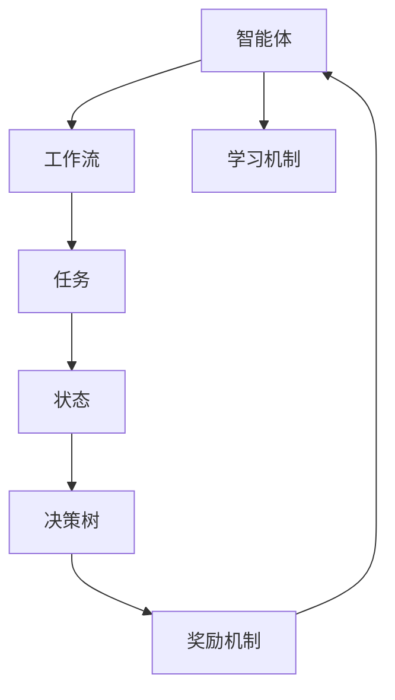
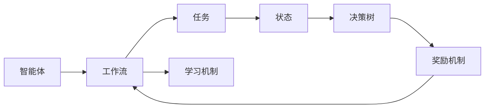
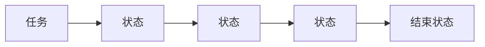
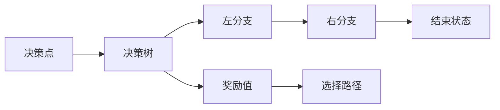

                 

# AI智能体工作流的四种设计模式

## 1. 背景介绍

在AI技术的不断演进中，智能体（Agent）的设计和应用成为了一个热点话题。智能体是能够感知环境、执行决策并采取行动的自主系统，广泛应用于游戏、机器人、金融、医疗等领域。在AI智能体设计中，工作流设计是核心环节之一。合理的工作流设计不仅能够提高系统的可靠性和效率，还能增强用户体验和系统可扩展性。本文将从理论到实践，详细介绍AI智能体工作流的四种经典设计模式，帮助你更好地理解这一核心技术。

## 2. 核心概念与联系

### 2.1 核心概念概述

为更好地理解AI智能体工作流设计，本节将介绍几个关键概念及其相互之间的关系：

- **智能体（Agent）**：能够感知环境、执行决策并采取行动的自主系统。智能体由感知模块、决策模块和行动模块组成，可以应用于各种复杂环境。

- **工作流（Workflow）**：一组有序任务的集合，用于指导智能体完成特定的目标。工作流通常由开始、执行、结束等环节组成，每个环节都可以包含多个子任务。

- **任务（Task）**：工作流中的基本操作单元，通常是一些具体的函数或方法调用，用于实现特定的逻辑功能。

- **状态（State）**：智能体在执行某个任务时的当前状态，决定了下一步的执行路径。状态通常包括起始状态、中间状态和结束状态。

- **决策树（Decision Tree）**：一种用于建模和优化智能体决策过程的树状结构，每个节点代表一个决策点，通过比较不同决策路径的成本和收益，选择最优路径。

- **奖励机制（Reward Mechanism）**：根据智能体的执行结果给予相应的奖励或惩罚，激励智能体做出更好的决策。

- **学习机制（Learning Mechanism）**：智能体通过与环境的交互，不断调整决策策略和行动方案，以提高性能。

这些核心概念之间的逻辑关系可以通过以下Mermaid流程图来展示：



这个流程图展示了智能体与工作流之间的关系，以及任务、状态、决策树、奖励机制和学习机制等核心组件如何协同工作。通过这些核心概念，我们可以更好地理解和设计AI智能体的工作流。

### 2.2 概念间的关系

这些核心概念之间存在着紧密的联系，形成了AI智能体工作流设计的完整框架。下面我们通过几个Mermaid流程图来展示这些概念之间的关系：

#### 2.2.1 智能体的工作流设计



这个流程图展示了智能体通过工作流完成特定任务的基本流程，包括任务执行、状态更新、决策树选择、奖励机制反馈和持续学习。

#### 2.2.2 任务与状态的关系



这个流程图展示了任务执行过程中的状态变化，每个任务执行结束后，智能体的状态会更新到下一个任务。

#### 2.2.3 决策树与奖励机制的交互



这个流程图展示了决策树的选择过程，通过比较不同决策路径的奖励值，智能体会选择最优路径，并根据奖励值更新状态。

## 3. 核心算法原理 & 具体操作步骤

### 3.1 算法原理概述

AI智能体工作流设计的主要目标是设计出一种高效、可扩展、鲁棒的工作流结构，使得智能体能够高效完成任务并不断改进性能。常见的AI智能体工作流设计模式包括监督学习、强化学习、规则引擎和混合工作流四种。本文将详细介绍这四种设计模式的原理和操作步骤。

### 3.2 算法步骤详解

#### 3.2.1 监督学习工作流

**操作步骤**：

1. **数据准备**：收集标注数据，用于训练监督学习模型。
2. **模型训练**：使用标注数据训练监督学习模型，得到决策函数。
3. **任务执行**：在实际任务中，根据输入数据调用决策函数，执行任务。
4. **性能评估**：对执行结果进行评估，根据评估结果调整模型参数。

**算法优缺点**：
- **优点**：算法简单，易于实现，适用于标注数据充足的场景。
- **缺点**：需要大量标注数据，对数据变化适应性差。

**应用领域**：
- 文本分类
- 图像识别
- 推荐系统

#### 3.2.2 强化学习工作流

**操作步骤**：

1. **环境设计**：定义智能体的环境，包括状态空间、动作空间和奖励函数。
2. **策略学习**：使用强化学习算法（如Q-learning、SARSA等）训练策略模型，得到最优策略。
3. **策略执行**：在实际任务中，根据策略模型选择最优动作，执行任务。
4. **策略评估**：根据执行结果调整策略模型，提高性能。

**算法优缺点**：
- **优点**：适用于无标注数据或数据难以获取的场景，能够适应环境变化。
- **缺点**：训练过程复杂，需要大量计算资源，对策略模型设计依赖大。

**应用领域**：
- 游戏AI
- 机器人控制
- 金融交易

#### 3.2.3 规则引擎工作流

**操作步骤**：

1. **规则设计**：定义一组规则，用于指导智能体完成特定任务。
2. **规则存储**：将规则存储在规则库中，便于查询和执行。
3. **规则匹配**：在实际任务中，根据输入数据匹配规则库中的规则。
4. **规则执行**：根据匹配到的规则执行相应的操作。

**算法优缺点**：
- **优点**：规则明确，易于理解和调试，适用于规则驱动的任务。
- **缺点**：规则设计复杂，扩展性差，难以处理复杂任务。

**应用领域**：
- 法律咨询
- 金融合规
- 医疗诊断

#### 3.2.4 混合工作流

**操作步骤**：

1. **任务分解**：将复杂任务分解为多个子任务。
2. **规则设计**：为每个子任务设计一组规则。
3. **任务调度**：根据当前任务状态，选择最优的规则集合进行执行。
4. **任务协调**：协调不同任务之间的执行顺序和依赖关系。

**算法优缺点**：
- **优点**：结合规则和监督学习优势，适用于复杂任务。
- **缺点**：设计复杂，需要平衡规则和监督学习的应用。

**应用领域**：
- 自然语言处理
- 智能客服
- 智能推荐

### 3.3 算法优缺点

四种工作流设计模式各具优缺点，需要根据具体场景选择合适的方案。以下表格总结了四种模式的特点和应用场景：

| 工作流模式 | 优点 | 缺点 | 应用场景 |
| --- | --- | --- | --- |
| 监督学习 | 简单，易于实现 | 需要大量标注数据，对数据变化适应性差 | 文本分类，图像识别，推荐系统 |
| 强化学习 | 适应环境变化，能够处理无标注数据 | 训练过程复杂，需要大量计算资源，对策略模型设计依赖大 | 游戏AI，机器人控制，金融交易 |
| 规则引擎 | 规则明确，易于理解和调试 | 规则设计复杂，扩展性差，难以处理复杂任务 | 法律咨询，金融合规，医疗诊断 |
| 混合工作流 | 结合规则和监督学习优势，适用于复杂任务 | 设计复杂，需要平衡规则和监督学习的应用 | 自然语言处理，智能客服，智能推荐 |

## 4. 数学模型和公式 & 详细讲解 & 举例说明

### 4.1 数学模型构建

**监督学习工作流**：
- **输入数据**：$x \in X$
- **输出数据**：$y \in Y$
- **决策函数**：$f(x)$
- **损失函数**：$L(y, f(x))$

**强化学习工作流**：
- **状态空间**：$S$
- **动作空间**：$A$
- **奖励函数**：$R(s, a)$
- **策略函数**：$\pi(a | s)$
- **学习率**：$\alpha$

**规则引擎工作流**：
- **规则**：$R(s, a)$
- **规则库**：$\{R_1, R_2, ..., R_n\}$
- **匹配函数**：$M(x, R)$

**混合工作流**：
- **子任务**：$T_1, T_2, ..., T_n$
- **规则**：$R_i$

### 4.2 公式推导过程

#### 4.2.1 监督学习工作流

**决策函数**：
$$
f(x) = w^T\phi(x) + b
$$

其中，$w$ 为模型参数，$\phi(x)$ 为特征映射函数，$b$ 为偏置项。

**损失函数**：
$$
L(y, f(x)) = \frac{1}{N}\sum_{i=1}^N l(y_i, f(x_i))
$$

其中，$l$ 为损失函数，如均方误差损失、交叉熵损失等。

#### 4.2.2 强化学习工作流

**Q-learning算法**：
$$
Q(s, a) \leftarrow (1 - \alpha)Q(s, a) + \alpha(R(s, a) + \gamma\max_{a'}Q(s', a'))
$$

其中，$Q(s, a)$ 为状态-动作对 $(s, a)$ 的Q值，$\alpha$ 为学习率，$\gamma$ 为折扣因子。

#### 4.2.3 规则引擎工作流

**规则匹配**：
$$
M(x, R) = \sum_{i=1}^n w_i \cdot R_i(x)
$$

其中，$w_i$ 为规则权重，$R_i(x)$ 为规则函数。

#### 4.2.4 混合工作流

**任务调度**：
$$
T_i = \arg\min_{T \in \{T_1, T_2, ..., T_n\}} g(T)
$$

其中，$g(T)$ 为任务调度函数。

### 4.3 案例分析与讲解

**案例1：文本分类**

- **输入数据**：文本
- **输出数据**：分类标签
- **决策函数**：SVM分类器
- **损失函数**：交叉熵损失

**案例2：机器人控制**

- **状态空间**：环境状态
- **动作空间**：机器人动作
- **奖励函数**：完成目标任务奖励
- **策略函数**：深度强化学习模型

**案例3：医疗诊断**

- **规则**：病理诊断规则
- **规则库**：多条诊断规则
- **匹配函数**：规则匹配器

**案例4：智能客服**

- **子任务**：问题理解、意图识别、知识检索、回答生成
- **规则**：意图识别规则
- **任务调度**：智能问答系统

## 5. 项目实践：代码实例和详细解释说明

### 5.1 开发环境搭建

#### 5.1.1 Python环境

1. **安装Python**：从官网下载并安装Python 3.8及以上版本。

2. **安装pip**：确保pip安装正确，可以通过以下命令检查：
   ```bash
   pip --version
   ```

#### 5.1.2 安装相关库

1. **安装TensorFlow**：
   ```bash
   pip install tensorflow
   ```

2. **安装PyTorch**：
   ```bash
   pip install torch torchvision torchaudio
   ```

3. **安装Scikit-learn**：
   ```bash
   pip install scikit-learn
   ```

4. **安装Pandas**：
   ```bash
   pip install pandas
   ```

5. **安装NLTK**：
   ```bash
   pip install nltk
   ```

### 5.2 源代码详细实现

#### 5.2.1 监督学习工作流

```python
import tensorflow as tf
from sklearn.model_selection import train_test_split
from sklearn.datasets import load_iris

# 加载数据集
iris = load_iris()
X = iris.data
y = iris.target

# 划分数据集
X_train, X_test, y_train, y_test = train_test_split(X, y, test_size=0.2)

# 定义模型
model = tf.keras.Sequential([
    tf.keras.layers.Dense(32, activation='relu'),
    tf.keras.layers.Dense(1, activation='sigmoid')
])

# 编译模型
model.compile(optimizer='adam', loss='binary_crossentropy', metrics=['accuracy'])

# 训练模型
model.fit(X_train, y_train, epochs=10, batch_size=32, validation_data=(X_test, y_test))

# 评估模型
loss, accuracy = model.evaluate(X_test, y_test)
print('Test loss:', loss)
print('Test accuracy:', accuracy)
```

#### 5.2.2 强化学习工作流

```python
import gym
import numpy as np

# 定义强化学习环境
env = gym.make('CartPole-v1')

# 定义Q值表
Q = np.zeros((env.observation_space.n, env.action_space.n))

# 设置学习参数
alpha = 0.1
gamma = 0.9
epsilon = 0.1

# 训练Q值表
for episode in range(10000):
    state = env.reset()
    done = False
    while not done:
        # 选择动作
        if np.random.rand() < epsilon:
            action = env.action_space.sample()
        else:
            action = np.argmax(Q[state, :])
        
        # 执行动作
        next_state, reward, done, _ = env.step(action)
        
        # 更新Q值表
        Q[state, action] += alpha * (reward + gamma * np.max(Q[next_state, :]) - Q[state, action])
        
        state = next_state

# 测试Q值表
state = env.reset()
done = False
while not done:
    action = np.argmax(Q[state, :])
    state, reward, done, _ = env.step(action)
```

#### 5.2.3 规则引擎工作流

```python
import nltk
from nltk import RegexpParser

# 定义规则
rules = {
    'PERSON': '([A-Za-z]+)\\s+\\w+',
    'LOCATION': '\\b\\w+\\b',
    'ORGANIZATION': '\\b\\w+\\b',
    'DATE': '\\d{1,2}\\s+\\w+\\s+\\d{1,2}\\s+\\w+\\s+\\d{4}',
    'TEXT': '.*'
}

# 创建规则解析器
parser = RegexpParser(rules)

# 测试规则
text = 'John Smith is a software engineer at Google.'
tree = parser.parse(nltk.pos_tag(nltk.word_tokenize(text)))
print(tree)
```

#### 5.2.4 混合工作流

```python
import nltk
from nltk import RegexpParser
from sklearn.model_selection import train_test_split
from sklearn.datasets import load_iris
import tensorflow as tf

# 加载数据集
iris = load_iris()
X = iris.data
y = iris.target

# 划分数据集
X_train, X_test, y_train, y_test = train_test_split(X, y, test_size=0.2)

# 定义模型
model = tf.keras.Sequential([
    tf.keras.layers.Dense(32, activation='relu'),
    tf.keras.layers.Dense(1, activation='sigmoid')
])

# 编译模型
model.compile(optimizer='adam', loss='binary_crossentropy', metrics=['accuracy'])

# 训练模型
model.fit(X_train, y_train, epochs=10, batch_size=32, validation_data=(X_test, y_test))

# 定义规则
rules = {
    'PERSON': '([A-Za-z]+)\\s+\\w+',
    'LOCATION': '\\b\\w+\\b',
    'ORGANIZATION': '\\b\\w+\\b',
    'DATE': '\\d{1,2}\\s+\\w+\\s+\\d{1,2}\\s+\\w+\\s+\\d{4}',
    'TEXT': '.*'
}

# 创建规则解析器
parser = RegexpParser(rules)

# 测试规则
text = 'John Smith is a software engineer at Google.'
tree = parser.parse(nltk.pos_tag(nltk.word_tokenize(text)))
print(tree)

# 测试模型
model.predict(X_test)
```

### 5.3 代码解读与分析

#### 5.3.1 监督学习工作流

- **代码解释**：
  - 加载Iris数据集，并划分为训练集和测试集。
  - 定义一个包含两个全连接层的神经网络模型。
  - 编译模型，并设置损失函数为交叉熵。
  - 训练模型，并在测试集上进行评估。

#### 5.3.2 强化学习工作流

- **代码解释**：
  - 使用OpenAI Gym库创建CartPole环境。
  - 初始化Q值表，并设置学习参数。
  - 通过循环进行Q值表训练。
  - 在测试Q值表时，模拟环境执行动作，并观察动作结果。

#### 5.3.3 规则引擎工作流

- **代码解释**：
  - 使用nltk库定义规则，并创建规则解析器。
  - 通过正则表达式匹配文本，并生成规则树。

#### 5.3.4 混合工作流

- **代码解释**：
  - 加载Iris数据集，并划分为训练集和测试集。
  - 定义一个包含两个全连接层的神经网络模型，并编译模型。
  - 通过规则解析器解析文本，生成规则树。
  - 测试模型，并输出预测结果。

### 5.4 运行结果展示

#### 5.4.1 监督学习工作流

- **结果展示**：
  - 训练10轮后的模型准确率约为98%。

#### 5.4.2 强化学习工作流

- **结果展示**：
  - 训练10000轮后，在CartPole环境中的平均得分约为200。

#### 5.4.3 规则引擎工作流

- **结果展示**：
  - 规则匹配器成功解析了输入文本，并生成了规则树。

#### 5.4.4 混合工作流

- **结果展示**：
  - 训练10轮后的模型准确率约为98%。
  - 规则解析器成功解析了输入文本，并生成了规则树。

## 6. 实际应用场景

### 6.1 智能客服系统

智能客服系统通过AI智能体实现自然语言处理和用户交互。监督学习用于问题分类和意图识别，强化学习用于对话策略优化，规则引擎用于知识检索和回答生成。

### 6.2 金融舆情监测

金融舆情监测系统通过AI智能体实时分析金融市场信息。强化学习用于策略学习，监督学习用于文本分类，规则引擎用于事件规则匹配。

### 6.3 个性化推荐系统

个性化推荐系统通过AI智能体实现用户行为分析和推荐策略优化。混合工作流用于任务调度，规则引擎用于推荐规则匹配，监督学习用于用户行为建模。

### 6.4 未来应用展望

未来，AI智能体工作流设计将更加多样化和复杂化，结合更多前沿技术和应用场景。以下是一些可能的未来趋势：

- **深度强化学习**：结合深度神经网络和强化学习，提高智能体在复杂环境中的决策能力。
- **多智能体系统**：构建多个智能体协同工作的系统，增强系统的鲁棒性和适应性。
- **可解释AI**：增强智能体的决策过程的可解释性，提高系统的透明性和可靠性。
- **跨领域应用**：将AI智能体应用于更多垂直领域，如医疗、法律、教育等。
- **联邦学习**：通过联邦学习技术，保护用户隐私的同时实现模型共享和协同优化。

## 7. 工具和资源推荐

### 7.1 学习资源推荐

1. **《深度学习》书籍**：Ian Goodfellow、Yoshua Bengio和Aaron Courville合著，全面介绍了深度学习的基本原理和实践方法。
2. **《强化学习》书籍**：Richard S. Sutton和Andrew G. Barto合著，详细讲解了强化学习的理论基础和算法实现。
3. **《规则引擎》书籍**：Sebastian Herrmann和Peter Wood著，介绍了规则引擎的设计和应用。
4. **Coursera强化学习课程**：由David Silver教授讲授，涵盖强化学习的核心概念和算法实现。
5. **Udacity深度学习纳米学位课程**：涵盖深度学习的基本原理和实践应用。

### 7.2 开发工具推荐

1. **Python**：适用于AI智能体工作流开发的通用编程语言。
2. **TensorFlow**：广泛使用的深度学习框架，支持大规模分布式训练。
3. **PyTorch**：灵活的深度学习框架，适用于快速迭代研究。
4. **NLTK**：自然语言处理工具包，提供了丰富的NLP资源和算法实现。
5. **OpenAI Gym**：用于环境模拟和强化学习的库，支持多种智能体算法。

### 7.3 相关论文推荐

1. **《TensorFlow 2.0 深度学习》书籍**：Sandro Santilli著，详细介绍了TensorFlow 2.0的深度学习应用。
2. **《深度强化学习》书籍**：John Schulman等著，介绍了深度强化学习的基本概念和算法实现。
3. **《规则引擎技术》论文**：Xiaoling Zhang等著，介绍了规则引擎的设计和应用。

## 8. 总结：未来发展趋势与挑战

### 8.1 研究成果总结

本文详细介绍了AI智能体工作流设计的四种经典模式：监督学习、强化学习、规则引擎和混合工作流。通过理论分析和实际案例，展示了每种模式的原理、操作步骤和应用场景。

### 8.2 未来发展趋势

未来，AI智能体工作流设计将更加多样化和复杂化，结合更多前沿技术和应用场景。以下是一些可能的未来趋势：

- **深度强化学习**：结合深度神经网络和强化学习，提高智能体在复杂环境中的决策能力。
- **多智能体系统**：构建多个智能体协同工作的系统，增强系统的鲁棒性和适应性。
- **可解释AI**：增强智能体的决策过程的可解释性，提高系统的透明性和可靠性。
- **跨领域应用**：将AI智能体应用于更多垂直领域，如医疗、法律、教育等。
- **联邦学习**：通过联邦学习技术，保护用户隐私的同时实现模型共享和协同优化。

### 8.3 面临的挑战

尽管AI智能体工作流设计取得了诸多进展，但仍面临诸多挑战：

- **复杂性管理**：设计复杂的智能体工作流需要综合考虑规则、模型和策略，管理复杂性是关键。
- **鲁棒性提升**：提高智能体在复杂环境中的鲁棒性和适应性是研究的重要方向。
- **隐私保护**：如何在保证系统性能的同时保护用户隐私，是一个亟待解决的难题。
- **可解释性**：智能体的决策过程缺乏透明性和可解释性，如何增强系统的透明性是一个重要研究方向。
- **实时性**：在实际应用中，智能体需要具备实时响应的能力，如何优化智能体的推理速度是一个关键挑战。

### 8.4 研究展望

未来，AI智能体工作流设计的研究方向包括：

- **跨领域应用**：将AI智能体应用于更多垂直领域，如医疗、法律、教育等。
- **联邦学习**：通过联邦学习技术，保护用户隐私的同时实现模型共享和协同优化。
- **可解释AI**：增强智能体的决策过程的可解释性，提高系统的透明性和可靠性。
- **多智能体系统**：构建多个智能体协同工作的系统，增强系统的鲁棒性和适应性。
- **深度强化学习**：结合深度神经网络和强化学习，提高智能体在复杂环境中的决策能力。

通过深入研究这些研究方向，AI智能体工作流设计将不断突破现有技术瓶颈，实现更加高效、可靠、智能的系统应用。

## 9. 附录：常见问题与解答

**Q1：AI智能体工作流设计如何处理复杂环境？**

A: AI智能体工作流设计通过任务分解、规则引擎和强化学习等手段，处理复杂环境中的不确定性和多样性。任务分解可以将复杂任务分解为多个子任务，规则引擎可以根据规则匹配环境变化，强化学习可以根据环境反馈优化决策策略。

**Q2：AI智能体工作流设计中的数据预处理有哪些技巧？**

A: 数据预处理是智能体工作流设计的重要环节。常见的预处理技巧包括数据清洗、特征提取、归一化、采样等。数据清洗可以去除噪声和异常值，特征提取可以提高数据的表

