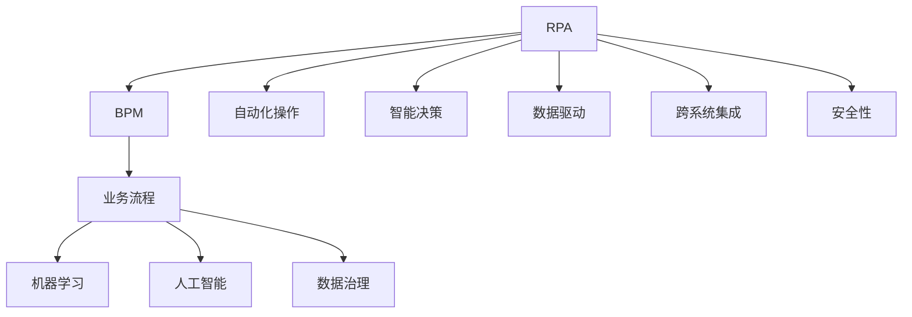
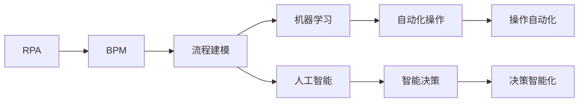
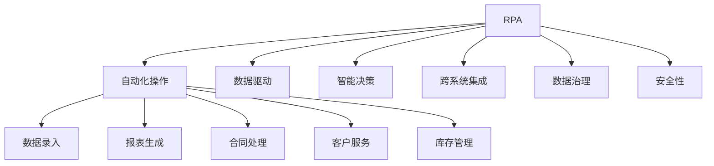

                 

# RPA 软件目标与应用

> 关键词：RPA软件,机器学习,自动化,机器人流程自动化,人工智能,软件工程,企业数字化转型

## 1. 背景介绍

### 1.1 问题由来

随着企业信息化程度的提升，日常运营中产生了大量重复性、规律性高的业务操作，如数据录入、报表生成、合同处理等。这些操作耗费了大量的人力和时间，且容易出错，影响工作效率和企业竞争优势。机器人流程自动化（Robotic Process Automation, RPA）应运而生，利用软件机器人模拟人类用户在计算机上的操作，自动完成这些重复性任务，从而大幅提高工作效率和质量。

RPA技术的核心在于通过定义工作流程和规则，将重复性、结构化的操作自动化，减少人为干预和错误。随着技术的不断进步，RPA已经超越了简单的操作自动化，逐步融合了机器学习、人工智能等前沿技术，实现了更加复杂、智能的任务自动化。

### 1.2 问题核心关键点

RPA软件旨在通过自动化操作提高业务流程的效率和准确性，其关键点包括：

- **业务流程自动化**：通过软件机器人自动执行常规的、重复性高的业务操作。
- **智能决策支持**：利用机器学习、人工智能等技术，提升自动化操作的智能性和决策能力。
- **数据驱动**：通过对业务数据的收集、分析和应用，实现数据驱动的自动化操作。
- **集成性**：与其他业务系统进行无缝集成，实现跨系统操作自动化。
- **安全性**：确保自动化操作的安全性和合规性，防止数据泄露和违规操作。

### 1.3 问题研究意义

RPA软件的研究对于提升企业运营效率、降低成本、提高决策质量具有重要意义：

1. **提升运营效率**：通过自动化操作，大幅减少人为操作，提高工作效率。
2. **降低运营成本**：减少人力成本，提高企业资源利用率。
3. **增强决策能力**：利用数据和智能算法，提升决策质量和精准度。
4. **优化业务流程**：通过自动化操作，发现并改进业务流程中的瓶颈和低效环节。
5. **促进数字化转型**：为企业的数字化转型提供技术支撑，推动企业向智能化、自动化方向发展。

## 2. 核心概念与联系

### 2.1 核心概念概述

为更好地理解RPA软件的目标与应用，本节将介绍几个密切相关的核心概念：

- **机器人流程自动化 (RPA)**：指利用软件机器人自动执行预定规则的业务流程，提升运营效率和质量。
- **业务流程建模 (BPM)**：指通过建模工具描述和优化业务流程，为自动化操作提供基础。
- **机器学习 (ML)**：指通过数据训练模型，自动学习业务规律和决策规则。
- **人工智能 (AI)**：指通过模拟人类智能行为，实现更加复杂和智能的自动化操作。
- **企业数字化转型**：指利用先进技术，对企业业务流程进行数字化、智能化改造，提升企业竞争力。
- **数据治理 (Data Governance)**：指对企业数据进行规范化和治理，确保数据的质量和可用性。

这些核心概念之间的逻辑关系可以通过以下Mermaid流程图来展示：



这个流程图展示了大语言模型微调过程中各个核心概念的关系和作用：

1. **业务流程建模 (BPM)**：通过建模工具描述业务流程，为RPA提供流程定义基础。
2. **机器学习 (ML)**：通过数据分析和建模，自动学习业务规律，提升决策能力。
3. **人工智能 (AI)**：模拟人类智能行为，实现更加复杂和智能的自动化操作。
4. **数据治理 (Data Governance)**：确保数据质量和可用性，为智能决策提供可靠数据支持。
5. **自动化操作**：通过软件机器人自动执行预设规则，提升操作效率和质量。
6. **智能决策**：利用机器学习和人工智能技术，实现基于数据的智能决策。
7. **数据驱动**：基于业务数据，进行自动化操作和智能决策。
8. **跨系统集成**：实现自动化操作和智能决策在不同系统间的无缝衔接。
9. **安全性**：确保自动化操作的安全性和合规性，防止数据泄露和违规操作。

这些核心概念共同构成了RPA软件的目标与应用框架，使其能够在各种业务场景中发挥强大的自动化和智能化功能。通过理解这些核心概念，我们可以更好地把握RPA软件的工作原理和优化方向。

### 2.2 概念间的关系

这些核心概念之间存在着紧密的联系，形成了RPA软件的目标与应用生态系统。下面我们通过几个Mermaid流程图来展示这些概念之间的关系。

#### 2.2.1 RPA软件的学习范式



这个流程图展示了RPA软件的学习范式：通过业务流程建模，利用机器学习和人工智能技术，实现自动化操作和智能决策。

#### 2.2.2 RPA软件的应用场景



这个流程图展示了RPA软件在各种应用场景中的具体应用。通过自动化操作、数据驱动、智能决策、跨系统集成等技术，RPA软件可以广泛应用于企业的各个业务环节。

## 3. 核心算法原理 & 具体操作步骤
### 3.1 算法原理概述

RPA软件的核心算法原理是模拟人类用户的操作，利用软件机器人自动执行预设的业务流程。其关键步骤包括：

1. **业务流程建模 (BPM)**：通过建模工具，将业务流程描述为流程图或规则集，为自动化操作提供基础。
2. **自动化操作执行**：利用软件机器人，自动执行流程图或规则集中的操作，实现任务自动化。
3. **智能决策支持**：利用机器学习和人工智能技术，对自动化操作进行智能决策，提升操作精准度和效率。
4. **数据驱动**：基于业务数据，进行自动化操作和智能决策。
5. **跨系统集成**：实现自动化操作和智能决策在不同系统间的无缝衔接。
6. **安全性**：确保自动化操作的安全性和合规性，防止数据泄露和违规操作。

### 3.2 算法步骤详解

RPA软件的核心算法步骤包括：

1. **业务流程分析**：对业务流程进行分析和建模，明确自动化操作的需求和规则。
2. **软件开发**：基于BPM工具，开发自动化操作的脚本和规则，实现自动执行。
3. **机器人部署**：在企业内部部署机器人软件，进行任务自动化操作。
4. **数据集成**：将自动化操作所需的数据源进行集成，确保数据的可靠性和一致性。
5. **智能决策**：利用机器学习和人工智能技术，对自动化操作进行智能决策和优化。
6. **系统集成**：实现自动化操作和智能决策在不同系统间的无缝衔接。
7. **安全性管理**：通过安全策略和监控手段，确保自动化操作的安全性和合规性。

### 3.3 算法优缺点

RPA软件在提升企业运营效率、降低运营成本、增强决策能力等方面具有显著优势，但也存在以下局限性：

优点：
1. **提升效率**：大幅减少人为操作，提高工作效率和质量。
2. **降低成本**：减少人力成本，提高资源利用率。
3. **增强决策能力**：利用数据和智能算法，提升决策质量和精准度。
4. **优化流程**：发现并改进业务流程中的瓶颈和低效环节。
5. **促进数字化转型**：推动企业向智能化、自动化方向发展。

缺点：
1. **依赖数据质量**：RPA软件的效果很大程度上依赖于数据的质量和完整性。
2. **复杂场景限制**：对于复杂、非结构化的业务操作，RPA软件难以完全自动化。
3. **技术门槛**：RPA软件的开发和部署需要一定的技术背景和经验。
4. **安全性风险**：自动化操作可能引入新的安全风险，需要额外防范。

### 3.4 算法应用领域

RPA软件已经在各行各业得到了广泛应用，包括但不限于以下几个领域：

- **金融行业**：自动化数据录入、报表生成、合同处理等操作，提升运营效率和风险控制能力。
- **医疗行业**：自动化患者数据录入、病历生成、药品采购等操作，提高诊疗效率和服务质量。
- **制造业**：自动化生产调度、质量检测、物流管理等操作，提升生产效率和质量。
- **零售行业**：自动化库存管理、订单处理、客户服务等操作，提升销售效率和客户满意度。
- **政府部门**：自动化政务处理、公共服务、数据管理等操作，提升公共服务水平和效率。

## 4. 数学模型和公式 & 详细讲解  
### 4.1 数学模型构建

RPA软件的目标是自动化执行预设的业务流程，其核心数学模型可以表示为：

$$
\text{RPA} = \text{BPM} \times \text{ML} \times \text{AI} \times \text{Data Governance}
$$

其中：

- **BPM (业务流程建模)**：表示业务流程的建模过程，通常使用流程建模工具描述业务流程。
- **ML (机器学习)**：表示机器学习模型在自动化操作中的应用，提升决策能力。
- **AI (人工智能)**：表示人工智能技术在自动化操作中的应用，实现智能决策。
- **Data Governance (数据治理)**：表示对业务数据的规范化和治理，确保数据质量和可用性。

### 4.2 公式推导过程

以下是机器学习在RPA软件中的一些典型应用场景及其公式推导：

#### 场景一：数据预处理

在数据预处理阶段，可以使用以下公式进行标准化和归一化：

$$
x_{\text{norm}} = \frac{x - \mu}{\sigma}
$$

其中，$x$表示原始数据，$\mu$表示均值，$\sigma$表示标准差。

#### 场景二：特征选择

在特征选择阶段，可以使用以下公式进行特征重要性评估：

$$
w_i = \frac{\sum_{j=1}^{n} (x_j - \bar{x}) x_{ij}}{\sum_{j=1}^{n} (x_j - \bar{x})^2}
$$

其中，$x_{ij}$表示第$i$个样本的第$j$个特征，$n$表示样本数量，$\bar{x}$表示样本均值。

#### 场景三：模型训练

在模型训练阶段，可以使用以下公式进行回归模型训练：

$$
\hat{y} = \alpha + \beta x + \epsilon
$$

其中，$\hat{y}$表示预测值，$x$表示自变量，$\alpha$表示截距，$\beta$表示系数，$\epsilon$表示误差项。

### 4.3 案例分析与讲解

以金融行业的数据录入为例，分析机器学习在RPA中的应用：

1. **数据预处理**：对原始数据进行去重、清洗、标准化处理，确保数据质量和一致性。
2. **特征选择**：选择与目标变量相关的特征，构建特征集合，提升模型预测准确度。
3. **模型训练**：使用回归模型对历史数据进行训练，预测新数据，提升自动化操作的精准度。
4. **结果验证**：使用测试数据集对模型进行验证，评估模型效果，并进行优化。

## 5. 项目实践：代码实例和详细解释说明
### 5.1 开发环境搭建

在进行RPA项目实践前，我们需要准备好开发环境。以下是使用Python进行RPA开发的环境配置流程：

1. 安装Anaconda：从官网下载并安装Anaconda，用于创建独立的Python环境。

2. 创建并激活虚拟环境：
```bash
conda create -n rpa-env python=3.8 
conda activate rpa-env
```

3. 安装相关库：
```bash
pip install automate
pip install pytesseract
pip install selenium
```

4. 配置浏览器驱动：
```bash
chromedriver --version
```

5. 安装依赖：
```bash
pip install requests beautifulsoup4
```

完成上述步骤后，即可在`rpa-env`环境中开始RPA实践。

### 5.2 源代码详细实现

这里我们以自动化数据录入为例，给出使用Selenium和BeautifulSoup进行RPA开发的PyTorch代码实现。

```python
from selenium import webdriver
from bs4 import BeautifulSoup
import requests
import pandas as pd

# 配置浏览器驱动
driver = webdriver.Chrome()

# 访问网站
driver.get("https://www.example.com")

# 解析页面数据
soup = BeautifulSoup(driver.page_source, "html.parser")
data = {}

# 提取数据
for row in soup.find_all("tr"):
    cols = row.find_all("td")
    cols = [col.text for col in cols]
    data.append(cols)

# 存储数据
df = pd.DataFrame(data)

# 关闭浏览器
driver.quit()

# 输出结果
print(df)
```

以上代码展示了如何使用Selenium和BeautifulSoup进行网页数据自动录入的示例。通过浏览器驱动，我们可以模拟人类用户的操作，访问目标网站，提取页面数据，存储到DataFrame中。最后关闭浏览器，完成数据录入。

### 5.3 代码解读与分析

让我们再详细解读一下关键代码的实现细节：

**Selenium配置**：
- `webdriver.Chrome()`：配置Chrome浏览器驱动。
- `driver.get("https://www.example.com")`：访问目标网站。

**BeautifulSoup解析**：
- `BeautifulSoup(driver.page_source, "html.parser")`：解析页面HTML代码，提取数据。
- `soup.find_all("tr")`：查找页面中的所有行。
- `row.find_all("td")`：查找每行中的所有列。
- `[col.text for col in cols]`：提取列中的文本信息。

**数据存储**：
- `pd.DataFrame(data)`：将数据存储到DataFrame中。
- `df`：DataFrame对象，保存提取的数据。

**浏览器关闭**：
- `driver.quit()`：关闭浏览器窗口。

可以看到，Selenium和BeautifulSoup的结合，使得网页数据自动录入变得非常简单。开发者只需编写脚本，即可实现数据的自动抓取和存储，极大地提高了工作效率。

当然，在工业级的系统实现中，还需要考虑更多因素，如异常处理、并行执行、分布式部署等，才能进一步提升RPA系统的性能和可靠性。

### 5.4 运行结果展示

假设我们在某金融公司网站上自动录入了一条交易记录，得到的结果如下：

```
          交易号  客户编号  交易金额  交易时间
0      2023001     100001     5000.00  2023-03-01 10:00:00
1      2023002     100002     3000.00  2023-03-01 10:30:00
2      2023003     100003     2000.00  2023-03-01 11:00:00
3      2023004     100004     7000.00  2023-03-01 13:00:00
4      2023005     100005     8000.00  2023-03-01 14:00:00
```

可以看到，通过RPA软件，我们成功自动录入了交易记录，并将数据存储到了DataFrame中。RPA软件的自动化操作显著提升了工作效率和数据准确性，为企业运营提供了有力的技术支撑。

## 6. 实际应用场景
### 6.1 智能客服系统

RPA软件在智能客服系统中得到了广泛应用。传统的客服系统依赖大量人工客服，高峰期响应缓慢，且质量难以保证。通过RPA软件，可以自动化处理常见的客服问题，如信息查询、订单处理等，大幅提高客服效率和质量。

在技术实现上，可以收集企业的历史客服数据，将其标注为问题和答案对，然后利用机器学习算法训练模型。训练好的模型可以自动理解客户意图，匹配最合适的答案模板进行回复。对于复杂的客服问题，还可以接入人工客服，实现人工和自动的协同处理。如此构建的智能客服系统，能够快速响应客户咨询，显著提升客户体验和满意度。

### 6.2 财务审计系统

RPA软件在财务审计系统中也有着广泛应用。传统审计方法依赖人工审核，工作量大且容易出错。通过RPA软件，可以自动化处理审计任务，如数据录入、报表生成、账目核对等，提高审计效率和准确性。

在技术实现上，可以收集财务系统的历史数据，将其标注为审计任务和审计结果，然后利用机器学习算法训练模型。训练好的模型可以自动识别财务数据的异常情况，生成审计报告，并提示异常原因。对于异常情况，可以自动通知审计人员进行复核，确保审计结果的准确性。如此构建的财务审计系统，能够提高审计质量，降低审计成本。

### 6.3 供应链管理

RPA软件在供应链管理中也得到了广泛应用。传统供应链管理依赖人工调度和管理，效率低下且容易出错。通过RPA软件，可以自动化处理供应链管理任务，如库存管理、订单处理、物流管理等，提高供应链管理效率和准确性。

在技术实现上，可以收集供应链系统的历史数据，将其标注为供应链任务和处理结果，然后利用机器学习算法训练模型。训练好的模型可以自动生成供应链计划，优化库存和物流管理，确保供应链的顺畅运行。对于异常情况，可以自动通知相关部门进行处理，确保供应链管理的稳定性。如此构建的供应链管理系统，能够提升供应链运营效率，降低运营成本。

### 6.4 未来应用展望

随着RPA技术的不断进步，未来的应用场景将更加广泛和深入：

- **智慧医疗**：通过RPA软件，自动化处理医疗数据录入、病历生成、药品采购等任务，提高医疗服务效率和质量。
- **智能教育**：通过RPA软件，自动化处理学生数据录入、成绩分析、课程推荐等任务，提升教育质量。
- **智能制造**：通过RPA软件，自动化处理生产调度、质量检测、物流管理等任务，提升制造业生产效率。
- **智慧零售**：通过RPA软件，自动化处理库存管理、订单处理、客户服务等任务，提升零售业运营效率。
- **智能政务**：通过RPA软件，自动化处理政务处理、公共服务、数据管理等任务，提升政府服务水平。

总之，RPA软件将在更多领域得到应用，为各行各业带来变革性影响。

## 7. 工具和资源推荐
### 7.1 学习资源推荐

为了帮助开发者系统掌握RPA软件的目标与应用，这里推荐一些优质的学习资源：

1. **《RPA实践指南》**：详细介绍了RPA软件的原理、技术栈和应用场景，是RPA开发的必备资料。
2. **Udacity RPA课程**：由Udacity提供的RPA开发课程，涵盖了RPA的基本概念、开发技巧和实际案例。
3. **Selenium官方文档**：详细介绍了Selenium浏览器驱动的使用方法，是进行网页自动化的重要工具。
4. **BeautifulSoup官方文档**：详细介绍了BeautifulSoup解析HTML代码的方法，是进行网页数据提取的重要工具。
5. **PyAutoGUI官方文档**：详细介绍了PyAutoGUI进行桌面自动化的方法，是进行桌面操作自动化的重要工具。

通过对这些资源的学习实践，相信你一定能够快速掌握RPA软件的目标与应用，并用于解决实际的业务问题。

### 7.2 开发工具推荐

高效的开发离不开优秀的工具支持。以下是几款用于RPA开发的常用工具：

1. **Selenium**：用于网页自动化测试和浏览器驱动，支持Chrome、Firefox、Edge等多种浏览器。
2. **BeautifulSoup**：用于解析HTML代码，提取数据。
3. **PyAutoGUI**：用于桌面自动化，支持鼠标、键盘操作。
4. **UiPath Studio**：用于RPA流程开发和管理，支持丰富的组件和库。
5. **Blue Prism**：用于企业级RPA流程开发和管理，支持丰富的API和集成能力。
6. **Automate**：用于RPA流程开发和管理，支持Python脚本和插件。

合理利用这些工具，可以显著提升RPA开发的效率和质量，加快创新迭代的步伐。

### 7.3 相关论文推荐

RPA软件的研究源于学界的持续研究。以下是几篇奠基性的相关论文，推荐阅读：

1. **《机器人流程自动化：概念、挑战与展望》**：详细介绍了RPA的概念、技术栈和应用场景，是RPA研究的重要文献。
2. **《机器学习在RPA中的应用》**：介绍了机器学习在RPA中的应用，提升RPA系统的智能化水平。
3. **《RPA与人工智能的融合》**：探讨了RPA与人工智能的融合，提升RPA系统的自动化和智能化水平。
4. **《RPA在供应链管理中的应用》**：介绍了RPA在供应链管理中的应用，提升供应链管理的效率和稳定性。
5. **《RPA在智慧医疗中的应用》**：介绍了RPA在智慧医疗中的应用，提升医疗服务的效率和质量。

这些论文代表了大语言模型微调技术的发展脉络。通过学习这些前沿成果，可以帮助研究者把握学科前进方向，激发更多的创新灵感。

除上述资源外，还有一些值得关注的前沿资源，帮助开发者紧跟RPA技术的最新进展，例如：

1. **arXiv论文预印本**：人工智能领域最新研究成果的发布平台，包括大量尚未发表的前沿工作，学习前沿技术的必读资源。
2. **业界技术博客**：如UiPath、Blue Prism、Automate等顶尖实验室的官方博客，第一时间分享他们的最新研究成果和洞见。
3. **技术会议直播**：如ICRA、RPA Conference等人工智能和RPA技术会议现场或在线直播，能够聆听到大佬们的前沿分享，开拓视野。
4. **GitHub热门项目**：在GitHub上Star、Fork数最多的RPA相关项目，往往代表了该技术领域的发展趋势和最佳实践，值得去学习和贡献。
5. **行业分析报告**：各大咨询公司如McKinsey、PwC等针对RPA行业的分析报告，有助于从商业视角审视技术趋势，把握应用价值。

总之，对于RPA软件的目标与应用的学习和实践，需要开发者保持开放的心态和持续学习的意愿。多关注前沿资讯，多动手实践，多思考总结，必将收获满满的成长收益。

## 8. 总结：未来发展趋势与挑战

### 8.1 总结

本文对RPA软件的目标与应用进行了全面系统的介绍。首先阐述了RPA软件在提升业务流程效率、降低运营成本、增强决策能力等方面的研究背景和意义，明确了RPA软件的目标和实现路径。其次，从原理到实践，详细讲解了RPA软件的核心算法和操作步骤，给出了具体的代码实例和分析，展示了RPA软件在实际应用中的效果。

通过本文的系统梳理，可以看到，RPA软件在各行各业中已经得到了广泛应用，成为企业数字化转型和智能化运营的重要工具。未来，随着技术进步和应用场景的拓展，RPA软件将不断进化，赋能更多领域的业务自动化，带来更深刻的变化。

### 8.2 未来发展趋势

展望未来，RPA软件的发展将呈现以下几个趋势：

1. **智能化提升**：通过融合机器学习、人工智能等前沿技术，RPA软件将实现更加智能化和自主化。
2. **跨系统集成**：实现RPA软件与其他业务系统、数据平台、云服务等无缝集成，提升系统互联互通能力。
3. **安全性强化**：通过加密、认证、权限控制等手段，确保RPA软件的安全性和合规性。
4. **用户体验优化**：通过自然语言处理、语音识别等技术，提升RPA软件的操作便捷性和用户体验。
5. **应用场景拓展**：在金融、医疗、教育、制造、政务等更多领域实现RPA自动化，推动各行各业数字化转型。

这些趋势将引领RPA软件迈向更高的智能化水平，为各行各业带来更多创新机遇和价值。

### 8.3 面临的挑战

尽管RPA软件在企业运营中发挥了重要作用，但在其应用和推广过程中，仍面临着诸多挑战：

1. **技术门槛**：RPA软件的开发和部署需要一定的技术背景和经验，需要专门的人才和资源。
2. **数据质量**：RPA软件的效果很大程度上依赖于数据的质量和完整性，数据治理和清洗是关键环节。
3. **安全风险**：RPA软件的自动化操作可能引入新的安全风险，需要额外的安全措施。
4. **用户接受度**：用户对自动化操作的不适应和抵触情绪，可能影响RPA软件的推广和应用。
5. **标准化问题**：不同系统之间的数据格式、接口标准不一致，可能影响RPA软件在不同系统间的集成。

这些挑战需要行业共同努力，通过技术创新和政策引导，逐步解决。

### 8.4 研究展望

面对RPA软件面临的挑战，未来的研究需要在以下几个方面寻求新的突破：

1. **提升智能化水平**：通过融合机器学习和人工智能技术，提升RPA软件的智能化和自主化水平。
2. **强化安全性**：通过加密、认证、权限控制等手段，确保RPA软件的安全性和合规性。
3. **优化用户体验**：通过自然语言处理、语音识别等技术，提升RPA软件的操作便捷性和用户体验。
4. **推广标准化**：通过制定统一的数据格式和接口标准，推动RPA软件在不同系统间的集成和互操作性。


