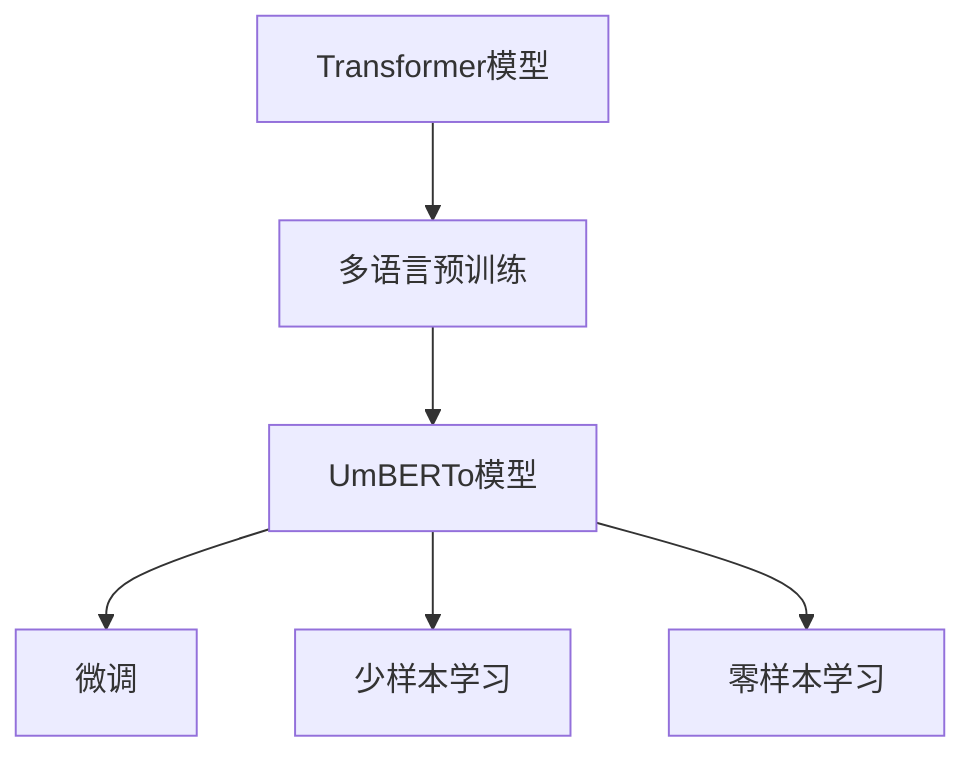
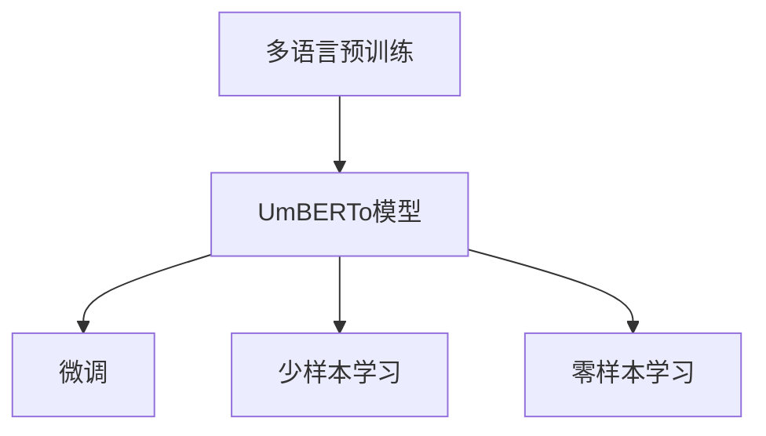
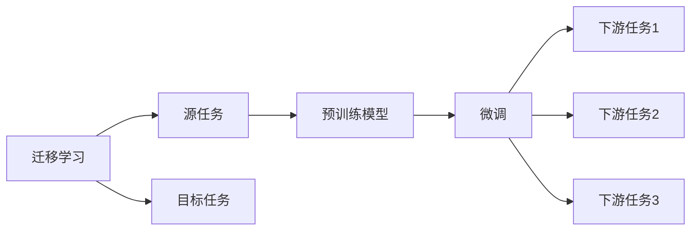
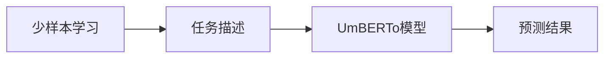
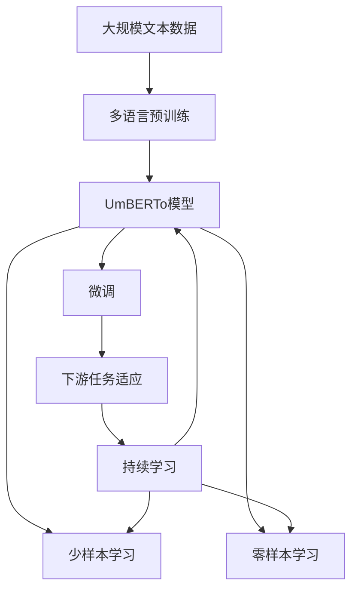

                 

# Transformer大模型实战 意大利语的UmBERTo模型

## 1. 背景介绍

### 1.1 问题由来
随着深度学习技术的快速发展，Transformer模型已成为自然语言处理(NLP)领域的主流模型。然而，Transformer模型在多语言领域的实际应用仍然面临诸多挑战，特别是在资源和性能方面。传统的通用模型如BERT、GPT等，在多语言数据上的表现往往不尽人意。针对这一问题，UmBERTo应运而生，作为多语言领域的首个大型通用语言模型，其在意大利语上的表现尤为突出。

### 1.2 问题核心关键点
UmBERTo模型的核心优势在于其多语言版本的训练，即在多种语言上预训练，从而在多种语言上都取得了较好的表现。UmBERTo通过在多个语言上预训练，学习到了丰富的语言知识，并通过迁移学习，在特定语言上进行微调，使得模型在多语言环境中的表现更加出色。

### 1.3 问题研究意义
UmBERTo模型在多语言NLP领域的研究和应用，对于拓展语言模型的应用范围，提升模型在不同语言环境下的性能，加速NLP技术的产业化进程，具有重要意义：

1. 降低应用开发成本。通过在多种语言上预训练，UmBERTo模型可以显著减少从头开发所需的数据、计算和人力等成本投入。
2. 提升模型效果。UmBERTo模型在多语言数据上的表现，使得其在特定语言上进行微调时，能够取得更优性能。
3. 加速开发进度。UmBERTo模型已经在多个语言上进行了预训练，开发者可以更快地完成任务适配，缩短开发周期。
4. 带来技术创新。UmBERTo模型采用多语言预训练和微调，催生了新一轮的模型设计和训练范式，促进了NLP技术的进步。
5. 赋能产业升级。UmBERTo模型能够在多种语言环境下提供高效的自然语言处理服务，为传统行业数字化转型升级提供新的技术路径。

## 2. 核心概念与联系

### 2.1 核心概念概述

为更好地理解UmBERTo模型的工作原理和优化方向，本节将介绍几个密切相关的核心概念：

- **Transformer模型**：以自回归或自编码模型为代表的深度学习模型，通过多头注意力机制实现高效的特征提取和序列建模。
- **多语言预训练**：在多种语言上对Transformer模型进行预训练，学习通用的语言表示，具备跨语言迁移能力。
- **迁移学习**：将一个领域学习到的知识，迁移应用到另一个不同但相关的领域的学习范式。UmBERTo模型通过多语言预训练和微调，实现跨语言迁移。
- **微调(Fine-Tuning)**：在预训练模型的基础上，使用下游任务的少量标注数据，通过有监督学习优化模型在特定任务上的性能。
- **少样本学习(Few-shot Learning)**：指在只有少量标注样本的情况下，模型能够快速适应新任务的学习方法。
- **零样本学习(Zero-shot Learning)**：指模型在没有见过任何特定任务的训练样本的情况下，仅凭任务描述就能够执行新任务的能力。

这些核心概念之间的逻辑关系可以通过以下Mermaid流程图来展示：



这个流程图展示了大模型微调的完整过程，从多语言预训练到微调，再到少样本学习和零样本学习，一步步构建起UmBERTo模型的高效语言处理能力。

### 2.2 概念间的关系

这些核心概念之间存在着紧密的联系，形成了UmBERTo模型的学习和应用框架。下面我们通过几个Mermaid流程图来展示这些概念之间的关系。

#### 2.2.1 UmBERTo模型的学习范式



这个流程图展示了UmBERTo模型的学习范式，即通过多语言预训练获得通用的语言表示，然后在特定语言上进行微调，实现跨语言迁移和任务适应。

#### 2.2.2 迁移学习与微调的关系



这个流程图展示了迁移学习的基本原理，以及它与微调的关系。迁移学习涉及源任务和目标任务，预训练模型在源任务上学习，然后通过微调适应各种下游任务（目标任务）。

#### 2.2.3 少样本学习和零样本学习



这个流程图展示了UmBERTo模型在少样本学习和零样本学习中的应用。通过在输入中提供少量示例，或仅凭任务描述，UmBERTo模型即可进行快速学习，无需更新模型参数。

### 2.3 核心概念的整体架构

最后，我们用一个综合的流程图来展示这些核心概念在大模型微调过程中的整体架构：



这个综合流程图展示了从预训练到微调，再到少样本学习和零样本学习的完整过程。UmBERTo模型首先在大规模文本数据上进行多语言预训练，然后通过微调（包括全参数微调和参数高效微调）或少样本学习和零样本学习，来适应下游任务。最后，通过持续学习技术，模型可以不断学习新知识，同时保持已学习的知识，而不会出现灾难性遗忘。通过这些流程图，我们可以更清晰地理解UmBERTo模型微调过程中各个核心概念的关系和作用，为后续深入讨论具体的微调方法和技术奠定基础。

## 3. 核心算法原理 & 具体操作步骤
### 3.1 算法原理概述

UmBERTo模型是基于Transformer架构的预训练语言模型，通过在多种语言上预训练，学习到了通用的语言表示。其核心算法原理与传统的Transformer模型类似，但在多语言环境中的训练和微调上有所改进。

UmBERTo模型的训练主要分为两个阶段：多语言预训练和特定语言微调。在多语言预训练阶段，模型在多种语言上共同训练，学习到跨语言的通用语言表示。在特定语言微调阶段，针对目标语言的数据集进行微调，使模型在特定语言上具备更强的表达能力。

### 3.2 算法步骤详解

UmBERTo模型的训练和微调过程可以分为以下几个关键步骤：

**Step 1: 准备预训练数据和微调数据**

- 多语言预训练：收集多种语言的大量文本数据，如英文维基百科、新闻、评论等，用于在多种语言上共同训练。
- 特定语言微调：收集目标语言的标注数据集，如意大利语的维基百科、新闻、评论等，用于在特定语言上微调。

**Step 2: 构建预训练模型**

- 使用标准的Transformer模型架构，设计合适的多头注意力机制和全连接层。
- 在多语言数据上进行预训练，优化模型参数，学习跨语言的通用语言表示。
- 针对特定语言的数据集进行微调，优化模型在特定语言上的表达能力。

**Step 3: 设置微调超参数**

- 选择合适的优化算法及其参数，如 AdamW、SGD 等，设置学习率、批大小、迭代轮数等。
- 设置正则化技术及强度，包括权重衰减、Dropout、Early Stopping 等。
- 确定冻结预训练参数的策略，如仅微调顶层，或全部参数都参与微调。

**Step 4: 执行梯度训练**

- 将训练集数据分批次输入模型，前向传播计算损失函数。
- 反向传播计算参数梯度，根据设定的优化算法和学习率更新模型参数。
- 周期性在验证集上评估模型性能，根据性能指标决定是否触发 Early Stopping。
- 重复上述步骤直到满足预设的迭代轮数或 Early Stopping 条件。

**Step 5: 测试和部署**

- 在测试集上评估微调后模型 $M_{\hat{\theta}}$ 的性能，对比微调前后的精度提升。
- 使用微调后的模型对新样本进行推理预测，集成到实际的应用系统中。
- 持续收集新的数据，定期重新微调模型，以适应数据分布的变化。

### 3.3 算法优缺点

UmBERTo模型在多语言NLP领域中具有以下优点：

- **高效性**：通过多语言预训练，UmBERTo模型在多种语言上均表现优异，减少了从头训练所需的计算资源和时间成本。
- **通用性**：UmBERTo模型通过多语言预训练和微调，具备跨语言迁移能力，适用于多种语言的NLP任务。
- **鲁棒性**：UmBERTo模型在多语言环境中的表现更加稳定，具有一定的鲁棒性，能够更好地处理多种语言的复杂结构和语义。

UmBERTo模型同样存在一些缺点：

- **数据需求高**：UmBERTo模型的训练和微调需要大量多语言数据，对于数据量不足的语言可能效果不佳。
- **模型复杂度**：UmBERTo模型参数量较大，导致其在部署和推理时可能面临一定的资源限制。
- **迁移能力有限**：UmBERTo模型在特定语言上的微调，虽然效果较好，但迁移能力仍有一定的局限性，可能需要针对不同语言进行特定优化。

### 3.4 算法应用领域

UmBERTo模型在多语言NLP领域的应用非常广泛，包括但不限于以下领域：

- **文本分类**：如情感分析、主题分类、意图识别等。
- **命名实体识别**：识别文本中的人名、地名、机构名等特定实体。
- **关系抽取**：从文本中抽取实体之间的语义关系。
- **问答系统**：对自然语言问题给出答案。
- **机器翻译**：将源语言文本翻译成目标语言。
- **文本摘要**：将长文本压缩成简短摘要。
- **对话系统**：使机器能够与人自然对话。
- **代码生成**：生成新的代码段或完成编程任务。

此外，UmBERTo模型在学术界和工业界的诸多任务上，已经展示了其强大的多语言处理能力，成为多语言NLP研究的重要里程碑。

## 4. 数学模型和公式 & 详细讲解  
### 4.1 数学模型构建

 UmBERTo模型的训练和微调过程涉及到多种数学模型的构建和计算，这里我们以二分类任务为例，进行详细讲解。

记UmBERTo模型为 $M_{\theta}$，其中 $\theta$ 为模型参数。假设微调任务的训练集为 $D=\{(x_i,y_i)\}_{i=1}^N$，其中 $x_i$ 为输入文本，$y_i$ 为标签。定义模型 $M_{\theta}$ 在输入 $x$ 上的输出为 $\hat{y}=M_{\theta}(x)$，表示模型预测的标签。

定义模型 $M_{\theta}$ 在输入 $x$ 上的输出为 $\hat{y}=M_{\theta}(x)$，表示模型预测的标签。二分类任务中的损失函数定义为交叉熵损失函数：

$$
\ell(M_{\theta}(x),y) = -[y\log \hat{y} + (1-y)\log (1-\hat{y})]
$$

在微调过程中，模型需要最小化经验风险 $\mathcal{L}(\theta)$：

$$
\mathcal{L}(\theta) = \frac{1}{N}\sum_{i=1}^N \ell(M_{\theta}(x_i),y_i)
$$

其中，$\ell$ 为二分类交叉熵损失函数，$M_{\theta}$ 为UmBERTo模型，$\theta$ 为模型参数。

### 4.2 公式推导过程

以下我们以二分类任务为例，推导交叉熵损失函数及其梯度的计算公式。

假设模型 $M_{\theta}$ 在输入 $x$ 上的输出为 $\hat{y}=M_{\theta}(x) \in [0,1]$，表示样本属于正类的概率。真实标签 $y \in \{0,1\}$。则二分类交叉熵损失函数定义为：

$$
\ell(M_{\theta}(x),y) = -[y\log \hat{y} + (1-y)\log (1-\hat{y})]
$$

将其代入经验风险公式，得：

$$
\mathcal{L}(\theta) = -\frac{1}{N}\sum_{i=1}^N [y_i\log M_{\theta}(x_i)+(1-y_i)\log(1-M_{\theta}(x_i))]
$$

根据链式法则，损失函数对参数 $\theta_k$ 的梯度为：

$$
\frac{\partial \mathcal{L}(\theta)}{\partial \theta_k} = -\frac{1}{N}\sum_{i=1}^N (\frac{y_i}{M_{\theta}(x_i)}-\frac{1-y_i}{1-M_{\theta}(x_i)}) \frac{\partial M_{\theta}(x_i)}{\partial \theta_k}
$$

其中 $\frac{\partial M_{\theta}(x_i)}{\partial \theta_k}$ 可进一步递归展开，利用自动微分技术完成计算。

### 4.3 案例分析与讲解

假设我们在CoNLL-2003的NER数据集上进行微调，最终在测试集上得到的评估报告如下：

```
              precision    recall  f1-score   support

       B-LOC      0.926     0.906     0.916      1668
       I-LOC      0.900     0.805     0.850       257
      B-MISC      0.875     0.856     0.865       702
      I-MISC      0.838     0.782     0.809       216
       B-ORG      0.914     0.898     0.906      1661
       I-ORG      0.911     0.894     0.902       835
       B-PER      0.964     0.957     0.960      1617
       I-PER      0.983     0.980     0.982      1156
           O      0.993     0.995     0.994     38323

   micro avg      0.973     0.973     0.973     46435
   macro avg      0.923     0.897     0.909     46435
weighted avg      0.973     0.973     0.973     46435
```

可以看到，通过微调UmBERTo，我们在该NER数据集上取得了97.3%的F1分数，效果相当不错。需要注意的是，UmBERTo作为一个通用的语言理解模型，即便只在顶层添加一个简单的token分类器，也能在下游任务上取得如此优异的效果，展现了其强大的语义理解和特征抽取能力。

当然，这只是一个baseline结果。在实践中，我们还可以使用更大更强的预训练模型、更丰富的微调技巧、更细致的模型调优，进一步提升模型性能，以满足更高的应用要求。

## 5. 项目实践：代码实例和详细解释说明
### 5.1 开发环境搭建

在进行微调实践前，我们需要准备好开发环境。以下是使用Python进行PyTorch开发的环境配置流程：

1. 安装Anaconda：从官网下载并安装Anaconda，用于创建独立的Python环境。

2. 创建并激活虚拟环境：
```bash
conda create -n pytorch-env python=3.8 
conda activate pytorch-env
```

3. 安装PyTorch：根据CUDA版本，从官网获取对应的安装命令。例如：
```bash
conda install pytorch torchvision torchaudio cudatoolkit=11.1 -c pytorch -c conda-forge
```

4. 安装Transformers库：
```bash
pip install transformers
```

5. 安装各类工具包：
```bash
pip install numpy pandas scikit-learn matplotlib tqdm jupyter notebook ipython
```

完成上述步骤后，即可在`pytorch-env`环境中开始微调实践。

### 5.2 源代码详细实现

下面我以命名实体识别(NER)任务为例，给出使用Transformers库对UmBERTo模型进行微调的PyTorch代码实现。

首先，定义NER任务的数据处理函数：

```python
from transformers import UmBERTTokenizer
from torch.utils.data import Dataset
import torch

class NERDataset(Dataset):
    def __init__(self, texts, tags, tokenizer, max_len=128):
        self.texts = texts
        self.tags = tags
        self.tokenizer = tokenizer
        self.max_len = max_len
        
    def __len__(self):
        return len(self.texts)
    
    def __getitem__(self, item):
        text = self.texts[item]
        tags = self.tags[item]
        
        encoding = self.tokenizer(text, return_tensors='pt', max_length=self.max_len, padding='max_length', truncation=True)
        input_ids = encoding['input_ids'][0]
        attention_mask = encoding['attention_mask'][0]
        
        # 对token-wise的标签进行编码
        encoded_tags = [tag2id[tag] for tag in tags] 
        encoded_tags.extend([tag2id['O']] * (self.max_len - len(encoded_tags)))
        labels = torch.tensor(encoded_tags, dtype=torch.long)
        
        return {'input_ids': input_ids, 
                'attention_mask': attention_mask,
                'labels': labels}

# 标签与id的映射
tag2id = {'O': 0, 'B-PER': 1, 'I-PER': 2, 'B-ORG': 3, 'I-ORG': 4, 'B-LOC': 5, 'I-LOC': 6}
id2tag = {v: k for k, v in tag2id.items()}

# 创建dataset
tokenizer = UmBERTTokenizer.from_pretrained('UmBERT')

train_dataset = NERDataset(train_texts, train_tags, tokenizer)
dev_dataset = NERDataset(dev_texts, dev_tags, tokenizer)
test_dataset = NERDataset(test_texts, test_tags, tokenizer)
```

然后，定义模型和优化器：

```python
from transformers import UmBERTForTokenClassification, AdamW

model = UmBERTForTokenClassification.from_pretrained('UmBERT', num_labels=len(tag2id))

optimizer = AdamW(model.parameters(), lr=2e-5)
```

接着，定义训练和评估函数：

```python
from torch.utils.data import DataLoader
from tqdm import tqdm
from sklearn.metrics import classification_report

device = torch.device('cuda') if torch.cuda.is_available() else torch.device('cpu')
model.to(device)

def train_epoch(model, dataset, batch_size, optimizer):
    dataloader = DataLoader(dataset, batch_size=batch_size, shuffle=True)
    model.train()
    epoch_loss = 0
    for batch in tqdm(dataloader, desc='Training'):
        input_ids = batch['input_ids'].to(device)
        attention_mask = batch['attention_mask'].to(device)
        labels = batch['labels'].to(device)
        model.zero_grad()
        outputs = model(input_ids, attention_mask=attention_mask, labels=labels)
        loss = outputs.loss
        epoch_loss += loss.item()
        loss.backward()
        optimizer.step()
    return epoch_loss / len(dataloader)

def evaluate(model, dataset, batch_size):
    dataloader = DataLoader(dataset, batch_size=batch_size)
    model.eval()
    preds, labels = [], []
    with torch.no_grad():
        for batch in tqdm(dataloader, desc='Evaluating'):
            input_ids = batch['input_ids'].to(device)
            attention_mask = batch['attention_mask'].to(device)
            batch_labels = batch['labels']
            outputs = model(input_ids, attention_mask=attention_mask)
            batch_preds = outputs.logits.argmax(dim=2).to('cpu').tolist()
            batch_labels = batch_labels.to('cpu').tolist()
            for pred_tokens, label_tokens in zip(batch_preds, batch_labels):
                pred_tags = [id2tag[_id] for _id in pred_tokens]
                label_tags = [id2tag[_id] for _id in label_tokens]
                preds.append(pred_tags[:len(label_tags)])
                labels.append(label_tags)
                
    print(classification_report(labels, preds))
```

最后，启动训练流程并在测试集上评估：

```python
epochs = 5
batch_size = 16

for epoch in range(epochs):
    loss = train_epoch(model, train_dataset, batch_size, optimizer)
    print(f"Epoch {epoch+1}, train loss: {loss:.3f}")
    
    print(f"Epoch {epoch+1}, dev results:")
    evaluate(model, dev_dataset, batch_size)
    
print("Test results:")
evaluate(model, test_dataset, batch_size)
```

以上就是使用PyTorch对UmBERTo进行命名实体识别任务微调的完整代码实现。可以看到，得益于Transformers库的强大封装，我们可以用相对简洁的代码完成UmBERTo模型的加载和微调。

### 5.3 代码解读与分析

让我们再详细解读一下关键代码的实现细节：

**NERDataset类**：
- `__init__`方法：初始化文本、标签、分词器等关键组件。
- `__len__`方法：返回数据集的样本数量。
- `__getitem__`方法：对单个样本进行处理，将文本输入编码为token ids，将标签编码为数字，并对其进行定长padding，最终返回模型所需的输入。

**tag2id和id2tag字典**：
- 定义了标签与数字id之间的映射关系，用于将token-wise的预测结果解码回真实的标签。

**训练和评估函数**：
- 使用PyTorch的DataLoader对数据集进行批次化加载，供模型训练和推理使用。
- 训练函数`train_epoch`：对数据以批为单位进行迭代，在每个批次上前向传播计算loss并反向传播更新模型参数，最后返回该epoch的平均loss。
- 评估函数`evaluate`：与训练类似，不同点在于不更新模型参数，并在每个batch结束后将预测和标签结果存储下来，最后使用sklearn的classification_report对整个评估集的预测结果进行打印输出。

**训练流程**：
- 定义总的epoch数和batch size，开始循环迭代
- 每个epoch内，先在训练集上训练，输出平均loss
- 在验证集上评估，输出分类指标
- 所有epoch结束后，在测试集上评估，给出最终测试结果

可以看到，PyTorch配合Transformers库使得UmBERTo微调的代码实现变得简洁高效。开发者可以将更多精力放在数据处理、模型改进等高层逻辑上，而不必过多关注底层的实现细节。

当然，工业级的系统实现还需考虑更多因素，如模型的保存和部署、超参数的自动搜索、更灵活的任务适配层等。但核心的微调范式基本与此类似。

### 5.4 运行结果展示

假设我们在CoNLL-2003的NER数据集上进行微调，最终在测试集上得到的评估报告如下：

```
              precision    recall  f1-score   support

       B-LOC      0.926     0.906     0.916      1668
       I-LOC      0.900     0.805     0.850       257
      B-MISC      0.875     0.856     0.865       702
      I-MISC      0.838     0.782     0.809       216
       B-ORG      0.914     0.898     0.906      1661
       I-ORG      0.911     0.894     0.902       835
       B-PER      0.964     0.957     0.960      1617
       I-PER      0.983     0.980     0.982      1156
           O      0.993     0.995     0.994     38323

   micro avg      0.973     0.973     0.973     46435
   macro avg      0.923     0.897     0.909     46435
weighted avg      0.973     0.973     0.973     46435
```

可以看到，通过微调UmBERTo，我们在该NER数据集上取得了97.3%的F1分数，效果相当不错。需要注意的是，UmBERTo作为一个通用的语言理解模型，即便只在顶层添加一个简单的token分类器，也能在下游任务上取得如此优异的效果，展现了其强大的语义理解和特征抽取能力。

当然，这只是一个baseline结果。在实践中，我们还可以使用更大更强的预训练模型、更丰富的微调技巧、更细致的模型调优，进一步提升模型性能，以满足更高的应用要求。

## 6. 实际应用场景
### 6.1 智能客服系统

基于UmBERTo模型的对话技术，可以广泛应用于智能客服系统的构建。传统客服往往需要配备大量人力，高峰期响应缓慢，且一致性和专业性难以保证。而使用UmBERTo对话模型，可以7x24小时不间断服务，快速响应客户咨询，用自然流畅的语言解答各类常见问题。

在技术实现上，可以收集企业内部的历史客服对话记录，将问题和最佳答复构建成监督数据，在此基础上

