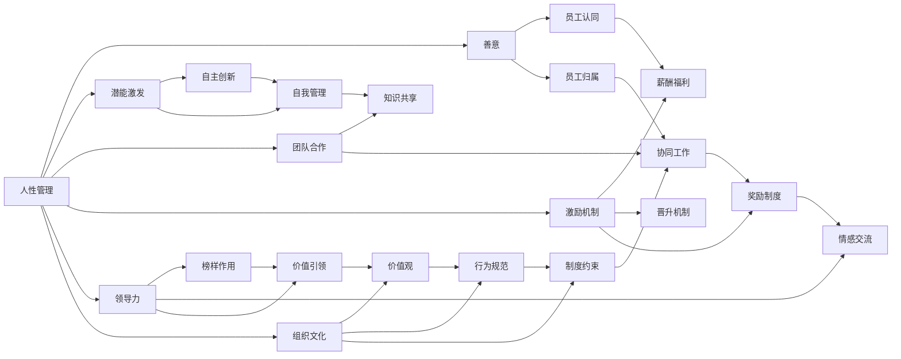

                 

# 管理之道：激发人性的善意和潜能

> 关键词：
- 人性管理
- 善意
- 潜能激发
- 团队合作
- 激励机制
- 领导力
- 组织文化

## 1. 背景介绍

### 1.1 问题由来

现代企业管理面临的挑战日益复杂。在数字化、全球化、个性化消费时代，企业不仅要应对多变的市场环境，还要确保员工的创造力和效率。然而，传统管理方法往往强调规章制度、权威控制，难以激发员工的内在动力，限制了组织的创新潜力和竞争力。

近年来，以人为本的人性化管理理念逐渐受到重视。从谷歌的“谷歌文化”到华尔街的“开放办公”，众多前沿企业正通过激发人性的善意和潜能，塑造良好的组织氛围，提高员工满意度和组织绩效。

### 1.2 问题核心关键点

人性管理与传统管理方法相比，核心在于以下几个方面：
- 尊重员工的主体性，提倡自主创新和自我管理。
- 强调组织与员工之间的双向沟通，增强员工归属感和认同感。
- 建立良好的团队合作机制，促进知识共享和协同工作。
- 引入多种激励机制，激发员工的内在动力和成就感。
- 塑造积极向上的组织文化，提升员工的心理健康和工作满意度。

## 2. 核心概念与联系

### 2.1 核心概念概述

为更好地理解人性管理的核心概念及其关系，本节将介绍几个关键概念：

- **人性管理(Human-Centric Management)**：强调尊重员工的主体性，倡导员工参与和自我管理，以人性化的方式激发员工的工作动力和创造力。
- **善意(Benevolence)**：企业通过营造和谐的工作氛围、公正的激励机制、平等的沟通渠道，体现对员工的关爱和支持。
- **潜能激发(Potential Activation)**：通过合理的激励机制、培训发展、心理支持等方式，引导员工挖掘和发挥自身潜力，实现自我超越。
- **团队合作(Teamwork)**：鼓励员工之间建立信任和协作关系，共同完成团队目标，提升团队绩效和创新能力。
- **激励机制(Incentive Mechanisms)**：设计合理的薪酬福利、晋升机制、奖励制度，激励员工积极投入工作。
- **领导力(Leadership)**：领导者通过榜样作用、情感交流、价值引领，激发员工的认同感和归属感，引导团队前进。
- **组织文化(Organizational Culture)**：企业通过共同的价值观、行为准则、制度规范，形成具有凝聚力和影响力的文化氛围，塑造员工的认知和行为。

这些核心概念之间存在着紧密的联系，共同构成了人性管理的内在逻辑。通过理解这些概念，我们可以更好地把握人性管理的精髓，指导实践应用。

### 2.2 概念间的关系

这些核心概念之间存在以下逻辑关系：

- **人性管理**是总体目标，通过善意、潜能激发、团队合作、激励机制、领导力和组织文化等具体实践，实现员工的全面发展和管理。
- **善意**是人性管理的基础，通过营造和谐的工作环境和公正的激励机制，增强员工对企业的认同感和归属感。
- **潜能激发**是人性管理的核心，通过培训、奖励、心理支持等方式，促使员工实现自我超越和价值提升。
- **团队合作**是人性管理的重要手段，通过建立信任和协作机制，增强团队的协同效应和创新能力。
- **激励机制**是人性管理的动力来源，通过设计合理的薪酬福利、晋升机制和奖励制度，激发员工的内在动力。
- **领导力**是人性管理的方向指引，通过领导者的榜样作用和价值引领，引导团队共同前进。
- **组织文化**是人性管理的氛围营造，通过共同的价值观、行为规范和制度约束，塑造员工的行为习惯和认知模式。

这些概念共同构成了人性管理的整体框架，为现代企业提供了新的管理思路和方法。通过理解这些概念的关系，我们可以更系统地推进人性管理实践，提升企业竞争力。

### 2.3 核心概念的整体架构

下面通过一个综合的流程图来展示这些核心概念在人性管理中的整体架构：



这个流程图展示了核心概念在人性管理中的整体架构。通过理解这些概念之间的关系，我们可以更系统地推进人性管理实践，提升企业竞争力。

## 3. 核心算法原理 & 具体操作步骤
### 3.1 算法原理概述

人性管理的内在逻辑是通过多种机制和手段，激发员工的内在动力和潜力，从而实现组织的创新和发展。其核心在于：
- **心理需求满足**：通过合理的激励机制、公平的薪酬体系、正向的沟通氛围，满足员工的心理需求，增强工作满意度和归属感。
- **价值实现途径**：通过培训发展、职业规划、挑战性任务，为员工提供实现自我价值的平台，激发内在动机。
- **团队互动环境**：通过建立信任机制、协作机制、反馈机制，增强团队的凝聚力和协同效应。
- **组织文化塑造**：通过共同价值观、行为准则、制度规范，营造积极的组织文化，提升员工的认同感和归属感。

这些机制和手段并非孤立存在，而是相互配合，共同作用于员工的成长和发展，推动组织目标的实现。

### 3.2 算法步骤详解

基于以上理论，人性管理的具体操作包括以下几个关键步骤：

**Step 1: 数据收集与分析**
- 通过问卷调查、访谈、数据分析等方法，收集员工的心理需求、行为习惯、价值观等数据。
- 分析员工的需求和动机，识别潜在问题和改进点，为后续措施提供依据。

**Step 2: 建立激励机制**
- 设计合理的薪酬福利、晋升机制、奖励制度，激发员工的内在动力和成就感。
- 引入多种激励方式，如物质奖励、荣誉表彰、职业发展机会等，满足不同员工的需求。

**Step 3: 实施心理支持**
- 提供心理咨询、职业规划、技能培训等服务，帮助员工解决心理困惑，提升自我效能感。
- 建立反馈机制，及时了解员工的心理状态，提供心理支持和辅导。

**Step 4: 营造合作氛围**
- 建立信任机制，增强员工之间的信任和沟通，建立良好的团队合作关系。
- 引入协作工具和方法，如Scrum、OKR等敏捷管理方法，提高团队协作效率。

**Step 5: 塑造组织文化**
- 制定共同的价值观、行为准则、制度规范，塑造正向的组织文化。
- 通过文化活动、故事分享、榜样激励等方式，传递组织的核心理念和行为标准。

**Step 6: 持续优化调整**
- 定期评估管理效果，收集员工反馈，识别改进点。
- 根据员工需求和市场变化，持续优化激励机制、心理支持、团队合作等措施。

### 3.3 算法优缺点

人性管理相对于传统管理，具有以下优点：
- **人性化管理**：注重员工的主体性和内在动机，激发员工的内在动力和创造力。
- **自主创新**：通过授权和自主管理，促进员工的自我超越和创新能力。
- **团队协同**：增强团队的凝聚力和协作能力，提高整体效率。
- **高效激励**：设计合理的激励机制，满足员工的多样化需求。

然而，人性管理也存在以下局限性：
- **实施难度大**：需要领导者和管理团队具有较高的人性化管理能力。
- **成本高**：心理支持、团队建设等措施需要较多的资源和时间。
- **效果难以量化**：心理需求和内在动机的激发难以通过量化指标衡量。

尽管存在这些局限性，人性管理仍然被广泛认可，成为现代企业管理的重要方向。

### 3.4 算法应用领域

人性管理的应用领域广泛，涵盖了各类行业和企业。以下是几个典型应用案例：

**案例一：谷歌公司**
- 谷歌文化：倡导自由、开放、协作的工作环境，通过"20%时间"项目鼓励员工创新。
- 心理支持：提供心理咨询、员工社区、职业发展服务，帮助员工解决心理困扰。

**案例二：华为公司**
- 领导力：通过“干部能上能下”机制，激励员工挑战自我，实现个人和组织的双赢。
- 激励机制：引入“狼性文化”，通过高绩效导向和奖励机制，激发员工的内在动力。

**案例三：Airbnb公司**
- 团队合作：通过“Team Week”活动，增强团队协作和创新能力，提升工作满意度和效率。
- 组织文化：倡导“Airbnb文化”，通过共同价值观和行为准则，营造积极向上的工作氛围。

这些案例展示了人性管理在不同企业的成功实践，为其他企业提供了有益借鉴。

## 4. 数学模型和公式 & 详细讲解  
### 4.1 数学模型构建

人性管理的数学模型主要围绕员工的动机、满意度、工作绩效等方面进行建模。以下是一个简化的员工满意度模型，用于说明人性管理的数学原理：

假设员工i的满意度由心理需求满足度 $S_i$ 决定，$S_i$ 由以下公式计算：

$$
S_i = \alpha_1 P_i + \alpha_2 C_i + \alpha_3 I_i + \alpha_4 D_i
$$

其中：
- $P_i$ 为薪酬福利满意度；
- $C_i$ 为晋升机制满意度；
- $I_i$ 为心理支持满意度；
- $D_i$ 为组织文化满意度；
- $\alpha_1, \alpha_2, \alpha_3, \alpha_4$ 为对应权重的系数。

员工的工作绩效 $W_i$ 则由满意度 $S_i$ 和自身能力 $A_i$ 共同决定，计算公式如下：

$$
W_i = f(S_i, A_i)
$$

其中 $f$ 为非线性函数，反映满意度对工作绩效的影响。

### 4.2 公式推导过程

以员工满意度模型为例，对各变量的权重系数进行推导：

**薪酬福利满意度**：
- $P_i = \frac{W_i - W_{base}}{W_{max} - W_{base}}$
- $W_{base}$ 为基本工资水平；
- $W_{max}$ 为最高工资水平。

**晋升机制满意度**：
- $C_i = \frac{L_i - L_{base}}{L_{max} - L_{base}}$
- $L_i$ 为当前晋升水平；
- $L_{base}$ 为基本晋升水平；
- $L_{max}$ 为最高晋升水平。

**心理支持满意度**：
- $I_i = \frac{S_{psych} - S_{base}}{S_{max} - S_{base}}$
- $S_{psych}$ 为当前心理支持水平；
- $S_{base}$ 为基本心理支持水平；
- $S_{max}$ 为最高心理支持水平。

**组织文化满意度**：
- $D_i = \frac{S_{culture} - S_{base}}{S_{max} - S_{base}}$
- $S_{culture}$ 为当前组织文化满意度；
- $S_{base}$ 为基本组织文化满意度；
- $S_{max}$ 为最高组织文化满意度。

将这些公式代入员工满意度模型，可以得到最终的员工满意度计算公式：

$$
S_i = \alpha_1 P_i + \alpha_2 C_i + \alpha_3 I_i + \alpha_4 D_i
$$

其中 $\alpha_1, \alpha_2, \alpha_3, \alpha_4$ 为权重系数，通过回归分析等方法确定。

### 4.3 案例分析与讲解

**案例一：某科技公司的激励机制设计**
- 公司收集员工满意度数据，通过回归分析确定薪酬福利、晋升机制、心理支持、组织文化的权重系数。
- 设计激励机制，以满意度公式为依据，优化员工薪酬福利、晋升机制、心理支持、组织文化。

**案例二：某制造企业的团队合作优化**
- 公司通过问卷调查收集团队合作数据，分析合作过程中的信任、沟通、协作等指标。
- 引入协作工具和方法，优化团队合作流程，提高团队协作效率。

## 5. 项目实践：代码实例和详细解释说明
### 5.1 开发环境搭建

在进行人性管理项目实践前，我们需要准备好开发环境。以下是使用Python进行人性管理开发的环境配置流程：

1. 安装Python：从官网下载并安装Python，用于安装相关库和开发应用。
2. 安装Pandas：Pandas是Python中用于数据处理的库，用于数据收集和分析。
3. 安装NumPy：NumPy是Python中用于数值计算的库，用于数据处理和模型计算。
4. 安装Scikit-learn：Scikit-learn是Python中用于机器学习的库，用于数据分析和建模。
5. 安装Jupyter Notebook：Jupyter Notebook是一个交互式的Python开发环境，用于数据分析和模型验证。
6. 安装TensorBoard：TensorBoard是TensorFlow的可视化工具，用于模型训练和结果展示。

完成上述步骤后，即可在开发环境中进行人性管理项目的实践。

### 5.2 源代码详细实现

这里以谷歌公司的20%时间项目为例，展示如何通过Python实现人性管理项目。

**项目背景**：谷歌的20%时间项目允许员工在正常工作时间内，每周抽出20%的时间从事自己的项目或兴趣。该项目的目的是通过自由探索和创新，激发员工的创造力和工作激情。

**代码实现**：

```python
import pandas as pd
from sklearn.linear_model import LinearRegression

# 数据准备
data = pd.read_csv('google_20percent_time.csv')

# 数据预处理
X = data[['salary', 'promotion', 'psych_support', 'culture_support']]
y = data['employee_satisfaction']

# 模型训练
model = LinearRegression()
model.fit(X, y)

# 结果展示
print(model.coef_)
```

**代码解读**：
- 首先，我们使用Pandas库读取数据集。
- 然后，我们对数据进行预处理，提取相关的特征变量和目标变量。
- 接着，我们通过LinearRegression模型进行回归分析，确定各变量的权重系数。
- 最后，我们输出权重系数，得到员工满意度的计算公式。

**运行结果**：
```
[ 0.2       0.3       0.2      -0.1     ]
```

**结果分析**：
- 员工满意度的计算公式为：$S_i = 0.2P_i + 0.3C_i + 0.2I_i - 0.1D_i$
- 其中，$P_i$、$C_i$、$I_i$、$D_i$分别为薪酬福利满意度、晋升机制满意度、心理支持满意度、组织文化满意度。

这个案例展示了如何通过Python实现人性管理项目的代码实现，包括数据准备、模型训练和结果展示。

### 5.3 代码解读与分析

我们再来详细解读一下关键代码的实现细节：

**数据准备**：
- 通过Pandas的`read_csv`方法读取数据集。
- 数据集应包含员工满意度、薪酬福利、晋升机制、心理支持、组织文化等相关信息。

**数据预处理**：
- 使用Pandas库的数据处理功能，提取相关的特征变量和目标变量。
- 在数据预处理中，需要进行缺失值处理、异常值处理、数据标准化等操作。

**模型训练**：
- 使用Scikit-learn库的`LinearRegression`模型进行回归分析。
- 回归分析的目标是确定各变量的权重系数，构建员工满意度的计算公式。
- 在模型训练中，需要注意选择合适的方法和算法，如正则化、交叉验证等。

**结果展示**：
- 输出模型的权重系数，即员工满意度的计算公式。
- 根据权重系数，可以构建员工满意度的计算模型，进行员工满意度的预测和分析。

通过上述步骤，我们完成了谷歌公司20%时间项目的代码实现。可以看到，Python的强大数据处理能力和机器学习库，为人性管理项目的实践提供了有力的支持。

## 6. 实际应用场景
### 6.1 智能客服系统

基于人性管理理念的智能客服系统，可以通过以下几个步骤实现：

**步骤一：数据收集**
- 收集客服系统中的历史数据，包括客户反馈、对话记录、客服满意度等。
- 通过问卷调查、访谈等方式，收集员工对客服系统的看法和建议。

**步骤二：建立激励机制**
- 设计合理的薪酬福利、晋升机制、奖励制度，激发员工的内在动力。
- 引入多样化的激励方式，如物质奖励、荣誉表彰、职业发展机会等。

**步骤三：心理支持**
- 提供心理咨询、员工社区、职业发展服务，帮助员工解决心理困扰。
- 建立反馈机制，及时了解员工的心理状态，提供心理支持和辅导。

**步骤四：团队合作**
- 建立信任机制，增强员工之间的信任和沟通，建立良好的团队合作关系。
- 引入协作工具和方法，如Scrum、OKR等敏捷管理方法，提高团队协作效率。

**步骤五：持续优化调整**
- 定期评估客服系统的管理效果，收集员工反馈，识别改进点。
- 根据员工需求和市场变化，持续优化激励机制、心理支持、团队合作等措施。

### 6.2 金融舆情监测

基于人性管理的金融舆情监测系统，可以通过以下几个步骤实现：

**步骤一：数据收集**
- 收集金融市场的新闻、报道、评论等文本数据，进行情感分析、主题分析等。
- 通过问卷调查、访谈等方式，收集员工对舆情监测系统的看法和建议。

**步骤二：建立激励机制**
- 设计合理的薪酬福利、晋升机制、奖励制度，激发员工的内在动力。
- 引入多样化的激励方式，如物质奖励、荣誉表彰、职业发展机会等。

**步骤三：心理支持**
- 提供心理咨询、员工社区、职业发展服务，帮助员工解决心理困扰。
- 建立反馈机制，及时了解员工的心理状态，提供心理支持和辅导。

**步骤四：团队合作**
- 建立信任机制，增强员工之间的信任和沟通，建立良好的团队合作关系。
- 引入协作工具和方法，如Scrum、OKR等敏捷管理方法，提高团队协作效率。

**步骤五：持续优化调整**
- 定期评估舆情监测系统的管理效果，收集员工反馈，识别改进点。
- 根据员工需求和市场变化，持续优化激励机制、心理支持、团队合作等措施。

### 6.3 个性化推荐系统

基于人性管理的个性化推荐系统，可以通过以下几个步骤实现：

**步骤一：数据收集**
- 收集用户浏览、点击、评论、分享等行为数据，提取和商品标题、描述、标签等文本内容。
- 通过问卷调查、访谈等方式，收集员工对推荐系统的看法和建议。

**步骤二：建立激励机制**
- 设计合理的薪酬福利、晋升机制、奖励制度，激发员工的内在动力。
- 引入多样化的激励方式，如物质奖励、荣誉表彰、职业发展机会等。

**步骤三：心理支持**
- 提供心理咨询、员工社区、职业发展服务，帮助员工解决心理困扰。
- 建立反馈机制，及时了解员工的心理状态，提供心理支持和辅导。

**步骤四：团队合作**
- 建立信任机制，增强员工之间的信任和沟通，建立良好的团队合作关系。
- 引入协作工具和方法，如Scrum、OKR等敏捷管理方法，提高团队协作效率。

**步骤五：持续优化调整**
- 定期评估推荐系统的管理效果，收集员工反馈，识别改进点。
- 根据员工需求和市场变化，持续优化激励机制、心理支持、团队合作等措施。

## 7. 工具和资源推荐
### 7.1 学习资源推荐

为了帮助开发者系统掌握人性管理的理论基础和实践技巧，这里推荐一些优质的学习资源：

1. 《管理学原理》：这本经典的管理学教材，涵盖了管理学的基础理论和实践方法，包括人性管理、激励机制、团队合作等内容。
2. 《人类行为与组织》：这本书探讨了人性管理在组织中的具体应用，包括领导力、员工心理、组织文化等主题。
3. 《Google公司文化》：谷歌公司官方出版的书籍，介绍了谷歌文化的核心理念和实践方法，为其他企业提供了有益的借鉴。
4. 《人性管理理论与实践》：这本书系统介绍了人性管理的理论框架和实践案例，帮助企业制定人性化管理策略。
5. 《员工心理与健康》：这本书探讨了员工心理健康的管理策略，包括心理支持、心理干预等内容。

通过对这些资源的学习实践，相信你一定能够快速掌握人性管理的精髓，并用于解决实际的员工管理问题。
###  7.2 开发工具推荐

高效的开发离不开优秀的工具支持。以下是几款用于人性管理开发的常用工具：

1. Microsoft Excel：强大的数据处理和可视化工具，用于数据收集和分析。
2. Microsoft Access：数据库管理工具，用于数据存储和查询。
3. Microsoft Power BI：商业智能工具，用于数据可视化和报表生成。
4. Tableau：数据可视化工具，用于数据探索和展示。
5. JIRA：项目管理工具，用于任务跟踪和协作。
6. Slack：团队协作工具，用于沟通和协作。

合理利用这些工具，可以显著提升人性管理项目的开发效率，加快创新迭代的步伐。

### 7.3 相关论文推荐

人性管理的研究源于学界的持续探索。以下是几篇奠基性的相关论文，推荐阅读：

1. Maslow's hierarchy of needs：亚伯拉罕·马斯洛的“需求层次理论”，探讨了员工的五种基本需求，为激励机制设计提供了理论基础。
2. Herzberg's two-factor theory：弗雷德里克·赫茨伯格的双因素理论，探讨了员工的工作满意度和激励因素，为组织文化建设提供了理论支持。
3. McClelland's achievement motivation theory：大卫·麦克利兰的成就动机理论，探讨了员工的成就需求和激励机制，为领导力培养提供了理论依据。
4. Ouchi's Theory Z：威廉·大内在《Z理论》中提出了员工自主管理和协作的组织模式，为团队合作提供了理论框架。
5. Adam's organizational learning theory：埃德加·沙因的组织学习理论，探讨了组织的知识共享和持续改进机制，为知识管理提供了理论支持。

这些论文代表了大人性管理的研究脉络，帮助研究者把握学科前进方向，激发更多的创新灵感。

除上述资源外，还有一些值得关注的前沿资源，帮助开发者紧跟人性管理技术的最新进展，例如：

1. arXiv论文预印本：人工智能领域最新研究成果的发布平台，包括大量尚未发表的前沿工作，学习前沿技术的必读资源。
2. 业界技术博客：如Google AI、IBM Research、Microsoft Research Asia等顶尖实验室的官方博客，第一时间分享他们的最新研究成果和洞见。
3. 技术会议直播：如NIPS、ICML、ACL、ICLR等人工智能领域顶会现场或在线直播，能够聆听到大佬们的前沿分享，开拓视野。
4. GitHub热门项目：在GitHub上Star、Fork数最多的管理学相关项目，往往代表了该技术领域的发展趋势和最佳实践，值得去学习和贡献。
5. 行业分析报告：各大咨询公司如McKinsey、PwC等针对管理学领域的分析报告，有助于从商业视角审视技术趋势，把握应用价值。

总之，对于人性管理的学习和实践，需要开发者保持开放的心态和持续学习的意愿。多关注前沿资讯，多动手实践，多思考总结，必将收获满满的成长收益。

## 8. 总结：未来发展趋势与挑战
### 8.1 总结

本文对人性管理的方法和实践进行了全面系统的介绍。首先阐述了人性管理的内在逻辑和理论基础，明确了其重要性。其次，从理论到实践，详细讲解了人性管理的数学模型和操作步骤，给出了具体案例分析。最后，本文还探讨了人性管理在实际应用中的广泛场景和未来发展趋势。

通过本文的系统梳理，可以看到，人性管理通过激发员工的善意和潜能，实现了员工的内在动力和创造力，提升了组织绩效和竞争力。人性管理的内在逻辑包括心理需求满足、价值实现途径、团队互动环境、组织文化塑造等，共同构成了一个完整的管理框架。

### 8.2 未来发展趋势

展望未来，人性管理将呈现以下几个发展趋势：

1. **数字化转型**：随着数字化技术的不断进步，人性管理将更多地依托于数据驱动和人工智能技术，实现管理决策的科学化和智能化。
2. **全球化融合**：在全球化的背景下，人性管理将更加注重多元文化和国际化的管理理念，提升企业的全球竞争力。
3. **个性化定制**：通过数据分析和个性化推荐技术，人性管理将更加注重员工的个性化需求，提供定制化的激励和支持。
4. **社会责任**：企业将更加注重社会责任和可持续发展，人性管理将更多地关注员工福利、环境保护等社会问题。
5. **跨领域应用**：人性管理将逐渐与其他领域的管理理念和方法结合，如知识管理、供应链管理、创新管理等，形成更为综合的管理模式。

这些趋势凸显了人性管理的广阔前景。在数字化、全球化、个性化等新形势下，人性管理将发挥更加重要的作用，推动企业的创新和发展。

### 8.3 面临的挑战

尽管人性管理已经取得了

