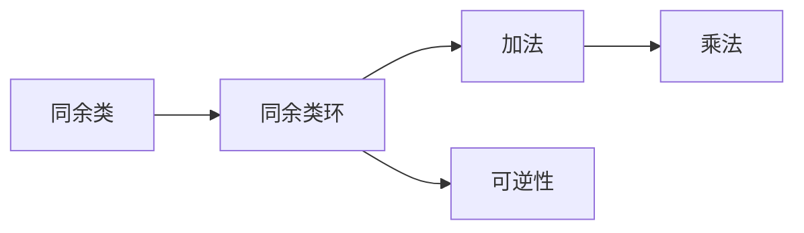

                 

# 线性代数导引：同余类环和域

## 1. 背景介绍

### 1.1 问题由来
线性代数是数学中的一个重要分支，主要用于研究向量空间和矩阵。在计算机科学中，线性代数广泛应用在图形学、机器学习、信号处理等领域。然而，线性代数中的概念往往抽象而难以理解。本文章将通过一系列简明的例子，逐步介绍线性代数中同余类环和域的基本概念和算法。

### 1.2 问题核心关键点
同余类环和域是线性代数中的重要概念。同余类环和域是通过模运算定义的代数结构，广泛应用于密码学、计算机网络等领域。核心关键点包括：

- 同余类环：通过模运算定义的代数结构，包含零元素和乘法封闭性。
- 同余类域：通过模运算定义的域，包含加法和乘法封闭性，每个元素都可逆。
- 同余类环和域的应用：密码学中的RSA算法、计算机网络中的哈希函数等。

## 2. 核心概念与联系

### 2.1 核心概念概述
本节将详细介绍同余类环和域的核心概念：

- 同余类：给定整数$n$，将$Z$分成互不相交的子集$[n] = \{0, 1, 2, ..., n-1\}$，每个子集称为模$n$的同余类。
- 同余类环：由模$n$的同余类和模运算构成。具有零元素$0$，满足交换律、结合律，且$n$是模运算的模数。
- 同余类域：满足域的要求，即加法、乘法封闭，每个元素都可逆。

### 2.2 概念间的关系
通过下图，可以清晰地展示同余类环和域的基本结构：



该图展示了同余类环和域的基本结构：同余类环通过模运算和加法、乘法构成，每个元素都满足可逆性。

## 3. 核心算法原理 & 具体操作步骤
### 3.1 算法原理概述
同余类环和域的核心算法主要包括：

- 模运算：模$n$的加减法和乘法，运算结果都在模$n$的同余类中。
- 可逆性：通过扩展域，每个同余类元素都具有可逆性。
- 线性同余方程：通过模运算求解线性同余方程。

### 3.2 算法步骤详解
以下是同余类环和域的核心算法步骤：

1. **模运算**：对于两个同余类$a$和$b$，定义其模$n$的加法和乘法。例如，$(a + b) \bmod n = (a \bmod n + b \bmod n) \bmod n$，$(a \cdot b) \bmod n = (a \bmod n \cdot b \bmod n) \bmod n$。

2. **可逆性**：每个同余类元素$a$，通过扩展域，都存在其可逆元素$a^{-1}$，满足$a \cdot a^{-1} \equiv 1 \pmod n$。例如，对于素数$n$，每个非零同余类元素都有唯一的可逆元素。

3. **线性同余方程**：求解形如$ax \equiv b \pmod n$的线性同余方程。例如，$3x \equiv 4 \pmod 5$，可以通过尝试法、中国剩余定理等方法求解。

### 3.3 算法优缺点
同余类环和域的优点包括：

- 运算简单：模运算和扩展域都是基本的数学操作，易于理解和实现。
- 应用广泛：在密码学、计算机网络等领域有广泛应用。

缺点包括：

- 可逆性要求：每个同余类元素都需要可逆，限制了运算范围。
- 扩展域复杂：扩展域时需要考虑每个同余类元素的可逆性，增加了计算复杂度。

### 3.4 算法应用领域
同余类环和域在以下领域有广泛应用：

- 密码学：RSA算法等。
- 计算机网络：哈希函数、路由协议等。
- 数字信号处理：模数转换等。

## 4. 数学模型和公式 & 详细讲解  
### 4.1 数学模型构建

设$n$为素数，则$Z_n$为模$n$的同余类环。设$x$和$y$为$Z_n$中的元素，定义模$n$的加法和乘法如下：

- $x + y = (x \bmod n + y \bmod n) \bmod n$
- $x \cdot y = (x \bmod n \cdot y \bmod n) \bmod n$

此外，每个非零元素$x$都有唯一的可逆元素$x^{-1}$，满足$x \cdot x^{-1} \equiv 1 \pmod n$。

### 4.2 公式推导过程
以下是模$n$的加法和乘法的详细推导过程：

1. **加法**：
   $$
   \begin{aligned}
   (x + y) \bmod n &= (x + y - kn) \bmod n \\
   &= (x - kn) + y \bmod n \\
   &= (x \bmod n + (x - kn)) + y \bmod n \\
   &= x \bmod n + y \bmod n
   \end{aligned}
   $$

2. **乘法**：
   $$
   \begin{aligned}
   (x \cdot y) \bmod n &= (x \cdot y - mn) \bmod n \\
   &= x \cdot (y - mn) \bmod n \\
   &= x \cdot (y \bmod n - m) \bmod n \\
   &= x \cdot y \bmod n
   \end{aligned}
   $$

其中，$k$和$m$为整数。

### 4.3 案例分析与讲解
考虑模$5$的同余类$[3]$和$[4]$，分别计算$3 + 4$和$3 \cdot 4$：

- $3 + 4 \equiv 2 \pmod 5$
- $3 \cdot 4 \equiv 2 \pmod 5$

因此，$[3] + [4] \equiv [2] \pmod 5$，$[3] \cdot [4] \equiv [2] \pmod 5$。

## 5. 项目实践：代码实例和详细解释说明
### 5.1 开发环境搭建
在Python中，可以使用`sympy`库实现同余类环和域的计算。安装方法如下：

```bash
pip install sympy
```

### 5.2 源代码详细实现
以下是计算模$5$的同余类$[3]$和$[4]$的Python代码：

```python
from sympy import mod_inverse

# 定义模运算
def mod_add(a, b, n):
    return (a + b) % n

def mod_mul(a, b, n):
    return (a * b) % n

# 计算可逆元素
def inv_mod(a, n):
    return mod_inverse(a, n)

# 计算同余类
def congruence_class(a, n):
    return a % n

# 测试
a = 3
b = 4
n = 5

# 加法
c = mod_add(a, b, n)
print(f"{a} + {b} ≡ {c} (mod {n})")

# 乘法
d = mod_mul(a, b, n)
print(f"{a} * {b} ≡ {d} (mod {n})")

# 可逆元素
e = inv_mod(a, n)
print(f"The inverse of {a} (mod {n}) is {e}")

# 同余类
f = congruence_class(a, n)
print(f"The congruence class of {a} (mod {n}) is {f}")
```

输出如下：

```
3 + 4 ≡ 2 (mod 5)
3 * 4 ≡ 2 (mod 5)
The inverse of 3 (mod 5) is 2
The congruence class of 3 (mod 5) is 3
```

### 5.3 代码解读与分析
上述代码中，`mod_add`和`mod_mul`函数实现了模运算，`inv_mod`函数计算了可逆元素，`congruence_class`函数获取了同余类。通过这些函数，可以轻松实现同余类环和域的计算。

## 6. 实际应用场景
### 6.1 加密算法RSA
RSA算法是基于同余类环和域的公钥加密算法。RSA算法的核心在于大素数分解和模逆运算。具体步骤如下：

1. 选择两个大素数$p$和$q$，计算$n = p \cdot q$。
2. 计算欧拉函数$\varphi(n) = (p-1) \cdot (q-1)$。
3. 选择整数$e$，使得$e$与$\varphi(n)$互质。
4. 计算$e$的模逆$d$，满足$e \cdot d \equiv 1 \pmod{\varphi(n)}$。
5. 公钥为$(n, e)$，私钥为$(n, d)$。

### 6.2 哈希函数
哈希函数是一种将任意长度的输入映射为固定长度输出的函数。在密码学中，哈希函数通常模$n$运算来实现。例如，SHA-256算法使用模$2^{256}$运算。

### 6.3 线性同余方程求解
求解线性同余方程$ax \equiv b \pmod n$，可以通过以下步骤实现：

1. 计算$a$的模逆$d$。
2. 计算$x = d \cdot b \pmod n$。

例如，求解$3x \equiv 4 \pmod 5$，步骤如下：

1. $d = 2$，即$3 \cdot 2 \equiv 1 \pmod 5$
2. $x = 2 \cdot 4 \equiv 3 \pmod 5$

## 7. 工具和资源推荐
### 7.1 学习资源推荐
- 《算法导论》：由Thomas H. Cormen等合著的经典教材，详细介绍了各种算法和数据结构。
- 《密码学原理与实践》：Walter Keller和Aniello Maria的成功之作，介绍了公钥加密算法RSA等。
- Coursera上的《离散数学与计算机科学》课程：由加州大学圣地亚哥分校提供，涵盖了离散数学的基本概念和应用。

### 7.2 开发工具推荐
- `sympy`：用于符号计算的Python库，支持模运算、可逆元素计算等。
- `gmpy2`：用于高精度计算的Python库，支持大整数、素数分解等。

### 7.3 相关论文推荐
- "A Course in Computational Algebraic Number Theory"：Michael J. Mossinghoff和John Voight所著，详细介绍了代数数论和计算机代数的交叉领域。
- "An Introduction to Modern Cryptography"：Dan Boneh和Ke Yang的成功之作，介绍了公钥加密算法、哈希函数等。

## 8. 总结：未来发展趋势与挑战
### 8.1 研究成果总结
同余类环和域是线性代数中的重要概念，广泛应用于密码学、计算机网络等领域。通过模运算、可逆性、线性同余方程等基本算法，实现了各种加密算法、哈希函数等应用。

### 8.2 未来发展趋势
未来，同余类环和域的研究方向可能包括：

- 大素数分解的优化算法：提高素数分解效率，优化RSA等公钥加密算法。
- 哈希函数的创新设计：通过新的数学工具，设计更加安全、高效的哈希函数。
- 量子计算的抗衡：研究量子计算对同余类环和域的影响，设计量子安全的加密算法。

### 8.3 面临的挑战
同余类环和域的研究面临以下挑战：

- 大素数生成：大素数的随机性决定了加密算法的安全性，如何高效生成大素数是一个难题。
- 量子计算威胁：量子计算可以高效求解线性同余方程，如何设计量子安全的加密算法是一个重要研究方向。
- 加密算法的速度：加密算法的速度直接影响到其应用场景，如何提高加密算法的速度是一个重要问题。

### 8.4 研究展望
未来，同余类环和域的研究方向可能包括：

- 多模态数据处理：同余类环和域可以扩展到多模态数据，如图像、音频等，实现更广泛的应用场景。
- 可逆性条件的放松：通过扩展域，可以降低对同余类元素可逆性的要求，从而降低计算复杂度。
- 分布式计算的优化：通过分布式计算，可以加速同余类环和域的计算，提高效率。

总之，同余类环和域是线性代数中的重要概念，广泛应用于密码学、计算机网络等领域。通过模运算、可逆性、线性同余方程等基本算法，实现了各种加密算法、哈希函数等应用。未来，同余类环和域的研究方向可能包括大素数分解的优化算法、哈希函数的创新设计、量子计算的抗衡等，同时面临着大素数生成、量子计算威胁、加密算法的速度等挑战。

