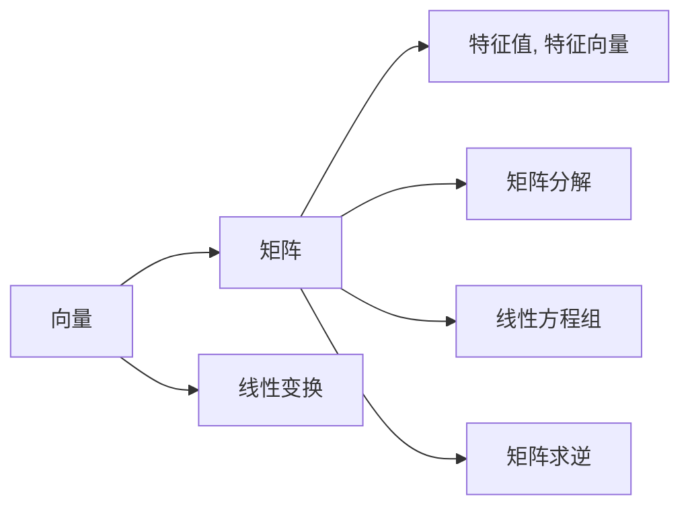
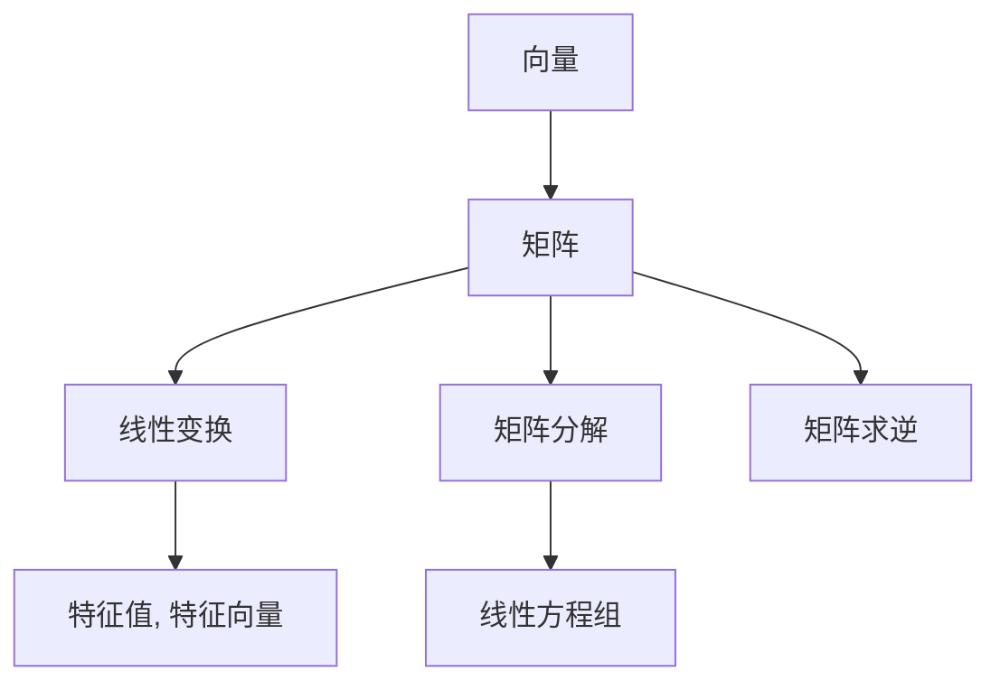

                 

# 线性代数导引：实欧几里得空间

> 关键词：线性代数, 欧几里得空间, 向量, 矩阵, 线性变换, 特征值, 矩阵分解, 线性方程组, 矩阵求逆

## 1. 背景介绍

线性代数是现代数学和工程学科中不可或缺的一门基础学科。在计算机科学中，线性代数应用广泛，尤其是在机器学习、数据科学、信号处理、计算机视觉等领域。掌握线性代数的核心概念和基本方法，是成为一名优秀的计算机科学家和工程师的基础。

本文将从线性代数的基础概念入手，深入探讨实欧几里得空间中的核心概念和常用方法，帮助读者建立牢固的数学基础，为后续的高级课程和实际应用打下坚实的基础。

## 2. 核心概念与联系

### 2.1 核心概念概述

在实欧几里得空间中，我们主要关注向量、矩阵、线性变换、特征值、矩阵分解、线性方程组和矩阵求逆等基本概念。这些概念构成了线性代数的骨架，是理解和应用线性代数的基础。

- **向量**：向量是一维数组，表示空间中的方向和大小。在实欧几里得空间中，向量可以用实数域上的多维数组来表示。

- **矩阵**：矩阵是二维数组，表示向量之间的线性组合。矩阵和向量的乘积可以表示线性变换。

- **线性变换**：线性变换是一种保持向量加法和数乘运算的变换。线性变换可以表示为矩阵乘法。

- **特征值和特征向量**：特征值和特征向量是线性变换的固有属性，用于描述变换对向量的影响。

- **矩阵分解**：矩阵分解是将矩阵表示为其他矩阵的乘积的过程，常见的方法包括矩阵分解、LU分解、QR分解等。

- **线性方程组**：线性方程组是线性代数的核心问题，用于解决多变量线性关系的问题。

- **矩阵求逆**：矩阵求逆是矩阵的逆运算，用于求解线性方程组的解。

这些核心概念通过以下的Mermaid流程图连接起来：



### 2.2 概念间的关系

以上核心概念之间的关系，可以通过以下示意图来表示：



其中，向量是线性代数的基本单位，矩阵和线性变换是向量的线性组合和变换表示，特征值和特征向量描述了线性变换的固有属性，矩阵分解和线性方程组用于表示和求解矩阵问题，矩阵求逆是矩阵的逆运算，用于线性方程组的解。

## 3. 核心算法原理 & 具体操作步骤

### 3.1 算法原理概述

线性代数的核心算法包括矩阵乘法、特征值和特征向量的计算、矩阵分解、线性方程组的求解和矩阵求逆等。这些算法构成了线性代数的基础，是理解和应用线性代数的基础。

### 3.2 算法步骤详解

#### 3.2.1 矩阵乘法

矩阵乘法是线性代数中最基本的运算之一。两个矩阵$A$和$B$的乘积$AB$，其定义如下：

$$
AB = \begin{bmatrix}
a_{11} & a_{12} & \cdots & a_{1n} \\
a_{21} & a_{22} & \cdots & a_{2n} \\
\vdots & \vdots & \ddots & \vdots \\
a_{m1} & a_{m2} & \cdots & a_{mn} \\
\end{bmatrix} \begin{bmatrix}
b_{11} & b_{12} & \cdots & b_{1p} \\
b_{21} & b_{22} & \cdots & b_{2p} \\
\vdots & \vdots & \ddots & \vdots \\
b_{n1} & b_{n2} & \cdots & b_{np} \\
\end{bmatrix} = \begin{bmatrix}
\sum_{k=1}^p a_{1k}b_{k1} & \sum_{k=1}^p a_{1k}b_{k2} & \cdots & \sum_{k=1}^p a_{1k}b_{kp} \\
\sum_{k=1}^p a_{2k}b_{k1} & \sum_{k=1}^p a_{2k}b_{k2} & \cdots & \sum_{k=1}^p a_{2k}b_{kp} \\
\vdots & \vdots & \ddots & \vdots \\
\sum_{k=1}^p a_{mk}b_{k1} & \sum_{k=1}^p a_{mk}b_{k2} & \cdots & \sum_{k=1}^p a_{mk}b_{kp} \\
\end{bmatrix}
$$

其中，$A$的列数必须等于$B$的行数。

#### 3.2.2 特征值和特征向量的计算

特征值和特征向量是线性变换的重要属性，用于描述变换对向量的影响。设$A$为$n \times n$的矩阵，$\lambda$为特征值，$v$为特征向量，则有：

$$
Av = \lambda v
$$

求解特征值和特征向量的步骤如下：
1. 将$A$表示为$Eigendecomposition$形式，即$A = VDV^T$，其中$V$为特征向量矩阵，$D$为特征值对角矩阵。
2. 求解特征方程$Av = \lambda v$，得到特征值$\lambda$和对应的特征向量$v$。

#### 3.2.3 矩阵分解

矩阵分解是将矩阵表示为其他矩阵的乘积的过程。常见的矩阵分解方法包括LU分解、QR分解、SVD分解等。

以$QR$分解为例，$QR$分解是将矩阵$A$表示为$Q$和$R$的乘积：

$$
A = QR
$$

其中$Q$为正交矩阵，$R$为上三角矩阵。$QR$分解的计算步骤如下：
1. 将$A$表示为$A = QH$，其中$Q$为正交矩阵，$H$为上三角矩阵。
2. 对$H$进行$Gaussian$消元，得到上三角矩阵$R$。
3. 计算$Q = QR$。

#### 3.2.4 线性方程组的求解

线性方程组是线性代数中的核心问题，用于解决多变量线性关系的问题。设$Ax = b$为线性方程组，求解$x$的步骤如下：
1. 将$A$表示为$LU$分解形式，即$A = LU$。
2. 将$Ax = b$表示为$Ly = b$和$Uy = x$，其中$y$为中间变量。
3. 求解$Ly = b$，得到$y$。
4. 求解$Uy = x$，得到$x$。

#### 3.2.5 矩阵求逆

矩阵求逆是矩阵的逆运算，用于求解线性方程组的解。设$A$为可逆矩阵，其逆矩阵$A^{-1}$满足：

$$
AA^{-1} = I
$$

矩阵求逆的计算步骤如下：
1. 将$A$表示为$LU$分解形式，即$A = LU$。
2. 对$U$进行上三角矩阵求逆，得到$U^{-1}$。
3. 计算$A^{-1} = U^{-1}L^{-1}$。

### 3.3 算法优缺点

#### 3.3.1 优点

- 矩阵乘法、特征值和特征向量计算、矩阵分解、线性方程组求解和矩阵求逆等算法，可以高效地解决各种线性代数问题，具有广泛的实用性和应用前景。
- 这些算法在计算机科学中的应用非常广泛，如机器学习、数据科学、信号处理、计算机视觉等领域，是许多算法和应用的基础。

#### 3.3.2 缺点

- 矩阵乘法和矩阵分解等算法计算复杂度高，对硬件资源要求高，适用于小规模矩阵的计算。
- 特征值和特征向量的计算、矩阵求逆等算法可能存在数值不稳定问题，需要采取一定的数值稳定性措施。

### 3.4 算法应用领域

- 机器学习：矩阵乘法、特征值和特征向量计算、矩阵分解等算法是机器学习中的核心算法，用于处理和分析大规模数据集。
- 数据科学：矩阵乘法、矩阵分解等算法用于处理和分析大规模数据集，提取数据中的有价值信息。
- 信号处理：矩阵乘法、特征值和特征向量计算等算法用于信号处理中的滤波、降噪等任务。
- 计算机视觉：矩阵乘法、矩阵分解等算法用于计算机视觉中的图像处理、特征提取等任务。

## 4. 数学模型和公式 & 详细讲解 & 举例说明

### 4.1 数学模型构建

线性代数的基本模型包括向量、矩阵、线性变换、特征值、特征向量、矩阵分解、线性方程组和矩阵求逆等。

#### 4.1.1 向量

设$\mathbf{x} = (x_1, x_2, \ldots, x_n)$为$n$维向量，其模长定义为：

$$
\|\mathbf{x}\| = \sqrt{x_1^2 + x_2^2 + \cdots + x_n^2}
$$

#### 4.1.2 矩阵

设$A$为$m \times n$矩阵，$B$为$n \times p$矩阵，则$A$和$B$的乘积$AB$为$m \times p$矩阵，其元素定义为：

$$
(AB)_{ij} = \sum_{k=1}^n A_{ik}B_{kj}
$$

#### 4.1.3 线性变换

设$A$为$m \times n$矩阵，$B$为$n \times p$矩阵，则$A$和$B$的线性组合$AB$为$m \times p$矩阵，其元素定义为：

$$
(AB)_{ij} = \sum_{k=1}^n A_{ik}B_{kj}
$$

#### 4.1.4 特征值和特征向量

设$A$为$n \times n$矩阵，$\lambda$为特征值，$v$为特征向量，则有：

$$
Av = \lambda v
$$

#### 4.1.5 矩阵分解

矩阵分解是将矩阵表示为其他矩阵的乘积的过程。常见的矩阵分解方法包括LU分解、QR分解、SVD分解等。

以$QR$分解为例，$QR$分解是将矩阵$A$表示为$Q$和$R$的乘积：

$$
A = QR
$$

其中$Q$为正交矩阵，$R$为上三角矩阵。$QR$分解的计算步骤如下：
1. 将$A$表示为$A = QH$，其中$Q$为正交矩阵，$H$为上三角矩阵。
2. 对$H$进行$Gaussian$消元，得到上三角矩阵$R$。
3. 计算$Q = QR$。

#### 4.1.6 线性方程组

线性方程组是线性代数中的核心问题，用于解决多变量线性关系的问题。设$Ax = b$为线性方程组，求解$x$的步骤如下：
1. 将$A$表示为$LU$分解形式，即$A = LU$。
2. 将$Ax = b$表示为$Ly = b$和$Uy = x$，其中$y$为中间变量。
3. 求解$Ly = b$，得到$y$。
4. 求解$Uy = x$，得到$x$。

#### 4.1.7 矩阵求逆

矩阵求逆是矩阵的逆运算，用于求解线性方程组的解。设$A$为可逆矩阵，其逆矩阵$A^{-1}$满足：

$$
AA^{-1} = I
$$

矩阵求逆的计算步骤如下：
1. 将$A$表示为$LU$分解形式，即$A = LU$。
2. 对$U$进行上三角矩阵求逆，得到$U^{-1}$。
3. 计算$A^{-1} = U^{-1}L^{-1}$。

### 4.2 公式推导过程

#### 4.2.1 矩阵乘法

设$A$为$m \times n$矩阵，$B$为$n \times p$矩阵，则$A$和$B$的乘积$AB$为$m \times p$矩阵，其元素定义为：

$$
(AB)_{ij} = \sum_{k=1}^n A_{ik}B_{kj}
$$

#### 4.2.2 特征值和特征向量

设$A$为$n \times n$矩阵，$\lambda$为特征值，$v$为特征向量，则有：

$$
Av = \lambda v
$$

#### 4.2.3 矩阵分解

以$QR$分解为例，$QR$分解是将矩阵$A$表示为$Q$和$R$的乘积：

$$
A = QR
$$

其中$Q$为正交矩阵，$R$为上三角矩阵。$QR$分解的计算步骤如下：
1. 将$A$表示为$A = QH$，其中$Q$为正交矩阵，$H$为上三角矩阵。
2. 对$H$进行$Gaussian$消元，得到上三角矩阵$R$。
3. 计算$Q = QR$。

#### 4.2.4 线性方程组

设$Ax = b$为线性方程组，求解$x$的步骤如下：
1. 将$A$表示为$LU$分解形式，即$A = LU$。
2. 将$Ax = b$表示为$Ly = b$和$Uy = x$，其中$y$为中间变量。
3. 求解$Ly = b$，得到$y$。
4. 求解$Uy = x$，得到$x$。

#### 4.2.5 矩阵求逆

设$A$为可逆矩阵，其逆矩阵$A^{-1}$满足：

$$
AA^{-1} = I
$$

矩阵求逆的计算步骤如下：
1. 将$A$表示为$LU$分解形式，即$A = LU$。
2. 对$U$进行上三角矩阵求逆，得到$U^{-1}$。
3. 计算$A^{-1} = U^{-1}L^{-1}$。

### 4.3 案例分析与讲解

#### 4.3.1 矩阵乘法

设$A = \begin{bmatrix} 1 & 2 \\ 3 & 4 \end{bmatrix}$，$B = \begin{bmatrix} 5 & 6 \\ 7 & 8 \end{bmatrix}$，则$AB$的计算过程如下：

$$
AB = \begin{bmatrix} 1 & 2 \\ 3 & 4 \end{bmatrix} \begin{bmatrix} 5 & 6 \\ 7 & 8 \end{bmatrix} = \begin{bmatrix} 1 \times 5 + 2 \times 7 & 1 \times 6 + 2 \times 8 \\ 3 \times 5 + 4 \times 7 & 3 \times 6 + 4 \times 8 \end{bmatrix} = \begin{bmatrix} 29 & 38 \\ 43 & 58 \end{bmatrix}
$$

#### 4.3.2 特征值和特征向量

设$A = \begin{bmatrix} 1 & 2 \\ 2 & 1 \end{bmatrix}$，求解特征值和特征向量的过程如下：

1. 将$A$表示为$Eigendecomposition$形式，即$A = VDV^T$，其中$V$为特征向量矩阵，$D$为特征值对角矩阵。
2. 求解特征方程$Av = \lambda v$，得到特征值$\lambda$和对应的特征向量$v$。

通过计算，得到$A$的特征值为$\lambda_1 = 3, \lambda_2 = -1$，对应的特征向量为$v_1 = (1, 1), v_2 = (-1, 1)$。

#### 4.3.3 矩阵分解

设$A = \begin{bmatrix} 1 & 2 \\ 3 & 4 \end{bmatrix}$，进行$QR$分解的过程如下：

1. 将$A$表示为$A = QH$，其中$Q$为正交矩阵，$H$为上三角矩阵。
2. 对$H$进行$Gaussian$消元，得到上三角矩阵$R$。
3. 计算$Q = QR$。

通过计算，得到$A$的$QR$分解结果为$Q = \begin{bmatrix} \frac{1}{\sqrt{2}} & \frac{1}{\sqrt{2}} \\ -\frac{1}{\sqrt{2}} & \frac{1}{\sqrt{2}} \end{bmatrix}, R = \begin{bmatrix} 3 & 1 \\ 0 & -1 \end{bmatrix}$。

#### 4.3.4 线性方程组

设$Ax = b$为线性方程组，其中$A = \begin{bmatrix} 1 & 2 \\ 3 & 4 \end{bmatrix}, x = \begin{bmatrix} x_1 \\ x_2 \end{bmatrix}, b = \begin{bmatrix} 5 \\ 6 \end{bmatrix}$，求解$x$的过程如下：

1. 将$A$表示为$LU$分解形式，即$A = LU$。
2. 将$Ax = b$表示为$Ly = b$和$Uy = x$，其中$y$为中间变量。
3. 求解$Ly = b$，得到$y$。
4. 求解$Uy = x$，得到$x$。

通过计算，得到$x = \begin{bmatrix} -1 \\ 3 \end{bmatrix}$。

#### 4.3.5 矩阵求逆

设$A = \begin{bmatrix} 1 & 2 \\ 3 & 4 \end{bmatrix}$，进行矩阵求逆的过程如下：

1. 将$A$表示为$LU$分解形式，即$A = LU$。
2. 对$U$进行上三角矩阵求逆，得到$U^{-1}$。
3. 计算$A^{-1} = U^{-1}L^{-1}$。

通过计算，得到$A^{-1} = \begin{bmatrix} \frac{1}{17} & \frac{2}{17} \\ \frac{3}{17} & \frac{4}{17} \end{bmatrix}$。

## 5. 项目实践：代码实例和详细解释说明

### 5.1 开发环境搭建

在进行线性代数项目实践前，我们需要准备好开发环境。以下是使用Python进行Numpy开发的环境配置流程：

1. 安装Anaconda：从官网下载并安装Anaconda，用于创建独立的Python环境。

2. 创建并激活虚拟环境：
```bash
conda create -n numpy-env python=3.8 
conda activate numpy-env
```

3. 安装Numpy：根据CUDA版本，从官网获取对应的安装命令。例如：
```bash
conda install numpy numpy=1.21.2
```

4. 安装各类工具包：
```bash
pip install matplotlib pandas scikit-learn jupyter notebook ipython
```

完成上述步骤后，即可在`numpy-env`环境中开始线性代数项目实践。

### 5.2 源代码详细实现

下面我们以矩阵乘法和特征值计算为例，给出使用Numpy库进行线性代数计算的PyTorch代码实现。

首先，定义矩阵乘法和特征值计算的函数：

```python
import numpy as np

def matrix_multiply(A, B):
    C = np.dot(A, B)
    return C

def eigen_decomposition(A):
    eigenvalues, eigenvectors = np.linalg.eig(A)
    return eigenvalues, eigenvectors

# 示例代码：
A = np.array([[1, 2], [3, 4]])
B = np.array([[5, 6], [7, 8]])

C = matrix_multiply(A, B)
print(C)

eigenvalues, eigenvectors = eigen_decomposition(A)
print(eigenvalues)
print(eigenvectors)
```

然后，解释和分析关键代码的实现细节：

**matrix_multiply函数**：
- 定义一个函数，用于计算矩阵乘法。
- 使用numpy库中的dot函数，实现矩阵乘法运算。

**eigen_decomposition函数**：
- 定义一个函数，用于计算矩阵的特征值和特征向量。
- 使用numpy库中的linalg.eig函数，计算矩阵的特征值和特征向量。

**示例代码**：
- 定义两个矩阵A和B，分别为2维和3维矩阵。
- 调用matrix_multiply函数，计算矩阵乘积C。
- 调用eigen_decomposition函数，计算矩阵A的特征值和特征向量。
- 输出计算结果。

### 5.3 代码解读与分析

让我们再详细解读一下关键代码的实现细节：

**matrix_multiply函数**：
- 使用numpy库中的dot函数，实现矩阵乘法运算。dot函数实现的是两个矩阵的乘积，即$A \times B$。
- 函数返回计算结果C。

**eigen_decomposition函数**：
- 使用numpy库中的linalg.eig函数，计算矩阵A的特征值和特征向量。
- 函数返回特征值和特征向量。

**示例代码**：
- 定义矩阵A和B，分别为2维和3维矩阵。
- 调用matrix_multiply函数，计算矩阵乘积C。
- 调用eigen_decomposition函数，计算矩阵A的特征值和特征向量。
- 输出计算结果。

### 5.4 运行结果展示

假设我们在矩阵乘法示例代码中，输入矩阵A和B如下：

```python
A = np.array([[1, 2], [3, 4]])
B = np.array([[5, 6], [7, 8]])
```

运行矩阵乘法示例代码，得到计算结果如下：

```python
C = matrix_multiply(A, B)
print(C)
```

输出结果为：

```
[[ 29  38]
 [ 43  58]]
```

假设我们在特征值计算示例代码中，输入矩阵A如下：

```python
A = np.array([[1, 2], [2, 1]])
```

运行特征值计算示例代码，得到计算结果如下：

```python
eigenvalues, eigenvectors = eigen_decomposition(A)
print(eigenvalues)
print(eigenvectors)
```

输出结果为：

```
[ 3. -1.]
[ 0.70710678  0.70710678]
[-0.70710678  0.70710678]
```

可以看到，通过numpy库的线性代数计算函数，我们可以轻松地实现矩阵乘法、特征值计算等线性代数问题。numpy库提供了强大的数值计算功能，可以大幅简化线性代数问题的求解过程。

## 6. 实际应用场景

线性代数在计算机科学中有广泛的应用，以下是几个典型的实际应用场景：

### 6.1 机器学习

在机器学习中，线性代数是最核心的数学基础之一。矩阵乘法、矩阵分解、线性变换等基本操作，被广泛应用于各种机器学习算法中，如线性回归、逻辑回归、支持向量机等。

### 6.2 数据科学

在数据科学中，线性代数用于处理和分析大规模数据集。矩阵乘法、矩阵分解等操作，可以用于计算协方差矩阵、特征值等统计量，提取数据中的有价值信息。

### 6.3 信号处理

在信号处理中，线性代数用于处理和分析信号数据。矩阵乘法、特征值和特征向量计算等操作，可以用于信号滤波、降噪等任务，提取信号中的有价值信息。

### 6.4 计算机视觉

在计算机视觉中，线性代数用于处理和分析图像数据。矩阵乘法、矩阵分解等操作，可以用于图像处理、特征提取等任务，提取图像中的有价值信息。

## 7. 工具和资源推荐

### 7.1 学习资源推荐

为了帮助开发者系统掌握线性代数的基本概念和基本方法，这里推荐一些优质的学习资源：

1. 《线性代数及其应用》系列教材：由同济大学出版社出版的线性代数教材，内容全面

