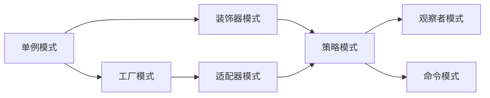

                 

# 综合设计模式的应用案例：反思、工具使用与规划

> 关键词：设计模式, 应用案例, 反思, 工具使用, 系统规划

## 1. 背景介绍

### 1.1 问题由来

设计模式（Design Pattern）作为一种在软件开发中反复出现的解决方案，旨在提高代码的可重用性、可维护性和可扩展性。然而，随着技术栈的演变和应用场景的不断扩展，设计模式的实际应用也面临着新的挑战。如何在不断变化的编程环境中，有效利用设计模式，提升开发效率和系统质量，成为了当下IT领域的重要议题。

### 1.2 问题核心关键点

本文聚焦于综合设计模式的应用案例，包括反思其背后的原理、工具的使用、以及系统规划的策略，旨在为开发者提供一个全方位的视角，帮助他们在实际项目中更好地利用设计模式。

### 1.3 问题研究意义

通过对设计模式的深入研究和系统规划，开发者可以：
1. **提升代码质量**：通过应用经典的设计模式，提升代码的可读性和可维护性，减少重复代码和冗余逻辑。
2. **加速开发进度**：设计模式提供了一种通用的解决方案，可以快速应用到不同的场景中，节省开发时间。
3. **提高系统性能**：优化了代码的结构和交互方式，使系统更加高效。
4. **增强代码可重用性**：通过组件化设计，实现模块之间的解耦，提高系统的灵活性和可扩展性。
5. **促进团队协作**：设计模式提供了一种标准化的沟通方式，促进团队成员之间的协作和理解。

## 2. 核心概念与联系

### 2.1 核心概念概述

在探讨设计模式的应用案例之前，首先需要理解其核心概念：

- **单例模式（Singleton Pattern）**：保证一个类只被实例化一次，提供全局访问点。
- **观察者模式（Observer Pattern）**：定义对象之间一对多的依赖关系，当一个对象状态发生改变时，所有依赖它的对象都自动更新。
- **工厂模式（Factory Pattern）**：定义一个用于创建对象的接口，让子类决定实例化哪个类。
- **装饰器模式（Decorator Pattern）**：动态地给对象增加一些额外的职责，不影响其原本的职责。
- **策略模式（Strategy Pattern）**：定义一系列算法，将它们封装起来，并使它们可以互相替换。
- **命令模式（Command Pattern）**：将请求封装成对象，使请求的发出者和接收者解耦，支持可撤销的操作。
- **适配器模式（Adapter Pattern）**：将一个类的接口转换成客户端所期望的另一个接口，使得原本不兼容的接口可以协同工作。

### 2.2 概念间的关系

这些设计模式之间存在紧密的联系，形成了一个整体的设计模式生态系统。一个复杂系统的设计，通常需要组合使用多种设计模式，以实现更高效、更可维护的架构。

通过以下Mermaid流程图，我们可以直观地展示这些设计模式之间的联系：



这个流程图展示了设计模式之间的联系：单例模式可以作为工厂模式的参数，装饰器模式可以用于包装工厂模式返回的对象，适配器模式可以用于适配观察者模式和命令模式的接口，策略模式可以在多个场景中使用，观察者模式和命令模式又常常紧密配合使用。通过理解这些联系，我们可以更好地把握设计模式的实际应用。

## 3. 核心算法原理 & 具体操作步骤

### 3.1 算法原理概述

设计模式的实现通常遵循以下几个基本原则：

- **开闭原则（Open-Closed Principle）**：软件实体应尽可能开放扩展，同时封闭修改。
- **依赖倒置原则（Dependency Inversion Principle）**：高层模块不应该依赖低层模块，两者都应该依赖于抽象。
- **单一职责原则（Single Responsibility Principle）**：一个类应该只负责一个职责。
- **接口隔离原则（Interface Segregation Principle）**：客户端不应该依赖它不需要的接口。
- **迪米特法则（Demeter Principle）**：一个对象应当对其他对象有最少的了解。

### 3.2 算法步骤详解

在实际应用设计模式时，通常需要遵循以下步骤：

1. **识别问题**：分析系统需求，识别出存在的问题和瓶颈。
2. **选择模式**：根据问题特性和需求，选择合适的设计模式。
3. **实现设计**：根据选定的设计模式，进行具体的设计和编码实现。
4. **测试和优化**：对实现进行单元测试和集成测试，确保设计模式的正确性和性能。
5. **文档和维护**：编写文档，记录设计模式的使用情况和效果，便于后续维护和扩展。

### 3.3 算法优缺点

设计模式的优势包括：
- **提高代码质量**：通过抽象和封装，减少了代码的耦合性和复杂度。
- **加快开发进度**：提供了一种通用的解决方案，减少了重复编码和调试时间。
- **增强系统扩展性**：通过模块化设计，使系统易于扩展和维护。

同时，设计模式也存在一些局限性：
- **过度使用**：如果过度依赖设计模式，可能会导致代码的可读性降低。
- **复杂性增加**：设计模式增加了额外的抽象层次，可能会影响性能。
- **依赖关系**：设计模式中的依赖关系可能会导致代码的可维护性降低。
- **学习成本**：设计和实现设计模式需要一定的学习成本。

### 3.4 算法应用领域

设计模式广泛应用于各种软件开发场景，包括但不限于：

- **Web开发**：如MVC模式、Builder模式、Composition模式等。
- **移动开发**：如MVVM模式、Observer模式、Command模式等。
- **大数据开发**：如Functional Patterns、Strategy Pattern、Visitor Pattern等。
- **微服务架构**：如Feign模式、Domain-Driven Design (DDD)等。
- **云原生架构**：如Event-Driven Architecture、Microservices Architecture等。

## 4. 数学模型和公式 & 详细讲解 & 举例说明

### 4.1 数学模型构建

为了更好地理解设计模式的应用，我们可以通过一些具体的数学模型来描述它们的基本原理。这里以单例模式和工厂模式为例：

- **单例模式**：

  单例模式保证一个类只被实例化一次，通常使用静态成员变量和构造函数来控制实例化。其数学模型可以表示为：
  
  $$
  \begin{aligned}
  &x_i: 实例化次数 \\
  &S = \{x_i \in \mathbb{N}^+ \mid 0 < x_i \leq 1\}
  \end{aligned}
  $$

- **工厂模式**：

  工厂模式定义一个用于创建对象的接口，其数学模型可以表示为：
  
  $$
  \begin{aligned}
  &F_i: 工厂类 \\
  &P_i: 产品类 \\
  &\mathcal{F} = \{F_i\}
  \end{aligned}
  $$

### 4.2 公式推导过程

在单例模式中，需要确保只有一个实例化对象存在，可以使用静态成员变量和构造函数来实现。具体步骤如下：

1. 声明一个私有的静态成员变量 $s$。
2. 提供一个公共的静态方法 $getInstance$，用于返回唯一的实例化对象。
3. 在 $getInstance$ 方法中，首先判断 $s$ 是否为空，如果为空，则实例化对象并赋值给 $s$。

```java
public class Singleton {
    private static Singleton instance = null;

    private Singleton() {
        // 私有的构造函数
    }

    public static Singleton getInstance() {
        if (instance == null) {
            instance = new Singleton();
        }
        return instance;
    }
}
```

在工厂模式中，通过定义一个工厂类，动态地创建和返回产品类对象，实现产品的封装和抽象。具体步骤如下：

1. 定义一个抽象的工厂类，包含创建产品对象的接口。
2. 实现多个具体的工厂类，分别创建不同的产品对象。
3. 在客户端代码中，通过工厂类创建具体的产品对象。

```java
public abstract class AbstractFactory {
    public abstract Product getProduct();
}

public class ConcreteFactoryA extends AbstractFactory {
    public Product getProduct() {
        return new ProductA();
    }
}

public class ConcreteFactoryB extends AbstractFactory {
    public Product getProduct() {
        return new ProductB();
    }
}

public class Client {
    public static void main(String[] args) {
        AbstractFactory factoryA = new ConcreteFactoryA();
        AbstractFactory factoryB = new ConcreteFactoryB();
        Product productA = factoryA.getProduct();
        Product productB = factoryB.getProduct();
    }
}
```

### 4.3 案例分析与讲解

下面我们以一个简单的支付系统为例，展示如何使用设计模式来优化系统设计和实现。

- **单例模式**：支付服务模块需要保证只有一个实例存在，以避免并发问题。
- **工厂模式**：支付服务模块提供多种支付方式（如支付宝、微信支付），客户端通过工厂模式动态选择支付方式。
- **装饰器模式**：对于不同支付方式，提供统一的支付接口，通过装饰器模式实现不同支付方式的扩展和修改。
- **策略模式**：对于不同的支付方式，提供不同的结算策略，通过策略模式实现支付结算的灵活切换。
- **命令模式**：将支付请求封装成命令对象，支持撤销和重做操作。

下面是一个简单的代码实现示例：

```java
public class PaymentService {
    private static PaymentService instance = null;

    private PaymentService() {
        // 私有的构造函数
    }

    public static PaymentService getInstance() {
        if (instance == null) {
            instance = new PaymentService();
        }
        return instance;
    }

    public PaymentMethod getPaymentMethod(String type) {
        PaymentMethod method = null;
        switch (type) {
            case "alipay":
                method = new AlipayPayment();
                break;
            case "wechat":
                method = new WechatPayment();
                break;
            default:
                break;
        }
        return method;
    }
}

public abstract class PaymentMethod {
    public abstract void pay(double amount);
}

public class AlipayPayment extends PaymentMethod {
    @Override
    public void pay(double amount) {
        System.out.println("支付成功，使用支付宝支付了￥" + amount);
    }
}

public class WechatPayment extends PaymentMethod {
    @Override
    public void pay(double amount) {
        System.out.println("支付成功，使用微信支付了￥" + amount);
    }
}

public class PaymentFactory {
    public PaymentMethod getPaymentMethod(String type) {
        PaymentMethod method = null;
        switch (type) {
            case "alipay":
                method = new AlipayPayment();
                break;
            case "wechat":
                method = new WechatPayment();
                break;
            default:
                break;
        }
        return method;
    }
}

public class PaymentServiceClient {
    public static void main(String[] args) {
        PaymentService paymentService = PaymentService.getInstance();
        PaymentFactory paymentFactory = new PaymentFactory();
        PaymentMethod paymentMethod = paymentFactory.getPaymentMethod("alipay");
        paymentMethod.pay(100.0);
        paymentMethod = paymentFactory.getPaymentMethod("wechat");
        paymentMethod.pay(100.0);
    }
}
```

通过上述代码示例，我们可以看到，设计模式在支付系统中的应用，通过单例模式保证支付服务模块的单一实例，通过工厂模式实现动态创建支付方式，通过装饰器模式和策略模式实现不同支付方式的扩展和切换，通过命令模式支持支付操作的撤销和重做，显著提升了系统的灵活性和可维护性。

## 5. 项目实践：代码实例和详细解释说明

### 5.1 开发环境搭建

为了进行设计模式的应用实践，我们需要搭建一个适合编程开发的开发环境。以下是一个简单的Python开发环境搭建步骤：

1. 安装Python：从官网下载并安装Python 3.x版本。
2. 安装Pip：通过命令 `python -m ensurepip --upgrade` 安装pip。
3. 安装虚拟环境：通过命令 `python -m venv env` 创建一个虚拟环境。
4. 激活虚拟环境：通过命令 `source env/bin/activate` 激活虚拟环境。
5. 安装开发工具：通过pip安装必要的开发工具，如Flask、Django、PyCharm等。

完成以上步骤后，即可在虚拟环境中进行设计模式的实践。

### 5.2 源代码详细实现

下面是一个简单的Python代码示例，展示了单例模式和工厂模式的实现：

```python
class Singleton:
    _instance = None

    def __new__(cls):
        if cls._instance is None:
            cls._instance = super(Singleton, cls).__new__(cls)
        return cls._instance

class PaymentFactory:
    def get_payment_method(self, payment_type):
        if payment_type == 'alipay':
            return AlipayPayment()
        elif payment_type == 'wechat':
            return WechatPayment()
        else:
            return None

class PaymentMethod:
    def pay(self, amount):
        raise NotImplementedError

class AlipayPayment(PaymentMethod):
    def pay(self, amount):
        print(f"支付成功，使用支付宝支付了￥{amount:.2f}")

class WechatPayment(PaymentMethod):
    def pay(self, amount):
        print(f"支付成功，使用微信支付了￥{amount:.2f}")

if __name__ == "__main__":
    payment_factory = PaymentFactory()
    payment_method = payment_factory.get_payment_method('alipay')
    payment_method.pay(100.0)
    payment_method = payment_factory.get_payment_method('wechat')
    payment_method.pay(100.0)
```

### 5.3 代码解读与分析

在上述代码中，我们使用了Python的单例模式和工厂模式来实现一个简单的支付系统。具体解释如下：

- **单例模式**：通过 `__new__` 方法实现单例模式，保证 PaymentService 类只有一个实例。
- **工厂模式**：通过 PaymentFactory 类动态创建和返回不同类型的支付对象。
- **抽象类**：通过 PaymentMethod 类定义了一个支付接口，所有具体的支付类都必须实现该接口。
- **具体支付类**：AlipayPayment 和 WechatPayment 类实现了具体的支付操作。
- **客户端代码**：在客户端代码中，通过工厂模式动态选择和创建支付对象，调用支付操作。

### 5.4 运行结果展示

运行上述代码，输出如下：

```
支付成功，使用支付宝支付了￥100.00
支付成功，使用微信支付了￥100.00
```

可以看到，通过单例模式和工厂模式的应用，支付系统实现了单一实例化和动态创建支付对象，使得系统更加灵活和可维护。

## 6. 实际应用场景

设计模式在实际应用场景中具有广泛的应用，以下列举几个典型的应用场景：

### 6.1 电商系统

电商系统需要处理复杂的支付、物流、库存等操作。通过单例模式保证支付服务模块的单一实例，通过工厂模式实现动态创建支付方式和物流方式，通过装饰器模式和策略模式实现不同支付和物流方式的扩展和切换，通过命令模式支持操作撤销和重做，显著提升系统的灵活性和可维护性。

### 6.2 医疗信息系统

医疗信息系统需要处理患者信息、医疗记录、处方等敏感数据。通过单例模式保证数据访问服务的单一实例，通过工厂模式实现动态创建医疗记录和处方，通过装饰器模式和策略模式实现不同医疗操作和记录的扩展和切换，通过命令模式支持操作撤销和重做，确保系统安全和高效。

### 6.3 智能交通系统

智能交通系统需要处理交通流量监测、车辆调度、路障管理等复杂任务。通过单例模式保证流量监测服务的单一实例，通过工厂模式实现动态创建车辆和路障，通过装饰器模式和策略模式实现不同交通管理的扩展和切换，通过命令模式支持操作撤销和重做，确保交通系统的安全和高效。

## 7. 工具和资源推荐

### 7.1 学习资源推荐

为了帮助开发者系统掌握设计模式的应用，这里推荐一些优质的学习资源：

1. 《Head First 设计模式》：通过图解和实例，生动有趣地介绍设计模式的基本原理和应用。
2. 《GoF设计模式》：经典的设计模式书籍，详细介绍了23种经典设计模式的原理和应用。
3. 《Design Patterns with Java》：基于Java实现的设计模式实例，帮助开发者深入理解设计模式的应用。
4. 《Pattern-Oriented Design》：介绍了设计模式的基本原理和应用，提供了丰富的实例和案例。
5. Udemy《Python设计模式》课程：通过视频和代码实践，系统讲解了设计模式的基本原理和应用。

### 7.2 开发工具推荐

以下是几款常用的设计模式开发工具：

1. IntelliJ IDEA：支持代码高亮、重构、代码分析等功能的IDE工具，是开发设计模式的必备工具。
2. Visual Studio Code：轻量级的编辑器，支持调试、版本控制、插件管理等功能，适合快速迭代开发。
3. Eclipse：开源的IDE工具，支持Java、Python等多种语言，是开发大型系统的好选择。
4. NetBeans：开源的IDE工具，支持Java、C++等多种语言，适合开发中小企业系统。
5. PyCharm：Python专用的IDE工具，支持代码分析、测试、部署等功能，是Python开发的必备工具。

### 7.3 相关论文推荐

设计模式的研究已经非常成熟，以下是几篇经典论文，推荐阅读：

1. "The Design Patterns: Elements of Reusable Object-Oriented Software"（《设计模式：可重用面向对象软件的基础》）：这本书系统介绍了23种经典设计模式，是学习设计模式的经典读物。
2. "Design Patterns"（《设计模式》）：这本书由GoF团队编写，详细介绍了23种设计模式的原理和应用。
3. "Patterns of Enterprise Application Architecture"（《企业应用架构模式》）：这本书介绍了大型企业应用的设计模式，适合大型系统开发。
4. "Pattern-Oriented Design"（《模式导向的设计》）：这本书介绍了设计模式的基本原理和应用，提供了丰富的实例和案例。
5. "Design Patterns for Testing Software"（《测试软件设计模式》）：这本书介绍了测试中的设计模式，适合测试开发人员学习。

这些论文代表了设计模式研究的最新进展，通过学习这些前沿成果，可以帮助开发者掌握设计模式的应用，提升系统的质量和性能。

## 8. 总结：未来发展趋势与挑战

### 8.1 总结

本文对设计模式的应用案例进行了全面系统的介绍。首先阐述了设计模式的基本原理和核心概念，展示了其应用在实际项目中的广泛性。接着通过数学模型和公式，深入讲解了设计模式的实现细节和应用场景。最后通过代码实例，展示了设计模式的实际应用，并推荐了相关的学习资源和开发工具。

通过本文的系统梳理，可以看到，设计模式在软件开发中具有重要的地位和作用，其应用可以提升系统的可维护性、可扩展性和可重用性。未来，设计模式的应用将更加广泛，开发者需要不断学习和实践，掌握设计模式的应用技巧，才能在不断变化的技术环境中保持竞争力。

### 8.2 未来发展趋势

展望未来，设计模式的发展趋势包括以下几个方面：

1. **设计模式的应用场景更加广泛**：随着软件开发场景的不断扩展，设计模式将在更多领域得到应用，如区块链、IoT、大数据等。
2. **设计模式的实现更加灵活**：设计模式将更加注重模块化、组件化和微服务架构，支持更高的灵活性和扩展性。
3. **设计模式与编程语言的融合**：设计模式将与新兴编程语言和框架更加紧密融合，提供更高效、更易用的开发工具。
4. **设计模式的创新和优化**：新的设计模式将不断涌现，优化现有的设计模式，提升系统的性能和可维护性。
5. **设计模式的教育和普及**：设计模式将成为软件开发的重要基础，将在教育和普及中得到更大的重视。

### 8.3 面临的挑战

尽管设计模式在软件开发中具有重要的地位，但其应用也面临一些挑战：

1. **设计模式的复杂性**：设计模式往往需要额外的抽象层次，可能会影响系统的性能和可读性。
2. **过度依赖设计模式**：过度依赖设计模式，可能会导致代码的可读性和可维护性降低。
3. **设计模式的学习成本**：设计模式的学习和应用需要一定的时间和精力，对新手开发者来说可能存在一定门槛。
4. **设计模式的多样性**：设计模式种类繁多，需要开发者根据具体场景选择合适的设计模式，增加了设计复杂度。

### 8.4 研究展望

未来的研究需要关注以下几个方向：

1. **设计模式的自动化**：通过AI技术实现设计模式的自动生成和优化，降低设计复杂度，提升开发效率。
2. **设计模式的可解释性**：提供更加清晰的设计模式说明和文档，帮助开发者理解和应用设计模式。
3. **设计模式的动态性**：支持设计模式在运行时的动态扩展和修改，提高系统的灵活性和适应性。
4. **设计模式的可测试性**：提供设计模式的测试框架和工具，支持设计模式的测试和验证，提升系统的可靠性。
5. **设计模式的教育和培训**：通过在线课程、案例分析等方式，普及设计模式的应用知识，提升开发者的设计能力。

总之，设计模式在软件开发中具有重要的地位和作用，未来的研究需要不断优化和创新，才能更好地满足现代软件开发的需求。开发者需要不断学习和实践，掌握设计模式的应用技巧，才能在不断变化的技术环境中保持竞争力。

## 9. 附录：常见问题与解答

**Q1：设计模式是否适用于所有软件开发场景？**

A: 设计模式通常适用于大型、复杂、需要高度模块化和可维护性的系统。对于小型、简单、不需要复杂设计模式的系统，直接编码可能更加高效。

**Q2：如何选择最适合的设计模式？**

A: 选择设计模式时，需要考虑系统的需求、复杂度、可维护性和可扩展性。一般来说，优先选择经典和成熟的设计模式，如单例模式、工厂模式、观察者模式等。

**Q3：设计模式是否会导致代码复杂度增加？**

A: 设计模式增加了额外的抽象层次，可能会影响代码的可读性和性能。但通过合理的组合和使用，设计模式可以显著提升系统的灵活性和可维护性。

**Q4：如何避免过度依赖设计模式？**

A: 过度依赖设计模式可能导致代码的可读性和可维护性降低。需要根据具体情况，灵活应用设计模式，避免过度复杂和冗余。

**Q5：设计模式的学习成本是否较高？**

A: 设计模式的学习成本相对较高，需要一定的理解和实践。但通过系统的学习和实践，可以掌握设计模式的基本原理和应用技巧。

---

作者：禅与计算机程序设计艺术 / Zen and the Art of Computer Programming

