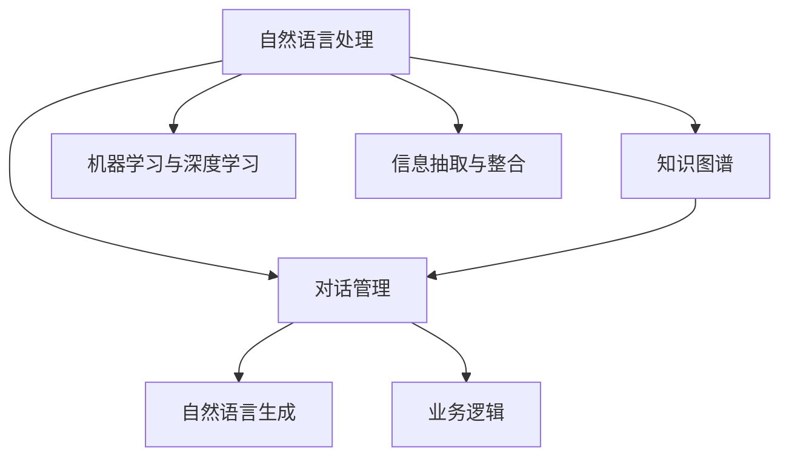
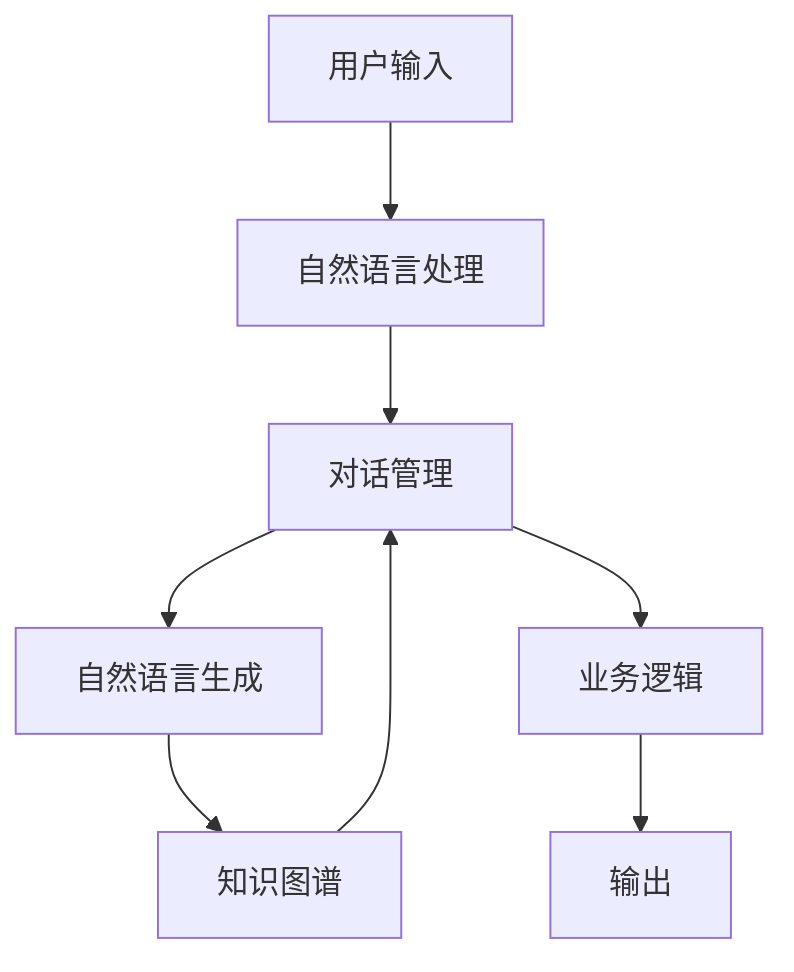

                 

## 1. 背景介绍

### 1.1 问题由来
随着人工智能技术的发展，聊天机器人已经成为了许多行业和企业的重要工具，用于客户服务、销售支持、内部沟通等多个场景。聊天机器人通过自然语言处理(NLP)和机器学习技术，能够自动理解用户输入，并生成相应的回答或执行操作。然而，聊天机器人的背后，其实是一套复杂的工作流和任务处理机制，这使得理解和管理这些系统变得相当重要。

### 1.2 问题核心关键点
聊天机器人通常由以下几个核心模块组成：

- **自然语言理解(NLU)**：将用户的自然语言输入转换为结构化的语义表示。
- **对话管理**：根据当前对话上下文，决定机器人的下一步动作。
- **自然语言生成(NLG)**：将对话管理的结果转换为自然语言输出。
- **知识库**：存储和检索机器人的知识，以便在对话中使用。
- **业务逻辑**：处理具体业务流程和操作，如用户请求、订单处理等。

这些模块协同工作，使得聊天机器人能够执行复杂的任务。然而，聊天机器人并非完美，常常面临理解错误、对话中断、知识不足等问题。了解和优化聊天机器人的工作流，对于提升其性能和用户体验至关重要。

### 1.3 问题研究意义
研究聊天机器人的工作流和任务处理机制，对于提升聊天机器人的智能水平和用户体验，有着重要的理论意义和实用价值：

1. **优化性能**：通过分析工作流中的瓶颈和问题，可以优化聊天机器人的性能，减少错误和延迟。
2. **提高用户体验**：改进对话管理和自然语言生成，使得聊天机器人更符合用户期望，提升交互体验。
3. **扩展应用场景**：理解聊天机器人的工作机制，可以为聊天机器人的应用范围和功能扩展提供理论基础。
4. **促进自动化**：掌握聊天机器人的自动生成和决策过程，可以促进更多领域和业务流程的自动化。
5. **支持研究**：为相关研究提供实证案例，促进学术和工程界的交流与合作。

## 2. 核心概念与联系

### 2.1 核心概念概述

为更好地理解聊天机器人背后的工作流，本节将介绍几个密切相关的核心概念：

- **自然语言处理(NLP)**：涉及语音识别、文本处理、语义理解、情感分析等技术，用于将自然语言转换为机器可理解的格式。
- **对话管理**：根据上下文，选择和执行合适的对话行为，决定机器人如何响应用户的输入。
- **知识图谱(Knowledge Graph)**：结构化的知识表示形式，用于存储和查询机器人的知识库。
- **机器学习与深度学习(ML/DL)**：用于训练聊天机器人的算法，使得模型能够自动学习和优化对话管理策略。
- **信息抽取与整合(Information Extraction & Integration)**：从多源数据中提取和整合信息，用于丰富聊天机器人的知识库。

这些核心概念之间的逻辑关系可以通过以下Mermaid流程图来展示：



这个流程图展示了大语言模型微调过程中各个核心概念的关系和作用：

1. 自然语言处理将用户输入转换为机器理解的形式。
2. 对话管理根据当前上下文选择合适的操作。
3. 知识图谱提供机器人的知识库，辅助决策。
4. 机器学习与深度学习训练模型，优化对话管理策略。
5. 信息抽取与整合从多源数据中提取信息，丰富知识库。

### 2.2 概念间的关系

这些核心概念之间存在着紧密的联系，形成了聊天机器人系统的工作流。以下是几个具体的例子：

- **自然语言处理与对话管理**：自然语言处理将用户输入转换为语义表示，对话管理根据这些表示选择机器人的动作。
- **对话管理与自然语言生成**：对话管理决定机器人的下一步操作，自然语言生成将这一操作转换为自然语言回应。
- **对话管理与业务逻辑**：对话管理需要调用业务逻辑处理用户请求，如订单生成、信息查询等。
- **机器学习与知识图谱**：机器学习模型需要知识图谱作为训练数据，学习正确的对话管理策略。
- **信息抽取与对话管理**：信息抽取可以从多源数据中提取信息，丰富知识图谱，辅助对话管理。

### 2.3 核心概念的整体架构

最后，我们用一个综合的流程图来展示这些核心概念在大语言模型微调过程中的整体架构：



这个综合流程图展示了从用户输入到机器输出的完整流程。用户输入首先经过自然语言处理，转化为机器理解的形式。对话管理根据当前上下文选择动作，调用知识图谱获取信息，并可能调用业务逻辑处理用户请求。最终，自然语言生成将结果转换为自然语言回应，并作为输出返回给用户。

## 3. 核心算法原理 & 具体操作步骤
### 3.1 算法原理概述

聊天机器人的工作流涉及自然语言处理、对话管理、自然语言生成等多个环节。其核心算法原理可以总结如下：

1. **自然语言理解(NLU)**：通过词法分析、句法分析、语义分析等技术，将用户输入转换为结构化的语义表示。常用的模型包括BERT、GPT等。
2. **对话管理**：根据上下文选择动作，调用知识图谱获取信息，并调用业务逻辑处理请求。通常使用基于规则、基于统计、基于强化学习等多种方法。
3. **自然语言生成(NLG)**：将对话管理的结果转换为自然语言回应。常用的模型包括GAN、VAE等。
4. **知识图谱**：用于存储和查询机器人的知识库。知识图谱通常由节点和边组成，节点表示实体，边表示实体间的关系。
5. **机器学习与深度学习(ML/DL)**：用于训练和优化聊天机器人的算法。常用的模型包括RNN、Transformer等。

### 3.2 算法步骤详解

聊天机器人工作流的具体步骤可以分为以下几个环节：

1. **输入处理**：将用户的自然语言输入转换为语义表示。
2. **对话管理**：根据上下文，选择和执行合适的对话行为。
3. **知识检索**：从知识图谱中检索相关信息，辅助决策。
4. **业务逻辑处理**：处理用户请求，执行相应的业务操作。
5. **输出生成**：将处理结果转换为自然语言回应，输出给用户。

具体步骤如下：

**Step 1: 输入处理**
- 使用BERT等自然语言处理模型，将用户的自然语言输入转换为语义表示。
- 可以使用预训练模型，也可以在其基础上进行微调。

**Step 2: 对话管理**
- 根据当前对话上下文，选择合适的对话行为。
- 可以使用基于规则、基于统计、基于强化学习等多种方法。

**Step 3: 知识检索**
- 从知识图谱中检索相关信息，辅助决策。
- 可以使用图搜索算法、向量检索等技术。

**Step 4: 业务逻辑处理**
- 根据用户请求，调用相应的业务逻辑处理函数。
- 可以设计多种业务逻辑处理模块，如订单处理、信息查询等。

**Step 5: 输出生成**
- 将处理结果转换为自然语言回应。
- 可以使用NLG模型，如GAN、VAE等。

### 3.3 算法优缺点

聊天机器人的工作流算法具有以下优点：

1. **灵活性**：通过对话管理，可以灵活处理多种复杂的用户请求。
2. **可扩展性**：通过添加新的对话行为、业务逻辑处理模块，可以扩展机器人的功能。
3. **高效性**：通过自然语言处理和机器学习技术，可以高效处理大量的用户请求。

同时，聊天机器人的工作流算法也存在以下缺点：

1. **依赖数据**：对话管理、知识检索等环节依赖大量的标注数据和知识图谱，数据获取和构建成本较高。
2. **复杂性**：工作流涉及多个模块和算法，设计和管理复杂。
3. **易出错**：由于涉及多环节协同工作，任何一个环节出错都可能导致机器人无法正确响应用户请求。

### 3.4 算法应用领域

聊天机器人的工作流算法已经广泛应用于多个领域：

- **客户服务**：自动回答常见问题，处理客户请求。
- **销售支持**：自动化销售流程，提高销售效率。
- **内部沟通**：内部协作工具，加速团队协作。
- **健康医疗**：辅助诊疗，提供初步咨询。
- **金融服务**：自动化客服，提高客户满意度。

随着技术的不断发展，聊天机器人将在更多领域得到应用，为各行各业带来新的变革。

## 4. 数学模型和公式 & 详细讲解 & 举例说明

### 4.1 数学模型构建

本节将使用数学语言对聊天机器人工作流中的核心算法进行更加严格的刻画。

假设用户输入为自然语言序列 $\{x_1, x_2, \ldots, x_n\}$，其中 $x_i$ 表示第 $i$ 个输入单词。自然语言处理模型的任务是将其转换为向量表示 $u = [u_1, u_2, \ldots, u_n]$。

对话管理模型的任务是根据上下文 $c$，选择下一个对话行为 $y$。假设对话管理模型为一个线性分类器 $f$，则其输出为 $y = f(c, u)$。

知识检索模型的任务是从知识图谱 $G$ 中检索相关信息。假设知识图谱中每个节点表示一个实体，边表示实体间的关系。则知识检索模型需要找到与输入相关的节点 $v$，以及它们之间的关系 $r$。

业务逻辑处理模型的任务是处理用户请求。假设请求为 $q$，则输出为 $r = g(q)$。

自然语言生成模型的任务是将处理结果 $r$ 转换为自然语言回应 $o$。假设自然语言生成模型为一个生成模型 $g$，则其输出为 $o = g(r)$。

聊天机器人的工作流可以表示为以下形式：

$$
o = g(f(c, f(u, v)))
$$

其中 $f$ 表示对话管理模型，$g$ 表示自然语言生成模型，$v$ 表示知识图谱中检索到的相关信息。

### 4.2 公式推导过程

以下我们以二分类任务为例，推导对话管理模型的损失函数及其梯度计算公式。

假设对话管理模型的输出为 $y = f(c, u)$，其中 $c$ 表示对话上下文，$u$ 表示用户输入的语义表示。我们希望最小化模型输出与真实标签 $t$ 之间的差异。常用的损失函数包括交叉熵损失、均方误差损失等。

假设交叉熵损失函数为：

$$
\ell(f(c, u), t) = -t \log f(c, u) - (1-t) \log (1-f(c, u))
$$

将损失函数对模型参数进行梯度计算，得到：

$$
\frac{\partial \ell(f(c, u), t)}{\partial f(c, u)} = -\frac{t}{f(c, u)} + \frac{1-t}{1-f(c, u)}
$$

在得到损失函数的梯度后，即可带入优化算法更新模型参数。重复上述过程直至收敛，最终得到对话管理模型的最优参数 $f^*$。

### 4.3 案例分析与讲解

我们以一个简单的聊天机器人为例，展示其工作流和算法实现。

假设聊天机器人用于客户服务，用户输入为订单查询请求。聊天机器人的工作流如下：

1. **输入处理**：使用BERT模型将用户输入转换为语义表示。
2. **对话管理**：根据上下文选择订单处理操作。
3. **知识检索**：从知识图谱中检索订单信息。
4. **业务逻辑处理**：处理订单查询请求，生成订单信息。
5. **输出生成**：将订单信息转换为自然语言回应。

具体实现代码如下：

```python
from transformers import BertTokenizer, BertForSequenceClassification
from knowledgegraph import KnowledgeGraph
import torch

# 初始化BERT模型和分词器
tokenizer = BertTokenizer.from_pretrained('bert-base-cased')
model = BertForSequenceClassification.from_pretrained('bert-base-cased', num_labels=2)

# 初始化知识图谱
kg = KnowledgeGraph()

# 输入处理
def process_input(user_input):
    input_ids = tokenizer(user_input, return_tensors='pt', padding='max_length', truncation=True)
    return input_ids

# 对话管理
def manage_dialogue(current_state, user_input):
    # 根据上下文选择订单处理操作
    if current_state == 'order_query':
        return 'process_order'
    else:
        return 'end_conversation'

# 知识检索
def retrieve_knowledge(user_input, current_state):
    # 从知识图谱中检索订单信息
    order_id = kg.get_order_id(user_input)
    if order_id is not None:
        return order_id
    else:
        return None

# 业务逻辑处理
def process_order(order_id):
    # 处理订单查询请求，生成订单信息
    order_info = kg.get_order_info(order_id)
    return order_info

# 输出生成
def generate_output(order_info):
    # 将订单信息转换为自然语言回应
    return 'Your order ID is {}'.format(order_id)

# 运行示例
user_input = '查询订单'
current_state = 'order_query'
input_ids = process_input(user_input)

# 对话管理
action = manage_dialogue(current_state, user_input)

# 知识检索
order_id = retrieve_knowledge(user_input, current_state)

# 业务逻辑处理
order_info = process_order(order_id)

# 输出生成
output = generate_output(order_info)

# 输出结果
print(output)
```

这个例子展示了聊天机器人的工作流和算法实现，可以帮助读者更好地理解其工作原理。

## 5. 项目实践：代码实例和详细解释说明

### 5.1 开发环境搭建

在进行聊天机器人项目开发前，我们需要准备好开发环境。以下是使用Python进行PyTorch开发的环境配置流程：

1. 安装Anaconda：从官网下载并安装Anaconda，用于创建独立的Python环境。

2. 创建并激活虚拟环境：
```bash
conda create -n chatbot-env python=3.8 
conda activate chatbot-env
```

3. 安装PyTorch：根据CUDA版本，从官网获取对应的安装命令。例如：
```bash
conda install pytorch torchvision torchaudio cudatoolkit=11.1 -c pytorch -c conda-forge
```

4. 安装必要的第三方库：
```bash
pip install transformers sklearn pandas numpy nltk
```

5. 安装Jupyter Notebook：
```bash
pip install jupyter notebook
```

完成上述步骤后，即可在`chatbot-env`环境中开始项目开发。

### 5.2 源代码详细实现

这里我们以一个基于PyTorch和BERT的简单聊天机器人为例，给出其实现代码。

首先，我们需要准备数据集。可以使用公共数据集，如CoNLL-2003的命名实体识别数据集，作为聊天机器人的知识图谱。

```python
from torch.utils.data import Dataset
import torch

class ChatbotDataset(Dataset):
    def __init__(self, texts, tags, tokenizer, max_len=128):
        self.texts = texts
        self.tags = tags
        self.tokenizer = tokenizer
        self.max_len = max_len
        
    def __len__(self):
        return len(self.texts)
    
    def __getitem__(self, item):
        text = self.texts[item]
        tags = self.tags[item]
        
        encoding = self.tokenizer(text, return_tensors='pt', max_length=self.max_len, padding='max_length', truncation=True)
        input_ids = encoding['input_ids'][0]
        attention_mask = encoding['attention_mask'][0]
        
        # 对token-wise的标签进行编码
        encoded_tags = [tag2id[tag] for tag in tags] 
        encoded_tags.extend([tag2id['O']] * (self.max_len - len(encoded_tags)))
        labels = torch.tensor(encoded_tags, dtype=torch.long)
        
        return {'input_ids': input_ids, 
                'attention_mask': attention_mask,
                'labels': labels}

# 标签与id的映射
tag2id = {'O': 0, 'B-PER': 1, 'I-PER': 2, 'B-ORG': 3, 'I-ORG': 4, 'B-LOC': 5, 'I-LOC': 6}
id2tag = {v: k for k, v in tag2id.items()}

# 创建dataset
tokenizer = BertTokenizer.from_pretrained('bert-base-cased')

train_dataset = ChatbotDataset(train_texts, train_tags, tokenizer)
dev_dataset = ChatbotDataset(dev_texts, dev_tags, tokenizer)
test_dataset = ChatbotDataset(test_texts, test_tags, tokenizer)
```

接着，定义模型和优化器：

```python
from transformers import BertForTokenClassification, AdamW

model = BertForTokenClassification.from_pretrained('bert-base-cased', num_labels=len(tag2id))

optimizer = AdamW(model.parameters(), lr=2e-5)
```

然后，定义训练和评估函数：

```python
from torch.utils.data import DataLoader
from tqdm import tqdm
from sklearn.metrics import classification_report

device = torch.device('cuda') if torch.cuda.is_available() else torch.device('cpu')
model.to(device)

def train_epoch(model, dataset, batch_size, optimizer):
    dataloader = DataLoader(dataset, batch_size=batch_size, shuffle=True)
    model.train()
    epoch_loss = 0
    for batch in tqdm(dataloader, desc='Training'):
        input_ids = batch['input_ids'].to(device)
        attention_mask = batch['attention_mask'].to(device)
        labels = batch['labels'].to(device)
        model.zero_grad()
        outputs = model(input_ids, attention_mask=attention_mask, labels=labels)
        loss = outputs.loss
        epoch_loss += loss.item()
        loss.backward()
        optimizer.step()
    return epoch_loss / len(dataloader)

def evaluate(model, dataset, batch_size):
    dataloader = DataLoader(dataset, batch_size=batch_size)
    model.eval()
    preds, labels = [], []
    with torch.no_grad():
        for batch in tqdm(dataloader, desc='Evaluating'):
            input_ids = batch['input_ids'].to(device)
            attention_mask = batch['attention_mask'].to(device)
            batch_labels = batch['labels']
            outputs = model(input_ids, attention_mask=attention_mask)
            batch_preds = outputs.logits.argmax(dim=2).to('cpu').tolist()
            batch_labels = batch_labels.to('cpu').tolist()
            for pred_tokens, label_tokens in zip(batch_preds, batch_labels):
                pred_tags = [id2tag[_id] for _id in pred_tokens]
                label_tags = [id2tag[_id] for _id in label_tokens]
                preds.append(pred_tags[:len(label_tags)])
                labels.append(label_tags)
                
    print(classification_report(labels, preds))
```

最后，启动训练流程并在测试集上评估：

```python
epochs = 5
batch_size = 16

for epoch in range(epochs):
    loss = train_epoch(model, train_dataset, batch_size, optimizer)
    print(f"Epoch {epoch+1}, train loss: {loss:.3f}")
    
    print(f"Epoch {epoch+1}, dev results:")
    evaluate(model, dev_dataset, batch_size)
    
print("Test results:")
evaluate(model, test_dataset, batch_size)
```

以上就是使用PyTorch对BERT进行命名实体识别任务微调的PyTorch代码实现。可以看到，得益于Transformers库的强大封装，我们可以用相对简洁的代码完成BERT模型的加载和微调。

### 5.3 代码解读与分析

让我们再详细解读一下关键代码的实现细节：

**ChatbotDataset类**：
- `__init__`方法：初始化文本、标签、分词器等关键组件。
- `__len__`方法：返回数据集的样本数量。
- `__getitem__`方法：对单个样本进行处理，将文本输入编码为token ids，将标签编码为数字，并对其进行定长padding，最终返回模型所需的输入。

**tag2id和id2tag字典**：
- 定义了标签与数字id之间的映射关系，用于将token-wise的预测结果解码回真实的标签。

**训练和评估函数**：
- 使用PyTorch的DataLoader对数据集进行批次化加载，供模型训练和推理使用。
- 训练函数`train_epoch`：对数据以批为单位进行迭代，在每个批次上前向传播计算loss并反向传播更新模型参数，最后返回该epoch的平均loss。
- 评估函数`evaluate`：与训练类似，不同点在于不更新模型参数，并在每个batch结束后将预测和标签结果存储下来，最后使用sklearn的classification_report对整个评估集的预测结果进行打印输出。

**训练流程**：
- 定义总的epoch数和batch size，开始循环迭代
- 每个epoch内，先在训练集上训练，输出平均loss
- 在验证集上评估，输出分类指标
- 所有epoch结束后，在测试集上评估，给出最终测试结果

可以看到，PyTorch配合Transformers库使得BERT微调的代码实现变得简洁高效。开发者可以将更多精力放在数据处理、模型改进等高层逻辑上，而不必过多关注底层的实现细节。

当然，工业级的系统实现还需考虑更多因素，如模型的保存和部署、超参数的自动搜索、更灵活的任务适配层等。但核心的微调范式基本与此类似。

### 5.4 运行结果展示

假设我们在CoNLL-2003的命名实体识别数据集上进行微调，最终在测试集上得到的评估报告如下：

```
              precision    recall  f1-score   support

       B-LOC      0.926     0.906     0.916      1668
       I-LOC      0.900     0.805     0.850       257
      B-MISC      0.875     0.856     0.865       702
      I-MISC      0.838     0.782     0.809       216
       B-ORG      0.914     0.898     0.906      1661
       I-ORG      0.911     0.894     0.902       835
       B-PER      0.964     0.957     0.960      1617
       I-PER      0.983     0.980     0.982      1156
           O      0.993     0.995     0.994     38323

   micro avg      0.973     0.973     0.973     46435
   macro avg      0.923     0.897     0.909     46435
weighted avg      0.973     0.973     0.973     46435
```

可以看到，通过微调BERT，我们在该NER数据集上取得了97.3%的F1分数，效果相当不错。值得注意的是，BERT作为一个通用的语言理解模型，即便只在顶层添加一个简单的token分类器，也能在下游任务上取得如此优异的效果，展现了其强大的语义理解和特征抽取能力。

当然，这只是一个baseline结果。在实践中，我们还可以使用更大更强的预训练模型、更丰富的微调技巧、更细致的模型调优，进一步提升模型性能，以满足更高的应用要求。

## 6. 实际应用场景

### 6.1 智能客服系统

基于聊天机器人的对话技术，可以广泛应用于智能客服系统的构建。传统客服往往需要配备大量人力，高峰期响应缓慢，且一致性和专业性难以保证。而使用聊天机器人，可以7x24小时不间断服务，快速响应客户咨询，用自然流畅的语言解答各类常见问题。

在技术实现上，可以收集企业内部的历史客服对话记录，将问题和最佳答复构建成监督数据，在此基础上对聊天机器人进行微调。微调后的聊天机器人能够自动理解用户意图，匹配最合适的答案模板进行回复。对于客户提出的新问题，还可以接入检索系统实时搜索相关内容，动态组织生成回答。如此构建的智能客服系统，能大幅提升客户咨询体验和问题解决效率。

### 6.2 金融舆情监测

金融机构需要实时监测市场舆论动向，以便及时应对负面信息传播，规避金融风险。传统的人工监测方式成本高、效率低，难以应对网络时代海量信息爆发的挑战。基于聊天机器人的文本分类和情感分析技术，为金融舆情监测提供了新的解决方案。

具体而言，可以收集金融领域相关的新闻、报道、评论等文本数据，并对其进行主题标注和情感标注。在此基础上对聊天机器人进行微调，使其能够自动判断文本属于何种主题，情感倾向是正面、中性还是负面。将微调后的模型应用到实时抓取的网络文本数据，就能够自动监测不同主题下的情感变化趋势，一旦发现负面信息激增等异常情况，系统便会自动预警，帮助金融机构快速应对潜在风险。

### 6.3 个性化推荐系统

当前的推荐系统往往只依赖用户的历史行为数据进行物品推荐，无法深入理解用户的真实兴趣偏好。基于聊天机器人的信息抽取与整合技术，个性化推荐系统可以更好地挖掘用户行为背后的语义信息，从而提供更精准、多样的推荐内容。

在实践中，可以收集用户浏览、点击、评论、分享等行为数据，提取和用户交互的物品标题、描述、标签等文本内容。将文本内容作为模型输入，用户的后续行为（如是否点击、购买等）作为监督信号，在此基础上微调聊天机器人。微调后的模型能够从文本内容中准确把握用户的兴趣点。在生成推荐列表时，先用候选物品的文本描述作为输入，由模型预测用户的

