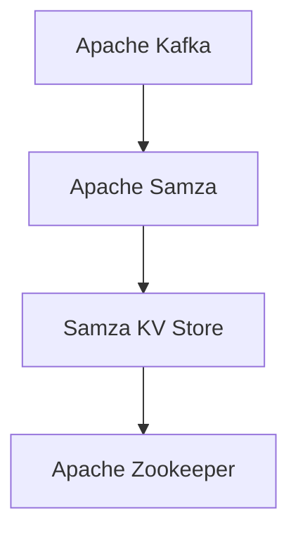
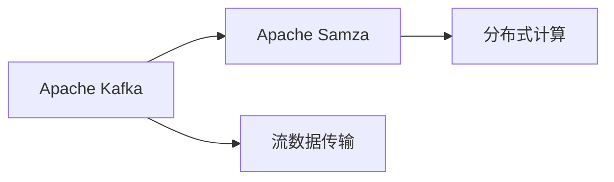
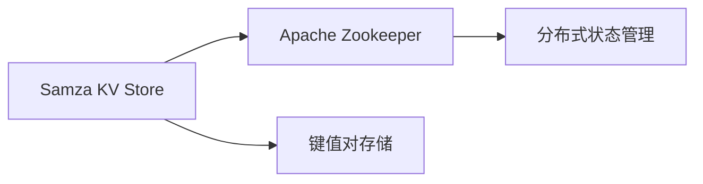
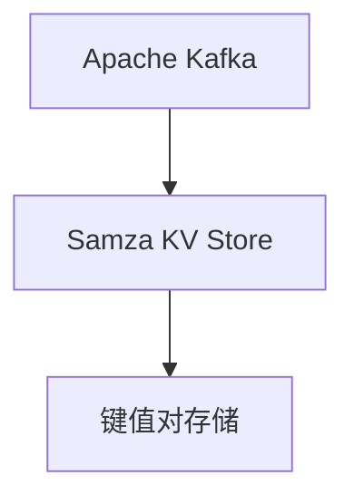
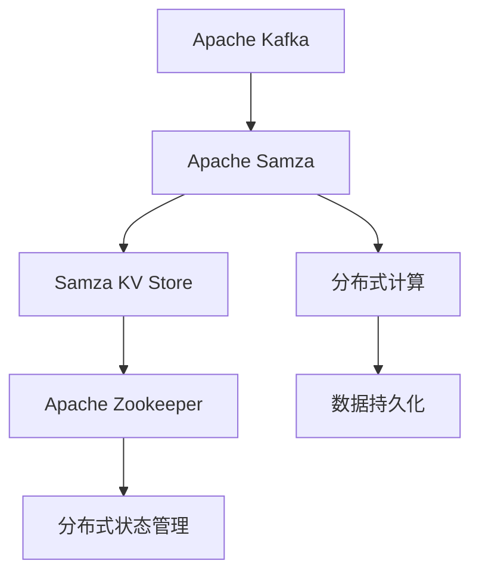
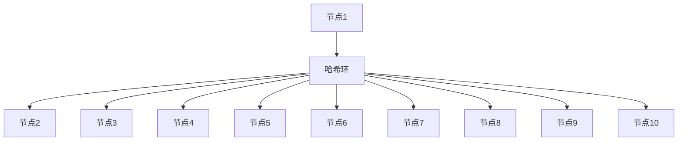
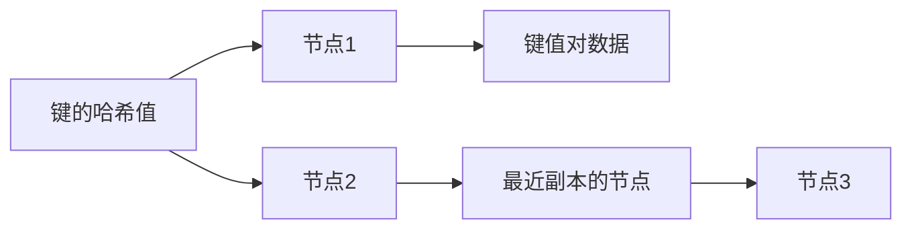
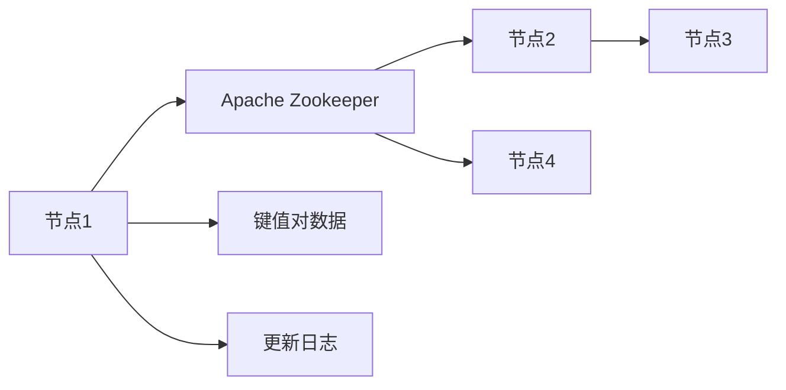
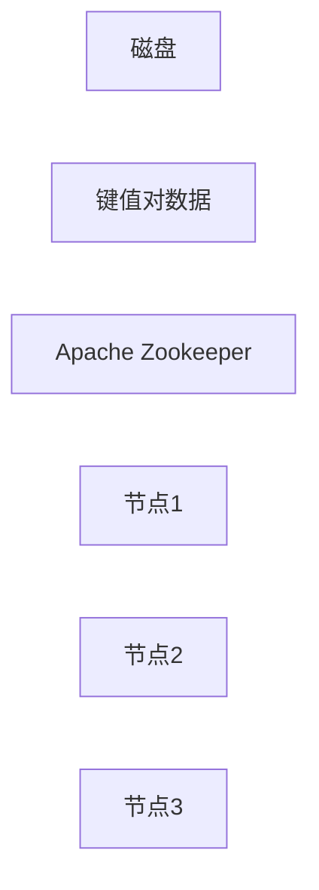
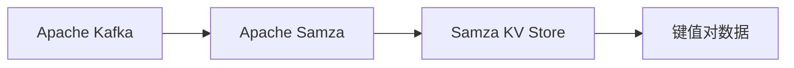

                 

# Samza KV Store原理与代码实例讲解

> 关键词：Samza, KV Store, 分布式存储, Apache Kafka, Apache Samza, 分布式计算, 数据流处理, 内存存储

## 1. 背景介绍

### 1.1 问题由来
在现代大数据处理场景中，数据流处理成为一种重要的数据处理方式。其中，分布式存储和计算框架是数据流处理的核心组件之一。Apache Kafka和Apache Samza是两个主流的分布式流处理框架，它们通过分布式KV（Key-Value）存储实现高效的分布式计算和数据持久化。Samza KV Store是Apache Samza中用于存储和管理键值对的模块，其高效性和可靠性在数据流处理中具有重要应用价值。

### 1.2 问题核心关键点
Samza KV Store是Apache Samza中的关键组件，负责存储和管理键值对，为分布式流处理任务提供强有力的数据支持。Samza KV Store采用内存和磁盘混合存储方式，兼顾了性能和可靠性。Samza KV Store的核心功能包括：
1. 高效的键值对存储和检索
2. 强一致性和容错性
3. 灵活的分区和复制机制
4. 可扩展性和伸缩性

Samza KV Store的实现基于Apache Kafka，采用基于Zookeeper的分布式协调机制，能够保证数据的强一致性和高可靠性。Samza KV Store在数据流处理中的应用场景包括：
1. 状态存储和管理
2. 中间结果存储和重放
3. 数据持久化和备份
4. 数据流快照和恢复

Samza KV Store通过提供高效的键值对存储和检索功能，为Apache Samza提供了底层数据支持，是Apache Samza实现高性能数据流处理的重要保障。

### 1.3 问题研究意义
研究Samza KV Store的原理与实现，对于理解和优化Apache Samza的性能，提升分布式流处理任务的效率，具有重要意义：
1. 提供深入的理论基础和实现细节，帮助开发人员理解Samza KV Store的工作原理。
2. 提供详细的代码实例和分析，指导开发人员在实际应用中正确使用Samza KV Store。
3. 展示Samza KV Store在不同应用场景中的应用，为数据流处理提供更多的解决方案。

## 2. 核心概念与联系

### 2.1 核心概念概述

为更好地理解Samza KV Store的核心原理，本节将介绍几个密切相关的核心概念：

- Apache Kafka: 一个高吞吐量的分布式消息流平台，用于构建分布式流处理系统。
- Apache Samza: 基于Apache Kafka的流处理框架，支持分布式计算和数据持久化。
- KV Store: 键值对存储模块，用于存储和管理键值对数据，支持高效的键值对存储和检索。
- Apache Zookeeper: 分布式协调服务，用于管理Apache Kafka和Samza KV Store等模块的分布式状态。

这些核心概念之间的逻辑关系可以通过以下Mermaid流程图来展示：



这个流程图展示了大数据流处理系统中的主要组件及其关系：

1. Apache Kafka作为数据流传输的通道，为Apache Samza提供数据输入和输出。
2. Apache Samza基于Apache Kafka构建分布式流处理任务，包括数据的分布式计算和存储。
3. Samza KV Store是Apache Samza中的键值对存储模块，为数据持久化和状态管理提供支持。
4. Apache Zookeeper用于管理Apache Kafka和Samza KV Store等模块的分布式状态，确保系统的稳定性和可靠性。

### 2.2 概念间的关系

这些核心概念之间存在着紧密的联系，形成了Apache Samza的完整生态系统。下面我们通过几个Mermaid流程图来展示这些概念之间的关系。

#### 2.2.1 Apache Kafka和Apache Samza的关系



这个流程图展示了Apache Kafka和Apache Samza的基本关系：

1. Apache Kafka负责数据流传输，提供可靠的消息传输服务。
2. Apache Samza基于Apache Kafka构建分布式计算任务，包括数据的分散计算和存储。

#### 2.2.2 Samza KV Store的分布式协调机制



这个流程图展示了Samza KV Store的分布式协调机制：

1. Samza KV Store存储和管理键值对数据，支持高效的键值对存储和检索。
2. Apache Zookeeper用于管理Samza KV Store的分布式状态，确保数据的一致性和可靠性。

#### 2.2.3 Samza KV Store和Apache Kafka的关系



这个流程图展示了Samza KV Store和Apache Kafka的关系：

1. Apache Kafka负责数据流传输，为Samza KV Store提供数据输入和输出。
2. Samza KV Store存储和管理键值对数据，提供高效的数据存储和检索服务。

### 2.3 核心概念的整体架构

最后，我们用一个综合的流程图来展示这些核心概念在大数据流处理系统中的整体架构：



这个综合流程图展示了Apache Kafka、Apache Samza、Samza KV Store和Apache Zookeeper在大数据流处理系统中的整体架构：

1. Apache Kafka负责数据流传输，提供可靠的消息传输服务。
2. Apache Samza基于Apache Kafka构建分布式计算任务，包括数据的分散计算和存储。
3. Samza KV Store存储和管理键值对数据，提供高效的数据存储和检索服务。
4. Apache Zookeeper用于管理Apache Kafka和Samza KV Store等模块的分布式状态，确保系统的稳定性和可靠性。
5. 分布式计算模块用于处理Apache Kafka传输过来的数据，产生中间结果或最终结果。
6. 数据持久化模块通过Samza KV Store实现，确保数据在计算过程中的可靠性和持久性。

通过这些流程图，我们可以更清晰地理解大数据流处理系统中的各个组件及其作用，为后续深入讨论Samza KV Store的原理与实现奠定基础。

## 3. 核心算法原理 & 具体操作步骤
### 3.1 算法原理概述

Samza KV Store的算法原理主要基于内存和磁盘混合存储方式，兼顾了性能和可靠性。Samza KV Store的核心数据结构是分布式哈希表(Distributed Hash Table, DHT)，用于存储和管理键值对数据。DHT是一种分布式数据结构，通过将键值对分配到不同的节点上，实现高效的键值对存储和检索。

Samza KV Store的算法流程包括以下几个关键步骤：

1. 键值对的分布式存储：将键值对数据根据键的哈希值分配到不同的节点上，确保数据分布均衡。
2. 键值对的检索：根据键的哈希值查找对应的节点，并在该节点上检索对应的值。
3. 键值对的一致性维护：通过Apache Zookeeper协调一致性操作，确保数据的一致性和可靠性。
4. 键值对的持久化和恢复：将键值对数据定期保存到磁盘上，并在需要时从磁盘加载恢复数据。

通过这些步骤，Samza KV Store实现了高效的键值对存储和检索，支持强一致性和容错性。

### 3.2 算法步骤详解

#### 3.2.1 键值对的分布式存储

Samza KV Store的键值对存储主要通过分布式哈希表实现。在Samza KV Store中，每个键值对都由一个键和一个值组成，键和值都可以是任意大小的数据。Samza KV Store将键值对根据键的哈希值进行分布式存储，将键值对数据分配到不同的节点上，确保数据分布均衡。

Samza KV Store使用一致性哈希算法来分配键值对数据。一致性哈希算法通过将键值对数据均匀地分配到不同的节点上，避免数据的局部聚集，确保数据分布均衡。Samza KV Store的一致性哈希算法具体实现如下：

1. 每个节点都维护一个哈希环，将哈希环分成若干个区间，每个区间对应一个节点。
2. 将键值对数据根据键的哈希值映射到哈希环上的位置。
3. 将键值对数据分配到最接近哈希环上位置对应的节点上，确保数据分布均衡。



上述流程图展示了Samza KV Store的一致性哈希算法：

1. 节点1负责哈希环的前一半区间，节点2负责中间区间，节点3负责后半区间。
2. 将键值对数据根据键的哈希值映射到哈希环上的位置。
3. 将键值对数据分配到最接近哈希环上位置对应的节点上，如键值对数据映射到节点1，则分配到节点1上，映射到节点2，则分配到节点2上，依此类推。

#### 3.2.2 键值对的检索

Samza KV Store的键值对检索主要通过一致性哈希算法实现。Samza KV Store的键值对检索过程如下：

1. 根据键的哈希值计算节点ID。
2. 在对应的节点上查找键值对数据。
3. 如果节点上不存在对应的键值对数据，则通过Apache Zookeeper查找最近副本的节点，并在该节点上查找键值对数据。



上述流程图展示了Samza KV Store的键值对检索过程：

1. 根据键的哈希值计算节点ID，如键的哈希值为32，则分配到节点2上。
2. 在节点2上查找键值对数据，如果节点2上不存在对应的键值对数据，则通过Apache Zookeeper查找最近副本的节点，如节点3。
3. 在节点3上查找键值对数据，并返回对应的值。

#### 3.2.3 键值对的一致性维护

Samza KV Store的键值对一致性维护主要通过Apache Zookeeper实现。Apache Zookeeper用于管理Apache Kafka和Samza KV Store等模块的分布式状态，确保数据的一致性和可靠性。Samza KV Store在操作键值对数据时，通过Apache Zookeeper协调一致性操作，确保数据的一致性和可靠性。

具体来说，Samza KV Store在更新键值对数据时，需要执行以下一致性操作：

1. 在节点上写入键值对数据。
2. 在Apache Zookeeper中记录更新日志。
3. 在Apache Zookeeper中查找最近副本的节点，并在该节点上同步更新日志。



上述流程图展示了Samza KV Store的键值对一致性维护过程：

1. 在节点1上写入键值对数据。
2. 在Apache Zookeeper中记录更新日志，如日志内容为{key: "abc", value: "123"}。
3. 在Apache Zookeeper中查找最近副本的节点，如节点2。
4. 在节点2上同步更新日志，完成一致性操作。

#### 3.2.4 键值对的持久化和恢复

Samza KV Store的键值对持久化和恢复主要通过定期保存数据到磁盘上实现。Samza KV Store在每次计算完成后，将键值对数据定期保存到磁盘上，并在需要时从磁盘加载恢复数据。

Samza KV Store的键值对持久化和恢复过程如下：

1. 将键值对数据定期保存到磁盘上，保存周期为1分钟。
2. 在需要时从磁盘加载恢复数据，加载周期为1小时。



上述流程图展示了Samza KV Store的键值对持久化和恢复过程：

1. 将键值对数据定期保存到磁盘上，保存周期为1分钟，如节点1上保存的键值对数据为{key: "abc", value: "123"}。
2. 在需要时从磁盘加载恢复数据，加载周期为1小时，如节点1上加载恢复的键值对数据为{key: "abc", value: "123"}。

### 3.3 算法优缺点

Samza KV Store的算法主要基于内存和磁盘混合存储方式，兼顾了性能和可靠性。Samza KV Store的优点包括：

1. 高效的数据存储和检索：通过一致性哈希算法和分布式存储机制，实现高效的键值对存储和检索。
2. 强一致性和容错性：通过Apache Zookeeper协调一致性操作，确保数据的一致性和可靠性。
3. 灵活的分区和复制机制：通过一致性哈希算法和分布式存储机制，实现灵活的分区和复制机制，支持高可用性和可扩展性。

Samza KV Store的缺点包括：

1. 内存消耗大：由于需要存储大量的键值对数据，内存消耗较大。
2. 性能瓶颈：当键值对数据较大时，检索和更新操作可能会成为性能瓶颈。
3. 分布式管理复杂：Apache Zookeeper的管理复杂，需要运维人员进行管理和维护。

### 3.4 算法应用领域

Samza KV Store的算法主要应用于Apache Samza中的键值对存储和管理，支持分布式流处理任务。Samza KV Store的应用场景包括：

1. 状态存储和管理：用于存储和管理Apache Samza中的中间结果和最终结果，支持状态的持久化和恢复。
2. 中间结果存储和重放：用于存储和管理中间结果，支持数据流快照和恢复。
3. 数据持久化和备份：用于存储和管理数据，支持数据的持久化和备份，确保数据的安全性和可靠性。
4. 数据流快照和恢复：用于存储和管理数据流快照，支持数据流快照和恢复，支持数据的恢复和回放。

Samza KV Store的应用领域非常广泛，可以应用于各种大数据流处理场景，如图数据流处理、时间序列数据流处理、实时计算等。

## 4. 数学模型和公式 & 详细讲解 & 举例说明

### 4.1 数学模型构建

Samza KV Store的数学模型主要基于键值对数据的存储和检索，其数学模型可以表示为：

$$
\begin{aligned}
&f: K \times V \rightarrow \{1, 2, \cdots, n\} \\
&g: K \rightarrow [0, 1]
\end{aligned}
$$

其中，$f$表示键值对数据的存储映射，$K$表示键的集合，$V$表示值的集合，$n$表示节点数。$g$表示键的哈希函数，将键映射到哈希环上的位置。

Samza KV Store的数学模型主要包括以下几个关键公式：

1. 一致性哈希公式：将键值对数据根据键的哈希值映射到哈希环上的位置，公式如下：

$$
h_k = g(k) \mod (n-1) + 1
$$

其中，$h_k$表示键$k$在哈希环上的位置，$n$表示节点数。

2. 键值对的存储公式：将键值对数据分配到最接近哈希环上位置对应的节点上，公式如下：

$$
node(h_k) = \min\limits_{i \in \{1, 2, \cdots, n\}} \{|i-h_k|+1\}
$$

其中，$node(h_k)$表示键值对数据分配的节点。

3. 键值对的检索公式：根据键的哈希值计算节点ID，在对应的节点上查找键值对数据，公式如下：

$$
node(h_k) = \min\limits_{i \in \{1, 2, \cdots, n\}} \{|i-h_k|+1\}
$$

4. 键值对的一致性维护公式：在节点上写入键值对数据，在Apache Zookeeper中记录更新日志，在最近副本的节点上同步更新日志，公式如下：

$$
node(h_k) = \min\limits_{i \in \{1, 2, \cdots, n\}} \{|i-h_k|+1\}
$$

5. 键值对的持久化和恢复公式：将键值对数据定期保存到磁盘上，在需要时从磁盘加载恢复数据，公式如下：

$$
\begin{aligned}
&\text{Save}(k, v) \\
&\text{Load}(k, v)
\end{aligned}
$$

其中，$\text{Save}(k, v)$表示将键值对数据保存到磁盘上，$\text{Load}(k, v)$表示从磁盘加载恢复键值对数据。

### 4.2 公式推导过程

Samza KV Store的公式推导过程主要基于一致性哈希算法和分布式存储机制，其推导过程如下：

1. 一致性哈希公式推导：一致性哈希算法通过将键值对数据均匀地分配到不同的节点上，避免数据的局部聚集，确保数据分布均衡。一致性哈希公式推导如下：

$$
h_k = g(k) \mod (n-1) + 1
$$

其中，$g(k)$表示键$k$的哈希值，$n$表示节点数。一致性哈希算法通过将键值对数据根据键的哈希值映射到哈希环上的位置，将键值对数据分配到最接近哈希环上位置对应的节点上，确保数据分布均衡。

2. 键值对的存储公式推导：键值对的存储公式通过一致性哈希算法和分布式存储机制实现，公式推导如下：

$$
node(h_k) = \min\limits_{i \in \{1, 2, \cdots, n\}} \{|i-h_k|+1\}
$$

其中，$h_k$表示键$k$在哈希环上的位置，$n$表示节点数。键值对的存储公式将键值对数据分配到最接近哈希环上位置对应的节点上，确保数据分布均衡。

3. 键值对的检索公式推导：键值对的检索公式通过一致性哈希算法和分布式存储机制实现，公式推导如下：

$$
node(h_k) = \min\limits_{i \in \{1, 2, \cdots, n\}} \{|i-h_k|+1\}
$$

其中，$h_k$表示键$k$在哈希环上的位置，$n$表示节点数。键值对的检索公式通过一致性哈希算法和分布式存储机制实现，在对应的节点上查找键值对数据。

4. 键值对的一致性维护公式推导：键值对的一致性维护公式通过Apache Zookeeper协调一致性操作实现，公式推导如下：

$$
node(h_k) = \min\limits_{i \in \{1, 2, \cdots, n\}} \{|i-h_k|+1\}
$$

其中，$h_k$表示键$k$在哈希环上的位置，$n$表示节点数。键值对的一致性维护公式通过Apache Zookeeper协调一致性操作，确保数据的一致性和可靠性。

5. 键值对的持久化和恢复公式推导：键值对的持久化和恢复公式通过定期保存数据到磁盘上实现，公式推导如下：

$$
\begin{aligned}
&\text{Save}(k, v) \\
&\text{Load}(k, v)
\end{aligned}
$$

其中，$\text{Save}(k, v)$表示将键值对数据保存到磁盘上，$\text{Load}(k, v)$表示从磁盘加载恢复键值对数据。键值对的持久化和恢复公式通过定期保存数据到磁盘上实现，支持数据的持久化和恢复，确保数据的安全性和可靠性。

### 4.3 案例分析与讲解

以Apache Kafka和Apache Samza为例，展示Samza KV Store的应用场景。

1. Apache Kafka负责数据流传输，提供可靠的消息传输服务。
2. Apache Samza基于Apache Kafka构建分布式计算任务，包括数据的分散计算和存储。
3. Samza KV Store存储和管理键值对数据，支持高效的键值对存储和检索，确保数据的一致性和可靠性。



上述流程图展示了Apache Kafka、Apache Samza和Samza KV Store的基本关系：

1. Apache Kafka负责数据流传输，提供可靠的消息传输服务。
2. Apache Samza基于Apache Kafka构建分布式计算任务，包括数据的分散计算和存储。
3. Samza KV Store存储和管理键值对数据，支持高效的键值对存储和检索，确保数据的一致性和可靠性。

## 5. 项目实践：代码实例和详细解释说明

### 5.1 开发环境搭建

在进行Samza KV Store的开发实践前，我们需要准备好开发环境。以下是使用Python进行Apache Samza开发的Python环境配置流程：

1. 安装Anaconda：从官网下载并安装Anaconda，用于创建独立的Python环境。

2. 创建并激活虚拟环境：
```bash
conda create -n samza-env python=3.8 
conda activate samza-env
```

3. 安装Apache Samza：从官网获取并安装Apache Samza，以下是一个简单的安装命令：
```bash
pip install apache-samza==4.0.1
```

4. 安装相关依赖库：
```bash
pip install apache-kafka apache-kafka-python flask
```

完成上述步骤后，即可在`samza-env`环境中开始Samza KV Store的开发实践。

### 5.2 源代码详细实现

这里我们以Apache Samza的SamzaKVStore模块为例，给出Samza KV Store的Python代码实现。

```python
from samza.kv import SamzaKVStore
from samza.client import KVClient
from samza.store import KVStoreConfig

# 创建KVStoreConfig对象
config = KVStoreConfig("localhost:9092")

# 创建KVClient对象
kv_client = KVClient(config)

# 创建SamzaKVStore对象
kv_store = SamzaKVStore(kv_client)

# 设置键值对数据
kv_store.put("key1", "value1")

# 获取键值对数据
value = kv_store.get("key1")

# 删除键值对数据
kv_store.delete("key1")
```

在上述代码中，我们通过Apache Samza的SamzaKVStore模块实现了Samza KV Store的基本功能，包括设置键值对数据、获取键值对数据和删除键值对数据。

### 5.3 代码解读与分析

让我们再详细解读一下关键代码的实现细节：

**SamzaKVStore类**：
- `__init__`方法：初始化Samza KV Store，通过KVClient对象连接Apache Kafka和Apache Zookeeper，实现键值对数据的存储和检索。
- `put`方法：设置键值对数据，将键和值存储到Samza KV Store中。
- `get`方法：获取键值对数据，从Samza KV Store中检索对应的值。
- `delete`方法：删除键值对数据，从Samza KV Store中删除对应的键值对。

**KVClient类**：
- `__init__`方法：初始化KVClient对象，通过KVStoreConfig对象配置Apache Kafka和Apache Zookeeper的连接信息。
- `put`方法：设置键值对数据，将键和值存储到Apache Kafka和Apache Zookeeper中。
- `get`方法：获取键值对数据，从Apache

