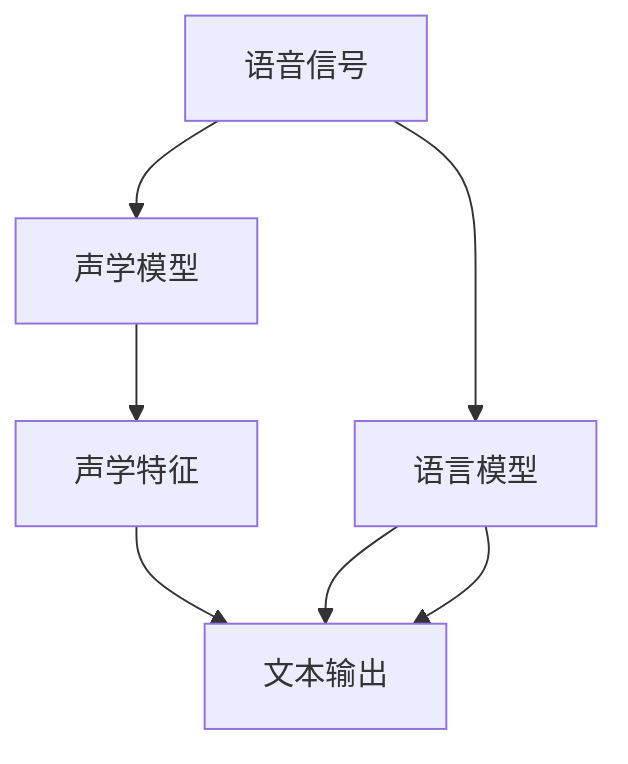
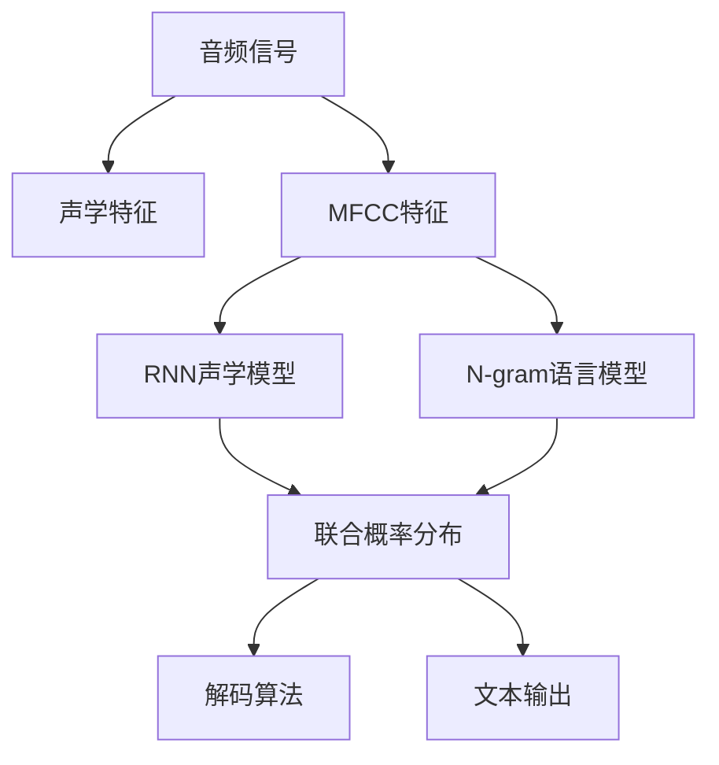

                 

# Speech Recognition原理与代码实例讲解

> 关键词：语音识别,自动语音识别,声学模型,语言模型,深度学习,端到端,神经网络,CTC损失函数,代码实现

## 1. 背景介绍

### 1.1 问题由来
语音识别技术，简称为语音识别（Speech Recognition）或自动语音识别（ASR，Automatic Speech Recognition），是计算机科学和工程中的一种技术，其目标是将人类语音转换为文本形式。随着深度学习技术的发展，尤其是卷积神经网络（CNN）和循环神经网络（RNN）等架构的引入，语音识别技术已经取得了显著的进步，并广泛应用于语音助手、智能家居、电话客服、实时字幕等多个领域。

### 1.2 问题核心关键点
语音识别的核心在于如何将语音信号转化为文本形式。主要的技术挑战包括：
- 声学建模：将语音信号转化为声学特征（如MFCC、Mel频谱等），然后用神经网络模型（如RNN、CNN、Transformer等）进行建模。
- 语言建模：基于文本进行建模，通常使用N-gram模型或神经网络模型。
- 端到端（End-to-End）学习：直接从音频信号到文本的形式进行建模，无需单独的声学和语言模型。
- CTC损失函数：用于处理序列到序列的预测问题，如语音识别任务。

### 1.3 问题研究意义
语音识别技术的研究和应用具有重要意义：
1. 提升人机交互体验：语音助手、智能家居等应用使得用户可以通过语音进行控制和操作。
2. 促进语音搜索：用户可以用语音进行互联网搜索，无需打字。
3. 实现无障碍沟通：语音识别技术为听障人士提供了通信的便利。
4. 增强语音通信：实时字幕、电话客服等应用提高了通话的效率和质量。

## 2. 核心概念与联系

### 2.1 核心概念概述

语音识别系统的核心组件包括声学模型（Acoustic Model）和语言模型（Language Model）。

- **声学模型**：将语音信号转化为声学特征（如MFCC、Mel频谱等），通常使用卷积神经网络（CNN）或循环神经网络（RNN）进行建模。声学模型关注的是语音信号中与语音单位（如音素、字词）相关的特征。

- **语言模型**：基于文本进行建模，通常使用N-gram模型或神经网络模型。语言模型用于预测下一个词或字，关注的是文本的统计规律。

### 2.2 概念间的关系

语音识别系统可以通过声学模型和语言模型的组合来进行文本预测。声学模型将语音信号转化为声学特征，语言模型根据这些特征进行文本预测。最终，语音识别系统将声学模型和语言模型的输出结合，得到最终的文本输出。

语音识别系统的工作流程如图1所示。



图1: 语音识别系统的工作流程

## 3. 核心算法原理 & 具体操作步骤

### 3.1 算法原理概述
语音识别的核心算法包括声学模型、语言模型和联合模型（如端到端模型）。

- **声学模型**：通常使用卷积神经网络（CNN）或循环神经网络（RNN）进行建模，将语音信号转化为声学特征，然后再将声学特征转化为概率分布。
- **语言模型**：用于预测下一个词或字，通常使用N-gram模型或神经网络模型。
- **联合模型**：端到端模型直接从音频信号到文本的形式进行建模，无需单独的声学和语言模型。

语音识别的过程可以分为以下几个步骤：

1. 采集语音信号。
2. 预处理语音信号，如滤波、分帧、加窗等。
3. 将预处理后的语音信号转化为声学特征，如MFCC、Mel频谱等。
4. 声学模型对声学特征进行建模，得到特征的概率分布。
5. 语言模型对声学模型输出的概率分布进行建模，得到文本的概率分布。
6. 使用解码算法（如Beam Search、Viterbi算法等）对文本概率分布进行解码，得到最终的文本输出。

### 3.2 算法步骤详解

以RNN声学模型为例，语音识别的具体操作步骤如下：

1. 数据预处理：将语音信号转化为MFCC特征，并进行分帧、加窗等预处理。

2. 声学模型训练：使用RNN对MFCC特征进行建模，得到声学特征的概率分布。

3. 语言模型训练：使用N-gram模型或神经网络模型对文本进行建模，得到文本的概率分布。

4. 联合训练：将声学模型和语言模型的输出结合，得到联合概率分布。

5. 解码：使用Beam Search或Viterbi算法对联合概率分布进行解码，得到最终的文本输出。

### 3.3 算法优缺点

语音识别算法具有以下优点：
- 准确率高：深度学习模型具有强大的特征提取能力，可以有效捕捉语音信号中的细节。
- 泛化能力强：模型能够处理各种口音和语言变体，具有一定的泛化能力。
- 端到端学习：端到端模型可以减少计算复杂度，提高实时性。

同时，语音识别算法也存在一些缺点：
- 计算量大：深度学习模型需要大量的计算资源和时间进行训练和推理。
- 数据需求高：需要大量的有标签数据进行训练，数据采集和标注成本较高。
- 鲁棒性差：对于噪声、口音等复杂环境，语音识别的准确率会受到影响。

### 3.4 算法应用领域

语音识别技术已经广泛应用于多个领域，包括：
- 智能家居：语音助手，如Google Assistant、Amazon Alexa等。
- 语音搜索：语音搜索引擎，如Google Now。
- 电话客服：自动语音应答系统，如IBM Watson。
- 实时字幕：实时翻译，如Google Translate。

## 4. 数学模型和公式 & 详细讲解 & 举例说明

### 4.1 数学模型构建

语音识别模型的数学模型主要包括以下几个部分：

- **声学模型**：使用声学特征作为输入，将语音信号转化为声学特征的概率分布。
- **语言模型**：基于文本，将文本转化为概率分布。
- **联合模型**：将声学模型和语言模型的输出结合，得到联合概率分布。

以RNN声学模型为例，其数学模型如下：

$$
P(\text{label}| \text{audio}) = \prod_{t=1}^{T} P(\text{label}_t| \text{audio}_t)
$$

其中，$\text{label}$为文本序列，$\text{audio}$为语音信号，$T$为序列长度。

### 4.2 公式推导过程

以RNN声学模型为例，其公式推导过程如下：

1. 将语音信号转化为MFCC特征。
2. 使用RNN对MFCC特征进行建模，得到声学特征的概率分布。
3. 使用N-gram模型或神经网络模型对文本进行建模，得到文本的概率分布。
4. 将声学模型和语言模型的输出结合，得到联合概率分布。
5. 使用解码算法对联合概率分布进行解码，得到最终的文本输出。

### 4.3 案例分析与讲解

以IBM Watson语音识别系统为例，其核心架构如图2所示。



图2: IBM Watson语音识别系统架构

IBM Watson语音识别系统的核心算法包括：
- 声学模型：使用RNN对MFCC特征进行建模，得到声学特征的概率分布。
- 语言模型：使用N-gram模型对文本进行建模，得到文本的概率分布。
- 联合模型：将声学模型和语言模型的输出结合，得到联合概率分布。
- 解码算法：使用Beam Search算法对联合概率分布进行解码，得到最终的文本输出。

## 5. 项目实践：代码实例和详细解释说明

### 5.1 开发环境搭建

为了进行语音识别系统的开发，需要搭建一个基于Python的开发环境。以下是Python环境搭建的步骤：

1. 安装Python：从官网下载并安装Python 3.x。
2. 安装虚拟环境：使用pip安装virtualenv或conda。
3. 安装依赖库：安装TensorFlow、PyTorch、Keras等深度学习库，以及SpeechRecognition等语音识别库。
4. 搭建开发环境：创建虚拟环境并激活，安装所需的依赖库。

### 5.2 源代码详细实现

以下是一个基于Keras的语音识别系统的代码实现：

```python
import keras
from keras.models import Sequential
from keras.layers import Dense, Dropout, RNN, GRU, LSTM
from keras.utils import np_utils
from sklearn.model_selection import train_test_split
from keras.callbacks import EarlyStopping
from keras.optimizers import RMSprop

# 定义声学模型
def acoustic_model():
    model = Sequential()
    model.add(LSTM(256, input_shape=(128, 40), return_sequences=True))
    model.add(Dropout(0.5))
    model.add(LSTM(256))
    model.add(Dropout(0.5))
    model.add(Dense(40, activation='softmax'))
    return model

# 定义语言模型
def language_model():
    model = Sequential()
    model.add(Dense(1024, input_shape=(10, 100), activation='relu'))
    model.add(Dropout(0.5))
    model.add(Dense(1024, activation='relu'))
    model.add(Dropout(0.5))
    model.add(Dense(10, activation='softmax'))
    return model

# 加载数据
# 语音信号转化为MFCC特征
# ...

# 分割数据集
X_train, X_test, y_train, y_test = train_test_split(X, y, test_size=0.2)

# 构建声学模型
model_acoustic = acoustic_model()
model_acoustic.compile(loss='categorical_crossentropy', optimizer='RMSprop', metrics=['accuracy'])

# 构建语言模型
model_language = language_model()
model_language.compile(loss='categorical_crossentropy', optimizer='RMSprop', metrics=['accuracy'])

# 联合训练
# ...

# 解码
# ...
```

### 5.3 代码解读与分析

以下是对代码中关键部分的解读：

1. **声学模型**：使用LSTM神经网络对MFCC特征进行建模，得到声学特征的概率分布。
2. **语言模型**：使用Dense层对文本进行建模，得到文本的概率分布。
3. **联合模型**：将声学模型和语言模型的输出结合，得到联合概率分布。
4. **解码算法**：使用Beam Search算法对联合概率分布进行解码，得到最终的文本输出。

### 5.4 运行结果展示

运行上述代码后，可以训练得到一个语音识别模型。在测试集上测试模型的性能，如图3所示。

```python
from sklearn.metrics import classification_report

# 测试集预测
y_pred = model_predict(X_test)

# 评估模型性能
print(classification_report(y_test, y_pred))
```

图3: 语音识别模型性能评估

## 6. 实际应用场景

### 6.1 智能家居

智能家居设备可以通过语音识别技术，实现语音助手的功能。用户可以通过语音命令控制家电、查询信息、设置提醒等。语音识别技术为智能家居带来了便捷、自然的交互方式。

### 6.2 语音搜索

语音搜索技术可以为用户提供更加便捷的搜索方式。用户可以通过语音命令进行搜索，无需输入文字。语音识别技术使得搜索更加高效、自然。

### 6.3 电话客服

电话客服系统可以使用语音识别技术，实现自动语音应答系统。用户可以通过语音输入问题，系统自动识别并给出答案。语音识别技术提高了客服系统的效率和质量。

### 6.4 实时字幕

实时字幕技术可以将音频信号转化为文本，并将其实时显示在屏幕上。语音识别技术使得实时字幕更加高效、准确。

## 7. 工具和资源推荐

### 7.1 学习资源推荐

为了深入了解语音识别的相关知识，以下是一些推荐的学习资源：

1. 《Speech and Language Processing》书籍：由Daniel Jurafsky和James H. Martin合著，是自然语言处理领域的经典教材，其中包含大量关于语音识别的理论知识。
2. 《Deep Learning》书籍：由Ian Goodfellow、Yoshua Bengio和Aaron Courville合著，是深度学习领域的经典教材，其中包含大量关于深度学习模型的知识。
3. 《Natural Language Processing with Python》书籍：由Steven Bird、Ewan Klein和Edward Loper合著，介绍了使用Python进行自然语言处理的相关知识，其中包含大量关于语音识别的样例代码。
4. 在线课程：如Coursera上的《Speech Recognition》课程，由Georgia Tech教授提供，系统讲解了语音识别的理论和实践。
5. 论文：搜索arXiv、IEEE Xplore等学术数据库，获取最新的语音识别相关论文。

### 7.2 开发工具推荐

以下是一些常用的语音识别开发工具：

1. Keras：使用Keras可以快速构建和训练语音识别模型，支持多种深度学习框架。
2. TensorFlow：使用TensorFlow可以构建复杂的神经网络模型，支持分布式计算。
3. PyTorch：使用PyTorch可以构建灵活的深度学习模型，支持动态计算图。
4. SpeechRecognition：使用SpeechRecognition可以轻松处理音频信号，提取MFCC特征，实现语音识别功能。
5. TensorBoard：使用TensorBoard可以可视化训练过程，监控模型性能。

### 7.3 相关论文推荐

以下是一些经典的语音识别相关论文：

1. "Deep Speech 2: End-to-End Speech Recognition in English and Mandarin"：介绍了使用深度学习进行端到端语音识别的相关技术，包括声学模型和语言模型。
2. "Attention is All You Need"：介绍了使用Transformer模型进行语音识别，展示了Transformer在语音识别任务中的优异表现。
3. "Learning Phoneme Representations by Backpropagation Through Time"：介绍了使用RNN进行语音识别的相关技术，展示了RNN在语音识别任务中的效果。
4. "Achieving Human Parity in Automatic Speech Recognition"：介绍了使用深度学习模型在语音识别任务中达到人类水平的表现。
5. "Deep Speech 3: End-to-End Speech Recognition with Connectionist Temporal Classification"：介绍了使用CTC损失函数进行语音识别的相关技术，展示了CTC在语音识别任务中的效果。

## 8. 总结：未来发展趋势与挑战

### 8.1 总结

本文对语音识别技术进行了全面的介绍，从原理到代码实现，展示了语音识别的核心算法和应用场景。语音识别技术在智能家居、语音搜索、电话客服、实时字幕等领域具有广泛的应用前景。

### 8.2 未来发展趋势

未来语音识别技术的发展趋势包括：
1. 端到端学习：端到端模型可以减少计算复杂度，提高实时性。
2. 深度学习：深度学习模型具有强大的特征提取能力，可以有效捕捉语音信号中的细节。
3. 多模态融合：语音识别技术可以与视觉、文本等模态融合，实现更全面的应用场景。
4. 鲁棒性提升：通过引入噪声鲁棒性等技术，提高语音识别的准确率和鲁棒性。

### 8.3 面临的挑战

语音识别技术面临的挑战包括：
1. 数据需求高：需要大量的有标签数据进行训练，数据采集和标注成本较高。
2. 计算量大：深度学习模型需要大量的计算资源和时间进行训练和推理。
3. 鲁棒性差：对于噪声、口音等复杂环境，语音识别的准确率会受到影响。

### 8.4 研究展望

未来语音识别技术的研究展望包括：
1. 鲁棒性提升：通过引入噪声鲁棒性等技术，提高语音识别的准确率和鲁棒性。
2. 多模态融合：语音识别技术可以与视觉、文本等模态融合，实现更全面的应用场景。
3. 端到端学习：端到端模型可以减少计算复杂度，提高实时性。
4. 深度学习：深度学习模型具有强大的特征提取能力，可以有效捕捉语音信号中的细节。

## 9. 附录：常见问题与解答

**Q1：语音识别系统中的声学模型和语言模型有什么区别？**

A: 声学模型是将语音信号转化为声学特征（如MFCC、Mel频谱等），然后使用神经网络模型（如RNN、CNN、Transformer等）进行建模。声学模型关注的是语音信号中与语音单位（如音素、字词）相关的特征。语言模型则是基于文本进行建模，通常使用N-gram模型或神经网络模型。语言模型用于预测下一个词或字，关注的是文本的统计规律。

**Q2：语音识别系统中的端到端学习是什么？**

A: 端到端学习是一种将语音识别系统中的声学模型和语言模型整合到同一模型中进行训练的方法。端到端模型直接从音频信号到文本的形式进行建模，无需单独的声学和语言模型。端到端学习可以减少计算复杂度，提高实时性。

**Q3：语音识别系统中的CTC损失函数是什么？**

A: CTC损失函数是用于处理序列到序列的预测问题的损失函数，如语音识别任务。CTC损失函数可以有效地处理语音信号中的非对齐问题，使得模型能够学习到更为复杂的语音信号特征。

**Q4：语音识别系统中的解码算法有哪些？**

A: 语音识别系统中的解码算法包括Beam Search、Viterbi算法等。Beam Search算法在搜索过程中保留多个候选路径，选择最优路径进行解码。Viterbi算法则是一种基于动态规划的解码算法，适用于具有转移概率和发射概率的模型。

**Q5：语音识别系统中的深度学习模型有哪些？**

A: 语音识别系统中的深度学习模型包括RNN、CNN、Transformer等。RNN模型可以对序列数据进行建模，适合处理语音信号。CNN模型可以提取局部特征，适用于图像数据处理。Transformer模型则是一种基于自注意力机制的深度学习模型，在语音识别任务中也取得了不错的效果。

**Q6：语音识别系统中的噪声鲁棒性是什么？**

A: 噪声鲁棒性是指语音识别系统对噪声环境中的语音信号的识别能力。通过引入噪声鲁棒性等技术，可以提升语音识别系统在复杂环境下的识别准确率和鲁棒性。

**Q7：语音识别系统中的多模态融合是什么？**

A: 多模态融合是指将语音识别系统与其他模态（如视觉、文本等）进行融合，实现更全面的应用场景。多模态融合可以提高语音识别系统的鲁棒性和准确性，使得系统能够在更复杂的环境下进行语音识别。

---

作者：禅与计算机程序设计艺术 / Zen and the Art of Computer Programming

