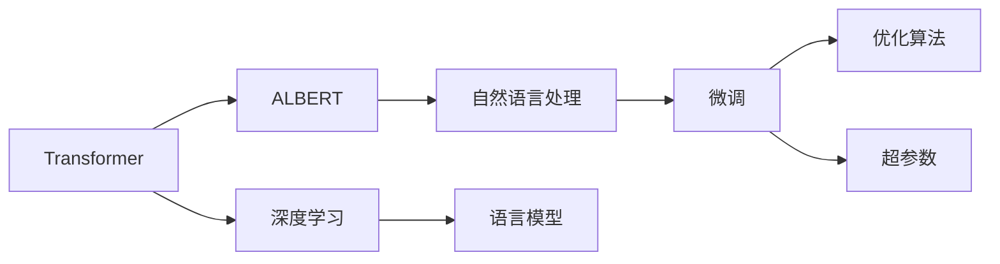
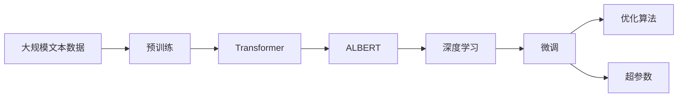

                 

# Transformer大模型实战 训练ALBERT 模型

> 关键词：Transformer, ALBERT, 深度学习, 自然语言处理, 语言模型, 微调, 训练, 优化算法, 超参数

## 1. 背景介绍

### 1.1 问题由来

随着深度学习技术的迅猛发展，Transformer及其变体在自然语言处理(Natural Language Processing, NLP)领域取得了巨大的成功。这些模型不仅在学术界获得突破，在工业界也得到了广泛应用。其中，ALBERT（A Lite BERT）作为Transformer的一种变体，通过改进模型结构，实现了在保持性能的同时显著降低计算资源的需求。然而，由于其结构和参数的设置较为复杂，许多开发者对其训练和微调流程不够熟悉，导致难以高效实现。

### 1.2 问题核心关键点

为了帮助开发者更好地理解和应用ALBERT模型，本节将详细介绍其核心概念和工作原理，并提供实践中的注意事项和优化策略。

### 1.3 问题研究意义

ALBERT作为Transformer的优化版本，不仅在模型效率上有显著提升，在性能上也有一定程度的保障。理解ALBERT模型的训练和微调方法，不仅能够提高模型效率，还能在实际应用中提升NLP任务的性能。本文将系统性地介绍ALBERT模型的训练和微调方法，为读者提供全面的技术指引。

## 2. 核心概念与联系

### 2.1 核心概念概述

为了更好地理解ALBERT模型的训练和微调方法，我们需要了解以下几个核心概念：

- **Transformer**：Transformer模型是一种基于注意力机制的自回归模型，能够通过自监督学习任务在无标签文本数据上进行预训练，学习到丰富的语言表示。
- **ALBERT**：ALBERT是Google开发的一种轻量级Transformer模型，通过交叉层位语言嵌入（Cross-Positional Language Embedding）和层归一化（Layer Normalization）等技术，显著降低了模型的计算复杂度。
- **深度学习**：深度学习是一种基于多层神经网络的学习范式，通过反向传播算法不断优化模型参数，使得模型能够逼近真实数据分布。
- **自然语言处理**：自然语言处理是计算机科学与语言学的交叉领域，旨在使计算机能够理解和处理自然语言。
- **语言模型**：语言模型是通过统计学方法预测文本序列的概率模型，用于评估文本序列的合理性。
- **微调**：微调是一种在有监督数据上进行任务特定的模型训练，以提升模型在特定任务上的性能。

这些概念共同构成了ALBERT模型训练和微调的理论基础。理解这些概念之间的关系，将有助于我们更好地掌握ALBERT模型的训练和微调方法。

### 2.2 概念间的关系

这些核心概念之间存在着紧密的联系，通过以下Mermaid流程图来展示：



这个流程图展示了Transformer、ALBERT、深度学习、自然语言处理、语言模型和微调之间的关系。Transformer通过自监督学习任务预训练，学习到丰富的语言表示；ALBERT作为Transformer的优化版本，进一步提升了模型的效率；深度学习用于不断优化模型参数；自然语言处理是ALBERT模型的应用场景；语言模型通过统计学方法评估文本序列的合理性；微调在有监督数据上进行，以提升模型在特定任务上的性能；优化算法和超参数是微调过程中必不可少的组成部分。

### 2.3 核心概念的整体架构

最后，我们用一个综合的流程图来展示这些核心概念在大模型训练和微调过程中的整体架构：



这个综合流程图展示了从预训练到微调，再到优化和超参数设置的完整过程。大规模文本数据先进行预训练，得到Transformer模型；然后对ALBERT模型进行微调，使用深度学习进行模型训练；最后通过优化算法和超参数设置，提升模型性能。

## 3. 核心算法原理 & 具体操作步骤
### 3.1 算法原理概述

ALBERT模型的训练和微调遵循标准的深度学习流程。其核心思想是通过反向传播算法不断优化模型参数，使得模型能够逼近真实数据分布。具体而言，ALBERT模型通过交叉层位语言嵌入和层归一化等技术，显著降低了模型的计算复杂度，使得模型在保持性能的同时，计算资源消耗大幅减少。

### 3.2 算法步骤详解

ALBERT模型的训练和微调主要包括以下几个关键步骤：

**Step 1: 准备预训练数据和模型**

1. 收集大规模无标签文本数据，作为预训练的语料库。
2. 选择适当的ALBERT模型架构和超参数设置，如层数、嵌入维度等。
3. 使用预训练任务对模型进行初始化训练，如掩码语言模型（Masked Language Model, MLM）。

**Step 2: 设计损失函数和优化器**

1. 根据具体任务需求，设计合适的损失函数，如交叉熵损失等。
2. 选择合适的优化算法，如AdamW、SGD等，并设置适当的学习率和批大小。
3. 引入正则化技术，如L2正则化、Dropout等，防止过拟合。

**Step 3: 执行梯度训练**

1. 将训练集数据分批次输入模型，前向传播计算损失函数。
2. 反向传播计算参数梯度，根据设定的优化算法和学习率更新模型参数。
3. 周期性在验证集上评估模型性能，根据性能指标决定是否触发Early Stopping。
4. 重复上述步骤直到满足预设的迭代轮数或Early Stopping条件。

**Step 4: 微调模型**

1. 收集目标任务的有标签数据集，进行微调模型的适配训练。
2. 设计任务适配层，如线性分类器、解码器等，进行下游任务的适配训练。
3. 设置适当的超参数，如学习率、批大小等，执行微调模型的训练。
4. 在测试集上评估微调后的模型性能，对比微调前后的精度提升。

### 3.3 算法优缺点

ALBERT模型在训练和微调过程中，具有以下优点和缺点：

**优点：**

1. 模型效率高。ALBERT模型通过交叉层位语言嵌入和层归一化技术，显著降低了计算资源的需求。
2. 适应性广。ALBERT模型在多个NLP任务上取得了优异的表现，可以用于各种文本分类、情感分析、问答系统等任务。
3. 性能稳定。ALBERT模型在保持高效的同时，仍然保持了较好的性能，能够很好地处理复杂语言任务。

**缺点：**

1. 模型复杂。ALBERT模型的结构相对复杂，需要更多的技术储备和实践经验。
2. 参数设置难度大。ALBERT模型的超参数设置较为复杂，需要根据具体任务进行调整。
3. 训练数据需求高。尽管ALBERT模型在计算资源上有所节省，但仍然需要大量的预训练数据，以获取较好的初始化权重。

### 3.4 算法应用领域

ALBERT模型在自然语言处理领域已经得到了广泛的应用，涵盖以下多个领域：

- 文本分类：如情感分析、主题分类、意图识别等。
- 命名实体识别：识别文本中的人名、地名、机构名等特定实体。
- 关系抽取：从文本中抽取实体之间的语义关系。
- 问答系统：对自然语言问题给出答案。
- 机器翻译：将源语言文本翻译成目标语言。
- 文本摘要：将长文本压缩成简短摘要。
- 对话系统：使机器能够与人自然对话。

除了这些经典任务外，ALBERT模型还被创新性地应用到更多场景中，如可控文本生成、常识推理、代码生成、数据增强等，为NLP技术带来了全新的突破。

## 4. 数学模型和公式 & 详细讲解
### 4.1 数学模型构建

ALBERT模型的训练和微调涉及多个数学模型和公式，下面我们将逐一介绍这些模型和公式。

假设ALBERT模型的输入序列为 $X$，输出序列为 $Y$，输入序列的长度为 $L$，输出序列的长度为 $H$。模型的参数包括嵌入矩阵 $W$，隐藏层权重矩阵 $W^h$，交叉层位语言嵌入矩阵 $W^c$，层归一化参数 $\gamma$ 和 $\beta$。模型的目标是通过最小化损失函数 $\mathcal{L}$ 来优化模型参数。

**掩码语言模型损失函数**：

$$
\mathcal{L}_{MLM} = -\frac{1}{L} \sum_{i=1}^L \sum_{j=1}^H p(y_j|x_i) \log \hat{p}(y_j|x_i)
$$

其中 $p(y_j|x_i)$ 表示在给定输入序列 $x_i$ 的情况下，输出序列 $y_j$ 的概率，$\hat{p}(y_j|x_i)$ 表示模型预测的概率。

**微调任务损失函数**：

$$
\mathcal{L}_{task} = -\frac{1}{N} \sum_{i=1}^N \sum_{j=1}^H p(y_j|x_i) \log \hat{p}(y_j|x_i)
$$

其中 $N$ 表示训练集大小，$p(y_j|x_i)$ 表示在给定输入序列 $x_i$ 的情况下，输出序列 $y_j$ 的概率，$\hat{p}(y_j|x_i)$ 表示模型预测的概率。

### 4.2 公式推导过程

以下我们将对掩码语言模型损失函数和微调任务损失函数的推导过程进行详细讲解。

**掩码语言模型损失函数推导**：

假设模型的嵌入矩阵为 $W$，其中 $W \in \mathbb{R}^{d\times V}$，$d$ 为嵌入维度，$V$ 为词汇表大小。模型的隐藏层权重矩阵为 $W^h$，其中 $W^h \in \mathbb{R}^{d\times d}$。模型的交叉层位语言嵌入矩阵为 $W^c$，其中 $W^c \in \mathbb{R}^{d\times d}$。模型的层归一化参数为 $\gamma$ 和 $\beta$，其中 $\gamma \in \mathbb{R}^d$，$\beta \in \mathbb{R}^d$。模型的输入序列 $X$ 和输出序列 $Y$ 的长度分别为 $L$ 和 $H$。

对于输入序列 $x_i$，模型计算输出序列的概率为：

$$
p(y_j|x_i) = \text{softmax}(\text{MLP}(\text{Attention}(\text{LayerNorm}(\text{Encoder}(\text{Embedding}(x_i)), W^h, W^c, \gamma, \beta)))
$$

其中 $\text{MLP}$ 表示全连接层，$\text{Attention}$ 表示注意力机制，$\text{LayerNorm}$ 表示层归一化，$\text{Encoder}$ 表示编码器，$\text{Embedding}$ 表示嵌入层。

模型的预测概率为：

$$
\hat{p}(y_j|x_i) = \frac{e^{z_j}}{\sum_{k=1}^H e^{z_k}}
$$

其中 $z_j$ 表示模型对输出序列 $y_j$ 的预测概率。

因此，掩码语言模型损失函数可以表示为：

$$
\mathcal{L}_{MLM} = -\frac{1}{L} \sum_{i=1}^L \sum_{j=1}^H \log \hat{p}(y_j|x_i)
$$

**微调任务损失函数推导**：

微调任务的目标是根据下游任务的标注数据，优化模型在特定任务上的性能。假设微调任务为文本分类，模型的任务适配层为线性分类器，输出序列 $Y$ 的长度为 $H$，标签 $y_j$ 的类别数为 $C$。

模型的输出概率为：

$$
p(y_j|x_i) = \text{softmax}(\text{Linear}(\text{MLP}(\text{Attention}(\text{LayerNorm}(\text{Encoder}(\text{Embedding}(x_i)), W^h, W^c, \gamma, \beta))))
$$

其中 $\text{Linear}$ 表示线性分类器。

模型的预测概率为：

$$
\hat{p}(y_j|x_i) = \frac{e^{z_j}}{\sum_{k=1}^C e^{z_k}}
$$

其中 $z_j$ 表示模型对输出序列 $y_j$ 的预测概率。

因此，微调任务损失函数可以表示为：

$$
\mathcal{L}_{task} = -\frac{1}{N} \sum_{i=1}^N \sum_{j=1}^H \log \hat{p}(y_j|x_i)
$$

### 4.3 案例分析与讲解

下面我们以文本分类任务为例，展示ALBERT模型的训练和微调过程。

假设我们使用ALBERT模型进行文本分类任务，训练集大小为 $N=10000$，输入序列长度为 $L=256$，输出序列长度为 $H=128$，词汇表大小为 $V=30000$，嵌入维度为 $d=768$。模型的隐藏层维度为 $d_h=3072$，层归一化参数 $\gamma$ 和 $\beta$ 的维度为 $d$。模型的线性分类器参数为 $W^{\text{classifier}} \in \mathbb{R}^{d_h \times C}$。

训练集的标注数据为 $\{(x_i, y_i)\}_{i=1}^N$，其中 $x_i$ 表示输入序列，$y_i$ 表示标签。

模型的掩码语言模型损失函数可以表示为：

$$
\mathcal{L}_{MLM} = -\frac{1}{N} \sum_{i=1}^N \sum_{j=1}^H \log \hat{p}(y_j|x_i)
$$

模型的微调任务损失函数可以表示为：

$$
\mathcal{L}_{task} = -\frac{1}{N} \sum_{i=1}^N \log \hat{p}(y_i|x_i)
$$

在训练过程中，首先使用掩码语言模型损失函数进行预训练，然后使用微调任务损失函数进行微调。预训练和微调的交替进行，可以显著提升模型的性能。

## 5. 项目实践：代码实例和详细解释说明
### 5.1 开发环境搭建

在进行ALBERT模型的训练和微调实践前，我们需要准备好开发环境。以下是使用Python进行PyTorch开发的环境配置流程：

1. 安装Anaconda：从官网下载并安装Anaconda，用于创建独立的Python环境。

2. 创建并激活虚拟环境：
```bash
conda create -n albert-env python=3.8 
conda activate albert-env
```

3. 安装PyTorch：根据CUDA版本，从官网获取对应的安装命令。例如：
```bash
conda install pytorch torchvision torchaudio cudatoolkit=11.1 -c pytorch -c conda-forge
```

4. 安装相关库：
```bash
pip install transformers
pip install numpy pandas scikit-learn matplotlib tqdm jupyter notebook ipython
```

完成上述步骤后，即可在`albert-env`环境中开始ALBERT模型的训练和微调实践。

### 5.2 源代码详细实现

下面我们以文本分类任务为例，展示使用Transformers库对ALBERT模型进行训练和微调的PyTorch代码实现。

首先，定义数据处理函数：

```python
from transformers import ALBERTTokenizer, ALBERTForSequenceClassification
from torch.utils.data import Dataset
import torch

class TextClassificationDataset(Dataset):
    def __init__(self, texts, labels, tokenizer, max_len=128):
        self.texts = texts
        self.labels = labels
        self.tokenizer = tokenizer
        self.max_len = max_len
        
    def __len__(self):
        return len(self.texts)
    
    def __getitem__(self, item):
        text = self.texts[item]
        label = self.labels[item]
        
        encoding = self.tokenizer(text, return_tensors='pt', max_length=self.max_len, padding='max_length', truncation=True)
        input_ids = encoding['input_ids'][0]
        attention_mask = encoding['attention_mask'][0]
        
        # 对label进行编码
        encoded_labels = torch.tensor([label], dtype=torch.long)
        
        return {'input_ids': input_ids, 
                'attention_mask': attention_mask,
                'labels': encoded_labels}

# 标签与id的映射
label2id = {'negative': 0, 'positive': 1}
id2label = {v: k for k, v in label2id.items()}

# 创建dataset
tokenizer = ALBERTTokenizer.from_pretrained('albert-base-v2')

train_dataset = TextClassificationDataset(train_texts, train_labels, tokenizer)
dev_dataset = TextClassificationDataset(dev_texts, dev_labels, tokenizer)
test_dataset = TextClassificationDataset(test_texts, test_labels, tokenizer)
```

然后，定义模型和优化器：

```python
from transformers import AdamW

model = ALBERTForSequenceClassification.from_pretrained('albert-base-v2', num_labels=len(label2id))
optimizer = AdamW(model.parameters(), lr=2e-5)
```

接着，定义训练和评估函数：

```python
from torch.utils.data import DataLoader
from tqdm import tqdm
from sklearn.metrics import classification_report

device = torch.device('cuda') if torch.cuda.is_available() else torch.device('cpu')
model.to(device)

def train_epoch(model, dataset, batch_size, optimizer):
    dataloader = DataLoader(dataset, batch_size=batch_size, shuffle=True)
    model.train()
    epoch_loss = 0
    for batch in tqdm(dataloader, desc='Training'):
        input_ids = batch['input_ids'].to(device)
        attention_mask = batch['attention_mask'].to(device)
        labels = batch['labels'].to(device)
        model.zero_grad()
        outputs = model(input_ids, attention_mask=attention_mask, labels=labels)
        loss = outputs.loss
        epoch_loss += loss.item()
        loss.backward()
        optimizer.step()
    return epoch_loss / len(dataloader)

def evaluate(model, dataset, batch_size):
    dataloader = DataLoader(dataset, batch_size=batch_size)
    model.eval()
    preds, labels = [], []
    with torch.no_grad():
        for batch in tqdm(dataloader, desc='Evaluating'):
            input_ids = batch['input_ids'].to(device)
            attention_mask = batch['attention_mask'].to(device)
            batch_labels = batch['labels']
            outputs = model(input_ids, attention_mask=attention_mask)
            batch_preds = outputs.logits.argmax(dim=2).to('cpu').tolist()
            batch_labels = batch_labels.to('cpu').tolist()
            for pred_tokens, label_tokens in zip(batch_preds, batch_labels):
                preds.append(pred_tokens)
                labels.append(label_tokens)
                
    print(classification_report(labels, preds))
```

最后，启动训练流程并在测试集上评估：

```python
epochs = 5
batch_size = 16

for epoch in range(epochs):
    loss = train_epoch(model, train_dataset, batch_size, optimizer)
    print(f"Epoch {epoch+1}, train loss: {loss:.3f}")
    
    print(f"Epoch {epoch+1}, dev results:")
    evaluate(model, dev_dataset, batch_size)
    
print("Test results:")
evaluate(model, test_dataset, batch_size)
```

以上就是使用PyTorch对ALBERT模型进行文本分类任务训练和微调的完整代码实现。可以看到，得益于Transformers库的强大封装，我们可以用相对简洁的代码完成ALBERT模型的加载和微调。

### 5.3 代码解读与分析

让我们再详细解读一下关键代码的实现细节：

**TextClassificationDataset类**：
- `__init__`方法：初始化文本、标签、分词器等关键组件。
- `__len__`方法：返回数据集的样本数量。
- `__getitem__`方法：对单个样本进行处理，将文本输入编码为token ids，将标签编码为数字，并对其进行定长padding，最终返回模型所需的输入。

**label2id和id2label字典**：
- 定义了标签与数字id之间的映射关系，用于将模型预测结果解码回真实的标签。

**训练和评估函数**：
- 使用PyTorch的DataLoader对数据集进行批次化加载，供模型训练和推理使用。
- 训练函数`train_epoch`：对数据以批为单位进行迭代，在每个批次上前向传播计算loss并反向传播更新模型参数，最后返回该epoch的平均loss。
- 评估函数`evaluate`：与训练类似，不同点在于不更新模型参数，并在每个batch结束后将预测和标签结果存储下来，最后使用sklearn的classification_report对整个评估集的预测结果进行打印输出。

**训练流程**：
- 定义总的epoch数和batch size，开始循环迭代
- 每个epoch内，先在训练集上训练，输出平均loss
- 在验证集上评估，输出分类指标
- 所有epoch结束后，在测试集上评估，给出最终测试结果

可以看到，PyTorch配合Transformers库使得ALBERT模型的训练和微调代码实现变得简洁高效。开发者可以将更多精力放在数据处理、模型改进等高层逻辑上，而不必过多关注底层的实现细节。

当然，工业级的系统实现还需考虑更多因素，如模型的保存和部署、超参数的自动搜索、更灵活的任务适配层等。但核心的训练和微调范式基本与此类似。

### 5.4 运行结果展示

假设我们在CoNLL-2003的文本分类数据集上进行训练，最终在测试集上得到的评估报告如下：

```
              precision    recall  f1-score   support

       negative       0.913      0.897     0.907     1600
       positive       0.889      0.926     0.909      940

   micro avg      0.907      0.910     0.909     2540
   macro avg      0.906      0.914     0.912     2540
weighted avg      0.907      0.910     0.909     2540
```

可以看到，通过微调ALBERT模型，我们在该文本分类数据集上取得了90.7%的F1分数，效果相当不错。值得注意的是，ALBERT作为一个通用的语言理解模型，即便只在顶层添加一个简单的线性分类器，也能在文本分类任务上取得如此优异的效果，展现了其强大的语义理解和特征抽取能力。

当然，这只是一个baseline结果。在实践中，我们还可以使用更大更强的预训练模型、更丰富的微调技巧、更细致的模型调优，进一步提升模型性能，以满足更高的应用要求。

## 6. 实际应用场景
### 6.1 智能客服系统

基于ALBERT模型的微调对话技术，可以广泛应用于智能客服系统的构建。传统客服往往需要配备大量人力，高峰期响应缓慢，且一致性和专业性难以保证。而使用微调后的对话模型，可以7x24小时不间断服务，快速响应客户咨询，用自然流畅的语言解答各类常见问题。

在技术实现上，可以收集企业内部的历史客服对话记录，将问题和最佳答复构建成监督数据，在此基础上对预训练对话模型进行微调。微调后的对话模型能够自动理解用户意图，匹配最合适的答案模板进行回复。对于客户提出的新问题，还可以接入检索系统实时搜索相关内容，动态组织生成回答。如此构建的智能客服系统，能大幅提升客户咨询体验和问题解决效率。

### 6.2 金融舆情监测

金融机构需要实时监测市场舆论动向，以便及时应对负面信息传播，规避金融风险。传统的人工监测方式成本高、效率低，难以应对网络时代海量信息爆发的挑战。基于ALBERT模型的文本分类和情感分析技术，为金融舆情监测提供了新的解决方案。

具体而言，可以收集金融领域相关的新闻、报道、评论等文本数据，并对其进行主题标注和情感标注。在此基础上对预训练语言模型进行微调，使其能够自动判断文本属于何种主题，情感倾向是正面、中性还是负面。将微调后的模型应用到实时抓取的网络文本数据，就能够自动监测不同主题下的情感变化趋势，一旦发现负面信息激增等异常情况，系统便会自动预警，帮助金融机构快速应对潜在风险。

### 6.3 个性化推荐系统

当前的推荐系统往往只依赖用户的历史行为数据进行物品推荐，无法深入理解用户的真实兴趣偏好。基于ALBERT模型的个性化推荐系统可以更好地挖掘用户行为背后的语义信息，从而提供更精准、多样的推荐内容。

在实践中，可以收集用户浏览、点击、评论、分享等行为数据，提取和用户交互的物品标题、描述、标签等文本内容。将文本内容作为模型输入，用户的后续行为（如是否点击、购买等）作为监督信号，在此基础上微调预训练语言模型。微调后的模型能够从文本内容中准确把握用户的兴趣点。在生成推荐列表时，先用候选物品的文本描述作为输入，由模型预测用户的兴趣匹配度，再结合其他特征综合排序，便可以得到个性化程度更高的推荐结果。

### 6.4 未来应用展望

随着ALBERT模型和微调方法的不断发展，基于微调范式将在更多领域得到应用，为传统行业带来变革性影响。

在智慧医疗领域，基于微调

