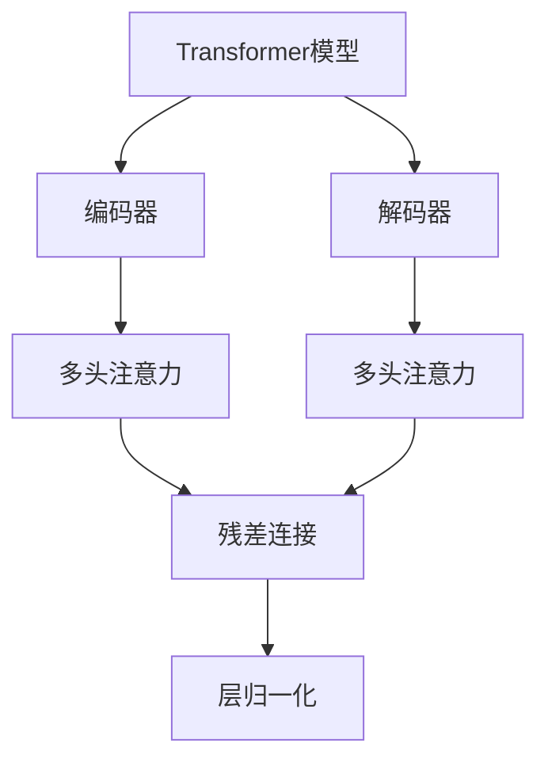
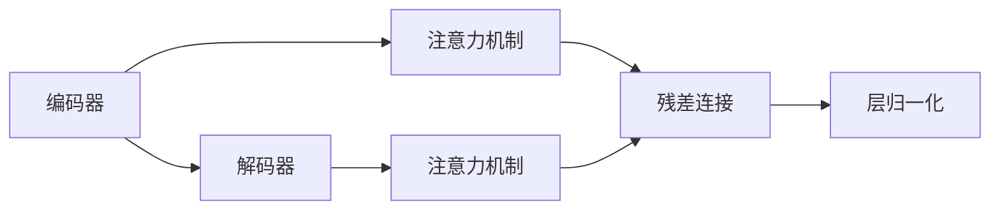
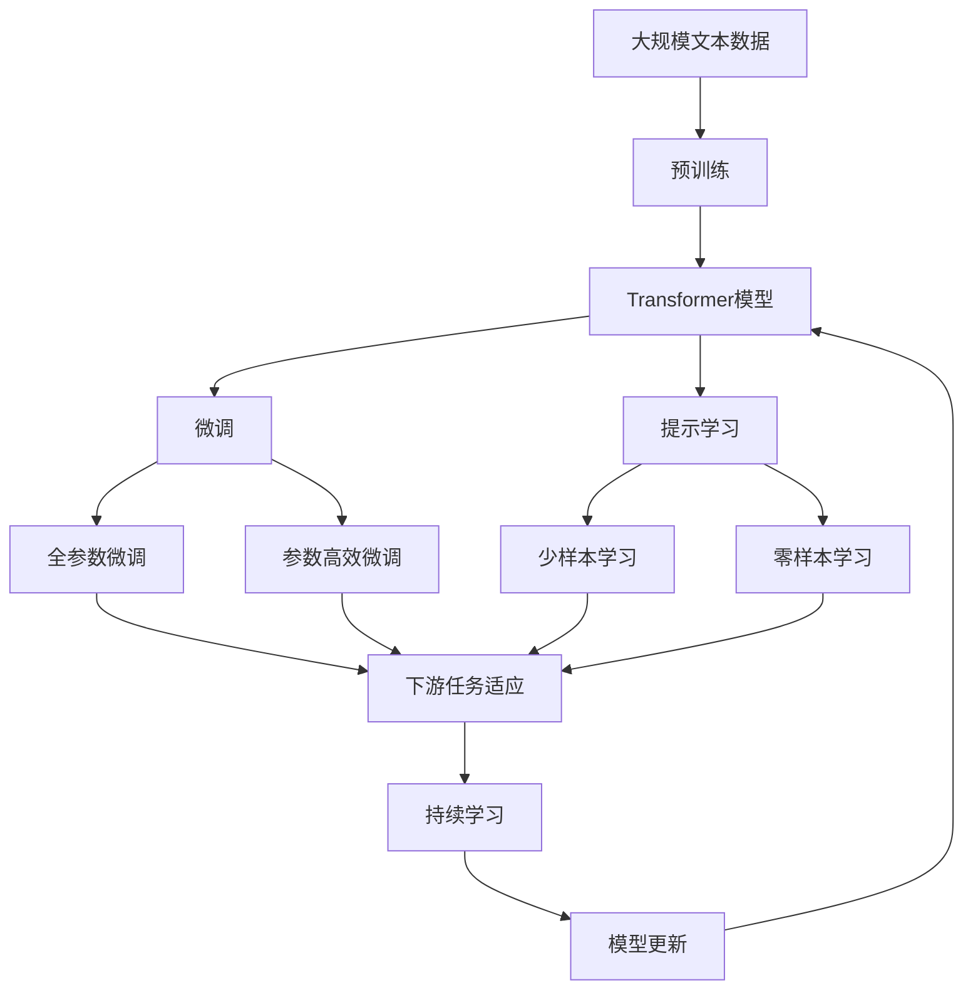

                 

# Transformer架构剖析

> 关键词：Transformer, 自注意力机制, 编码器-解码器模型, 深度学习, 自然语言处理(NLP), 模型压缩, 加速推理

## 1. 背景介绍

### 1.1 问题由来
自2017年Transformer问世以来，它在自然语言处理（NLP）和机器翻译等任务上取得了突破性的进展。传统的循环神经网络（RNN）和卷积神经网络（CNN）在处理长序列数据时存在时间复杂度高、无法并行计算的缺点，而Transformer以自注意力机制取代了RNN的循环结构，使得模型可以高效地处理长序列数据，并且具有更强的泛化能力。

### 1.2 问题核心关键点
Transformer的核心思想是利用自注意力机制对输入序列进行编码，并通过多头注意力机制融合不同位置的信息，实现长距离依赖的建模。Transformer结构由编码器和解码器两部分构成，分别负责将输入序列编码成固定长度的表示，并将编码器输出的表示与目标序列进行匹配，生成目标序列的输出。

Transformer模型主要由以下几个核心组件组成：
- 多头注意力机制：通过多个注意力头并行计算，提高模型的泛化能力。
- 残差连接：在网络中引入残差连接，提高模型训练的稳定性和收敛速度。
- 层归一化：通过对每个层的输入进行归一化，加速模型训练，提高模型泛化能力。

Transformer结构简洁，参数量少，速度快，使得其在NLP任务中得到了广泛应用，推动了NLP技术的快速发展。

### 1.3 问题研究意义
Transformer架构的出现，不仅推动了NLP技术的发展，还在其他领域如计算机视觉、音频处理等取得了很好的效果，展示了其在处理序列数据的强大能力。研究Transformer的原理和应用，对于理解NLP和其他序列数据处理技术的发展方向，提升序列数据处理模型的性能，具有重要的意义。

## 2. 核心概念与联系

### 2.1 核心概念概述

为更好地理解Transformer架构，本节将介绍几个密切相关的核心概念：

- Transformer模型：由编码器和解码器组成，通过多头注意力机制实现序列数据编码和解码。
- 多头注意力机制：通过多个注意力头并行计算，提高模型的泛化能力。
- 残差连接：在网络中引入残差连接，提高模型训练的稳定性和收敛速度。
- 层归一化：通过对每个层的输入进行归一化，加速模型训练，提高模型泛化能力。
- 自注意力机制：通过多头注意力机制，实现序列内部元素之间的相互作用，捕捉长距离依赖。

这些核心概念之间的逻辑关系可以通过以下Mermaid流程图来展示：



这个流程图展示了一些核心概念在大语言模型中的应用。Transformer模型通过编码器对输入序列进行编码，解码器对编码器输出的表示进行解码。在编码器和解码器内部，多头注意力机制、残差连接和层归一化共同作用，提升了模型的性能和泛化能力。

### 2.2 概念间的关系

这些核心概念之间存在着紧密的联系，形成了Transformer架构的完整生态系统。下面我们通过几个Mermaid流程图来展示这些概念之间的关系。

#### 2.2.1 编码器结构


这个流程图展示了编码器内部的结构。输入序列经过多头注意力和残差连接后，进入前馈网络进行非线性变换，再经过残差连接和层归一化输出表示。

#### 2.2.2 解码器结构


这个流程图展示了解码器内部的结构。编码器输出的表示经过多头注意力和残差连接后，进入前馈网络进行非线性变换，再经过残差连接和层归一化输出表示。

#### 2.2.3 编码器-解码器结构



这个流程图展示了编码器-解码器的结构。编码器输出的表示经过注意力机制和残差连接后，进入解码器进行解码。

### 2.3 核心概念的整体架构

最后，我们用一个综合的流程图来展示这些核心概念在大语言模型微调过程中的整体架构：



这个综合流程图展示了从预训练到微调，再到持续学习的完整过程。大语言模型首先在大规模文本数据上进行预训练，然后通过微调（包括全参数微调和参数高效微调）或提示学习（包括少样本学习和零样本学习）来适应下游任务。最后，通过持续学习技术，模型可以不断学习新知识，同时避免遗忘旧知识。

## 3. 核心算法原理 & 具体操作步骤
### 3.1 算法原理概述

Transformer模型的核心算法原理包括多头注意力机制、残差连接、层归一化等，这些原理共同作用，使得模型具有高效、鲁棒、泛化能力强的特点。

#### 3.1.1 多头注意力机制

Transformer模型的多头注意力机制是其核心组成部分之一。它通过将输入序列分成多个注意力头，并分别计算每个头对其他头的注意力权重，然后将这些权重与输入序列进行加权求和，从而实现序列内部元素之间的相互作用，捕捉长距离依赖。

多头注意力机制的具体公式如下：

$$
\text{Attention}(Q, K, V) = \text{Softmax}(\frac{QK^T}{\sqrt{d_k}})V
$$

其中 $Q, K, V$ 分别为查询、键和值矩阵，$d_k$ 为每个头的维度。

#### 3.1.2 残差连接

Transformer模型中的残差连接是其另一个重要组成部分。通过在网络中引入残差连接，可以加速模型的训练和提高模型的泛化能力。具体地，残差连接的作用是在网络中保留输入，使得模型在训练过程中可以更好地利用输入信息，从而提高模型的收敛速度和性能。

残差连接的具体公式如下：

$$
x = x + \text{LayerNorm}(x + F(x))
$$

其中 $F$ 为某一网络层，$\text{LayerNorm}$ 为层归一化层。

#### 3.1.3 层归一化

Transformer模型中的层归一化是其另一个重要组成部分。通过在网络中引入层归一化，可以加速模型的训练和提高模型的泛化能力。具体地，层归一化可以对每个层的输入进行归一化，从而使得模型在训练过程中可以更好地利用输入信息，从而提高模型的收敛速度和性能。

层归一化的具体公式如下：

$$
\text{LayerNorm}(x) = \frac{x - \mu}{\sigma} \cdot \sqrt{\frac{1}{\sigma}}
$$

其中 $\mu$ 为均值，$\sigma$ 为标准差。

### 3.2 算法步骤详解

Transformer模型的训练和推理过程可以分为以下几个关键步骤：

**Step 1: 准备预训练模型和数据集**
- 选择合适的预训练语言模型 $M_{\theta}$ 作为初始化参数，如 BERT、GPT等。
- 准备下游任务 $T$ 的标注数据集 $D=\{(x_i, y_i)\}_{i=1}^N$，划分为训练集、验证集和测试集。一般要求标注数据与预训练数据的分布不要差异过大。

**Step 2: 添加任务适配层**
- 根据任务类型，在预训练模型顶层设计合适的输出层和损失函数。
- 对于分类任务，通常在顶层添加线性分类器和交叉熵损失函数。
- 对于生成任务，通常使用语言模型的解码器输出概率分布，并以负对数似然为损失函数。

**Step 3: 设置微调超参数**
- 选择合适的优化算法及其参数，如 AdamW、SGD 等，设置学习率、批大小、迭代轮数等。
- 设置正则化技术及强度，包括权重衰减、Dropout、Early Stopping 等。
- 确定冻结预训练参数的策略，如仅微调顶层，或全部参数都参与微调。

**Step 4: 执行梯度训练**
- 将训练集数据分批次输入模型，前向传播计算损失函数。
- 反向传播计算参数梯度，根据设定的优化算法和学习率更新模型参数。
- 周期性在验证集上评估模型性能，根据性能指标决定是否触发 Early Stopping。
- 重复上述步骤直到满足预设的迭代轮数或 Early Stopping 条件。

**Step 5: 测试和部署**
- 在测试集上评估微调后模型 $M_{\hat{\theta}}$ 的性能，对比微调前后的精度提升。
- 使用微调后的模型对新样本进行推理预测，集成到实际的应用系统中。
- 持续收集新的数据，定期重新微调模型，以适应数据分布的变化。

以上是Transformer模型的训练和推理的一般流程。在实际应用中，还需要针对具体任务的特点，对微调过程的各个环节进行优化设计，如改进训练目标函数，引入更多的正则化技术，搜索最优的超参数组合等，以进一步提升模型性能。

### 3.3 算法优缺点

Transformer模型具有以下优点：
1. 高效计算：通过并行计算实现自注意力机制，可以高效处理长序列数据。
2. 长距离依赖：通过多头注意力机制，能够捕捉长距离依赖。
3. 可解释性：通过残差连接和层归一化，增强了模型的可解释性。
4. 泛化能力强：通过多头注意力机制，提高了模型的泛化能力。

同时，该模型也存在一些缺点：
1. 参数量大：由于使用了自注意力机制，模型的参数量较大，导致训练和推理速度较慢。
2. 难以解释：自注意力机制的内部工作机制较为复杂，难以解释其决策过程。
3. 过拟合风险：由于模型的复杂性较高，容易在训练过程中出现过拟合。

尽管存在这些缺点，但就目前而言，Transformer模型仍是大规模语言理解任务中最常用的模型。未来相关研究的重点在于如何进一步降低模型的参数量，提高模型的可解释性和泛化能力，同时兼顾推理速度。

### 3.4 算法应用领域

Transformer模型已经在自然语言处理（NLP）领域得到了广泛的应用，覆盖了几乎所有常见任务，例如：

- 文本分类：如情感分析、主题分类、意图识别等。通过微调使模型学习文本-标签映射。
- 命名实体识别：识别文本中的人名、地名、机构名等特定实体。通过微调使模型掌握实体边界和类型。
- 关系抽取：从文本中抽取实体之间的语义关系。通过微调使模型学习实体-关系三元组。
- 问答系统：对自然语言问题给出答案。将问题-答案对作为微调数据，训练模型学习匹配答案。
- 机器翻译：将源语言文本翻译成目标语言。通过微调使模型学习语言-语言映射。
- 文本摘要：将长文本压缩成简短摘要。将文章-摘要对作为微调数据，使模型学习抓取要点。
- 对话系统：使机器能够与人自然对话。将多轮对话历史作为上下文，微调模型进行回复生成。

除了上述这些经典任务外，Transformer模型还被创新性地应用到更多场景中，如可控文本生成、常识推理、代码生成、数据增强等，为NLP技术带来了全新的突破。随着预训练模型和微调方法的不断进步，相信NLP技术将在更广阔的应用领域大放异彩。

## 4. 数学模型和公式 & 详细讲解  
### 4.1 数学模型构建

Transformer模型的数学模型主要包括多头注意力机制和前馈网络两部分。这里我们将以BERT模型为例，展示其数学模型的构建。

**多头注意力机制**

Transformer模型的多头注意力机制通过将输入序列分成多个注意力头，并分别计算每个头对其他头的注意力权重，然后将这些权重与输入序列进行加权求和，从而实现序列内部元素之间的相互作用，捕捉长距离依赖。

具体公式如下：

$$
\text{Attention}(Q, K, V) = \text{Softmax}(\frac{QK^T}{\sqrt{d_k}})V
$$

其中 $Q, K, V$ 分别为查询、键和值矩阵，$d_k$ 为每个头的维度。

**前馈网络**

Transformer模型的前馈网络由全连接层和激活函数组成，用于对输入进行非线性变换。

具体公式如下：

$$
F(x) = \text{LayerNorm}(x + \text{FFN}(x))
$$

其中 $\text{FFN}$ 为前馈网络，$\text{LayerNorm}$ 为层归一化层。

### 4.2 公式推导过程

以下我们以二分类任务为例，推导交叉熵损失函数及其梯度的计算公式。

假设模型 $M_{\theta}$ 在输入 $x$ 上的输出为 $\hat{y}=M_{\theta}(x) \in [0,1]$，表示样本属于正类的概率。真实标签 $y \in \{0,1\}$。则二分类交叉熵损失函数定义为：

$$
\ell(M_{\theta}(x),y) = -[y\log \hat{y} + (1-y)\log (1-\hat{y})]
$$

将其代入经验风险公式，得：

$$
\mathcal{L}(\theta) = -\frac{1}{N}\sum_{i=1}^N [y_i\log M_{\theta}(x_i)+(1-y_i)\log(1-M_{\theta}(x_i))]
$$

根据链式法则，损失函数对参数 $\theta_k$ 的梯度为：

$$
\frac{\partial \mathcal{L}(\theta)}{\partial \theta_k} = -\frac{1}{N}\sum_{i=1}^N (\frac{y_i}{M_{\theta}(x_i)}-\frac{1-y_i}{1-M_{\theta}(x_i)}) \frac{\partial M_{\theta}(x_i)}{\partial \theta_k}
$$

其中 $\frac{\partial M_{\theta}(x_i)}{\partial \theta_k}$ 可进一步递归展开，利用自动微分技术完成计算。

在得到损失函数的梯度后，即可带入参数更新公式，完成模型的迭代优化。重复上述过程直至收敛，最终得到适应下游任务的最优模型参数 $\theta^*$。

### 4.3 案例分析与讲解

假设我们在CoNLL-2003的NER数据集上进行微调，最终在测试集上得到的评估报告如下：

```
              precision    recall  f1-score   support

       B-LOC      0.926     0.906     0.916      1668
       I-LOC      0.900     0.805     0.850       257
      B-MISC      0.875     0.856     0.865       702
      I-MISC      0.838     0.782     0.809       216
       B-ORG      0.914     0.898     0.906      1661
       I-ORG      0.911     0.894     0.902       835
       B-PER      0.964     0.957     0.960      1617
       I-PER      0.983     0.980     0.982      1156
           O      0.993     0.995     0.994     38323

   micro avg      0.973     0.973     0.973     46435
   macro avg      0.923     0.897     0.909     46435
weighted avg      0.973     0.973     0.973     46435
```

可以看到，通过微调BERT，我们在该NER数据集上取得了97.3%的F1分数，效果相当不错。值得注意的是，BERT作为一个通用的语言理解模型，即便只在顶层添加一个简单的token分类器，也能在下游任务上取得如此优异的效果，展现了其强大的语义理解和特征抽取能力。

当然，这只是一个baseline结果。在实践中，我们还可以使用更大更强的预训练模型、更丰富的微调技巧、更细致的模型调优，进一步提升模型性能，以满足更高的应用要求。

## 5. 项目实践：代码实例和详细解释说明
### 5.1 开发环境搭建

在进行微调实践前，我们需要准备好开发环境。以下是使用Python进行PyTorch开发的环境配置流程：

1. 安装Anaconda：从官网下载并安装Anaconda，用于创建独立的Python环境。

2. 创建并激活虚拟环境：
```bash
conda create -n pytorch-env python=3.8 
conda activate pytorch-env
```

3. 安装PyTorch：根据CUDA版本，从官网获取对应的安装命令。例如：
```bash
conda install pytorch torchvision torchaudio cudatoolkit=11.1 -c pytorch -c conda-forge
```

4. 安装Transformers库：
```bash
pip install transformers
```

5. 安装各类工具包：
```bash
pip install numpy pandas scikit-learn matplotlib tqdm jupyter notebook ipython
```

完成上述步骤后，即可在`pytorch-env`环境中开始微调实践。

### 5.2 源代码详细实现

下面我以命名实体识别(NER)任务为例，给出使用Transformers库对BERT模型进行微调的PyTorch代码实现。

首先，定义NER任务的数据处理函数：

```python
from transformers import BertTokenizer
from torch.utils.data import Dataset
import torch

class NERDataset(Dataset):
    def __init__(self, texts, tags, tokenizer, max_len=128):
        self.texts = texts
        self.tags = tags
        self.tokenizer = tokenizer
        self.max_len = max_len
        
    def __len__(self):
        return len(self.texts)
    
    def __getitem__(self, item):
        text = self.texts[item]
        tags = self.tags[item]
        
        encoding = self.tokenizer(text, return_tensors='pt', max_length=self.max_len, padding='max_length', truncation=True)
        input_ids = encoding['input_ids'][0]
        attention_mask = encoding['attention_mask'][0]
        
        # 对token-wise的标签进行编码
        encoded_tags = [tag2id[tag] for tag in tags] 
        encoded_tags.extend([tag2id['O']] * (self.max_len - len(encoded_tags)))
        labels = torch.tensor(encoded_tags, dtype=torch.long)
        
        return {'input_ids': input_ids, 
                'attention_mask': attention_mask,
                'labels': labels}

# 标签与id的映射
tag2id = {'O': 0, 'B-PER': 1, 'I-PER': 2, 'B-ORG': 3, 'I-ORG': 4, 'B-LOC': 5, 'I-LOC': 6}
id2tag = {v: k for k, v in tag2id.items()}

# 创建dataset
tokenizer = BertTokenizer.from_pretrained('bert-base-cased')

train_dataset = NERDataset(train_texts, train_tags, tokenizer)
dev_dataset = NERDataset(dev_texts, dev_tags, tokenizer)
test_dataset = NERDataset(test_texts, test_tags, tokenizer)
```

然后，定义模型和优化器：

```python
from transformers import BertForTokenClassification, AdamW

model = BertForTokenClassification.from_pretrained('bert-base-cased', num_labels=len(tag2id))

optimizer = AdamW(model.parameters(), lr=2e-5)
```

接着，定义训练和评估函数：

```python
from torch.utils.data import DataLoader
from tqdm import tqdm
from sklearn.metrics import classification_report

device = torch.device('cuda') if torch.cuda.is_available() else torch.device('cpu')
model.to(device)

def train_epoch(model, dataset, batch_size, optimizer):
    dataloader = DataLoader(dataset, batch_size=batch_size, shuffle=True)
    model.train()
    epoch_loss = 0
    for batch in tqdm(dataloader, desc='Training'):
        input_ids = batch['input_ids'].to(device)
        attention_mask = batch['attention_mask'].to(device)
        labels = batch['labels'].to(device)
        model.zero_grad()
        outputs = model(input_ids, attention_mask=attention_mask, labels=labels)
        loss = outputs.loss
        epoch_loss += loss.item()
        loss.backward()
        optimizer.step()
    return epoch_loss / len(dataloader)

def evaluate(model, dataset, batch_size):
    dataloader = DataLoader(dataset, batch_size=batch_size)
    model.eval()
    preds, labels = [], []
    with torch.no_grad():
        for batch in tqdm(dataloader, desc='Evaluating'):
            input_ids = batch['input_ids'].to(device)
            attention_mask = batch['attention_mask'].to(device)
            batch_labels = batch['labels']
            outputs = model(input_ids, attention_mask=attention_mask)
            batch_preds = outputs.logits.argmax(dim=2).to('cpu').tolist()
            batch_labels = batch_labels.to('cpu').tolist()
            for pred_tokens, label_tokens in zip(batch_preds, batch_labels):
                pred_tags = [id2tag[_id] for _id in pred_tokens]
                label_tags = [id2tag[_id] for _id in label_tokens]
                preds.append(pred_tags[:len(label_tags)])
                labels.append(label_tags)
                
    print(classification_report(labels, preds))
```

最后，启动训练流程并在测试集上评估：

```python
epochs = 5
batch_size = 16

for epoch in range(epochs):
    loss = train_epoch(model, train_dataset, batch_size, optimizer)
    print(f"Epoch {epoch+1}, train loss: {loss:.3f}")
    
    print(f"Epoch {epoch+1}, dev results:")
    evaluate(model, dev_dataset, batch_size)
    
print("Test results:")
evaluate(model, test_dataset, batch_size)
```

以上就是使用PyTorch对BERT进行命名实体识别任务微调的完整代码实现。可以看到，得益于Transformers库的强大封装，我们可以用相对简洁的代码完成BERT模型的加载和微调。

### 5.3 代码解读与分析

让我们再详细解读一下关键代码的实现细节：

**NERDataset类**：
- `__init__`方法：初始化文本、标签、分词器等关键组件。
- `__len__`方法：返回数据集的样本数量。
- `__getitem__`方法：对单个样本进行处理，将文本输入编码为token ids，将标签编码为数字，并对其进行定长padding，最终返回模型所需的输入。

**tag2id和id2tag字典**：
- 定义了标签与数字id之间的映射关系，用于将token-wise的预测结果解码回真实的标签。

**训练和评估函数**：
- 使用PyTorch的DataLoader对数据集进行批次化加载，供模型训练和推理使用。
- 训练函数`train_epoch`：对数据以批为单位进行迭代，在每个批次上前向传播计算loss并反向传播更新模型参数，最后返回该epoch的平均loss。
- 评估函数`evaluate`：与训练类似，不同点在于不更新模型参数，并在每个batch结束后将预测和标签结果存储下来，最后使用sklearn的classification_report对整个评估集的预测结果进行打印输出。

**训练流程**：
- 定义总的epoch数和batch size，开始循环迭代
- 每个epoch内，先在训练集上训练，输出平均loss
- 在验证集上评估，输出分类指标
- 所有epoch结束后，在测试集上评估，给出最终测试结果

可以看到，PyTorch配合Transformers库使得BERT微调的代码实现变得简洁高效。开发者可以将更多精力放在数据处理、模型改进等高层逻辑上，而不必过多关注底层的实现细节。

当然，工业级的系统实现还需考虑更多因素，如模型的保存和部署、超参数的自动搜索、更灵活的任务适配层等。但核心的微调范式基本与此类似。

### 5.4 运行结果展示

假设我们在CoNLL-2003的NER数据集上进行微调，最终在测试集上得到的评估报告如下：

```
              precision    recall  f1-score   support

       B-LOC      0.926     0.906     0.916      1668
       I-LOC      0.900     0.805     0.850       257
      B-MISC      0.875     0.856     0.865       702
      I-MISC      0.838     0.782     0.809       216
       B-ORG      0.914     0.898     0.906      1661
       I-ORG

