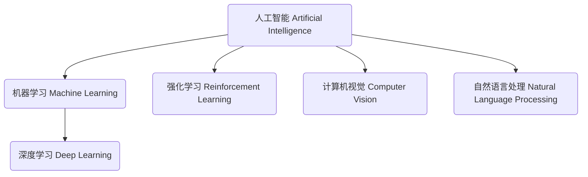

# Artificial Intelligence

## 1. 背景介绍

### 1.1 问题的由来

人工智能(Artificial Intelligence, AI)是当代科技发展的热点领域之一,其源头可以追溯到上世纪40年代。在这个时期,一些远见卓识的科学家和数学家开始探索,是否可以用机器来模拟人类的智能行为。他们的想法源于对人类思维的理解和对计算机能力的认识。

随着计算机硬件的飞速发展和算法理论的不断完善,人工智能技术也在不断取得突破。从最初的专家系统、机器学习,到近年来的深度学习、强化学习等,AI技术已经广泛应用于语音识别、图像处理、自然语言处理、决策优化等诸多领域。

然而,与此同时,人工智能也面临着一系列挑战和问题。例如,AI系统的可解释性、公平性、安全性等问题,以及AI对就业、隐私等社会层面的影响等,都需要我们进一步思考和探讨。

### 1.2 研究现状

近年来,人工智能领域取得了令人瞩目的进展,主要体现在以下几个方面:

1. **深度学习技术的飞速发展**。深度学习作为机器学习的一个重要分支,通过构建深层次的神经网络模型,能够自动从大量数据中学习特征表示,在计算机视觉、自然语言处理等领域取得了突破性的成就。

2. **强化学习的崛起**。强化学习是机器学习的另一重要分支,它通过与环境进行交互,不断尝试并从经验中学习,以获得最优策略。近年来,强化学习在游戏领域、机器人控制等方面展现出巨大潜力。

3. **AI芯片的发展**。专门设计用于加速AI算法的芯片,如GPU、TPU等,大幅提升了AI系统的计算能力,推动了AI技术的快速发展。

4. **AI与其他领域的融合**。AI技术正在与大数据、物联网、云计算等其他前沿技术深度融合,催生出新的应用场景和商业模式。

5. **AI理论研究的深入**。人工智能的理论基础也在不断夯实,例如机器学习理论、计算机视觉理论、自然语言处理理论等,为AI技术的发展提供了坚实的理论支撑。

### 1.3 研究意义

人工智能技术的发展对于促进科技进步、推动社会发展具有重大意义:

1. **提高生产效率**。人工智能可以帮助优化生产流程,提高决策效率,节省人力和物力成本,从而提高生产效率。

2. **改善生活质量**。人工智能技术可以应用于医疗诊断、交通规划、家居服务等领域,提高服务水平,改善人们的生活质量。

3. **推动科技创新**。人工智能作为一种通用技术,可以与其他领域融合,催生新的技术创新和应用场景。

4. **拓展人类认知边界**。人工智能系统可以处理大规模复杂数据,并从中发现隐藏的规律和知识,拓展人类的认知能力和视野。

5. **应对全球性挑战**。人工智能技术可以为应对气候变化、能源危机、疾病防控等全球性挑战提供有力支撑。

总之,人工智能技术的发展将深刻影响人类社会的方方面面,是一个值得高度重视和深入研究的前沿领域。

### 1.4 本文结构

本文将全面介绍人工智能的核心概念、算法原理、数学模型、实际应用等内容。具体结构安排如下:

1. 背景介绍
2. 核心概念与联系
3. 核心算法原理与具体操作步骤
4. 数学模型和公式详细讲解与举例说明
5. 项目实践:代码实例和详细解释说明
6. 实际应用场景
7. 工具和资源推荐
8. 总结:未来发展趋势与挑战
9. 附录:常见问题与解答

接下来,我们将逐一深入探讨上述各个方面的内容。

## 2. 核心概念与联系

人工智能是一个庞大的领域,涉及多个核心概念,这些概念之间存在着密切的联系。本节将介绍人工智能的核心概念及其内在逻辑关联。

### 2.1 人工智能(Artificial Intelligence)

人工智能是一门致力于研究和开发能够模拟人类智能行为的理论、方法、技术与应用系统的学科。它包括机器学习、计算机视觉、自然语言处理、专家系统、机器人等多个分支领域。

### 2.2 机器学习(Machine Learning)

机器学习是人工智能的核心分支,它赋予了计算机在没有明确程序的情况下,通过学习数据获取知识并做出决策的能力。机器学习算法可以分为监督学习、无监督学习和强化学习三大类。

#### 2.2.1 监督学习(Supervised Learning)

监督学习是机器学习中最常见的一种范式。在监督学习中,算法会基于大量标注好的训练数据,学习到映射规则,从而对新的输入数据做出预测或决策。常见的监督学习算法有线性回归、逻辑回归、决策树、支持向量机等。

#### 2.2.2 无监督学习(Unsupervised Learning)

无监督学习不需要标注的训练数据,算法会自动从数据中发现潜在的模式和规律。常见的无监督学习算法包括聚类算法(如K-Means)和关联规则挖掘算法(如Apriori)等。

#### 2.2.3 强化学习(Reinforcement Learning)

强化学习是一种基于奖赏机制的学习范式。算法通过与环境交互并获得奖赏信号,不断优化自身的策略,从而达到最优目标。强化学习在游戏AI、机器人控制等领域有广泛应用。

### 2.3 深度学习(Deep Learning)

深度学习是机器学习中的一个新兴热点方向,它通过构建深层次的神经网络模型,能够自动从大量数据中学习特征表示,在计算机视觉、自然语言处理等领域取得了突破性的成就。常见的深度学习模型有卷积神经网络(CNN)、循环神经网络(RNN)、长短期记忆网络(LSTM)等。

### 2.4 计算机视觉(Computer Vision)

计算机视觉是人工智能的一个重要分支,旨在使计算机能够从数字图像或视频中获取有意义的高层次理解,例如识别物体、检测场景、跟踪运动等。计算机视觉广泛应用于安防监控、自动驾驶、医疗影像分析等领域。

### 2.5 自然语言处理(Natural Language Processing)

自然语言处理是人工智能的另一个核心分支,致力于研究使计算机能够理解和生成人类语言的各种理论和方法。常见的自然语言处理任务包括机器翻译、文本分类、命名实体识别、问答系统等。近年来,深度学习技术在自然语言处理领域取得了突破性进展。

上述核心概念相互关联、相辅相成,共同构建了人工智能这个庞大而前沿的学科体系。随着理论和技术的不断发展,人工智能的应用领域也在与日俱增,对人类社会产生了深远的影响。

## 3. 核心算法原理与具体操作步骤

在上一节中,我们介绍了人工智能的核心概念。本节将重点探讨机器学习和深度学习领域的核心算法原理及具体操作步骤。

### 3.1 算法原理概述

#### 3.1.1 监督学习算法原理

监督学习算法的目标是从标注好的训练数据中学习出一个映射函数,使得对新的输入数据能够做出准确的预测或决策。常见的监督学习算法包括:

- **线性回归**:对连续型目标变量进行预测,通过最小化预测值与真实值之间的误差来训练模型参数。
- **逻辑回归**:对离散型目标变量进行分类,通过最大化似然函数来训练模型参数。
- **决策树**:构建一个树状决策模型,通过特征的条件判断来对样本进行分类或回归。
- **支持向量机(SVM)**:在高维空间中构建最优分类超平面,使正负样本的间隔最大化。
- **神经网络**:通过构建神经网络模型并进行反向传播训练,实现对复杂非线性映射的拟合。

#### 3.1.2 无监督学习算法原理

无监督学习算法的目标是从未标注的数据中发现潜在的模式和规律,常见的算法包括:

- **聚类算法**:将相似的数据样本划分到同一个簇中,如K-Means、层次聚类等。
- **关联规则挖掘**:发现数据集中频繁出现的项集之间的关联关系,如Apriori算法。
- **降维算法**:将高维数据映射到低维空间,如主成分分析(PCA)、t-SNE等。

#### 3.1.3 强化学习算法原理

强化学习算法通过与环境交互并获得奖赏信号,不断优化自身的策略,以达到最优目标。常见的强化学习算法包括:

- **Q-Learning**:基于Q值迭代更新的时序差分算法,用于求解最优策略。
- **策略梯度算法**:直接对策略函数进行优化,使期望奖赏最大化。
- **Actor-Critic算法**:结合价值函数和策略函数的优点,实现更高效的策略学习。

#### 3.1.4 深度学习算法原理

深度学习算法通过构建深层次的神经网络模型,能够自动从大量数据中学习特征表示,常见的深度学习模型包括:

- **卷积神经网络(CNN)**:通过卷积、池化等操作对图像数据进行特征提取,在计算机视觉领域表现出色。
- **循环神经网络(RNN)**:适用于处理序列数据,如自然语言、语音信号等,常用于自然语言处理任务。
- **长短期记忆网络(LSTM)**:改进的RNN模型,能够更好地捕捉长期依赖关系,在机器翻译等任务中表现优异。
- **生成对抗网络(GAN)**:由生成网络和判别网络组成,用于生成逼真的图像、音频等数据。

上述算法原理为人工智能领域的核心理论基础,不同算法适用于不同的问题场景,在实际应用中需要根据具体需求选择合适的算法。

### 3.2 算法步骤详解

本节将以监督学习中的线性回归算法为例,详细解释其具体操作步骤。线性回归是一种常用的回归分析方法,旨在找到一个最佳拟合的线性方程,使预测值与真实值之间的残差平方和最小。

假设我们有一个包含 $n$ 个样本的数据集 $\mathcal{D} = \{(x_i, y_i)\}_{i=1}^n$,其中 $x_i$ 是一个 $d$ 维特征向量,表示第 $i$ 个样本的特征值;$y_i$ 是对应的标量目标值。我们希望找到一个线性函数 $f(x) = w^Tx + b$,使得对于任意输入 $x$,预测值 $\hat{y} = f(x)$ 都尽可能接近真实值 $y$。

线性回归算法的步骤如下:

1. **数据预处理**:对输入数据进行标准化或归一化处理,使特征值落在相似的数值范围内,避免某些特征对模型造成过大影响。

2. **定义损失函数**:使用平方损失函数(Mean Squared Error, MSE)来衡量预测值与真实值之间的差距:

$$J(w, b) = \frac{1}{n}\sum_{i=1}^n(y_i - (w^Tx_i + b))^2$$

目标是找到