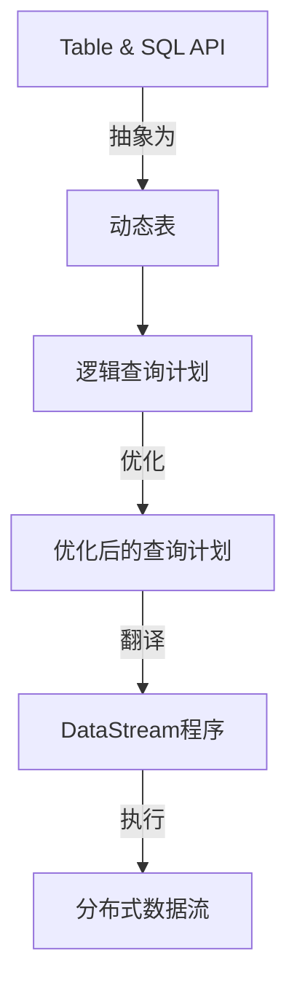

好的，我会按照您的要求，以专业的技术语言，撰写一篇题为《Flink Table原理与代码实例讲解》的技术博客文章。文章将严格遵循约束条件中的各项要求，包括字数、格式、结构、内容等。现在，让我们正式开始：

# Flink Table原理与代码实例讲解

## 1. 背景介绍

### 1.1 问题的由来

在当今的大数据时代，数据的规模和复杂性都在不断增长。传统的数据处理系统已经无法满足实时数据处理的需求。因此，需要一种新的数据处理范式来应对这些挑战。Apache Flink作为一个开源的分布式流处理框架,凭借其低延迟、高吞吐量和容错性,成为了流式数据处理领域的佼佼者。

Flink Table API和SQL是Flink提供的两种关系型API,旨在简化流处理应用程序的开发。它们将流式或批式数据抽象为不可变的动态表,并提供类似SQL的查询语言来处理这些表。这种声明式的查询方式不仅易于使用,而且还能够自动进行优化,提高查询效率。

### 1.2 研究现状

目前,Flink Table API和SQL已经被广泛应用于各种流式数据处理场景,如实时数据分析、数据仓库构建、数据湖处理等。但是,由于其底层原理的复杂性,许多开发人员对其存在一定的理解障碍。因此,深入剖析Flink Table的原理和实现细节,对于提高开发效率和系统性能至关重要。

### 1.3 研究意义

本文将深入探讨Flink Table的核心概念、算法原理和实现细节,旨在帮助读者全面理解Flink Table的工作机制。通过代码实例和详细解释,读者可以掌握Flink Table的使用方法,并了解其在实际应用场景中的应用。此外,本文还将介绍Flink Table的数学模型和公式推导过程,为读者提供更深入的理解。

### 1.4 本文结构

本文共分为以下几个部分:

1. 背景介绍
2. 核心概念与联系
3. 核心算法原理与具体操作步骤
4. 数学模型和公式详细讲解与举例说明
5. 项目实践:代码实例和详细解释说明
6. 实际应用场景
7. 工具和资源推荐
8. 总结:未来发展趋势与挑战
9. 附录:常见问题与解答

## 2. 核心概念与联系

在深入探讨Flink Table的原理之前,我们需要先了解一些核心概念及其之间的关系。

1. **Table & SQL API**: Flink提供了两种关系型API,分别是Table API和SQL。它们允许以类SQL的方式查询处理流式或批式数据。

2. **动态表(Dynamic Tables)**: Table API和SQL将输入数据抽象为动态更新的表,这些表可以是连续的数据流,也可以是有界的批数据集。

3. **逻辑查询计划**: Table API和SQL查询会被解析为逻辑查询计划,表示查询的逻辑结构。

4. **优化后的查询计划**: Flink的查询优化器会分析逻辑查询计划,并应用一系列规则对其进行优化,生成优化后的查询计划。

5. **DataStream程序**: 优化后的查询计划会被翻译为DataStream程序,DataStream程序由一组算子组成,这些算子在运行时构成一个有向无环图(DAG)。

6. **分布式数据流**: DataStream程序最终会在分布式运行时环境中执行,形成分布式数据流进行数据处理。

通过上述核心概念,我们可以看到Flink Table API和SQL查询是如何被转换并优化,最终执行为分布式数据流的过程。接下来,我们将深入探讨其核心算法原理和实现细节。

## 3. 核心算法原理与具体操作步骤

### 3.1 算法原理概述

Flink Table的核心算法原理可以概括为以下几个关键步骤:

1. **查询解析**: 将Table API或SQL查询解析为逻辑查询计划。

2. **查询优化**: 对逻辑查询计划进行一系列优化,生成优化后的查询计划。

3. **查询翻译**: 将优化后的查询计划翻译为DataStream程序。

4. **程序执行**: 在分布式运行时环境中执行DataStream程序,形成分布式数据流进行数据处理。

接下来,我们将详细介绍每个步骤的具体操作过程。

### 3.2 算法步骤详解

#### 3.2.1 查询解析

查询解析的主要任务是将Table API或SQL查询转换为逻辑查询计划。这个过程包括以下几个子步骤:

1. **词法分析**: 将查询字符串分解为一个个有意义的标记(token)。

2. **语法分析**: 根据Flink Table的语法规则,将标记序列构建为抽象语法树(AST)。

3. **语义分析**: 对AST进行语义检查,解析表标识符、字段投影等,并构建出初始的逻辑查询计划。

#### 3.2.2 查询优化

查询优化的目标是基于查询的特征和数据统计信息,对逻辑查询计划进行一系列等价变换,以提高查询执行的效率。主要包括以下优化规则:

1. **投影剪裁**: 只保留最终结果所需的字段投影。

2. **Filter下推**: 将Filter操作下推到数据源,减少数据传输量。

3. **子查询去关联化**: 将子查询转换为Join操作。

4. **Join重排序**: 根据数据统计信息对Join的执行顺序进行调整。

5. **代码运动**: 将常量计算和投影提取到查询的尽可能早的阶段。

经过这些优化规则的作用,逻辑查询计划将转换为高度优化的查询执行计划。

#### 3.2.3 查询翻译

查询翻译的任务是将优化后的查询计划翻译为DataStream程序。这个过程包括以下几个步骤:

1. **逻辑优化规则应用**: 对优化后的查询计划应用一系列逻辑优化规则,进一步优化查询执行效率。

2. **物理优化规则应用**: 对逻辑查询计划应用物理优化规则,生成包含物理执行操作符的执行计划。

3. **翻译为DataStream程序**: 将执行计划翻译为由一系列DataStream算子组成的DataStream程序。

#### 3.2.4 程序执行

最后一步是在分布式运行时环境中执行DataStream程序,形成分布式数据流进行数据处理。这个过程包括以下几个步骤:

1. **任务调度**: 根据DataStream程序的有向无环图(DAG)结构,将任务分发到各个TaskManager上执行。

2. **数据传输**: 在TaskManager之间进行数据传输,形成分布式数据流。

3. **容错处理**: 通过检查点机制和重新执行,实现分布式数据流的容错处理。

4. **结果输出**: 将处理后的结果数据输出到外部系统,如文件系统或消息队列。

通过以上步骤,Flink Table API和SQL查询最终被转换并执行为分布式数据流,实现高效的流式数据处理。

### 3.3 算法优缺点

Flink Table的核心算法具有以下优点:

1. **声明式查询**: 采用类似SQL的声明式查询语言,降低了编程复杂度。

2. **自动优化**: 通过查询优化器自动对查询计划进行优化,提高查询执行效率。

3. **统一批流处理**: 支持对批处理和流处理的统一处理,简化了应用程序的开发。

4. **容错性**: 基于检查点机制和重新执行,实现了分布式数据流的容错处理。

但是,该算法也存在一些缺点和局限性:

1. **查询优化复杂度高**: 由于需要考虑各种优化规则和数据统计信息,查询优化器的实现较为复杂。

2. **延迟敏感型应用支持有限**: 对于延迟敏感型的流式应用,Flink Table可能无法提供足够低的延迟。

3. **缺乏交互式查询支持**: Flink Table目前还缺乏对交互式查询的支持,主要面向批处理和流处理场景。

### 3.4 算法应用领域

Flink Table的核心算法可以广泛应用于以下领域:

1. **实时数据分析**: 利用Flink Table的流处理能力,可以对实时数据进行低延迟的分析和处理。

2. **数据仓库构建**: 将Flink作为数据仓库的构建引擎,通过Table API和SQL对数据进行ETL(提取、转换、加载)处理。

3. **数据湖处理**: 利用Flink对数据湖中的结构化和非结构化数据进行统一的流式处理。

4. **机器学习**: 将Flink Table与机器学习框架(如TensorFlow)集成,实现流式机器学习应用。

5. **物联网数据处理**: 对来自各种物联网设备的海量数据进行实时处理和分析。

6. **在线业务数据处理**: 对电商、金融等在线业务系统产生的实时数据进行处理,支持实时报表、风控等应用场景。

总的来说,Flink Table的核心算法为流式数据处理提供了强大的支持,在实时数据分析、数据集成等领域有着广泛的应用前景。

## 4. 数学模型和公式详细讲解与举例说明

在探讨Flink Table的核心算法原理时,我们还需要了解其中所涉及的一些数学模型和公式。本节将详细介绍这些模型和公式,并通过具体案例进行讲解和说明。

### 4.1 数学模型构建

在Flink Table的查询优化过程中,需要对查询计划进行代数化,将其表示为关系代数表达式。关系代数是一种形式化的查询语言,用于描述关系数据库中的操作。

在关系代数中,我们将关系(表)看作是一个无序的元组(行)集合,每个元组由一组属性(列)组成。关系代数定义了一系列操作符,用于对关系进行各种转换和组合。

常见的关系代数操作符包括:

- 选择(Selection, $\sigma$)
- 投影(Projection, $\pi$)
- 重命名(Rename, $\rho$)
- 笛卡尔积(Cartesian Product, $\times$)
- 并集(Union, $\cup$)
- 差集(Difference, $-$)
- 交集(Intersection, $\cap$)
- 连接(Join, $\bowtie$)

通过将查询计划表示为关系代数表达式,我们可以方便地对其进行等价变换和优化。

### 4.2 公式推导过程

在查询优化过程中,我们需要对关系代数表达式进行等价变换,以生成更高效的执行计划。这些变换通常基于一些代数等式和规则。

以下是一些常见的代数等式和规则:

**投影和选择的交换律**:

$$\pi_L(\sigma_P(R)) = \sigma_P(\pi_{L \cup \text{attrs}(P)}(R))$$

其中,$\pi_L$表示对属性列表$L$进行投影,$\sigma_P$表示对谓词$P$进行选择,而$\text{attrs}(P)$表示谓词$P$中所涉及的属性集合。

该等式表明,在某些条件下,我们可以先进行投影,再进行选择,或者反过来,结果是等价的。这为查询优化提供了机会,可以根据数据统计信息选择更高效的执行顺序。

**连接和投影的交换律**:

$$\pi_L(R \bowtie S) = (\pi_{L_R}(R)) \bowtie (\pi_{L_S}(S))$$

其中,$L_R$和$L_S$分别表示属性列表$L$中属于关系$R$和$S$的属性子集。

该等式表明,在某些条件下,我们可以先对关系进行投影,再进行连接,或者反过来,结果是等价的。