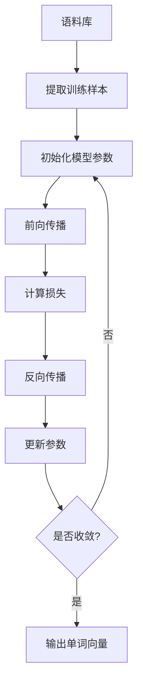

以下是关于"Word Embeddings 原理与代码实战案例讲解"的技术博客文章正文内容：

# Word Embeddings 原理与代码实战案例讲解

## 1. 背景介绍

### 1.1 问题的由来

在自然语言处理(NLP)领域中,将文本表示为计算机可以理解和处理的形式一直是一个巨大的挑战。传统上,我们通常使用 one-hot 编码将单词表示为高维稀疏向量,其中大部分元素为 0,只有一个元素为 1。然而,这种表示方式存在一些明显的缺陷:

1. 维度灾难:词汇表越大,向量维度就越高,导致计算效率低下。
2. 语义信息缺失:one-hot 编码无法捕捉单词之间的语义关系。
3. 数据稀疏性:大部分元素为 0,造成数据高度稀疏,难以挖掘有用的模式。

为了解决这些问题,Word Embeddings 应运而生。

### 1.2 研究现状

Word Embeddings 是一种将单词映射到低维连续向量空间的技术,这种向量表示不仅可以显著降低维度,而且能够较好地捕捉单词之间的语义关系。目前,Word Embeddings 已经广泛应用于各种 NLP 任务中,如机器翻译、情感分析、文本分类等,并取得了卓越的效果。

常见的 Word Embeddings 模型有:

- Word2Vec (CBOW 和 Skip-Gram)
- GloVe (Global Vectors for Word Representation)
- FastText
- ELMo (Embeddings from Language Models)
- BERT (Bidirectional Encoder Representations from Transformers)

### 1.3 研究意义

Word Embeddings 的出现极大地推动了 NLP 领域的发展,它为文本数据提供了一种高质量的低维密集表示,使得机器能够更好地理解自然语言的语义信息。同时,Word Embeddings 也为其他 NLP 任务提供了强大的特征表示,从而提高了这些任务的性能。可以说,Word Embeddings 是 NLP 领域中最重要的技术之一。

### 1.4 本文结构

本文将详细介绍 Word Embeddings 的原理、核心算法、数学模型以及实战案例,内容安排如下:

1. 背景介绍
2. 核心概念与联系
3. 核心算法原理与具体操作步骤
4. 数学模型和公式详细讲解与举例说明
5. 项目实践:代码实例和详细解释说明
6. 实际应用场景
7. 工具和资源推荐
8. 总结:未来发展趋势与挑战
9. 附录:常见问题与解答

## 2. 核心概念与联系

Word Embeddings 的核心思想是将单词映射到一个低维连续的向量空间中,使得语义相似的单词在该向量空间中彼此靠近。这种向量表示不仅可以大大降低数据维度,而且能够较好地捕捉单词之间的语义关系。

Word Embeddings 的训练过程可以看作是一种无监督学习,它通过神经网络模型对大规模语料库进行训练,自动学习每个单词的向量表示。常见的训练模型包括 Word2Vec 和 GloVe 等。

Word Embeddings 可以作为许多下游 NLP 任务的输入特征,如文本分类、机器翻译、问答系统等,极大地提高了这些任务的性能。同时,Word Embeddings 也可以用于可视化单词之间的语义关系,为语言学研究提供新的视角。

## 3. 核心算法原理与具体操作步骤

### 3.1 算法原理概述

Word2Vec 是目前最流行的 Word Embeddings 模型之一,它包含两种算法:连续词袋模型 (CBOW) 和跳元模型 (Skip-Gram)。这两种模型都是基于浅层神经网络,通过最大化目标函数来学习单词向量表示。

CBOW 模型的目标是根据源词的上下文(即前后单词)来预测源词本身,而 Skip-Gram 则相反,它的目标是根据源词来预测其上下文单词。

### 3.2 算法步骤详解

以 Skip-Gram 模型为例,其算法步骤如下:

1. **提取训练样本**:从语料库中提取 (源词, 上下文单词) 作为训练样本。
2. **初始化模型参数**:将单词向量和神经网络权重随机初始化。
3. **前向传播**:将源词的单词向量输入神经网络,计算上下文单词的概率分布。
4. **计算损失**:将预测的概率分布与实际分布进行比较,计算损失函数值。
5. **反向传播**:根据损失函数值,计算梯度,并反向传播到各层参数。
6. **更新参数**:使用优化算法(如 SGD)更新单词向量和神经网络权重。
7. **判断是否收敛**:重复 3-6 步,直到模型收敛或达到最大迭代次数。
8. **输出单词向量**:将训练好的单词向量作为 Word Embeddings 的结果输出。

### 3.3 算法优缺点

**优点**:

- 可解释性强:单词向量能够较好地捕捉单词之间的语义关系。
- 训练速度快:基于浅层神经网络,训练效率较高。
- 泛化能力强:可以很好地推广到低频词和新词。

**缺点**:

- 对于同义词和多义词,无法很好地区分。
- 无法捕捉单词在不同上下文中的语义差异。
- 对于长距离依赖关系,建模能力有限。

### 3.4 算法应用领域

Word Embeddings 已广泛应用于自然语言处理的各个领域,包括但不限于:

- **文本分类**:将 Word Embeddings 作为输入特征,用于新闻分类、情感分析等任务。
- **机器翻译**:Word Embeddings 可以作为编码器和解码器的输入,提高翻译质量。
- **问答系统**:通过计算问题和答案之间的相似度,Word Embeddings 可以用于问答匹配。
- **文本生成**:Word Embeddings 可以作为语言模型的输入,生成自然、流畅的文本。
- **词义消歧**:利用 Word Embeddings 捕捉单词在不同上下文中的语义差异,进行词义消歧。

## 4. 数学模型和公式详细讲解与举例说明

### 4.1 数学模型构建

Word2Vec 的训练目标是最大化目标函数,即最大化给定上下文单词预测源词的条件概率。对于 Skip-Gram 模型,目标函数可以表示为:

$$J = \frac{1}{T}\sum_{t=1}^{T}\sum_{-m \leq j \leq m, j \neq 0} \log P(w_{t+j}|w_t)$$

其中:
- $T$ 为语料库中的训练样本数量
- $w_t$ 为源词
- $w_{t+j}$ 为源词的上下文单词 ($-m \leq j \leq m, j \neq 0$)
- $P(w_{t+j}|w_t)$ 为给定源词 $w_t$ 时,预测上下文单词 $w_{t+j}$ 的条件概率

使用 Softmax 函数计算条件概率:

$$P(w_O|w_I) = \frac{e^{v_{w_O}^{\top}v_{w_I}}}{\sum_{w=1}^{V}e^{v_w^{\top}v_{w_I}}}$$

其中:
- $v_{w_I}$ 为源词 $w_I$ 的单词向量
- $v_{w_O}$ 为目标词 $w_O$ 的单词向量
- $V$ 为词汇表的大小

由于分母项的计算复杂度为 $O(V)$,当词汇表 $V$ 很大时,计算代价非常高。因此,Word2Vec 引入了两种技巧来加速训练:

1. **Hierarchical Softmax**
2. **Negative Sampling**

### 4.2 公式推导过程

这里以 Negative Sampling 为例,推导其目标函数:

我们将原始目标函数 $\log P(w_O|w_I)$ 替换为对数似然比 (log odds ratio):

$$\log \frac{P(D=1|w_O,w_I)}{P(D=0|w_O,w_I)}$$

其中 $D=1$ 表示 $(w_O,w_I)$ 为真实样本, $D=0$ 表示 $(w_O,w_I)$ 为噪声样本。

根据贝叶斯公式,我们可以得到:

$$\log \frac{P(D=1|w_O,w_I)}{P(D=0|w_O,w_I)} = \log \frac{P(w_O|w_I)}{1-P(w_O|w_I)}$$

将其代入原始目标函数,得到 Negative Sampling 的目标函数:

$$\log \sigma(v_{w_O}^{\top}v_{w_I}) + \sum_{i=1}^k \mathbb{E}_{w_i \sim P_n(w)}[\log \sigma(-v_{w_i}^{\top}v_{w_I})]$$

其中:
- $\sigma(x) = \frac{1}{1+e^{-x}}$ 为 Sigmoid 函数
- $k$ 为负采样的样本数量
- $P_n(w)$ 为噪声分布,通常取 Unigram 分布或 Unigram^{3/4} 分布

通过 Negative Sampling,我们只需要对 $k+1$ 个样本进行计算,大大降低了计算复杂度。

### 4.3 案例分析与讲解

我们以一个简单的例子来说明 Word Embeddings 的作用。假设我们有以下三个单词对:

- 国王 - 女王
- 男人 - 女人
- 叔叔 - 阿姨

我们可以观察到,每个单词对之间存在一种类似的关系,即第一个词是男性,第二个词是对应的女性称呼。如果我们将这些单词映射到一个合适的向量空间中,那么每个单词对之间的向量差应该是相似的。

例如,我们可以计算:

$$\vec{女王} - \vec{国王} \approx \vec{女人} - \vec{男人} \approx \vec{阿姨} - \vec{叔叔}$$

这种关系在 Word Embeddings 中被很好地捕捉和编码,体现了 Word Embeddings 能够学习单词之间的语义和句法关系。

我们还可以进一步探索这种关系,例如:

$$\vec{国王} - \vec{男人} + \vec{程序员} \approx ?$$

根据上述规律,结果应该接近 $\vec{女程序员}$ 的向量表示。这种类比推理能力为 Word Embeddings 在各种 NLP 任务中的应用奠定了基础。

### 4.4 常见问题解答

**Q: Word Embeddings 如何处理词汇表之外的新词?**

A: 对于新词,我们可以使用 Character Embeddings 或 Subword Embeddings 等技术,将单词拆分为字符或子词序列,然后将这些基本单元的向量求和作为新词的表示。这种方法可以较好地推广到新词。

**Q: Word Embeddings 如何区分同义词和多义词?**

A: 传统的 Word Embeddings 模型难以很好地区分同义词和多义词。一种解决方案是使用上下文信息,根据单词的上下文动态生成单词向量,从而区分不同上下文下的词义。另一种方法是将单词向量扩展为多个向量,每个向量对应一个词义。

**Q: Word Embeddings 如何捕捉长距离依赖关系?**

A: 传统的 Word Embeddings 模型由于基于浅层神经网络,无法很好地捕捉长距离依赖关系。一种解决方案是使用基于 Transformer 的 Contextual Word Embeddings 模型,如 BERT、GPT 等,它们能够有效地捕捉长距离依赖关系。

## 5. 项目实践:代