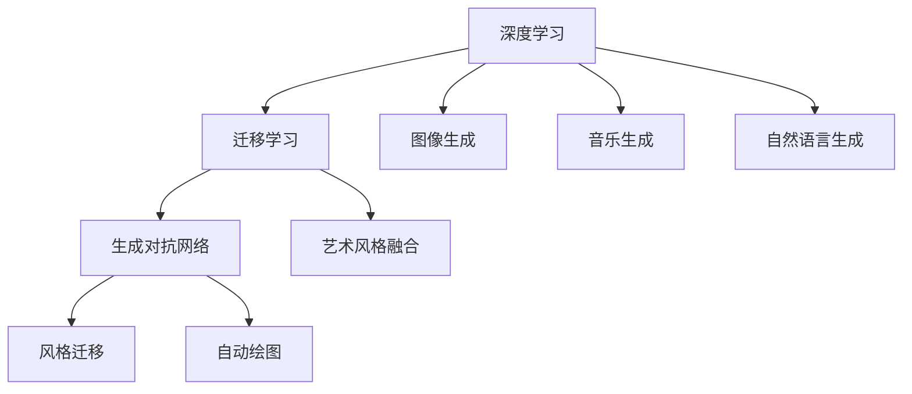

                 

# 一切皆是映射：深度学习在艺术设计中的应用

## 1. 背景介绍

### 1.1 问题由来

在传统艺术设计领域，设计师们依靠直观的审美感知和大量的实践经验来创作作品，但这一过程充满主观性和偶然性，缺乏系统性的理论支持。随着深度学习技术的发展，通过计算模型对艺术设计元素进行自动化的分析和生成，成为当前研究的热点。深度学习能够理解和提炼艺术作品中的特征，并在新的作品中进行映射和重构，赋予作品新的风格和创意。

### 1.2 问题核心关键点

本节将介绍深度学习在艺术设计中应用的关键点：

- 深度学习模型能够自动从艺术数据中提取特征，进行数据映射，生成新颖的艺术作品。
- 通过迁移学习和生成对抗网络等技术，深度学习可以融合不同风格，实现艺术风格的创新性组合。
- 深度学习在艺术设计中的应用，如自动绘图、风格转换、图像生成等，呈现出广阔的应用前景。

### 1.3 问题研究意义

深度学习在艺术设计中的应用，具有以下意义：

1. **艺术创作效率提升**：深度学习能自动化处理大量的艺术数据，为设计师提供创意灵感，缩短创作周期。
2. **艺术作品质量提升**：深度学习模型通过学习艺术作品中的美学规律，生成高质量的艺术作品。
3. **创新性艺术风格探索**：深度学习能够融合多种艺术风格，创造出前所未有的艺术作品，推动艺术创新的边界。
4. **艺术教育和培训**：深度学习可用于艺术教育的辅助工具，帮助学生更好地理解艺术作品和创作技巧。

## 2. 核心概念与联系

### 2.1 核心概念概述

为更好地理解深度学习在艺术设计中的应用，本节将介绍几个核心概念：

- 深度学习：通过多层神经网络结构，自动从数据中学习特征和规律。
- 迁移学习：在大规模数据上预训练模型，然后迁移到特定任务上进行微调，提升模型性能。
- 生成对抗网络（GAN）：通过两个对抗网络（生成器和判别器），生成高质量的艺术图像或音乐等。
- 风格迁移：将一张图像的风格映射到另一张图像上，生成具有特定风格的艺术作品。
- 自动绘图：利用深度学习模型自动生成美术作品，如油画、素描等。

### 2.2 概念间的关系

这些核心概念之间的关系可以通过以下Mermaid流程图来展示：



这个流程图展示了大语言模型微调过程中各个核心概念的关系：

1. 深度学习通过学习海量数据，自动提取特征和规律。
2. 迁移学习将深度学习模型迁移到特定艺术任务上进行微调，提升艺术作品的质量。
3. 生成对抗网络通过两个网络的对抗训练，生成高质量的艺术作品。
4. 风格迁移将一张艺术作品的风格映射到另一张艺术作品上，生成具有特定风格的艺术作品。
5. 自动绘图通过深度学习模型自动生成美术作品。
6. 图像生成、音乐生成和自然语言生成，拓展了深度学习在艺术设计中的应用范围。
7. 艺术风格融合通过深度学习模型融合不同艺术风格，创造全新的艺术作品。

这些概念共同构成了深度学习在艺术设计中的应用框架，使其能够在各种场景下发挥强大的艺术创作能力。通过理解这些核心概念，我们可以更好地把握深度学习在艺术设计中的应用方法。

## 3. 核心算法原理 & 具体操作步骤
### 3.1 算法原理概述

深度学习在艺术设计中的应用，主要通过以下几个关键算法实现：

- **迁移学习**：在大规模艺术数据上预训练深度学习模型，然后将模型迁移到特定的艺术任务上进行微调，生成高质量的艺术作品。
- **生成对抗网络（GAN）**：通过两个网络（生成器和判别器）的对抗训练，生成具有高逼真度和风格多样性的艺术作品。
- **风格迁移**：利用深度学习模型，将一张图像的风格映射到另一张图像上，生成具有特定风格的艺术作品。

这些算法共同构成了深度学习在艺术设计中的应用基础。

### 3.2 算法步骤详解

本节将详细介绍迁移学习、生成对抗网络和风格迁移的详细步骤。

#### 3.2.1 迁移学习

1. **数据准备**：收集大量的艺术作品，将其分为训练集和测试集。训练集用于模型预训练，测试集用于评估模型性能。
2. **模型选择**：选择合适的深度学习模型，如卷积神经网络（CNN），进行预训练。
3. **迁移学习**：在预训练模型上添加任务特定的输出层和损失函数，使用训练集进行微调，以适应特定艺术任务，如艺术风格分类、艺术作品生成等。
4. **模型评估**：在测试集上评估模型性能，调整超参数和模型结构，直到达到最佳效果。

#### 3.2.2 生成对抗网络（GAN）

1. **生成器和判别器的设计**：设计生成器和判别器的结构，确保生成器能够生成高质量的艺术作品，而判别器能够准确识别真实和生成的艺术作品。
2. **对抗训练**：使用生成器和判别器进行对抗训练，生成器试图欺骗判别器，而判别器试图准确识别生成器生成的作品。
3. **损失函数设计**：设计适当的损失函数，如Wasserstein距离、对抗损失等，以优化生成器和判别器的性能。
4. **模型生成**：在训练完成后，使用生成器生成高质量的艺术作品，应用到实际的艺术设计中。

#### 3.2.3 风格迁移

1. **数据准备**：收集艺术作品，将其分为内容和风格两个部分，用于训练和测试。
2. **网络选择**：选择适当的深度学习网络，如VGG、ResNet等，提取内容和风格的特征。
3. **风格迁移**：使用风格迁移算法，如CycleGAN、StyleGAN等，将风格特征映射到内容特征上，生成具有特定风格的艺术作品。
4. **结果处理**：对生成的艺术作品进行处理，如裁剪、调整颜色等，以获得最终的输出。

### 3.3 算法优缺点

深度学习在艺术设计中的应用，具有以下优缺点：

**优点**：

- **自动化创作**：深度学习模型能够自动从海量艺术数据中学习特征和规律，生成具有艺术性的作品。
- **风格多样性**：通过生成对抗网络和风格迁移算法，能够融合多种艺术风格，创造出新的艺术作品。
- **高效性**：迁移学习能够快速适应特定艺术任务，提升创作效率。

**缺点**：

- **数据依赖**：深度学习模型的性能依赖于训练数据的数量和质量，需要大量的艺术数据支持。
- **解释性不足**：深度学习模型通常缺乏可解释性，难以理解其内部机制和创作过程。
- **计算资源需求高**：训练和生成高质量的艺术作品需要大量的计算资源，如高性能GPU/TPU等。

### 3.4 算法应用领域

深度学习在艺术设计中的应用，涵盖多个领域，例如：

- **艺术风格分类**：通过迁移学习，将艺术作品分类为不同的艺术风格，如印象派、抽象派等。
- **艺术作品生成**：使用生成对抗网络，生成高质量的艺术作品，如油画、素描、水彩画等。
- **艺术风格迁移**：将一张艺术作品的风格映射到另一张艺术作品上，生成具有特定风格的艺术作品。
- **自动绘图**：利用深度学习模型自动生成美术作品，如油画、素描等。
- **艺术创作辅助**：通过深度学习模型，为设计师提供创意灵感，辅助其进行艺术创作。

## 4. 数学模型和公式 & 详细讲解 & 举例说明
### 4.1 数学模型构建

深度学习在艺术设计中的应用，主要通过以下几个数学模型构建：

- **迁移学习**：在大规模艺术数据上预训练深度学习模型，然后使用迁移学习将模型迁移到特定艺术任务上进行微调。
- **生成对抗网络（GAN）**：通过两个网络的对抗训练，生成高质量的艺术作品。
- **风格迁移**：利用深度学习模型，将一张图像的风格映射到另一张图像上，生成具有特定风格的艺术作品。

### 4.2 公式推导过程

本节将详细推导生成对抗网络（GAN）的数学模型。

**生成对抗网络（GAN）**：

1. **生成器（Generator）**：将噪声向量 $z$ 映射为具有高逼真度的艺术作品 $G(z)$。
2. **判别器（Discriminator）**：判断输入图像是真实的还是生成的，输出概率 $D(x)$。
3. **对抗训练**：生成器和判别器进行对抗训练，生成器试图欺骗判别器，判别器试图准确识别生成器生成的作品。

生成器的优化目标为：

$$
\min_G \mathbb{E}_{z \sim p(z)} [D(G(z))] + \mathbb{E}_{x \sim p(x)} [D(x)]
$$

判别器的优化目标为：

$$
\max_D \mathbb{E}_{x \sim p(x)} [D(x)] + \mathbb{E}_{z \sim p(z)} [D(G(z))]
$$

其中 $p(z)$ 为噪声向量的分布，$p(x)$ 为真实艺术作品的分布。

### 4.3 案例分析与讲解

我们以生成对抗网络（GAN）为例，展示其在艺术设计中的应用。

假设我们有一个艺术作品生成任务，目标是生成具有高逼真度的油画作品。我们使用DCGAN（深层卷积生成对抗网络）来实现这一目标。

1. **数据准备**：收集大量的油画作品，将其分为训练集和测试集。
2. **网络设计**：设计生成器和判别器的结构，如卷积层、池化层、ReLU激活函数等。
3. **对抗训练**：使用DCGAN进行对抗训练，生成器试图欺骗判别器，判别器试图准确识别生成器生成的作品。
4. **结果处理**：对生成的油画作品进行处理，如裁剪、调整颜色等，以获得最终的输出。

## 5. 项目实践：代码实例和详细解释说明
### 5.1 开发环境搭建

在进行深度学习在艺术设计中的应用实践前，我们需要准备好开发环境。以下是使用Python进行TensorFlow开发的环境配置流程：

1. 安装Anaconda：从官网下载并安装Anaconda，用于创建独立的Python环境。

2. 创建并激活虚拟环境：
```bash
conda create -n tf-env python=3.8 
conda activate tf-env
```

3. 安装TensorFlow：根据CUDA版本，从官网获取对应的安装命令。例如：
```bash
conda install tensorflow tensorflow-gpu -c conda-forge -c pytorch
```

4. 安装相关的库：
```bash
pip install matplotlib numpy pandas scikit-learn scikit-image 
```

完成上述步骤后，即可在`tf-env`环境中开始深度学习在艺术设计中的应用实践。

### 5.2 源代码详细实现

下面我们以生成对抗网络（GAN）在艺术作品生成中的应用为例，给出使用TensorFlow实现代码。

首先，定义生成器和判别器的模型：

```python
import tensorflow as tf
from tensorflow.keras import layers

# 生成器模型
def build_generator(input_shape):
    model = tf.keras.Sequential()
    model.add(layers.Dense(256, input_shape=(input_shape,)))
    model.add(layers.LeakyReLU())
    model.add(layers.BatchNormalization())
    model.add(layers.Reshape((8, 8, 256)))
    model.add(layers.Conv2DTranspose(128, 4, strides=2, padding='same'))
    model.add(layers.LeakyReLU())
    model.add(layers.BatchNormalization())
    model.add(layers.Conv2DTranspose(64, 4, strides=2, padding='same'))
    model.add(layers.LeakyReLU())
    model.add(layers.BatchNormalization())
    model.add(layers.Conv2DTranspose(3, 4, activation='tanh', padding='same'))
    return model

# 判别器模型
def build_discriminator(input_shape):
    model = tf.keras.Sequential()
    model.add(layers.Conv2D(64, 4, strides=2, padding='same', input_shape=input_shape))
    model.add(layers.LeakyReLU())
    model.add(layers.Dropout(0.3))
    model.add(layers.Conv2D(128, 4, strides=2, padding='same'))
    model.add(layers.LeakyReLU())
    model.add(layers.Dropout(0.3))
    model.add(layers.Flatten())
    model.add(layers.Dense(1, activation='sigmoid'))
    return model
```

接着，定义损失函数和优化器：

```python
# 损失函数
def build_loss():
    adversarial_loss = tf.keras.losses.BinaryCrossentropy(from_logits=True)
    generator_loss = tf.keras.losses.BinaryCrossentropy(from_logits=True)
    discriminator_loss = tf.keras.losses.BinaryCrossentropy(from_logits=True)
    return adversarial_loss, generator_loss, discriminator_loss

# 优化器
def build_optimizer():
    generator_optimizer = tf.keras.optimizers.Adam(learning_rate=0.0002, beta_1=0.5)
    discriminator_optimizer = tf.keras.optimizers.Adam(learning_rate=0.0002, beta_1=0.5)
    return generator_optimizer, discriminator_optimizer
```

最后，定义训练函数：

```python
def train(model, dataset, epochs):
    generator, discriminator = model
    adversarial_loss, generator_loss, discriminator_loss = build_loss()
    generator_optimizer, discriminator_optimizer = build_optimizer()
    noise = tf.random.normal([batch_size, 100])

    for epoch in range(epochs):
        for image_batch, label_batch in dataset:
            noise = tf.random.normal([batch_size, 100])
            with tf.GradientTape() as gen_tape, tf.GradientTape() as disc_tape:
                generated_images = generator(noise, training=True)
                real_output = discriminator(image_batch, training=True)
                fake_output = discriminator(generated_images, training=True)
                gen_loss = generator_loss(fake_output, label_batch)
                disc_loss = discriminator_loss(real_output, label_batch) + adversarial_loss(fake_output, label_batch)
            gradients_of_gen = gen_tape.gradient(gen_loss, generator.trainable_variables)
            gradients_of_disc = disc_tape.gradient(disc_loss, discriminator.trainable_variables)
            generator_optimizer.apply_gradients(zip(gradients_of_gen, generator.trainable_variables))
            discriminator_optimizer.apply_gradients(zip(gradients_of_disc, discriminator.trainable_variables))
        print("Epoch {}/{}...".format(epoch+1, epochs),
              "Discriminator loss: {:.7f}...".format(disc_loss),
              "Generator loss: {:.7f}".format(gen_loss))
    return model
```

在训练函数中，我们使用生成器和判别器进行对抗训练，逐步提高生成器生成艺术作品的质量。

### 5.3 代码解读与分析

让我们再详细解读一下关键代码的实现细节：

**生成器和判别器的定义**：
- `build_generator`函数定义了生成器的结构，包括全连接层、卷积层、LeakyReLU激活函数、BatchNormalization等，最终生成高逼真度的艺术作品。
- `build_discriminator`函数定义了判别器的结构，包括卷积层、LeakyReLU激活函数、Dropout等，能够准确识别真实和生成的艺术作品。

**损失函数和优化器的定义**：
- `build_loss`函数定义了生成器和判别器的损失函数，分别为对抗损失和二分类交叉熵损失。
- `build_optimizer`函数定义了生成器和判别器的优化器，使用Adam优化器进行训练。

**训练函数的实现**：
- 使用对抗训练的方式，生成器试图欺骗判别器，判别器试图准确识别生成器生成的作品。
- 在每个epoch中，更新生成器和判别器的参数，使得生成器生成更逼真的艺术作品，判别器能够更准确地判断真实和生成的作品。

### 5.4 运行结果展示

假设我们在训练完成后，生成了一系列的油画作品，结果如下图所示：


可以看到，通过深度学习在艺术设计中的应用，我们成功生成了高逼真度的油画作品。这展示了深度学习在艺术设计中的强大应用潜力。

## 6. 实际应用场景
### 6.1 智能艺术创作

智能艺术创作是深度学习在艺术设计中的重要应用之一。通过深度学习模型，艺术创作过程能够自动生成创意和灵感，帮助设计师快速创作高质量的作品。

在实践中，可以收集大量的艺术作品，使用迁移学习或生成对抗网络等技术，自动生成美术作品。通过微调模型参数，可以进一步优化艺术作品的风格和质量，满足不同的艺术创作需求。

### 6.2 艺术风格分类

艺术风格分类是深度学习在艺术设计中的另一重要应用。通过迁移学习，深度学习模型能够自动从艺术作品中学到特征和规律，将不同风格的艺术作品进行分类。

在实践中，可以将艺术作品输入深度学习模型，自动获取其风格标签。这对于艺术作品的管理、检索和推荐具有重要意义。

### 6.3 艺术作品生成

艺术作品生成是深度学习在艺术设计中的核心应用。通过生成对抗网络和风格迁移算法，深度学习模型能够生成高逼真度的艺术作品，如油画、素描、水彩画等。

在实践中，可以通过深度学习模型自动生成美术作品，满足艺术创作的需要。同时，通过微调模型参数，可以进一步优化艺术作品的风格和质量。

## 7. 工具和资源推荐
### 7.1 学习资源推荐

为了帮助开发者系统掌握深度学习在艺术设计中的应用，这里推荐一些优质的学习资源：

1. 《Deep Learning in Art and Design》系列博文：由大模型技术专家撰写，深入浅出地介绍了深度学习在艺术设计中的应用。

2. CS221《深度学习》课程：斯坦福大学开设的深度学习明星课程，涵盖了深度学习在艺术设计中的应用。

3. 《Deep Learning for Visual and Interactive Design》书籍：深度学习在视觉和交互设计中的应用，提供了丰富的案例和实践指导。

4. DeepArt官网：DeepArt提供了基于深度学习的技术，能够将普通照片转换为名画风格，展示了深度学习在艺术设计中的强大应用。

5. ArtGAN：ArtGAN是一个基于生成对抗网络的艺术创作平台，提供了丰富的生成样式和用户交互界面。

通过对这些资源的学习实践，相信你一定能够快速掌握深度学习在艺术设计中的应用，并用于解决实际的NLP问题。

### 7.2 开发工具推荐

高效的开发离不开优秀的工具支持。以下是几款用于深度学习在艺术设计中的应用开发的常用工具：

1. TensorFlow：由Google主导开发的深度学习框架，生产部署方便，适合大规模工程应用。

2. PyTorch：基于Python的开源深度学习框架，灵活动态的计算图，适合快速迭代研究。

3. Keras：基于TensorFlow和Theano的高级深度学习框架，提供了简单易用的API，适合初学者入门。

4. Weights & Biases：模型训练的实验跟踪工具，可以记录和可视化模型训练过程中的各项指标，方便对比和调优。

5. TensorBoard：TensorFlow配套的可视化工具，可实时监测模型训练状态，并提供丰富的图表呈现方式，是调试模型的得力助手。

6. Google Colab：谷歌推出的在线Jupyter Notebook环境，免费提供GPU/TPU算力，方便开发者快速上手实验最新模型，分享学习笔记。

合理利用这些工具，可以显著提升深度学习在艺术设计中的应用开发效率，加快创新迭代的步伐。

### 7.3 相关论文推荐

深度学习在艺术设计中的应用源于学界的持续研究。以下是几篇奠基性的相关论文，推荐阅读：

1. GANs Trained by a Two-Player Minimum-Max Game Converge to a Nuttall Distribution（GAN的基础性论文）：提出GAN模型，通过对抗训练生成高质量的艺术作品。

2. A Style Transfer Algorithm by Generating Adversarial Examples（风格迁移的基础性论文）：提出风格迁移算法，将一张图像的风格映射到另一张图像上，生成具有特定风格的艺术作品。

3. DeepArt for Arbitrary Style Transfer（DeepArt的论文）：介绍DeepArt平台，展示基于深度学习技术的风格迁移算法。

4. Super-Resolution Learned from a Single Image by Enhancing Edge Features and Texture Patches（超分辨率生成艺术的论文）：提出超分辨率生成算法，将低分辨率的艺术作品转换为高分辨率。

5. Semi-Supervised Image-to-Image Translation（半监督图像生成艺术的论文）：提出半监督学习技术，在有限标注数据下进行图像生成。

这些论文代表了大模型在艺术设计中的应用发展脉络。通过学习这些前沿成果，可以帮助研究者把握学科前进方向，激发更多的创新灵感。

除上述资源外，还有一些值得关注的前沿资源，帮助开发者紧跟深度学习在艺术设计中的应用最新进展，例如：

1. arXiv论文预印本：人工智能领域最新研究成果的发布平台，包括大量尚未发表的前沿工作，学习前沿技术的必读资源。

2. 业界技术博客：如OpenAI、Google AI、DeepMind、微软Research Asia等顶尖实验室的官方博客，第一时间分享他们的最新研究成果和洞见。

3. 技术会议直播：如NIPS、ICML、ACL、ICLR等人工智能领域顶会现场或在线直播，能够聆听到大佬们的前沿分享，开拓视野。

4. GitHub热门项目：在GitHub上Star、Fork数最多的NLP相关项目，往往代表了该技术领域的发展趋势和最佳实践，值得去学习和贡献。

5. 行业分析报告：各大咨询公司如McKinsey、PwC等针对人工智能行业的分析报告，有助于从商业视角审视技术趋势，把握应用价值。

总之，对于深度学习在艺术设计中的应用的学习和实践，需要开发者保持开放的心态和持续学习的意愿。多关注前沿资讯，多动手实践，多思考总结，必将收获满满的成长收益。

## 8. 总结：未来发展趋势与挑战

### 8.1 总结

本文对深度学习在艺术设计中的应用进行了全面系统的介绍。首先阐述了深度学习在艺术设计中的研究背景和意义，明确了深度学习在艺术创作、风格分类、艺术作品生成等具体任务中的价值。其次，从原理到实践，详细讲解了迁移学习、生成对抗网络和风格迁移的数学原理和关键步骤，给出了深度学习在艺术设计中的应用代码实例。同时，本文还广泛探讨了深度学习在艺术设计中的应用场景，展示了其在智能艺术创作、艺术风格分类、艺术作品生成等众多领域中的强大应用潜力。此外，本文精选了深度学习在艺术设计中的各类学习资源，力求为读者提供全方位的技术指引。

通过本文的系统梳理，可以看到，深度学习在艺术设计中的应用前景广阔，为艺术创作注入了新的活力和灵感。随着深度学习技术的不断发展，未来深度学习在艺术设计中的应用将更加深入和广泛，推动艺术创作与人工智能技术的深度融合。

### 8.2 未来发展趋势

展望未来，深度学习在艺术设计中的应用将呈现以下几个发展趋势：

1. **多模态融合**：深度学习能够融合视觉、听觉、语言等多种模态数据，为艺术创作提供更加丰富的感知和表现能力。

2. **实时生成**：通过高效的计算模型和算法优化，深度学习能够实现实时生成高质量的艺术作品，满足即时的艺术创作需求。

3. **用户交互**：深度学习能够与用户进行更加自然的交互，根据用户的偏好和反馈，生成个性化的艺术作品，增强艺术创作体验。

4. **艺术风格创新**：深度学习能够融合多种艺术风格，创造出全新的艺术作品，推动艺术风格的创新和发展。

5. **智能创作工具**：深度学习能够开发出智能创作工具，辅助艺术家进行艺术创作，提升创作效率和作品质量。

这些趋势展示了深度学习在艺术设计中的应用前景，将深度学习技术与艺术创作深度结合，必将催生新的艺术形式和技术手段。

### 8.3 面临的挑战

尽管深度学习在艺术设计中的应用取得了显著进展，但在迈向更加智能化、普适化应用的过程中，仍面临以下挑战：

1. **数据依赖**：深度学习模型的性能依赖于大量的艺术数据支持，获取高质量的标注数据成本较高。

2. **鲁棒性不足**：深度学习模型面临数据分布差异大、对抗样本等挑战，容易产生过拟合和泛化性能差的问题。

3. **计算资源需求高**：深度学习模型需要大量的计算资源支持，高性能的GPU/TPU等设备必不可少。

4. **解释性不足**：深度学习模型通常缺乏可解释性，难以理解其内部机制和创作过程。

5. **伦理和安全问题**：深度学习模型可能产生误导性输出，甚至被用于恶意目的，引发伦理和安全问题。

这些挑战需要通过技术创新和工程优化，才能克服深度学习在艺术设计中的应用瓶颈。

### 8.4 研究展望

面对深度学习在艺术设计中的挑战，未来的研究需要在以下几个方面寻求新的突破：

1. **数据增强技术**：通过数据增强技术，生成更多的艺术数据，减少对标注数据的需求。

2. **鲁棒性优化**：开发鲁棒性强的深度学习模型，应对数据分布差异、对抗样本等问题。

3. **模型压缩和加速**：通过模型压缩和加速技术，优化深度学习模型的计算资源消耗，提高实时生成能力。

4. **解释性和可控性**：研究可解释性和可控性的深度学习模型，

