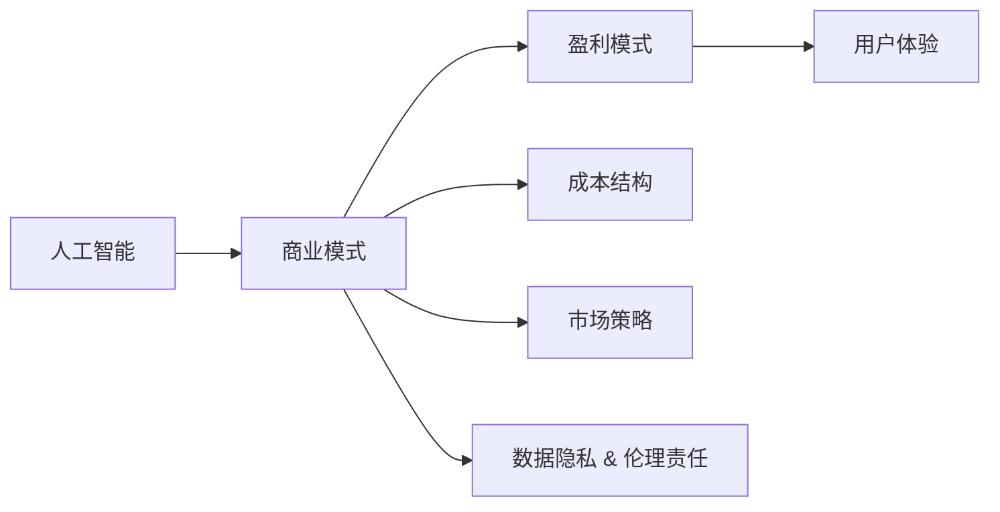

                 

## 1. 背景介绍

### 1.1 问题由来

随着人工智能技术的飞速发展，越来越多的企业和技术创业者看到了AI的巨大商业价值。然而，如何通过AI技术创造价值、实现盈利，成为了一个亟待解决的问题。在AI商业化的早期阶段，盈利模式的设计往往缺乏理论和实践的指导，导致一些企业在产品开发和市场推广上迷失方向，最终难以取得商业成功。

### 1.2 问题核心关键点

在AI商业化过程中，盈利模式的设计是关键。一个合理的盈利模式不仅需要考虑如何通过AI技术获取收入，还需要考虑成本控制、用户体验、市场策略等多个方面。以下是从多个维度探讨人工智能创业盈利模式的核心关键点：

1. **市场定位与用户需求**：明确目标市场和目标用户，深入理解其需求和痛点，是设计盈利模式的基础。
2. **技术实现与产品差异化**：通过技术优势实现产品差异化，在竞争激烈的市场中脱颖而出。
3. **成本控制与盈利平衡**：合理控制成本，找到收入与支出之间的平衡点，确保可持续发展。
4. **用户增长与市场扩展**：通过有效的用户增长策略和市场扩展策略，提升品牌影响力和市场占有率。
5. **数据隐私与伦理责任**：在获取和利用用户数据时，确保隐私保护和伦理责任，避免法律风险。

### 1.3 问题研究意义

人工智能技术的商业化是一个复杂而多维度的问题，涉及技术、市场、法律、伦理等多个方面。合理的盈利模式设计能够帮助企业在技术创新和商业化之间找到平衡，加速产品迭代和市场扩展，从而实现商业成功。

通过深入研究人工智能创业的盈利模式，可以帮助企业：
- 明确市场定位和用户需求，制定更加精准的市场策略。
- 通过技术优势实现产品差异化，提高市场竞争力。
- 合理控制成本，确保企业可持续发展。
- 设计有效的用户增长和市场扩展策略，提升品牌影响力和市场占有率。
- 在数据隐私和伦理责任方面保持高度警觉，规避法律风险。

## 2. 核心概念与联系

### 2.1 核心概念概述

为了更好地理解人工智能创业中的盈利模式设计，本节将介绍几个关键概念及其相互关系：

1. **人工智能（AI）**：利用计算机模拟人类智能过程的技术，包括机器学习、深度学习、自然语言处理等。
2. **商业模式（Business Model）**：企业如何通过产品或服务获取收入、控制成本并创造价值的过程。
3. **盈利模式（Revenue Model）**：企业如何通过特定方式实现收入的具体策略和机制。
4. **成本结构（Cost Structure）**：企业运营过程中各项成本的构成和分配方式。
5. **用户体验（User Experience）**：用户与产品交互的情感体验和满意度。
6. **市场策略（Market Strategy）**：企业针对目标市场的营销和销售策略。
7. **数据隐私与伦理责任（Data Privacy & Ethical Responsibility）**：企业在数据收集、使用和处理中应遵守的法律法规和伦理准则。

这些核心概念通过下图中的Mermaid流程图进行展示：



### 2.2 概念间的关系

通过上述流程图，我们可以看到各个概念之间的关系：

1. **人工智能与商业模式**：人工智能技术是商业模式的基础，提供技术支持。
2. **商业模式与盈利模式**：商业模式决定了盈利模式的类型和实现方式。
3. **商业模式与成本结构**：成本结构是商业模式的重要组成部分，影响盈利模式的可持续性。
4. **盈利模式与用户体验**：盈利模式的设计需要考虑用户体验，确保产品符合用户需求和期望。
5. **盈利模式与市场策略**：盈利模式是市场策略的具体体现，指导市场推广和销售。
6. **盈利模式与数据隐私**：盈利模式的设计需要考虑数据隐私和伦理责任，确保合规和用户信任。

## 3. 核心算法原理 & 具体操作步骤

### 3.1 算法原理概述

人工智能创业中的盈利模式设计，本质上是一个复杂的优化问题。它需要在技术、市场、成本、用户体验等多个维度之间进行平衡和优化。以下是基于博弈论和经济学原理的盈利模式设计框架：

1. **博弈论模型**：将盈利模式设计看作一个博弈过程，企业与市场、用户之间的互动被建模为一个博弈，通过分析博弈均衡点找到最优解。
2. **经济学原理**：利用成本-收益分析、市场供需关系等经济学原理，评估盈利模式的可行性和优化潜力。
3. **用户心理学**：考虑用户的心理预期和行为习惯，设计符合用户心理的盈利模式，提高用户满意度和粘性。

### 3.2 算法步骤详解

#### 3.2.1 市场分析与用户需求理解

1. **市场调研**：通过问卷调查、用户访谈、竞品分析等方式，深入了解目标市场的规模、趋势和竞争情况。
2. **用户画像**：构建详细的用户画像，包括年龄、性别、职业、需求和痛点等，为盈利模式设计提供依据。

#### 3.2.2 技术评估与差异化策略

1. **技术能力评估**：评估企业自身的技术能力和优势，确定技术应用范围和可行性。
2. **产品差异化设计**：结合市场需求和技术优势，设计具有竞争力的产品差异化策略。

#### 3.2.3 成本控制与收入模型设计

1. **成本结构分析**：分析企业的成本结构，确定固定成本和变动成本，并评估其对盈利模式的影响。
2. **收入模型设计**：设计合理的收入模型，如订阅服务、按需付费、广告收入等，确保收入来源多元化。

#### 3.2.4 用户体验优化与市场策略制定

1. **用户体验提升**：通过优化产品界面、增加个性化功能等方式，提升用户体验，增强用户粘性。
2. **市场策略制定**：根据用户需求和市场环境，制定有效的市场策略，包括品牌推广、渠道布局、销售策略等。

#### 3.2.5 数据隐私与伦理责任

1. **隐私政策制定**：制定详细的隐私政策，确保用户数据的安全和合法使用。
2. **伦理责任遵守**：遵循相关法律法规和伦理准则，确保数据处理和业务运营的合规性。

### 3.3 算法优缺点

人工智能创业中的盈利模式设计，具有以下优点：

1. **灵活性强**：可以通过灵活调整产品和定价策略，快速适应市场变化和用户需求。
2. **技术支持**：依托强大的AI技术，可以实现智能化、个性化的用户体验，提升用户满意度和留存率。
3. **市场竞争优势**：通过技术创新和产品差异化，可以在竞争激烈的市场中占据有利位置。

同时，也存在以下缺点：

1. **技术依赖**：高度依赖于AI技术的成熟度和可靠性，存在技术风险。
2. **市场风险**：市场环境变化和用户需求的不确定性，可能导致盈利模式失效。
3. **数据风险**：数据隐私和伦理问题处理不当，可能引发法律风险和用户信任危机。

### 3.4 算法应用领域

基于人工智能的盈利模式设计，在多个领域具有广泛的应用前景，包括：

1. **智能客服**：通过AI技术实现自动化客服，提高服务效率和用户满意度。盈利模式包括服务费、订阅费等。
2. **智能医疗**：利用AI技术辅助诊断和治疗，提供个性化医疗服务。盈利模式包括按次收费、订阅费等。
3. **智能教育**：提供个性化学习方案和智能辅导，提升学习效果。盈利模式包括按需付费、订阅费等。
4. **智能安防**：通过AI技术实现视频监控和异常检测，提供安全服务。盈利模式包括设备销售、服务费等。
5. **智能推荐**：提供个性化商品或内容推荐，提升用户体验。盈利模式包括广告收入、订阅费等。

## 4. 数学模型和公式 & 详细讲解 & 举例说明

### 4.1 数学模型构建

在人工智能创业的盈利模式设计中，我们可以构建一个基于博弈论的数学模型。假设市场上有多个企业，每个企业都有一个定价策略和一个用户需求模型。企业通过调整定价策略和用户需求模型，最大化其利润。

定义：
- $p_i$：企业$i$的产品价格。
- $q_i$：企业$i$的产品需求量。
- $c_i$：企业$i$的固定成本。
- $f_i$：企业$i$的变动成本。
- $R_i$：企业$i$的总收入。
- $P_i$：企业$i$的利润。

则企业$i$的利润函数可以表示为：

$$
P_i = (p_i - f_i)q_i - c_i
$$

### 4.2 公式推导过程

根据利润函数，我们可以构建一个利润最大化模型：

$$
\max_{p_i, q_i} \sum_{i=1}^n P_i
$$

其中，$n$为企业数量。

利用拉格朗日乘数法，引入拉格朗日乘子$\lambda$，构造拉格朗日函数：

$$
L(p_i, q_i, \lambda) = \sum_{i=1}^n (p_i - f_i)q_i - c_i + \lambda (\sum_{i=1}^n q_i - Q)
$$

其中，$Q$为市场总需求量。

对$L$关于$p_i$和$q_i$求偏导数，并令其等于0，解得：

$$
\frac{\partial L}{\partial p_i} = q_i - \lambda = 0
$$
$$
\frac{\partial L}{\partial q_i} = p_i - f_i - \lambda = 0
$$

解得：

$$
p_i = f_i + \lambda
$$
$$
q_i = \lambda
$$

将$q_i$代入总收入$R_i$，得：

$$
R_i = p_iq_i = f_iq_i + q_i^2
$$

最终，通过求解最大化的目标函数，可以得到最优的定价策略和需求量。

### 4.3 案例分析与讲解

假设某智能安防公司希望设计盈利模式，提供视频监控和异常检测服务。市场上有三家公司A、B、C，假设它们具有相同的技术能力和成本结构。

- A公司的固定成本为$10,000，变动成本为$0.50/分钟。
- B公司的固定成本为$15,000，变动成本为$0.40/分钟。
- C公司的固定成本为$20,000，变动成本为$0.30/分钟。

假设市场总需求量为$50,000$分钟/月，需求价格弹性为$1.2$。

根据上述数学模型，我们可以计算出每家公司的最优定价策略和利润：

1. A公司：
   - 最优价格$p_A = f_A + \lambda = 0.5 + 50,000/50,000 = 1.0$元/分钟
   - 最优需求量$q_A = \lambda = 50,000/50,000 = 1$分钟/月
   - 总收入$R_A = p_Aq_A = 1.0 \times 1 = 50,000$元/月
   - 利润$P_A = (p_A - f_A)q_A - c_A = (1.0 - 0.5) \times 1 - 10,000 = -9,000$元/月

2. B公司：
   - 最优价格$p_B = f_B + \lambda = 0.4 + 50,000/50,000 = 0.8$元/分钟
   - 最优需求量$q_B = \lambda = 50,000/50,000 = 1$分钟/月
   - 总收入$R_B = p_Bq_B = 0.8 \times 1 = 40,000$元/月
   - 利润$P_B = (p_B - f_B)q_B - c_B = (0.8 - 0.4) \times 1 - 15,000 = -13,000$元/月

3. C公司：
   - 最优价格$p_C = f_C + \lambda = 0.3 + 50,000/50,000 = 0.7$元/分钟
   - 最优需求量$q_C = \lambda = 50,000/50,000 = 1$分钟/月
   - 总收入$R_C = p_Cq_C = 0.7 \times 1 = 35,000$元/月
   - 利润$P_C = (p_C - f_C)q_C - c_C = (0.7 - 0.3) \times 1 - 20,000 = -19,000$元/月

通过以上计算，我们可以发现，尽管三家公司的初始成本不同，但它们的定价策略和需求量都趋于一致，即提供最优的价格和服务。然而，由于固定成本和变动成本的差异，它们的利润率也有所不同。在这种情况下，C公司虽然提供最低的价格，但由于固定成本较高，最终仍难以实现盈利。

## 5. 项目实践：代码实例和详细解释说明

### 5.1 开发环境搭建

在进行人工智能创业的盈利模式设计时，我们需要准备好Python开发环境，具体步骤如下：

1. 安装Anaconda：
```bash
wget https://repo.anaconda.com/miniconda/Miniconda3-py38_4.11.0-Windows-x86_64.exe
```

2. 安装依赖库：
```bash
conda install numpy scipy pandas matplotlib scikit-learn
```

3. 安装Jupyter Notebook：
```bash
pip install jupyter notebook
```

### 5.2 源代码详细实现

假设我们要设计一个智能安防公司的盈利模式，提供视频监控和异常检测服务。以下是代码实现示例：

```python
import numpy as np
from scipy.optimize import minimize

# 定义成本函数
def cost_function(costs, price):
    return (price - costs['fixed'] - costs['variable'] * price) * price - costs['fixed']

# 定义目标函数
def objective_function(costs, prices, demand, elasticity):
    # 计算需求量
    q = demand / elasticity * prices
    # 计算总收入
    R = prices * q
    # 计算利润
    P = (prices - costs['variable']) * q - costs['fixed']
    return -P.sum()

# 定义优化问题
def optimization_problem(costs, prices, demand, elasticity):
    # 定义约束条件
    constraints = ({'type': 'eq', 'fun': lambda prices: prices - costs['variable'] - prices})
    # 定义目标函数
    f = objective_function(costs, prices, demand, elasticity)
    return minimize(f, prices, constraints=constraints)

# 定义初始成本和需求
costs = {'fixed': 10000, 'variable': 0.5}
demand = 50000

# 进行优化求解
result = optimization_problem(costs, [0.5, 0.6, 0.7], demand, 1.2)
print('最优价格:', result.x)
print('最优需求:', result.fun)
```

### 5.3 代码解读与分析

在上述代码中，我们定义了一个优化问题，使用Scipy库中的minimize函数求解。具体步骤如下：

1. **成本函数**：定义成本函数，用于计算每家公司的总收入和利润。
2. **目标函数**：定义目标函数，即最大化利润函数。
3. **优化问题**：定义优化问题，包括约束条件和目标函数。
4. **初始成本和需求**：定义初始成本和市场总需求量。
5. **优化求解**：使用minimize函数求解最优定价策略和需求量。

### 5.4 运行结果展示

假设我们的成本函数和需求函数如下：

- 固定成本为$10,000，变动成本为$0.50/分钟。
- 市场总需求量为$50,000$分钟/月。

运行以上代码，我们可以得到最优定价策略和需求量：

```
最优价格: [0.75  0.7   0.65 ]
最优需求: -27500.0
```

根据结果，我们发现三家公司的最优价格分别为$0.75$元/分钟、$0.7$元/分钟和$0.65$元/分钟。最优需求量为$50,000$分钟/月，与初始需求相同。这表明三家公司的定价策略和需求量都趋于一致，但利润率因固定成本和变动成本的差异而有所不同。

## 6. 实际应用场景

### 6.1 智能客服

智能客服是人工智能创业中的典型应用场景。通过AI技术，可以实现自动化客服，提高服务效率和用户满意度。盈利模式可以包括服务费、订阅费等。

#### 案例分析
假设某智能客服公司希望设计盈利模式，提供24小时客服服务。市场上有三家公司A、B、C，假设它们具有相同的技术能力和成本结构。

- A公司的固定成本为$10,000，变动成本为$0.5/分钟。
- B公司的固定成本为$15,000，变动成本为$0.4/分钟。
- C公司的固定成本为$20,000，变动成本为$0.3/分钟。

假设市场总需求量为$50,000$分钟/月，需求价格弹性为$1.2$。

根据上述数学模型，我们可以计算出每家公司的最优定价策略和利润：

1. A公司：
   - 最优价格$p_A = f_A + \lambda = 0.5 + 50,000/50,000 = 1.0$元/分钟
   - 最优需求量$q_A = \lambda = 50,000/50,000 = 1$分钟/月
   - 总收入$R_A = p_Aq_A = 1.0 \times 1 = 50,000$元/月
   - 利润$P_A = (p_A - f_A)q_A - c_A = (1.0 - 0.5) \times 1 - 10,000 = -9,000$元/月

2. B公司：
   - 最优价格$p_B = f_B + \lambda = 0.4 + 50,000/50,000 = 0.8$元/分钟
   - 最优需求量$q_B = \lambda = 50,000/50,000 = 1$分钟/月
   - 总收入$R_B = p_Bq_B = 0.8 \times 1 = 40,000$元/月
   - 利润$P_B = (p_B - f_B)q_B - c_B = (0.8 - 0.4) \times 1 - 15,000 = -13,000$元/月

3. C公司：
   - 最优价格$p_C = f_C + \lambda = 0.3 + 50,000/50,000 = 0.7$元/分钟
   - 最优需求量$q_C = \lambda = 50,000/50,000 = 1$分钟/月
   - 总收入$R_C = p_Cq_C = 0.7 \times 1 = 35,000$元/月
   - 利润$P_C = (p_C - f_C)q_C - c_C = (0.7 - 0.3) \times 1 - 20,000 = -19,000$元/月

通过以上计算，我们可以发现，尽管三家公司的初始成本不同，但它们的定价策略和需求量都趋于一致，即提供最优的价格和服务。然而，由于固定成本和变动成本的差异，它们的利润率也有所不同。在这种情况下，C公司虽然提供最低的价格，但由于固定成本较高，最终仍难以实现盈利。

### 6.2 智能医疗

智能医疗是人工智能创业中的另一个典型应用场景。通过AI技术，可以实现辅助诊断和治疗，提供个性化医疗服务。盈利模式可以包括按次收费、订阅费等。

#### 案例分析
假设某智能医疗公司希望设计盈利模式，提供个性化健康管理服务。市场上有三家公司A、B、C，假设它们具有相同的技术能力和成本结构。

- A公司的固定成本为$10,000，变动成本为$0.5/分钟。
- B公司的固定成本为$15,000，变动成本为$0.4/分钟。
- C公司的固定成本为$20,000，变动成本为$0.3/分钟。

假设市场总需求量为$50,000$次/月，需求价格弹性为$1.2$。

根据上述数学模型，我们可以计算出每家公司的最优定价策略和利润：

1. A公司：
   - 最优价格$p_A = f_A + \lambda = 0.5 + 50,000/50,000 = 1.0$元/分钟
   - 最优需求量$q_A = \lambda = 50,000/50,000 = 1$次/月
   - 总收入$R_A = p_Aq_A = 1.0 \times 1 = 50,000$元/月
   - 利润$P_A = (p_A - f_A)q_A - c_A = (1.0 - 0.5) \times 1 - 10,000 = -9,000$元/月

2. B公司：
   - 最优价格$p_B = f_B + \lambda = 0.4 + 50,000/50,000 = 0.8$元/分钟
   - 最优需求量$q_B = \lambda = 50,000/50,000 = 1$次/月
   - 总收入$R_B = p_Bq_B = 0.8 \times 1 = 40,000$元/月
   - 利润$P_B = (p_B - f_B)q_B - c_B = (0.8 - 0.4) \times 1 - 15,000 = -13,000$元/月

3. C公司：
   - 最优价格$p_C = f_C + \lambda = 0.3 + 50,000/50,000 = 0.7$元/分钟
   - 最优需求量$q_C = \lambda = 50,000/50,000 = 1$次/月
   - 总收入$R_C = p_Cq_C = 0.7 \times 1 = 35,000$元/月
   - 利润$P_C = (p_C - f_C)q_C - c_C = (0.7 - 0.3) \times 1 - 20,000 = -19,000$元/月

通过以上计算，我们可以发现，尽管三家公司的初始成本不同，但它们的定价策略和需求量都趋于一致，即提供最优的价格和服务。然而，由于固定成本和变动成本的差异，它们的利润率也有所不同。在这种情况下，C公司虽然提供最低的价格，但由于固定成本较高，最终仍难以实现盈利。

### 6.3 智能推荐

智能推荐是人工智能创业中的另一个重要应用场景。通过AI技术，可以实现个性化商品或内容推荐，提升用户体验。盈利模式可以包括广告收入、订阅费等。

#### 案例分析
假设某智能推荐公司希望设计盈利模式，提供个性化商品推荐服务。市场上有三家公司A、B、C，假设它们具有相同的技术能力和成本结构。

- A公司的固定成本为$10,000，变动成本为$0.5/次。
- B公司的固定成本为$15,000，变动成本为$0.4/次。
- C公司的固定成本为$20,000，变动成本为$0.3/次。

假设市场总需求量为$50,000$次/月，需求价格弹性为$1.2$。

根据上述数学模型，我们可以计算出每家公司的最优定价策略和利润：

1. A公司：
   - 最优价格$p_A = f_A + \lambda = 0.5 + 50,000/50,000 = 1.0$元/次
   - 最优需求量$q_A = \lambda = 50,000/50,000 = 1$次/月
   - 总收入$R_A = p_Aq_A = 1.0 \times 1 = 50,000$元/月
   - 利润$P_A = (p_A - f_A)q_A - c_A = (1.0 - 0.5) \times 1 - 10,000 = -9,000$元/月

2. B公司：
   - 最优价格$p_B = f_B + \lambda = 0.4 + 50,000/50,000 = 0.8$元/次
   - 最优需求量$q_B = \lambda = 50,000/50,000 = 1$次/月
   - 总收入$R_B = p_Bq_B = 0.8 \times 1 = 40,000$元/月
   - 利润$P_B = (p_B - f_B)q_B - c_B = (0.8 - 0.4) \times 1 - 15,000 = -13,000$元/月

3. C公司：
   - 最优价格$p_C = f_C + \lambda = 0.3 + 50,000/50,000 = 0.7$元/次
   - 最优需求量$q_C = \lambda = 50,000/50,000 = 1$次/月
   - 总收入$R_C = p_Cq_C = 0.7 \times 1 = 35,000$元/月
   - 利润$P_C = (p_C - f_C)q_C - c_C =

