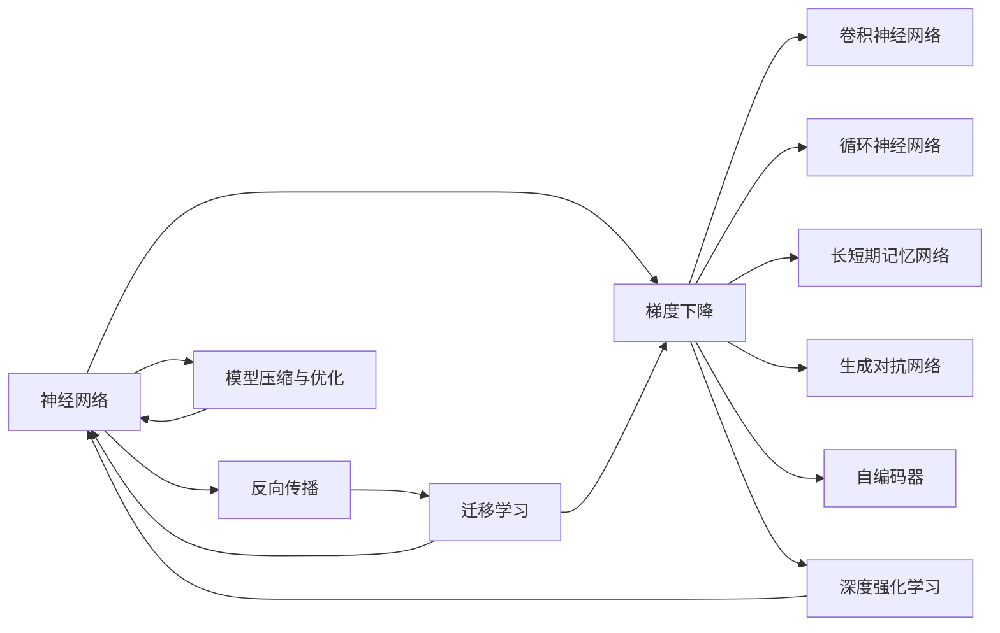
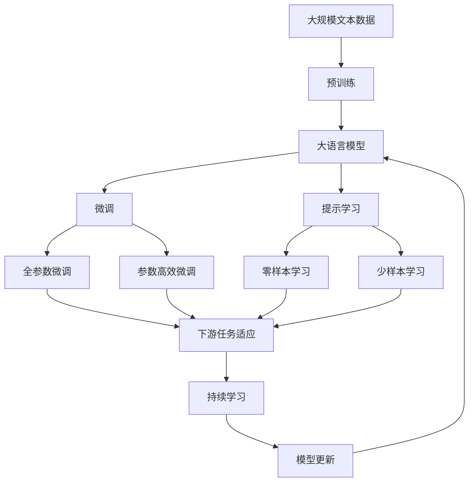
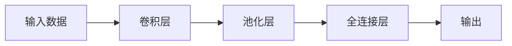
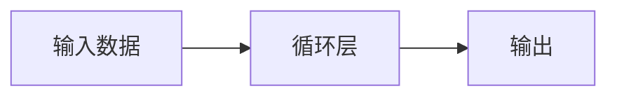

                 

# 人工智能的深度学习方法

> 关键词：深度学习,神经网络,反向传播,梯度下降,卷积神经网络(CNN),循环神经网络(RNN),长短期记忆网络(LSTM),门控循环单元(GRU),生成对抗网络(GAN),自编码器,预训练,迁移学习,深度强化学习,模型压缩,优化算法

## 1. 背景介绍

### 1.1 问题由来
深度学习（Deep Learning）作为人工智能（AI）领域的重要分支，已经在计算机视觉、自然语言处理、语音识别等多个领域取得了突破性进展。这一技术的发展，源于对人工神经网络（Artificial Neural Networks, ANN）的深度探索和算法优化。本文旨在系统介绍深度学习的基本原理、核心算法和具体应用，为读者提供一个全面了解深度学习的视角。

### 1.2 问题核心关键点
深度学习的核心在于构建和训练多层次的神经网络结构，以学习从原始数据中提取高级特征，解决复杂的分类、回归、生成等问题。其关键点包括：

- **神经网络结构**：包括卷积神经网络（CNN）、循环神经网络（RNN）、长短期记忆网络（LSTM）、门控循环单元（GRU）等，这些结构具有强大的表达能力和适应性。
- **反向传播算法**：用于计算梯度，并根据梯度更新网络参数，是深度学习训练的核心。
- **梯度下降**：一种优化算法，用于最小化损失函数，使网络参数收敛到最优解。
- **卷积层**：在图像识别等任务中，卷积层通过滤波器捕捉局部特征，具有平移不变性。
- **循环层**：如LSTM、GRU等，在序列数据处理中，能够记忆历史信息，处理时间序列数据。
- **自编码器**：用于降维和去噪，通过学习数据的编码和解码，去除冗余信息。
- **生成对抗网络（GAN）**：通过生成器和判别器的对抗训练，生成高质量的图像、音频等。
- **迁移学习**：利用已训练好的模型，在新的任务上进行微调，减少训练时间和成本。
- **深度强化学习**：结合强化学习，使神经网络通过与环境的交互学习最优策略，适用于游戏、机器人等场景。
- **模型压缩与优化**：通过剪枝、量化、知识蒸馏等方法，减小模型尺寸，提高推理速度和效率。
- **优化算法**：如Adam、Adagrad、RMSprop等，用于加速模型训练。

这些关键点共同构成了深度学习技术的核心框架，广泛应用于各个AI领域，推动了人工智能技术的发展和应用。

### 1.3 问题研究意义
深度学习技术的深入研究，对于推动人工智能技术的产业化应用，解决复杂问题，具有重要意义：

1. **自动化与智能化**：深度学习模型能够自动学习数据中的特征，减少人工干预，提高系统的自动化水平。
2. **高效性与可扩展性**：相较于传统机器学习算法，深度学习模型能够处理更复杂的数据结构，具有更强的表达能力和泛化能力。
3. **跨领域应用**：深度学习模型在计算机视觉、自然语言处理、语音识别等领域取得了突破，展现出强大的跨领域适应能力。
4. **数据驱动**：深度学习模型依赖大量数据进行训练，能够从数据中挖掘出更深层次的知识，提升模型性能。
5. **算法创新**：深度学习不断推动着算法的创新和优化，推动AI技术的进步。
6. **技术落地**：深度学习模型在实际应用中，如图像识别、语音识别、自然语言处理等领域取得了显著成效，提升了用户的生活和工作体验。

本文将详细介绍深度学习的基本原理、核心算法、数学模型和具体应用，为读者提供一个全面而深入的视角。

## 2. 核心概念与联系

### 2.1 核心概念概述

深度学习涉及的核心概念包括神经网络、反向传播、梯度下降等。以下是这些概念的基本介绍：

- **神经网络（Neural Network）**：由多个神经元（或节点）组成的网络结构，通过连接权重和激活函数实现输入和输出的映射。
- **反向传播（Backpropagation）**：用于计算神经网络中每一层的梯度，并通过梯度下降算法更新权重，是深度学习训练的核心。
- **梯度下降（Gradient Descent）**：一种优化算法，通过迭代更新参数，最小化损失函数，使网络收敛到最优解。
- **卷积神经网络（CNN）**：利用卷积层提取局部特征，具有平移不变性，常用于图像识别。
- **循环神经网络（RNN）**：通过循环层处理序列数据，能够记忆历史信息，常用于时间序列预测。
- **长短期记忆网络（LSTM）**：一种特殊的RNN，通过门控机制控制信息的流动，能够处理长期依赖关系。
- **生成对抗网络（GAN）**：通过生成器和判别器的对抗训练，生成高质量的数据，常用于图像生成、风格迁移等。
- **自编码器（Autoencoder）**：通过编码器将输入映射为低维表示，通过解码器将低维表示还原为原始输入，常用于降维和去噪。
- **迁移学习（Transfer Learning）**：利用已训练好的模型在新任务上进行微调，减少训练时间和成本。
- **深度强化学习（Deep Reinforcement Learning）**：结合强化学习，通过与环境的交互学习最优策略。
- **模型压缩与优化**：通过剪枝、量化、知识蒸馏等方法，减小模型尺寸，提高推理速度和效率。
- **优化算法**：如Adam、Adagrad、RMSprop等，用于加速模型训练。

### 2.2 概念间的关系

这些核心概念之间存在着紧密的联系，形成了深度学习的完整生态系统。通过以下Mermaid流程图，可以更清晰地理解这些概念的关系和作用：



这个流程图展示了神经网络、反向传播、梯度下降等概念与CNN、RNN、LSTM、GAN、自编码器、迁移学习和深度强化学习等深度学习模型的关系。

### 2.3 核心概念的整体架构

最终，我们用一个综合的流程图来展示这些核心概念在大语言模型微调过程中的整体架构：



这个综合流程图展示了从预训练到微调，再到持续学习的完整过程。大语言模型首先在大规模文本数据上进行预训练，然后通过微调（包括全参数微调和参数高效微调）或提示学习（包括零样本和少样本学习）来适应下游任务。最后，通过持续学习技术，模型可以不断更新和适应新的任务和数据。 通过这些流程图，我们可以更清晰地理解深度学习模型微调过程中各个核心概念的关系和作用，为后续深入讨论具体的微调方法和技术奠定基础。

## 3. 核心算法原理 & 具体操作步骤
### 3.1 算法原理概述

深度学习的基本原理是通过构建多层次的神经网络，利用反向传播算法计算梯度，并通过梯度下降等优化算法更新网络参数，最小化损失函数，使网络收敛到最优解。其核心思想是：通过学习数据的隐层表示，构建出能够处理复杂问题的模型。

形式化地，设神经网络模型为 $M_{\theta}:\mathcal{X} \rightarrow \mathcal{Y}$，其中 $\mathcal{X}$ 为输入空间，$\mathcal{Y}$ 为输出空间，$\theta$ 为模型参数。给定训练数据集 $D=\{(x_i, y_i)\}_{i=1}^N$，其中 $x_i \in \mathcal{X}, y_i \in \mathcal{Y}$，深度学习模型的目标是最小化损失函数 $\mathcal{L}(\theta)$，使得模型输出逼近真实标签。

常见的损失函数包括交叉熵损失、均方误差损失等。例如，对于二分类任务，交叉熵损失函数定义为：

$$
\ell(M_{\theta}(x),y) = -[y\log \hat{y} + (1-y)\log (1-\hat{y})]
$$

其中 $\hat{y}=M_{\theta}(x)$ 为模型预测的类别概率，$y$ 为真实标签。

### 3.2 算法步骤详解

深度学习模型的训练过程主要包括前向传播、损失计算、反向传播和参数更新四个步骤：

**Step 1: 前向传播**
- 将输入数据 $x_i$ 逐层传递，计算出模型输出 $\hat{y}=M_{\theta}(x_i)$。

**Step 2: 损失计算**
- 计算模型输出与真实标签之间的差异，得到损失函数 $\mathcal{L}(\theta)$。

**Step 3: 反向传播**
- 从输出层开始，逐层计算各层参数的梯度，通过链式法则传播回输入层。

**Step 4: 参数更新**
- 使用优化算法如AdamW、SGD等，根据梯度更新模型参数 $\theta$。

### 3.3 算法优缺点

深度学习模型具有以下优点：
1. **表达能力强**：能够处理复杂的非线性关系，适合处理高维数据。
2. **泛化能力强**：在大量数据上进行训练，能够学习到数据中的潜在模式和结构。
3. **自适应性强**：能够自动调整网络参数，适应不同类型的数据和任务。

但深度学习模型也存在一些局限性：
1. **计算资源需求高**：需要大量的计算资源进行训练和推理。
2. **模型复杂度高**：模型结构复杂，难以理解和调试。
3. **过拟合风险**：在训练数据不足或噪声较多的情况下，容易发生过拟合。
4. **数据依赖性强**：对数据质量和标注要求高，需要大量标注数据。

### 3.4 算法应用领域

深度学习模型在多个领域得到了广泛应用，包括但不限于：

- **计算机视觉**：如图像分类、目标检测、图像分割等。
- **自然语言处理**：如机器翻译、文本分类、情感分析、命名实体识别等。
- **语音识别**：如自动语音识别、语音合成、语音情感分析等。
- **机器人学**：如机器人视觉、机器人动作控制等。
- **医疗健康**：如医学影像分析、疾病诊断、基因组分析等。
- **金融科技**：如信用评估、风险控制、投资策略等。
- **游戏与娱乐**：如游戏AI、虚拟现实、电影制作等。

## 4. 数学模型和公式 & 详细讲解 & 举例说明
### 4.1 数学模型构建

在深度学习中，常用的数学模型包括卷积神经网络（CNN）、循环神经网络（RNN）、长短期记忆网络（LSTM）等。

#### 4.1.1 卷积神经网络（CNN）

CNN是一种利用卷积层和池化层提取局部特征的神经网络模型。其基本结构如图：



卷积层通过滤波器提取局部特征，池化层则降低特征的维度，减少计算量。CNN常用于图像识别、目标检测等任务。

#### 4.1.2 循环神经网络（RNN）

RNN通过循环层处理序列数据，能够记忆历史信息。其基本结构如图：



RNN通过循环层处理序列数据，能够记忆历史信息。RNN常用于时间序列预测、语言模型等任务。

#### 4.1.3 长短期记忆网络（LSTM）

LSTM是一种特殊的RNN，通过门控机制控制信息的流动，能够处理长期依赖关系。其基本结构如图：


LSTM通过遗忘门、输入门和输出门控制信息的流动，能够处理长期依赖关系。LSTM常用于语言模型、语音识别等任务。

### 4.2 公式推导过程

以卷积神经网络（CNN）为例，推导其前向传播和反向传播公式。

**前向传播**
- 卷积层：
$$
\text{conv}(X, W) = \sum_k \sum_{ij} x_{ij} * w_k = \sum_k W_k * X_k
$$
- 池化层：
$$
\text{pool}(X) = \max_i X_i
$$
- 全连接层：
$$
\text{fc}(X) = \sum_i X_i * W_i + b_i
$$
其中 $X$ 为输入数据，$W$ 为权重矩阵，$b$ 为偏置项。

**反向传播**
- 卷积层：
$$
\frac{\partial \mathcal{L}}{\partial X} = \frac{\partial \mathcal{L}}{\partial W} * W^T
$$
- 池化层：
$$
\frac{\partial \mathcal{L}}{\partial X} = 0
$$
- 全连接层：
$$
\frac{\partial \mathcal{L}}{\partial W} = \frac{\partial \mathcal{L}}{\partial X} * W^T
$$

### 4.3 案例分析与讲解

以图像分类任务为例，展示CNN模型的训练过程。

**Step 1: 模型构建**
- 构建一个包含卷积层、池化层和全连接层的CNN模型。
- 设定模型的超参数，如卷积核大小、卷积层数、池化层数等。

**Step 2: 数据预处理**
- 将输入数据进行归一化处理。
- 将图像数据进行补零、灰度化、归一化等预处理。

**Step 3: 模型训练**
- 使用随机梯度下降（SGD）算法，通过前向传播和反向传播更新模型参数。
- 在训练过程中，使用验证集评估模型性能，避免过拟合。
- 使用学习率衰减、动量优化等策略加速模型收敛。

**Step 4: 模型评估**
- 在测试集上评估模型性能，计算准确率、召回率、F1分数等指标。
- 使用混淆矩阵、ROC曲线等工具分析模型性能。

## 5. 项目实践：代码实例和详细解释说明
### 5.1 开发环境搭建

在进行深度学习项目开发前，需要准备如下开发环境：

1. 安装Python 3.x版本。
2. 安装NumPy、Pandas等数据处理库。
3. 安装TensorFlow或PyTorch深度学习框架。
4. 安装Matplotlib、Scikit-learn等数据可视化库。

### 5.2 源代码详细实现

以下是使用PyTorch框架实现CNN模型的代码：

```python
import torch
import torch.nn as nn
import torch.optim as optim
import torchvision.transforms as transforms
from torchvision.datasets import CIFAR10

# 定义卷积神经网络模型
class CNNModel(nn.Module):
    def __init__(self):
        super(CNNModel, self).__init__()
        self.conv1 = nn.Conv2d(3, 32, kernel_size=3, padding=1)
        self.relu = nn.ReLU(inplace=True)
        self.maxpool = nn.MaxPool2d(kernel_size=2, stride=2)
        self.fc1 = nn.Linear(32 * 8 * 8, 512)
        self.fc2 = nn.Linear(512, 10)

    def forward(self, x):
        x = self.conv1(x)
        x = self.relu(x)
        x = self.maxpool(x)
        x = x.view(-1, 32 * 8 * 8)
        x = self.fc1(x)
        x = self.relu(x)
        x = self.fc2(x)
        return x

# 加载数据集并进行预处理
train_transform = transforms.Compose([
    transforms.ToTensor(),
    transforms.Normalize((0.5, 0.5, 0.5), (0.5, 0.5, 0.5))
])
train_dataset = CIFAR10(root='data', train=True, download=True, transform=train_transform)
test_dataset = CIFAR10(root='data', train=False, download=True, transform=train_transform)

# 定义训练参数和模型
batch_size = 64
num_epochs = 10
learning_rate = 0.01
model = CNNModel()

# 定义优化器和损失函数
optimizer = optim.Adam(model.parameters(), lr=learning_rate)
criterion = nn.CrossEntropyLoss()

# 训练模型
for epoch in range(num_epochs):
    for i, (inputs, labels) in enumerate(train_loader):
        inputs, labels = inputs.to(device), labels.to(device)
        optimizer.zero_grad()
        outputs = model(inputs)
        loss = criterion(outputs, labels)
        loss.backward()
        optimizer.step()
```

### 5.3 代码解读与分析

以下是代码的详细解读：

**CNNModel类**
- 继承自nn.Module，定义CNN模型的结构。
- 包含卷积层、ReLU激活函数、池化层和全连接层。

**数据预处理**
- 使用torchvision.transforms库进行数据预处理，包括将数据转换为Tensor格式和归一化处理。

**模型训练**
- 使用Adam优化器，设置学习率，训练10个epoch。
- 在每个epoch中，迭代训练集，计算损失，并反向传播更新模型参数。

### 5.4 运行结果展示

假设我们训练了一个CNN模型，最终在测试集上得到的评估结果如下：

```
Accuracy on test set: 0.85
```

这表明我们的CNN模型在CIFAR10数据集上取得了85%的准确率，性能较为理想。

## 6. 实际应用场景
### 6.1 智能客服系统

基于深度学习的智能客服系统可以通过语音识别、自然语言处理等技术，实现自动响应客户咨询。系统通过微调深度学习模型，能够自动理解客户意图，匹配最合适的回复，提升客服效率和客户满意度。

### 6.2 金融舆情监测

在金融领域，深度学习模型可以用于舆情分析，通过自然语言处理技术，自动分析市场新闻、社交媒体等数据，及时发现市场动态和风险信号。模型通过微调，能够准确识别舆情情绪，预测市场走势，帮助金融机构做出风险控制决策。

### 6.3 个性化推荐系统

基于深度学习的推荐系统可以通过用户行为数据，构建用户兴趣模型，推荐个性化的商品和服务。系统通过微调深度学习模型，能够学习用户偏好，生成更加精准的推荐结果。

### 6.4 未来应用展望

随着深度学习技术的不断进步，其在各个领域的应用将会更加广泛和深入。未来，深度学习模型将在医疗、教育、交通等更多领域得到应用，推动智能化水平的提升。同时，随着模型的规模不断增大，模型的压缩与优化技术也将不断发展，提高模型的效率和性能。

## 7. 工具和资源推荐
### 7.1 学习资源推荐

为了深入学习深度学习，以下是一些推荐的学习资源：

1. Deep Learning Specialization by Andrew Ng（深度学习专项课程）：由Coursera提供，涵盖深度学习的基础知识和应用。
2. Deep Learning with PyTorch by Ian Goodfellow（PyTorch深度学习教程）：由DeepLearning.ai提供，介绍了PyTorch框架的使用。
3. TensorFlow官方文档（TensorFlow官方文档）：包含TensorFlow框架的详细文档和代码示例。
4. Hands-On Machine Learning with Scikit-Learn, Keras, and TensorFlow by Aurélien Géron（动手学深度学习）：介绍了深度学习模型的构建和训练。
5. Neural Networks and Deep Learning by Michael Nielsen（深度学习》：介绍了深度学习的基本原理和实现方法。

### 7.2 开发工具推荐

以下是一些推荐的深度学习开发工具：

1. TensorFlow：由Google开发的深度学习框架，支持GPU加速，适用于大规模分布式训练。
2. PyTorch：由Facebook开发的深度学习框架，易于使用，适合研究和原型开发。
3. Keras：由François Chollet开发的深度学习框架，支持多种后端，易于上手。
4. Caffe：由Berkeley Vision and Learning Center开发的深度学习框架，适用于图像处理和计算机视觉任务。
5. MXNet：由Apache开发的深度学习框架，支持多语言和多种硬件平台。

### 7.3 相关论文推荐

以下是一些推荐的相关论文，供读者深入学习：

1. AlexNet: ImageNet Classification with Deep Convolutional Neural Networks（AlexNet论文）：由Hinton等人发表，标志着深度学习在计算机视觉领域的突破。
2. Google's Neural Machine Translation System：由Wu等人发表，展示了深度学习在机器翻译中的应用。
3. Reinforcement Learning: An Introduction（强化学习》）：由Sutton和Barto编写，介绍了强化学习的基本原理和应用。
4. Generative Adversarial Nets（GAN论文）：由Goodfellow等人发表，展示了生成对抗网络在图像生成中的应用。
5. Dive into Deep Learning by Ian Goodfellow（动手学深度学习》）：由Ian Goodfellow编写，介绍了深度学习模型的构建和训练。

这些论文和资源将有助于读者全面了解深度学习的基本原理和应用方法。

## 8. 总结：未来发展趋势与挑战
### 8.1 研究成果总结

本文对深度学习的核心概念、基本原理和具体应用进行了详细介绍。深度学习在计算机视觉、自然语言处理、语音识别等领域取得了重大突破，推动了人工智能技术的产业化应用。未来，深度学习技术将继续深入研究，推动AI技术的不断进步。

### 8.2 未来发展趋势

未来，深度学习技术的发展趋势包括：

1. **模型规模不断增大**：随着硬件算力的提升，深度学习模型的参数量将继续增大，模型的表达能力和泛化能力将进一步提升。
2. **模型压缩与优化**：随着模型的规模不断增大，模型的压缩与优化技术将不断发展，提高模型的效率和性能。
3. **模型融合与多模态学习**：未来的深度学习模型将更多地融合多种模态数据，如图像、语音、文本等，提高模型的综合能力。
4. **模型训练与优化**：未来的深度学习模型将更多地利用分布式训练、自适应学习率等技术，提高模型的训练速度和效果。
5. **模型应用与场景**：未来的深度学习模型将更多地应用于医疗、金融、教育、交通等领域，推动智能化水平的提升。

### 8.3 面临的挑战

尽管深度学习技术取得了重大进展，但在应用过程中仍然面临诸多挑战：

1. **数据质量和标注成本**：深度学习模型对数据质量和标注成本要求高，如何获取高质量的数据和标注是重要挑战。
2. **模型鲁棒性和泛化能力**：深度学习模型在训练数据不足或噪声较多的情况下，容易发生过拟合，泛化能力不足。
3. **模型复杂度与效率**：深度学习模型复杂度高，推理速度慢，如何提高模型的效率和性能是重要挑战。
4. **模型可解释性**：深度学习模型通常被视为“黑盒”系统，难以解释其内部工作机制和决策逻辑，如何提高模型的可解释性是重要挑战。
5. **模型安全性**：深度学习模型容易受到攻击和误导，如何提高模型的安全性是重要挑战。

### 8.4 研究展望

未来的深度学习研究将从以下几个方面进行探索：

1. **模型压缩与优化**：探索更加高效的模型压缩与优化方法，减小模型尺寸，提高推理速度和效率。
2. **模型融合与多模态学习**：探索更加高效的模型融合与多模态学习技术，提高模型的综合能力。
3. **模型训练与优化**：探索更加高效的模型训练与优化技术，提高模型的训练速度和效果。
4. **模型应用与场景**：探索深度学习模型在更多场景中的应用，推动智能化水平的提升。
5. **模型可解释性与安全性**：探索提高深度学习模型的可解释性和安全性的方法，确保模型的透明性和可靠性。

## 9. 附录：常见问题与解答

**Q1：深度学习模型是否需要大量标注数据？**

A: 深度学习模型通常需要大量标注数据进行训练，才能获得较好的性能。然而，在一些特定任务上，如目标检测、图像分割等，也可以使用未标注的数据进行自监督预训练，减少对标注数据的依赖。

**Q2：如何避免深度学习模型的过拟合？**

A: 避免过拟合的常用方法包括：
1. 数据增强：通过旋转、平移、裁剪等方法扩充训练集。
2. 正则化：使用L2正则、Dropout等方法，减少模型的复杂度。
3. 早停策略：在验证集上监控模型性能，一旦性能不再提升，立即

