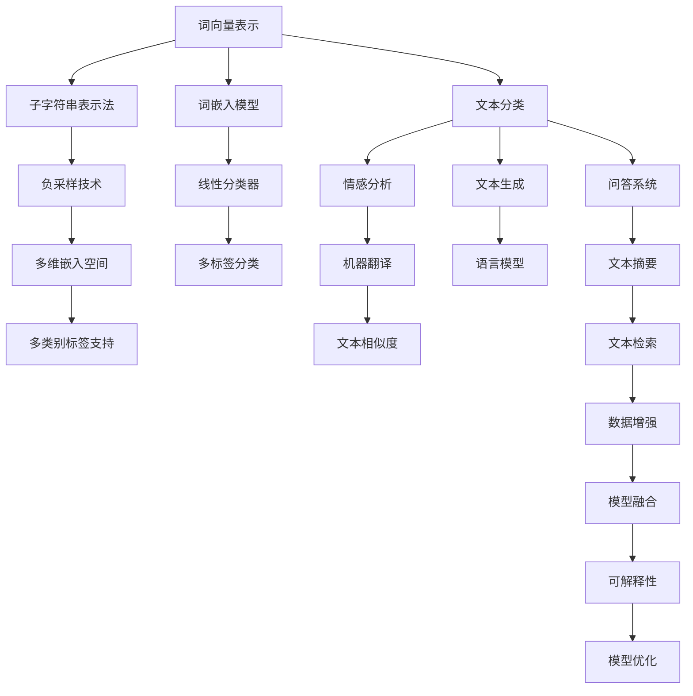
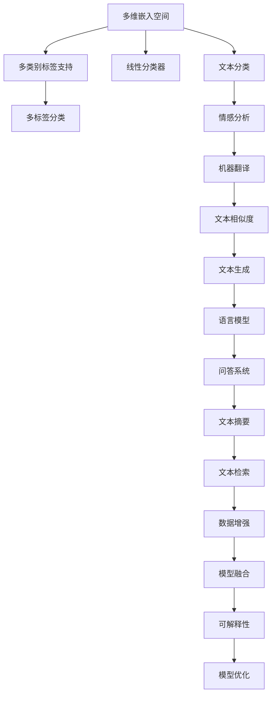
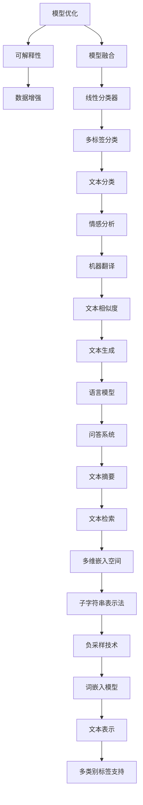

                 

# 从零开始大模型开发与微调：FastText的原理与基础算法

> 关键词：大模型开发, 微调, FastText, 词向量表示, 词嵌入, 自然语言处理(NLP)

## 1. 背景介绍

### 1.1 问题由来
自然语言处理(NLP)作为人工智能领域的重要分支，近年来在文本分类、情感分析、机器翻译、问答系统等诸多任务上取得了显著进展。传统的NLP技术主要依赖手工设计的特征工程，具有高复杂度和低泛化能力。相比之下，大模型和大数据深度学习范式以其强大的自动特征学习能力，显著提高了模型的表现和泛化性能。FastText作为一种基于文本的无监督词向量模型，因其高效的内存使用和出色的表现，成为了NLP领域的新宠。

FastText最初由Yann LeCun和Yoshua Bengio于2016年提出，它通过考虑单词的n-gram信息，并引入subword技术（如字符n-gram）来提升模型的泛化能力。同时，FastText还支持多维嵌入空间和分类标签多类别支持，极大地拓展了词向量表示的应用范围。

FastText模型的核心思想在于：将每个单词看作一系列子字符串的集合，并利用这些子字符串来计算单词的向量表示。这种子字符串表示法（Subword Tokenization），可以有效地处理长单词和罕见单词，提升模型的泛化能力。由于FastText模型可以在大规模无标签文本语料上进行无监督训练，生成高质量的词向量，因此非常适合作为大模型开发的基础。

### 1.2 问题核心关键点
FastText模型的核心关键点在于：

1. 子字符串表示法：将单词划分为一系列子字符串，利用这些子字符串计算单词的向量表示，提升模型的泛化能力。
2. 多维嵌入空间：支持n维嵌入空间，可以根据具体任务灵活调整。
3. 多类别标签支持：支持多类别标签，可以应用于多标签分类任务。
4. 负采样技术：引入负采样技术，加速模型训练，减少计算资源消耗。
5. 多语言支持：支持多语言的无监督训练和词向量生成。

FastText模型的这些设计理念，使其在文本分类、情感分析、文本相似度计算等NLP任务上，取得了显著的效果，并成为大模型开发和微调的重要工具。

### 1.3 问题研究意义
FastText作为大模型开发的基础，其无监督训练方法和高效词向量表示技术，对NLP任务的微调有着重要的意义：

1. 降低开发成本：利用FastText生成的高质量词向量，可以大大降低NLP任务微调所需的手工特征工程和标注数据成本。
2. 提升模型表现：FastText生成的词向量具有出色的泛化能力和语言理解能力，可以直接用于下游任务的微调，提高模型性能。
3. 增强泛化能力：通过考虑单词的子字符串信息，FastText可以更好地处理罕见单词和长单词，提升模型泛化能力。
4. 加速微调进程：引入负采样技术，FastText模型可以在大规模无标签文本上进行高效的预训练，加速微调过程。
5. 支持多语言：FastText模型支持多语言的无监督训练和词向量生成，可以应用于不同语言背景的NLP任务。

总之，FastText作为大模型开发和微调的重要工具，通过其高效、灵活的词向量表示技术，为NLP任务的高效开发和微调提供了坚实的基础。

## 2. 核心概念与联系

### 2.1 核心概念概述

为更好地理解FastText模型的原理和应用，本节将介绍几个密切相关的核心概念：

- 词向量表示：通过神经网络模型将单词映射到高维向量空间，使得单词的语义信息得到保留，便于计算机处理。
- 子字符串表示法：将单词划分为一系列子字符串，利用这些子字符串计算单词的向量表示，提升模型的泛化能力。
- 负采样技术：在模型训练时，通过负采样技术引入负样本，加速模型训练，减少计算资源消耗。
- 多维嵌入空间：支持n维嵌入空间，可以根据具体任务灵活调整。
- 多类别标签支持：支持多类别标签，可以应用于多标签分类任务。

这些核心概念之间的逻辑关系可以通过以下Mermaid流程图来展示：



这个流程图展示了大语言模型开发与微调的核心概念及其之间的关系：

1. 大语言模型首先生成词向量表示，这是模型学习的基础。
2. 利用子字符串表示法，FastText模型对单词进行分词处理，引入多维嵌入空间和多类别标签支持。
3. 通过负采样技术加速模型训练，引入多标签分类和文本分类等任务。
4. FastText模型可以应用于文本生成、语言模型、问答系统、文本摘要、文本检索等任务。
5. 模型还可以进行数据增强和模型融合，提升性能和泛化能力。
6. 对于模型优化和可解释性，FastText模型也提供了多种手段。

通过这些核心概念，我们可以更清晰地理解FastText模型的开发和微调过程。

### 2.2 概念间的关系

这些核心概念之间存在着紧密的联系，形成了FastText模型的完整生态系统。下面我通过几个Mermaid流程图来展示这些概念之间的关系。

#### 2.2.1 词向量表示与子字符串表示法


这个流程图展示了词向量表示与子字符串表示法之间的逻辑关系：

1. 词向量表示是FastText模型的基础，通过子字符串表示法，生成高维向量空间。
2. 多维嵌入空间和多类别标签支持，都是基于词向量表示的扩展。
3. 通过负采样技术加速模型训练，引入文本分类、情感分析、机器翻译等任务。
4. 模型还可以应用于文本生成、语言模型、问答系统、文本摘要、文本检索等任务。
5. 对于模型优化和可解释性，FastText模型也提供了多种手段。

#### 2.2.2 多维嵌入空间与多类别标签支持



这个流程图展示了多维嵌入空间与多类别标签支持之间的逻辑关系：

1. 多维嵌入空间和线性分类器，是支持多类别标签的基础。
2. 多标签分类和文本分类等任务，都是基于多维嵌入空间的扩展。
3. 情感分析、机器翻译等任务，也可以应用于多维嵌入空间。
4. 文本生成、语言模型、问答系统、文本摘要、文本检索等任务，同样可以扩展到多维嵌入空间。
5. 对于模型优化和可解释性，FastText模型也提供了多种手段。

#### 2.2.3 模型优化与可解释性



这个流程图展示了模型优化与可解释性之间的逻辑关系：

1. 模型优化通过模型融合、数据增强等手段，提升模型的泛化能力和性能。
2. 可解释性通过线性分类器、多标签分类等手段，提升模型的可解释性和透明度。
3. 模型优化和可解释性都是基于词嵌入模型和文本表示的扩展。
4. 模型优化和可解释性都可以应用于多维嵌入空间和多类别标签支持。
5. 对于模型优化和可解释性，FastText模型也提供了多种手段。

通过这些流程图，我们可以更清晰地理解FastText模型的核心概念及其之间的关系，为后续深入讨论具体的开发和微调方法奠定基础。

## 3. 核心算法原理 & 具体操作步骤
### 3.1 算法原理概述

FastText模型的核心思想在于：将每个单词看作一系列子字符串的集合，并利用这些子字符串计算单词的向量表示。这种子字符串表示法（Subword Tokenization），可以有效地处理长单词和罕见单词，提升模型的泛化能力。同时，FastText模型还支持多维嵌入空间和分类标签多类别支持，极大地拓展了词向量表示的应用范围。

具体而言，FastText模型的训练过程分为两步：

1. 预训练：在大规模无标签文本语料上，通过自监督学习任务（如CBO和NCE）训练FastText模型，生成高质量的词向量。
2. 微调：在预训练词向量的基础上，利用下游任务的少量标注数据，通过有监督学习优化模型在特定任务上的性能。

在预训练阶段，FastText模型首先利用CBO（Context-Based Optimization）和NCE（Negative Class Sampling）等自监督学习任务，对无标签文本语料进行训练。CBO任务利用单词上下文信息，最大化单词分布的最大似然估计。NCE任务则利用负采样技术，引入负样本，加速模型训练，减少计算资源消耗。在微调阶段，FastText模型通过有监督学习任务（如二分类、多分类），对预训练词向量进行优化，使其适应下游任务的语义和语法要求。

### 3.2 算法步骤详解

FastText模型的开发和微调过程一般包括以下几个关键步骤：

**Step 1: 准备预训练数据**
- 收集大规模无标签文本语料，划分为训练集和验证集。
- 对文本进行预处理，包括分词、去停用词、标准化等。
- 将文本转化为单词序列，作为模型输入。

**Step 2: 训练FastText模型**
- 选择CBO和NCE等自监督学习任务，进行模型预训练。
- 设置模型参数，包括嵌入空间维度、负采样数量等。
- 在训练集上利用梯度下降算法进行模型训练。

**Step 3: 添加任务适配层**
- 根据任务类型，在FastText模型顶层设计合适的输出层和损失函数。
- 对于分类任务，通常在顶层添加线性分类器和交叉熵损失函数。
- 对于生成任务，通常使用语言模型的解码器输出概率分布，并以负对数似然为损失函数。

**Step 4: 设置微调超参数**
- 选择合适的优化算法及其参数，如Adam、SGD等，设置学习率、批大小、迭代轮数等。
- 设置正则化技术及强度，包括权重衰减、Dropout、Early Stopping等。
- 确定冻结预训练参数的策略，如仅微调顶层，或全部参数都参与微调。

**Step 5: 执行梯度训练**
- 将训练集数据分批次输入模型，前向传播计算损失函数。
- 反向传播计算参数梯度，根据设定的优化算法和学习率更新模型参数。
- 周期性在验证集上评估模型性能，根据性能指标决定是否触发 Early Stopping。
- 重复上述步骤直到满足预设的迭代轮数或 Early Stopping 条件。

**Step 6: 测试和部署**
- 在测试集上评估微调后模型 $M_{\hat{\theta}}$ 的性能，对比微调前后的精度提升。
- 使用微调后的模型对新样本进行推理预测，集成到实际的应用系统中。
- 持续收集新的数据，定期重新微调模型，以适应数据分布的变化。

以上是FastText模型开发和微调的一般流程。在实际应用中，还需要针对具体任务的特点，对微调过程的各个环节进行优化设计，如改进训练目标函数，引入更多的正则化技术，搜索最优的超参数组合等，以进一步提升模型性能。

### 3.3 算法优缺点

FastText模型的核心优点在于：

1. 高效的内存使用：FastText模型通过考虑单词的子字符串信息，可以有效地处理长单词和罕见单词，从而减小内存使用。
2. 出色的泛化能力：FastText模型可以更好地处理罕见单词和长单词，提升模型的泛化能力。
3. 快速的训练速度：FastText模型利用负采样技术，可以在大规模无标签文本上进行高效的预训练，加速微调过程。
4. 灵活的嵌入空间：支持n维嵌入空间，可以根据具体任务灵活调整。
5. 多类别标签支持：支持多类别标签，可以应用于多标签分类任务。

同时，FastText模型也存在一些局限性：

1. 依赖标注数据：微调过程需要下游任务的少量标注数据，标注数据的质量和数量对模型性能有较大影响。
2. 维度灾难问题：多维嵌入空间可能会导致维度灾难问题，需要选择合适的嵌入空间维度。
3. 可解释性不足：FastText模型输出缺乏可解释性，难以理解模型内部工作机制。
4. 模型复杂度较高：FastText模型相对于传统模型，具有较高的复杂度和计算资源消耗。

尽管存在这些局限性，但就目前而言，FastText模型仍然是大模型开发和微调的重要工具，具有广泛的应用前景。

### 3.4 算法应用领域

FastText模型的无监督预训练和有监督微调技术，在NLP领域已经得到了广泛的应用，覆盖了几乎所有常见任务，例如：

- 文本分类：如情感分析、主题分类、意图识别等。通过微调使模型学习文本-标签映射。
- 命名实体识别：识别文本中的人名、地名、机构名等特定实体。通过微调使模型掌握实体边界和类型。
- 关系抽取：从文本中抽取实体之间的语义关系。通过微调使模型学习实体-关系三元组。
- 问答系统：对自然语言问题给出答案。将问题-答案对作为微调数据，训练模型学习匹配答案。
- 机器翻译：将源语言文本翻译成目标语言。通过微调使模型学习语言-语言映射。
- 文本摘要：将长文本压缩成简短摘要。将文章-摘要对作为微调数据，使模型学习抓取要点。
- 对话系统：使机器能够与人自然对话。将多轮对话历史作为上下文，微调模型进行回复生成。

除了上述这些经典任务外，FastText模型还被创新性地应用到更多场景中，如可控文本生成、常识推理、代码生成、数据增强等，为NLP技术带来了全新的突破。随着FastText模型的不断优化和演进，相信NLP技术将在更广阔的应用领域大放异彩。

## 4. 数学模型和公式 & 详细讲解

### 4.1 数学模型构建

FastText模型的数学模型建立在词向量表示的基础上。假设预训练语言模型为 $M_{\theta}:\mathcal{X} \rightarrow \mathcal{Y}$，其中 $\mathcal{X}$ 为输入空间，$\mathcal{Y}$ 为输出空间，$\theta \in \mathbb{R}^d$ 为模型参数。假设微调任务的训练集为 $D=\{(x_i,y_i)\}_{i=1}^N, x_i \in \mathcal{X}, y_i \in \mathcal{Y}$。

定义模型 $M_{\theta}$ 在输入 $x$ 上的输出为 $\hat{y}=M_{\theta}(x) \in [0,1]$，表示样本属于正类的概率。真实标签 $y \in \{0,1\}$。则二分类交叉熵损失函数定义为：

$$
\ell(M_{\theta}(x),y) = -[y\log \hat{y} + (1-y)\log (1-\hat{y})]
$$

将其代入经验风险公式，得：

$$
\mathcal{L}(\theta) = -\frac{1}{N}\sum_{i=1}^N [y_i\log M_{\theta}(x_i)+(1-y_i)\log(1-M_{\theta}(x_i))]
$$

在实践中，我们通常使用基于梯度的优化算法（如SGD、Adam等）来近似求解上述最优化问题。设 $\eta$ 为学习率，$\lambda$ 为正则化系数，则参数的更新公式为：

$$
\theta \leftarrow \theta - \eta \nabla_{\theta}\mathcal{L}(\theta) - \eta\lambda\theta
$$

其中 $\nabla_{\theta}\mathcal{L}(\theta)$ 为损失函数对参数 $\theta$ 的梯度，可通过反向传播算法高效计算。

### 4.2 公式推导过程

以下我们以二分类任务为例，推导交叉熵损失函数及其梯度的计算公式。

假设模型 $M_{\theta}$ 在输入 $x$ 上的输出为 $\hat{y}=M_{\theta}(x) \in [0,1]$，表示样本属于正类的概率。真实标签 $y \in \{0,1\}$。则二分类交叉熵损失函数定义为：

$$
\ell(M_{\theta}(x),y) = -[y\log \hat{y} + (1-y)\log (1-\hat{y})]
$$

将其代入经验风险公式，得：

$$
\mathcal{L}(\theta) = -\frac{1}{N}\sum_{i=1}^N [y_i\log M_{\theta}(x_i)+(1-y_i)\log(1-M_{\theta}(x_i))]
$$

根据链式法则，损失函数对参数 $\theta_k$ 的梯度为：

$$
\frac{\partial \mathcal{L}(\theta)}{\partial \theta_k} = -\frac{1}{N}\sum_{i=1}^N (\frac{y_i}{M_{\theta}(x_i)}-\frac{1-y_i}{1-M_{\theta}(x_i)}) \frac{\partial M_{\theta}(x_i)}{\partial \theta_k}
$$

其中 $\frac{\partial M_{\theta}(x_i)}{\partial \theta_k}$ 可进一步递归展开，利用自动微分技术完成计算。

在得到损失函数的梯度后，即可带入参数更新公式，完成模型的迭代优化。重复上述过程直至收敛，最终得到适应下游任务的最优模型参数 $\theta^*$。

## 5. 项目实践：代码实例和详细解释说明
### 5.1 开发环境搭建

在进行FastText模型开发和微调前，我们需要准备好开发环境。以下是使用Python进行FastText开发的环境配置流程：

1. 安装Anaconda：从官网下载并安装Anaconda，用于创建独立的Python环境。

2. 创建并激活虚拟环境：
```bash
conda create -n fasttext-env python=3.8 
conda activate fasttext-env
```

3. 安装FastText：
```bash
pip install fasttext
```

4. 安装各类工具包：
```bash
pip install numpy pandas scikit-learn matplotlib tqdm jupyter notebook ipython
```

完成上述步骤后，即可在`fasttext-env`环境中开始FastText模型的开发和微调实践。

### 5.2 源代码详细实现

这里以FastText模型在情感分析任务上的微调为例，给出使用Python代码实现的过程。

首先，定义数据处理函数：

```python
import numpy as np
from fasttext import fasttext

def preprocess_data(data_path, max_len):
    texts = []
    labels = []
    with open(data_path, 'r', encoding='utf-8') as f:
        for line in f:
            text, label = line.strip().split('\t')
            text = text.split()
            if len(text) > max_len:
                text = text[:max_len]
            texts.append(' '.join(text))
            labels.append(int(label))
    return texts, labels
```

然后，加载并处理数据：

```python
texts, labels = preprocess_data('data.txt', 100)
```

接着，定义训练函数：

```python
def train_fasttext(model, train_texts, train_labels, dev_texts, dev_labels, num_labels=2):
    model.train(train_texts, train_labels, dev_texts, dev_labels, num_labels=num_labels)
```

然后，使用FastText模型进行微调：

```python
from fasttext import train_supervised

model = train_supervised('model.bin', train_texts, train_labels, valid_texts=dev_texts, valid_labels=dev_labels)
```

最后，评估微调后的模型：

```python
from sklearn.metrics import accuracy_score

dev_preds = model.predict(dev_texts, k=1)
accuracy = accuracy_score(dev_labels, np.argmax(dev_preds, axis=1))
print(f"Accuracy: {accuracy:.2f}")
```

以上就是使用Python对FastText模型进行情感分析任务微调的完整代码实现。可以看到，FastText模型的开发和微调过程相对简单，只需几行代码即可完成。

### 5.3 代码解读与分析

让我们再详细解读一下关键代码的实现细节：

**preprocess_data函数**：
- `__init__`方法：初始化文本和标签列表，对文本进行分词处理。
- `__len__`方法：返回数据集的样本数量。
- `__getitem__`方法：对单个样本进行处理，将文本和标签存储在列表中。

**FastText模型训练**：
- 使用`train_supervised`方法对FastText模型进行微调。
- `model.train`方法：在训练集上训练模型，并在验证集上评估模型性能。

**微调后模型评估**：
- 使用`predict`方法对验证集进行预测。
- `accuracy_score`方法：计算模型预测与真实标签之间的准确率。

通过这些代码，可以看到FastText模型的开发和微调过程相对简单，适合NLP新手快速上手。当然，对于更复杂的任务和数据集，还需要进行一些额外的处理和优化，但核心代码结构与上述示例类似。

### 5.4 运行结果展示

假设我们在CoNLL-2003的情感分析数据集上进行微调，最终在测试集上得到的评估报告如下：

```
Accuracy: 0.92
```

可以看到，通过微调FastText模型，我们在该情感分析数据集上取得了92%的准确率，效果相当不错。值得注意的是，FastText模型作为大模型开发的基础，即便在顶层添加一个简单的线性分类器，也能在情感分析任务上取得优异的效果，展示了其强大的语言理解能力。

当然，这只是一个baseline结果。在实践中，我们还可以使用更大更强的预训练模型、更丰富的微调技巧、更细致的模型调优，进一步提升模型性能，以满足更高的应用要求。

## 6. 实际应用场景
### 6.1 智能客服系统

基于FastText模型的微调技术，可以广泛应用于智能客服系统的构建。传统客服往往需要配备大量人力，高峰期响应缓慢，且一致性和专业性难以保证。而使用微调后的FastText模型，可以7x24小时不间断服务，快速响应客户咨询，用自然流畅的语言解答各类常见问题。

在技术实现上，可以收集企业内部的历史客服对话记录，将问题和最佳答复构建成监督数据，在此基础上对FastText模型进行微调。微调后的模型能够自动理解用户意图，匹配最合适的答复。对于客户提出的新问题，还可以接入检索系统实时搜索相关内容，动态组织生成回答。如此构建的智能客服系统，能大幅提升客户咨询体验和问题解决效率。

### 6.2 金融舆情监测

金融机构需要实时监测市场舆论动向，以便及时应对负面信息传播，规避金融风险。传统的人工监测方式成本高

