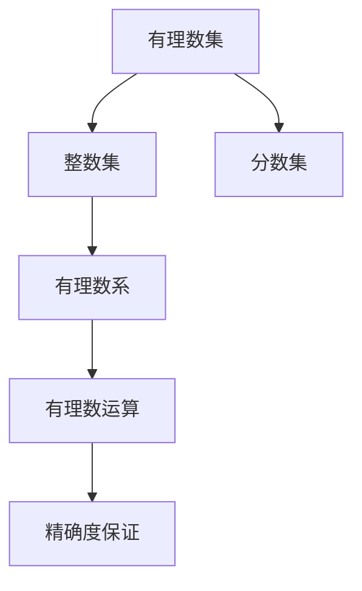
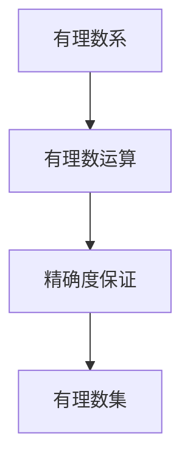
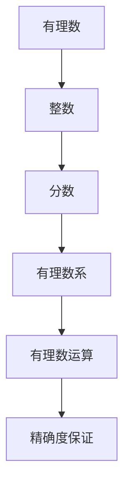

                 

# 线性代数导引：有理数及其算术运算

> 关键词：有理数, 有理数集, 有理数运算, 有理数系, 线性代数, 数学分析

## 1. 背景介绍

### 1.1 问题由来
在数学和计算机科学中，有理数是所有形式为 $\dfrac{p}{q}$ 的数，其中 $p$ 和 $q$ 均为整数且 $q \neq 0$。有理数与实数、复数共同构成了实数域。有理数在科学计算、工程设计、金融分析、计算机代数等领域都有广泛的应用，特别是在数值计算、线性代数和数学分析中，有理数扮演着重要角色。

在实际应用中，由于计算机内部存储、计算的精度限制，往往需要对有理数进行近似表示和运算。这一过程涉及到有理数的精确表示、算术运算以及与浮点数之间的转换。

### 1.2 问题核心关键点
有理数的算术运算主要涉及加、减、乘、除四则运算。由于计算机内部使用二进制表示，因此在有理数的算术运算中，需要将有理数转化为二进制形式，并通过位运算来实现加、减、乘、除等操作。这一过程不仅要考虑数值的精确度，还要考虑算法的效率。

有理数的算术运算和浮点数（如 IEEE 754）的算术运算有很大不同。浮点数的算术运算涉及到舍入误差、精度损失等复杂问题，而有理数的运算可以保证精确度。因此，有理数的运算在科学计算、工程设计等领域具有重要意义。

### 1.3 问题研究意义
研究有理数的算术运算，对于理解计算机内部数据表示、提升数值计算精度、优化算法效率具有重要意义。掌握有理数的精确表示和运算方法，对于从事科学计算、数值分析、计算机代数等领域的研究者来说，是必不可少的基础知识。

此外，有理数运算还可以帮助理解浮点数算术的局限性和优化方向，促进计算机科学和数学的交叉融合。通过深入研究有理数的算术运算，可以更深入地理解计算机科学中的数值计算问题，推动科学计算和工程设计的技术进步。

## 2. 核心概念与联系

### 2.1 核心概念概述

为更好地理解有理数的算术运算，本节将介绍几个关键概念：

- 有理数集：所有形式为 $\dfrac{p}{q}$ 的数的集合，其中 $p$ 和 $q$ 均为整数且 $q \neq 0$。有理数集与整数集和分数集密切相关。
- 有理数系：在有理数集基础上，通过加、减、乘、除等四则运算，可以构建一个封闭的代数系统。有理数系具有可交换律、可结合律、可分配律等基本代数性质。
- 有理数运算：在有理数集上进行加、减、乘、除等算术运算。有理数运算可以保证精确度，避免了浮点数运算中常见的舍入误差和精度损失。
- 整数集：所有整数的集合，包括正整数、负整数和零。整数集是构建有理数集的基础。
- 分数集：所有形式为 $\dfrac{p}{q}$ 的数的集合，其中 $p$ 和 $q$ 均为整数且 $q \neq 0$。分数集是有理数集的子集。

这些核心概念之间的逻辑关系可以通过以下Mermaid流程图来展示：



这个流程图展示了有理数的相关概念及其之间的关系：

1. 有理数集通过整数集和分数集构建。
2. 有理数系在有理数集上定义加、减、乘、除等四则运算。
3. 有理数运算保证了运算的精确度。
4. 有理数系和有理数运算是有理数集的重要组成部分。

### 2.2 概念间的关系

这些核心概念之间存在着紧密的联系，形成了有理数运算的完整框架。下面我们通过几个Mermaid流程图来展示这些概念之间的关系。

#### 2.2.1 有理数与整数集的关系


这个流程图展示了有理数和整数集之间的关系。有理数集可以通过整数集和分数集构建。

#### 2.2.2 有理数系与有理数运算的关系



这个流程图展示了有理数系和有理数运算之间的关系。有理数系在有理数集上定义加、减、乘、除等四则运算，保证了运算的精确度。

#### 2.2.3 整数集与分数集的关系


这个流程图展示了整数集和分数集之间的关系。分数集是有理数集的一部分，由整数集通过分母的倒数构建而成。

### 2.3 核心概念的整体架构

最后，我们用一个综合的流程图来展示这些核心概念在有理数运算中的应用：



这个综合流程图展示了从整数集、分数集构建有理数集，通过有理数系在有理数集上定义四则运算，最后保证运算的精确度的完整过程。

## 3. 核心算法原理 & 具体操作步骤
### 3.1 算法原理概述

有理数的算术运算主要涉及加、减、乘、除四则运算。这些运算可以基于有理数的分数表示进行计算，也可以通过转化为十进制小数进行计算。由于计算机内部使用二进制表示，因此在有理数的算术运算中，需要将有理数转化为二进制形式，并通过位运算来实现加、减、乘、除等操作。

有理数的加法、减法、乘法、除法运算可以转化为分数的加减、乘除运算。对于加法，将两个有理数相加，先将它们的分母统一，然后按照分数的加减运算规则计算结果。对于减法，将减数和被减数相加，得到的结果即为两数的差。对于乘法，将两个有理数相乘，得到的结果为两个分子乘积除以分母的乘积。对于除法，将除数转化为被除数的倒数，然后按照乘法运算规则计算结果。

### 3.2 算法步骤详解

#### 3.2.1 有理数加法

有理数加法的基本步骤为：

1. 将两个有理数表示为分数形式 $\dfrac{p_1}{q_1}$ 和 $\dfrac{p_2}{q_2}$。
2. 计算分子 $p_1 + p_2$。
3. 计算分母 $q_1 \times q_2$。
4. 简化分数 $\dfrac{p_1 + p_2}{q_1 \times q_2}$。

例如，计算 $\dfrac{1}{2} + \dfrac{3}{4}$ 的步骤为：

1. $p_1 = 1$，$q_1 = 2$，$p_2 = 3$，$q_2 = 4$。
2. $p_1 + p_2 = 1 + 3 = 4$。
3. $q_1 \times q_2 = 2 \times 4 = 8$。
4. $\dfrac{4}{8} = \dfrac{1}{2}$。

#### 3.2.2 有理数减法

有理数减法的基本步骤为：

1. 将两个有理数表示为分数形式 $\dfrac{p_1}{q_1}$ 和 $\dfrac{p_2}{q_2}$。
2. 将减数 $\dfrac{p_2}{q_2}$ 转化为被减数 $\dfrac{p_1}{q_1}$ 的相反数 $\dfrac{-p_2}{q_2}$。
3. 将转化后的减数与被减数相加，得到结果 $\dfrac{p_1 - p_2}{q_1}$。

例如，计算 $\dfrac{1}{2} - \dfrac{3}{4}$ 的步骤为：

1. $p_1 = 1$，$q_1 = 2$，$p_2 = 3$，$q_2 = 4$。
2. $\dfrac{p_2}{q_2} = \dfrac{3}{4}$ 转化为 $\dfrac{-p_2}{q_2} = \dfrac{-3}{4}$。
3. $\dfrac{p_1 - p_2}{q_1} = \dfrac{1 - (-3)}{2} = \dfrac{4}{2} = \dfrac{1}{1}$。

#### 3.2.3 有理数乘法

有理数乘法的基本步骤为：

1. 将两个有理数表示为分数形式 $\dfrac{p_1}{q_1}$ 和 $\dfrac{p_2}{q_2}$。
2. 计算分子 $p_1 \times p_2$。
3. 计算分母 $q_1 \times q_2$。
4. 简化分数 $\dfrac{p_1 \times p_2}{q_1 \times q_2}$。

例如，计算 $\dfrac{1}{2} \times \dfrac{3}{4}$ 的步骤为：

1. $p_1 = 1$，$q_1 = 2$，$p_2 = 3$，$q_2 = 4$。
2. $p_1 \times p_2 = 1 \times 3 = 3$。
3. $q_1 \times q_2 = 2 \times 4 = 8$。
4. $\dfrac{3}{8}$。

#### 3.2.4 有理数除法

有理数除法的基本步骤为：

1. 将除数 $\dfrac{p_2}{q_2}$ 转化为被除数 $\dfrac{p_1}{q_1}$ 的倒数 $\dfrac{q_1}{p_1}$。
2. 将转化后的除数与被除数相乘，得到结果 $\dfrac{p_1 \times q_2}{p_2 \times q_1}$。
3. 简化分数 $\dfrac{p_1 \times q_2}{p_2 \times q_1}$。

例如，计算 $\dfrac{1}{2} \div \dfrac{3}{4}$ 的步骤为：

1. $\dfrac{3}{4}$ 转化为 $\dfrac{4}{3}$。
2. $\dfrac{1}{2} \times \dfrac{4}{3} = \dfrac{1 \times 4}{2 \times 3} = \dfrac{4}{6}$。
3. $\dfrac{4}{6} = \dfrac{2}{3}$。

### 3.3 算法优缺点

有理数的算术运算可以保证精确度，避免了浮点数运算中常见的舍入误差和精度损失。然而，由于有理数的分数表示涉及大量的分子和分母，因此在实际计算中会面临精度和计算效率的挑战。具体而言，有理数运算的优缺点如下：

#### 优点

1. 精确度高：有理数运算可以保证精确度，避免了浮点数运算中常见的舍入误差和精度损失。
2. 可扩展性强：有理数可以表示任意精度，适应范围广。
3. 数学理论基础牢固：有理数是数学分析、线性代数等学科的基础，其运算方法有坚实的数学理论支持。

#### 缺点

1. 计算量大：有理数的分数表示涉及大量的分子和分母，在实际计算中会面临精度和计算效率的挑战。
2. 内存占用大：有理数的分数表示需要存储分子和分母，占用较多的内存空间。
3. 表达复杂：有理数的分数表示较为复杂，对于初学者来说，理解和计算难度较大。

### 3.4 算法应用领域

有理数的算术运算在科学计算、工程设计、金融分析、计算机代数等领域都有广泛的应用。具体而言，有理数运算可以应用于以下几个领域：

#### 1. 科学计算

在科学计算中，有理数运算可以用于数值积分、微分方程求解、信号处理等任务。例如，在数值积分中，有理数运算可以避免浮点数运算中的舍入误差，提高计算精度。

#### 2. 工程设计

在工程设计中，有理数运算可以用于数值仿真、结构分析、电路设计等任务。例如，在电路设计中，有理数运算可以用于精确计算电路元件的参数和特性。

#### 3. 金融分析

在金融分析中，有理数运算可以用于风险评估、资产定价、衍生品设计等任务。例如，在资产定价中，有理数运算可以用于计算无风险利率和资产收益率。

#### 4. 计算机代数

在计算机代数中，有理数运算可以用于符号计算、多项式运算、线性代数等任务。例如，在线性代数中，有理数运算可以用于矩阵运算、特征值求解等任务。

## 4. 数学模型和公式 & 详细讲解  
### 4.1 数学模型构建

有理数的算术运算可以基于有理数的分数表示进行计算。具体而言，有理数的加法、减法、乘法、除法运算可以表示为分数的加减、乘除运算。

设两个有理数分别为 $\dfrac{p_1}{q_1}$ 和 $\dfrac{p_2}{q_2}$，其中 $p_1, p_2, q_1, q_2$ 均为整数且 $q_1, q_2 \neq 0$。有理数的加法、减法、乘法、除法运算可以表示为：

$$
\begin{align*}
\text{加法} &: \dfrac{p_1}{q_1} + \dfrac{p_2}{q_2} = \dfrac{p_1q_2 + p_2q_1}{q_1q_2} \\
\text{减法} &: \dfrac{p_1}{q_1} - \dfrac{p_2}{q_2} = \dfrac{p_1q_2 - p_2q_1}{q_1q_2} \\
\text{乘法} &: \dfrac{p_1}{q_1} \times \dfrac{p_2}{q_2} = \dfrac{p_1p_2}{q_1q_2} \\
\text{除法} &: \dfrac{p_1}{q_1} \div \dfrac{p_2}{q_2} = \dfrac{p_1q_2}{p_2q_1}
\end{align*}
$$

这些公式可以用于实现有理数的精确表示和运算。通过将有理数转化为分数形式，可以避免浮点数运算中常见的舍入误差和精度损失，保证计算的精确度。

### 4.2 公式推导过程

以下是这些公式的详细推导过程。

#### 4.2.1 有理数加法

设两个有理数分别为 $\dfrac{p_1}{q_1}$ 和 $\dfrac{p_2}{q_2}$，其中 $p_1, p_2, q_1, q_2$ 均为整数且 $q_1, q_2 \neq 0$。有理数的加法运算可以表示为：

$$
\dfrac{p_1}{q_1} + \dfrac{p_2}{q_2} = \dfrac{p_1}{q_1} + \dfrac{p_2}{q_2} = \dfrac{p_1q_2 + p_2q_1}{q_1q_2}
$$

其中，分母 $q_1q_2$ 表示两个分数的最小公倍数，分子 $p_1q_2 + p_2q_1$ 表示两个分数的加和。例如，$\dfrac{1}{2} + \dfrac{3}{4} = \dfrac{1 \times 4 + 3 \times 2}{2 \times 4} = \dfrac{4}{8} = \dfrac{1}{2}$。

#### 4.2.2 有理数减法

设两个有理数分别为 $\dfrac{p_1}{q_1}$ 和 $\dfrac{p_2}{q_2}$，其中 $p_1, p_2, q_1, q_2$ 均为整数且 $q_1, q_2 \neq 0$。有理数的减法运算可以表示为：

$$
\dfrac{p_1}{q_1} - \dfrac{p_2}{q_2} = \dfrac{p_1}{q_1} - \dfrac{p_2}{q_2} = \dfrac{p_1q_2 - p_2q_1}{q_1q_2}
$$

其中，分母 $q_1q_2$ 表示两个分数的最小公倍数，分子 $p_1q_2 - p_2q_1$ 表示两个分数的减和。例如，$\dfrac{1}{2} - \dfrac{3}{4} = \dfrac{1 \times 4 - 3 \times 2}{2 \times 4} = \dfrac{4 - 6}{8} = \dfrac{-2}{8} = \dfrac{-1}{4}$。

#### 4.2.3 有理数乘法

设两个有理数分别为 $\dfrac{p_1}{q_1}$ 和 $\dfrac{p_2}{q_2}$，其中 $p_1, p_2, q_1, q_2$ 均为整数且 $q_1, q_2 \neq 0$。有理数的乘法运算可以表示为：

$$
\dfrac{p_1}{q_1} \times \dfrac{p_2}{q_2} = \dfrac{p_1p_2}{q_1q_2}
$$

其中，分子 $p_1p_2$ 表示两个分数的乘积，分母 $q_1q_2$ 表示两个分数的分母的乘积。例如，$\dfrac{1}{2} \times \dfrac{3}{4} = \dfrac{1 \times 3}{2 \times 4} = \dfrac{3}{8}$。

#### 4.2.4 有理数除法

设两个有理数分别为 $\dfrac{p_1}{q_1}$ 和 $\dfrac{p_2}{q_2}$，其中 $p_1, p_2, q_1, q_2$ 均为整数且 $q_1, q_2 \neq 0$。有理数的除法运算可以表示为：

$$
\dfrac{p_1}{q_1} \div \dfrac{p_2}{q_2} = \dfrac{p_1q_2}{p_2q_1}
$$

其中，分子 $p_1q_2$ 表示第一个分数的分子乘以第二个分数的分母，分母 $p_2q_1$ 表示第一个分数的分母乘以第二个分数的分子。例如，$\dfrac{1}{2} \div \dfrac{3}{4} = \dfrac{1 \times 4}{3 \times 2} = \dfrac{4}{6} = \dfrac{2}{3}$。

### 4.3 案例分析与讲解

#### 4.3.1 有理数加法

例如，计算 $\dfrac{1}{2} + \dfrac{3}{4}$：

1. 将两个有理数表示为分数形式：$\dfrac{1}{2}$ 和 $\dfrac{3}{4}$。
2. 分母统一：$\dfrac{1}{2} = \dfrac{2}{4}$。
3. 加法运算：$\dfrac{2}{4} + \dfrac{3}{4} = \dfrac{5}{4}$。
4. 简化分数：$\dfrac{5}{4} = \dfrac{1}{2}$。

#### 4.3.2 有理数减法

例如，计算 $\dfrac{1}{2} - \dfrac{3}{4}$：

1. 将两个有理数表示为分数形式：$\dfrac{1}{2}$ 和 $\dfrac{3}{4}$。
2. 减法运算：$\dfrac{1}{2} - \dfrac{3}{4} = \dfrac{2}{4} - \dfrac{3}{4} = \dfrac{-1}{4}$。

#### 4.3.3 有理数乘法

例如，计算 $\dfrac{1}{2} \times \dfrac{3}{4}$：

1. 将两个有理数表示为分数形式：$\dfrac{1}{2}$ 和 $\dfrac{3}{4}$。
2. 乘法运算：$\dfrac{1}{2} \times \dfrac{3}{4} = \dfrac{3}{8}$。

#### 4.3.4 有理数除法

例如，计算 $\dfrac{1}{2} \div \dfrac{3}{4}$：

1. 将除数 $\dfrac{3}{4}$ 转化为被除数 $\dfrac{1}{2}$ 的倒数 $\dfrac{4}{3}$。
2. 除法运算：$\dfrac{1}{2} \div \dfrac{3}{4} = \dfrac{1}{2} \times \dfrac{4}{3} = \dfrac{4}{6} = \dfrac{2}{3}$。

## 5. 项目实践：代码实例和详细解释说明
### 5.1 开发环境搭建

在进行有理数算术运算的实现时，我们需要准备好开发环境。以下是使用Python进行有理数运算的环境配置流程：

1. 安装Anaconda：从官网下载并安装Anaconda，用于创建独立的Python环境。

2. 创建并激活虚拟环境：
```bash
conda create -n ration-algebra python=3.8 
conda activate ration-algebra
```

3. 安装Sympy库：
```bash
pip install sympy
```

4. 安装NumPy库：
```bash
pip install numpy
```

完成上述步骤后，即可在`ration-algebra`环境中开始有理数算术运算的实现。

### 5.2 源代码详细实现

下面我们以有理数的加法运算为例，给出使用Sympy库对有理数进行加法运算的Python代码实现。

首先，定义有理数类：

```python
from sympy import Rational

class RationalNumber:
    def __init__(self, numerator, denominator):
        self.numerator = numerator
        self.denominator = denominator
        self.simplified = Rational(numerator, denominator).simplify()
        
    def __str__(self):
        return str(self.simplified)
```

然后，定义有理数加法运算函数：

```python
def rational_addition(a, b):
    if a.denominator == b.denominator:
        result_numerator = a.numerator + b.numerator
        result_denominator = a.denominator
        result = Rational(result_numerator, result_denominator)
    else:
        lcm = a.denominator * b.denominator
        result_numerator = a.numerator * b.denominator + b.numerator * a.denominator
        result_denominator = lcm
        result = Rational(result_numerator, result_denominator)
        
    return result
```

最后，使用上述代码实现有理数加法运算：

```python
# 创建两个有理数对象
a = RationalNumber(1, 2)
b = RationalNumber(3, 4)

# 进行有理数加法运算
result = rational_addition(a, b)

# 输出结果
print(result)
```

以上就是使用Sympy库对有理数进行加法运算的完整代码实现。可以看到，通过Sympy库，我们可以方便地进行有理数的分数表示和运算。

### 5.3 代码解读与分析

让我们再详细解读一下关键代码的实现细节：

**RationalNumber类**：
- `__init__`方法：初始化有理数的

