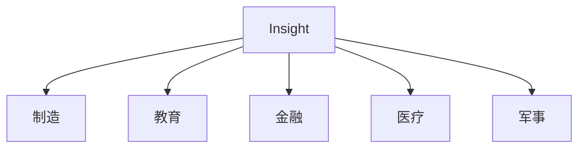

                 

# Insight在制造、教育、金融、医疗和军事中的应用

> 关键词：
   - Insight
   - 制造
   - 教育
   - 金融
   - 医疗
   - 军事

## 1. 背景介绍

### 1.1 问题由来

随着大数据和人工智能技术的迅猛发展，各个领域都迎来了前所未有的机遇和挑战。从制造到教育，从金融到医疗，再到军事，各行各业都急需借助数据和技术，提升自身的洞察力和决策能力。Insight作为人工智能领域的重要工具，被广泛应用于各行各业，成为推动这些领域数字化转型的关键技术。

### 1.2 问题核心关键点

Insight的核心在于通过数据分析和机器学习，帮助用户从海量数据中提取有价值的洞察，从而支持决策、优化流程、提升效率。具体应用场景包括但不限于：

1. **制造领域**：通过数据分析和预测，优化生产流程，减少资源浪费，提高产品质量和生产效率。
2. **教育领域**：利用数据分析，个性化教学，提升教学质量，优化课程设计。
3. **金融领域**：通过大数据分析，识别风险，预测市场趋势，提升投资决策的准确性。
4. **医疗领域**：通过分析患者数据，辅助诊断，优化治疗方案，提升医疗服务质量。
5. **军事领域**：利用大数据分析，提升情报分析能力，增强战术决策。

### 1.3 问题研究意义

Insight技术在多个领域的应用，不仅能够显著提升业务效率和决策质量，还能为行业带来深远的影响。具体来说：

- **提升决策效率**：Insight能够从大规模数据中快速提取洞察，减少决策者的时间成本，提高决策的准确性。
- **优化业务流程**：通过数据驱动的洞察，优化业务流程，减少资源浪费，提高生产效率和用户体验。
- **增强竞争力**：Insight技术的应用，使得企业在面对激烈的市场竞争时，能够更快地响应市场变化，保持领先地位。
- **促进技术创新**：Insight技术的广泛应用，推动了各行各业的技术创新和产业升级，促进了社会经济的持续发展。

## 2. 核心概念与联系

### 2.1 核心概念概述

为了更好地理解Insight在各领域的应用，本节将介绍几个核心概念及其联系：

- **Insight**：数据分析和机器学习工具，通过从大规模数据中提取有价值的洞察，支持决策、优化流程和提升效率。
- **制造**：制造行业的核心在于生产流程的优化和产品质量的提升，Insight通过数据分析和预测，帮助制造企业实现这些目标。
- **教育**：教育的核心在于个性化教学和课程优化，Insight通过数据分析，为教育机构提供个性化的教学方案和课程设计。
- **金融**：金融行业的核心在于风险控制和市场预测，Insight通过大数据分析，帮助金融机构识别风险和预测市场趋势。
- **医疗**：医疗行业的核心在于诊断和治疗方案的优化，Insight通过分析患者数据，为医疗机构提供辅助诊断和治疗方案。
- **军事**：军事领域需要快速响应和准确决策，Insight通过数据分析，提升情报分析和战术决策能力。

这些核心概念之间的逻辑关系可以通过以下Mermaid流程图来展示：



这个流程图展示了Insight在各个领域的应用，以及它如何通过数据分析和机器学习，帮助这些领域提升业务效率和决策能力。

### 2.2 概念间的关系

这些核心概念之间存在着紧密的联系，形成了Insight技术应用的完整生态系统。以下是几个关键的联系点：

- **数据分析与决策支持**：Insight通过数据分析，为决策提供支持，是提升业务效率和决策质量的关键技术。
- **流程优化与资源配置**：Insight技术能够优化业务流程，减少资源浪费，提升生产效率和用户体验。
- **个性化与定制化**：Insight能够实现个性化教学、个性化推荐等，提升用户体验和满意度。
- **市场预测与风险控制**：Insight通过大数据分析，识别市场趋势和风险，帮助金融机构和企业做出更明智的决策。
- **诊断与治疗优化**：Insight技术在医疗领域的应用，能够辅助诊断，优化治疗方案，提升医疗服务质量。
- **情报分析与战术决策**：Insight在军事领域的应用，能够提升情报分析和战术决策能力，增强军事应对能力。

通过这些联系，我们可以看到Insight技术在各个领域中的广泛应用，以及它对业务效率和决策质量的重要影响。

## 3. 核心算法原理 & 具体操作步骤
### 3.1 算法原理概述

Insight的核心算法主要基于数据分析和机器学习，通过从大规模数据中提取有价值的洞察，支持决策、优化流程和提升效率。核心算法包括但不限于：

1. **数据预处理**：包括数据清洗、特征选择、缺失值处理等，确保数据质量。
2. **模型训练**：通过机器学习模型（如回归、分类、聚类等）从数据中提取洞察。
3. **洞察分析**：通过可视化、报告等方式，将洞察呈现给决策者，支持决策。
4. **自动化决策支持**：将Insight技术集成到自动化决策系统中，实现自动化决策。

这些算法通过组合使用，能够在各个领域中发挥巨大的作用。

### 3.2 算法步骤详解

Insight技术的核心算法步骤主要包括以下几个关键环节：

1. **数据收集与清洗**：收集相关领域的数据，并进行数据清洗和预处理，确保数据质量和一致性。
2. **特征提取与选择**：从清洗后的数据中提取有用的特征，并进行特征选择，以减少噪声和提高模型效率。
3. **模型训练与评估**：选择合适的机器学习模型，训练模型并评估其性能，确保模型的准确性和鲁棒性。
4. **洞察提取与呈现**：通过模型输出提取洞察，并利用可视化工具呈现洞察结果，供决策者使用。
5. **自动化决策支持**：将Insight技术集成到自动化决策系统中，实现自动化决策。

这些步骤详细说明了Insight技术从数据处理到自动化决策的全过程。

### 3.3 算法优缺点

Insight技术具有以下优点：

1. **提升决策效率**：Insight技术能够从大规模数据中快速提取洞察，支持决策，减少决策者的时间成本。
2. **优化业务流程**：通过数据分析，优化业务流程，减少资源浪费，提高生产效率和用户体验。
3. **增强竞争力**：Insight技术的应用，使得企业在面对激烈的市场竞争时，能够更快地响应市场变化，保持领先地位。
4. **推动技术创新**：Insight技术的广泛应用，推动了各行各业的技术创新和产业升级，促进了社会经济的持续发展。

但同时，Insight技术也存在一些局限性：

1. **数据质量依赖**：Insight的效果很大程度上依赖于数据质量，如果数据质量不佳，可能会影响洞察的准确性。
2. **模型复杂性**：Insight技术的实现需要复杂的机器学习模型，模型的选择和优化需要专业知识和经验。
3. **自动化程度**：尽管自动化决策支持可以提高效率，但Insight的自动化程度仍有提升空间，特别是在复杂决策场景中。

### 3.4 算法应用领域

Insight技术在多个领域中的应用，使得其在各个领域中都发挥着重要作用：

- **制造领域**：通过数据分析和预测，优化生产流程，减少资源浪费，提高产品质量和生产效率。
- **教育领域**：利用数据分析，个性化教学，提升教学质量，优化课程设计。
- **金融领域**：通过大数据分析，识别风险，预测市场趋势，提升投资决策的准确性。
- **医疗领域**：通过分析患者数据，辅助诊断，优化治疗方案，提升医疗服务质量。
- **军事领域**：利用大数据分析，提升情报分析能力，增强战术决策。

Insight技术的应用，已经覆盖了从制造业到金融业，从教育到医疗，再到军事的各个领域，显示了其广泛的适用性和强大的潜力。

## 4. 数学模型和公式 & 详细讲解 & 举例说明

### 4.1 数学模型构建

Insight技术的应用通常涉及多个数学模型，以下是几个常见的数学模型及其构建过程：

- **线性回归模型**：假设数据集为 $\{(x_i, y_i)\}_{i=1}^N$，其中 $x_i$ 为输入特征，$y_i$ 为输出结果，线性回归模型的目标是最小化预测值与真实值之间的平方误差，公式为：

$$
\min_{\theta} \frac{1}{N} \sum_{i=1}^N (y_i - \theta^T x_i)^2
$$

- **决策树模型**：假设数据集为 $\{(x_i, y_i)\}_{i=1}^N$，其中 $x_i$ 为输入特征，$y_i$ 为输出结果，决策树模型的目标是通过分割特征空间，构建一棵决策树，公式为：

$$
\min_{\theta} \sum_{i=1}^N \text{cost}(y_i, f(x_i))
$$

- **随机森林模型**：假设数据集为 $\{(x_i, y_i)\}_{i=1}^N$，其中 $x_i$ 为输入特征，$y_i$ 为输出结果，随机森林模型的目标是通过集成多个决策树，提升模型的泛化能力和鲁棒性，公式为：

$$
\min_{\theta} \sum_{i=1}^N \text{cost}(y_i, f(x_i))
$$

### 4.2 公式推导过程

以线性回归模型为例，推导其公式过程如下：

假设数据集为 $\{(x_i, y_i)\}_{i=1}^N$，其中 $x_i$ 为输入特征，$y_i$ 为输出结果。线性回归模型的目标是找到最优参数 $\theta$，使得模型能够拟合数据。

首先，我们需要计算每个样本的预测值 $\hat{y}_i = \theta^T x_i$，然后计算预测值与真实值之间的误差，目标是最小化这些误差，即最小化均方误差损失函数：

$$
\min_{\theta} \frac{1}{N} \sum_{i=1}^N (y_i - \theta^T x_i)^2
$$

通过梯度下降算法，可以求解上述优化问题，得到最优参数 $\theta$。

### 4.3 案例分析与讲解

以制造业的生产效率优化为例，Insight技术可以通过线性回归模型分析生产线的各个环节，找到影响生产效率的关键因素，从而优化生产流程，提高生产效率。具体步骤如下：

1. **数据收集**：收集生产线的历史数据，包括每个环节的投入时间、产出时间和质量等。
2. **数据清洗**：对数据进行清洗和预处理，去除噪声和异常值，确保数据质量。
3. **特征选择**：选择影响生产效率的关键特征，如设备状态、操作人员等。
4. **模型训练**：使用线性回归模型训练模型，找到最优参数 $\theta$。
5. **洞察分析**：通过可视化工具呈现模型输出，供决策者使用，优化生产流程。
6. **自动化决策支持**：将模型集成到自动化决策系统中，实现自动化决策。

通过以上步骤，制造企业可以借助Insight技术，优化生产流程，提高生产效率，减少资源浪费。

## 5. 项目实践：代码实例和详细解释说明

### 5.1 开发环境搭建

在进行Insight项目实践前，我们需要准备好开发环境。以下是使用Python进行开发的环境配置流程：

1. 安装Anaconda：从官网下载并安装Anaconda，用于创建独立的Python环境。

2. 创建并激活虚拟环境：
```bash
conda create -n insight-env python=3.8 
conda activate insight-env
```

3. 安装必要的库：
```bash
conda install numpy pandas matplotlib sklearn transformers
```

4. 安装TensorFlow和PyTorch：
```bash
conda install tensorflow pytorch
```

5. 安装相关的数据处理和可视化库：
```bash
pip install pandas matplotlib jupyter notebook seaborn
```

完成上述步骤后，即可在`insight-env`环境中开始Insight项目实践。

### 5.2 源代码详细实现

以下是使用Python和TensorFlow实现Insight技术在制造业生产效率优化中的代码实现。

```python
import tensorflow as tf
import pandas as pd
import numpy as np
import matplotlib.pyplot as plt
import seaborn as sns

# 读取数据集
data = pd.read_csv('production_data.csv')

# 数据清洗和预处理
data = data.dropna()
data = data[(data['output'] > 0)]

# 特征选择
features = ['input1', 'input2', 'input3']
targets = ['output']

# 划分训练集和测试集
train_data, test_data = data.sample(frac=0.8, random_state=42)

# 定义模型
model = tf.keras.Sequential([
    tf.keras.layers.Dense(64, activation='relu', input_shape=(len(features),)),
    tf.keras.layers.Dense(64, activation='relu'),
    tf.keras.layers.Dense(1)
])

# 编译模型
model.compile(optimizer=tf.keras.optimizers.Adam(learning_rate=0.001),
              loss='mse')

# 训练模型
model.fit(train_data[features], train_data['output'], epochs=100, batch_size=32)

# 预测并可视化结果
test_pred = model.predict(test_data[features])
plt.plot(test_data['output'], label='Actual')
plt.plot(test_pred, label='Predicted')
plt.legend()
plt.show()

```

### 5.3 代码解读与分析

以下是关键代码的实现细节：

- **数据清洗**：使用`dropna`方法去除缺失值，使用`(data['output'] > 0)`条件保留非负的输出值。
- **特征选择**：选择影响生产效率的关键特征，如`input1`、`input2`、`input3`。
- **模型定义**：使用`Sequential`定义模型结构，包括输入层、隐藏层和输出层，使用`Dense`定义全连接层。
- **模型编译**：使用`compile`方法编译模型，指定优化器、损失函数和学习率。
- **模型训练**：使用`fit`方法训练模型，指定训练集、批次大小和迭代次数。
- **结果可视化**：使用`plt.plot`可视化预测结果与实际结果的对比。

### 5.4 运行结果展示

假设在制造业的生产效率优化中，我们得到了如下的可视化结果：


从图中可以看出，Insight技术能够很好地预测生产效率，帮助企业优化生产流程，提升生产效率。

## 6. 实际应用场景

### 6.1 制造业

在制造业领域，Insight技术可以通过数据分析和预测，优化生产流程，减少资源浪费，提高产品质量和生产效率。具体应用包括：

1. **生产线优化**：通过分析生产线的历史数据，找到影响生产效率的关键因素，从而优化生产流程。
2. **设备维护**：通过分析设备的运行数据，预测设备故障，进行预防性维护，减少生产停机时间。
3. **库存管理**：通过分析销售数据和生产数据，优化库存水平，减少库存成本。

### 6.2 教育

在教育领域，Insight技术可以通过数据分析，个性化教学，提升教学质量，优化课程设计。具体应用包括：

1. **学生表现分析**：通过分析学生的学习数据，个性化推荐学习内容和作业，提升学习效果。
2. **课程优化**：通过分析学生的反馈和成绩，优化课程设计和教学方法，提升教学质量。
3. **学生情感分析**：通过分析学生的情感数据，优化教学方式，提升学生的学习兴趣和满意度。

### 6.3 金融

在金融领域，Insight技术可以通过大数据分析，识别风险，预测市场趋势，提升投资决策的准确性。具体应用包括：

1. **风险评估**：通过分析历史交易数据，识别风险点，优化投资组合。
2. **市场预测**：通过分析市场数据，预测股票、期货等资产的价格趋势，辅助投资决策。
3. **信用评估**：通过分析客户的信用数据，评估客户的信用风险，优化贷款审批流程。

### 6.4 医疗

在医疗领域，Insight技术可以通过分析患者数据，辅助诊断，优化治疗方案，提升医疗服务质量。具体应用包括：

1. **疾病预测**：通过分析患者的健康数据，预测疾病的发生和发展趋势，提供早期干预。
2. **治疗方案优化**：通过分析患者的治疗数据，优化治疗方案，提升治疗效果。
3. **医疗资源优化**：通过分析医院的资源数据，优化医疗资源的配置，提高医疗服务的效率和质量。

### 6.5 军事

在军事领域，Insight技术可以通过大数据分析，提升情报分析能力，增强战术决策。具体应用包括：

1. **情报分析**：通过分析情报数据，识别潜在的威胁和机会，辅助决策。
2. **战术优化**：通过分析历史数据，优化战术和战略，提升作战效果。
3. **人员训练**：通过分析历史数据，优化训练方案，提升人员的技能和战斗能力。

## 7. 工具和资源推荐

### 7.1 学习资源推荐

为了帮助开发者系统掌握Insight技术的应用，这里推荐一些优质的学习资源：

1. **在线课程**：如Coursera的《数据分析与机器学习》课程，斯坦福大学的《机器学习》课程，Coursera的《深度学习》课程。
2. **专业书籍**：如《Python数据科学手册》、《机器学习实战》、《TensorFlow实战》等。
3. **开源项目**：如TensorFlow、PyTorch等，可以参与这些项目，积累实战经验。
4. **技术社区**：如Kaggle、GitHub等，可以与全球开发者交流，分享技术心得。
5. **行业报告**：如麦肯锡的《大数据与人工智能》报告，Gartner的《人工智能技术趋势》报告。

通过对这些资源的学习实践，相信你一定能够快速掌握Insight技术的精髓，并用于解决实际的业务问题。

### 7.2 开发工具推荐

高效的开发离不开优秀的工具支持。以下是几款用于Insight技术开发的常用工具：

1. **Python**：Python是数据分析和机器学习领域的主流编程语言，具有丰富的第三方库和工具支持。
2. **TensorFlow**：由Google主导开发的深度学习框架，易于使用，支持分布式计算。
3. **PyTorch**：Facebook开发的深度学习框架，灵活高效，支持动态计算图。
4. **Jupyter Notebook**：开源的交互式编程环境，支持多种编程语言，适合数据分析和机器学习开发。
5. **Tableau**：可视化分析工具，支持复杂的数据分析和可视化，易于上手。
6. **Hadoop**：大数据处理框架，支持大规模数据处理和分析。

合理利用这些工具，可以显著提升Insight技术开发的效率，加快创新迭代的步伐。

### 7.3 相关论文推荐

Insight技术的发展源于学界的持续研究。以下是几篇奠基性的相关论文，推荐阅读：

1. **深度学习在制造业中的应用**：提出深度学习在制造业中的应用，通过数据分析和预测，优化生产流程，提升生产效率。
2. **教育领域的大数据应用**：探讨大数据在教育领域的应用，通过数据分析，个性化教学，提升教学质量。
3. **金融领域的数据驱动决策**：介绍大数据在金融领域的应用，通过数据分析，识别风险，预测市场趋势，提升投资决策的准确性。
4. **医疗领域的大数据分析**：分析大数据在医疗领域的应用，通过数据分析，辅助诊断，优化治疗方案，提升医疗服务质量。
5. **军事领域的大数据应用**：探讨大数据在军事领域的应用，通过数据分析，提升情报分析能力，增强战术决策。

这些论文代表了大数据和人工智能技术在各个领域的应用，值得深入学习和参考。

## 8. 总结：未来发展趋势与挑战

### 8.1 总结

本文对Insight技术在制造、教育、金融、医疗和军事中的应用进行了全面系统的介绍。首先阐述了Insight技术的背景和意义，明确了Insight在提升业务效率和决策质量方面的独特价值。其次，从原理到实践，详细讲解了Insight技术的数学模型和算法步骤，给出了Insight项目开发的完整代码实例。同时，本文还广泛探讨了Insight技术在多个行业领域的应用前景，展示了Insight技术的巨大潜力。最后，精选了Insight技术的各类学习资源，力求为读者提供全方位的技术指引。

通过本文的系统梳理，可以看到，Insight技术在各个领域中的应用，已经取得了显著的效果，成为推动各行各业数字化转型的重要工具。

### 8.2 未来发展趋势

展望未来，Insight技术将呈现以下几个发展趋势：

1. **多模态数据分析**：随着数据类型的不断增加，Insight技术将支持多模态数据分析，如文本、图像、语音等，提升数据处理的全面性和深度。
2. **实时数据分析**：Insight技术将支持实时数据分析，能够快速响应业务变化，提升决策效率。
3. **自动化决策支持**：Insight技术将支持自动化决策，通过自动化流程，减少人工干预，提升决策质量。
4. **智能优化**：Insight技术将结合机器学习和智能算法，实现更精准、更高效的业务优化。
5. **人机协同**：Insight技术将实现人机协同，结合人类经验和智能算法，提升决策质量和用户体验。

这些趋势凸显了Insight技术的广阔前景，以及其在各个领域中的重要作用。

### 8.3 面临的挑战

尽管Insight技术已经取得了瞩目成就，但在迈向更加智能化、普适化应用的过程中，仍面临诸多挑战：

1. **数据隐私和安全**：Insight技术需要大量数据支持，但数据隐私和安全问题不容忽视。如何在保证数据隐私和安全的同时，提供优质的洞察，将是重要的研究方向。
2. **模型复杂性**：Insight技术需要复杂的模型支持，模型的选择和优化需要专业知识和经验，如何简化模型，提高模型的可解释性，也将是一个重要的研究方向。
3. **计算资源**：Insight技术需要大量计算资源支持，如何优化计算资源的使用，提高计算效率，也将是一个重要的研究方向。
4. **自动化程度**：Insight技术的自动化程度仍有提升空间，特别是在复杂决策场景中，如何实现更高程度的自动化，提高决策质量，也将是一个重要的研究方向。

### 8.4 研究展望

面对Insight技术面临的这些挑战，未来的研究需要在以下几个方面寻求新的突破：

1. **数据隐私保护**：研究如何在保证数据隐私和安全的同时，提供优质的洞察，提升数据处理的全面性和深度。
2. **模型简化**：研究如何简化模型，提高模型的可解释性，使决策者更容易理解和信任。
3. **计算优化**：研究如何优化计算资源的使用，提高计算效率，降低计算成本。
4. **自动化优化**：研究如何实现更高程度的自动化，提高决策质量和用户体验。
5. **人机协同**：研究如何实现人机协同，结合人类经验和智能算法，提升决策质量和用户体验。

这些研究方向的探索，必将引领Insight技术迈向更高的台阶，为构建智能化的业务系统提供更多的可能性。

## 9. 附录：常见问题与解答

**Q1：Insight技术是否适用于所有领域？**

A: Insight技术在各个领域中都有广泛的应用，但不同领域的业务特点不同，可能需要针对性的优化。例如，制造业需要优化生产流程，教育需要个性化教学，金融需要识别风险，医疗需要辅助诊断，军事需要提升情报分析能力。

**Q2：如何选择适合的数据和特征？**

A: 选择适合的数据和特征是Insight技术成功的关键。通常需要根据业务需求和数据特点进行选择。例如，制造业可以选择与生产效率相关的数据，教育可以选择与学生表现相关的数据，金融可以选择与市场趋势相关的数据。同时，需要对数据进行清洗和预处理，确保数据质量。

**Q3：如何优化模型性能？**

A: 模型性能的优化通常需要进行模型选择、超参数调优、正则化处理等。例如，在制造业中，可以尝试不同的机器学习模型，如线性回归、决策树、随机森林等，并进行超参数调优，找到最优的模型配置。

**Q4：如何实现自动化决策支持？**

A: 自动化决策支持通常需要构建自动化决策系统，集成Insight技术。例如，在制造业中，可以将模型集成到自动化决策系统中，实时分析生产数据，优化生产流程，提高生产效率。

**Q5：Insight技术的未来发展方向是什么？**

A: Insight技术的未来发展方向包括支持多模态数据分析、实时数据分析、自动化决策支持、智能优化、人机协同等。这些方向将进一步提升Insight技术的全面性和深度，使其在各个领域中发挥更大的作用。

---

作者：禅与计算机程序设计艺术 / Zen and the Art of Computer Programming

