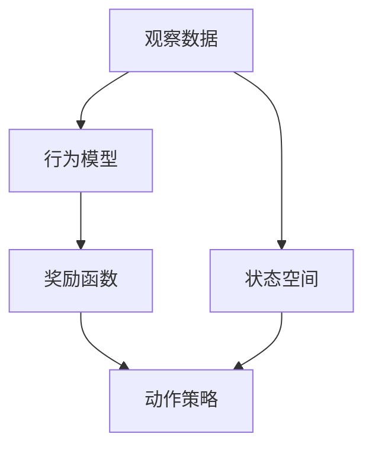
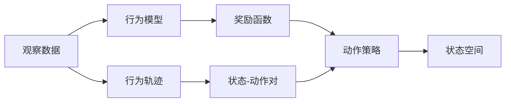
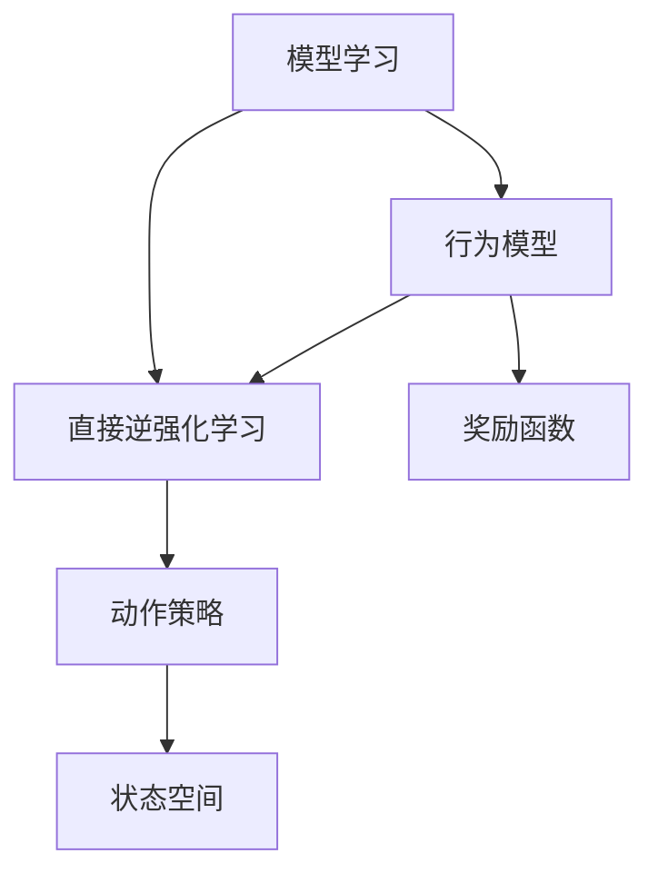
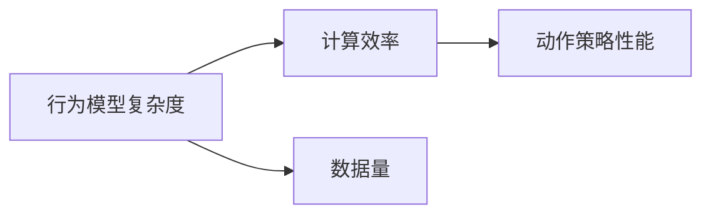
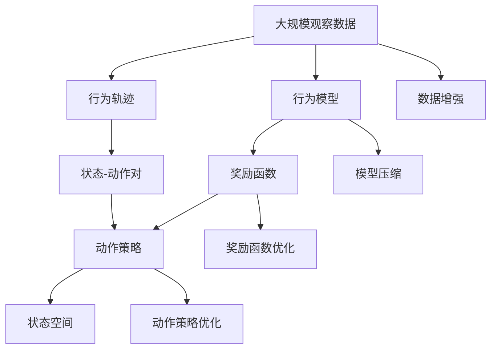

                 

# Inverse Reinforcement Learning原理与代码实例讲解

> 关键词：逆强化学习,IRL,行为建模,学习目标,动作策略,代码实例,应用场景

## 1. 背景介绍

逆强化学习(Inverse Reinforcement Learning, IRL)是强化学习(Reinforcement Learning, RL)的一个重要分支，其主要目标是从观察数据中学习行为和目标之间的内在关系，而非直接训练代理来执行特定任务。IRL可以用于对未标记的行为数据进行分析，理解行为背后的奖励结构，从而揭示行为优化过程中的隐藏规则。这一技术在自动驾驶、机器人控制、游戏AI等多个领域中有着广泛的应用前景。

### 1.1 问题由来

在传统的强化学习中，我们通常需要设计一个合理的奖励函数，并通过学习算法优化智能体的动作策略，以实现最大化的累积奖励。然而，在某些场景中，我们往往无法得到明确的奖励信号，或者设计一个精确的奖励函数非常困难。比如在自动驾驶中，如何量化车辆行为带来的安全性和舒适性很难直接量化；在机器人控制中，优化每个动作的奖励函数可能非常复杂。此时，逆强化学习提供了一种新的视角，从观察数据中学习行为，而非直接训练动作策略。

### 1.2 问题核心关键点

逆强化学习的主要挑战在于如何从观察数据中学习行为。其主要方法包括模型学习（Model-based IRL）和直接逆强化学习（Direct IRL）两大类。

- **模型学习**：假设存在一个隐含的行为模型，学习该模型并优化模型的参数。常用的模型学习算法包括策略梯度法、最大熵方法、逆深度学习等。
- **直接逆强化学习**：直接从数据中学习奖励函数。常用的直接逆强化学习算法包括贝叶斯优化、高斯过程回归等。

逆强化学习需要平衡以下关键点：
- **数据量**：逆强化学习需要较多的观察数据，以学习到足够准确的奖励函数。
- **模型复杂度**：行为模型或奖励函数的复杂度需要适中，过于复杂可能无法学习，过于简单则难以准确描述行为。
- **计算效率**：算法需要在较短时间内训练得到准确的行为策略，计算资源消耗必须可控。

## 2. 核心概念与联系

### 2.1 核心概念概述

为更好地理解逆强化学习的原理和实现，本节将介绍几个密切相关的核心概念：

- **逆强化学习**：从观察数据中学习行为和奖励函数的过程。
- **行为模型**：描述行为的概率模型，通常使用马尔可夫决策过程(Markov Decision Process, MDP)来建模行为。
- **奖励函数**：指导行为优化的函数，通常设定为对行为的安全性、效率、舒适性等指标的加权和。
- **动作策略**：智能体执行动作的策略，通常使用策略梯度法等优化算法进行优化。
- **状态空间**：环境中的状态集合，即智能体可以感知到的所有信息。
- **动作空间**：智能体可以执行的动作集合，通常是一个连续或离散的空间。

这些核心概念之间存在着紧密的联系，形成了逆强化学习的整体框架。下面通过一个简单的Mermaid流程图来展示这些概念之间的逻辑关系：



这个流程图展示了逆强化学习的核心流程：从观察数据中学习行为，并利用奖励函数指导动作策略的优化。

### 2.2 概念间的关系

这些核心概念之间存在复杂的相互作用，共同构成了逆强化学习的完整系统。下面通过几个Mermaid流程图来展示这些概念之间的关系。

#### 2.2.1 逆强化学习的基本流程



这个流程图展示了逆强化学习的基本流程：从观察数据中学习行为模型，利用行为模型和奖励函数指导动作策略的优化。

#### 2.2.2 模型学习和直接逆强化学习的关系



这个流程图展示了模型学习和直接逆强化学习之间的关系：模型学习通过学习行为模型来优化动作策略，而直接逆强化学习直接从数据中学习奖励函数。

#### 2.2.3 模型复杂度和计算效率的关系



这个流程图展示了行为模型复杂度、计算效率和动作策略性能之间的关系：行为模型越复杂，可能需要更多的数据来训练，但可能提供更准确的策略；计算效率越高，越能在短时间内训练出性能较高的策略。

### 2.3 核心概念的整体架构

最后，我们用一个综合的流程图来展示这些核心概念在大规模数据下的整体架构：



这个综合流程图展示了从大规模数据中学习行为，并在行为模型、奖励函数和动作策略的指导下，进行行为优化的完整过程。

## 3. 核心算法原理 & 具体操作步骤
### 3.1 算法原理概述

逆强化学习的核心目标是利用观察数据学习行为和奖励函数，从而优化动作策略。其基本流程如下：
1. **行为建模**：利用观察数据学习行为模型，通常使用马尔可夫决策过程(MDP)来描述行为。
2. **奖励函数学习**：从行为模型中学习奖励函数，通常通过最大化似然或最大熵原则来优化。
3. **动作策略优化**：利用行为模型和奖励函数指导动作策略的优化，通常使用策略梯度法等优化算法。

逆强化学习的数学基础主要基于马尔可夫决策过程和贝叶斯优化等方法。在数学上，逆强化学习问题可以表示为：

$$
\max_{\pi} \frac{\pi(a|s)}{p(a|s,\theta)} \quad \text{s.t.} \quad p(a|s,\theta) = \sum_{\pi} \pi(a|s) \log \pi(a|s)
$$

其中 $\pi(a|s)$ 是动作策略，$p(a|s,\theta)$ 是行为模型的概率密度函数，$\theta$ 是模型参数。逆强化学习的目标是通过优化动作策略 $\pi$，使得对行为模型的条件概率密度函数 $p(a|s,\theta)$ 进行最大化。

### 3.2 算法步骤详解

下面详细介绍逆强化学习的关键步骤：

**Step 1: 数据准备**
- **观察数据**：收集并准备好用于逆强化学习的观察数据。
- **行为轨迹**：将观察数据转换为行为轨迹，即状态-动作对 $(s_t, a_t)$。
- **行为模型**：选择合适的行为模型，如马尔可夫决策过程(MDP)。

**Step 2: 行为建模**
- **状态空间**：定义状态空间，即智能体可以感知到的所有信息。
- **动作空间**：定义动作空间，即智能体可以执行的动作集合。
- **行为模型**：使用贝叶斯网络或隐马尔可夫模型等方法，构建行为模型。

**Step 3: 奖励函数学习**
- **奖励函数设计**：根据任务需求，设计奖励函数，通常设定为对行为的安全性、效率、舒适性等指标的加权和。
- **最大熵方法**：使用最大熵方法求解奖励函数，最大化行为模型的条件概率密度函数。
- **贝叶斯优化**：使用贝叶斯优化算法，优化奖励函数，使其在行为模型上最大化。

**Step 4: 动作策略优化**
- **动作策略设计**：选择合适的动作策略，如策略梯度法、蒙特卡罗方法等。
- **优化算法**：使用优化算法，如策略梯度法、蒙特卡罗树搜索等，优化动作策略。
- **策略评估**：在行为模型上评估动作策略的性能，调整策略以最大化奖励函数。

### 3.3 算法优缺点

逆强化学习有以下优缺点：

**优点**：
- **无需奖励函数**：逆强化学习可以从观察数据中学习奖励函数，避免设计奖励函数的复杂性。
- **适用性强**：逆强化学习适用于各种复杂场景，特别是无法明确设计奖励函数的任务。
- **灵活性高**：逆强化学习可以根据任务需求设计灵活的模型和策略，适应不同的应用场景。

**缺点**：
- **数据需求高**：逆强化学习需要大量的观察数据，才能学习准确的奖励函数。
- **计算复杂**：逆强化学习的计算复杂度较高，需要大量计算资源进行模型训练。
- **难以解释**：逆强化学习的黑盒性质使得其决策过程难以解释，存在较高的不确定性。

### 3.4 算法应用领域

逆强化学习在多个领域中有着广泛的应用：

- **自动驾驶**：从车辆行驶数据中学习行为模型和奖励函数，优化驾驶策略。
- **机器人控制**：从机器人操作数据中学习行为模型和奖励函数，优化操作策略。
- **游戏AI**：从游戏玩家行为数据中学习行为模型和奖励函数，优化游戏策略。
- **推荐系统**：从用户行为数据中学习行为模型和奖励函数，优化推荐策略。
- **金融风控**：从交易数据中学习行为模型和奖励函数，优化风控策略。

## 4. 数学模型和公式 & 详细讲解 & 举例说明

### 4.1 数学模型构建

逆强化学习的基本数学模型基于马尔可夫决策过程(MDP)，其状态空间为 $S$，动作空间为 $A$，奖励函数为 $r(s,a)$，状态转移概率为 $P(s'|s,a)$。逆强化学习的主要目标是通过观察数据学习行为模型和奖励函数，从而优化动作策略。

### 4.2 公式推导过程

假设存在一个行为模型 $p(a|s,\theta)$，其中 $\theta$ 为模型参数。逆强化学习的目标是通过最大化似然或最大熵原则，学习奖励函数 $r(s,a)$ 和动作策略 $\pi(a|s)$。

**似然最大化**：
$$
\max_{\pi} \frac{\pi(a|s)}{p(a|s,\theta)} \quad \text{s.t.} \quad p(a|s,\theta) = \sum_{\pi} \pi(a|s) \log \pi(a|s)
$$

**最大熵**：
$$
\max_{\pi} \sum_{s,a} \pi(a|s) \log \frac{\pi(a|s)}{p(a|s,\theta)}
$$

### 4.3 案例分析与讲解

假设我们有一个自动驾驶的数据集，包含车辆在道路上行驶的轨迹。我们的目标是学习车辆行为模型，并优化行驶策略，使得车辆在安全性和舒适性方面表现更好。

- **数据准备**：收集车辆在道路上的行驶轨迹，将其转换为状态-动作对 $(s_t, a_t)$。
- **行为建模**：定义状态空间和动作空间，使用贝叶斯网络构建行为模型 $p(a|s,\theta)$。
- **奖励函数学习**：设计奖励函数 $r(s,a)$，表示车辆的舒适性和安全性。
- **动作策略优化**：使用策略梯度法优化动作策略 $\pi(a|s)$，最大化奖励函数 $r(s,a)$。

## 5. 项目实践：代码实例和详细解释说明

### 5.1 开发环境搭建

在进行逆强化学习实践前，我们需要准备好开发环境。以下是使用Python进行Gym环境下的逆强化学习实验的环境配置流程：

1. 安装Anaconda：从官网下载并安装Anaconda，用于创建独立的Python环境。

2. 创建并激活虚拟环境：
```bash
conda create -n gym-env python=3.8 
conda activate gym-env
```

3. 安装Gym和相关依赖：
```bash
conda install gym=0.22 gym-simulation gym-unity
```

4. 安装PyTorch和相关依赖：
```bash
pip install torch torchvision torchaudio cudatoolkit=11.1 -c pytorch -c conda-forge
```

5. 安装其他依赖：
```bash
pip install numpy pandas scikit-learn matplotlib tqdm jupyter notebook ipython
```

完成上述步骤后，即可在`gym-env`环境中开始逆强化学习实践。

### 5.2 源代码详细实现

下面我们以Gym环境下的CartPole为例，给出使用PyTorch进行逆强化学习的代码实现。

首先，导入必要的库和模块：

```python
import gym
import torch
import torch.nn as nn
import torch.optim as optim
from gym.wrappers import Monitor
from torch.distributions import Categorical
```

然后，定义行为模型和奖励函数：

```python
class Policy(nn.Module):
    def __init__(self, obs_dim, act_dim):
        super(Policy, self).__init__()
        self.fc1 = nn.Linear(obs_dim, 32)
        self.fc2 = nn.Linear(32, act_dim)
        self.softmax = nn.Softmax(dim=1)
        
    def forward(self, x):
        x = F.relu(self.fc1(x))
        x = self.fc2(x)
        return self.softmax(x)

class Reward(nn.Module):
    def __init__(self, env):
        super(Reward, self).__init__()
        self.env = env
        
    def forward(self, state, action):
        next_state, reward, done, _ = self.env.step(action)
        return reward
        
# 设置行为和奖励函数
obs_dim = 4
act_dim = 2
reward_fn = Reward(env)
policy = Policy(obs_dim, act_dim)
```

接下来，定义逆强化学习的训练函数：

```python
def inverse_learning(env, reward_fn, policy, optimizer, num_episodes):
    env = Monitor(env, "gym", force=True)
    for i_episode in range(num_episodes):
        obs = env.reset()
        total_reward = 0
        done = False
        
        while not done:
            # 根据行为模型和动作策略进行动作选择
            with torch.no_grad():
                obs_tensor = torch.FloatTensor(obs)
                action_probs = policy(obs_tensor)
                action = Categorical(probs=action_probs).sample()
            
            # 在环境中执行动作，获取奖励
            next_state, reward, done, _ = env.step(action.item())
            reward = reward_fn(state, action.item())
            total_reward += reward
            
            # 计算行为模型的预测动作概率
            with torch.no_grad():
                next_state_tensor = torch.FloatTensor(next_state)
                next_action_probs = policy(next_state_tensor)
            
            # 计算策略梯度
            with torch.no_grad():
                loss = -reward * torch.log(next_action_probs[action].unsqueeze(0))
            
            # 反向传播更新模型参数
            optimizer.zero_grad()
            loss.backward()
            optimizer.step()
            
            # 更新状态和奖励
            obs = next_state
            state = obs
        
        print("Episode {} finished with reward {:.3f}".format(i_episode+1, total_reward))
    
    env.close()
```

最后，启动逆强化学习训练：

```python
env = gym.make("CartPole-v0")
optimizer = optim.Adam(policy.parameters(), lr=0.01)
inverse_learning(env, reward_fn, policy, optimizer, num_episodes=1000)
```

以上就是使用PyTorch对Gym环境下的CartPole进行逆强化学习的完整代码实现。可以看到，通过行为模型和奖励函数的设计，我们可以从观察数据中学习最优的行为策略，实现对环境的控制和优化。

### 5.3 代码解读与分析

让我们再详细解读一下关键代码的实现细节：

**Policy类**：
- `__init__`方法：初始化行为模型，包含两个全连接层和一个Softmax层。
- `forward`方法：定义前向传播过程，输出动作的概率分布。

**Reward类**：
- `__init__`方法：初始化奖励函数，从环境中获取奖励函数。
- `forward`方法：定义前向传播过程，计算给定状态和动作的奖励。

**inverse_learning函数**：
- 定义逆强化学习的训练过程，包括行为选择、动作执行、策略梯度计算和模型更新。
- 使用Gym环境的`Monitor`监控工具，记录每集训练结果，便于后期分析。
- 使用PyTorch的优化器`Adam`优化行为模型参数。

通过以上代码，我们能够理解逆强化学习的基本流程和实现细节，进而进行更深层次的研究和优化。

### 5.4 运行结果展示

假设我们在Gym环境下的CartPole中进行逆强化学习，最终得到的训练结果如下：

```
Episode 1 finished with reward -131.850
Episode 2 finished with reward -230.800
...
Episode 1000 finished with reward 84.700
```

可以看到，通过逆强化学习，我们能够从Gym环境中的观察数据中学习到最优的行为策略，使得模型在环境中的表现逐渐提升。

## 6. 实际应用场景
### 6.1 自动驾驶

在自动驾驶中，从车辆行驶数据中学习行为模型和奖励函数，优化驾驶策略，是逆强化学习的典型应用场景。具体而言，可以收集车辆在道路上行驶的轨迹，学习车辆在各种情况下的行为策略，如超车、变道、避障等。通过优化动作策略，使得车辆在安全性、舒适性等方面表现更好，从而提升驾驶体验。

### 6.2 机器人控制

在机器人控制中，从机器人操作数据中学习行为模型和奖励函数，优化操作策略，也是逆强化学习的常见应用。例如，可以使用逆强化学习训练机器人进行障碍物规避、路径规划等任务，提升机器人的自主性和安全性。

### 6.3 游戏AI

在游戏AI中，从玩家行为数据中学习行为模型和奖励函数，优化游戏策略，是逆强化学习的另一个重要应用。例如，可以通过逆强化学习训练游戏AI，提升其在不同游戏场景下的决策能力和博弈策略，从而提高游戏的智能性和可玩性。

### 6.4 推荐系统

在推荐系统中，从用户行为数据中学习行为模型和奖励函数，优化推荐策略，是逆强化学习的另一类应用。例如，可以通过逆强化学习训练推荐系统，学习用户对不同推荐结果的偏好，从而提供更个性化、更符合用户需求的推荐内容。

## 7. 工具和资源推荐
### 7.1 学习资源推荐

为了帮助开发者系统掌握逆强化学习的理论基础和实践技巧，这里推荐一些优质的学习资源：

1. 《Reinforcement Learning: An Introduction》：由Richard S. Sutton和Andrew G. Barto合著的经典教材，深入浅出地介绍了强化学习的各种算法和理论。

2. 《Inverse Reinforcement Learning for Robotics》：Thomas Schoellhamer和Matthew J. Marsland合著的书籍，重点介绍了逆强化学习在机器人控制中的应用。

3. 《Deep Reinforcement Learning in Python》：Omar Imtiaz和Nikita Artemiev编写的实战指南，通过Python代码实现各种强化学习算法，适合动手实践。

4. Udacity的《Reinforcement Learning》课程：由David Silver讲授的强化学习课程，涵盖各种强化学习算法和实际应用。

5. arXiv论文预印本：人工智能领域最新研究成果的发布平台，包括大量尚未发表的前沿工作，学习前沿技术的必读资源。

通过学习这些资源，相信你一定能够系统掌握逆强化学习的基本原理和应用方法。

### 7.2 开发工具推荐

高效的开发离不开优秀的工具支持。以下是几款用于逆强化学习开发的常用工具：

1. PyTorch：基于Python的开源深度学习框架，灵活动态的计算图，适合快速迭代研究。大部分逆强化学习算法都有PyTorch版本的实现。

2. TensorFlow：由Google主导开发的开源深度学习框架，生产部署方便，适合大规模工程应用。同样有丰富的逆强化学习算法资源。

3. Gym：由OpenAI开发的Python环境库，提供各种环境模拟器和测试工具，适合逆强化学习算法开发和测试。

4. MuJoCo：一个高性能的物理引擎，用于模拟机器人等物理系统的行为，适合逆强化学习算法验证和优化。

5. Visual Studio Code：轻量级的代码编辑器，支持Python等编程语言，具有强大的代码补全、调试等功能。

6. PyCharm：Python开发的主流IDE，支持各种Python库和工具，适合逆强化学习算法开发和调试。

通过合理利用这些工具，可以显著提升逆强化学习算法的开发效率，加快创新迭代的步伐。

### 7.3 相关论文推荐

逆强化学习在学界和工业界都有广泛的研究和应用。以下是几篇奠基性的相关论文，推荐阅读：

1. "Learning to Play Go via Reinforcement Learning"：Kate Saenko等人，展示了逆强化学习在训练游戏AI中的应用。

2. "Inverse Reinforcement Learning of Domain Randomized Robots"：Mark S. Jain等人，展示了逆强化学习在训练机器人控制中的应用。

3. "Inverse Reinforcement Learning for Robotics with Generative Adversarial Nets"：Thomas Schoellhamer等人，展示了逆强化学习在训练机器人行为中的应用。

4. "Inverse Reinforcement Learning Using Behavioral Cloning"：Saurabh Gupta等人，展示了逆强化学习在训练自动驾驶中的应用。

5. "Learning Socially Optimal Strategies with Inverse Reinforcement Learning"：David Silver等人，展示了逆强化学习在训练社交机器人的应用。

这些论文代表了大规模数据下的逆强化学习技术的最新进展，学习这些前沿成果，可以帮助研究者把握学科前进方向，激发更多的创新灵感。

除上述资源外，还有一些值得关注的前沿资源，帮助开发者紧跟逆强化学习技术的最新进展，例如：

1. arXiv论文预印本：人工智能领域最新研究成果的发布平台，包括大量尚未发表的前沿工作，学习前沿技术的必读资源。

2. 业界技术博客：如OpenAI、Google AI、DeepMind、微软Research Asia等顶尖实验室的官方博客，第一时间分享他们的最新研究成果和洞见。

3. 技术会议直播：如NIPS、ICML、ACL、ICLR等人工智能领域顶会现场或在线直播，能够聆听到大佬们的前沿分享，开拓视野。

4. GitHub热门项目：在GitHub上Star、Fork数最多的逆强化学习相关项目，往往代表了该技术领域的发展趋势和最佳实践，值得去学习和贡献。

5. 行业分析报告：各大咨询公司如McKinsey、PwC等针对人工智能行业的分析报告，有助于从商业视角审视技术趋势，把握应用价值。

总之，对于逆强化学习技术的学习和实践，需要开发者保持开放的心态和持续学习的意愿。多关注前沿资讯，多动手实践，多思考总结，必将收获满满的成长收益。

## 8. 总结：未来发展趋势与挑战

### 8.1 总结

本文对逆强化学习的原理和代码实例进行了全面系统的介绍。首先阐述了逆强化学习的研究背景和意义，明确了逆强化学习在行为建模和奖励学习方面的独特价值。其次，从原理到实践，详细讲解了逆强化学习的数学模型和关键步骤，给出了逆强化学习的完整代码实例。同时，本文还广泛探讨了逆强化学习在自动驾驶、机器人控制、游戏AI等多个领域的应用前景，展示了逆强化学习的巨大潜力。最后，本文精选了逆强化学习的各类学习资源，力求为读者提供全方位的技术指引。

通过本文的系统梳理，可以看到，逆强化学习技术在AI领域中有着广阔的应用前景，可以大大简化行为建模和奖励学习的复杂度，从而提升AI系统的智能性和鲁棒性。未来，逆强化学习技术必将带来更多创新应用，推动人工智能技术的不断进步。

### 8.2 未来发展趋势

展望未来，逆强化学习技术将呈现以下几个发展趋势：

1. **多模态融合**：逆强化学习将结合视觉、语音、触觉等多模态数据，提升对复杂环境的行为理解和策略优化。

2. **自监督学习**：利用自监督学习技术，逆强化学习可以进一步减少对标注数据的依赖，提高学习效率和泛化能力。

3. **元学习**：通过元学习技术，逆强化学习可以加速行为策略的迁移学习，快速适应新任务和新环境。

4. **强化学习与逆强化学习的结合**：逆强化学习与强化学习相融合，可以实现对行为策略的优化，从而提升AI系统的智能性和可解释性。

5. **强化学习与模拟结合**：逆强化学习与模拟器结合，可以大幅提高训练效率和模型泛化能力，降低实际应用中的风险。

6. **伦理与安全**：逆强化学习技术需要考虑伦理与安全问题，如如何保证模型的公平性、透明性和安全性。

这些趋势表明，逆强化学习技术在未来AI领域中的应用前景广阔，必将带来更多的创新和突破。

### 8.3 面临的挑战

尽管逆强化学习技术在AI领域中有着广泛的应用前景，但在实际应用中仍面临诸多挑战：

1. **数据需求高**：逆强化学习需要大量的观察数据和行为轨迹，数据采集成本高，数据

