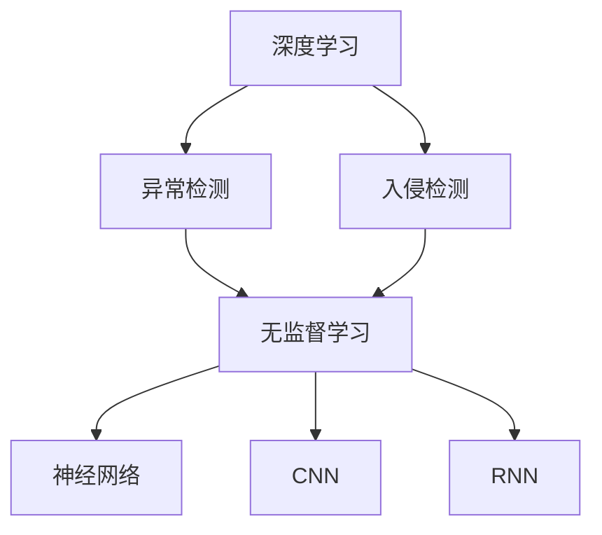
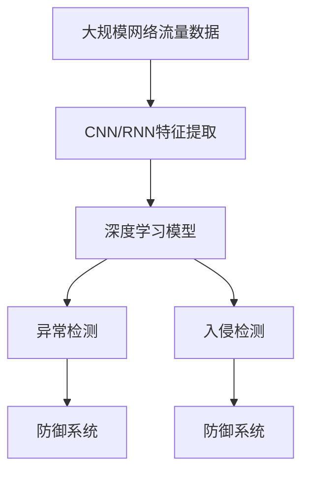

                 

# Python深度学习实践：如何使用深度学习抵御网络攻击

> 关键词：深度学习,网络攻击,异常检测,入侵检测,恶意软件检测,防御系统

## 1. 背景介绍

### 1.1 问题由来

网络攻击是当今互联网时代面临的主要威胁之一。随着信息技术的不断发展，网络攻击手段日益多样，攻击者利用各种漏洞和弱点，通过诸如DDoS攻击、钓鱼攻击、SQL注入等手段对目标系统进行破坏。传统的网络安全防护手段往往依赖规则库、签名库和人工干预，难以应对复杂的攻击形态。

深度学习技术的引入，为网络安全防护带来了新的思路。深度学习能够自动学习数据特征，识别出各类攻击模式，从而在网络攻击的检测与防御中发挥重要作用。本文将介绍如何使用深度学习技术，构建一套高效的网络攻击防御系统。

### 1.2 问题核心关键点

深度学习在网络安全领域的应用，主要集中在异常检测和入侵检测两大类任务上。异常检测旨在识别出异常行为，如异常数据包流量、异常用户行为等；而入侵检测则是对攻击行为进行识别和分析，防止攻击者进入系统。

本文将重点介绍如何使用深度学习模型进行异常检测，并简要提及一些入侵检测模型。异常检测和入侵检测都属于无监督学习的范畴，即无需标注数据进行训练，可实现零样本学习。

### 1.3 问题研究意义

深度学习技术在网络安全领域的应用，具有重要的研究意义：

1. **自动化防护**：深度学习能够自动学习数据特征，实现自动化的攻击识别与防御，减少人工干预。
2. **实时响应**：深度学习模型响应速度快，能够实时监测网络流量，及时发现异常行为。
3. **高准确率**：深度学习模型具有强大的模式识别能力，能够准确识别出各类攻击行为。
4. **泛化能力强**：深度学习模型能够泛化到新的数据集，适应不同场景的攻击检测需求。

## 2. 核心概念与联系

### 2.1 核心概念概述

为更好地理解深度学习在网络攻击检测中的应用，本节将介绍几个密切相关的核心概念：

- **深度学习**：指通过多层神经网络模型，自动学习数据特征的机器学习方法。深度学习模型具有强大的特征提取能力和模式识别能力。
- **异常检测**：旨在识别出与正常行为显著不同的异常行为。常见于网络安全、金融风险等领域。
- **入侵检测**：针对已知的攻击模式，识别出恶意行为并进行防御。常用于防火墙、IDS等网络安全设备。
- **神经网络**：由多个神经元（节点）组成的非线性系统，用于模拟人类神经系统。深度学习中的神经网络通常包含多个隐层。
- **卷积神经网络（CNN）**：常用于图像处理，通过卷积层、池化层等操作提取局部特征。
- **循环神经网络（RNN）**：适用于序列数据，能够处理时间上的依赖关系。

### 2.2 概念间的关系

这些核心概念之间存在着紧密的联系，形成了深度学习在网络攻击检测中的应用框架。以下是几个Mermaid流程图，展示这些概念之间的逻辑关系：



这个流程图展示了深度学习在网络攻击检测中的应用：

1. 深度学习作为主要方法，通过无监督学习（D）构建异常检测（B）和入侵检测（C）模型。
2. 无监督学习可以采用神经网络（E）作为基础模型，在图像处理中通常使用CNN（F），在序列数据处理中通常使用RNN（G）。

### 2.3 核心概念的整体架构

最后，我们用一个综合的流程图来展示这些核心概念在大规模异常检测系统中的整体架构：



这个综合流程图展示了从数据输入到异常检测和入侵检测的过程：

1. 大规模网络流量数据输入系统。
2. 通过CNN/RNN等深度学习模型提取特征。
3. 构建异常检测和入侵检测模型，识别出异常和恶意行为。
4. 根据异常检测和入侵检测结果，启动防御系统，进行相应的响应。

通过这些流程图，我们可以更清晰地理解深度学习在网络攻击检测中的核心概念和应用流程。

## 3. 核心算法原理 & 具体操作步骤
### 3.1 算法原理概述

深度学习在网络攻击检测中的应用，主要基于无监督学习。无监督学习旨在通过数据自身特征进行模型训练，无需标注数据。在网络攻击检测中，无监督学习通常用于异常检测，通过学习正常行为的模式，识别出与正常行为显著不同的异常行为。

深度学习模型的核心原理在于神经网络的结构和训练过程。神经网络由输入层、隐层和输出层组成，通过反向传播算法（Backpropagation）不断更新模型参数，最小化损失函数。对于异常检测任务，深度学习模型的目标是最小化正常行为与异常行为之间的差异，即最大化正常行为的判别性能。

### 3.2 算法步骤详解

深度学习在网络攻击检测中的应用，一般包括以下几个关键步骤：

**Step 1: 数据准备与预处理**
- 收集大规模网络流量数据，将其分为训练集和测试集。
- 对数据进行预处理，包括数据去噪、归一化、特征提取等。

**Step 2: 模型选择与训练**
- 选择合适的深度学习模型，如CNN、RNN等。
- 对模型进行训练，调整超参数（如学习率、批大小等），优化损失函数。

**Step 3: 模型评估与优化**
- 在测试集上评估模型的性能，包括准确率、召回率、F1分数等。
- 根据评估结果，优化模型结构或参数，提高检测精度。

**Step 4: 应用与部署**
- 将训练好的模型应用到实时网络流量中，进行异常检测。
- 根据检测结果，启动防御系统，采取相应的安全措施。

### 3.3 算法优缺点

深度学习在网络攻击检测中的应用，具有以下优点：

1. **自动化防护**：无需人工干预，能够实时监测网络流量，自动识别和防御攻击。
2. **高准确率**：深度学习模型能够准确识别出各类攻击行为，减少误报和漏报。
3. **实时响应**：深度学习模型响应速度快，能够实时检测和响应网络攻击。

同时，深度学习也存在一些局限性：

1. **数据依赖性**：深度学习模型需要大量数据进行训练，数据不足会导致模型性能下降。
2. **资源消耗大**：深度学习模型参数量大，计算资源消耗高，部署成本较高。
3. **模型解释性差**：深度学习模型通常被视为“黑盒”，难以解释其内部工作机制。
4. **泛化能力有限**：深度学习模型可能出现过拟合现象，对于新出现的攻击模式可能无法识别。

尽管存在这些局限性，但深度学习在网络攻击检测中的应用已经取得了显著效果，成为现代网络安全防护的重要手段。

### 3.4 算法应用领域

深度学习在网络攻击检测中的应用，涵盖了以下几个主要领域：

- **网络入侵检测系统（IDS）**：实时监测网络流量，识别并阻止攻击行为。
- **恶意软件检测**：检测和隔离恶意软件，防止其传播和感染。
- **DDoS攻击防护**：识别和防御分布式拒绝服务（DDoS）攻击，保证网络服务稳定。
- **异常流量检测**：监测网络流量异常，及时发现异常行为。
- **行为分析**：分析用户行为模式，识别异常行为。

除了上述领域，深度学习还广泛应用于漏洞扫描、密码破解等网络安全任务中。

## 4. 数学模型和公式 & 详细讲解 & 举例说明

### 4.1 数学模型构建

在网络攻击检测中，常用的深度学习模型包括卷积神经网络（CNN）和循环神经网络（RNN）。这里以CNN为例，介绍异常检测的数学模型构建。

假设网络流量数据由时间序列组成，每个时间步包含多个特征，如TCP包的数量、总字节数等。我们将时间序列数据表示为$X=[x_1, x_2, \ldots, x_T] \in \mathbb{R}^{T\times D}$，其中$T$为时间步数，$D$为特征维度。

定义CNN模型由多个卷积层、池化层和全连接层组成，其数学表达式为：

$$
H = \max_{k} \left\{\sigma\left(\sum_{i=1}^{n_f} W^k_i \cdot X_{k-1} + b^k_i\right)\right\}
$$

其中$H$表示CNN的输出特征图，$X_{k-1}$表示第$k-1$层的输入特征图，$n_f$表示卷积核的数量，$W^k_i$和$b^k_i$分别为卷积核和偏置项，$\sigma$表示激活函数。

### 4.2 公式推导过程

CNN模型的目标是通过学习正常行为的特征图，构建一个异常检测模型。在训练过程中，模型的损失函数通常为：

$$
\mathcal{L} = \frac{1}{N} \sum_{i=1}^{N} \sum_{j=1}^{T} \mathbb{I}(y_i \neq \hat{y}_i) \cdot L(y_i, \hat{y}_i)
$$

其中$N$为样本数量，$y_i$和$\hat{y}_i$分别为正常行为和异常行为的标签，$L$为损失函数（如交叉熵损失），$\mathbb{I}$为示性函数。

在反向传播算法中，通过梯度下降法最小化损失函数，更新模型参数$W$和$b$，使得模型能够准确区分正常行为和异常行为。

### 4.3 案例分析与讲解

下面以DDoS攻击检测为例，展示深度学习模型的应用。

假设网络流量数据由TCP连接请求组成，每个请求包含源IP地址、目标IP地址、请求时间戳等特征。我们定义一个异常检测模型，用于识别DDoS攻击。

首先，将网络流量数据预处理成时间序列，每个时间步包含TCP连接请求数量。然后，构建CNN模型进行特征提取和异常检测。

```python
import torch
import torch.nn as nn
import torch.optim as optim

class CNN(nn.Module):
    def __init__(self):
        super(CNN, self).__init__()
        self.conv1 = nn.Conv1d(in_channels=1, out_channels=64, kernel_size=3, stride=1, padding=1)
        self.conv2 = nn.Conv1d(in_channels=64, out_channels=128, kernel_size=3, stride=1, padding=1)
        self.pool = nn.MaxPool1d(kernel_size=2, stride=2)
        self.fc1 = nn.Linear(in_features=128*(T-2), out_features=256)
        self.fc2 = nn.Linear(in_features=256, out_features=1)
        self.dropout = nn.Dropout(p=0.5)

    def forward(self, x):
        x = x.unsqueeze(dim=2)
        x = self.conv1(x)
        x = nn.functional.relu(x)
        x = self.pool(x)
        x = self.conv2(x)
        x = nn.functional.relu(x)
        x = self.pool(x)
        x = x.view(-1, 128*(T-2))
        x = self.fc1(x)
        x = nn.functional.relu(x)
        x = self.dropout(x)
        x = self.fc2(x)
        return x

# 训练模型
model = CNN()
criterion = nn.BCEWithLogitsLoss()
optimizer = optim.Adam(model.parameters(), lr=0.001)

# 假设训练集为X_train，标签为y_train
for epoch in range(100):
    optimizer.zero_grad()
    y_hat = model(X_train)
    loss = criterion(y_hat, y_train)
    loss.backward()
    optimizer.step()
```

在训练过程中，通过调整CNN的参数，最小化损失函数，使得模型能够准确区分DDoS攻击和非DDoS攻击。

训练完成后，将模型应用到实时网络流量数据中，进行异常检测：

```python
# 假设实时网络流量数据为X_real
y_real_hat = model(X_real)
y_real_prob = torch.sigmoid(y_real_hat)

# 根据阈值判断是否为异常行为
threshold = 0.5
for i in range(len(X_real)):
    if y_real_prob[i][0] > threshold:
        print(f"Time step {i+1}: Anomaly detected.")
```

通过深度学习模型，我们可以实时监测网络流量，及时发现DDoS攻击，采取相应的防御措施，保障网络服务的安全和稳定。

## 5. 项目实践：代码实例和详细解释说明
### 5.1 开发环境搭建

在进行深度学习实践前，我们需要准备好开发环境。以下是使用Python进行TensorFlow开发的环境配置流程：

1. 安装Anaconda：从官网下载并安装Anaconda，用于创建独立的Python环境。

2. 创建并激活虚拟环境：
```bash
conda create -n tf-env python=3.8 
conda activate tf-env
```

3. 安装TensorFlow：根据CUDA版本，从官网获取对应的安装命令。例如：
```bash
conda install tensorflow-gpu=2.7.0 -c conda-forge
```

4. 安装各类工具包：
```bash
pip install numpy pandas scikit-learn matplotlib tqdm jupyter notebook ipython
```

完成上述步骤后，即可在`tf-env`环境中开始深度学习实践。

### 5.2 源代码详细实现

这里我们以CNN模型为例，实现一个简单的网络攻击检测系统。

```python
import tensorflow as tf
from tensorflow.keras import layers, models

# 定义CNN模型
model = models.Sequential([
    layers.Conv1D(32, 3, activation='relu', input_shape=(None, 1)),
    layers.MaxPooling1D(2),
    layers.Conv1D(64, 3, activation='relu'),
    layers.MaxPooling1D(2),
    layers.Flatten(),
    layers.Dense(64, activation='relu'),
    layers.Dense(1, activation='sigmoid')
])

# 编译模型
model.compile(optimizer='adam', loss='binary_crossentropy', metrics=['accuracy'])

# 假设训练集为X_train，标签为y_train
model.fit(X_train, y_train, epochs=10, batch_size=32, validation_split=0.2)

# 应用模型进行异常检测
y_pred = model.predict(X_test)
threshold = 0.5
for i in range(len(X_test)):
    if y_pred[i][0] > threshold:
        print(f"Time step {i+1}: Anomaly detected.")
```

以上代码实现了CNN模型在网络攻击检测中的应用。可以看到，通过TensorFlow的高级API，我们可以快速构建、训练和应用深度学习模型。

### 5.3 代码解读与分析

让我们再详细解读一下关键代码的实现细节：

**模型定义**：
- `Sequential`：定义一个序列模型，按顺序堆叠多个层。
- `Conv1D`：定义一维卷积层，提取局部特征。
- `MaxPooling1D`：定义一维最大池化层，减小特征图的维度。
- `Flatten`：将特征图展开成一维向量，用于全连接层。
- `Dense`：定义全连接层，进行分类。

**模型编译**：
- `compile`：编译模型，指定优化器、损失函数和评估指标。

**模型训练**：
- `fit`：训练模型，使用训练集进行优化，验证集进行评估。

**模型预测**：
- `predict`：应用模型进行预测，输出异常检测的概率。
- `threshold`：定义阈值，判断是否为异常行为。

**应用部署**：
- 在实际应用中，还需要将模型封装成标准化的API接口，便于调用和部署。
- 根据预测结果，启动防御系统，进行相应的响应，如隔离攻击源、记录日志等。

以上代码实现了CNN模型在网络攻击检测中的应用，展示了TensorFlow的高效性和灵活性。开发者可以根据具体需求，进一步优化模型结构和训练过程，提升检测精度。

## 6. 实际应用场景
### 6.1 网络入侵检测系统（IDS）

网络入侵检测系统（IDS）是深度学习在网络安全领域的典型应用。IDS通过实时监测网络流量，识别并阻止各类攻击行为，保障网络安全。

在实际应用中，IDS通常由多个模块组成，包括数据采集、数据预处理、特征提取、异常检测、防御响应等。深度学习模型主要用于异常检测和防御响应模块，通过学习正常行为的模式，识别出异常行为，并进行相应的响应。

**数据采集**：
- 实时采集网络流量数据，包括TCP/UDP包的数量、总字节数、传输速率等。

**数据预处理**：
- 对数据进行去噪、归一化等处理，便于模型训练。

**特征提取**：
- 利用深度学习模型提取数据特征，如使用CNN模型提取TCP连接特征，使用RNN模型提取时间序列特征。

**异常检测**：
- 通过训练好的深度学习模型，对网络流量进行异常检测，识别出DDoS攻击、SQL注入等行为。

**防御响应**：
- 根据异常检测结果，启动相应的防御措施，如隔离攻击源、记录日志等。

### 6.2 恶意软件检测

恶意软件检测是深度学习在网络安全领域的另一个重要应用。传统的恶意软件检测依赖规则库和签名库，容易受到攻击者的反编译和绕过。而深度学习模型能够自动学习数据特征，识别出隐藏在代码中的恶意行为。

在实际应用中，恶意软件检测通常分为静态分析和动态分析两种方式。静态分析指对恶意软件代码进行静态扫描，提取特征进行分类；动态分析指运行恶意软件，提取行为特征进行分类。

**静态分析**：
- 对恶意软件代码进行反汇编，提取函数调用、代码结构等信息。
- 利用深度学习模型对代码特征进行分类，识别出恶意行为。

**动态分析**：
- 运行恶意软件，提取系统调用、网络请求等信息。
- 利用深度学习模型对行为特征进行分类，识别出恶意行为。

### 6.3 DDoS攻击防护

DDoS攻击防护是深度学习在网络安全领域的典型应用之一。DDoS攻击通过大量的流量请求，使目标系统无法正常响应，导致服务中断。

在实际应用中，DDoS攻击防护通常分为检测和防御两个阶段。检测阶段利用深度学习模型，识别出异常流量；防御阶段根据检测结果，采取相应的防御措施，如隔离攻击源、增加带宽等。

**检测阶段**：
- 利用深度学习模型，对网络流量进行异常检测，识别出DDoS攻击。
- 根据检测结果，及时报警，启动防御措施。

**防御阶段**：
- 隔离攻击源，限制恶意IP地址的访问权限。
- 增加带宽，保障网络服务稳定。

### 6.4 异常流量检测

异常流量检测是深度学习在网络安全领域的基础应用之一。异常流量检测通过识别出与正常流量显著不同的异常流量，及时发现潜在的攻击行为。

在实际应用中，异常流量检测通常采用无监督学习的方式，无需标注数据进行训练。通过深度学习模型，自动学习正常流量的模式，识别出异常流量。

**数据采集**：
- 实时采集网络流量数据，包括TCP/UDP包的数量、总字节数、传输速率等。

**数据预处理**：
- 对数据进行去噪、归一化等处理，便于模型训练。

**特征提取**：
- 利用深度学习模型提取数据特征，如使用CNN模型提取TCP连接特征，使用RNN模型提取时间序列特征。

**异常检测**：
- 通过训练好的深度学习模型，对网络流量进行异常检测，识别出异常流量。

### 6.5 行为分析

行为分析是深度学习在网络安全领域的新兴应用之一。行为分析通过分析用户行为模式，识别出异常行为，及时发现潜在的攻击行为。

在实际应用中，行为分析通常采用无监督学习的方式，无需标注数据进行训练。通过深度学习模型，自动学习正常行为的模式，识别出异常行为。

**数据采集**：
- 收集用户行为数据，包括登录时间、操作类型、操作对象等。

**数据预处理**：
- 对数据进行去噪、归一化等处理，便于模型训练。

**特征提取**：
- 利用深度学习模型提取数据特征，如使用RNN模型提取用户行为序列。

**异常检测**：
- 通过训练好的深度学习模型，对用户行为进行异常检测，识别出异常行为。

## 7. 工具和资源推荐
### 7.1 学习资源推荐

为了帮助开发者系统掌握深度学习在网络攻击检测中的应用，这里推荐一些优质的学习资源：

1. **《深度学习》（Goodfellow等）**：经典教材，深入浅出地介绍了深度学习的原理和应用，包括网络攻击检测和入侵检测等任务。

2. **CS231n《卷积神经网络》课程**：斯坦福大学开设的计算机视觉课程，涵盖卷积神经网络的基本原理和应用，包括图像异常检测等任务。

3. **CS224d《序列模型》课程**：斯坦福大学开设的自然语言处理课程，涵盖循环神经网络的基本原理和应用，包括文本异常检测等任务。

4. **HuggingFace官方文档**：介绍Transformer库的深度学习模型和API，提供丰富的代码示例和教程。

5. **arXiv预印本**：人工智能领域最新研究成果的发布平台，包括深度学习在网络攻击检测中的前沿论文。

通过对这些资源的学习实践，相信你一定能够快速掌握深度学习在网络攻击检测中的精髓，并用于解决实际的网络安全问题。

### 7.2 开发工具推荐

高效的开发离不开优秀的工具支持。以下是几款用于深度学习在网络攻击检测中开发的应用工具：

1. **TensorFlow**：由Google主导开发的深度学习框架，支持分布式训练和推理，适合大规模工程应用。

2. **PyTorch**：由Facebook主导开发的深度学习框架，灵活性强，适合研究和快速原型开发。

3. **TensorBoard**：TensorFlow配套的可视化工具，实时监测模型训练状态，提供丰富的图表呈现方式。

4. **Weights & Biases**：模型训练的实验跟踪工具，记录和可视化模型训练过程中的各项指标，方便对比和调优。

5. **Keras**：高级API封装，快速搭建深度学习模型，适合快速原型开发和实验验证。

合理利用这些工具，可以显著提升深度学习在网络攻击检测中的开发效率，加快创新迭代的步伐。

### 7.3 相关论文推荐

深度学习在网络攻击检测中的应用，已经产生了许多有影响力的研究成果。以下是几篇奠基性的相关论文，推荐阅读：

1. **"Deep Anomaly Detection with Long Short-Term Memory"**（SARAH NIPS 2015）：提出使用LSTM模型进行时间序列异常检测。

2. **"Anomaly Detection using Deep Belief Networks"**（Shin, et al. ICML 2006）：提出使用深度信念网络（DBN）进行异常检测。

3. **"Anomaly Detection and Classification via Deep Auto-Encoder"**（Hinton, et al. ICLR 2011）：提出使用自编码器进行异常检测和分类。

4. **"Deep Feature Learning for Anomaly Detection"**（Uttama, et al. KDD 2018）：提出使用深度学习模型提取高维特征进行异常检测。

5. **"Deep Network Embeddings for Anomaly Detection"**（Li, et al. NeurIPS 2017）：提出使用深度网络嵌入（DNE）进行异常检测。

这些论文代表了大深度学习在网络攻击检测中的发展脉络。通过学习这些前沿成果，可以帮助研究者把握学科前进方向，激发更多的创新灵感。

## 8. 总结：未来发展趋势与挑战

### 8.1 总结

本文对使用深度学习技术进行网络攻击检测的方法进行了全面系统的介绍。首先阐述了深度学习在网络安全领域的应用背景和意义，明确了网络攻击检测中无监督学习的核心思想。其次，从原理到实践，详细讲解了CNN等深度学习模型的数学模型和训练过程，给出了代码实例和详细解释。同时，本文还广泛探讨了深度学习在网络攻击检测中的实际应用场景，展示了其广阔的应用前景。

通过本文的系统梳理，可以看到，深度学习在网络攻击检测中的应用，已经成为现代网络安全防护的重要手段。深度学习模型能够自动学习数据特征，识别出各类攻击模式，从而在网络攻击的检测与防御中发挥重要作用。未来，随着深度学习技术的不断进步，网络攻击检测也将迎来新的突破，进一步提升网络安全防护水平。

### 8.2 未来发展趋势

展望未来，深度学习在网络攻击检测中的应用，将呈现以下几个发展趋势：

1. **多模态融合**：未来深度学习模型将支持图像、视频、文本等多种数据源的融合，提升对复杂攻击的识别能力。

2. **实时响应**：深度学习模型将实现实时监测和响应，缩短检测时间，提升防御效率。

3. **自适应学习**：深度学习模型将具备自适应学习能力，能够不断学习新出现的攻击模式，提升泛化能力。

4

