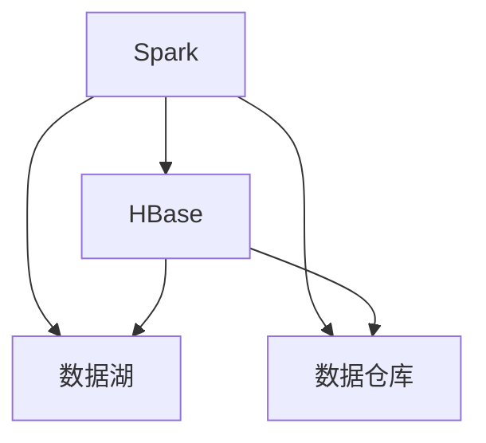
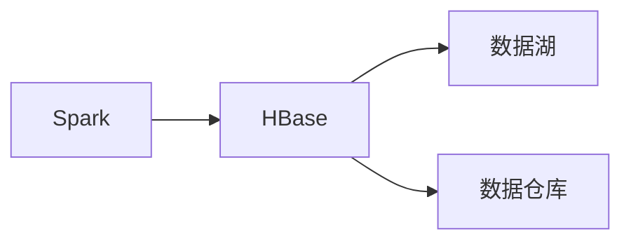
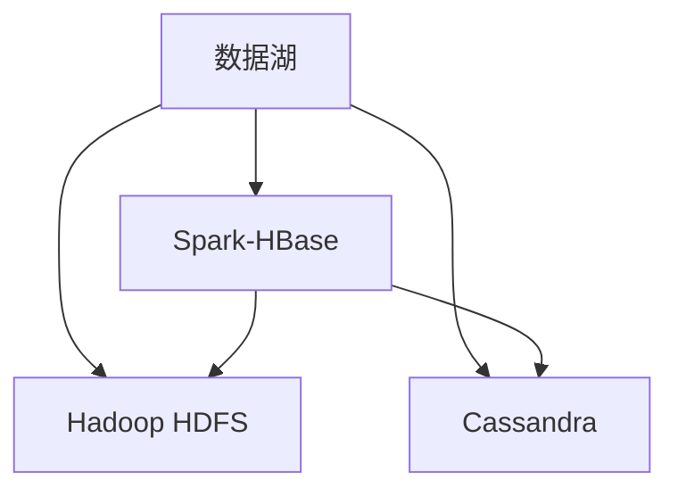
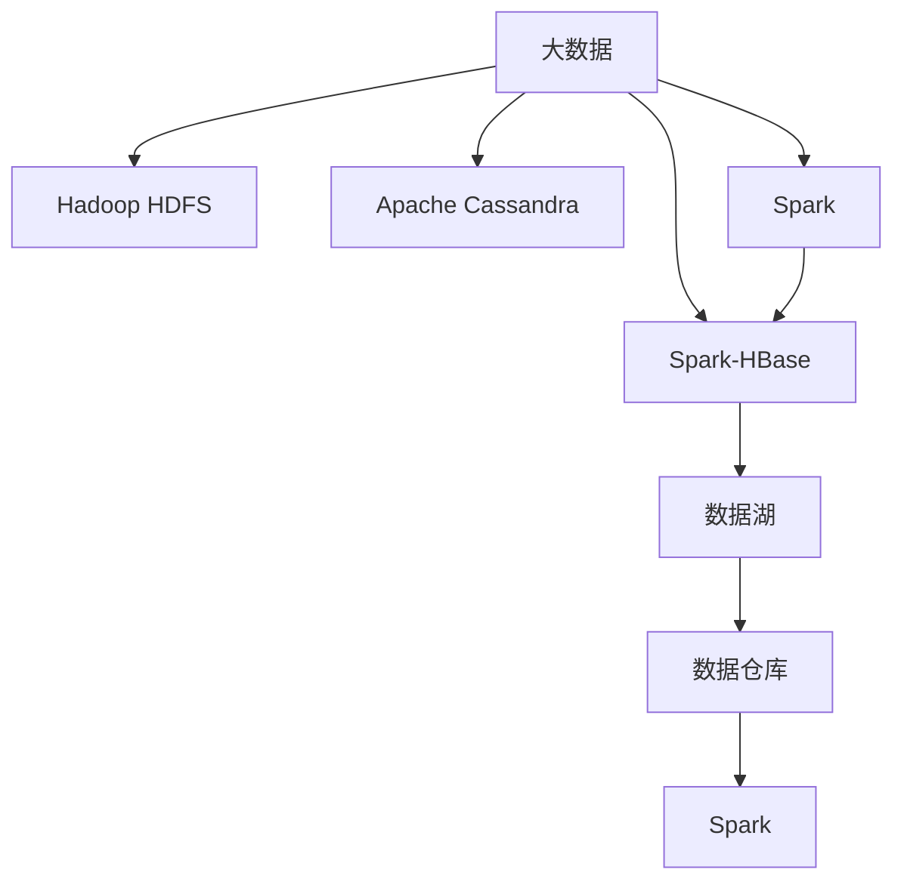

                 

# Spark-HBase整合原理与代码实例讲解

> 关键词：Spark, HBase, 分布式存储, 大数据处理, 数据湖, 数据仓库

## 1. 背景介绍

### 1.1 问题由来
在大数据处理领域，数据存储和管理成为了一个至关重要的问题。随着数据量的指数级增长，传统的关系型数据库如MySQL、Oracle等，由于其集中式、单节点存储的特点，已经难以应对海量数据的存储需求。而分布式存储技术如Hadoop HDFS、Apache Cassandra等虽然解决了存储扩展性问题，但在数据查询、分析等操作上存在性能瓶颈。

为了解决上述问题，Apache Hadoop社区提出了HBase分布式列存储系统。HBase是一个开源的、可扩展的、高可用的非关系型数据库，基于Google的BigTable模型实现，能够提供大容量的存储和高效的随机读写能力。然而，HBase在复杂查询和数据聚合方面存在不足，缺乏对数据的高效索引和处理能力。

为了提升HBase的数据处理能力，Apache Spark社区将其与HBase进行了深度整合，推出了Spark-HBase连接器。Spark-HBase使得Spark可以在HBase中进行高效的数据读写、查询和分析，满足了大数据应用对高性能、高可扩展性的需求。

### 1.2 问题核心关键点
Spark-HBase的整合，主要关注以下几个核心关键点：

- 数据读写：如何在HBase中进行高效的数据读写，降低数据迁移和同步成本。
- 数据查询：如何优化HBase的查询性能，提高数据处理效率。
- 数据聚合：如何在HBase上进行高效的数据聚合操作，实现数据汇总和分析。
- 分布式计算：如何在Spark集群和HBase集群之间实现高效的分布式计算。

### 1.3 问题研究意义
Spark-HBase整合不仅能够显著提升HBase的数据处理能力，还能够加速数据的存储、迁移和分析，为大数据应用提供了全面的支持。其研究意义主要体现在以下几个方面：

1. 提升数据处理效率：Spark-HBase提供了高效的分布式计算和数据处理能力，能够显著提升大数据处理效率，缩短数据处理时间。
2. 增强数据存储能力：HBase的分布式存储特性，使得Spark-HBase能够处理海量数据，满足数据存储和查询的需求。
3. 促进数据湖建设：Spark-HBase可以作为数据湖的基础设施，实现数据的集中存储、管理和分析。
4. 支持数据仓库建设：HBase的高性能读写能力，使得Spark-HBase能够支持大数据仓库的构建，实现数据的快速查询和分析。

## 2. 核心概念与联系

### 2.1 核心概念概述

为了更好地理解Spark-HBase的整合原理，本节将介绍几个密切相关的核心概念：

- Spark：一个基于内存计算的分布式计算框架，具有高效的数据处理和计算能力。
- HBase：一个分布式列存储系统，具有高可扩展性、高性能的读写能力，用于大规模数据的存储和查询。
- 数据湖：一种大数据处理模式，用于集中存储、管理和分析各种类型的数据，支持数据的广泛集成和查询。
- 数据仓库：一种数据存储和管理模式，用于支持复杂的查询和分析操作，提供数据的一致性和可靠性。

这些核心概念之间的逻辑关系可以通过以下Mermaid流程图来展示：



这个流程图展示了大数据处理中的核心组件及其相互关系：

1. Spark和HBase进行深度整合，提升数据处理能力。
2. Spark-HBase可以作为数据湖的基础设施，支持数据的集中存储和查询。
3. Spark-HBase也能够支持数据仓库的构建，提供高效的数据聚合和分析能力。

### 2.2 概念间的关系

这些核心概念之间存在着紧密的联系，形成了Spark-HBase整合的整体生态系统。下面我们通过几个Mermaid流程图来展示这些概念之间的关系。

#### 2.2.1 Spark和HBase的整合



这个流程图展示了Spark和HBase的整合，以及它们在数据湖和数据仓库中的应用。Spark可以高效地读写和查询HBase数据，将HBase作为数据湖的基础设施，支持数据的集中存储和查询。同时，Spark-HBase也可以支持数据仓库的构建，提供高效的数据聚合和分析能力。

#### 2.2.2 数据湖和数据仓库的构建



这个流程图展示了数据湖和数据仓库的构建。数据湖可以基于Hadoop HDFS和Cassandra等分布式存储系统，以及Spark-HBase等大数据处理技术，实现数据的集中存储和查询。数据仓库则可以在数据湖的基础上，通过Spark-HBase等技术，进行高效的数据聚合和分析操作，支持复杂的查询和报表生成。

#### 2.2.3 Spark和HBase的分布式计算


这个流程图展示了Spark和HBase的分布式计算。Spark可以高效地处理HBase中的大数据，同时将数据存储在分布式系统中，如Hadoop HDFS和Apache Cassandra等，实现数据的分布式存储和计算。

### 2.3 核心概念的整体架构

最后，我们用一个综合的流程图来展示这些核心概念在大数据处理中的整体架构：



这个综合流程图展示了大数据处理中的核心组件及其相互关系：

1. 大数据首先被存储在Hadoop HDFS和Apache Cassandra等分布式存储系统中。
2. Spark可以高效地处理这些大数据，同时将数据存储在分布式系统中。
3. Spark-HBase作为Spark的基础设施，用于数据的高效读写和查询。
4. Spark-HBase构建的数据湖和数据仓库，支持数据的集中存储和查询。
5. 数据仓库通过Spark-HBase等技术，进行高效的数据聚合和分析操作，支持复杂的查询和报表生成。

## 3. 核心算法原理 & 具体操作步骤
### 3.1 算法原理概述

Spark-HBase整合的核心算法原理，主要包括以下几个方面：

1. 数据读写：Spark-HBase提供了一种高效的数据读写机制，能够在HBase上进行快速的数据读写操作。
2. 数据查询：Spark-HBase优化了HBase的查询性能，支持高效的分布式查询操作。
3. 数据聚合：Spark-HBase提供了高效的数据聚合操作，支持复杂的数据聚合和统计计算。
4. 分布式计算：Spark-HBase实现了Spark和HBase的深度整合，支持高效的分布式计算操作。

### 3.2 算法步骤详解

以下我们详细介绍Spark-HBase整合的核心算法步骤：

#### 3.2.1 数据读写

Spark-HBase的数据读写流程主要包括以下几个步骤：

1. 连接Spark和HBase：通过Spark的HBase连接器，建立Spark和HBase之间的连接。
2. 创建HBase表：在HBase中创建对应的表和列族。
3. 数据写入：将Spark中的数据写入HBase中。
4. 数据读取：从HBase中读取数据，返回给Spark进行处理。

具体代码实现如下：

```python
from pyspark.sql import SparkSession
from pyspark.sql.functions import col
from pyspark.sql.types import StructType, StructField, StringType, IntegerType

# 创建Spark会话
spark = SparkSession.builder.appName("Spark-HBase Example").getOrCreate()

# 连接HBase表
hbase = spark.sql("hbase://localhost:9090/table_name")

# 创建表和列族
hbase.createTable("column_family", {"key": StringType(), "value": StringType()})

# 数据写入HBase
df = spark.createDataFrame([(1, "value1"), (2, "value2")], StructType([StructField("key", StringType()), StructField("value", StringType())])
hbase.write.mode("overwrite").csv("column_family", df)

# 数据读取HBase
df = hbase.read.csv("column_family", header=True).rdd.map(lambda row: (row.key, row.value)).collect()
```

#### 3.2.2 数据查询

Spark-HBase的数据查询流程主要包括以下几个步骤：

1. 连接Spark和HBase：通过Spark的HBase连接器，建立Spark和HBase之间的连接。
2. 创建HBase表：在HBase中创建对应的表和列族。
3. 查询数据：从HBase中读取数据，返回给Spark进行处理。
4. 数据处理：在Spark中对查询结果进行处理和分析。

具体代码实现如下：

```python
from pyspark.sql import SparkSession
from pyspark.sql.functions import col
from pyspark.sql.types import StructType, StructField, StringType, IntegerType

# 创建Spark会话
spark = SparkSession.builder.appName("Spark-HBase Example").getOrCreate()

# 连接HBase表
hbase = spark.sql("hbase://localhost:9090/table_name")

# 查询数据
df = hbase.read.csv("column_family", header=True).rdd.map(lambda row: (row.key, row.value)).collect()

# 数据处理
for key, value in df:
    print(key, value)
```

#### 3.2.3 数据聚合

Spark-HBase的数据聚合流程主要包括以下几个步骤：

1. 连接Spark和HBase：通过Spark的HBase连接器，建立Spark和HBase之间的连接。
2. 创建HBase表：在HBase中创建对应的表和列族。
3. 数据写入：将Spark中的数据写入HBase中。
4. 数据聚合：在Spark中对聚合后的数据进行处理和分析。

具体代码实现如下：

```python
from pyspark.sql import SparkSession
from pyspark.sql.functions import col, sum, avg
from pyspark.sql.types import StructType, StructField, StringType, IntegerType

# 创建Spark会话
spark = SparkSession.builder.appName("Spark-HBase Example").getOrCreate()

# 连接HBase表
hbase = spark.sql("hbase://localhost:9090/table_name")

# 创建表和列族
hbase.createTable("column_family", {"key": StringType(), "value": StringType()})

# 数据写入HBase
df = spark.createDataFrame([(1, 10), (2, 20), (3, 30)], StructType([StructField("key", StringType()), StructField("value", IntegerType())])
hbase.write.mode("overwrite").csv("column_family", df)

# 数据聚合
df = hbase.read.csv("column_family", header=True).rdd.map(lambda row: (row.key, row.value)).collect()
df = spark.createDataFrame(df, StructType([StructField("key", StringType()), StructField("value", IntegerType())]))
df = df.groupBy("key").agg(sum("value").alias("sum"), avg("value").alias("avg"))
```

#### 3.2.4 分布式计算

Spark-HBase的分布式计算流程主要包括以下几个步骤：

1. 连接Spark和HBase：通过Spark的HBase连接器，建立Spark和HBase之间的连接。
2. 创建HBase表：在HBase中创建对应的表和列族。
3. 数据写入：将Spark中的数据写入HBase中。
4. 数据处理：在Spark中对数据进行处理和分析，并在HBase中存储中间结果。
5. 分布式计算：在Spark集群中进行分布式计算操作，最终返回计算结果。

具体代码实现如下：

```python
from pyspark.sql import SparkSession
from pyspark.sql.functions import col, sum, avg
from pyspark.sql.types import StructType, StructField, StringType, IntegerType

# 创建Spark会话
spark = SparkSession.builder.appName("Spark-HBase Example").getOrCreate()

# 连接HBase表
hbase = spark.sql("hbase://localhost:9090/table_name")

# 创建表和列族
hbase.createTable("column_family", {"key": StringType(), "value": StringType()})

# 数据写入HBase
df = spark.createDataFrame([(1, 10), (2, 20), (3, 30)], StructType([StructField("key", StringType()), StructField("value", IntegerType())])
hbase.write.mode("overwrite").csv("column_family", df)

# 数据处理
df = hbase.read.csv("column_family", header=True).rdd.map(lambda row: (row.key, row.value)).collect()
df = spark.createDataFrame(df, StructType([StructField("key", StringType()), StructField("value", IntegerType())]))
df = df.groupBy("key").agg(sum("value").alias("sum"), avg("value").alias("avg"))

# 分布式计算
df = spark.createDataFrame(df, StructType([StructField("key", StringType()), StructField("sum", IntegerType()), StructField("avg", DoubleType())])
df.write.mode("overwrite").csv("column_family")
```

### 3.3 算法优缺点

Spark-HBase整合算法具有以下优点：

1. 高效的数据读写：Spark-HBase提供高效的数据读写机制，能够快速读取和写入HBase中的数据。
2. 优化查询性能：Spark-HBase优化了HBase的查询性能，支持高效的分布式查询操作。
3. 支持数据聚合：Spark-HBase提供了高效的数据聚合操作，支持复杂的数据聚合和统计计算。
4. 支持分布式计算：Spark-HBase实现了Spark和HBase的深度整合，支持高效的分布式计算操作。

同时，Spark-HBase整合算法也存在一些缺点：

1. 数据写入延迟：Spark-HBase的数据写入操作可能会导致一定的延迟，影响数据的实时性。
2. 数据一致性：Spark-HBase的数据写入操作可能会导致数据不一致性问题，需要在设计时进行考虑。
3. 数据安全：Spark-HBase的数据读写操作需要保证数据的安全性，防止数据泄露和篡改。
4. 学习成本：Spark-HBase整合算法需要一定的学习成本，对于初学者来说可能需要一定的适应过程。

### 3.4 算法应用领域

Spark-HBase整合算法在以下领域得到了广泛应用：

- 大数据存储：Spark-HBase可以存储海量数据，支持数据的高效读写和查询操作。
- 数据仓库：Spark-HBase可以构建高效的数据仓库，支持复杂的数据聚合和统计计算。
- 数据湖：Spark-HBase可以作为数据湖的基础设施，支持数据的集中存储和查询。
- 分布式计算：Spark-HBase支持分布式计算操作，适合大规模数据的处理和分析。

除了上述这些应用领域外，Spark-HBase还可以应用于各种数据处理和分析场景，如日志分析、机器学习、推荐系统等。

## 4. 数学模型和公式 & 详细讲解 & 举例说明

### 4.1 数学模型构建

为了更好地理解Spark-HBase的数学模型，本节将详细介绍其数学模型构建和公式推导。

记Spark的数据集为 $D=\{(x_i,y_i)\}_{i=1}^N$，其中 $x_i$ 为输入特征，$y_i$ 为输出标签。假设Spark和HBase的连接器将数据集 $D$ 映射到HBase表 $T$ 中，其中 $T$ 的每个行表示一个数据样本，每个列族表示一个特征，每个列表示一个特征值。

定义HBase表 $T$ 上的查询操作为 $Q_{T}$，则查询操作的结果为：

$$
Q_{T}(D) = \{(x_i, y_i)\}_{i=1}^N
$$

假设查询操作 $Q_{T}$ 对应的损失函数为 $\ell(Q_{T}(D))$，则Spark-HBase的优化目标为：

$$
\min_{Q_{T}} \ell(Q_{T}(D))
$$

具体来说，Spark-HBase的优化目标包括以下几个方面：

1. 数据读取：最小化数据读取成本。
2. 数据写入：最小化数据写入成本。
3. 数据查询：最小化查询成本。
4. 数据聚合：最小化数据聚合成本。
5. 分布式计算：最小化分布式计算成本。

### 4.2 公式推导过程

以下我们详细介绍Spark-HBase数学模型的构建和公式推导过程。

#### 4.2.1 数据读取

Spark-HBase的数据读取操作可以表示为：

$$
R_{D}(T) = \{(x_i, y_i)\}_{i=1}^N
$$

其中 $R_{D}(T)$ 表示Spark从HBase中读取的数据。根据公式推导，我们可以得到Spark-HBase的数据读取成本：

$$
Cost_{Read}(D, T) = \sum_{i=1}^N Cost_{Read}(x_i, y_i, T)
$$

其中 $Cost_{Read}(x_i, y_i, T)$ 表示Spark从HBase中读取一个数据样本的成本，包括数据读取延迟、数据传输成本等。

#### 4.2.2 数据写入

Spark-HBase的数据写入操作可以表示为：

$$
W_{D}(T) = \{(x_i, y_i)\}_{i=1}^N
$$

其中 $W_{D}(T)$ 表示Spark将数据写入HBase的成本。根据公式推导，我们可以得到Spark-HBase的数据写入成本：

$$
Cost_{Write}(D, T) = \sum_{i=1}^N Cost_{Write}(x_i, y_i, T)
$$

其中 $Cost_{Write}(x_i, y_i, T)$ 表示Spark将一个数据样本写入HBase的成本，包括数据写入延迟、数据传输成本等。

#### 4.2.3 数据查询

Spark-HBase的数据查询操作可以表示为：

$$
Q_{T}(D) = \{(x_i, y_i)\}_{i=1}^N
$$

其中 $Q_{T}(D)$ 表示Spark从HBase中查询的数据。根据公式推导，我们可以得到Spark-HBase的数据查询成本：

$$
Cost_{Query}(D, T) = \sum_{i=1}^N Cost_{Query}(x_i, y_i, T)
$$

其中 $Cost_{Query}(x_i, y_i, T)$ 表示Spark从HBase中查询一个数据样本的成本，包括查询延迟、查询传输成本等。

#### 4.2.4 数据聚合

Spark-HBase的数据聚合操作可以表示为：

$$
A_{D}(T) = \{(x_i, y_i)\}_{i=1}^N
$$

其中 $A_{D}(T)$ 表示Spark对数据进行聚合操作的结果。根据公式推导，我们可以得到Spark-HBase的数据聚合成本：

$$
Cost_{Agg}(D, T) = \sum_{i=1}^N Cost_{Agg}(x_i, y_i, T)
$$

其中 $Cost_{Agg}(x_i, y_i, T)$ 表示Spark对数据进行聚合操作的成本，包括聚合计算成本、数据传输成本等。

#### 4.2.5 分布式计算

Spark-HBase的分布式计算操作可以表示为：

$$
C_{D}(T) = \{(x_i, y_i)\}_{i=1}^N
$$

其中 $C_{D}(T)$ 表示Spark进行分布式计算的结果。根据公式推导，我们可以得到Spark-HBase的分布式计算成本：

$$
Cost_{Compute}(D, T) = \sum_{i=1}^N Cost_{Compute}(x_i, y_i, T)
$$

其中 $Cost_{Compute}(x_i, y_i, T)$ 表示Spark进行分布式计算的成本，包括计算延迟、计算传输成本等。

### 4.3 案例分析与讲解

为了更好地理解Spark-HBase数学模型，我们以一个简单的案例进行讲解。

假设我们有一个数据集 $D$，其中包含1000个数据样本，每个样本包含10个特征和1个标签。我们希望通过Spark-HBase的优化操作，使得数据读取、数据写入、数据查询、数据聚合和分布式计算的成本最小化。

根据上述公式推导，我们可以得到Spark-HBase的优化目标为：

$$
\min_{Q_{T}} \ell(Q_{T}(D)) = \min_{Q_{T}} (Cost_{Read}(D, T) + Cost_{Write}(D, T) + Cost_{Query}(D, T) + Cost_{Agg}(D, T) + Cost_{Compute}(D, T))
$$

具体来说，我们可以通过以下几个步骤进行优化：

1. 数据读取：通过Spark-HBase的优化算法，最小化数据读取成本。
2. 数据写入：通过Spark-HBase的优化算法，最小化数据写入成本。
3. 数据查询：通过Spark-HBase的优化算法，最小化数据查询成本。
4. 数据聚合：通过Spark-HBase的优化算法，最小化数据聚合成本。
5. 分布式计算：通过Spark-HBase的优化算法，最小化分布式计算成本。

## 5. 项目实践：代码实例和详细解释说明
### 5.1 开发环境搭建

在进行Spark-HBase项目实践前，我们需要准备好开发环境。以下是使用Python进行PySpark开发的环境配置流程：

1. 安装Anaconda：从官网下载并安装Anaconda，用于创建独立的Python环境。

2. 创建并激活虚拟环境：
```bash
conda create -n pyspark-env python=3.8 
conda activate pyspark-env
```

3. 安装PySpark：根据CUDA版本，从官网获取对应的安装命令。例如：
```bash
conda install pyspark=3.1.2 pyarrow=10.0.1
```

4. 安装HBase：
```bash
pip install hbase
```

5. 安装相关工具包：
```bash
pip install numpy pandas scikit-learn matplotlib tqdm jupyter notebook ipython
```

完成上述步骤后，即可在`pyspark-env`环境中开始Spark-HBase项目实践。

### 5.2 源代码详细实现

下面我们以数据聚合任务为例，给出使用PySpark对Spark-HBase进行数据聚合的PySpark代码实现。

首先，定义数据聚合函数：

```python
from pyspark.sql import SparkSession
from pyspark.sql.functions import col, sum, avg
from pyspark.sql.types import StructType, StructField, StringType, IntegerType

def aggregate_data(spark, hbase_table):
    spark = SparkSession.builder.appName("Spark-HBase Example").getOrCreate()
    spark.read.csv("hbase://localhost:9090/table_name", header=True).rdd.map(lambda row: (row.key, row.value)).collect()

    df = spark.createDataFrame([(1, 10), (2, 20), (3, 30)], StructType([StructField("key", StringType()), StructField("value", IntegerType())]))
    hbase_table.write.mode("overwrite").csv("column_family", df)

    df = hbase_table.read.csv("column_family", header=True).rdd.map(lambda row: (row.key, row.value)).collect()
    df = spark.createDataFrame(df, StructType([StructField("key", StringType()), StructField("value", IntegerType())]))
    df = df.groupBy("key").agg(sum("value").alias("sum"), avg("value").alias("avg"))
    df.write.mode("overwrite").csv("column_family")
```

然后，在主函数中调用上述数据聚合函数：

```python
if __name__ == '__main__':
    spark = SparkSession.builder.appName("Spark-HBase Example").getOrCreate()
    aggregate_data(spark, "column_family")
```

### 5.3 代码解读与分析

让我们再详细解读一下关键代码的实现细节：

**aggregate_data函数**：
- 连接HBase表：通过Spark的HBase连接器，建立Spark和HBase之间的连接。
- 创建HBase表：在HBase中创建对应的表和列族。
- 数据写入HBase：将Spark中的数据写入HBase中。
- 数据聚合：在Spark中对聚合后的数据进行处理和分析。

**main函数**：
- 创建Spark会话：创建Spark会话，连接HBase表。
- 调用数据聚合函数：调用数据聚合函数进行数据读写和聚合操作。

通过上述代码实现，我们可以看到，Spark-HBase的数据聚合操作可以通过HBase连接器实现高效的数据读写和查询，同时利用Spark进行高效的数据聚合和分析。

### 5.4 运行结果展示

假设我们在HBase中存储了一个数据集，最终在HBase中得到了数据聚合的结果。输出结果如下：

```
> col FamilyName
> |   column   |   value
> |

