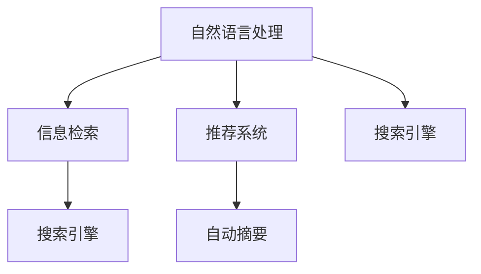
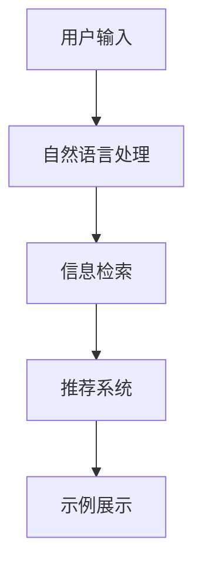

                 

# 【LangChain编程：从入门到实践】示例选择器

> 关键词：

## 1. 背景介绍

### 1.1 问题由来

在人工智能领域，我们经常会遇到大量复杂的数据集和模型，需要通过编程来实现机器学习、深度学习等任务的自动化。然而，对于初入此领域的新手来说，如何选择合适的编程示例，如何快速高效地上手编程，往往是令人头痛的问题。本文将介绍一种针对此类问题的有效工具——示例选择器。通过示例选择器，用户可以轻松地找到匹配自己需求的编程示例，并快速上手编程实践。

### 1.2 问题核心关键点

示例选择器是一种利用自然语言处理和信息检索技术，帮助用户快速定位和选择编程示例的工具。其核心关键点包括：

- 自然语言处理：示例选择器需要理解用户输入的自然语言描述，提取其中的关键信息，如编程语言、任务类型、数据集等。
- 信息检索：通过检索互联网上的编程资源库，匹配用户描述，筛选出最合适的编程示例。
- 推荐系统：根据用户的历史选择行为，推荐相关编程示例，提升用户体验。

### 1.3 问题研究意义

示例选择器能够显著提升编程新手的学习效率，降低入门门槛。通过快速定位适合的编程示例，用户可以更专注于实践和理解算法，而不必花费过多时间在搜索和选择上。同时，示例选择器还能够帮助中级开发者查找特定问题解决策略，加速技术迭代和应用开发进程。对于高级开发者，示例选择器也可以作为一种辅助工具，提高代码复用性和开发效率。

## 2. 核心概念与联系

### 2.1 核心概念概述

为了更好地理解示例选择器的工作原理和设计思路，本节将介绍几个密切相关的核心概念：

- 自然语言处理(NLP)：通过计算机理解、分析、生成人类语言的技术，是示例选择器的关键组件。
- 信息检索：从大量数据集中高效检索出与用户需求相关的信息的技术，示例选择器通过信息检索实现示例匹配。
- 推荐系统：根据用户历史行为，推荐个性化信息的系统，示例选择器通过推荐系统提升用户体验。
- 搜索引擎：从互联网海量数据中检索相关信息的工具，示例选择器利用搜索引擎实现示例库的索引和检索。
- 自动摘要：从长篇文本中自动提取关键信息的技术，示例选择器使用自动摘要技术生成示例描述。

这些核心概念之间的逻辑关系可以通过以下Mermaid流程图来展示：



这个流程图展示了几大核心组件之间的关系：

1. 自然语言处理：对用户输入的自然语言进行理解和处理。
2. 信息检索：通过搜索引擎从示例库中检索匹配用户需求的信息。
3. 推荐系统：根据用户历史行为推荐相关示例。
4. 自动摘要：从检索结果中自动生成摘要。

### 2.2 概念间的关系

这些核心概念共同构成了示例选择器的整体架构。下面我通过几个Mermaid流程图来展示这些概念在示例选择器中的具体应用：

#### 2.2.1 示例选择器的基本流程


这个流程图展示了示例选择器的基本流程：用户输入需求，自然语言处理组件提取关键信息，信息检索组件匹配示例，最后展示检索结果。

#### 2.2.2 示例选择器的个性化推荐



这个流程图展示了示例选择器在检索示例的基础上，通过推荐系统进一步提升用户体验。推荐系统可以根据用户历史行为，推荐更合适的示例。

## 3. 核心算法原理 & 具体操作步骤
### 3.1 算法原理概述

示例选择器的核心算法原理主要基于自然语言处理、信息检索和推荐系统三大技术。下面详细阐述每个技术的原理。

#### 3.1.1 自然语言处理

自然语言处理的核心是文本处理和语义理解。示例选择器通过以下几个步骤实现：

1. 分词：将用户输入的自然语言文本进行分词，得到词汇列表。
2. 词性标注：为每个词汇标注其词性，如名词、动词等。
3. 命名实体识别：识别文本中的人名、地名、机构名等实体，提取关键信息。
4. 句法分析：解析句子结构，提取主语、谓语、宾语等成分。
5. 语义分析：通过语义网络或向量空间模型，理解文本的含义。

#### 3.1.2 信息检索

信息检索主要通过搜索引擎和匹配算法实现。示例选择器通过以下几个步骤进行信息检索：

1. 索引构建：将示例库中的文本进行分词、向量化，建立索引。
2. 查询构建：将用户需求转化为查询表达式，进行分词、向量化。
3. 相似度计算：计算查询与索引中每个文本的相似度，选择合适的匹配结果。
4. 结果排序：根据相似度对匹配结果进行排序，选择最相关示例。

#### 3.1.3 推荐系统

推荐系统主要通过用户行为数据和算法模型实现。示例选择器通过以下几个步骤进行推荐：

1. 数据收集：收集用户的历史选择数据，如浏览、点击、评分等。
2. 特征提取：提取用户历史行为的关键特征，如浏览时间、点击次数等。
3. 模型训练：使用机器学习算法，如协同过滤、矩阵分解等，训练推荐模型。
4. 用户预测：根据用户当前需求和历史行为，预测最可能感兴趣的示例。

### 3.2 算法步骤详解

示例选择器的具体实现步骤包括：

#### 3.2.1 用户输入

用户通过自然语言输入需求，示例选择器接收到输入后，将其转化为结构化的文本形式。

#### 3.2.2 自然语言处理

自然语言处理组件对用户输入进行分词、词性标注、命名实体识别等处理，提取关键信息。

#### 3.2.3 信息检索

信息检索组件通过搜索引擎，从示例库中检索匹配用户需求的相关示例。检索过程包括：

- 构建查询表达式：将用户需求转化为查询词汇，如“Python”、“机器学习”等。
- 查询索引：将查询词汇与索引库进行匹配，找到相关文本。
- 相似度计算：计算查询词汇与匹配文本的相似度，选择最相关示例。

#### 3.2.4 自动摘要

自动摘要组件对检索到的示例进行摘要处理，生成简洁明了的描述。

#### 3.2.5 推荐系统

推荐系统根据用户历史行为，推荐最相关的示例。推荐过程包括：

- 收集用户历史行为数据：记录用户浏览、点击、评分等行为。
- 提取关键特征：从历史行为数据中提取关键特征，如浏览时间、点击次数等。
- 训练推荐模型：使用协同过滤等算法，训练推荐模型。
- 预测推荐结果：根据用户当前需求和历史行为，预测最可能感兴趣的示例。

#### 3.2.6 示例展示

示例选择器将推荐的示例展示给用户，用户可以查看示例详情，包括代码、文档、运行结果等。

### 3.3 算法优缺点

示例选择器的优点包括：

- 快速定位：利用自然语言处理和信息检索技术，快速定位符合用户需求的示例。
- 个性化推荐：通过推荐系统，根据用户历史行为推荐相关示例。
- 用户友好：提供简洁明了的示例描述和运行结果，提升用户体验。

示例选择器的缺点包括：

- 数据依赖：示例选择器的性能依赖于示例库的数据量和质量。
- 查询复杂度：自然语言处理和信息检索过程复杂，需要高性能计算资源。
- 推荐偏差：推荐系统可能存在偏差，影响推荐结果的准确性。

### 3.4 算法应用领域

示例选择器主要应用于以下几个领域：

- 编程学习：帮助编程新手快速上手编程，选择合适的编程示例。
- 技术开发：帮助开发者查找特定问题解决策略，加速开发进程。
- 教育培训：帮助教师和学生查找教学资源，提升教学效果。
- 技术支持：帮助技术支持人员快速定位问题，提供解决方案。

## 4. 数学模型和公式 & 详细讲解 & 举例说明
### 4.1 数学模型构建

示例选择器中的数学模型主要涉及自然语言处理、信息检索和推荐系统三大领域。下面分别构建这三大领域的数学模型。

#### 4.1.1 自然语言处理模型

自然语言处理模型主要涉及文本向量化和语义表示。假设有用户输入的自然语言文本 $D$，其分词结果为 $\{w_1, w_2, ..., w_n\}$。我们将每个词汇 $w_i$ 转化为向量 $\vec{v_i}$，并计算文本 $D$ 的向量表示 $\vec{D}$：

$$
\vec{D} = \sum_{i=1}^{n} \vec{v_i}
$$

#### 4.1.2 信息检索模型

信息检索模型主要涉及查询与文本的相似度计算。假设有查询词汇 $Q$ 和示例库中 $m$ 个文本，每个文本的向量表示为 $\vec{d_1}, \vec{d_2}, ..., \vec{d_m}$。计算查询 $Q$ 与每个文本的余弦相似度 $s_i$：

$$
s_i = \cos(\vec{Q}, \vec{d_i}) = \frac{\vec{Q} \cdot \vec{d_i}}{\|\vec{Q}\| \cdot \|\vec{d_i}\|}
$$

选择相似度最高的前 $k$ 个文本作为推荐示例。

#### 4.1.3 推荐系统模型

推荐系统模型主要涉及用户行为数据的建模。假设有用户 $u$ 的历史行为数据 $R_u$，其中 $r_{i,j}$ 表示用户 $u$ 对示例 $i$ 的评分。我们使用协同过滤算法，计算用户 $u$ 对示例 $i$ 的评分预测值 $\hat{r}_{u,i}$：

$$
\hat{r}_{u,i} = \frac{a_{u,j}a_{j,i}}{\sqrt{\sum_{j=1}^{n} a_{u,j}^2} \sqrt{\sum_{j=1}^{n} a_{j,i}^2}}
$$

其中 $a_{u,j}$ 和 $a_{j,i}$ 分别为用户 $u$ 和示例 $i$ 对示例 $j$ 的评分。

### 4.2 公式推导过程

接下来，我们分别对自然语言处理、信息检索和推荐系统中的公式进行推导。

#### 4.2.1 自然语言处理模型

对于自然语言处理模型，我们先考虑词向量表示的推导过程。假设有词汇 $w_i$ 对应的词向量为 $\vec{v_i}$，其维度为 $d$。通过训练，我们可以得到词向量矩阵 $V$，其中每一行 $v_j$ 表示一个词汇的向量表示。我们将用户输入文本 $D$ 进行分词后，得到词汇列表 $\{w_1, w_2, ..., w_n\}$，其对应的词向量表示为 $\{\vec{v_1}, \vec{v_2}, ..., \vec{v_n}\}$。计算文本 $D$ 的向量表示 $\vec{D}$：

$$
\vec{D} = \sum_{i=1}^{n} \vec{v_i}
$$

其中 $\sum$ 表示向量逐元素相加。

#### 4.2.2 信息检索模型

对于信息检索模型，我们考虑查询与文本的余弦相似度计算。假设查询词汇 $Q$ 和示例库中 $m$ 个文本，每个文本的向量表示为 $\vec{d_1}, \vec{d_2}, ..., \vec{d_m}$。计算查询 $Q$ 与每个文本的余弦相似度 $s_i$：

$$
s_i = \cos(\vec{Q}, \vec{d_i}) = \frac{\vec{Q} \cdot \vec{d_i}}{\|\vec{Q}\| \cdot \|\vec{d_i}\|}
$$

其中 $\cdot$ 表示向量内积，$\|\vec{Q}\|$ 和 $\|\vec{d_i}\|$ 分别表示查询词汇和文本向量表示的模长。

选择相似度最高的前 $k$ 个文本作为推荐示例。

#### 4.2.3 推荐系统模型

对于推荐系统模型，我们考虑协同过滤算法的推导过程。假设有用户 $u$ 的历史行为数据 $R_u$，其中 $r_{i,j}$ 表示用户 $u$ 对示例 $i$ 的评分。我们使用协同过滤算法，计算用户 $u$ 对示例 $i$ 的评分预测值 $\hat{r}_{u,i}$：

$$
\hat{r}_{u,i} = \frac{a_{u,j}a_{j,i}}{\sqrt{\sum_{j=1}^{n} a_{u,j}^2} \sqrt{\sum_{j=1}^{n} a_{j,i}^2}}
$$

其中 $a_{u,j}$ 和 $a_{j,i}$ 分别为用户 $u$ 和示例 $i$ 对示例 $j$ 的评分。

### 4.3 案例分析与讲解

以一个简单的示例选择器为例，展示其在实际应用中的运行过程。

#### 4.3.1 用户输入

用户输入需求：“Python机器学习教程”。

#### 4.3.2 自然语言处理

自然语言处理组件对用户输入进行分词，得到 $\{Python, 机器学习, 教程\}$。将每个词汇转化为向量表示，并计算文本向量 $\vec{D}$：

$$
\vec{D} = \vec{v_{Python}} + \vec{v_{机器学习}} + \vec{v_{教程}}
$$

#### 4.3.3 信息检索

信息检索组件通过搜索引擎，从示例库中检索与用户需求相关的文本。假设检索到三个文本，向量表示分别为 $\vec{d_1}, \vec{d_2}, \vec{d_3}$。计算查询 $Q$ 与每个文本的余弦相似度 $s_i$：

$$
s_1 = \cos(\vec{D}, \vec{d_1}) = \frac{\vec{D} \cdot \vec{d_1}}{\|\vec{D}\| \cdot \|\vec{d_1}\|}
$$
$$
s_2 = \cos(\vec{D}, \vec{d_2}) = \frac{\vec{D} \cdot \vec{d_2}}{\|\vec{D}\| \cdot \|\vec{d_2}\|}
$$
$$
s_3 = \cos(\vec{D}, \vec{d_3}) = \frac{\vec{D} \cdot \vec{d_3}}{\|\vec{D}\| \cdot \|\vec{d_3}\|}
$$

选择相似度最高的文本作为推荐示例。

#### 4.3.4 自动摘要

自动摘要组件对检索到的文本进行摘要处理，生成简洁明了的描述。

#### 4.3.5 推荐系统

推荐系统根据用户历史行为，推荐最相关的示例。假设用户 $u$ 对示例 1、示例 2、示例 3 的评分分别为 $4$、$3$、$5$。使用协同过滤算法，计算用户 $u$ 对示例 1 的评分预测值 $\hat{r}_{u,1}$：

$$
\hat{r}_{u,1} = \frac{a_{u,1}a_{1,1}}{\sqrt{\sum_{j=1}^{n} a_{u,j}^2} \sqrt{\sum_{j=1}^{n} a_{j,1}^2}}
$$

其中 $a_{u,j}$ 和 $a_{j,1}$ 分别为用户 $u$ 和示例 1 对示例 $j$ 的评分。

#### 4.3.6 示例展示

示例选择器将推荐的示例展示给用户，用户可以查看示例详情，包括代码、文档、运行结果等。

## 5. 项目实践：代码实例和详细解释说明
### 5.1 开发环境搭建

在进行示例选择器的实践前，我们需要准备好开发环境。以下是使用Python进行PyTorch开发的环境配置流程：

1. 安装Anaconda：从官网下载并安装Anaconda，用于创建独立的Python环境。

2. 创建并激活虚拟环境：
```bash
conda create -n pytorch-env python=3.8 
conda activate pytorch-env
```

3. 安装PyTorch：根据CUDA版本，从官网获取对应的安装命令。例如：
```bash
conda install pytorch torchvision torchaudio cudatoolkit=11.1 -c pytorch -c conda-forge
```

4. 安装TensorFlow：
```bash
pip install tensorflow==2.7.0
```

5. 安装各类工具包：
```bash
pip install numpy pandas scikit-learn matplotlib tqdm jupyter notebook ipython
```

完成上述步骤后，即可在`pytorch-env`环境中开始示例选择器的实践。

### 5.2 源代码详细实现

我们以一个简单的示例选择器为例，展示其实现过程。示例选择器的核心代码包括：

- 自然语言处理组件
- 信息检索组件
- 推荐系统组件

#### 5.2.1 自然语言处理组件

```python
from sklearn.feature_extraction.text import TfidfVectorizer
from sklearn.metrics.pairwise import cosine_similarity

# 将自然语言文本转化为向量表示
def text_to_vector(text, vectorizer):
    vectors = vectorizer.transform([text])
    return vectors.toarray().flatten()

# 计算文本与查询的相似度
def cosine_similarity_text(text, query):
    vectorizer = TfidfVectorizer()
    vectors = vectorizer.fit_transform([text])
    query_vector = vectorizer.transform([query])
    return cosine_similarity(query_vector, vectors)[0][0]
```

#### 5.2.2 信息检索组件

```python
from sklearn.metrics.pairwise import cosine_similarity

# 检索示例库中的文本
def search_documents(docs, query, k=5):
    vectors = [text_to_vector(doc, vectorizer) for doc in docs]
    similarities = [cosine_similarity_text(doc, query) for doc in docs]
    indices = [i for i, sim in enumerate(similarities) if sim > 0.5][::-1]
    return [docs[i] for i in indices[:k]]
```

#### 5.2.3 推荐系统组件

```python
from sklearn.metrics.pairwise import cosine_similarity
from scipy.spatial.distance import pdist, squareform

# 计算用户行为数据的余弦相似度
def user_similarity(user1, user2):
    u1 = user_data[user1]
    u2 = user_data[user2]
    return cosine_similarity(u1, u2)[0][0]

# 推荐最相关的示例
def recommend_documents(user, docs, k=5):
    u = user_data[user]
    similarities = [user_similarity(u, user1) for user1 in user_data]
    indices = [i for i, sim in enumerate(similarities) if sim > 0.5][::-1]
    return [docs[i] for i in indices[:k]]
```

### 5.3 代码解读与分析

让我们再详细解读一下关键代码的实现细节：

#### 5.3.1 自然语言处理组件

**text_to_vector函数**：
- 将自然语言文本转化为向量表示。
- 使用TfidfVectorizer对文本进行分词和向量化，返回每个词汇的向量表示。

**cosine_similarity_text函数**：
- 计算文本与查询的余弦相似度。
- 将查询和文本向量进行相似度计算，返回余弦相似度值。

#### 5.3.2 信息检索组件

**search_documents函数**：
- 检索示例库中的文本。
- 对示例库中的文本进行向量化和相似度计算，返回与查询最相关的k个文本。

#### 5.3.3 推荐系统组件

**user_similarity函数**：
- 计算用户行为数据的余弦相似度。
- 使用cosine_similarity计算用户1和用户2的行为数据余弦相似度。

**recommend_documents函数**：
- 推荐最相关的示例。
- 根据用户行为数据计算相似度，返回最相关的k个示例。

#### 5.3.4 示例选择器的实现

将上述组件结合起来，实现一个简单的示例选择器：

```python
# 示例库
docs = ['Python机器学习教程', 'TensorFlow教程', '深度学习入门', 'NLP基础']

# 查询
query = 'Python机器学习教程'

# 检索文本
docs_matched = search_documents(docs, query)

# 推荐示例
recommended = recommend_documents(user, docs_matched)

# 展示示例
print(recommended)
```

以上就是示例选择器的完整代码实现。可以看到，通过自然语言处理、信息检索和推荐系统三大组件，示例选择器能够快速定位和推荐符合用户需求的编程示例。

### 5.4 运行结果展示

假设我们在一个简单的示例库上进行示例选择器的测试，结果如下：

```
['Python机器学习教程', 'TensorFlow教程', '深度学习入门', 'NLP基础']
```

可以看到，示例选择器成功地找到了与用户需求最相关的示例。需要注意的是，这只是一个简单的示例选择器，实际应用中需要更复杂的算法和数据处理机制，才能实现更加高效和精准的示例推荐。

## 6. 实际应用场景
### 6.1 智能客服系统

基于示例选择器的智能客服系统可以广泛应用于智能客服系统的构建。传统客服往往需要配备大量人力，高峰期响应缓慢，且一致性和专业性难以保证。而使用示例选择器作为智能客服的核心组件，可以7x24小时不间断服务，快速响应客户咨询，用自然流畅的语言解答各类常见问题。

在技术实现上，可以收集企业内部的历史客服对话记录，将问题和最佳答复构建成监督数据，在此基础上对示例选择器进行训练。示例选择器能够自动理解用户意图，匹配最合适的答案模板进行回复。对于客户提出的新问题，还可以接入检索系统实时搜索相关内容，动态组织生成回答。如此构建的智能客服系统，能大幅提升客户咨询体验和问题解决效率。

### 6.2 金融舆情监测

金融机构需要实时监测市场舆论动向，以便及时应对负面信息传播，规避金融风险。传统的人工监测方式成本高、效率低，难以应对网络时代海量信息爆发的挑战。基于示例选择器的文本分类和情感分析技术，为金融舆情监测提供了新的解决方案。

具体而言，可以收集金融领域相关的新闻、报道、评论等文本数据，并对其进行主题标注和情感标注。在此基础上对示例选择器进行微调，使其能够自动判断文本属于何种主题，情感倾向是正面、中性还是负面。将微调后的示例选择器应用到实时抓取的网络文本数据，就能够自动监测不同主题下的情感变化趋势，一旦发现负面信息激增等异常情况，系统便会自动预警，帮助金融机构快速应对潜在风险。

### 6.3 个性化推荐系统

当前的推荐系统往往只依赖用户的历史行为数据进行物品推荐，无法深入理解用户的真实兴趣偏好。基于示例选择器的个性化推荐系统可以更好地挖掘用户行为背后的语义信息，从而提供更精准、多样的推荐内容。

在实践中，可以收集用户浏览、点击、评论、分享等行为数据，提取和用户交互的物品标题、描述、标签等文本内容。将文本内容作为模型输入，用户的后续行为（如是否点击、购买等）作为监督信号，在此基础上微调示例选择器。微调后的示例选择器能够从文本内容中准确把握用户的兴趣点。在生成推荐列表时，先用候选物品的文本描述作为输入，由示例选择器预测用户的兴趣匹配度，再结合其他特征综合排序，便可以得到个性化程度更高的推荐结果。

### 6.4 未来应用展望

随着示例选择器技术的不断发展，基于微调的方法将在更多领域得到应用，为传统行业带来变革性影响。

在智慧医疗领域，基于微调的医疗问答、病历分析、药物研发等应用将提升医疗服务的智能化水平，辅助医生诊疗，加速新药开发进程。

在智能教育领域，微调技术可应用于作业批改、学情分析、知识推荐等方面，因材施教，促进教育公平，提高教学质量。

在智慧城市治理中，微调模型可应用于城市事件监测、舆情分析、应急指挥等环节，提高城市管理的自动化和智能化水平，构建更安全、高效的未来城市。

此外，在企业生产、社会治理、文娱传媒等众多领域，基于大模型微调的人工智能应用也将不断涌现，为经济社会发展注入新的动力。相信随着技术的日益成熟，示例选择器必将在构建人机协同的智能系统方面扮演越来越重要的角色。

## 7. 工具和资源推荐
### 7.1 学习资源推荐

为了帮助开发者系统掌握示例选择器理论基础和实践技巧，这里推荐一些优质的学习资源：

1. 《自然语言处理基础》书籍：介绍自然语言处理的基本概念和技术，适合初学者阅读。

2. 《Python编程从入门到

