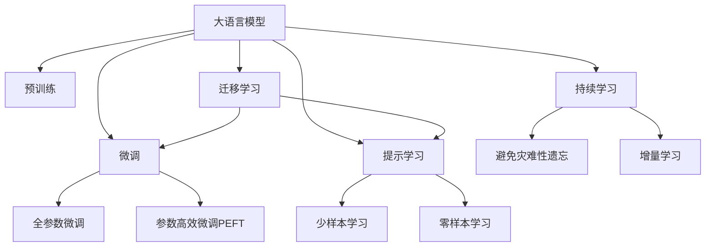
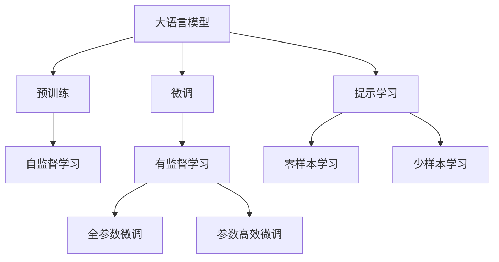
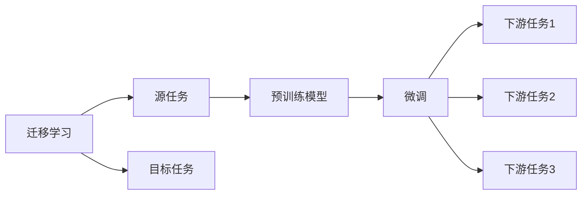
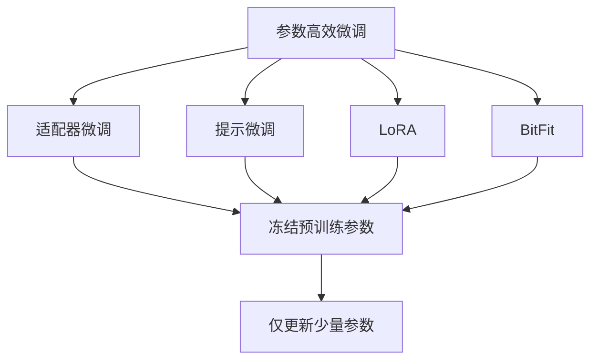
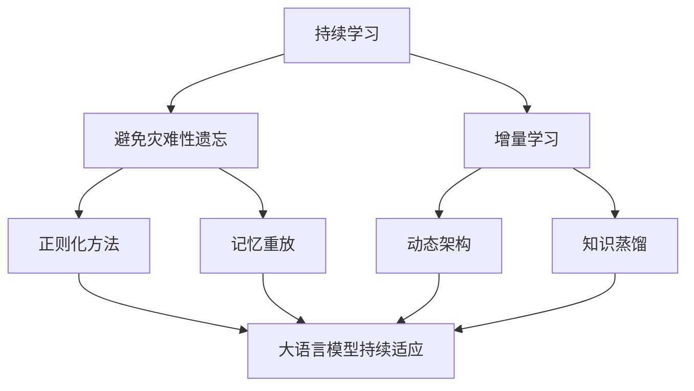
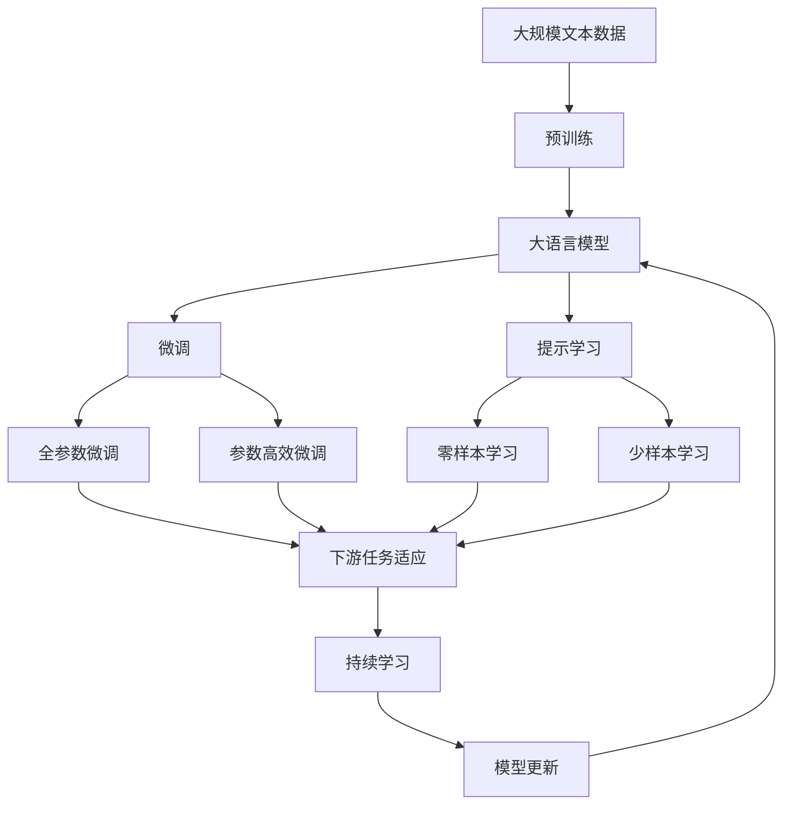

                 

# 【LangChain编程：从入门到实践】自定义提示模板

> 关键词：大语言模型,Prompt Learning,自定义提示模板,微调,Fine-tuning

## 1. 背景介绍

### 1.1 问题由来
随着大语言模型（Large Language Models, LLMs）的不断发展，其在自然语言处理（Natural Language Processing, NLP）领域的应用日益广泛，从文本分类、命名实体识别到对话生成、摘要生成等任务均有出色的表现。然而，这些模型在面对复杂、多变的任务时，往往需要大量的标注数据和复杂的微调过程，成本较高且效率较低。

为了解决这一问题，提示学习（Prompt Learning）应运而生。提示学习通过在输入文本中添加特定的提示（Prompt），引导模型按照预期的方式输出，从而实现了在少样本甚至无样本的情况下对模型进行微调，极大地提高了模型对新任务的适应能力。

### 1.2 问题核心关键点
提示学习在大语言模型中的应用，使得模型的微调变得更加灵活和高效。通过精心设计提示模板，可以在不更新模型参数的情况下，实现对模型的零样本或少样本学习，从而提升模型在特定任务上的表现。这一过程包括：

1. 设计提示模板：根据具体任务需求，编写能够引导模型输出的提示。
2. 微调模型：将提示模板与模型结合，进行微调，提升模型在该任务上的性能。
3. 应用提示学习：在实际应用中，使用微调后的模型对新的输入进行推理，得到预期结果。

提示学习在大语言模型中的应用，不仅能够降低微调成本，还能提高模型的泛化能力和可解释性，成为当前大语言模型研究的热点方向之一。

### 1.3 问题研究意义
提示学习的研究和应用，对于拓展大语言模型的应用范围，提升下游任务的性能，加速NLP技术的产业化进程具有重要意义：

1. 降低应用开发成本：提示学习通过精心的提示设计，使得模型能够快速适应新任务，减少了从头开发所需的数据、计算和人力等成本投入。
2. 提升模型效果：提示学习能够通过简单的提示设计，显著提升模型在特定任务上的表现。
3. 加速开发进度：通过提示学习，模型可以快速适应新任务，缩短了开发周期。
4. 带来技术创新：提示学习催生了零样本学习和少样本学习等新的研究方向，推动了NLP技术的发展。
5. 赋能产业升级：提示学习使得NLP技术更容易被各行各业所采用，为传统行业数字化转型升级提供新的技术路径。

## 2. 核心概念与联系

### 2.1 核心概念概述

为更好地理解提示学习在大语言模型中的应用，本节将介绍几个密切相关的核心概念：

- 大语言模型(Large Language Model, LLM)：以自回归(如GPT)或自编码(如BERT)模型为代表的大规模预训练语言模型。通过在大规模无标签文本语料上进行预训练，学习通用的语言表示，具备强大的语言理解和生成能力。

- 预训练(Pre-training)：指在大规模无标签文本语料上，通过自监督学习任务训练通用语言模型的过程。常见的预训练任务包括言语建模、遮挡语言模型等。

- 微调(Fine-tuning)：指在预训练模型的基础上，使用下游任务的少量标注数据，通过有监督学习优化模型在特定任务上的性能。通常只需要调整顶层分类器或解码器，并以较小的学习率更新全部或部分的模型参数。

- 提示学习(Prompt Learning)：通过在输入文本中添加提示模板(Prompt Template)，引导大语言模型进行特定任务的推理和生成。可以在不更新模型参数的情况下，实现零样本或少样本学习。

- 少样本学习(Few-shot Learning)：指在只有少量标注样本的情况下，模型能够快速适应新任务的学习方法。在大语言模型中，通常通过在输入中提供少量示例来实现，无需更新模型参数。

- 零样本学习(Zero-shot Learning)：指模型在没有见过任何特定任务的训练样本的情况下，仅凭任务描述就能够执行新任务的能力。大语言模型通过预训练获得的广泛知识，使其能够理解任务指令并生成相应输出。

- 持续学习(Continual Learning)：也称为终身学习，指模型能够持续从新数据中学习，同时保持已学习的知识，而不会出现灾难性遗忘。这对于保持大语言模型的时效性和适应性至关重要。

这些核心概念之间的逻辑关系可以通过以下Mermaid流程图来展示：



这个流程图展示了大语言模型的核心概念及其之间的关系：

1. 大语言模型通过预训练获得基础能力。
2. 微调是对预训练模型进行任务特定的优化，可以分为全参数微调和参数高效微调（PEFT）。
3. 提示学习是一种不更新模型参数的方法，可以实现零样本和少样本学习。
4. 迁移学习是连接预训练模型与下游任务的桥梁，可以通过微调或提示学习来实现。
5. 持续学习旨在使模型能够不断学习新知识，同时避免遗忘旧知识。

这些概念共同构成了大语言模型的学习和应用框架，使其能够在各种场景下发挥强大的语言理解和生成能力。通过理解这些核心概念，我们可以更好地把握大语言模型的工作原理和优化方向。

### 2.2 概念间的关系

这些核心概念之间存在着紧密的联系，形成了大语言模型的学习生态系统。下面我们通过几个Mermaid流程图来展示这些概念之间的关系。

#### 2.2.1 大语言模型的学习范式



这个流程图展示了大语言模型的三种主要学习范式：预训练、微调和提示学习。预训练主要采用自监督学习方法，而微调则是有监督学习的过程。提示学习可以实现零样本和少样本学习。微调又可以分为全参数微调和参数高效微调（PEFT）两种方式。

#### 2.2.2 迁移学习与微调的关系



这个流程图展示了迁移学习的基本原理，以及它与微调的关系。迁移学习涉及源任务和目标任务，预训练模型在源任务上学习，然后通过微调适应各种下游任务（目标任务）。

#### 2.2.3 参数高效微调方法



这个流程图展示了几种常见的参数高效微调方法，包括适配器微调、提示微调、LoRA和BitFit。这些方法的共同特点是冻结大部分预训练参数，只更新少量参数，从而提高微调效率。

#### 2.2.4 持续学习在大语言模型中的应用



这个流程图展示了持续学习在大语言模型中的应用。持续学习的主要目标是避免灾难性遗忘和实现增量学习。通过正则化方法、记忆重放、动态架构和知识蒸馏等技术，可以使大语言模型持续适应新的任务和数据。

### 2.3 核心概念的整体架构

最后，我们用一个综合的流程图来展示这些核心概念在大语言模型微调过程中的整体架构：



这个综合流程图展示了从预训练到微调，再到持续学习的完整过程。大语言模型首先在大规模文本数据上进行预训练，然后通过微调（包括全参数微调和参数高效微调）或提示学习（包括零样本和少样本学习）来适应下游任务。最后，通过持续学习技术，模型可以不断更新和适应新的任务和数据。

## 3. 核心算法原理 & 具体操作步骤
### 3.1 算法原理概述

提示学习在大语言模型中的应用，本质上是利用提示模板（Prompt Template）来引导模型输出，从而实现对模型的微调。其核心思想是：通过精心的提示设计，模型能够理解提示中的关键信息，并根据这些信息生成相应的输出。

形式化地，假设预训练模型为 $M_{\theta}$，其中 $\theta$ 为预训练得到的模型参数。给定下游任务 $T$ 的少量标注数据集 $D=\{(x_i, y_i)\}_{i=1}^N$，提示学习的过程为：

1. 设计提示模板 $p(x)$，其中 $x$ 为输入文本。
2. 将提示模板与输入文本拼接，得到新的输入 $x_p=x+p(x)$。
3. 对新的输入进行前向传播，得到模型的输出 $\hat{y}=M_{\theta}(x_p)$。
4. 使用损失函数 $\ell(\hat{y}, y)$ 计算模型的预测输出与真实标签之间的差异。
5. 通过反向传播算法，更新模型参数 $\theta$ 以最小化损失函数。

通过上述过程，模型可以逐步适应提示模板中的任务描述，并生成符合预期要求的输出。这一过程不需要更新模型的大部分参数，而是通过微调顶层或少量的输出层和解码器，提高模型对新任务的适应能力。

### 3.2 算法步骤详解

提示学习在大语言模型中的应用，主要包括提示设计、模型微调和推理预测三个步骤：

**Step 1: 设计提示模板**

提示模板是提示学习中的关键，其设计需要考虑任务的特定需求和模型的预训练能力。一般来说，提示模板包括以下几个部分：

- 任务描述：简要描述任务的目标和输入格式。
- 样本示例：提供少量示例，展示任务的输入输出格式。
- 语言引导：通过语言提示，引导模型输出正确的格式或内容。

例如，对于命名实体识别（Named Entity Recognition, NER）任务，提示模板可以设计为：

```
在以下文本中，请识别出所有的人名、地名和机构名：

[输入文本]
```

**Step 2: 微调模型**

设计好提示模板后，需要将提示模板与预训练模型结合，进行微调。微调的具体步骤如下：

1. 加载预训练模型 $M_{\theta}$。
2. 准备标注数据集 $D=\{(x_i, y_i)\}_{i=1}^N$。
3. 定义损失函数 $\ell(\hat{y}, y)$，其中 $\hat{y}$ 为模型输出的预测结果，$y$ 为真实标签。
4. 定义优化器，如 Adam、SGD 等。
5. 将提示模板与输入文本拼接，得到新的输入 $x_p=x+p(x)$。
6. 对新的输入进行前向传播，计算损失函数。
7. 使用优化器更新模型参数 $\theta$。

**Step 3: 推理预测**

微调完成后，模型可以用于对新的输入进行推理预测。具体步骤如下：

1. 加载微调后的模型 $M_{\theta^*}$。
2. 准备新的输入文本 $x$。
3. 设计新的提示模板 $p(x)$。
4. 将新的提示模板与输入文本拼接，得到新的输入 $x_p=x+p(x)$。
5. 对新的输入进行前向传播，得到模型的输出 $\hat{y}=M_{\theta^*}(x_p)$。
6. 输出模型的预测结果 $\hat{y}$。

### 3.3 算法优缺点

提示学习在大语言模型中的应用，具有以下优点：

1. 简单高效。通过精心设计提示模板，可以在不更新模型参数的情况下，实现对新任务的适应。
2. 通用适用。提示学习适用于各种 NLP 任务，包括分类、匹配、生成等。
3. 参数高效。提示学习通常只微调顶层或少量参数，减少了微调成本。
4. 效果显著。提示学习在学术界和工业界的诸多任务上，已经刷新了最先进的性能指标。

同时，提示学习也存在一定的局限性：

1. 提示模板设计难度大。提示模板的设计需要丰富的经验和专业知识，设计不当可能导致模型无法理解。
2. 依赖提示质量。提示模板的描述如果不够准确，可能导致模型输出错误。
3. 可能引入偏差。提示模板可能包含偏见或不公平的语言，影响模型输出。
4. 可解释性不足。提示学习的模型通常缺乏可解释性，难以对其推理逻辑进行分析和调试。

尽管存在这些局限性，但就目前而言，提示学习仍然是实现大语言模型微调的一种高效且灵活的方法。未来相关研究的重点在于如何进一步降低提示设计的难度，提高提示模板的质量和可解释性，从而进一步提升模型性能。

### 3.4 算法应用领域

提示学习在大语言模型中的应用，已经在多个 NLP 领域取得了显著成果，包括：

- 文本分类：如情感分析、主题分类、意图识别等。通过设计合适的提示模板，模型可以理解任务描述，自动分类文本。
- 命名实体识别：识别文本中的人名、地名、机构名等特定实体。提示模板可以描述实体的边界和类型。
- 关系抽取：从文本中抽取实体之间的语义关系。提示模板可以引导模型进行实体-关系三元组的抽取。
- 问答系统：对自然语言问题给出答案。提示模板可以描述问题类型和答案格式，引导模型生成答案。
- 机器翻译：将源语言文本翻译成目标语言。提示模板可以描述翻译任务和输出格式，提高翻译质量。
- 文本摘要：将长文本压缩成简短摘要。提示模板可以描述摘要的要求和格式，引导模型生成摘要。
- 对话系统：使机器能够与人自然对话。提示模板可以描述对话历史和上下文，引导模型进行回复生成。

除了上述这些经典任务外，提示学习还被创新性地应用到更多场景中，如可控文本生成、常识推理、代码生成、数据增强等，为 NLP 技术带来了全新的突破。随着提示学习范式的发展，相信 NLP 技术将在更广阔的应用领域大放异彩。

## 4. 数学模型和公式 & 详细讲解  
### 4.1 数学模型构建

本节将使用数学语言对提示学习在大语言模型中的应用进行更加严格的刻画。

记预训练语言模型为 $M_{\theta}$，其中 $\theta$ 为预训练得到的模型参数。假设提示学习任务为 $T$，其训练集为 $D=\{(x_i, y_i)\}_{i=1}^N$，其中 $x_i$ 为输入文本，$y_i$ 为真实标签。

定义提示模板为 $p(x)$，其中 $x$ 为输入文本。提示模板的输出为 $p(x)=(p_1(x), p_2(x), ..., p_k(x))$，其中 $p_i(x)$ 为第 $i$ 个提示部分，$k$ 为提示部分的数量。

定义提示模板与输入文本拼接后的新输入为 $x_p=x+p(x)$，模型对新输入的前向传播结果为 $\hat{y}=M_{\theta}(x_p)$。

提示学习的目标是最小化提示模板与模型输出的差异，即：

$$
\min_{\theta, p(x)} \ell(\hat{y}, y)
$$

其中 $\ell(\hat{y}, y)$ 为损失函数，可以是交叉熵损失、均方误差损失等。

### 4.2 公式推导过程

以下我们以二分类任务为例，推导交叉熵损失函数及其梯度的计算公式。

假设模型 $M_{\theta}$ 在输入 $x$ 上的输出为 $\hat{y}=M_{\theta}(x) \in [0,1]$，表示样本属于正类的概率。真实标签 $y \in \{0,1\}$。则二分类交叉熵损失函数定义为：

$$
\ell(M_{\theta}(x),y) = -[y\log \hat{y} + (1-y)\log (1-\hat{y})]
$$

将其代入提示学习的目标函数，得：

$$
\min_{\theta, p(x)} \sum_{i=1}^N \ell(M_{\theta}(x_i+p(x_i)), y_i)
$$

根据链式法则，损失函数对模型参数 $\theta$ 的梯度为：

$$
\frac{\partial \ell(M_{\theta}(x_i+p(x_i)), y_i)}{\partial \theta} = -\frac{y_i}{M_{\theta}(x_i+p(x_i))} + \frac{1-y_i}{1-M_{\theta}(x_i+p(x_i))}
$$

在得到损失函数的梯度后，即可带入参数更新公式，完成模型的迭代优化。重复上述过程直至收敛，最终得到适应下游任务的提示模板 $p(x)$。

## 5. 项目实践：代码实例和详细解释说明
### 5.1 开发环境搭建

在进行提示学习实践前，我们需要准备好开发环境。以下是使用Python进行PyTorch开发的环境配置流程：

1. 安装Anaconda：从官网下载并安装Anaconda，用于创建独立的Python环境。

2. 创建并激活虚拟环境：
```bash
conda create -n pytorch-env python=3.8 
conda activate pytorch-env
```

3. 安装PyTorch：根据CUDA版本，从官网获取对应的安装命令。例如：
```bash
conda install pytorch torchvision torchaudio cudatoolkit=11.1 -c pytorch -c conda-forge
```

4. 安装Transformers库：
```bash
pip install transformers
```

5. 安装各类工具包：
```bash
pip install numpy pandas scikit-learn matplotlib tqdm jupyter notebook ipython
```

完成上述步骤后，即可在`pytorch-env`环境中开始提示学习实践。

### 5.2 源代码详细实现

这里我们以命名实体识别(NER)任务为例，给出使用Transformers库对BERT模型进行提示学习的PyTorch代码实现。

首先，定义NER任务的数据处理函数：

```python
from transformers import BertTokenizer
from torch.utils.data import Dataset
import torch

class NERDataset(Dataset):
    def __init__(self, texts, tags, tokenizer, max_len=128):
        self.texts = texts
        self.tags = tags
        self.tokenizer = tokenizer
        self.max_len = max_len
        
    def __len__(self):
        return len(self.texts)
    
    def __getitem__(self, item):
        text = self.texts[item]
        tags = self.tags[item]
        
        encoding = self.tokenizer(text, return_tensors='pt', max_length=self.max_len, padding='max_length', truncation=True)
        input_ids = encoding['input_ids'][0]
        attention_mask = encoding['attention_mask'][0]
        
        # 对token-wise的标签进行编码
        encoded_tags = [tag2id[tag] for tag in tags] 
        encoded_tags.extend([tag2id['O']] * (self.max_len - len(encoded_tags)))
        labels = torch.tensor(encoded_tags, dtype=torch.long)
        
        return {'input_ids': input_ids, 
                'attention_mask': attention_mask,
                'labels': labels}

# 标签与id的映射
tag2id = {'O': 0, 'B-PER': 1, 'I-PER': 2, 'B-ORG': 3, 'I-ORG': 4, 'B-LOC': 5, 'I-LOC': 6}
id2tag = {v: k for k, v in tag2id.items()}

# 创建dataset
tokenizer = BertTokenizer.from_pretrained('bert-base-cased')

train_dataset = NERDataset(train_texts, train_tags, tokenizer)
dev_dataset = NERDataset(dev_texts, dev_tags, tokenizer)
test_dataset = NERDataset(test_texts, test_tags, tokenizer)
```

然后，定义模型和优化器：

```python
from transformers import BertForTokenClassification, AdamW

model = BertForTokenClassification.from_pretrained('bert-base-cased', num_labels=len(tag2id))

optimizer = AdamW(model.parameters(), lr=2e-5)
```

接着，定义训练和评估函数：

```python
from torch.utils.data import DataLoader
from tqdm import tqdm
from sklearn.metrics import classification_report

device = torch.device('cuda') if torch.cuda.is_available() else torch.device('cpu')
model.to(device)

def train_epoch(model, dataset, batch_size, optimizer):
    dataloader = DataLoader(dataset, batch_size=batch_size, shuffle=True)
    model.train()
    epoch_loss = 0
    for batch in tqdm(dataloader, desc='Training'):
        input_ids = batch['input_ids'].to(device)
        attention_mask = batch['attention_mask'].to(device)
        labels = batch['labels'].to(device)
        model.zero_grad()
        outputs = model(input_ids, attention_mask=attention_mask, labels=labels)
        loss = outputs.loss
        epoch_loss += loss.item()
        loss.backward()
        optimizer.step()
    return epoch_loss / len(dataloader)

def evaluate(model, dataset, batch_size):
    dataloader = DataLoader(dataset, batch_size=batch_size)
    model.eval()
    preds, labels = [], []
    with torch.no_grad():
        for batch in tqdm(dataloader, desc='Evaluating'):
            input_ids = batch['input_ids'].to(device)
            attention_mask = batch['attention_mask'].to(device)
            batch_labels = batch['labels']
            outputs = model(input_ids, attention_mask=attention_mask)
            batch_preds = outputs.logits.argmax(dim=2).to('cpu').tolist()
            batch_labels = batch_labels.to('cpu').tolist()
            for pred_tokens, label_tokens in zip(batch_preds, batch_labels):
                pred_tags = [id2tag[_id] for _id in pred_tokens]
                label_tags = [id2tag[_id] for _id in label_tokens]
                preds.append(pred_tags[:len(label_tags)])
                labels.append(label_tags)
                
    print(classification_report(labels, preds))
```

最后，启动训练流程并在测试集上评估：

```python
epochs = 5
batch_size = 16

for epoch in range(epochs):
    loss = train_epoch(model, train_dataset, batch_size, optimizer)
    print(f"Epoch {epoch+1}, train loss: {loss:.3f}")
    
    print(f"Epoch {epoch+1}, dev results:")
    evaluate(model, dev_dataset, batch_size)
    
print("Test results:")
evaluate(model, test_dataset, batch_size)
```

以上就是使用PyTorch对BERT进行命名实体识别任务提示学习的完整代码实现。可以看到，得益于Transformers库的强大封装，我们可以用相对简洁的代码完成BERT模型的加载和提示学习。

### 5.3 代码解读与分析

让我们再详细解读一下关键代码的实现细节：

**NERDataset类**：
- `__init__`方法：初始化文本、标签、分词器等关键组件。
- `__len__`方法：返回数据集的样本数量。
- `__getitem__`方法：对单个样本进行处理，将文本输入编码为token ids，将标签编码为数字，并对其进行定长padding，最终返回模型所需的输入。

**tag2id和id2tag字典**：
- 定义了标签与数字id之间的映射关系，用于将token-wise的预测结果解码回真实的标签。

**训练和评估函数**：
- 使用PyTorch的DataLoader对数据集进行批次化加载，供模型训练和推理使用。
- 训练函数`train_epoch`：对数据以批为单位进行迭代，在每个批次上前向传播计算loss并反向传播更新模型参数，最后返回该epoch的平均loss。
- 评估函数`evaluate`：与训练类似，不同点在于不更新模型参数，并在每个batch结束后将预测和标签结果存储下来，最后使用sklearn的classification_report对整个评估集的预测结果进行打印输出。

**训练流程**：
- 定义总的epoch数和batch size，开始循环迭代
- 每个epoch内，先在训练集上训练，输出平均loss
- 在验证

