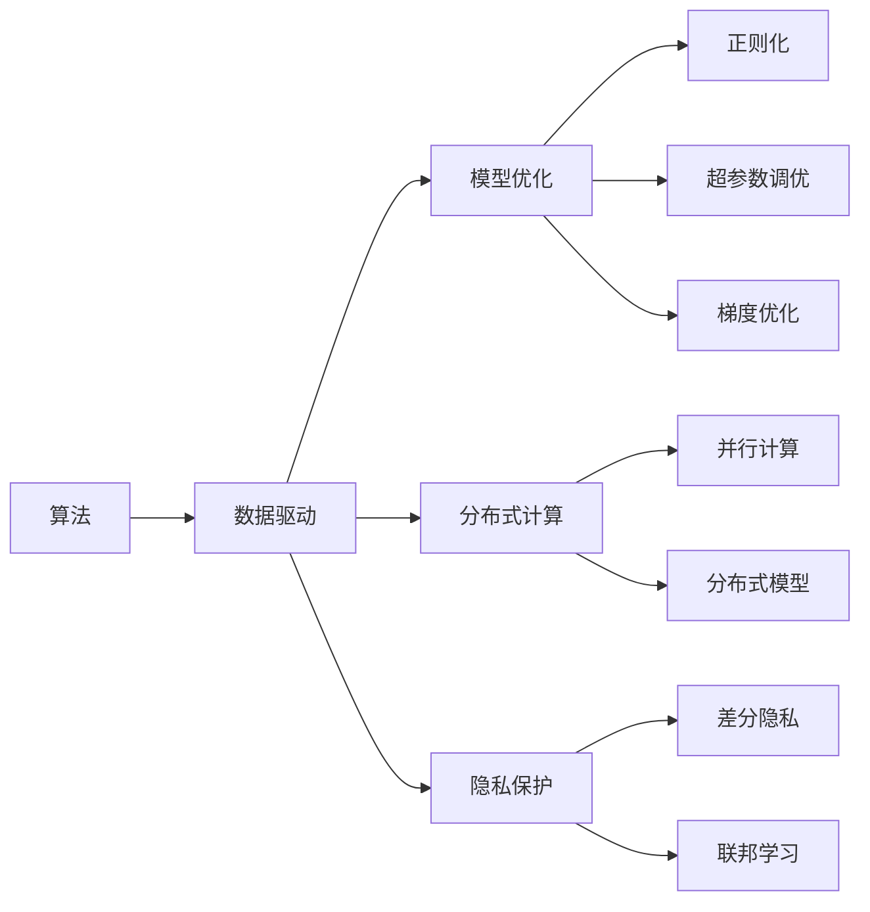
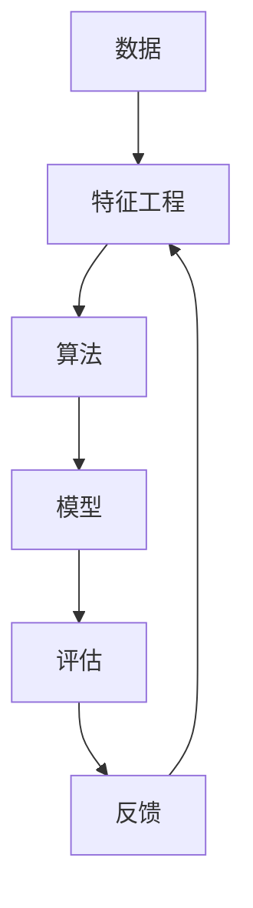
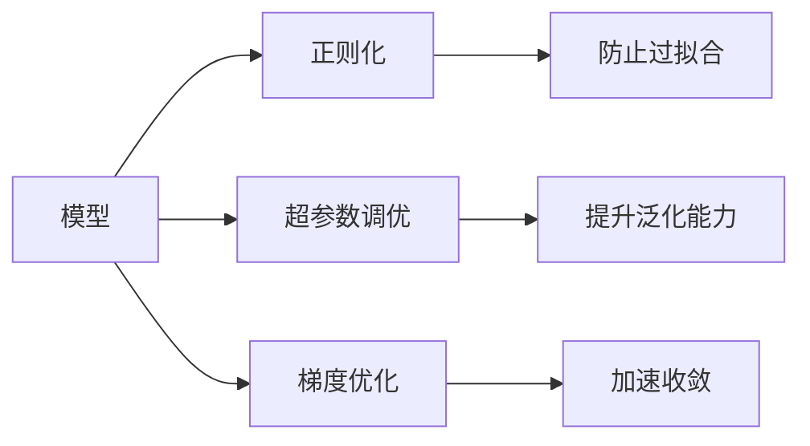
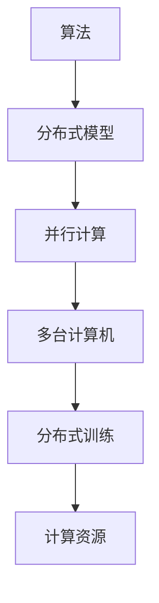
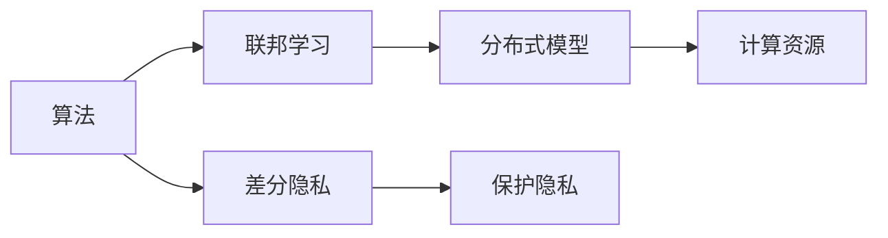
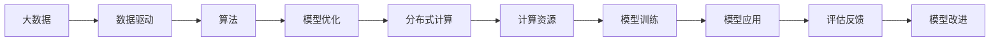

                 

# 算法在人工智能底层创新中的地位

## 1. 背景介绍

### 1.1 问题由来
在人工智能(AI)领域，算法不仅是实现特定功能的关键组件，更是推动底层创新的核心动力。从早期的决策树、神经网络、到现在的深度学习、强化学习、联邦学习等算法，每一步技术进步都离不开算法的支持。特别是深度学习算法的突破性进展，更是引领了AI产业的飞速发展，推动了自动驾驶、语音识别、图像处理、自然语言处理(NLP)等诸多领域的创新和应用。

然而，算法的作用并不仅限于具体的技术实现。更广义上，算法还影响着AI的发展方向、应用场景、技术演进等深层次问题。例如，深度学习算法的大规模应用，催生了大模型、微调等新范式；联邦学习算法的发展，促进了分布式计算和隐私保护技术的进步；强化学习算法在游戏AI、机器人控制等领域的应用，带来了对智能体行为和策略的深度理解。

本文聚焦于算法在AI底层创新的地位，分析其对技术发展、产业应用、社会影响等各个方面的深远影响，并展望未来算法的演进方向，力求为读者提供全面的技术洞察。

### 1.2 问题核心关键点
算法在AI底层创新的核心作用主要体现在以下几个方面：

1. **技术进步的驱动力**：算法是AI技术发展的基础，每一种新算法技术的诞生，都推动了AI系统的性能提升和功能扩展。
2. **应用场景的扩展**：算法的改进使得AI技术能够适应更多复杂和多样化的应用场景，加速AI技术的产业化进程。
3. **产业生态的构建**：算法框架和工具库的开发，推动了AI社区的形成和生态系统的繁荣，促进了技术的共享和传播。
4. **社会影响的塑造**：算法的应用不仅改变了生产方式、决策方式，还对社会伦理、隐私保护等方面提出了新的挑战和要求。

这些关键点构成了算法在AI底层创新的核心地位，是理解当前AI技术演进和未来发展的基石。

## 2. 核心概念与联系

### 2.1 核心概念概述

为更好地理解算法在AI底层创新的作用，本节将介绍几个密切相关的核心概念：

- **算法**：用于解决特定问题的计算过程或规则集合，包括但不限于决策树、神经网络、深度学习、强化学习、联邦学习等。
- **数据驱动**：通过大规模数据训练算法，使其自动发现数据中的规律和模式，从而提高模型的性能和泛化能力。
- **模型优化**：通过迭代优化算法参数，提升模型在特定任务上的表现，包括正则化、超参数调优、梯度优化等技术。
- **分布式计算**：通过并行计算技术，将大规模模型在多台计算机上分布式训练，加速模型训练过程，提升训练效率。
- **隐私保护**：在算法训练和应用过程中，保护用户隐私和数据安全，如差分隐私、联邦学习等技术。

这些核心概念之间的逻辑关系可以通过以下Mermaid流程图来展示：



这个流程图展示了大数据、模型优化、分布式计算、隐私保护等概念与算法之间的紧密联系。

### 2.2 概念间的关系

这些核心概念之间存在着紧密的联系，形成了AI算法创新的完整生态系统。下面我们通过几个Mermaid流程图来展示这些概念之间的关系。

#### 2.2.1 数据驱动与算法的关系



这个流程图展示了数据驱动算法的基本流程。数据经过特征工程后，作为输入输入算法模型，模型在评估过程中得到反馈，反馈又用于改进特征工程和数据预处理，形成闭环。

#### 2.2.2 模型优化与算法的关系



这个流程图展示了模型优化与算法的关系。正则化、超参数调优、梯度优化等技术，都是算法优化的一部分，旨在提升模型性能和泛化能力。

#### 2.2.3 分布式计算与算法的关系



这个流程图展示了分布式计算与算法的关系。算法通过并行计算，在多台计算机上分布式训练，利用计算资源提升模型训练效率。

#### 2.2.4 隐私保护与算法的关系



这个流程图展示了隐私保护与算法的关系。算法通过差分隐私和联邦学习等技术，在保护隐私的同时，实现模型的分布式训练。

### 2.3 核心概念的整体架构

最后，我们用一个综合的流程图来展示这些核心概念在大数据和AI算法创新过程中的整体架构：



这个综合流程图展示了大数据、数据驱动、算法、模型优化、分布式计算等概念在大数据和AI算法创新过程中的整体架构。

## 3. 核心算法原理 & 具体操作步骤
### 3.1 算法原理概述

在AI算法创新中，数据驱动、模型优化、分布式计算和隐私保护等技术手段，都是围绕算法的基本原理展开的。以下是几个核心算法的原理概述：

- **决策树算法**：通过对数据集进行递归分割，构建一棵决策树，用于分类或回归问题。其核心思想是将数据集划分为更小的子集，使得子集内的样本特征相似，从而简化模型。

- **神经网络算法**：通过多层非线性变换，将输入数据映射为输出结果。其核心思想是通过反向传播算法，优化模型参数，使得模型输出逼近真实标签。

- **深度学习算法**：在神经网络的基础上，增加层数和宽度，引入非线性激活函数，解决更加复杂的非线性问题。其核心思想是通过梯度下降等优化算法，最小化损失函数，优化模型参数。

- **强化学习算法**：通过智能体与环境交互，最大化累计奖励，学习最优策略。其核心思想是通过策略梯度、Q-learning等方法，优化策略参数，提升智能体的行为表现。

- **联邦学习算法**：通过分布式计算，多台计算机同时训练模型，保护用户隐私。其核心思想是通过聚合各个客户端的模型参数，更新全局模型，实现数据不流出客户端的隐私保护。

### 3.2 算法步骤详解

以下是几种核心算法的详细步骤详解：

#### 3.2.1 决策树算法

1. 收集数据：收集数据集，包含特征和标签。
2. 特征选择：选择重要的特征进行建模。
3. 递归分割：对数据集进行递归分割，构建决策树。
4. 剪枝优化：对决策树进行剪枝，防止过拟合。
5. 模型评估：使用测试集评估模型性能，根据评估结果调整模型参数。
6. 应用部署：将训练好的模型部署到实际应用中，进行分类或回归预测。

#### 3.2.2 神经网络算法

1. 数据准备：准备数据集，包含训练集、验证集和测试集。
2. 网络设计：设计神经网络结构，包括层数、神经元个数等。
3. 参数初始化：随机初始化模型参数。
4. 前向传播：将输入数据通过网络计算输出结果。
5. 损失计算：计算模型输出与真实标签的损失。
6. 反向传播：根据损失函数，反向传播计算梯度。
7. 参数更新：使用梯度下降等优化算法，更新模型参数。
8. 模型评估：使用测试集评估模型性能，根据评估结果调整模型参数。
9. 应用部署：将训练好的模型部署到实际应用中，进行分类或回归预测。

#### 3.2.3 深度学习算法

1. 数据准备：准备数据集，包含训练集、验证集和测试集。
2. 网络设计：设计深度神经网络结构，包括层数、神经元个数、激活函数等。
3. 参数初始化：随机初始化模型参数。
4. 前向传播：将输入数据通过网络计算输出结果。
5. 损失计算：计算模型输出与真实标签的损失。
6. 反向传播：根据损失函数，反向传播计算梯度。
7. 参数更新：使用梯度下降等优化算法，更新模型参数。
8. 模型评估：使用测试集评估模型性能，根据评估结果调整模型参数。
9. 应用部署：将训练好的模型部署到实际应用中，进行分类或回归预测。

#### 3.2.4 强化学习算法

1. 环境设计：设计智能体的环境和目标。
2. 状态表示：将环境状态编码为智能体的输入。
3. 动作空间：定义智能体的可能动作。
4. 奖励函数：定义智能体的奖励机制。
5. 策略选择：选择智能体的策略，如贪心策略、Q-learning等。
6. 模型训练：通过智能体与环境的交互，更新策略参数。
7. 模型评估：评估智能体的性能，根据评估结果调整策略参数。
8. 应用部署：将训练好的智能体部署到实际应用中，进行决策或控制。

#### 3.2.5 联邦学习算法

1. 模型初始化：在各个客户端初始化模型参数。
2. 数据收集：在各个客户端收集本地数据。
3. 本地训练：在各个客户端使用本地数据训练模型。
4. 参数聚合：在服务器端聚合各个客户端的模型参数。
5. 全局更新：使用聚合后的模型参数，更新全局模型。
6. 模型评估：使用测试集评估模型性能，根据评估结果调整模型参数。
7. 应用部署：将训练好的模型部署到实际应用中，进行分类或回归预测。

### 3.3 算法优缺点

算法在AI底层创新中的地位，得益于其在技术性能、应用场景、产业生态等方面的综合优势。然而，算法也存在一些缺点和挑战，如下：

- **计算复杂度高**：许多算法，如深度学习、强化学习，需要大量的计算资源和计算时间，在大规模数据集上训练的难度较大。
- **数据依赖性强**：算法性能依赖于数据的质量和数量，数据不平衡、标注不准确等问题，会影响算法的训练效果。
- **模型复杂度高**：深度神经网络、强化学习模型等，结构复杂，难以理解和调试。
- **模型泛化性差**：算法在特定数据集上表现良好，但在新数据集上泛化性能可能较差。
- **隐私和安全问题**：许多算法，如深度学习、联邦学习，需要在多台计算机上进行分布式训练，涉及数据的隐私和安全问题。

尽管存在这些缺点，但算法的创新和优化，依然是推动AI技术发展的核心动力。研究者们不断探索新的算法和模型结构，提升算法的计算效率、泛化能力和应用灵活性，为AI技术的落地应用和产业化提供了坚实的技术基础。

### 3.4 算法应用领域

算法在AI底层创新的应用领域非常广泛，几乎涵盖了所有AI技术的研发和应用。以下是几个典型的应用领域：

- **自然语言处理(NLP)**：通过算法处理和理解自然语言，实现机器翻译、文本分类、语音识别、对话系统等功能。
- **计算机视觉(CV)**：通过算法处理和理解图像，实现图像分类、目标检测、人脸识别、图像生成等功能。
- **机器人学**：通过算法控制机器人的行为和决策，实现自动化、自主化任务。
- **智能推荐系统**：通过算法分析用户行为数据，推荐个性化的内容和服务。
- **自动驾驶**：通过算法处理传感器数据，实现自动驾驶、路径规划等功能。

算法在上述领域的广泛应用，不仅推动了AI技术的不断进步，也带来了新的商业模式和应用场景，深刻影响了人们的生活和工作方式。

## 4. 数学模型和公式 & 详细讲解 & 举例说明

### 4.1 数学模型构建

在AI算法中，数学模型是算法的基础，以下几种核心算法的数学模型构建如下：

- **决策树算法**：通过递归分割特征空间，构建决策树模型。其数学模型为：
  $$
  T = \{T_1, T_2, \dots, T_n\}
  $$
  其中 $T_i$ 为决策树的节点，包含特征和子节点。

- **神经网络算法**：通过多层非线性变换，将输入数据映射为输出结果。其数学模型为：
  $$
  f(x) = W_1\sigma(z_1) + b_1
  $$
  其中 $W_1, b_1$ 为第一层的参数，$\sigma$ 为激活函数，$z_1$ 为输入数据。

- **深度学习算法**：通过多层非线性变换，将输入数据映射为输出结果。其数学模型为：
  $$
  f(x) = \sum_{i=1}^n W_i\sigma(z_i) + b_i
  $$
  其中 $W_i, b_i$ 为第 $i$ 层的参数，$\sigma$ 为激活函数，$z_i$ 为输入数据。

- **强化学习算法**：通过智能体与环境的交互，最大化累计奖励，学习最优策略。其数学模型为：
  $$
  Q(s, a) = r + \gamma Q(s', a')
  $$
  其中 $s$ 为状态，$a$ 为动作，$r$ 为即时奖励，$s'$ 为下一个状态，$a'$ 为下一个动作，$\gamma$ 为折扣因子。

- **联邦学习算法**：通过分布式计算，多台计算机同时训练模型，保护用户隐私。其数学模型为：
  $$
  \theta_{client} = \theta_{global} - \eta \nabla_{\theta}L(\theta_{client}, D_{client})
  $$
  其中 $\theta_{client}$ 为客户端的模型参数，$\theta_{global}$ 为全局模型参数，$\eta$ 为学习率，$L$ 为损失函数，$D_{client}$ 为客户端的数据集。

### 4.2 公式推导过程

以下是几个核心算法的公式推导过程：

#### 4.2.1 决策树算法

假设数据集为 $D = \{(x_1, y_1), (x_2, y_2), \dots, (x_n, y_n)\}$，其中 $x_i$ 为特征，$y_i$ 为标签。构建决策树的递归过程如下：

1. 选择最优特征 $f$ 进行分割。
2. 将数据集划分为两部分 $D_1$ 和 $D_2$。
3. 对 $D_1$ 和 $D_2$ 分别递归构建子树 $T_1$ 和 $T_2$。
4. 合并 $T_1$ 和 $T_2$，形成新的决策树 $T$。

#### 4.2.2 神经网络算法

假设输入数据为 $x = (x_1, x_2, \dots, x_m)$，模型输出为 $y = (y_1, y_2, \dots, y_n)$。神经网络的训练过程如下：

1. 初始化模型参数 $W_1, b_1, W_2, b_2, \dots, W_L, b_L$。
2. 前向传播计算 $z_i = W_ix_i + b_i$。
3. 激活函数计算 $\sigma(z_i)$。
4. 计算输出 $y_i = \sigma(z_i)$。
5. 计算损失函数 $L(y_i, \hat{y}_i)$。
6. 反向传播计算梯度 $\nabla_{\theta}L$。
7. 更新模型参数 $\theta = \theta - \eta \nabla_{\theta}L$。

#### 4.2.3 深度学习算法

假设输入数据为 $x = (x_1, x_2, \dots, x_m)$，模型输出为 $y = (y_1, y_2, \dots, y_n)$。深度学习的训练过程如下：

1. 初始化模型参数 $W_1, b_1, W_2, b_2, \dots, W_L, b_L$。
2. 前向传播计算 $z_i = W_ix_i + b_i$。
3. 激活函数计算 $\sigma(z_i)$。
4. 计算输出 $y_i = \sigma(z_i)$。
5. 计算损失函数 $L(y_i, \hat{y}_i)$。
6. 反向传播计算梯度 $\nabla_{\theta}L$。
7. 更新模型参数 $\theta = \theta - \eta \nabla_{\theta}L$。

#### 4.2.4 强化学习算法

假设智能体与环境的交互过程如下：$s_1, a_1, r_1, s_2, a_2, r_2, \dots, s_n, a_n, r_n$。强化学习的训练过程如下：

1. 初始化策略参数 $\theta$。
2. 选择动作 $a_t$。
3. 与环境交互，观察下一个状态 $s_{t+1}$ 和即时奖励 $r_t$。
4. 计算策略 $Q(s_t, a_t)$。
5. 更新策略参数 $\theta$。
6. 重复步骤2-5，直至达到终止状态。

#### 4.2.5 联邦学习算法

假设数据集 $D_{client} = \{(x_{client1}, y_{client1}), (x_{client2}, y_{client2}), \dots, (x_{client_m}, y_{client_m})\}$，模型参数为 $\theta$。联邦学习的训练过程如下：

1. 初始化模型参数 $\theta$。
2. 在各个客户端训练模型，更新参数 $\theta_{client}$。
3. 在服务器端聚合各个客户端的参数 $\theta_{global} = \frac{1}{M} \sum_{i=1}^M \theta_{client_i}$。
4. 更新全局模型参数 $\theta = \theta - \eta \nabla_{\theta}L(\theta, D_{global})$。
5. 重复步骤2-4，直至达到收敛。

### 4.3 案例分析与讲解

以下是对几种核心算法的案例分析：

#### 4.3.1 决策树算法

假设数据集为某银行的信用评分数据集，包含客户的性别、年龄、月收入等特征，以及是否违约的标签。通过决策树算法，可以构建一个信用评分预测模型。具体步骤如下：

1. 收集数据集，包含客户的性别、年龄、月收入等特征，以及是否违约的标签。
2. 选择重要的特征进行建模。
3. 对数据集进行递归分割，构建决策树。
4. 对决策树进行剪枝优化，防止过拟合。
5. 使用测试集评估模型性能，根据评估结果调整模型参数。
6. 将训练好的模型部署到实际应用中，进行信用评分预测。

#### 4.3.2 神经网络算法

假设数据集为手写数字识别数据集，包含28x28的灰度图像，以及对应的数字标签。通过神经网络算法，可以构建一个手写数字识别模型。具体步骤如下：

1. 准备数据集，包含训练集、验证集和测试集。
2. 设计神经网络结构，包括层数、神经元个数等。
3. 随机初始化模型参数。
4. 前向传播计算输出结果。
5. 计算模型输出与真实标签的损失。
6. 反向传播计算梯度。
7. 使用梯度下降等优化算法，更新模型参数。
8. 使用测试集评估模型性能，根据评估结果调整模型参数。
9. 将训练好的模型部署到实际应用中，进行手写数字识别。

#### 4.3.3 深度学习算法

假设数据集为CIFAR-10图像数据集，包含60,000张32x32的彩色图像，以及10个类别的标签。通过深度学习算法，可以构建一个图像分类模型。具体步骤如下：

1. 准备数据集，包含训练集、验证集和测试集。
2. 设计深度神经网络结构，包括层数、神经元个数、激活函数等。
3. 随机初始化模型参数。
4. 前向传播计算输出结果。
5. 计算模型输出与真实标签的损失。
6. 反向传播计算梯度。
7. 使用梯度下降等优化算法，更新模型参数。
8. 使用测试集评估模型性能，根据评估结果调整模型参数。
9. 将训练好的模型部署到实际应用中，进行图像分类。

#### 4.3.4 强化学习算法

假设数据集为自动驾驶汽车的控制数据集，包含车辆的位置、速度、方向等状态信息，以及实时输入的控制指令。通过强化学习算法，可以构建一个自动驾驶汽车的控制策略模型。具体步骤如下：

1. 设计智能体的环境和目标。
2. 将车辆的位置、速度、方向等状态编码为智能体的输入。
3. 定义智能体的动作空间，如加速、减速、转向等。
4. 定义智能体的奖励机制，如避免碰撞、加速到达目标等。
5. 选择智能体的策略，如Q-learning等。
6. 通过智能体与环境的交互，更新策略参数。
7. 评估智能体的性能，根据评估结果调整策略参数。
8. 将训练好的智能体部署到实际应用中，进行自动驾驶控制。

#### 4.3.5 联邦学习算法

假设数据集为多个银行客户的数据集，包含客户的收入、年龄、消费记录等特征，以及是否违约的标签。通过联邦学习算法，可以构建一个信用评分预测模型。具体步骤如下：

1. 在各个银行客户端初始化模型参数。
2. 在各个银行客户端收集本地数据。
3. 在各个银行客户端使用本地数据训练模型。
4. 在服务器端聚合各个银行客户端的模型参数。
5. 使用聚合后的模型参数，更新全局模型。
6. 使用测试集评估模型性能，根据评估结果调整模型参数。
7. 将训练好的模型部署到实际应用中，进行信用评分预测。

## 5. 项目实践：代码实例和详细解释说明
### 5.1 开发环境搭建

在进行AI算法创新实践前，我们需要准备好开发环境。以下是使用Python进行TensorFlow开发的环境配置流程：

1. 安装Anaconda：从官网下载并安装Anaconda，用于创建独立的Python环境。

2. 创建并激活虚拟环境：
```bash
conda create -n tf-env python=3.8 
conda activate tf-env
```

3. 安装TensorFlow：根据CUDA版本，从官网获取对应的安装命令。例如：
```bash
conda install tensorflow -c tf -c conda-forge
```

4. 安装各类工具包：
```bash
pip install numpy pandas scikit-learn matplotlib tqdm jupyter notebook ipython
```

完成上述步骤后，即可在`tf-env`环境中开始算法创新的实践。

### 5.2 源代码详细实现

下面我们以强化学习中的Q-learning算法为例，给出TensorFlow实现的具体代码。

首先，定义Q值函数：

```python
import tensorflow as tf

def q_value(x, w):
    return tf.matmul(x, w)
```

然后，定义Q-learning算法：

```python
def q_learning(env, q_value_fn, num_episodes=500, batch_size=32, learning_rate=0.1):
    num_states = env.observation_space.n
    num_actions = env.action_space.n
    w = tf.Variable(tf.zeros([num_states, num_actions]))

    for episode in range(num_episodes):
        state = env.reset()
        done = False
        total_reward = 0

        while not done:
            action_probs = q_value_fn(state, w)
            action = tf.random.categorical(tf.nn.softmax(action_probs), 1)[0, 0].numpy()

            next_state, reward, done, _ = env.step(action)

            target = reward + 0.9 * tf.reduce_max(q_value_fn(next_state, w))
            target_y = tf.keras.layers.Dense(1)(

