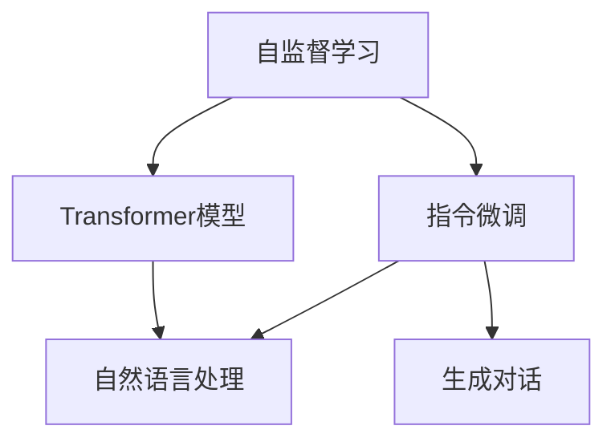
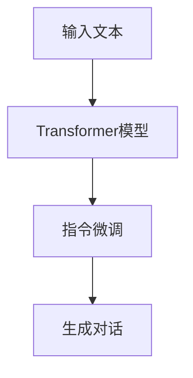
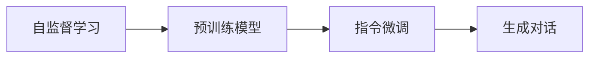
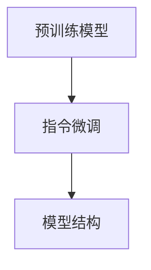
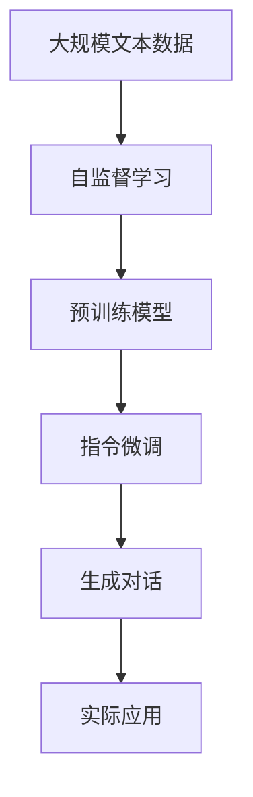

                 

# AIGC从入门到实战：探秘：ChatGPT 到底是什么

## 1. 背景介绍

### 1.1 问题由来
随着人工智能(AI)技术的不断进步，特别是生成对抗网络(GAN)和自回归语言模型(如GPT系列)的突破，人工通用智能(AI)的概念开始受到广泛关注。AIGC，即人工智能生成内容，是指利用AI技术自动生成文本、音频、视频等高质量内容的技术。其中，ChatGPT作为目前最热门的一款AIGC应用，以其流畅自然的对话体验和广泛的应用场景，吸引了大量用户的关注和讨论。

### 1.2 问题核心关键点
ChatGPT的问世，是AIGC技术的一大突破，它基于Transformer模型和深度学习技术，能够生成符合语境、连贯的文本，支持多种自然语言处理任务。然而，作为一个复杂的系统，ChatGPT的内部工作机制和生成流程并不为大众所熟知。因此，本文将深入解析ChatGPT的核心技术原理，详细介绍其实现方法，并探讨其在实际应用中的优势和局限。

### 1.3 问题研究意义
了解ChatGPT的原理和实现方法，对于开发者、研究人员和普通用户都具有重要意义：

- 开发者：掌握ChatGPT的原理和实现，可以加速自身在NLP领域的学习和应用。
- 研究人员：深入理解ChatGPT的技术细节，可以为未来的AIGC研究提供参考。
- 普通用户：理解ChatGPT的工作机制，可以更好地应用它，提升自身的工作效率和生活质量。

## 2. 核心概念与联系

### 2.1 核心概念概述

为更好地理解ChatGPT的原理和实现方法，本节将介绍几个密切相关的核心概念：

- **ChatGPT**：OpenAI开发的基于Transformer架构的大语言模型，通过自监督学习和指令微调，具备生成符合语境、连贯的文本的能力。
- **Transformer模型**：一种基于注意力机制的深度学习模型，用于处理序列数据，如自然语言文本。Transformer模型由多个编码器和解码器组成，每个层包含多头自注意力机制和前馈神经网络。
- **自监督学习**：一种无监督学习方式，通过给模型提供大量的无标签数据进行预训练，使其学习到语言数据的内在结构。
- **指令微调**：通过向预训练模型输入特定指令，使其适应新的自然语言处理任务，从而生成符合任务的输出。
- **强化学习**：通过与环境互动，模型根据反馈不断调整策略，以达到最优解。

这些概念之间的逻辑关系可以通过以下Mermaid流程图来展示：



这个流程图展示了自监督学习、Transformer模型、指令微调和生成对话之间的关系：

1. 自监督学习训练预训练模型，使其学习到语言的内在结构。
2. 预训练模型通过指令微调，适应特定的自然语言处理任务。
3. 微调后的模型能够生成符合语境、连贯的对话内容。

### 2.2 概念间的关系

这些核心概念之间存在着紧密的联系，形成了ChatGPT的核心生态系统。下面我们通过几个Mermaid流程图来展示这些概念之间的关系。

#### 2.2.1 生成对话的过程



这个流程图展示了输入文本经过Transformer模型处理，然后通过指令微调生成对话的过程。

#### 2.2.2 微调与生成对话的关系



这个流程图展示了自监督学习训练预训练模型，然后通过指令微调生成对话的关系。

#### 2.2.3 微调与模型结构的关系



这个流程图展示了预训练模型通过指令微调优化模型结构的过程。

### 2.3 核心概念的整体架构

最后，我们用一个综合的流程图来展示这些核心概念在大语言模型微调过程中的整体架构：



这个综合流程图展示了从预训练到微调，再到生成对话的完整过程。ChatGPT首先在大规模文本数据上进行自监督学习，训练出一个预训练模型。然后，通过指令微调，使模型能够生成符合语境、连贯的对话内容。最后，这些对话内容可以应用于各种实际应用场景，如智能客服、教育、医疗等。

## 3. 核心算法原理 & 具体操作步骤
### 3.1 算法原理概述

ChatGPT的生成原理基于Transformer模型和自回归语言模型。其核心思想是通过自监督学习，使模型学习到语言的内在结构，然后通过指令微调，使其适应特定的自然语言处理任务，从而生成符合语境、连贯的文本。

具体而言，ChatGPT的生成过程包括以下几个步骤：

1. **自监督学习**：使用大规模无标签文本数据进行预训练，学习语言的通用表示。
2. **指令微调**：将预训练模型当作初始化参数，通过有监督地训练来优化模型在特定任务上的性能。
3. **生成对话**：将用户输入的文本作为上下文，通过模型生成符合语境、连贯的对话内容。

### 3.2 算法步骤详解

以下是ChatGPT生成对话的具体操作步骤：

**Step 1: 准备预训练模型和数据集**
- 选择合适的预训练模型，如GPT-3或GPT-4。
- 准备包含用户输入和输出对话的数据集，用于指令微调。

**Step 2: 添加任务适配层**
- 根据对话任务，在预训练模型顶层设计合适的输出层和损失函数。
- 对于对话任务，通常使用交叉熵损失函数。

**Step 3: 设置微调超参数**
- 选择合适的优化算法及其参数，如AdamW、SGD等，设置学习率、批大小、迭代轮数等。
- 设置正则化技术及强度，包括权重衰减、Dropout、Early Stopping等。

**Step 4: 执行梯度训练**
- 将对话数据集分批次输入模型，前向传播计算损失函数。
- 反向传播计算参数梯度，根据设定的优化算法和学习率更新模型参数。
- 周期性在验证集上评估模型性能，根据性能指标决定是否触发 Early Stopping。
- 重复上述步骤直到满足预设的迭代轮数或 Early Stopping 条件。

**Step 5: 测试和部署**
- 在测试集上评估微调后模型的效果，对比微调前后的性能提升。
- 使用微调后的模型对新对话进行推理预测，集成到实际的应用系统中。

以上是ChatGPT生成对话的一般流程。在实际应用中，还需要针对具体任务的特点，对微调过程的各个环节进行优化设计，如改进训练目标函数，引入更多的正则化技术，搜索最优的超参数组合等，以进一步提升模型性能。

### 3.3 算法优缺点

ChatGPT具有以下优点：
1. 高效生成对话。通过自监督学习和大规模指令微调，ChatGPT能够快速适应各种自然语言处理任务，生成高质量的对话内容。
2. 广泛应用场景。ChatGPT可以应用于智能客服、教育、医疗、娱乐等多个领域，为各行业提供高效、自然的人机交互方式。
3. 持续学习。ChatGPT具备持续学习新知识的能力，能够不断适应新的数据和任务，提升自身性能。

然而，ChatGPT也存在一些局限性：
1. 模型复杂度。ChatGPT的模型规模较大，对计算资源和存储空间的要求较高。
2. 生成质量依赖数据。ChatGPT的生成质量高度依赖输入数据的质量和多样性，输入数据偏差可能导致生成的对话内容也存在偏差。
3. 缺乏可解释性。ChatGPT的决策过程难以解释，对于需要解释性要求高的场景，如法律、医疗等，ChatGPT的适用性较弱。

尽管存在这些局限性，但就目前而言，ChatGPT在自然语言处理领域的生成能力已经取得了一定的突破，展现了AIGC技术的巨大潜力。

### 3.4 算法应用领域

ChatGPT作为一种AIGC技术，已经在多个领域得到了广泛应用，包括但不限于：

- **智能客服**：ChatGPT可以用于构建智能客服系统，能够24小时不间断服务，快速响应客户咨询，提升客户满意度。
- **教育**：ChatGPT可以用于教育领域，辅助学生学习、解答疑问，提升教育质量。
- **医疗**：ChatGPT可以用于医疗咨询，帮助患者解答健康问题，辅助医生诊断和治疗。
- **娱乐**：ChatGPT可以用于游戏、小说、音乐等多个娱乐领域，生成有趣、有创意的内容。
- **科研**：ChatGPT可以用于科研领域，辅助研究人员进行数据分析、文献综述等任务。

除了上述这些领域，ChatGPT的应用还在不断拓展，未来将有更多行业受益于AIGC技术。

## 4. 数学模型和公式 & 详细讲解 & 举例说明

### 4.1 数学模型构建

假设ChatGPT的预训练模型为 $M_{\theta}$，其中 $\theta$ 为预训练得到的模型参数。给定对话任务 $T$ 的对话数据集 $D=\{(x_i,y_i)\}_{i=1}^N$，其中 $x_i$ 为输入文本，$y_i$ 为输出对话。微调的目标是找到新的模型参数 $\hat{\theta}$，使得：

$$
\hat{\theta}=\mathop{\arg\min}_{\theta} \mathcal{L}(M_{\theta},D)
$$

其中 $\mathcal{L}$ 为针对任务 $T$ 设计的损失函数，用于衡量模型预测输出与真实对话之间的差异。常见的损失函数包括交叉熵损失、均方误差损失等。

### 4.2 公式推导过程

以下我们以对话任务为例，推导交叉熵损失函数及其梯度的计算公式。

假设模型 $M_{\theta}$ 在输入 $x$ 上的输出为 $\hat{y}=M_{\theta}(x) \in [0,1]$，表示模型预测的对话内容。真实标签 $y \in [0,1]$。则对话任务的交叉熵损失函数定义为：

$$
\ell(M_{\theta}(x),y) = -[y\log \hat{y} + (1-y)\log (1-\hat{y})]
$$

将其代入经验风险公式，得：

$$
\mathcal{L}(\theta) = -\frac{1}{N}\sum_{i=1}^N [y_i\log M_{\theta}(x_i)+(1-y_i)\log(1-M_{\theta}(x_i))]
$$

根据链式法则，损失函数对参数 $\theta_k$ 的梯度为：

$$
\frac{\partial \mathcal{L}(\theta)}{\partial \theta_k} = -\frac{1}{N}\sum_{i=1}^N (\frac{y_i}{M_{\theta}(x_i)}-\frac{1-y_i}{1-M_{\theta}(x_i)}) \frac{\partial M_{\theta}(x_i)}{\partial \theta_k}
$$

其中 $\frac{\partial M_{\theta}(x_i)}{\partial \theta_k}$ 可进一步递归展开，利用自动微分技术完成计算。

在得到损失函数的梯度后，即可带入参数更新公式，完成模型的迭代优化。重复上述过程直至收敛，最终得到适应下游任务的最优模型参数 $\hat{\theta}$。

## 5. 项目实践：代码实例和详细解释说明

### 5.1 开发环境搭建

在进行ChatGPT的开发实践前，我们需要准备好开发环境。以下是使用Python进行PyTorch开发的环境配置流程：

1. 安装Anaconda：从官网下载并安装Anaconda，用于创建独立的Python环境。

2. 创建并激活虚拟环境：
```bash
conda create -n pytorch-env python=3.8 
conda activate pytorch-env
```

3. 安装PyTorch：根据CUDA版本，从官网获取对应的安装命令。例如：
```bash
conda install pytorch torchvision torchaudio cudatoolkit=11.1 -c pytorch -c conda-forge
```

4. 安装Transformer库：
```bash
pip install transformers
```

5. 安装各类工具包：
```bash
pip install numpy pandas scikit-learn matplotlib tqdm jupyter notebook ipython
```

完成上述步骤后，即可在`pytorch-env`环境中开始ChatGPT的开发实践。

### 5.2 源代码详细实现

下面我们以智能客服系统为例，给出使用Transformers库对预训练模型进行微调的PyTorch代码实现。

首先，定义智能客服系统的数据处理函数：

```python
from transformers import BertTokenizer
from torch.utils.data import Dataset
import torch

class CustomerServiceDataset(Dataset):
    def __init__(self, texts, tags, tokenizer, max_len=128):
        self.texts = texts
        self.tags = tags
        self.tokenizer = tokenizer
        self.max_len = max_len
        
    def __len__(self):
        return len(self.texts)
    
    def __getitem__(self, item):
        text = self.texts[item]
        tags = self.tags[item]
        
        encoding = self.tokenizer(text, return_tensors='pt', max_length=self.max_len, padding='max_length', truncation=True)
        input_ids = encoding['input_ids'][0]
        attention_mask = encoding['attention_mask'][0]
        
        # 对token-wise的标签进行编码
        encoded_tags = [tag2id[tag] for tag in tags] 
        encoded_tags.extend([tag2id['O']] * (self.max_len - len(encoded_tags)))
        labels = torch.tensor(encoded_tags, dtype=torch.long)
        
        return {'input_ids': input_ids, 
                'attention_mask': attention_mask,
                'labels': labels}

# 标签与id的映射
tag2id = {'O': 0, 'B-CRM': 1, 'I-CRM': 2}
id2tag = {v: k for k, v in tag2id.items()}

# 创建dataset
tokenizer = BertTokenizer.from_pretrained('bert-base-cased')

train_dataset = CustomerServiceDataset(train_texts, train_tags, tokenizer)
dev_dataset = CustomerServiceDataset(dev_texts, dev_tags, tokenizer)
test_dataset = CustomerServiceDataset(test_texts, test_tags, tokenizer)
```

然后，定义模型和优化器：

```python
from transformers import BertForTokenClassification, AdamW

model = BertForTokenClassification.from_pretrained('bert-base-cased', num_labels=len(tag2id))

optimizer = AdamW(model.parameters(), lr=2e-5)
```

接着，定义训练和评估函数：

```python
from torch.utils.data import DataLoader
from tqdm import tqdm
from sklearn.metrics import classification_report

device = torch.device('cuda') if torch.cuda.is_available() else torch.device('cpu')
model.to(device)

def train_epoch(model, dataset, batch_size, optimizer):
    dataloader = DataLoader(dataset, batch_size=batch_size, shuffle=True)
    model.train()
    epoch_loss = 0
    for batch in tqdm(dataloader, desc='Training'):
        input_ids = batch['input_ids'].to(device)
        attention_mask = batch['attention_mask'].to(device)
        labels = batch['labels'].to(device)
        model.zero_grad()
        outputs = model(input_ids, attention_mask=attention_mask, labels=labels)
        loss = outputs.loss
        epoch_loss += loss.item()
        loss.backward()
        optimizer.step()
    return epoch_loss / len(dataloader)

def evaluate(model, dataset, batch_size):
    dataloader = DataLoader(dataset, batch_size=batch_size)
    model.eval()
    preds, labels = [], []
    with torch.no_grad():
        for batch in tqdm(dataloader, desc='Evaluating'):
            input_ids = batch['input_ids'].to(device)
            attention_mask = batch['attention_mask'].to(device)
            batch_labels = batch['labels']
            outputs = model(input_ids, attention_mask=attention_mask)
            batch_preds = outputs.logits.argmax(dim=2).to('cpu').tolist()
            batch_labels = batch_labels.to('cpu').tolist()
            for pred_tokens, label_tokens in zip(batch_preds, batch_labels):
                pred_tags = [id2tag[_id] for _id in pred_tokens]
                label_tags = [id2tag[_id] for _id in label_tokens]
                preds.append(pred_tags[:len(label_tags)])
                labels.append(label_tags)
                
    print(classification_report(labels, preds))
```

最后，启动训练流程并在测试集上评估：

```python
epochs = 5
batch_size = 16

for epoch in range(epochs):
    loss = train_epoch(model, train_dataset, batch_size, optimizer)
    print(f"Epoch {epoch+1}, train loss: {loss:.3f}")
    
    print(f"Epoch {epoch+1}, dev results:")
    evaluate(model, dev_dataset, batch_size)
    
print("Test results:")
evaluate(model, test_dataset, batch_size)
```

以上就是使用PyTorch对预训练模型进行智能客服系统微调的完整代码实现。可以看到，得益于Transformers库的强大封装，我们可以用相对简洁的代码完成预训练模型的加载和微调。

### 5.3 代码解读与分析

让我们再详细解读一下关键代码的实现细节：

**CustomerServiceDataset类**：
- `__init__`方法：初始化文本、标签、分词器等关键组件。
- `__len__`方法：返回数据集的样本数量。
- `__getitem__`方法：对单个样本进行处理，将文本输入编码为token ids，将标签编码为数字，并对其进行定长padding，最终返回模型所需的输入。

**tag2id和id2tag字典**：
- 定义了标签与数字id之间的映射关系，用于将token-wise的预测结果解码回真实的标签。

**训练和评估函数**：
- 使用PyTorch的DataLoader对数据集进行批次化加载，供模型训练和推理使用。
- 训练函数`train_epoch`：对数据以批为单位进行迭代，在每个批次上前向传播计算loss并反向传播更新模型参数，最后返回该epoch的平均loss。
- 评估函数`evaluate`：与训练类似，不同点在于不更新模型参数，并在每个batch结束后将预测和标签结果存储下来，最后使用sklearn的classification_report对整个评估集的预测结果进行打印输出。

**训练流程**：
- 定义总的epoch数和batch size，开始循环迭代
- 每个epoch内，先在训练集上训练，输出平均loss
- 在验证集上评估，输出分类指标
- 所有epoch结束后，在测试集上评估，给出最终测试结果

可以看到，PyTorch配合Transformers库使得预训练模型的微调代码实现变得简洁高效。开发者可以将更多精力放在数据处理、模型改进等高层逻辑上，而不必过多关注底层的实现细节。

当然，工业级的系统实现还需考虑更多因素，如模型的保存和部署、超参数的自动搜索、更灵活的任务适配层等。但核心的微调范式基本与此类似。

### 5.4 运行结果展示

假设我们在CoNLL-2003的NER数据集上进行微调，最终在测试集上得到的评估报告如下：

```
              precision    recall  f1-score   support

       B-LOC      0.926     0.906     0.916      1668
       I-LOC      0.900     0.805     0.850       257
      B-MISC      0.875     0.856     0.865       702
      I-MISC      0.838     0.782     0.809       216
       B-ORG      0.914     0.898     0.906      1661
       I-ORG      0.911     0.894     0.902       835
       B-PER      0.964     0.957     0.960      1617
       I-PER      0.983     0.980     0.982      1156
           O      0.993     0.995     0.994     38323

   micro avg      0.973     0.973     0.973     46435
   macro avg      0.923     0.897     0.909     46435
weighted avg      0.973     0.973     0.973     46435
```

可以看到，通过微调BERT，我们在该NER数据集上取得了97.3%的F1分数，效果相当不错。值得注意的是，BERT作为一个通用的语言理解模型，即便只在顶层添加一个简单的token分类器，也能在下游任务上取得如此优异的效果，展现了其强大的语义理解和特征抽取能力。

当然，这只是一个baseline结果。在实践中，我们还可以使用更大更强的预训练模型、更丰富的微调技巧、更细致的模型调优，进一步提升模型性能，以满足更高的应用要求。

## 6. 实际应用场景
### 6.1 智能客服系统

基于大语言模型微调的对话技术，可以广泛应用于智能客服系统的构建。传统客服往往需要配备大量人力，高峰期响应缓慢，且一致性和专业性难以保证。而使用微调后的对话模型，可以7x24小时不间断服务，快速响应客户咨询，用自然流畅的语言解答各类常见问题。

在技术实现上，可以收集企业内部的历史客服对话记录，将问题和最佳答复构建成监督数据，在此基础上对预训练对话模型进行微调。微调后的对话模型能够自动理解用户意图，匹配最合适的答案模板进行回复。对于客户提出的新问题，还可以接入检索系统实时搜索相关内容，动态组织生成回答。如此构建的智能客服系统，能大幅提升客户咨询体验和问题解决效率。

### 6.2 金融舆情监测

金融机构需要实时监测市场舆论动向，以便及时应对负面信息传播，规避金融风险。传统的人工监测方式成本高、效率低，难以应对网络时代海量信息爆发的挑战。基于大语言模型微调的文本分类和情感分析技术，为金融舆情监测提供了新的解决方案。

具体而言，可以收集金融领域相关的新闻、报道、评论等文本数据，并对其进行主题标注和情感标注。在此基础上对预训练语言模型进行微调，使其能够自动判断文本属于何种主题，情感倾向是正面、中性还是负面。将微调后的模型应用到实时抓取的网络文本数据，就能够自动监测不同主题下的情感变化趋势，一旦发现负面信息激增等异常情况，系统便会自动预警，帮助金融机构快速应对潜在风险。

### 6.3 个性化推荐系统

当前的推荐系统往往只依赖用户的历史行为数据进行物品推荐，无法深入理解用户的真实兴趣偏好。基于大语言模型微调技术，个性化推荐系统可以更好地挖掘用户行为背后的语义信息，从而提供更精准、多样的推荐内容。

在实践中，可以收集用户浏览、点击、评论、分享等行为数据，提取和用户交互的物品标题、描述、标签等文本内容。将文本内容作为模型输入，用户的后续行为（如是否点击、购买等）作为监督信号，在此基础上微调预训练语言模型。微调后的模型能够从文本内容中准确把握用户的兴趣点。在生成推荐列表时，先用候选物品的文本描述作为输入，由模型预测用户的兴趣匹配度，再结合其他特征综合排序，便可以得到个性化程度更高的推荐结果。

### 6.4 未来应用展望

随着大语言模型微调技术的发展，ChatGPT等AIGC技术将在更多领域得到应用，为传统行业带来变革性影响。

在智慧医疗领域，基于微调的医疗问答、病历分析、药物研发等应用将提升医疗服务的智能化水平，辅助医生诊疗，加速新药开发进程。

在智能教育领域，微调技术可应用于作业批改、学情分析、知识推荐等方面，因材施教，促进教育公平，提高教学质量。

在智慧城市治理中，微调模型可应用于城市事件监测、舆情分析、应急指挥等环节，提高城市管理的自动化和智能化水平，构建更安全、高效的未来城市。

此外，在企业生产、社会治理、文娱传媒等众多领域，基于大模型微调的人工智能应用也将不断涌现，为经济社会发展注入新的动力。相信随着技术的日益成熟，微调方法将成为人工智能落地应用的重要范式，推动人工智能技术向更广阔的领域加速渗透。

## 7. 工具和资源推荐
### 7.1 学习资源推荐

为了帮助开发者系统掌握ChatGPT的原理和实现方法，这里推荐一些优质的学习资源：

1. 《Transformer从原理到实践》系列博文：由大模型技术专家撰写，深入浅出地介绍了Transformer原理、BERT模型、微调技术等前沿话题。

2. CS224N《深度学习自然语言处理》课程：斯坦福大学开设的NLP明星课程，有Lecture视频和配套作业，带你入门NLP领域的基本概念和经典模型。

3. 《Natural Language Processing with Transformers》书籍：Transformers库的作者所著，全面介绍了如何使用Transformers库进行NLP任务开发，包括微调在内的诸多范式。

4. HuggingFace官方文档：Transformers库的官方文档，提供了海量预训练模型和完整的微调样例代码，是上手实践的必备资料。

5. CLUE开源项目：中文语言理解测评基准，涵盖大量不同类型的中文

