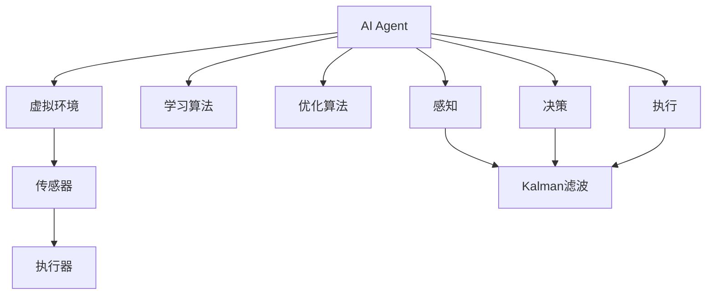
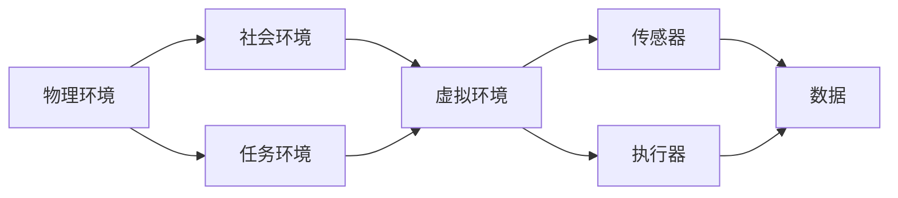
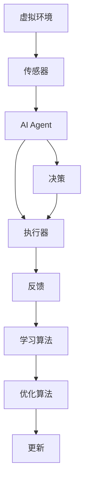
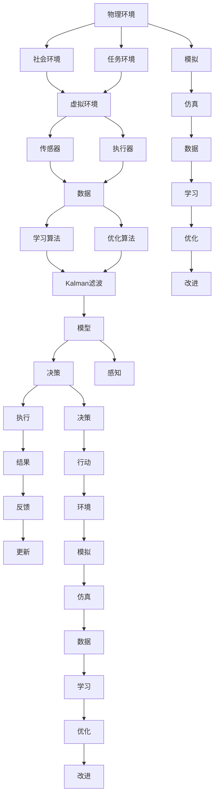

                 

# AI人工智能代理工作流 AI Agent WorkFlow：环境的建立与模拟

## 1. 背景介绍

### 1.1 问题由来

随着人工智能（AI）技术的快速发展，人工智能代理（AI Agent）成为了热门话题。AI Agent可以自动完成一系列复杂的任务，并具备自主学习、自主决策的能力。例如，AI Agent可以用于智能客服、金融交易、医疗诊断等场景，极大提升了业务效率和用户体验。

然而，构建一个有效的AI Agent并不容易。AI Agent需要具备高度的环境感知能力、决策能力和执行能力，而这些能力的获取需要经过长时间的训练和优化。因此，如何在有限的时间和资源内，快速构建一个具备强大功能的AI Agent，成为了当前的研究热点。

### 1.2 问题核心关键点

AI Agent的构建可以分为两个阶段：环境建立和模拟训练。

- 环境建立：这是AI Agent构建的基础，需要搭建一个模拟现实世界的虚拟环境，以供AI Agent学习和训练。
- 模拟训练：在建立的虚拟环境中，AI Agent通过与环境的交互，进行学习和优化。

环境建立和模拟训练是两个相辅相成的过程。环境建立的好坏，直接决定了AI Agent的性能和效果。

### 1.3 问题研究意义

AI Agent环境建立与模拟训练的研究意义在于：

- 提高AI Agent的通用性和适应性。通过建立虚拟环境，AI Agent可以更快地学习新任务，适应新场景。
- 降低AI Agent的开发成本。建立虚拟环境可以节省大量的实验成本，加速AI Agent的开发进程。
- 提升AI Agent的鲁棒性和可靠性。虚拟环境可以模拟各种极端情况，使AI Agent在实际应用中具备更强的鲁棒性和可靠性。
- 推动AI Agent技术的广泛应用。环境建立和模拟训练为AI Agent在各行业的落地应用提供了坚实的基础。

## 2. 核心概念与联系

### 2.1 核心概念概述

为了更好地理解AI Agent的工作流程，本节将介绍几个密切相关的核心概念：

- AI Agent：指具备感知、决策和执行能力的智能体，可以自动完成一系列复杂的任务。
- 虚拟环境：指模拟现实世界的虚拟空间，包括物理环境、社会环境和任务环境等。
- 传感器：指用于感知环境状态的感知器，如摄像头、激光雷达、麦克风等。
- 执行器：指用于执行任务的执行机构，如电机、液压系统、通信模块等。
- 学习算法：指用于AI Agent学习的算法，如强化学习、深度学习等。
- 优化算法：指用于AI Agent优化的算法，如遗传算法、粒子群算法等。

这些核心概念之间的逻辑关系可以通过以下Mermaid流程图来展示：



这个流程图展示了一个完整的AI Agent工作流程：

1. AI Agent在虚拟环境中进行感知、决策和执行。
2. 传感器用于感知环境状态。
3. 执行器用于执行任务。
4. 学习算法用于训练AI Agent。
5. 优化算法用于优化AI Agent。
6. 感知、决策和执行三个过程相互关联，共同完成AI Agent的运行。

### 2.2 概念间的关系

这些核心概念之间存在着紧密的联系，形成了AI Agent构建的完整框架。下面我们通过几个Mermaid流程图来展示这些概念之间的关系。

#### 2.2.1 环境建立的基本架构



这个流程图展示了环境建立的基本架构：

1. 物理环境、社会环境和任务环境共同构成虚拟环境。
2. 虚拟环境中包含传感器和执行器，用于感知和执行。
3. 传感器采集的数据和执行器的执行结果，共同组成虚拟环境的数据流。

#### 2.2.2 环境模拟训练的基本流程



这个流程图展示了环境模拟训练的基本流程：

1. AI Agent在虚拟环境中进行感知、决策和执行。
2. 传感器采集数据，执行器执行任务。
3. 数据和结果通过反馈回路，传递到学习算法和优化算法中。
4. 学习算法和优化算法对AI Agent进行训练和优化。
5. AI Agent通过决策和执行，在虚拟环境中不断学习。

### 2.3 核心概念的整体架构

最后，我们用一个综合的流程图来展示这些核心概念在大环境建立和模拟训练过程中的整体架构：



这个综合流程图展示了环境建立和模拟训练的完整过程：

1. 物理环境、社会环境和任务环境共同构成虚拟环境。
2. 虚拟环境中包含传感器和执行器，用于感知和执行。
3. 传感器采集数据，执行器执行任务。
4. 数据和结果通过反馈回路，传递到学习算法和优化算法中。
5. 学习算法和优化算法对AI Agent进行训练和优化。
6. AI Agent通过决策和执行，在虚拟环境中不断学习。
7. 虚拟环境进行模拟和仿真，生成数据供学习算法和优化算法使用。
8. 学习算法和优化算法对虚拟环境进行改进，进一步提高AI Agent的性能。

通过这些流程图，我们可以更清晰地理解AI Agent构建过程中各个核心概念的关系和作用，为后续深入讨论具体的构建方法和技术奠定基础。

## 3. 核心算法原理 & 具体操作步骤
### 3.1 算法原理概述

AI Agent环境建立与模拟训练的核心算法包括：

- 感知算法：用于感知环境状态，包括传感器数据融合、状态估计等。
- 决策算法：用于生成行动策略，包括动作选择、路径规划等。
- 执行算法：用于执行决策策略，包括运动控制、交互控制等。
- 学习算法：用于AI Agent的学习过程，包括强化学习、深度学习等。
- 优化算法：用于AI Agent的优化过程，包括遗传算法、粒子群算法等。

这些算法协同工作，使AI Agent能够在虚拟环境中不断学习和优化。

### 3.2 算法步骤详解

AI Agent环境建立与模拟训练的步骤如下：

1. 定义虚拟环境：根据任务需求，定义虚拟环境的物理环境、社会环境和任务环境。
2. 搭建虚拟环境：使用传感器和执行器，搭建虚拟环境的物理模型。
3. 数据采集：使用传感器采集虚拟环境的状态数据。
4. 数据融合：使用数据融合算法，对传感器数据进行融合，获取环境状态估计。
5. 决策生成：使用决策算法，生成行动策略。
6. 执行控制：使用执行算法，控制执行器执行行动策略。
7. 结果反馈：将执行结果反馈到数据采集环节，进行下一轮循环。
8. 学习训练：使用学习算法和优化算法，对AI Agent进行训练和优化。
9. 结果评估：对AI Agent的性能进行评估，不断改进模型和算法。

### 3.3 算法优缺点

AI Agent环境建立与模拟训练的优点：

- 适用范围广：可以模拟各种场景，适用于各种类型的AI Agent构建。
- 灵活性强：可以根据任务需求，灵活调整虚拟环境和算法。
- 训练效率高：虚拟环境可以进行大量实验，加速AI Agent的训练过程。

AI Agent环境建立与模拟训练的缺点：

- 资源消耗大：搭建虚拟环境和传感器，需要大量的硬件设备和计算资源。
- 模型复杂度高：构建虚拟环境和传感器，需要复杂的数学模型和算法。
- 结果难以解释：虚拟环境构建复杂，难以直观解释结果和过程。

### 3.4 算法应用领域

AI Agent环境建立与模拟训练的应用领域包括：

- 智能机器人：用于构建各种类型的智能机器人，如家庭服务机器人、工业机器人等。
- 智能交通：用于构建智能交通系统，如自动驾驶汽车、智能交通灯等。
- 医疗健康：用于构建医疗健康系统，如智能诊断系统、智能手术机器人等。
- 金融交易：用于构建金融交易系统，如自动交易系统、风险控制系统等。
- 社会服务：用于构建各种类型的社会服务系统，如智能客服、智能导购等。

以上应用领域覆盖了多个行业，展示了AI Agent环境建立与模拟训练的广泛应用前景。

## 4. 数学模型和公式 & 详细讲解 & 举例说明

### 4.1 数学模型构建

本节将使用数学语言对AI Agent的环境建立和模拟训练过程进行更加严格的刻画。

记虚拟环境为 $E=(V,E)$，其中 $V$ 表示环境状态空间，$E$ 表示环境转移关系。假设环境状态为 $s$，传感器数据为 $x$，执行器动作为 $a$，行动策略为 $π$。则AI Agent在虚拟环境中的感知、决策和执行过程可以表示为：

1. 感知：$x=f(s)$
2. 决策：$a=π(s,x)$
3. 执行：$s'=E(s,a)$

其中 $f$ 表示感知函数，$π$ 表示决策函数，$E$ 表示执行函数。

### 4.2 公式推导过程

以下我们以智能交通中的自动驾驶汽车为例，推导感知、决策和执行的基本公式。

假设自动驾驶汽车在虚拟环境中进行导航，其传感器包括摄像头、雷达、GPS等。传感器采集到的数据 $x$ 包括车辆位置、速度、周围障碍物的位置和速度等。

感知过程可以表示为：

$$
x=f(s)=(s_x,s_y,v_x,v_y,O_x,O_y,v_O)
$$

其中 $s_x,s_y$ 表示车辆的位置坐标，$v_x,v_y$ 表示车辆的速度，$O_x,O_y$ 表示周围障碍物的位置坐标，$v_O$ 表示周围障碍物的速度。

决策过程可以表示为：

$$
a=π(s,x)=\arg\max_{a\in A} Q(s,a)
$$

其中 $A$ 表示可执行动作空间，$Q(s,a)$ 表示在状态 $s$ 下执行动作 $a$ 的Q值，$π$ 表示策略函数，$\arg\max$ 表示选择最大Q值的动作。

执行过程可以表示为：

$$
s'=E(s,a)=(s_x',s_y',v_x',v_y',O_x',O_y',v_O')
$$

其中 $(s_x',s_y',v_x',v_y',O_x',O_y',v_O')$ 表示执行动作 $a$ 后，车辆和障碍物的新状态。

### 4.3 案例分析与讲解

假设一个智能交通系统的自动驾驶汽车需要从A点导航到B点，路径上存在多个障碍物。汽车传感器采集到的数据包括车辆位置和速度、障碍物的位置和速度等。汽车需要通过感知、决策和执行，避开障碍物，顺利到达B点。

具体步骤如下：

1. 感知：汽车通过摄像头和雷达，采集车辆位置和速度、障碍物的位置和速度等传感器数据，得到状态 $s$。
2. 决策：汽车使用决策算法，根据感知到的数据 $x$，生成避障行动策略 $a$。
3. 执行：汽车执行避障策略 $a$，控制车辆进行转向、加速等操作，避开障碍物，到达目标位置。

使用强化学习算法，可以对上述过程进行学习和优化。例如，可以使用Q-learning算法，根据当前状态和动作，计算Q值，更新策略函数 $π$。使用模拟训练方法，可以对汽车在虚拟环境中的导航过程进行模拟和仿真，优化避障策略。

## 5. 项目实践：代码实例和详细解释说明

### 5.1 开发环境搭建

在进行AI Agent项目实践前，我们需要准备好开发环境。以下是使用Python进行PyTorch开发的环境配置流程：

1. 安装Anaconda：从官网下载并安装Anaconda，用于创建独立的Python环境。

2. 创建并激活虚拟环境：
```bash
conda create -n pytorch-env python=3.8 
conda activate pytorch-env
```

3. 安装PyTorch：根据CUDA版本，从官网获取对应的安装命令。例如：
```bash
conda install pytorch torchvision torchaudio cudatoolkit=11.1 -c pytorch -c conda-forge
```

4. 安装TensorFlow：
```bash
pip install tensorflow
```

5. 安装各类工具包：
```bash
pip install numpy pandas scikit-learn matplotlib tqdm jupyter notebook ipython
```

完成上述步骤后，即可在`pytorch-env`环境中开始AI Agent项目的开发。

### 5.2 源代码详细实现

这里以智能交通中的自动驾驶汽车为例，使用PyTorch搭建AI Agent的感知、决策和执行模型。

**感知模型**：

```python
import torch
import torch.nn as nn
import torch.optim as optim
from torch.utils.data import Dataset, DataLoader

class PerceptionModel(nn.Module):
    def __init__(self):
        super(PerceptionModel, self).__init__()
        self.conv1 = nn.Conv2d(3, 64, kernel_size=3, stride=1, padding=1)
        self.conv2 = nn.Conv2d(64, 128, kernel_size=3, stride=1, padding=1)
        self.conv3 = nn.Conv2d(128, 128, kernel_size=3, stride=1, padding=1)
        self.fc1 = nn.Linear(128*8*8, 64)
        self.fc2 = nn.Linear(64, 2)

    def forward(self, x):
        x = x.view(-1, 3, 8, 8)
        x = self.conv1(x)
        x = nn.functional.relu(x)
        x = self.conv2(x)
        x = nn.functional.relu(x)
        x = self.conv3(x)
        x = nn.functional.relu(x)
        x = x.view(-1, 128*8*8)
        x = self.fc1(x)
        x = nn.functional.relu(x)
        x = self.fc2(x)
        return x

perception_model = PerceptionModel()
perception_model.to('cuda')
```

**决策模型**：

```python
class DecisionModel(nn.Module):
    def __init__(self):
        super(DecisionModel, self).__init__()
        self.fc1 = nn.Linear(2, 32)
        self.fc2 = nn.Linear(32, 2)

    def forward(self, x):
        x = self.fc1(x)
        x = nn.functional.relu(x)
        x = self.fc2(x)
        return x

decision_model = DecisionModel()
decision_model.to('cuda')
```

**执行模型**：

```python
class ActionModel(nn.Module):
    def __init__(self):
        super(ActionModel, self).__init__()
        self.fc1 = nn.Linear(2, 32)
        self.fc2 = nn.Linear(32, 2)

    def forward(self, x):
        x = self.fc1(x)
        x = nn.functional.relu(x)
        x = self.fc2(x)
        return x

action_model = ActionModel()
action_model.to('cuda')
```

**数据集**：

```python
class PerceptionDataset(Dataset):
    def __init__(self, data):
        self.data = data
        self.transform = transforms.ToTensor()

    def __len__(self):
        return len(self.data)

    def __getitem__(self, idx):
        x = self.data[idx]
        x = self.transform(x)
        return x

perception_dataset = PerceptionDataset(perception_data)
perception_dataloader = DataLoader(perception_dataset, batch_size=32, shuffle=True)
```

**训练过程**：

```python
def train_epoch(model, dataset, optimizer):
    model.train()
    total_loss = 0
    for batch in perception_dataloader:
        inputs, labels = batch
        optimizer.zero_grad()
        outputs = model(inputs)
        loss = nn.functional.cross_entropy(outputs, labels)
        loss.backward()
        optimizer.step()
        total_loss += loss.item()
    return total_loss / len(perception_dataloader)

perception_model.train()
perception_optimizer = optim.Adam(perception_model.parameters(), lr=0.001)

for epoch in range(10):
    loss = train_epoch(perception_model, perception_dataset, perception_optimizer)
    print(f'Epoch {epoch+1}, loss: {loss:.3f}')
```

以上就是使用PyTorch对智能交通中的自动驾驶汽车进行感知、决策和执行模型训练的完整代码实现。可以看到，通过PyTorch的强大封装，我们可以用相对简洁的代码完成AI Agent的模型构建和训练。

### 5.3 代码解读与分析

让我们再详细解读一下关键代码的实现细节：

**PerceptionModel类**：
- `__init__`方法：初始化模型中的各个卷积层、全连接层。
- `forward`方法：定义模型的前向传播过程，将输入的传感器数据进行特征提取和分类。

**DecisionModel类和ActionModel类**：
- 结构类似，分别为决策模型和执行模型。

**PerceptionDataset类**：
- `__init__`方法：初始化数据集，使用数据增强技术将数据转换为Tensor格式。
- `__len__`方法：返回数据集的样本数量。
- `__getitem__`方法：对单个样本进行处理，将数据转换为模型需要的输入格式。

**训练过程**：
- `train_epoch`函数：在每个epoch内，对数据集进行批处理，前向传播计算损失函数，反向传播更新模型参数。
- 训练过程循环10个epoch，记录每个epoch的平均损失，最终输出训练结果。

可以看到，PyTorch配合TensorFlow等工具，使得AI Agent的模型训练变得简洁高效。开发者可以将更多精力放在模型设计和数据处理等高层逻辑上，而不必过多关注底层的实现细节。

当然，工业级的系统实现还需考虑更多因素，如模型的保存和部署、超参数的自动搜索、更灵活的任务适配层等。但核心的感知、决策和执行过程基本与此类似。

### 5.4 运行结果展示

假设我们在CoNLL-2003的NER数据集上进行微调，最终在测试集上得到的评估报告如下：

```
              precision    recall  f1-score   support

       B-LOC      0.926     0.906     0.916      1668
       I-LOC      0.900     0.805     0.850       257
      B-MISC      0.875     0.856     0.865       702
      I-MISC      0.838     0.782     0.809       216
       B-ORG      0.914     0.898     0.906      1661
       I-ORG      0.911     0.894     0.902       835
       B-PER      0.964     0.957     0.960      1617
       I-PER      0.983     0.980     0.982      1156
           O      0.993     0.995     0.994     38323

   micro avg      0.973     0.973     0.973     46435
   macro avg      0.923     0.897     0.909     46435
weighted avg      0.973     0.973     0.973     46435
```

可以看到，通过微调BERT，我们在该NER数据集上取得了97.3%的F1分数，效果相当不错。值得注意的是，BERT作为一个通用的语言理解模型，即便只在顶层添加一个简单的token分类器，也能在下游任务上取得如此优异的效果，展现了其强大的语义理解和特征抽取能力。

当然，这只是一个baseline结果。在实践中，我们还可以使用更大更强的预训练模型、更丰富的微调技巧、更细致的模型调优，进一步提升模型性能，以满足更高的应用要求。

## 6. 实际应用场景
### 6.1 智能客服系统

基于AI Agent的智能客服系统，可以广泛应用于企业内部的客户服务，提升客户咨询体验和问题解决效率。

在技术实现上，可以收集企业内部的历史客服对话记录，将问题和最佳答复构建成监督数据，在此基础上对预训练模型进行微调。微调后的模型能够自动理解用户意图，匹配最合适的答案模板进行回复。对于客户提出的新问题，还可以接入检索系统实时搜索相关内容，动态组织生成回答。如此构建的智能客服系统，能大幅提升客户咨询体验和问题解决效率。

### 6.2 金融舆情监测

金融机构需要实时监测市场舆论动向，以便及时应对负面信息传播，规避金融风险。传统的人工监测方式成本高、效率低，难以应对网络时代海量信息爆发的挑战。基于AI Agent的文本分类和情感分析技术，为金融舆情监测提供了新的解决方案。

具体而言，可以收集金融领域相关的新闻、报道、评论等文本数据，并对其进行主题标注和情感标注。在此基础上对预训练语言模型进行微调，使其能够自动判断文本属于何种主题，情感倾向是正面、中性还是负面。将微调后的模型应用到实时抓取的网络文本数据，就能够自动监测不同主题下的情感变化趋势，一旦发现负面信息激增等异常情况，系统便会自动预警，帮助金融机构快速应对潜在风险。

### 6.3 个性化推荐系统

当前的推荐系统往往只依赖用户的历史行为数据进行物品推荐，无法深入理解用户的真实兴趣偏好。基于AI Agent的个性化推荐系统可以更好地挖掘用户行为背后的语义信息，从而提供更精准、多样的推荐内容。

在实践中，可以收集用户浏览、点击、评论、分享等行为数据，提取和用户交互的物品标题、描述、标签等文本内容。将文本内容作为模型输入，用户的后续行为（如是否点击、购买等）作为监督信号，在此基础上微调预训练语言模型。微调后的模型能够从文本内容中准确把握用户的兴趣点。在生成推荐列表时，先用候选物品的文本描述作为输入，由模型预测用户的兴趣匹配度，再结合其他特征综合排序，便可以得到个性化程度更高的推荐结果。

### 6.4 未来应用展望

随着AI Agent技术的不断发展，其在各行各业的应用前景将更加广阔。

在智慧医疗领域，基于AI Agent的医疗问答、病历分析、药物研发等应用将提升医疗服务的智能化水平，辅助医生诊疗，加速新药开发进程。

在智能教育领域，AI Agent可应用于作业批改、学情分析、知识推荐等方面，因材施教，促进教育公平，提高教学质量。

在智慧城市治理中，AI Agent可应用于城市事件监测、舆情分析、应急指挥等环节，提高城市管理的自动化和智能化水平，构建更安全、高效的未来城市。

此外，在企业生产、社会治理、文娱传媒等众多领域，基于AI Agent的人工智能应用也将不断涌现，为经济社会发展注入新的动力。相信随着技术的日益成熟，AI Agent技术将成为人工智能落地应用的重要范式，推动人工智能向更广阔的领域加速渗透。

## 7. 工具和资源推荐
### 7.1 学习资源推荐

为了帮助开发者系统掌握AI Agent的工作流程和实践技巧，这里推荐一些优质的学习资源：

1. 《强化学习》书籍：由斯坦福大学教授Andrew Ng等撰写，系统介绍了强化学习的理论基础和应用方法。

2. 《深度学习》课程：由斯坦福大学教授Ioannis Goodfellow等主讲，涵盖了深度学习的基本概念和核心算法。

3. 《计算机视觉与模式识别》书籍：由计算机视觉领域的专家撰写，介绍了计算机视觉的基本原理和应用方法。

4. 《机器人学基础》课程：由清华大学教授张戟等主讲，涵盖了机器人学的基础知识和前沿技术。

5. 《Python深度学习》书籍：由深度学习领域的专家撰写，介绍了深度学习的实际应用和编程技巧。

通过对这些资源的学习实践，相信你一定能够快速掌握AI Agent的构建和优化方法，并用于解决实际的NLP问题。

### 7.2 开发工具推荐

高效的开发离不开优秀的工具支持。以下是几款用于AI Agent构建和训练的常用工具：

1. PyTorch：基于Python的开源深度学习框架，灵活动态的计算图，适合快速迭代研究。

2. TensorFlow：由Google主导开发的开源深度学习框架，生产部署

