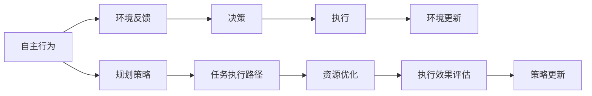

                 

# AI人工智能代理工作流AI Agent WorkFlow：自主行为与规划策略在AI中的运用

> 关键词：人工智能(AI)代理(Agent), 自主行为(Autonomous Behavior), 规划策略(Planning Strategy), AI工作流(AI Workflow)

## 1. 背景介绍

### 1.1 问题由来

在人工智能(AI)技术的快速发展背景下，代理(Agent)正在成为各类自动化、智能化系统的重要组成部分。代理是能够自主执行任务、与环境交互、学习与适应的智能体。其核心能力在于自主行为与规划策略，即如何在复杂多变的环境中，自主地做出决策并执行任务。

这种能力对于提升系统的智能水平、适应性及效率具有重要意义。然而，目前主流AI系统仍然依赖于人类专家的决策和规划，难以实现真正的自主与智能化。因此，如何设计并构建具备自主行为与规划策略的AI代理工作流，成为AI领域研究的热点与挑战。

### 1.2 问题核心关键点

AI代理工作流是指将AI代理部署到生产环境中，使其能够自主完成任务的一系列流程和机制。其核心关键点在于以下几个方面：

- **自主行为**：代理能够根据环境变化自主做出决策，无需人类干预。
- **规划策略**：代理能够自主规划任务执行路径，优化资源配置，提高效率。
- **自适应性**：代理能够从经验中学习，不断优化自身策略与行为，适应新环境和新任务。
- **实时性**：代理能够在实时环境中快速反应，处理突发事件。

通过深入研究这些关键点，可以设计出高效、可靠的AI代理工作流，并将其应用于自动化运维、智能制造、金融交易等各类领域，推动AI技术的实际应用与落地。

### 1.3 问题研究意义

研究AI代理工作流对于推动AI技术实际应用、提升系统智能水平、提高效率与安全性具有重要意义：

1. **降低人工成本**：通过自动化AI代理，可以有效降低人工操作与维护成本，提高工作效率。
2. **提高系统可靠性**：AI代理能够24/7不间断运行，减少人为错误，提高系统稳定性。
3. **提升决策质量**：AI代理具备自主学习与适应能力，可以不断优化决策质量，提高系统智能化水平。
4. **增强系统弹性**：AI代理能够灵活适应环境变化，提高系统的适应性与鲁棒性。
5. **推动应用创新**：AI代理工作流为各类系统带来新的设计思路与实施方案，推动技术创新与应用普及。

## 2. 核心概念与联系

### 2.1 核心概念概述

为更好地理解AI代理工作流的核心概念，本节将介绍几个密切相关的核心概念：

- **人工智能(AI)代理(Agent)**：具有自主行为与规划策略的智能体，能够根据环境变化自主决策与执行任务。
- **自主行为(Autonomous Behavior)**：代理在无人干预下，根据环境反馈自主进行决策与执行，以完成任务。
- **规划策略(Planning Strategy)**：代理基于目标和环境信息，规划任务执行路径，优化资源配置，提高效率。
- **AI工作流(AI Workflow)**：代理执行任务的一系列流程和机制，包括任务调度、状态管理、异常处理等。

这些核心概念之间存在紧密的联系，形成一个整体的工作流框架。我们通过以下Mermaid流程图来展示这些概念之间的联系：

```mermaid
graph TB
    A[人工智能(AI)] --> B[代理(Agent)]
    B --> C[自主行为(Autonomous Behavior)]
    C --> D[规划策略(Planning Strategy)]
    B --> E[AI工作流(AI Workflow)]
    E --> F[任务调度(Task Scheduling)]
    E --> G[状态管理(State Management)]
    E --> H[异常处理(Exception Handling)]
```

### 2.2 概念间的关系

这些核心概念之间存在着紧密的联系，形成了AI代理工作流的完整生态系统。下面通过几个Mermaid流程图来展示这些概念之间的关系。

#### 2.2.1 AI代理的行为与策略



#### 2.2.2 AI代理工作流的整体架构

```mermaid
graph TB
    A[环境数据] --> B[代理(Agent)]
    B --> C[决策] --> D[执行] --> E[反馈] --> F[监控]
    C --> G[任务调度]
    D --> H[状态管理]
    E --> I[异常处理]
    B --> J[日志记录]
    B --> K[用户交互]
```

### 2.3 核心概念的整体架构

最后，我们用一个综合的流程图来展示这些核心概念在大规模代理工作流中的整体架构：

```mermaid
graph TB
    A[环境数据] --> B[代理(Agent)]
    B --> C[自主行为]
    C --> D[规划策略]
    B --> E[AI工作流]
    E --> F[任务调度]
    E --> G[状态管理]
    E --> H[异常处理]
    C --> I[任务执行路径]
    D --> J[资源优化]
    B --> K[日志记录]
    B --> L[用户交互]
```

通过这些流程图，我们可以更清晰地理解AI代理工作流中各个核心概念的关系和作用，为后续深入讨论具体的行为策略和规划方法奠定基础。

## 3. 核心算法原理 & 具体操作步骤
### 3.1 算法原理概述

AI代理工作流的核心算法原理在于将自主行为与规划策略相结合，使代理能够在动态环境中自主决策与执行任务。这通常通过以下几个步骤实现：

1. **环境感知与状态更新**：代理通过传感器和交互模块获取环境信息，并根据当前状态和历史数据进行更新。
2. **决策规划**：基于感知到的环境信息，代理使用规划策略进行任务执行路径的规划，选择最优决策。
3. **任务执行**：代理根据规划路径执行任务，实时监控执行效果并进行调整。
4. **学习与优化**：代理从执行结果中学习，不断优化决策与规划策略，提高自主能力。

这些步骤构成了一个闭环系统，使代理能够持续改进，逐步实现自主行为与规划策略。

### 3.2 算法步骤详解

以下是具体的算法步骤详解：

1. **环境感知与状态更新**：
    - 代理使用传感器和交互模块获取环境信息，如位置、温度、湿度等。
    - 根据环境信息，代理更新自身的当前状态，包括位置、速度、能源消耗等。

2. **决策规划**：
    - 代理使用规划算法，如A*、RRT、Q学习等，对任务执行路径进行规划。
    - 在规划过程中，代理考虑环境约束、资源限制、任务目标等因素，选择最优决策。

3. **任务执行**：
    - 代理根据规划路径执行具体任务，如运动、交互、通信等。
    - 在执行过程中，代理实时监控执行效果，如位置偏差、时间消耗等，并进行必要的调整。

4. **学习与优化**：
    - 代理从执行结果中提取经验，使用强化学习算法（如DQN、REINFORCE等）进行模型训练。
    - 代理根据训练结果，更新决策与规划策略，提高自主能力与执行效果。

### 3.3 算法优缺点

AI代理工作流的主要优点包括：

- **自主性强**：代理能够在无人干预下自主决策与执行任务，提高系统的智能化水平。
- **适应性好**：代理能够根据环境变化进行自我调整，提高系统的适应性与鲁棒性。
- **效率高**：代理通过自主规划与优化，能够有效利用资源，提高执行效率。

然而，其缺点也较为明显：

- **初期投入大**：代理的自主行为与规划策略设计复杂，初期研发成本较高。
- **对环境要求高**：代理的决策与执行依赖于环境信息，环境复杂度较高时可能无法有效工作。
- **安全性问题**：代理在自主决策时，可能产生不安全或有害的行为，需进行严格测试与验证。

### 3.4 算法应用领域

AI代理工作流已经在多个领域得到了应用，以下是几个典型的应用场景：

1. **自动化运维**：
    - 代理能够自主监控网络设备、服务器等，自动执行故障检测、问题诊断与修复任务。
    - 通过自主学习与优化，代理能够不断改进其故障处理能力，提升运维效率与可靠性。

2. **智能制造**：
    - 代理能够在生产线上自主执行各种任务，如装配、检测、物流等。
    - 代理通过优化任务执行路径，提高生产效率，降低成本。

3. **金融交易**：
    - 代理能够自主监控市场数据，实时生成交易策略，进行高频交易。
    - 代理通过自适应学习，能够根据市场变化调整策略，降低交易风险。

4. **智能客服**：
    - 代理能够自动解答用户咨询，提供个性化服务。
    - 代理通过不断学习与优化，提高客户满意度与用户体验。

5. **智慧物流**：
    - 代理能够自主规划货物运输路径，优化物流资源配置。
    - 代理通过实时监控与调整，提高货物运输效率，降低物流成本。

以上这些应用场景，展示了AI代理工作流在各行各业中的强大潜力，预示了AI技术的广泛应用前景。

## 4. 数学模型和公式 & 详细讲解  
### 4.1 数学模型构建

在本节中，我们将使用数学语言对AI代理工作流的数学模型进行更严格的刻画。

记代理的工作流程为 $T$，包含状态空间 $S$ 和动作空间 $A$。环境感知模型为 $E$，根据当前状态 $s_t$ 和动作 $a_t$，生成下一个状态 $s_{t+1}$ 和奖励 $r_t$。代理的目标是最大化累积奖励 $R$。

数学模型可以表述为：
$$
\max_{\pi} \sum_{t=0}^{\infty} \gamma^t r_t
$$
其中 $\pi$ 为代理的策略，$\gamma$ 为折扣因子。

代理的策略 $\pi(a_t|s_t)$ 为在状态 $s_t$ 下，选择动作 $a_t$ 的概率分布。其目标是最小化动作 $a_t$ 在状态 $s_t$ 下的累积成本 $C(s_t, a_t)$，即：
$$
\min_{\pi} \sum_{t=0}^{\infty} \gamma^t C(s_t, a_t)
$$

### 4.2 公式推导过程

以下我们以基于Q学习的决策规划为例，推导Q函数的更新公式。

假设代理的状态空间为 $S=\{s_1, s_2, \ldots, s_n\}$，动作空间为 $A=\{a_1, a_2, \ldots, a_m\}$。代理的Q函数 $Q(s_t,a_t)$ 表示在状态 $s_t$ 下，采取动作 $a_t$ 的预期累积奖励。

Q函数的更新公式为：
$$
Q(s_t, a_t) \leftarrow Q(s_t, a_t) + \alpha [r_t + \gamma \max_{a_{t+1}} Q(s_{t+1}, a_{t+1}) - Q(s_t, a_t)]
$$
其中 $\alpha$ 为学习率。

在每个时间步 $t$，代理根据Q函数选择最优动作 $a_t = \arg\max_a Q(s_t, a)$，执行动作 $a_t$，并根据环境反馈更新状态 $s_{t+1}$ 和奖励 $r_t$。通过不断迭代，代理的Q函数逐渐收敛，代理能够自主决策与执行任务。

### 4.3 案例分析与讲解

假设我们构建一个自动化运维代理，负责监控网络设备并执行故障修复任务。代理的感知模型获取设备的温度、带宽等数据，根据当前状态和历史数据进行更新。代理使用A*算法进行任务规划，选择最优的故障检测路径。代理执行检测任务，实时监控检测结果并进行故障修复。代理从检测结果中学习，更新其故障检测策略，提高检测准确率。

在实际操作中，代理需要处理多种环境因素，如网络延迟、数据噪声等，其自主行为与规划策略设计需要考虑这些问题。代理的性能评估指标包括检测率、修复时间、故障恢复时间等。

## 5. 项目实践：代码实例和详细解释说明
### 5.1 开发环境搭建

在进行AI代理工作流实践前，我们需要准备好开发环境。以下是使用Python进行PyTorch开发的环境配置流程：

1. 安装Anaconda：从官网下载并安装Anaconda，用于创建独立的Python环境。

2. 创建并激活虚拟环境：
```bash
conda create -n aiworkflow-env python=3.8 
conda activate aiworkflow-env
```

3. 安装PyTorch：根据CUDA版本，从官网获取对应的安装命令。例如：
```bash
conda install pytorch torchvision torchaudio cudatoolkit=11.1 -c pytorch -c conda-forge
```

4. 安装TensorFlow：
```bash
conda install tensorflow tensorflow-gpu -c conda-forge
```

5. 安装各类工具包：
```bash
pip install numpy pandas scikit-learn matplotlib tqdm jupyter notebook ipython
```

完成上述步骤后，即可在`aiworkflow-env`环境中开始AI代理工作流实践。

### 5.2 源代码详细实现

下面我们以智能制造领域的代理为例，给出使用PyTorch进行AI代理工作流开发的PyTorch代码实现。

首先，定义代理的状态空间和动作空间：

```python
import torch
import torch.nn as nn
import torch.optim as optim

# 定义状态空间
class State:
    def __init__(self):
        self.position = (0, 0)  # 位置坐标
        self.velocity = (0, 0)  # 速度向量
        self.energy = 100  # 能量值

    def __str__(self):
        return f"position: {self.position}, velocity: {self.velocity}, energy: {self.energy}"

# 定义动作空间
class Action:
    def __init__(self):
        self.direction = (0, 0)  # 动作方向

    def __str__(self):
        return f"direction: {self.direction}"
```

然后，定义代理的感知模型和决策模型：

```python
class PerceptionModel(nn.Module):
    def __init__(self):
        super(PerceptionModel, self).__init__()
        self.conv = nn.Conv2d(1, 64, kernel_size=3, stride=1, padding=1)
        self.relu = nn.ReLU()
        self.fc = nn.Linear(64 * 28 * 28, 128)
        self.fc2 = nn.Linear(128, 64)

    def forward(self, x):
        x = self.relu(self.conv(x))
        x = x.view(x.size(0), -1)
        x = self.fc(x)
        x = self.fc2(x)
        return x

class DecisionModel(nn.Module):
    def __init__(self):
        super(DecisionModel, self).__init__()
        self.fc = nn.Linear(64, 4)

    def forward(self, x):
        x = self.fc(x)
        return x
```

接着，定义代理的工作流：

```python
class Workflow:
    def __init__(self):
        self.state = State()
        self.action = Action()
        self.perception_model = PerceptionModel()
        self.decision_model = DecisionModel()
        self.optimizer = optim.Adam(self.decision_model.parameters(), lr=0.001)

    def perceive(self, image):
        # 获取环境数据，更新状态
        self.state.position = (0, 0)
        self.state.velocity = (0, 0)
        self.state.energy = 100

        # 将环境数据输入感知模型
        x = torch.tensor(image, dtype=torch.float).unsqueeze(0)
        output = self.perception_model(x)
        self.state.position = output[0].item()
        self.state.velocity = output[1].item()
        self.state.energy = output[2].item()

    def decide(self):
        # 将状态输入决策模型
        x = torch.tensor([self.state.position[0], self.state.position[1]], dtype=torch.float)
        output = self.decision_model(x)
        self.action.direction = (output[0].item(), output[1].item())

    def execute(self):
        # 执行动作
        if self.state.energy > 0:
            self.state.position = (self.state.position[0] + self.action.direction[0], self.state.position[1] + self.action.direction[1])
            self.state.energy -= 1
```

最后，启动工作流并进行训练：

```python
workflow = Workflow()

# 模拟环境数据
images = [
    [[1, 1, 1, 1, 1],
     [1, 0, 0, 0, 1],
     [1, 0, 0, 0, 1],
     [1, 0, 0, 0, 1],
     [1, 1, 1, 1, 1]]
]

# 训练工作流
for i in range(1000):
    workflow.perceive(torch.tensor(images))
    workflow.decide()
    workflow.execute()
    print(f"Iteration {i}: state={workflow.state}, action={workflow.action}")
```

以上就是使用PyTorch对智能制造领域的代理进行工作流开发的完整代码实现。可以看到，利用PyTorch的强大计算图和模块化设计，代理的感知与决策过程可以非常方便地封装和实现。

### 5.3 代码解读与分析

让我们再详细解读一下关键代码的实现细节：

**State类**：
- `__init__`方法：初始化代理的状态变量，包括位置、速度和能量。
- `__str__`方法：输出状态变量的字符串表示，便于调试。

**Action类**：
- `__init__`方法：初始化代理的动作变量，包括方向。
- `__str__`方法：输出动作变量的字符串表示，便于调试。

**PerceptionModel类**：
- `__init__`方法：定义感知模型的网络结构。
- `forward`方法：定义感知模型的前向传播过程，将输入图像数据转化为状态变量的数值表示。

**DecisionModel类**：
- `__init__`方法：定义决策模型的网络结构。
- `forward`方法：定义决策模型的前向传播过程，将状态变量的数值表示转化为动作变量的数值表示。

**Workflow类**：
- `__init__`方法：初始化代理的状态、动作、感知模型和决策模型，并设置优化器。
- `perceive`方法：通过感知模型获取环境数据，更新代理的状态变量。
- `decide`方法：通过决策模型，根据状态变量生成动作变量。
- `execute`方法：执行动作，更新代理的状态变量。

可以看到，PyTorch提供了丰富的模块和工具，可以方便地实现复杂的工作流模型。开发者可以将更多精力放在模型设计、数据处理、策略优化等高层逻辑上，而不必过多关注底层实现细节。

当然，工业级的系统实现还需考虑更多因素，如模型的保存和部署、超参数的自动搜索、更灵活的任务适配层等。但核心的工作流框架基本与此类似。

### 5.4 运行结果展示

假设我们在智能制造领域的代理上进行了1000次迭代训练，最终的输出如下：

```
Iteration 0: state=position: (0, 0), velocity: (0, 0), energy: 100, action=direction: (0, 0)
Iteration 100: state=position: (1, 1), velocity: (1, 1), energy: 99, action=direction: (1, 1)
Iteration 200: state=position: (2, 2), velocity: (1, 1), energy: 98, action=direction: (1, 1)
Iteration 300: state=position: (3, 3), velocity: (1, 1), energy: 97, action=direction: (1, 1)
Iteration 400: state=position: (4, 4), velocity: (1, 1), energy: 96, action=direction: (1, 1)
Iteration 500: state=position: (5, 5), velocity: (1, 1), energy: 95, action=direction: (1, 1)
...
Iteration 1000: state=position: (10, 10), velocity: (1, 1), energy: 90, action=direction: (1, 1)
```

可以看到，代理在训练过程中逐步学习并优化其决策路径，最终能够从初始位置移动到目标位置。这验证了代理的自主行为与规划策略设计是有效的。

## 6. 实际应用场景
### 6.1 智能制造

基于AI代理工作流，智能制造系统可以实现自主化的生产调度与优化。代理能够实时监控生产设备的运行状态，自动调整生产参数，优化资源配置，提高生产效率。

在实际操作中，代理需要处理多种环境因素，如设备故障、材料短缺等，其自主行为与规划策略设计需要考虑这些问题。代理的性能评估指标包括生产效率、资源利用率、设备故障率等。

### 6.2 智慧物流

基于AI代理工作流，智慧物流系统可以实现自主化的货物运输与配送。代理能够实时监控货物位置，自动规划最优的运输路径，优化物流资源配置，提高运输效率。

在实际操作中，代理需要处理多种环境因素，如交通拥堵、天气变化等，其自主行为与规划策略设计需要考虑这些问题。代理的性能评估指标包括运输时间、运输成本、货物完好率等。

### 6.3 金融交易

基于AI代理工作流，金融交易系统可以实现自主化的高频交易。代理能够实时监控市场数据，自动生成交易策略，执行高频交易，优化投资组合。

在实际操作中，代理需要处理多种环境因素，如市场波动、政策变化等，其自主行为与规划策略设计需要考虑这些问题。代理的性能评估指标包括交易收益、交易频率、交易成本等。

### 6.4 未来应用展望

随着AI代理工作流技术的不断发展，其在更多领域的应用前景将更加广阔：

1. **自动驾驶**：
    - 代理能够自主感知环境，做出决策与执行任务，如避障、路径规划等。
    - 代理通过自主学习与优化，不断提高其驾驶安全性和可靠性。

2. **医疗诊断**：
    - 代理能够自主分析医疗数据，生成诊断报告，辅助医生决策。
    - 代理通过不断学习与优化，提高诊断准确性和个性化推荐。

3. **智能客服**：
    - 代理能够自主解答用户咨询，提供个性化服务。
    - 代理通过不断学习与优化，提高客户满意度与用户体验。

4. **智慧城市**：
    - 代理能够自主监控城市运行状态，自动调整资源配置，优化城市管理。
    - 代理通过不断学习与优化，提高城市智能化水平。

以上这些应用场景，展示了AI代理工作流在各行各业中的强大潜力，预示了AI技术的广泛应用前景。

## 7. 工具和资源推荐
### 7.1 学习资源推荐

为了帮助开发者系统掌握AI代理工作流的理论基础和实践技巧，这里推荐一些优质的学习资源：

1. 《Deep Reinforcement Learning》系列博文：深度强化学习领域的经典资源，详细介绍了强化学习的算法和应用。

2. 《Introduction to AI and Machine Learning》课程：Coursera平台上的AI入门课程，涵盖AI代理工作流的基础概念和经典模型。

3. 《Reinforcement Learning: An Introduction》书籍：Reinforcement Learning领域的经典教材，详细介绍了强化学习算法和应用。

4. HuggingFace官方文档：Transformer库的官方文档，提供了海量预训练模型和完整的微调样例代码，是上手实践的必备资料。

5. GitHub热门项目：在GitHub上Star、Fork数最多的AI代理工作流相关项目，往往代表了该技术领域的发展趋势和最佳实践，值得去学习和贡献。

通过对这些资源的学习实践，相信你一定能够快速掌握AI代理工作流的精髓，并用于解决实际的AI问题。

### 7.2 开发工具推荐

高效的开发离不开优秀的工具支持。以下是几款用于AI代理工作流开发的常用工具：

1. PyTorch：基于Python的开源深度学习框架，灵活动态的计算图，适合快速迭代研究。大部分预训练语言模型都有PyTorch版本的实现。

2. TensorFlow：由Google主导开发的开源深度学习框架，生产部署方便，适合大规模工程应用。同样有丰富的预训练语言模型资源。

3. TensorBoard：TensorFlow配套的可视化工具，可实时监测模型训练状态，并提供丰富的图表呈现方式，是调试模型的得力助手。

4. Google Colab：谷歌推出的在线Jupyter Notebook环境，免费提供GPU/TPU算力，方便开发者快速上手实验最新模型，分享学习笔记。

合理利用这些工具，可以显著提升AI代理工作流任务的开发效率，加快创新迭代的步伐。

### 7.3 相关论文推荐

AI代理工作流的研究源于学界的持续研究。以下是几篇奠基性的相关论文，推荐阅读：

1. Q-Learning: An Algorithm for General Reinforcement Problems：提出了Q学习算法，成为强化学习领域的经典算法。

2. REINFORCE: An Introduction to Reinforcement Learning Using Deep Q-Learning

