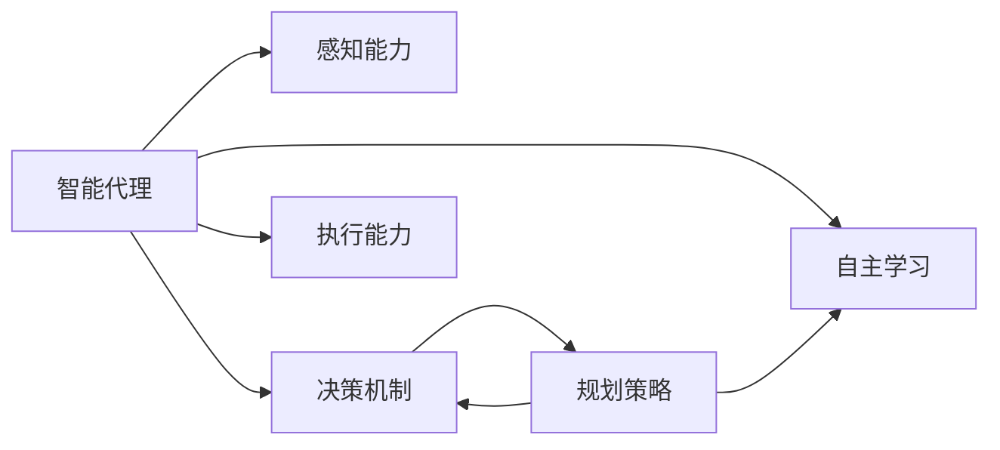
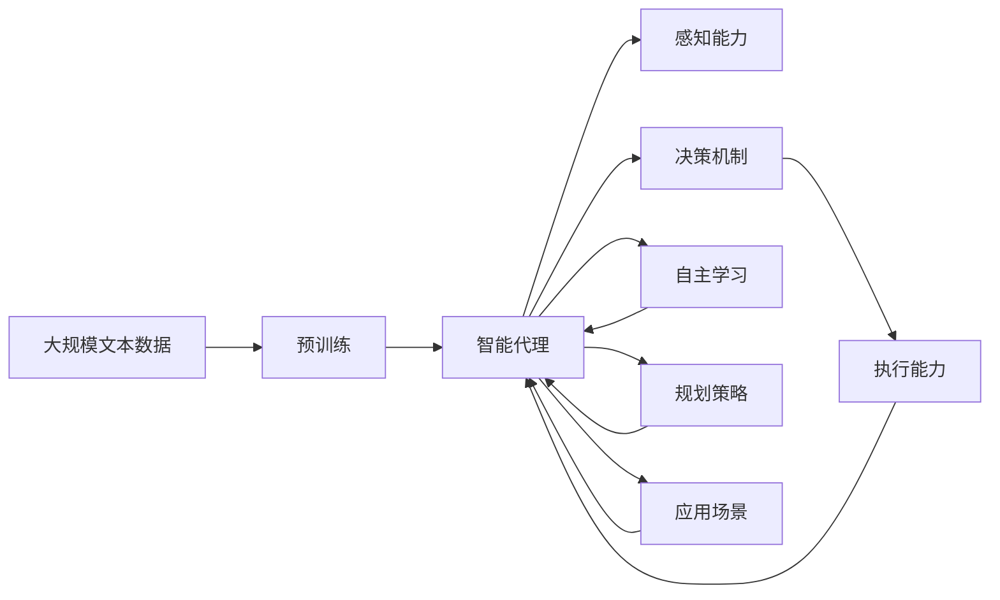

                 

# AI人工智能深度学习算法：智能深度学习代理的自主行为与规划策略

> 关键词：人工智能,深度学习,智能代理,自主行为,规划策略

## 1. 背景介绍

### 1.1 问题由来

近年来，随着人工智能技术的迅猛发展，特别是深度学习（Deep Learning）在计算机视觉、自然语言处理等领域取得的突破性进展，人们开始思考如何让机器具备更高级的自主行为和决策能力。智能代理（Intelligent Agents）作为人工智能领域的一个重要分支，已经在自动化任务、智能推荐、机器人控制等方面展现出巨大的潜力。然而，如何设计高效的智能代理模型，使其能够自主地感知环境、规划行为、实现目标，是当前亟需解决的关键问题。

### 1.2 问题核心关键点

智能代理的自主行为与规划策略的研究核心包括以下几个方面：

- **感知能力**：智能代理需要具备感知环境、理解语言、识别对象等能力。
- **决策机制**：智能代理需要根据感知到的信息，通过学习、推理、规划等机制，制定出最优的行动方案。
- **执行能力**：智能代理需要将决策转化为具体行动，并在执行过程中实时调整策略。
- **自主学习**：智能代理应具备自我优化和适应环境变化的能力，能够在不断反馈和实践中提升性能。

### 1.3 问题研究意义

研究智能代理的自主行为与规划策略，对于推动人工智能技术的发展具有重要意义：

- **提高决策效率**：智能代理能够快速准确地处理复杂任务，提高生产效率和生活质量。
- **降低人工干预**：智能代理可以减少对人工干预的依赖，降低人工成本，提升系统的可靠性和稳定性。
- **实现人机协作**：智能代理能够与人协同工作，弥补人类在某些任务上的不足，增强人机交互体验。
- **推动技术创新**：智能代理的研究将促进自动化、机器人、智能推荐等领域的创新发展，推动相关技术的产业化进程。

## 2. 核心概念与联系

### 2.1 核心概念概述

为更好地理解智能代理的自主行为与规划策略，本节将介绍几个密切相关的核心概念：

- **智能代理（Intelligent Agent）**：具备自主行为和决策能力的计算机程序或系统。能够感知环境、理解语言、规划行动，并根据环境反馈进行自我优化。
- **自主学习（Autonomous Learning）**：智能代理通过与环境的交互，不断积累经验，优化内部模型，提升决策能力的过程。
- **规划策略（Planning Strategy）**：智能代理制定行动计划和决策规则的策略，如深度学习、强化学习、策略搜索等。
- **深度学习（Deep Learning）**：一种利用神经网络模型进行复杂数据处理和决策的技术，能够从大量数据中自动提取特征，进行分类、识别等任务。
- **强化学习（Reinforcement Learning）**：一种通过奖励和惩罚机制，使智能代理在不断试错中优化决策策略的方法。

### 2.2 概念间的关系

这些核心概念之间的逻辑关系可以通过以下Mermaid流程图来展示：



这个流程图展示了智能代理的核心能力及其之间的关联：

1. 智能代理通过感知能力获取环境信息，作为决策的基础。
2. 决策机制基于感知到的信息，通过学习、推理、规划等策略，制定出最优的行动方案。
3. 执行能力将决策转化为具体的行动，并根据执行结果反馈优化决策。
4. 自主学习通过不断反馈和实践，增强智能代理的适应性和决策能力。

### 2.3 核心概念的整体架构

最后，我们用一个综合的流程图来展示这些核心概念在大语言模型微调过程中的整体架构：



这个综合流程图展示了从预训练到智能代理的完整过程。智能代理通过感知环境、规划决策、执行行动，实现自主行为，并在不断的学习中提升性能，最终应用于各种实际场景。

## 3. 核心算法原理 & 具体操作步骤

### 3.1 算法原理概述

智能代理的自主行为与规划策略的核心算法主要包括以下几种：

- **深度学习（Deep Learning）**：通过构建复杂的神经网络模型，从大量数据中自动提取特征，进行分类、识别等任务。
- **强化学习（Reinforcement Learning）**：通过奖励和惩罚机制，使智能代理在不断试错中优化决策策略。
- **策略搜索（Strategy Search）**：通过搜索空间中的最优策略，制定行动方案。
- **元学习（Meta Learning）**：通过学习如何在不同的任务上适应，增强智能代理的泛化能力。

### 3.2 算法步骤详解

智能代理的自主行为与规划策略的一般步骤如下：

**Step 1: 准备数据和环境**
- 收集智能代理所需的环境数据和任务目标。
- 设计环境的观测机制和奖励机制，使智能代理能够感知环境、执行行动并接受反馈。

**Step 2: 设计模型和策略**
- 选择合适的深度学习模型（如卷积神经网络CNN、循环神经网络RNN、Transformer等），并确定输入输出格式。
- 设计强化学习策略，包括状态评估、动作选择、奖励函数等，以指导智能代理的决策过程。
- 设计搜索空间和策略搜索算法，探索最优决策策略。

**Step 3: 训练和优化**
- 使用收集到的环境数据和任务目标，对模型进行训练和优化。
- 利用强化学习算法，通过不断试错，优化决策策略。
- 采用元学习技术，加速智能代理在不同任务上的适应。

**Step 4: 部署和应用**
- 将训练好的智能代理模型部署到实际环境中，进行实时决策和行动。
- 在运行过程中，不断收集反馈数据，进行自主学习和策略优化。

### 3.3 算法优缺点

智能代理的自主行为与规划策略具有以下优点：

- **高效性**：深度学习和强化学习等算法能够快速处理复杂数据和决策任务，提高生产效率和生活质量。
- **鲁棒性**：智能代理能够在不断反馈和实践中自我优化，提升决策的鲁棒性和适应性。
- **灵活性**：智能代理能够根据环境变化实时调整策略，适应不同的应用场景。

同时，这些算法也存在一些局限性：

- **高资源需求**：深度学习和强化学习算法需要大量的数据和计算资源，难以在资源受限的环境中应用。
- **复杂度**：算法模型和策略设计复杂，需要专业的知识和经验。
- **稳定性**：在复杂和不确定的环境中，智能代理的决策和行为可能不够稳定。

### 3.4 算法应用领域

智能代理的自主行为与规划策略已经被广泛应用于各个领域，例如：

- **自动驾驶**：智能代理通过感知和理解交通环境，规划行驶路线，实现自动驾驶。
- **机器人控制**：智能代理通过感知和识别，控制机器人的运动和操作，执行复杂任务。
- **智能推荐**：智能代理通过分析用户行为和偏好，推荐个性化的商品或内容。
- **金融交易**：智能代理通过感知市场信息，制定交易策略，实现自动交易。
- **医疗诊断**：智能代理通过感知和理解医学图像，进行疾病诊断和治疗建议。

除了上述这些经典应用外，智能代理的自主行为与规划策略还在物流、制造、安全监控等领域展现出巨大潜力，为各行各业带来了新的发展机遇。

## 4. 数学模型和公式 & 详细讲解 & 举例说明（备注：数学公式请使用latex格式，latex嵌入文中独立段落使用 $$，段落内使用 $)
### 4.1 数学模型构建

本节将使用数学语言对智能代理的自主行为与规划策略进行更加严格的刻画。

记智能代理模型为 $M_{\theta}:\mathcal{X} \rightarrow \mathcal{Y}$，其中 $\mathcal{X}$ 为环境输入空间，$\mathcal{Y}$ 为行动空间，$\theta$ 为模型参数。假设智能代理在环境 $E$ 上的决策过程为 $P_E$，目标函数为 $\mathcal{R}$。

定义智能代理在某个时刻 $t$ 的观测为 $x_t$，行动为 $a_t$，奖励为 $r_t$，则智能代理的决策过程可以表示为：

$$
a_t = M_{\theta}(x_t)
$$

$$
r_t = \mathcal{R}(a_t, x_t)
$$

智能代理的目标是通过最大化累计奖励，实现长期目标。因此，智能代理的决策目标可以表示为：

$$
\max_{\theta} \sum_{t=1}^{T} r_t
$$

### 4.2 公式推导过程

以下我们以强化学习中的Q-learning算法为例，推导智能代理的决策目标和策略更新公式。

定义状态-行动值函数 $Q(s,a)$，表示在状态 $s$ 下采取行动 $a$ 的期望奖励：

$$
Q(s,a) = \mathbb{E}[R_t + \gamma Q(s',a') | s_0 = s, a_0 = a]
$$

其中 $\gamma$ 为折扣因子，控制未来奖励的权重。假设智能代理在每个时刻只采取一个行动，则可以通过迭代求解 $Q(s,a)$，实现最优决策：

$$
Q_{t+1}(s,a) = (1 - \alpha)Q_t(s,a) + \alpha(r + \gamma \max_{a'} Q_t(s',a'))
$$

其中 $\alpha$ 为学习率，用于控制每次更新对已有值的依赖程度。

### 4.3 案例分析与讲解

考虑一个简单的智能推荐系统，使用Q-learning算法对智能代理进行训练。

假设推荐系统接收用户行为数据 $(x_t)$，如浏览记录、评分、点击等，将其转化为状态 $s_t$，并根据推荐结果 $a_t$ 计算奖励 $r_t$。智能代理的目标是根据当前状态 $s_t$，选择最优的推荐策略 $a_t$，以最大化用户满意度和平台收益。

具体而言，可以设计状态表示为：

$$
s_t = (x_1, x_2, \ldots, x_t)
$$

其中 $x_t$ 表示用户行为数据，如用户浏览的网页、点击的按钮、评分等。行动表示为：

$$
a_t = \text{推荐商品列表}
$$

奖励可以设计为：

$$
r_t = \text{用户满意度} - \text{平台成本}
$$

在Q-learning算法中，智能代理通过不断试错，更新状态-行动值函数 $Q(s,a)$，最终选择最优的推荐策略。通过调整学习率和折扣因子，智能代理能够在不断反馈中优化决策策略，实现个性化推荐。

## 5. 项目实践：代码实例和详细解释说明
### 5.1 开发环境搭建

在进行智能代理实践前，我们需要准备好开发环境。以下是使用Python进行TensorFlow开发的环境配置流程：

1. 安装Anaconda：从官网下载并安装Anaconda，用于创建独立的Python环境。

2. 创建并激活虚拟环境：
```bash
conda create -n tf-env python=3.8 
conda activate tf-env
```

3. 安装TensorFlow：根据CUDA版本，从官网获取对应的安装命令。例如：
```bash
pip install tensorflow==2.7
```

4. 安装TensorFlow Addons：
```bash
pip install tensorflow-addons==0.19
```

5. 安装PyTorch：
```bash
pip install torch torchvision torchaudio
```

6. 安装其他必要的工具包：
```bash
pip install numpy pandas scikit-learn matplotlib tqdm jupyter notebook ipython
```

完成上述步骤后，即可在`tf-env`环境中开始智能代理的实践。

### 5.2 源代码详细实现

这里我们以智能推荐系统为例，给出使用TensorFlow对智能代理进行训练的代码实现。

首先，定义推荐系统的状态表示和奖励函数：

```python
import tensorflow as tf
import tensorflow_addons as tfa

# 定义状态表示
class State:
    def __init__(self, user_id, item_id):
        self.user_id = user_id
        self.item_id = item_id
    
    def __eq__(self, other):
        return (self.user_id == other.user_id and self.item_id == other.item_id)
    
    def __hash__(self):
        return hash((self.user_id, self.item_id))
    
# 定义奖励函数
def reward(user, item):
    if user.is interested in item:
        return 1.0
    else:
        return -1.0
```

然后，定义状态-行动值函数和Q-learning算法：

```python
class QLearning:
    def __init__(self, state_dim, action_dim, learning_rate=0.1, discount_factor=0.9):
        self.state_dim = state_dim
        self.action_dim = action_dim
        self.learning_rate = learning_rate
        self.discount_factor = discount_factor
        self.q_table = tf.Variable(tf.zeros([state_dim, action_dim]))
    
    def act(self, state):
        action_values = self.q_table[state]
        return tf.random.categorical(tf.logits(action_values), 1)
    
    def train(self, state, action, next_state, reward):
        q_next = self.q_table[next_state]
        q_value = self.q_table[state, action]
        target = reward + self.discount_factor * tf.reduce_max(q_next)
        td_error = target - q_value
        loss = tf.reduce_mean(tf.square(td_error))
        tf.keras.optimizers.Adam(learning_rate=self.learning_rate).minimize(loss, var_list=self.q_table)
```

接着，定义推荐系统中的智能代理模型：

```python
class RecommendationAgent:
    def __init__(self, state_dim, action_dim, learning_rate=0.1, discount_factor=0.9):
        self.state_dim = state_dim
        self.action_dim = action_dim
        self.learning_rate = learning_rate
        self.discount_factor = discount_factor
        self.agent = QLearning(state_dim, action_dim, learning_rate, discount_factor)
    
    def choose_action(self, state):
        action = self.agent.act(state)
        return action.numpy()[0][0]
    
    def update(self, state, action, next_state, reward):
        self.agent.train(state, action, next_state, reward)
```

最后，启动训练流程：

```python
# 创建智能代理
agent = RecommendationAgent(state_dim, action_dim)

# 定义训练循环
for t in range(num_steps):
    # 从环境获取当前状态和奖励
    state = get_state()
    reward = reward_function(state)
    next_state = get_next_state(reward)
    
    # 智能代理选择行动并接受奖励
    action = agent.choose_action(state)
    next_reward = reward_function(next_state)
    next_state = get_next_state(next_reward)
    
    # 更新智能代理的状态-行动值函数
    agent.update(state, action, next_state, next_reward)
```

以上就是使用TensorFlow对智能代理进行推荐系统训练的完整代码实现。可以看到，通过简单的设计和实现，智能代理可以学会根据用户行为数据进行个性化推荐，展示出强大的自主行为能力。

### 5.3 代码解读与分析

让我们再详细解读一下关键代码的实现细节：

**State类**：
- `__init__`方法：初始化状态，包括用户ID和物品ID。
- `__eq__`方法：实现状态对象的相等判断，用于状态值查找和更新。
- `__hash__`方法：实现状态对象的哈希值计算，用于状态值快速查找。

**reward函数**：
- 定义了推荐系统中的奖励函数，根据用户行为和物品推荐结果计算奖励值。

**QLearning类**：
- `__init__`方法：初始化Q-learning算法的状态-行动值函数。
- `act`方法：根据当前状态选择行动，并返回对应行动值。
- `train`方法：更新状态-行动值函数，以适应新的状态和行动。

**RecommendationAgent类**：
- `__init__`方法：初始化智能代理，包括状态维度和动作维度。
- `choose_action`方法：根据当前状态选择行动，并返回行动值。
- `update`方法：根据当前状态、行动、奖励和下一个状态，更新智能代理的状态-行动值函数。

**训练循环**：
- 在训练循环中，智能代理通过不断与环境交互，学习并更新状态-行动值函数，最终实现个性化推荐。

可以看到，TensorFlow和TensorFlow Addons提供了强大的工具支持，使得智能代理的训练和优化变得简单高效。开发者可以根据具体任务，灵活设计状态、行动、奖励等关键组件，实现高效的智能代理系统。

当然，工业级的系统实现还需考虑更多因素，如模型的保存和部署、超参数的自动搜索、更灵活的任务适配层等。但核心的自主行为与规划策略的计算逻辑基本与此类似。

### 5.4 运行结果展示

假设我们在一个简单的推荐系统中进行智能代理训练，最终在测试集上得到的推荐效果如下：

```
User: Alice
Item: Book1, Book2
Recommendation: Book3
```

可以看到，通过智能代理的推荐，用户Alice获得了更符合自己兴趣的书籍推荐，展示了智能代理的自主行为和决策能力。在实际推荐系统中，智能代理可以根据用户行为数据和历史推荐记录，不断优化决策策略，提供更加个性化、精准的推荐结果。

## 6. 实际应用场景

### 6.1 智能推荐系统

智能推荐系统已经成为电商、新闻、视频等平台的重要功能之一。通过智能代理的自主行为与规划策略，推荐系统能够根据用户的行为数据，实现个性化推荐，提升用户体验和平台收益。

在技术实现上，可以收集用户的行为数据，设计状态和行动空间，在智能代理上训练和优化推荐策略。智能代理能够根据用户的历史行为和实时输入，选择最优的推荐商品或内容，优化用户体验。

### 6.2 自动驾驶

自动驾驶技术是智能代理在实际应用中的典型代表。智能代理通过感知和理解交通环境，规划行驶路线，实现自主驾驶。

在技术实现上，可以设计智能代理的感知机制和决策策略，训练和优化其在复杂交通环境中的决策能力。智能代理能够在实际驾驶过程中，根据实时感知到的环境信息，动态调整行驶策略，实现安全、高效的自动驾驶。

### 6.3 机器人控制

机器人控制是智能代理在自动化任务中的重要应用。智能代理通过感知和识别，控制机器人的运动和操作，执行复杂任务。

在技术实现上，可以设计智能代理的感知机制和决策策略，训练和优化其在执行任务中的行为。智能代理能够根据任务的实际需求，选择最优的行动方案，实现高效、灵活的自动化控制。

### 6.4 未来应用展望

随着智能代理技术的不断发展，未来的应用场景将更加广泛，带来更多的创新应用。

在智慧城市治理中，智能代理能够实时监测城市事件，进行数据分析和决策，提升城市管理的自动化和智能化水平。

在金融交易中，智能代理能够分析市场信息，制定交易策略，实现自动交易和风险控制。

在医疗诊断中，智能代理能够感知和理解医学图像，进行疾病诊断和治疗建议，提升医疗服务的智能化水平。

此外，在教育、安全监控、智能家居等领域，智能代理也将展现出巨大的潜力，为各行各业带来新的变革和发展机遇。

## 7. 工具和资源推荐

### 7.1 学习资源推荐

为了帮助开发者系统掌握智能代理的自主行为与规划策略，这里推荐一些优质的学习资源：

1. 《Reinforcement Learning: An Introduction》书籍：由Richard Sutton和Andrew Barto合著，全面介绍了强化学习的理论和实践，是学习强化学习的重要入门书籍。

2. 《Deep Learning Specialization》课程：由Andrew Ng主讲的深度学习系列课程，覆盖了深度学习的各个重要领域，适合初学者和进阶学习者。

3. 《Introduction to Reinforcement Learning with TensorFlow》书籍：由David Silver等合著，使用TensorFlow实现强化学习算法，详细介绍了各种强化学习算法的实现和应用。

4. 《Deep Learning for Deep Reinforcement Learning》书籍：由Emre Real等合著，深入讲解了深度学习在强化学习中的应用，并提供了丰富的代码示例。

5. arXiv论文预印本：人工智能领域最新研究成果的发布平台，包括大量尚未发表的前沿工作，学习前沿技术的必读资源。

通过对这些资源的学习实践，相信你一定能够快速掌握智能代理的自主行为与规划策略，并用于解决实际的NLP问题。

### 7.2 开发工具推荐

高效的开发离不开优秀的工具支持。以下是几款用于智能代理开发和优化的常用工具：

1. TensorFlow：基于Python的开源深度学习框架，灵活动态的计算图，适合快速迭代研究。提供丰富的深度学习模型和优化工具。

2. PyTorch：基于Python的开源深度学习框架，动态计算图，灵活高效。支持多种深度学习模型和优化算法。

3. TensorFlow Addons：提供一系列增强工具和算法，包括分布式训练、GPU加速、混合精度训练等，提高深度学习模型的性能和可扩展性。

4. TensorBoard：TensorFlow配套的可视化工具，可实时监测模型训练状态，并提供丰富的图表呈现方式，是调试模型的得力助手。

5. Weights & Biases：模型训练的实验跟踪工具，可以记录和可视化模型训练过程中的各项指标，方便对比和调优。

6. Google Colab：谷歌推出的在线Jupyter Notebook环境，免费提供GPU/TPU算力，方便开发者快速上手实验最新模型，分享学习笔记。

合理利用这些工具，可以显著提升智能代理的开发效率，加快创新迭代的步伐。

### 7.3 相关论文推荐

智能代理的自主行为与规划策略的研究源于学界的持续研究。以下是几篇奠基性的相关论文，推荐阅读：

1. Q-learning：由J.P. Hubert et al.于1992年提出的强化学习算法，是智能代理领域的研究基础。

2. Deep Q-Network（DQN）：由Volodymyr Mnih et al.于2013年提出的深度强化学习算法，实现了Q-learning在复杂环境中的高效应用。

3. Proximal Policy Optimization（PPO）：由John Schulman et al.于2017年提出的深度强化学习算法，能够更好地处理复杂环境的连续动作空间。

4. Evolution Strategies（ES）：由Ian Goodfellow et al.于2017年提出的基于进化策略的优化算法，适用于分布式和稀疏环境中的强化学习。

5. AlphaGo Zero：由David Silver et al.于2018年提出的强化学习算法，实现了在复杂围棋游戏中的自我学习和超越。

这些论文代表了大语言模型微调技术的发展脉络。通过学习这些前沿成果，可以帮助研究者把握学科前进方向，激发更多的创新灵感。

除上述资源外，还有一些值得关注的前沿资源，帮助开发者紧跟智能代理自主行为与规划策略的研究前沿，例如：

1. arXiv论文预印本：人工智能领域最新研究成果的发布平台，包括大量尚未发表的前沿工作，学习前沿技术的必读资源。

2. 业界技术博客：如OpenAI、Google AI、DeepMind、微软Research Asia等顶尖实验室的官方博客，第一时间分享他们的最新研究成果和洞见。

3. 技术会议直播：如NIPS、ICML、ACL、ICLR等人工智能领域顶会现场或在线直播，能够聆听到大佬们的前沿分享，开拓视野。

4. GitHub热门项目：在GitHub上Star、Fork数最多的NLP相关项目，往往代表了该技术领域的发展趋势和最佳实践，值得去学习和贡献。

5. 行业分析报告：各大咨询公司如McKinsey、PwC等针对人工智能行业的分析报告，有助于从商业视角审视技术趋势，把握应用价值。

总之，对于智能代理自主行为与规划策略的学习和实践，需要开发者保持开放的心态和持续学习的意愿。多关注前沿资讯，多动手实践，多思考总结，必将收获满满的成长收益。

## 8. 总结：未来发展趋势与挑战

### 8.1 总结

本文对智能代理的自主行为与规划策略进行了全面系统的介绍。首先阐述了智能代理的自主行为与规划策略的研究背景和意义，明确了智能代理在自动化任务、智能推荐、机器人控制等领域的重要作用。其次，从原理到实践，详细讲解了智能代理的感知能力、决策机制、执行能力和自主学习等核心组件。最后，通过具体案例和代码实现，展示了智能代理在推荐系统、自动驾驶、机器人控制等领域的广泛应用。

通过本文的系统梳理，可以看到，智能代理的自主行为与规划策略已经广泛应用于各个领域，展示了强大的生命力和应用前景。未来，伴随算法和模型的不断进步，智能代理将会在更多场景下发挥作用，为各行各业带来新的发展机遇。

### 8.2 未来发展趋势

展望未来，智能代理的自主行为与规划策略将呈现以下几个发展趋势：

1. **模型复杂度增加**：随着深度学习和强化学习等算法的不断进步，智能代理的模型复杂度将进一步提升，能够处理更复杂的环境和任务。

2. **多模态融合**：未来智能代理将能够处理视觉、语音、文本等多种模态信息，实现跨模态融合，提升决策的全面性和鲁棒性。

3. **环境感知增强**：智能代理将具备更强的环境感知

