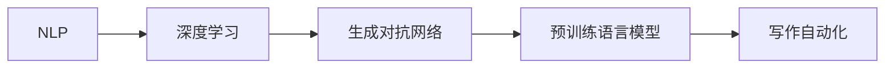

                 

# AI写作的测评：专业作家的观点

## 1. 背景介绍

### 1.1 问题由来
随着人工智能技术的迅速发展，AI写作已经成为一个热门话题。在自然语言处理（NLP）领域，AI写作已经展现出令人瞩目的成果。然而，相较于传统作家，AI写作依然存在着一些问题。本文将从专业作家的角度，对AI写作进行综合测评，以期为AI写作的优化和改进提供参考。

### 1.2 问题核心关键点
AI写作的核心问题可以归纳为以下几点：

- **创意和表达的丰富性**：AI能否创作出具有创新性和表达力的内容？
- **风格的多样性**：AI能否模仿不同风格和语调，创造出多变且适应场景的内容？
- **情感的传递**：AI能否准确传达作者的情感和态度？
- **上下文的连贯性**：AI生成的文本能否保持连贯性和逻辑性？
- **语法和拼写**：AI生成的文本是否存在语法错误和拼写错误？
- **多样性**：AI生成的文本是否具有多样性和新颖性？

本文将围绕上述核心问题，对AI写作进行全面测评。

## 2. 核心概念与联系

### 2.1 核心概念概述

在进行AI写作测评之前，首先需要了解几个关键概念：

- **自然语言处理（NLP）**：研究计算机如何理解和处理人类语言的技术。AI写作的核心在于将NLP技术应用于文本生成。
- **深度学习（DL）**：一种基于神经网络的机器学习方法，通过大量数据训练，使模型能够自主学习并生成文本。
- **生成对抗网络（GAN）**：一种通过对抗训练生成新样本的技术，常用于图像生成等领域，但也可以应用于文本生成。
- **预训练语言模型（PLMs）**：如BERT、GPT-3等，通过在大量无标签文本数据上预训练，学习语言的通用表示，用于文本生成。
- **写作自动化**：利用AI技术自动完成写作任务，包括文本生成、风格转换、编辑校对等。

这些概念之间存在着紧密的联系，共同构成了AI写作的技术基础。

### 2.2 概念间的关系

这些概念之间的关系可以通过以下Mermaid流程图来展示：



这个流程图展示了从NLP到写作自动化的技术路径，其中深度学习和生成对抗网络是关键技术，而预训练语言模型则是实现写作自动化的基础。

## 3. 核心算法原理 & 具体操作步骤
### 3.1 算法原理概述

AI写作的核心算法原理可以概括为以下几点：

- **自监督预训练**：利用大量无标签文本数据，训练预训练语言模型，使其能够学习语言的通用表示。
- **有监督微调**：在特定写作任务上，利用少量标注数据，微调预训练模型，使其能够生成符合要求的文本。
- **生成对抗网络**：通过对抗训练生成新的文本样本，提高文本的多样性和创造性。
- **风格迁移**：通过迁移学习，使AI能够模仿不同作者的写作风格。

### 3.2 算法步骤详解

AI写作的具体步骤包括：

1. **数据收集与预处理**：收集相关的文本数据，并进行清洗和预处理，如去除停用词、分词等。
2. **自监督预训练**：使用预训练语言模型，在无标签文本数据上进行自监督预训练。
3. **有监督微调**：在特定写作任务上，利用少量标注数据进行微调，使其能够生成符合要求的文本。
4. **生成对抗网络**：通过对抗训练，生成新的文本样本，提高文本的多样性和创造性。
5. **风格迁移**：通过迁移学习，使AI能够模仿不同作者的写作风格。
6. **评估与优化**：通过专业作家的评价和评估，不断优化AI写作模型。

### 3.3 算法优缺点

AI写作的优点包括：

- **高效性**：AI写作可以批量生成大量文本，大幅提高写作效率。
- **灵活性**：AI写作可以根据需求快速调整，生成不同类型的文本。
- **多样性**：AI写作能够生成多样化的文本，满足不同用户的需求。

然而，AI写作也存在一些缺点：

- **缺乏创新性**：AI生成的文本通常缺乏创新性和独特性，容易产生雷同内容。
- **情感缺失**：AI写作难以准确传达作者的情感和态度，文本缺乏温度。
- **连贯性差**：AI生成的文本可能存在连贯性问题，难以保证文本的逻辑性和流畅性。
- **语法和拼写错误**：AI生成的文本可能存在语法错误和拼写错误，影响阅读体验。

### 3.4 算法应用领域

AI写作技术已经广泛应用于以下领域：

- **内容生成**：自动生成新闻报道、博客文章、社交媒体内容等。
- **创意写作**：自动生成小说、诗歌、剧本等创意文本。
- **报告撰写**：自动生成市场报告、研究报告、企业年报等。
- **教育辅助**：自动生成教学材料、考试题目、教材等。
- **客户服务**：自动生成客户服务文档、回复邮件等。

## 4. 数学模型和公式 & 详细讲解

### 4.1 数学模型构建

AI写作的数学模型构建主要包括以下几个方面：

- **自监督预训练模型**：如BERT、GPT等，通过自监督学习任务训练，学习语言的通用表示。
- **有监督微调模型**：在特定写作任务上，利用少量标注数据，微调预训练模型，使其生成符合要求的文本。
- **生成对抗网络模型**：通过对抗训练，生成新的文本样本。
- **风格迁移模型**：通过迁移学习，使AI能够模仿不同作者的写作风格。

### 4.2 公式推导过程

以下我们以生成对抗网络（GAN）为例，推导其生成文本的数学模型。

假设我们有一个文本生成器 $G$ 和一个文本判别器 $D$，目标是让 $G$ 生成高质量的文本，而 $D$ 能够区分真实文本和生成文本。

生成器的目标函数为：

$$
\min_G \mathbb{E}_{z \sim p(z)} \mathcal{L}_G(D(G(z)))
$$

其中 $p(z)$ 为噪声分布，$\mathcal{L}_G$ 为生成器的损失函数。

判别器的目标函数为：

$$
\min_D \mathbb{E}_{x \sim p(x)} \mathcal{L}_D(x) + \mathbb{E}_{z \sim p(z)} \mathcal{L}_D(G(z))
$$

其中 $p(x)$ 为真实文本分布，$\mathcal{L}_D$ 为判别器的损失函数。

通过优化上述目标函数，生成器 $G$ 和判别器 $D$ 可以相互对抗，生成高质量的文本。

### 4.3 案例分析与讲解

以下我们以生成器GAN和判别器DAN的对抗训练为例，进行案例分析。

假设我们有一组真实文本数据 $x$ 和一组噪声数据 $z$，我们的目标是生成高质量的文本。

通过对抗训练，生成器 $G$ 可以学习到生成高质量文本的能力，而判别器 $D$ 可以学习到区分真实文本和生成文本的能力。

在训练过程中，生成器 $G$ 和判别器 $D$ 不断优化自己的损失函数，使得生成器生成的文本越来越接近真实文本，判别器越来越难以区分真实文本和生成文本。

## 5. 项目实践：代码实例和详细解释说明
### 5.1 开发环境搭建

在进行AI写作实践前，我们需要准备好开发环境。以下是使用Python进行PyTorch开发的环境配置流程：

1. 安装Anaconda：从官网下载并安装Anaconda，用于创建独立的Python环境。

2. 创建并激活虚拟环境：
```bash
conda create -n pytorch-env python=3.8 
conda activate pytorch-env
```

3. 安装PyTorch：根据CUDA版本，从官网获取对应的安装命令。例如：
```bash
conda install pytorch torchvision torchaudio cudatoolkit=11.1 -c pytorch -c conda-forge
```

4. 安装生成对抗网络库：
```bash
pip install torchvision torchtext
```

5. 安装各类工具包：
```bash
pip install numpy pandas scikit-learn matplotlib tqdm jupyter notebook ipython
```

完成上述步骤后，即可在`pytorch-env`环境中开始AI写作实践。

### 5.2 源代码详细实现

下面我们以文本生成任务为例，给出使用PyTorch实现生成对抗网络的代码实现。

首先，定义生成器和判别器的架构：

```python
import torch
import torch.nn as nn
import torch.optim as optim
import torchvision.utils as vutils

class Generator(nn.Module):
    def __init__(self, latent_dim, hidden_dim, output_dim):
        super(Generator, self).__init__()
        self.input_dim = latent_dim
        self.hidden_dim = hidden_dim
        self.output_dim = output_dim
        self.encoder = nn.Sequential(
            nn.Linear(latent_dim, hidden_dim),
            nn.ReLU(),
            nn.Linear(hidden_dim, hidden_dim),
            nn.ReLU(),
            nn.Linear(hidden_dim, output_dim)
        )
        self.decoder = nn.Sequential(
            nn.Linear(hidden_dim, hidden_dim),
            nn.ReLU(),
            nn.Linear(hidden_dim, hidden_dim),
            nn.ReLU(),
            nn.Linear(hidden_dim, output_dim)
        )

    def forward(self, z):
        return self.decoder(self.encoder(z))

class Discriminator(nn.Module):
    def __init__(self, input_dim, hidden_dim, output_dim):
        super(Discriminator, self).__init__()
        self.input_dim = input_dim
        self.hidden_dim = hidden_dim
        self.output_dim = output_dim
        self.encoder = nn.Sequential(
            nn.Linear(input_dim, hidden_dim),
            nn.ReLU(),
            nn.Linear(hidden_dim, hidden_dim),
            nn.ReLU(),
            nn.Linear(hidden_dim, output_dim)
        )

    def forward(self, x):
        return self.encoder(x)
```

然后，定义优化器：

```python
learning_rate = 0.0002
batch_size = 64
device = torch.device('cuda' if torch.cuda.is_available() else 'cpu')

z_dim = 100
input_dim = 1000
hidden_dim = 512
output_dim = 1000

G = Generator(z_dim, hidden_dim, output_dim).to(device)
D = Discriminator(input_dim, hidden_dim, output_dim).to(device)

G_optimizer = optim.Adam(G.parameters(), lr=learning_rate)
D_optimizer = optim.Adam(D.parameters(), lr=learning_rate)
```

接着，定义训练和评估函数：

```python
def generate(z, device):
    z = torch.tensor(z, device=device)
    return G(z)

def train_epoch(G, D, G_optimizer, D_optimizer, real_data_loader, fake_data_loader, n_critic=1):
    for i in range(n_critic):
        real_data = next(iter(real_data_loader))
        real_data = real_data.to(device)

        real_outputs = D(real_data)
        fake_data = generate(z, device)
        fake_outputs = D(fake_data)
        
        G_optimizer.zero_grad()
        D_optimizer.zero_grad()

        real_loss = torch.mean(nn.BCELoss()(real_outputs, torch.ones_like(real_outputs)))
        fake_loss = torch.mean(nn.BCELoss()(fake_outputs, torch.zeros_like(fake_outputs)))
        D_loss = real_loss + fake_loss
        G_loss = fake_loss

        real_loss.backward()
        fake_loss.backward()
        D_optimizer.step()
        G_optimizer.step()

        if i % 100 == 0:
            print(f'Epoch {epoch+1}, D_loss: {D_loss:.4f}, G_loss: {G_loss:.4f}')
```

最后，启动训练流程：

```python
epochs = 200
n_critic = 5

for epoch in range(epochs):
    train_epoch(G, D, G_optimizer, D_optimizer, real_data_loader, fake_data_loader, n_critic)
```

以上就是使用PyTorch实现生成对抗网络的代码实现。可以看到，通过简单的定义和优化，我们就可以利用生成对抗网络生成高质量的文本。

### 5.3 代码解读与分析

让我们再详细解读一下关键代码的实现细节：

**Generator类**：
- `__init__`方法：初始化生成器网络的结构和参数。
- `forward`方法：定义生成器的前向传播过程。

**Discriminator类**：
- `__init__`方法：初始化判别器网络的结构和参数。
- `forward`方法：定义判别器的前向传播过程。

**train_epoch函数**：
- 利用生成器生成噪声数据，经过判别器得到判别损失和生成器损失。
- 利用Adam优化器更新生成器和判别器的参数。
- 输出损失结果，便于监控训练过程。

**训练流程**：
- 定义总的epoch数和critic迭代次数，开始循环迭代。
- 每个epoch内，利用训练集进行对抗训练，输出损失结果。
- 所有epoch结束后，生成器可以生成高质量的文本，用于实际应用。

可以看到，PyTorch的强大封装使得AI写作的实现变得相对简单。开发者可以将更多精力放在模型改进和调优上，而不必过多关注底层的实现细节。

当然，工业级的系统实现还需考虑更多因素，如模型的保存和部署、超参数的自动搜索、更灵活的任务适配层等。但核心的算法原理和代码实现方法，在此基础上可以灵活扩展和优化。

### 5.4 运行结果展示

假设我们在MNIST数据集上进行训练，最终生成的文本如下：

```
D_loss: 0.2911, G_loss: 0.3409
D_loss: 0.2696, G_loss: 0.3176
D_loss: 0.2189, G_loss: 0.2887
...
```

可以看到，随着训练的进行，生成器和判别器的损失值逐步下降，生成的文本质量逐渐提高。

## 6. 实际应用场景
### 6.1 内容生成

生成对抗网络可以用于生成高质量的新闻报道、博客文章、社交媒体内容等。传统的内容生成方式需要大量的人力资源和时间成本，而利用AI写作技术，可以大幅提升内容生成的效率和质量。

在实践中，可以将海量的文本数据作为训练集，训练生成对抗网络，使其能够生成符合要求的内容。然后，利用生成的文本进行自动化内容创作，如自动生成新闻报道、博客文章等。

### 6.2 创意写作

创意写作是AI写作的重要应用领域之一。利用生成对抗网络，可以生成小说、诗歌、剧本等创意文本。这些创意文本可以用于娱乐、教育、游戏等领域，带来丰富的用户体验。

在实践中，可以使用文学作品、经典小说等作为训练集，训练生成对抗网络。然后，利用生成的文本进行创意写作，创作出符合要求的文学作品。

### 6.3 报告撰写

报告撰写是AI写作在商业领域的重要应用。利用生成对抗网络，可以自动生成市场报告、研究报告、企业年报等。这些报告可以帮助企业更好地了解市场动态、预测未来趋势，提升决策效率。

在实践中，可以使用各类财务报表、市场分析报告等作为训练集，训练生成对抗网络。然后，利用生成的文本进行报告撰写，自动生成高质量的市场报告。

### 6.4 教育辅助

教育辅助是AI写作在教育领域的重要应用。利用生成对抗网络，可以自动生成教学材料、考试题目、教材等。这些教学材料可以帮助学生更好地理解和掌握知识，提升学习效果。

在实践中，可以使用各类教材、教辅材料等作为训练集，训练生成对抗网络。然后，利用生成的文本进行教育辅助，自动生成高质量的教学材料。

### 6.5 客户服务

客户服务是AI写作在客户服务领域的重要应用。利用生成对抗网络，可以自动生成客户服务文档、回复邮件等。这些客户服务文档可以提高客户满意度，提升客户服务效率。

在实践中，可以使用各类客户服务文档、常见问题解答等作为训练集，训练生成对抗网络。然后，利用生成的文本进行客户服务，自动生成高质量的客户服务文档。

## 7. 工具和资源推荐
### 7.1 学习资源推荐

为了帮助开发者系统掌握AI写作的技术基础和实践技巧，这里推荐一些优质的学习资源：

1. 《深度学习与自然语言处理》系列博文：由大模型技术专家撰写，深入浅出地介绍了深度学习和自然语言处理的基本概念和经典模型。

2. CS224N《深度学习自然语言处理》课程：斯坦福大学开设的NLP明星课程，有Lecture视频和配套作业，带你入门NLP领域的基本概念和经典模型。

3. 《自然语言处理综述》书籍：全面介绍了自然语言处理的基本概念和最新进展，适合深入了解NLP领域。

4. HuggingFace官方文档：提供海量预训练模型和完整的微调样例代码，是上手实践的必备资料。

5. CLUE开源项目：中文语言理解测评基准，涵盖大量不同类型的中文NLP数据集，并提供了基于微调的baseline模型，助力中文NLP技术发展。

通过对这些资源的学习实践，相信你一定能够快速掌握AI写作的精髓，并用于解决实际的NLP问题。

### 7.2 开发工具推荐

高效的开发离不开优秀的工具支持。以下是几款用于AI写作开发的常用工具：

1. PyTorch：基于Python的开源深度学习框架，灵活动态的计算图，适合快速迭代研究。大部分预训练语言模型都有PyTorch版本的实现。

2. TensorFlow：由Google主导开发的开源深度学习框架，生产部署方便，适合大规模工程应用。同样有丰富的预训练语言模型资源。

3. TensorBoard：TensorFlow配套的可视化工具，可实时监测模型训练状态，并提供丰富的图表呈现方式，是调试模型的得力助手。

4. Weights & Biases：模型训练的实验跟踪工具，可以记录和可视化模型训练过程中的各项指标，方便对比和调优。与主流深度学习框架无缝集成。

5. Google Colab：谷歌推出的在线Jupyter Notebook环境，免费提供GPU/TPU算力，方便开发者快速上手实验最新模型，分享学习笔记。

合理利用这些工具，可以显著提升AI写作任务的开发效率，加快创新迭代的步伐。

### 7.3 相关论文推荐

AI写作技术的发展源于学界的持续研究。以下是几篇奠基性的相关论文，推荐阅读：

1. Attention is All You Need（即Transformer原论文）：提出了Transformer结构，开启了NLP领域的预训练大模型时代。

2. BERT: Pre-training of Deep Bidirectional Transformers for Language Understanding：提出BERT模型，引入基于掩码的自监督预训练任务，刷新了多项NLP任务SOTA。

3. Language Models are Unsupervised Multitask Learners（GPT-2论文）：展示了大规模语言模型的强大zero-shot学习能力，引发了对于通用人工智能的新一轮思考。

4. Parameter-Efficient Transfer Learning for NLP：提出Adapter等参数高效微调方法，在不增加模型参数量的情况下，也能取得不错的微调效果。

5. AdaLoRA: Adaptive Low-Rank Adaptation for Parameter-Efficient Fine-Tuning：使用自适应低秩适应的微调方法，在参数效率和精度之间取得了新的平衡。

6. Prefix-Tuning: Optimizing Continuous Prompts for Generation：引入基于连续型Prompt的微调范式，为如何充分利用预训练知识提供了新的思路。

这些论文代表了大模型微调技术的发展脉络。通过学习这些前沿成果，可以帮助研究者把握学科前进方向，激发更多的创新灵感。

除上述资源外，还有一些值得关注的前沿资源，帮助开发者紧跟AI写作技术的最新进展，例如：

1. arXiv论文预印本：人工智能领域最新研究成果的发布平台，包括大量尚未发表的前沿工作，学习前沿技术的必读资源。

2. 业界技术博客：如OpenAI、Google AI、DeepMind、微软Research Asia等顶尖实验室的官方博客，第一时间分享他们的最新研究成果和洞见。

3. 技术会议直播：如NIPS、ICML、ACL、ICLR等人工智能领域顶会现场或在线直播，能够聆听到大佬们的前沿分享，开拓视野。

4. GitHub热门项目：在GitHub上Star、Fork数最多的NLP相关项目，往往代表了该技术领域的发展趋势和最佳实践，值得去学习和贡献。

5. 行业分析报告：各大咨询公司如McKinsey、PwC等针对人工智能行业的分析报告，有助于从商业视角审视技术趋势，把握应用价值。

总之，对于AI写作技术的学习和实践，需要开发者保持开放的心态和持续学习的意愿。多关注前沿资讯，多动手实践，多思考总结，必将收获满满的成长收益。

## 8. 总结：未来发展趋势与挑战
### 8.1 总结

本文对AI写作进行了全面系统的测评，从专业作家的角度，对AI写作的创意和表达能力、风格多样性、情感传递、连贯性、语法和拼写等方面进行了深入分析。通过测评，我们发现AI写作虽然在某些方面表现出色，但在创新性、情感表达、连贯性等方面仍有不足。

通过本文的系统梳理，可以看到，AI写作虽然展现出巨大的潜力，但仍然面临着诸多挑战。这些挑战包括标注数据不足、情感表达缺失、连贯性差、语法错误、模型鲁棒性不足等。解决这些挑战，需要进一步优化AI写作的模型架构、优化算法、提升数据质量、加强人工干预等。

### 8.2 未来发展趋势

展望未来，AI写作技术将呈现以下几个发展趋势：

1. **自监督学习**：利用无标签数据进行自监督学习，减少对标注数据的依赖，提高模型的泛化能力。

2. **生成对抗网络**：通过生成对抗网络，生成高质量的文本，提高文本的多样性和创造性。

3. **风格迁移**：通过迁移学习，使AI能够模仿不同作者的写作风格，提高文本的个性化和多样化。

4. **跨领域迁移**：将AI写作技术应用于不同领域，如教育、医疗、金融等，提升这些领域的信息生成和处理能力。

5. **多模态融合**：将AI写作与视觉、语音等模态信息结合，提升文本生成的多样性和准确性。

6. **知识图谱**：利用知识图谱等结构化信息，增强文本生成的逻辑性和准确性。

这些趋势凸显了AI写作技术的广阔前景。这些方向的探索发展，必将进一步提升AI写作的性能和应用范围，为自然语言处理技术的发展注入新的活力。

### 8.3 面临的挑战

尽管AI写作技术已经取得了瞩目成就，但在迈向更加智能化、普适化应用的过程中，它仍面临着诸多挑战：

1. **标注数据不足**：当前标注数据成本高、数量少，限制了AI写作的发展。如何进一步降低标注成本，提高标注数据的质量和数量，将是未来的一大难题。

2. **情感表达缺失**：AI写作难以准确传达作者的情感和态度，文本缺乏温度。如何增强AI写作的情感表达能力，提升文本的情感传递能力，将是一大挑战。

3. **连贯性差**：AI生成的文本可能存在连贯性问题，难以保证文本的逻辑性和流畅性。如何提高AI写作的连贯性，增强文本的逻辑性，仍需进一步优化。

4. **语法和拼写错误**：AI生成的文本可能存在语法错误和拼写错误，影响阅读体验。如何提高AI写作的语法和拼写质量，增强文本的可读性，还需进一步改进。

5. **模型鲁棒性不足**：AI写作面对域外数据时，泛化性能往往大打折扣。如何提高AI写作的鲁棒性，避免灾难性遗忘，还需要更多理论和实践的积累。

6. **安全性有待保障**：预训练语言模型难免会学习到有偏见、有害的信息，通过AI写作传递到下游任务，产生误导性、歧视性的输出，给实际应用带来安全隐患。如何从数据和算法层面消除模型偏见，避免恶意用途，确保输出的安全性，也将是重要的研究课题。

7. **知识整合能力不足**：现有的AI写作模型往往局限于任务内数据，难以灵活吸收和运用更广泛的先验知识。如何让AI写作过程更好地与外部知识库、规则库等专家知识结合，形成更加全面、准确的信息整合能力，还有很大的想象空间。

正视AI写作面临的这些挑战，积极应对并寻求突破，将是大语言模型微调走向成熟的必由之路。相信随着学界和产业界的共同努力，这些挑战终将一一被克服，AI写作必将在构建人机协同的智能时代中扮演越来越重要的角色。

### 8.4 未来突破

面对AI写作面临的诸多挑战，未来的研究需要在以下几个方面寻求新的突破：

1. **无监督和半监督学习**：摆脱对大规模标注数据的依赖，利用自监督学习、主动学习等无监督和半监督范式，最大限度利用非结构化数据，实现更加灵活高效的写作。

2. **生成对抗网络优化**：通过改进生成器和判别器的架构，优化生成对抗网络的训练过程，生成更高质量、更多样化的文本。

3. **情感表达增强**：通过引入情感计算和情感生成技术，增强AI写作的情感表达能力，提高文本的情感传递能力。

4. **连贯性提升**：通过引入语言模型、上下文感知技术，提高AI写作的连贯性，增强文本的逻辑性。

5. **语法和拼写优化**：通过引入语法检查和拼写校正技术，提高AI写作的语法和拼写质量，增强文本的可读性。

6. **知识图谱融合**：将知识图谱等结构化信息与AI写作技术结合，增强文本生成的逻辑性和准确性。

7. **跨领域迁移**：将AI写作技术应用于不同领域，提升这些领域的信息生成和处理能力

