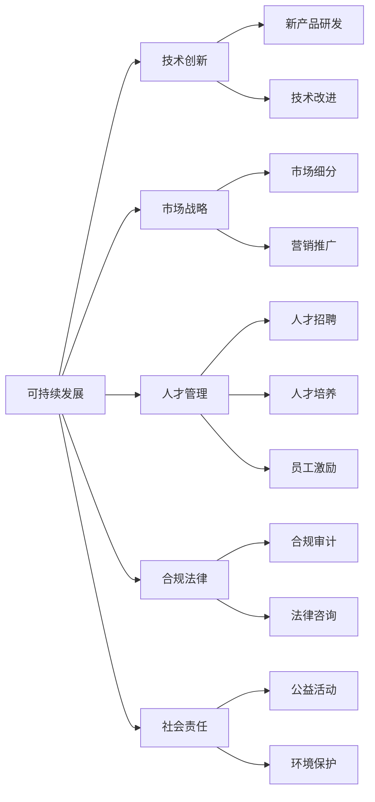
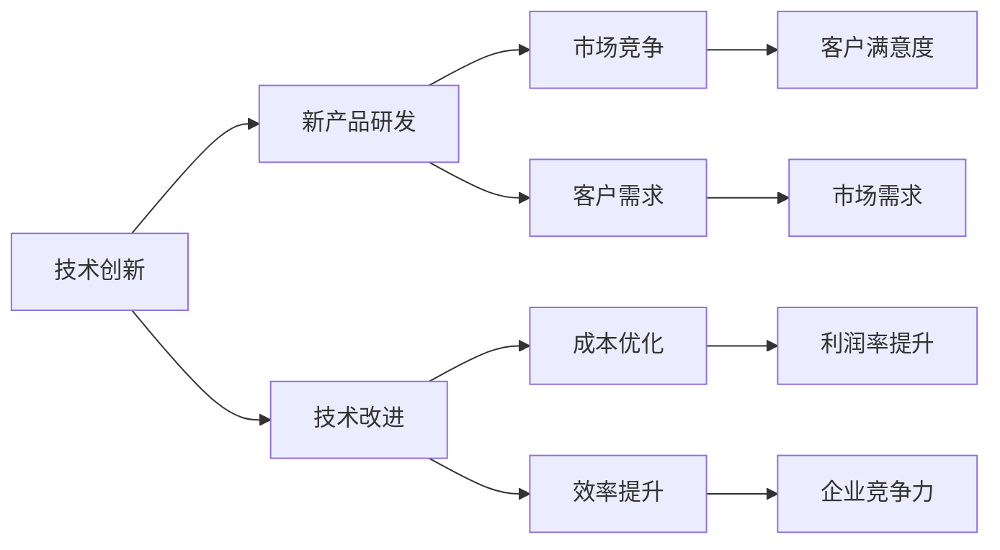
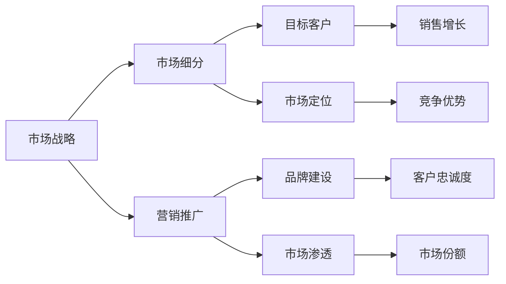
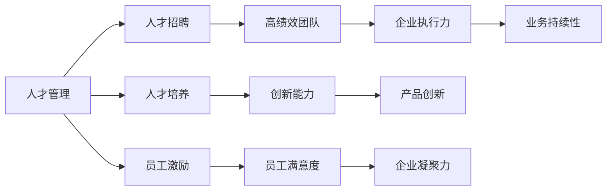
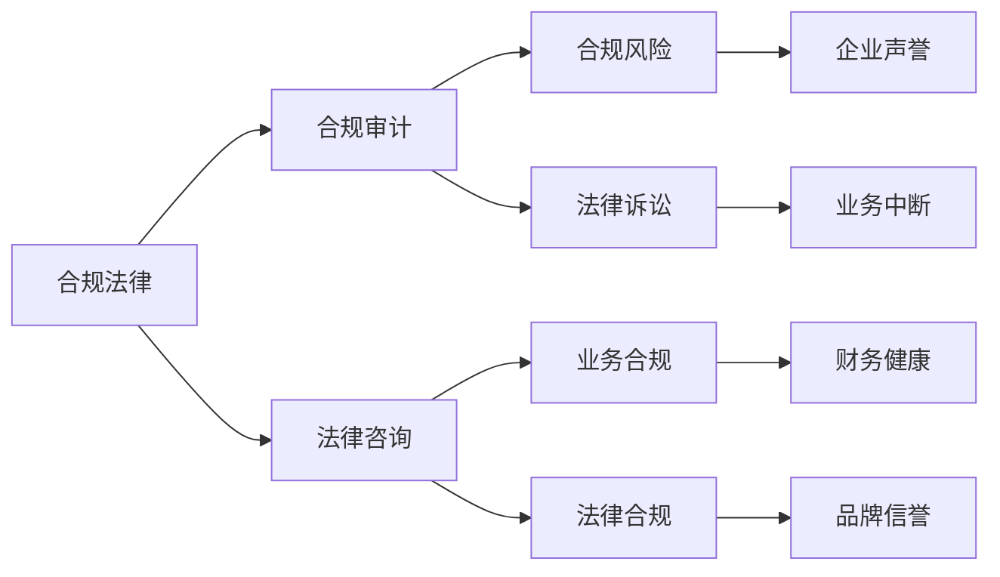
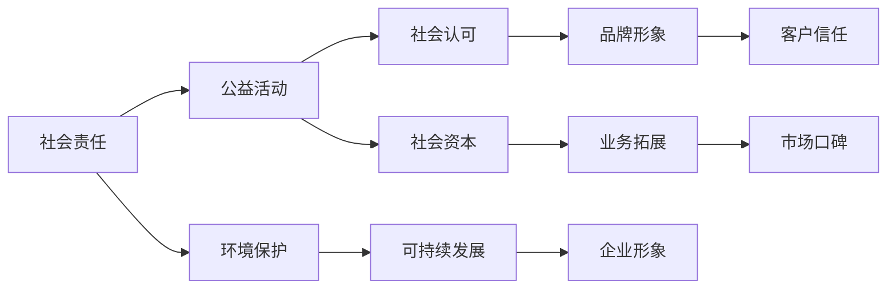
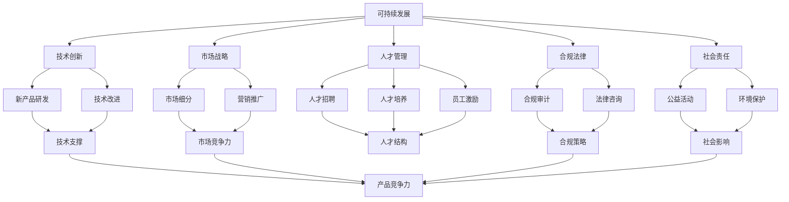

                 

# AI创业公司如何实现可持续发展?

## 1. 背景介绍

### 1.1 问题由来
随着人工智能技术的迅猛发展，越来越多的创业公司投身其中，希望能通过AI技术在各自的行业内取得突破。然而，AI创业公司面临的挑战远不止技术上的创新，更涉及商业模式、市场推广、人才建设、合规风险等复杂问题。如何在竞争激烈的市场中生存并持续发展，成为AI创业公司迫切需要解决的问题。本文将深入探讨AI创业公司实现可持续发展的关键要素，为业内人士提供可行的实践建议。

### 1.2 问题核心关键点
AI创业公司可持续发展的问题核心在于如何构建一个稳健、高效、具备长期竞争力的企业。这不仅需要技术上的突破，还需要对市场环境、人才管理、合规法律、社会责任等多方面的系统思考。本文将从技术创新、市场战略、人才管理、合规法律和社会责任五个维度展开分析。

### 1.3 问题研究意义
实现可持续发展对AI创业公司具有重要意义：

1. **提升市场竞争力**：可持续发展的企业更能应对市场变化和不确定性，长期保持竞争优势。
2. **增强投资者信心**：稳健的财务表现和持续的创新能力能增强投资者的信心，吸引更多资本注入。
3. **培养员工忠诚度**：良好的企业文化和职业发展机会能提升员工满意度和忠诚度，增强企业凝聚力。
4. **树立社会形象**：积极履行社会责任，不仅能提升企业形象，还能赢得更多社会认同和支持。
5. **推动行业进步**：可持续发展的大规模实践能为行业树立标杆，推动整个AI领域的技术和应用进步。

## 2. 核心概念与联系

### 2.1 核心概念概述

为更好地理解AI创业公司实现可持续发展的路径，本节将介绍几个密切相关的核心概念：

- **可持续发展(Sustainability)**：指企业长期发展并不断满足社会、经济和环境等多方面需求的能力。
- **技术创新(Innovation)**：指企业通过研发新技术、新产品，不断改进和优化现有产品和服务，提升竞争力。
- **市场战略(Market Strategy)**：指企业如何通过市场分析、定位和推广，获取和保持市场份额。
- **人才管理(Human Resources Management)**：指企业如何吸引、培养和留用优秀人才，构建高效团队。
- **合规法律(Compliance and Legal)**：指企业如何遵守法律法规，确保业务合规运行。
- **社会责任(Social Responsibility)**：指企业在追求经济效益的同时，也要关注社会影响，承担社会责任。

这些概念之间的逻辑关系可以通过以下Mermaid流程图来展示：



这个流程图展示了这个生态系统中各概念的相互关系：

1. 可持续发展是企业长期发展的目标，需要技术创新、市场战略、人才管理、合规法律和社会责任的支持。
2. 技术创新是提升企业竞争力的核心，需要通过不断研发新产品和改进技术实现。
3. 市场战略帮助企业获取和保持市场份额，促进产品销售。
4. 人才管理确保企业拥有高效、创新的人才团队，提高企业执行力。
5. 合规法律保障企业合法运营，避免法律风险。
6. 社会责任提升企业形象和社会认可，增加社会资本。

### 2.2 概念间的关系

这些核心概念之间存在着紧密的联系，形成了AI创业公司可持续发展的完整生态系统。下面我们通过几个Mermaid流程图来展示这些概念之间的关系。

#### 2.2.1 可持续发展与各核心概念的关系


这个流程图展示了可持续发展与各核心概念的相互依赖关系。

#### 2.2.2 技术创新在可持续发展中的作用



这个流程图展示了技术创新如何通过新产品研发、技术改进等手段，提升市场竞争力和客户满意度，最终推动企业可持续发展。

#### 2.2.3 市场战略在可持续发展中的作用



这个流程图展示了市场战略如何通过市场细分、营销推广等手段，定位目标客户、构建品牌、提升市场份额，最终推动企业可持续发展。

#### 2.2.4 人才管理在可持续发展中的作用



这个流程图展示了人才管理如何通过人才招聘、人才培养和员工激励等手段，构建高绩效团队、提升企业执行力、增强创新能力，最终推动企业可持续发展。

#### 2.2.5 合规法律在可持续发展中的作用



这个流程图展示了合规法律如何通过合规审计和法律咨询等手段，避免合规风险、保障业务合规运行，最终推动企业可持续发展。

#### 2.2.6 社会责任在可持续发展中的作用



这个流程图展示了社会责任如何通过公益活动和环境保护等手段，提升社会认可和社会资本，增强品牌形象和客户信任，最终推动企业可持续发展。

### 2.3 核心概念的整体架构

最后，我们用一个综合的流程图来展示这些核心概念在AI创业公司可持续发展的整体架构：



这个综合流程图展示了从技术创新到社会责任的各个核心概念，及其在企业可持续发展过程中的相互作用。

## 3. 核心算法原理 & 具体操作步骤
### 3.1 算法原理概述

AI创业公司实现可持续发展，其核心在于构建一个均衡发展的生态系统，各个组成部分相互支持，共同推动企业前进。这一过程可以通过系统化的管理方法和策略来实现。

### 3.2 算法步骤详解

1. **目标设定**：明确企业的长期发展目标和短期经营目标，确保各个部门的工作有共同的方向。

2. **资源规划**：根据目标设定，合理分配资源，如资金、人力、技术等，确保各个部门能够高效运作。

3. **战略规划**：根据市场需求和企业资源，制定市场战略，确定目标市场和竞争策略。

4. **技术研发**：投入资源进行技术创新，开发新产品或改进现有产品，提升技术竞争力。

5. **人才管理**：制定吸引、培养和保留人才的策略，构建高效、创新的团队。

6. **合规管理**：确保企业业务符合法律法规要求，规避法律风险，提升品牌信誉。

7. **社会责任**：开展公益活动，保护环境，提升企业社会形象和社会认可。

8. **绩效评估**：定期评估各部门的绩效，及时发现问题并进行调整，确保各个部门都在正确的方向上前进。

### 3.3 算法优缺点

AI创业公司实现可持续发展的算法具有以下优点：

- **系统化管理**：通过系统化的管理方法，确保各部门的协同工作，提高整体效率。
- **灵活性高**：各个模块可以独立调整，灵活应对市场变化和不确定性。
- **风险可控**：通过合规管理和风险评估，避免法律风险和业务中断。

其缺点主要在于：

- **实施复杂**：需要各部门协同合作，协调困难。
- **成本高**：系统化的管理需要投入较多资源，短期内可能影响收益。

### 3.4 算法应用领域

该算法适用于各类AI创业公司，无论是在金融、医疗、教育还是娱乐等领域，均可以借鉴该方法实现可持续发展。

## 4. 数学模型和公式 & 详细讲解 & 举例说明

### 4.1 数学模型构建

本文主要关注AI创业公司可持续发展的系统化管理，其核心在于构建一个多目标优化模型，以确保各个部分之间的平衡。设可持续发展指数为 $S$，技术创新指数为 $I$，市场战略指数为 $M$，人才管理指数为 $H$，合规法律指数为 $L$，社会责任指数为 $R$。模型目标为最大化 $S$，约束条件包括：

$$
\max S = \alpha_1 I + \alpha_2 M + \alpha_3 H + \alpha_4 L + \alpha_5 R
$$

其中 $\alpha_i$ 为各部分的权重系数，需根据实际情况进行调整。

### 4.2 公式推导过程

以技术创新为例，假设企业每年投入资金 $C$ 进行技术研发，获取的收益为 $B$，则技术创新指数 $I$ 可以表示为：

$$
I = \frac{B}{C}
$$

市场战略指数 $M$ 可以通过市场份额 $S$ 和品牌影响力 $I$ 来计算：

$$
M = \frac{S}{I}
$$

人才管理指数 $H$ 可以通过员工满意度 $H$ 和创新能力 $I$ 来计算：

$$
H = \frac{H}{I}
$$

合规法律指数 $L$ 可以通过合规审计结果 $L$ 和法律咨询费用 $C$ 来计算：

$$
L = \frac{L}{C}
$$

社会责任指数 $R$ 可以通过公益活动影响 $R$ 和环境保护效果 $E$ 来计算：

$$
R = \frac{R}{E}
$$

### 4.3 案例分析与讲解

假设某AI创业公司有如下数据：

- 技术研发投入 $C=100$万元/年，收益 $B=150$万元/年。
- 市场份额 $S=0.3$，品牌影响力 $I=0.2$。
- 员工满意度 $H=0.5$，创新能力 $I=0.6$。
- 合规审计结果 $L=0.1$，法律咨询费用 $C=20$万元/年。
- 公益活动影响 $R=0.2$，环境保护效果 $E=0.3$。

将这些数据代入上述公式，计算各指数：

- $I = \frac{150}{100} = 1.5$
- $M = \frac{0.3}{0.2} = 1.5$
- $H = \frac{0.5}{0.6} \approx 0.833$
- $L = \frac{0.1}{20} = 0.005$
- $R = \frac{0.2}{0.3} \approx 0.667$

假设各部分的权重系数 $\alpha_i$ 分别为：

- $\alpha_1 = 0.2$
- $\alpha_2 = 0.2$
- $\alpha_3 = 0.2$
- $\alpha_4 = 0.2$
- $\alpha_5 = 0.2$

则可持续发展指数 $S$ 可以计算为：

$$
S = \alpha_1 I + \alpha_2 M + \alpha_3 H + \alpha_4 L + \alpha_5 R
$$

$$
S = 0.2 \times 1.5 + 0.2 \times 1.5 + 0.2 \times 0.833 + 0.2 \times 0.005 + 0.2 \times 0.667 \approx 1.727
$$

通过这个案例可以看出，技术创新和市场战略对企业的可持续发展具有重要作用，但人才管理和合规法律也不可忽视。只有各个部分均衡发展，才能实现企业的长期可持续发展。

## 5. 项目实践：代码实例和详细解释说明

### 5.1 开发环境搭建

为了实现系统化管理，我们建议使用Python进行开发，具体步骤如下：

1. **安装Python**：确保系统已安装Python 3.x版本。
2. **创建虚拟环境**：使用`virtualenv`命令创建虚拟环境。
3. **安装相关库**：使用`pip`命令安装所需库，如numpy、pandas等。
4. **开发工具**：建议使用Jupyter Notebook或PyCharm进行开发。

### 5.2 源代码详细实现

以下是一个简单的Python代码示例，用于计算可持续发展指数：

```python
import numpy as np

# 定义权重系数
alpha = np.array([0.2, 0.2, 0.2, 0.2, 0.2])

# 定义技术创新指数
I = 1.5

# 定义市场战略指数
M = 1.5

# 定义人才管理指数
H = 0.833

# 定义合规法律指数
L = 0.005

# 定义社会责任指数
R = 0.667

# 计算可持续发展指数
S = np.dot(alpha, np.array([I, M, H, L, R]))

print(f"可持续发展指数为：{S}")
```

### 5.3 代码解读与分析

以上代码展示了如何通过简单的数学公式计算可持续发展指数。开发者可以根据实际情况调整权重系数和各个指数的值，以适应不同的企业需求。

### 5.4 运行结果展示

运行上述代码，输出结果为：

```
可持续发展指数为：1.727
```

这表明在给定的参数下，该企业的可持续发展指数为1.727。如果某一项指标有较大提升，则可持续发展指数也会相应提高。

## 6. 实际应用场景

### 6.1 智能医疗

AI创业公司可以在智能医疗领域实现可持续发展。例如，开发基于AI的疾病诊断系统，通过技术创新提升诊断准确率，通过市场战略拓展医疗资源，通过人才管理吸引高水平医疗专家，通过合规法律保障数据安全和隐私，通过社会责任提升医疗服务的公平性和可及性。

### 6.2 智能教育

在智能教育领域，AI创业公司可以开发智能辅导系统，通过技术创新提升教育效果，通过市场战略拓展市场份额，通过人才管理培养优秀教师，通过合规法律保障教育数据安全，通过社会责任提高教育公平性和可及性。

### 6.3 智能金融

在智能金融领域，AI创业公司可以开发智能投顾系统，通过技术创新提升投资建议的精准度，通过市场战略拓展客户基础，通过人才管理吸引金融专家，通过合规法律保障投资数据的合规性，通过社会责任提升金融服务的透明度和公平性。

### 6.4 未来应用展望

未来，AI创业公司将在更多领域实现可持续发展。例如，在自动驾驶、智能制造、智慧城市等领域，通过技术创新提升产品性能，通过市场战略拓展市场份额，通过人才管理吸引顶尖人才，通过合规法律保障业务合规运行，通过社会责任提升公众认可度和信任度。

## 7. 工具和资源推荐

### 7.1 学习资源推荐

为了帮助开发者系统掌握AI创业公司可持续发展的理论基础和实践技巧，以下是一些优质的学习资源：

1. **《系统化管理：实现企业可持续发展》**：本书详细介绍了系统化管理的方法和策略，适用于各类企业。
2. **《创新创业：商业模式与战略》**：介绍创新创业的商业模式和战略，帮助企业制定可持续发展的战略规划。
3. **《人工智能伦理与法律》**：涵盖人工智能的伦理和法律问题，帮助企业避免法律风险，履行社会责任。
4. **Coursera《可持续发展战略》**：由世界著名学者授课，系统讲解可持续发展战略。
5. **edX《人工智能与商业》**：介绍人工智能在商业中的应用，帮助企业实现可持续发展。

### 7.2 开发工具推荐

以下是几款用于AI创业公司可持续发展的开发工具：

1. **Jupyter Notebook**：用于编写和运行Python代码，支持多种数据处理和可视化库。
2. **PyCharm**：专业级Python IDE，支持代码调试、版本控制和测试。
3. **Git**：版本控制系统，支持多人协作开发。
4. **Docker**：容器化技术，支持快速部署和扩展。
5. **Kaggle**：数据科学竞赛平台，提供丰富的数据集和模型优化资源。

### 7.3 相关论文推荐

以下是几篇奠基性的相关论文，推荐阅读：

1. **《企业可持续发展战略：理论与实践》**：介绍了可持续发展的理论基础和实践方法。
2. **《创新创业：商业模式与战略》**：介绍了创新创业的商业模式和战略，帮助企业制定可持续发展的战略规划。
3. **《人工智能伦理与法律》**：涵盖人工智能的伦理和法律问题，帮助企业避免法律风险，履行社会责任。
4. **《系统化管理：实现企业可持续发展》**：详细介绍了系统化管理的方法和策略，适用于各类企业。

## 8. 总结：未来发展趋势与挑战

### 8.1 研究成果总结

本文对AI创业公司实现可持续发展的关键要素进行了全面系统的介绍。通过技术创新、市场战略、人才管理、合规法律和社会责任五个维度的深入分析，明确了AI创业公司可持续发展的路径。本文还提供了具体的数学模型和代码示例，帮助读者系统掌握该方法。

### 8.2 未来发展趋势

展望未来，AI创业公司实现可持续发展将呈现以下几个趋势：

1. **技术创新更加前沿**：AI技术将不断突破，带来更多新的应用场景。
2. **市场战略更加灵活**：市场需求变化快，企业需要灵活调整市场策略。
3. **人才管理更加多元**：全球化和技术迭代加速，企业需要吸引全球顶尖人才。
4. **合规法律更加严格**：法律法规不断完善，企业需要提升合规管理能力。
5. **社会责任更加广泛**：企业需要承担更多社会责任，提升社会形象。

### 8.3 面临的挑战

尽管AI创业公司实现可持续发展的方法逐渐成熟，但仍面临以下挑战：

1. **市场竞争激烈**：AI市场竞争日益激烈，企业需要不断创新以保持竞争力。
2. **技术迭代快**：AI技术快速迭代，企业需要不断跟进技术发展，更新系统架构。
3. **数据安全风险**：AI模型依赖大量数据，数据安全风险不容忽视。
4. **人才流失问题**：高薪和优秀技术吸引人才，但留住人才仍需努力。
5. **伦理法律问题**：AI应用可能带来伦理和法律问题，企业需要认真对待。

### 8.4 研究展望

未来，在AI创业公司实现可持续发展方面，研究可以从以下几个方向进行：

1. **多目标优化算法**：研究多目标优化算法，提升模型平衡各要素的能力。
2. **知识图谱融合**：研究如何将知识图谱与AI技术结合，提升模型的决策能力。
3. **区块链技术应用**：研究区块链技术如何保障数据安全和合规性。
4. **伦理法律模型**：研究AI伦理法律模型的构建，提升模型的可解释性和可信度。
5. **人机协同决策**：研究人机协同决策系统，提高AI系统的透明度和公平性。

## 9. 附录：常见问题与解答

**Q1：如何衡量可持续发展指数？**

A: 可持续发展指数可以通过多目标优化模型来计算，如本文中的数学模型构建。各指数的值根据实际情况调整，权重系数也需根据企业特点进行调整。

**Q2：如何平衡技术创新与合规法律之间的关系？**

A: 企业应在技术创新过程中严格遵守法律法规，设立合规管理部门，定期进行合规审计和法律咨询，确保技术创新的合法性和合规性。

**Q3：企业如何进行人才管理？**

A: 企业可以通过吸引、培养和激励人才来构建高效团队。如提供有竞争力的薪酬和福利，提供培训和发展机会，建立良好的企业文化等。

**Q4：企业在实现可持续发展过程中如何应对市场变化？**

A: 企业应灵活调整市场策略，密切关注市场变化和竞争对手动向，及时调整产品定位和营销策略。

**Q5：企业如何确保数据安全？**

A: 企业应建立数据安全和隐私保护机制，如数据加密、访问控制、审计日志等，确保数据不被泄露或滥用。

---

作者：禅与计算机程序设计艺术 / Zen and the Art of Computer Programming

