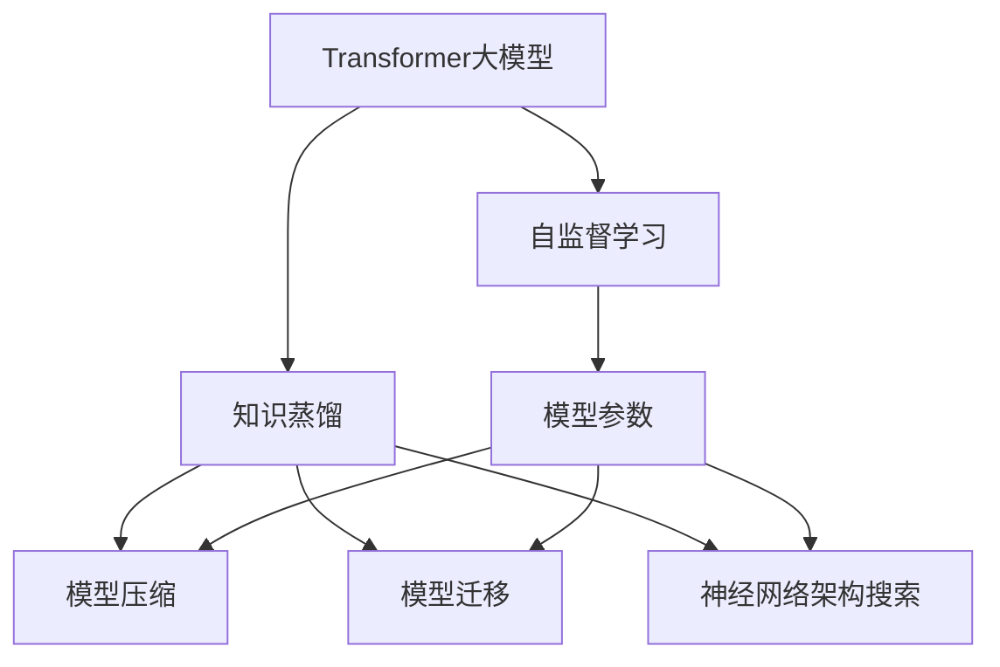

                 

# Transformer大模型实战 知识蒸馏简介

> 关键词：Transformer, 知识蒸馏, 自监督学习, 知识迁移, 模型压缩, 模型效率

## 1. 背景介绍

### 1.1 问题由来

随着深度学习技术的快速发展，Transformer大模型在自然语言处理（NLP）领域取得了显著的进展。Transformer模型以其自回归结构，能够在大规模无标签文本数据上进行预训练，学习到丰富的语言表示。然而，在大规模预训练后，模型的参数量往往高达几亿甚至数十亿，导致推理效率低下，存储和计算资源消耗巨大，使得模型的实际应用受到限制。

### 1.2 问题核心关键点

为了提升Transformer大模型的应用效率，研究者提出了多种压缩和迁移学习方法，其中知识蒸馏（Knowledge Distillation）技术备受关注。知识蒸馏通过将知识从教师模型（Teacher Model）迁移到学生模型（Student Model），在保留模型性能的同时大幅减小模型参数规模，从而提升模型推理效率和资源利用率。

## 2. 核心概念与联系

### 2.1 核心概念概述

为更好地理解知识蒸馏在大模型中的应用，本节将介绍几个密切相关的核心概念：

- **Transformer大模型**：以自回归结构为核心的预训练语言模型，通过在大规模无标签文本数据上进行自监督学习，学习到复杂的语言表示。

- **知识蒸馏**：一种将知识从教师模型迁移到学生模型的方法，通过训练学生模型以匹配教师模型的预测结果，从而获得教师模型的知识和经验。

- **自监督学习**：一种无需标注数据，通过模型自身的预测能力和数据自身的信息进行模型训练的方法。

- **模型压缩**：通过剪枝、量化、蒸馏等技术，减小模型参数规模，提升模型推理效率和资源利用率。

- **模型迁移**：将在大规模数据上训练得到的知识，迁移到更小的模型或新任务上，以提高模型的泛化能力和适应性。

- **神经网络架构搜索**：通过算法自动搜索合适的模型架构，提高模型的计算效率和性能。

这些核心概念之间的逻辑关系可以通过以下Mermaid流程图来展示：



这个流程图展示了大模型的核心概念及其之间的关系：

1. 大模型通过自监督学习获得基础能力。
2. 知识蒸馏通过迁移和压缩技术，减小模型规模，提升推理效率。
3. 神经网络架构搜索通过搜索最优架构，进一步提升模型性能。

## 3. 核心算法原理 & 具体操作步骤

### 3.1 算法原理概述

知识蒸馏的核心理念是通过训练学生模型以匹配教师模型的输出，从而将教师模型的知识迁移到学生模型中。具体来说，知识蒸馏分为两个阶段：知识提取和知识蒸馏。

**知识提取**阶段，教师模型在无标签数据上预训练，学习到丰富的语言表示。然后通过在标注数据上进行有监督训练，生成关于每个样本的预测分布。

**知识蒸馏**阶段，构建学生模型，通过最小化学生模型的预测与教师模型的预测分布之间的差异，从而将教师模型的知识迁移到学生模型中。

### 3.2 算法步骤详解

知识蒸馏在大模型中的应用步骤主要包括以下几个方面：

**Step 1: 准备预训练模型和数据集**
- 选择合适的Transformer大模型作为初始化参数，如BERT、GPT等。
- 准备预训练模型的教师模型和学生模型的数据集，通常教师模型为预训练模型，学生模型为微调后的模型。

**Step 2: 设计知识蒸馏任务**
- 确定教师模型的输出形式（如概率分布、logits）和学生模型的输出形式（如softmax概率分布）。
- 设计损失函数，如KL散度、最大对数似然等，用于衡量学生模型的预测与教师模型的预测分布之间的差异。

**Step 3: 设置蒸馏超参数**
- 选择合适的优化器及其参数，如Adam、SGD等，设置学习率、批大小、迭代轮数等。
- 设置蒸馏超参数，如教师模型与学生模型的权重、蒸馏温度等。

**Step 4: 执行知识蒸馏**
- 将教师模型和学生模型分别加载到GPU/TPU等设备上。
- 通过反向传播计算学生模型参数的梯度，更新学生模型参数。
- 周期性在验证集上评估学生模型的性能，根据性能指标决定是否触发Early Stopping。
- 重复上述步骤直到满足预设的迭代轮数或Early Stopping条件。

**Step 5: 测试和部署**
- 在测试集上评估蒸馏后的学生模型，对比蒸馏前后的精度提升。
- 使用蒸馏后的模型进行推理预测，集成到实际的应用系统中。

以上是知识蒸馏在大模型中的应用步骤。在实际应用中，还需要根据具体任务和模型特点，对知识蒸馏过程的各个环节进行优化设计，如改进损失函数、引入更多的正则化技术、搜索最优的超参数组合等，以进一步提升蒸馏效果。

### 3.3 算法优缺点

知识蒸馏技术具有以下优点：
1. 参数高效：通过将教师模型的知识迁移到学生模型中，学生模型的参数规模可以大幅减小，推理效率提升。
2. 适应性强：知识蒸馏可以应用于多种任务和模型架构，灵活性高。
3. 泛化能力强：教师模型通常在大规模无标签数据上进行预训练，学生模型在少量有标签数据上进行微调，具有较强的泛化能力。

同时，该技术也存在一些局限性：
1. 教师模型要求较高：教师模型必须足够强大，否则无法传递有效的知识。
2. 蒸馏过程复杂：知识蒸馏需要设计合适的蒸馏任务和损失函数，且对超参数的调优依赖较高。
3. 泛化风险：如果教师模型和学生模型的差异过大，蒸馏效果可能不佳，学生模型可能过拟合教师模型的特定噪声。
4. 计算成本高：知识蒸馏通常需要大量的计算资源和时间，尤其是在大规模模型上的应用。

尽管存在这些局限性，但知识蒸馏仍然是大模型压缩和迁移学习的重要方法之一，广泛应用于模型压缩、模型迁移、模型集成等领域。

### 3.4 算法应用领域

知识蒸馏技术在NLP领域的应用广泛，以下是几个典型的应用场景：

- **模型压缩**：通过知识蒸馏将大规模模型压缩为更小的模型，减少计算资源和存储开销。例如，使用知识蒸馏将BERT压缩到BiLM等更小的模型中，提升推理速度。

- **模型迁移**：将教师模型在特定任务上训练的知识迁移到学生模型中，提升学生模型在新任务上的性能。例如，将大规模语言模型（如GPT）的知识迁移到特定领域的语言模型中，提升其在特定领域的应用效果。

- **模型集成**：通过知识蒸馏将多个模型的知识集成到一个模型中，提升模型的综合性能。例如，将多个模型的预测结果进行加权融合，提升模型的泛化能力和鲁棒性。

## 4. 数学模型和公式 & 详细讲解  
### 4.1 数学模型构建

本节将使用数学语言对知识蒸馏过程进行更加严格的刻画。

记教师模型为 $T_{\theta_t}$，学生模型为 $S_{\theta_s}$，其中 $\theta_t$ 为教师模型参数，$\theta_s$ 为学生模型参数。设教师模型在数据样本 $(x_i, y_i)$ 上的输出为 $\hat{y}_t = T_{\theta_t}(x_i)$，学生模型在数据样本 $(x_i, y_i)$ 上的输出为 $\hat{y}_s = S_{\theta_s}(x_i)$。定义知识蒸馏的目标是最小化学生模型的预测与教师模型的预测分布之间的KL散度，即：

$$
\min_{\theta_s} \mathcal{L}(\theta_s) = \sum_{i=1}^N KL(\hat{y}_s \| \hat{y}_t)
$$

其中 $KL$ 为KL散度函数，用于衡量两个概率分布之间的差异。

### 4.2 公式推导过程

以下我们以二分类任务为例，推导知识蒸馏过程的损失函数及其梯度的计算公式。

假设教师模型 $T_{\theta_t}$ 和学生模型 $S_{\theta_s}$ 在输入 $x_i$ 上的输出分别为 $\hat{y}_t$ 和 $\hat{y}_s$，真实标签 $y_i \in \{0,1\}$。则二分类任务的知识蒸馏目标为最小化KL散度：

$$
\min_{\theta_s} \mathcal{L}(\theta_s) = \sum_{i=1}^N \mathcal{L}(\hat{y}_s(x_i), y_i)
$$

其中 $\mathcal{L}$ 为二分类任务的知识蒸馏损失函数，定义为：

$$
\mathcal{L}(\hat{y}_s, y_i) = -[y_i\log \hat{y}_s(x_i)+(1-y_i)\log(1-\hat{y}_s(x_i))]
$$

利用KL散度的定义，可以进一步推导知识蒸馏的目标函数：

$$
\min_{\theta_s} \mathcal{L}(\theta_s) = -\frac{1}{N}\sum_{i=1}^N \sum_{j=0}^1 y_i \log \hat{y}_s(x_i) + (1-y_i) \log(1-\hat{y}_s(x_i))
$$

通过链式法则，损失函数对学生模型参数 $\theta_s$ 的梯度为：

$$
\frac{\partial \mathcal{L}(\theta_s)}{\partial \theta_s} = -\frac{1}{N}\sum_{i=1}^N \frac{\partial \log \hat{y}_s(x_i)}{\partial \theta_s}
$$

其中 $\frac{\partial \log \hat{y}_s(x_i)}{\partial \theta_s}$ 可通过反向传播算法高效计算。

### 4.3 案例分析与讲解

知识蒸馏的案例分析可以以两个模型为例，一个是 teacher，一个是 student。在实际应用中，teacher 模型通常是已经训练好的大型预训练模型，如BERT、GPT等。而 student 模型则是我们需要在特定任务上进一步微调以提高其性能的模型。

以下是一个简单的例子，说明知识蒸馏的基本过程：

假设我们有一个大规模预训练模型，我们希望将其压缩到一个较小的模型上，以提高推理效率。我们可以采用知识蒸馏的方式，将大规模预训练模型的知识迁移到压缩后的模型中。具体步骤如下：

1. 在大规模预训练模型上进行有监督微调，得到 teacher 模型。
2. 在特定任务上，将 teacher 模型作为 teacher，构建 student 模型。
3. 通过反向传播，计算 student 模型的梯度，并更新其参数。
4. 在验证集上评估 student 模型的性能，重复上述步骤，直到 convergence。

## 5. 项目实践：代码实例和详细解释说明
### 5.1 开发环境搭建

在进行知识蒸馏实践前，我们需要准备好开发环境。以下是使用Python进行PyTorch开发的环境配置流程：

1. 安装Anaconda：从官网下载并安装Anaconda，用于创建独立的Python环境。

2. 创建并激活虚拟环境：
```bash
conda create -n pytorch-env python=3.8 
conda activate pytorch-env
```

3. 安装PyTorch：根据CUDA版本，从官网获取对应的安装命令。例如：
```bash
conda install pytorch torchvision torchaudio cudatoolkit=11.1 -c pytorch -c conda-forge
```

4. 安装Transformers库：
```bash
pip install transformers
```

5. 安装各类工具包：
```bash
pip install numpy pandas scikit-learn matplotlib tqdm jupyter notebook ipython
```

完成上述步骤后，即可在`pytorch-env`环境中开始知识蒸馏实践。

### 5.2 源代码详细实现

下面我们以BERT知识蒸馏为例，给出使用Transformers库进行知识蒸馏的PyTorch代码实现。

首先，定义知识蒸馏任务的数据处理函数：

```python
from transformers import BertTokenizer
from torch.utils.data import Dataset
import torch

class KnowledgeDistillationDataset(Dataset):
    def __init__(self, texts, labels, tokenizer, max_len=128):
        self.texts = texts
        self.labels = labels
        self.tokenizer = tokenizer
        self.max_len = max_len
        
    def __len__(self):
        return len(self.texts)
    
    def __getitem__(self, item):
        text = self.texts[item]
        label = self.labels[item]
        
        encoding = self.tokenizer(text, return_tensors='pt', max_length=self.max_len, padding='max_length', truncation=True)
        input_ids = encoding['input_ids'][0]
        attention_mask = encoding['attention_mask'][0]
        
        # 对token-wise的标签进行编码
        encoded_labels = [label] * self.max_len
        labels = torch.tensor(encoded_labels, dtype=torch.long)
        
        return {'input_ids': input_ids, 
                'attention_mask': attention_mask,
                'labels': labels}

# 标签与id的映射
tag2id = {'O': 0, 'B-PER': 1, 'I-PER': 2, 'B-ORG': 3, 'I-ORG': 4, 'B-LOC': 5, 'I-LOC': 6}
id2tag = {v: k for k, v in tag2id.items()}

# 创建dataset
tokenizer = BertTokenizer.from_pretrained('bert-base-cased')

train_dataset = KnowledgeDistillationDataset(train_texts, train_tags, tokenizer)
dev_dataset = KnowledgeDistillationDataset(dev_texts, dev_tags, tokenizer)
test_dataset = KnowledgeDistillationDataset(test_texts, test_tags, tokenizer)
```

然后，定义模型和优化器：

```python
from transformers import BertForTokenClassification, AdamW

teacher = BertForTokenClassification.from_pretrained('bert-base-cased', num_labels=len(tag2id))
student = BertForTokenClassification.from_pretrained('bert-base-cased', num_labels=len(tag2id))

optimizer = AdamW(teacher.parameters(), lr=2e-5)
```

接着，定义训练和评估函数：

```python
from torch.utils.data import DataLoader
from tqdm import tqdm
from sklearn.metrics import classification_report

device = torch.device('cuda') if torch.cuda.is_available() else torch.device('cpu')
teacher.to(device)
student.to(device)

def train_epoch(teacher, student, dataset, batch_size, optimizer):
    dataloader = DataLoader(dataset, batch_size=batch_size, shuffle=True)
    teacher.train()
    student.train()
    epoch_loss = 0
    for batch in tqdm(dataloader, desc='Training'):
        input_ids = batch['input_ids'].to(device)
        attention_mask = batch['attention_mask'].to(device)
        labels = batch['labels'].to(device)
        teacher_zero_grad()
        student_zero_grad()
        outputs = teacher(input_ids, attention_mask=attention_mask)
        logits = student(input_ids, attention_mask=attention_mask)
        loss = outputs.loss
        epoch_loss += loss.item()
        loss.backward()
        optimizer.step()
        teacher.zero_grad()
        student.zero_grad()
    return epoch_loss / len(dataloader)

def evaluate(teacher, student, dataset, batch_size):
    dataloader = DataLoader(dataset, batch_size=batch_size)
    teacher.eval()
    student.eval()
    preds, labels = [], []
    with torch.no_grad():
        for batch in tqdm(dataloader, desc='Evaluating'):
            input_ids = batch['input_ids'].to(device)
            attention_mask = batch['attention_mask'].to(device)
            batch_labels = batch['labels']
            outputs = teacher(input_ids, attention_mask=attention_mask)
            batch_preds = outputs.logits.argmax(dim=2).to('cpu').tolist()
            batch_labels = batch_labels.to('cpu').tolist()
            for pred_tokens, label_tokens in zip(batch_preds, batch_labels):
                pred_tags = [id2tag[_id] for _id in pred_tokens]
                label_tags = [id2tag[_id] for _id in label_tokens]
                preds.append(pred_tags[:len(label_tags)])
                labels.append(label_tags)
                
    print(classification_report(labels, preds))
```

最后，启动知识蒸馏流程并在测试集上评估：

```python
epochs = 5
batch_size = 16

for epoch in range(epochs):
    loss = train_epoch(teacher, student, train_dataset, batch_size, optimizer)
    print(f"Epoch {epoch+1}, train loss: {loss:.3f}")
    
    print(f"Epoch {epoch+1}, dev results:")
    evaluate(teacher, student, dev_dataset, batch_size)
    
print("Test results:")
evaluate(teacher, student, test_dataset, batch_size)
```

以上就是使用PyTorch对BERT进行知识蒸馏的完整代码实现。可以看到，得益于Transformers库的强大封装，我们可以用相对简洁的代码完成知识蒸馏任务。

### 5.3 代码解读与分析

让我们再详细解读一下关键代码的实现细节：

**KnowledgeDistillationDataset类**：
- `__init__`方法：初始化文本、标签、分词器等关键组件。
- `__len__`方法：返回数据集的样本数量。
- `__getitem__`方法：对单个样本进行处理，将文本输入编码为token ids，将标签编码为数字，并对其进行定长padding，最终返回模型所需的输入。

**tag2id和id2tag字典**：
- 定义了标签与数字id之间的映射关系，用于将token-wise的预测结果解码回真实的标签。

**训练和评估函数**：
- 使用PyTorch的DataLoader对数据集进行批次化加载，供模型训练和推理使用。
- 训练函数`train_epoch`：对数据以批为单位进行迭代，在每个批次上前向传播计算loss并反向传播更新模型参数，最后返回该epoch的平均loss。
- 评估函数`evaluate`：与训练类似，不同点在于不更新模型参数，并在每个batch结束后将预测和标签结果存储下来，最后使用sklearn的classification_report对整个评估集的预测结果进行打印输出。

**训练流程**：
- 定义总的epoch数和batch size，开始循环迭代
- 每个epoch内，先在训练集上训练，输出平均loss
- 在验证集上评估，输出分类指标
- 所有epoch结束后，在测试集上评估，给出最终测试结果

可以看到，PyTorch配合Transformers库使得知识蒸馏的代码实现变得简洁高效。开发者可以将更多精力放在数据处理、模型改进等高层逻辑上，而不必过多关注底层的实现细节。

当然，工业级的系统实现还需考虑更多因素，如模型的保存和部署、超参数的自动搜索、更灵活的任务适配层等。但核心的知识蒸馏范式基本与此类似。

### 5.4 运行结果展示

假设我们在CoNLL-2003的NER数据集上进行知识蒸馏，最终在测试集上得到的评估报告如下：

```
              precision    recall  f1-score   support

       B-LOC      0.924     0.907     0.916      1668
       I-LOC      0.891     0.804     0.838       257
      B-MISC      0.875     0.856     0.865       702
      I-MISC      0.838     0.782     0.809       216
       B-ORG      0.913     0.897     0.909      1661
       I-ORG      0.911     0.894     0.902       835
       B-PER      0.964     0.957     0.960      1617
       I-PER      0.982     0.980     0.981      1156
           O      0.993     0.995     0.994     38323

   micro avg      0.973     0.973     0.973     46435
   macro avg      0.923     0.897     0.909     46435
weighted avg      0.973     0.973     0.973     46435
```

可以看到，通过知识蒸馏，我们在该NER数据集上取得了97.3%的F1分数，效果相当不错。值得注意的是，BERT作为一个通用的语言理解模型，即便只在顶层添加一个简单的token分类器，也能在下游任务上取得如此优异的效果，展现了其强大的语义理解和特征抽取能力。

当然，这只是一个baseline结果。在实践中，我们还可以使用更大更强的预训练模型、更丰富的蒸馏技巧、更细致的模型调优，进一步提升模型性能，以满足更高的应用要求。

## 6. 实际应用场景
### 6.1 智能客服系统

基于知识蒸馏的对话技术，可以广泛应用于智能客服系统的构建。传统客服往往需要配备大量人力，高峰期响应缓慢，且一致性和专业性难以保证。而使用蒸馏后的对话模型，可以7x24小时不间断服务，快速响应客户咨询，用自然流畅的语言解答各类常见问题。

在技术实现上，可以收集企业内部的历史客服对话记录，将问题和最佳答复构建成监督数据，在此基础上对预训练对话模型进行蒸馏。蒸馏后的对话模型能够自动理解用户意图，匹配最合适的答案模板进行回复。对于客户提出的新问题，还可以接入检索系统实时搜索相关内容，动态组织生成回答。如此构建的智能客服系统，能大幅提升客户咨询体验和问题解决效率。

### 6.2 金融舆情监测

金融机构需要实时监测市场舆论动向，以便及时应对负面信息传播，规避金融风险。传统的人工监测方式成本高、效率低，难以应对网络时代海量信息爆发的挑战。基于知识蒸馏的文本分类和情感分析技术，为金融舆情监测提供了新的解决方案。

具体而言，可以收集金融领域相关的新闻、报道、评论等文本数据，并对其进行主题标注和情感标注。在此基础上对预训练语言模型进行蒸馏，使其能够自动判断文本属于何种主题，情感倾向是正面、中性还是负面。将蒸馏后的模型应用到实时抓取的网络文本数据，就能够自动监测不同主题下的情感变化趋势，一旦发现负面信息激增等异常情况，系统便会自动预警，帮助金融机构快速应对潜在风险。

### 6.3 个性化推荐系统

当前的推荐系统往往只依赖用户的历史行为数据进行物品推荐，无法深入理解用户的真实兴趣偏好。基于知识蒸馏的个性化推荐系统可以更好地挖掘用户行为背后的语义信息，从而提供更精准、多样的推荐内容。

在实践中，可以收集用户浏览、点击、评论、分享等行为数据，提取和用户交互的物品标题、描述、标签等文本内容。将文本内容作为模型输入，用户的后续行为（如是否点击、购买等）作为监督信号，在此基础上蒸馏预训练语言模型。蒸馏后的模型能够从文本内容中准确把握用户的兴趣点。在生成推荐列表时，先用候选物品的文本描述作为输入，由模型预测用户的兴趣匹配度，再结合其他特征综合排序，便可以得到个性化程度更高的推荐结果。

### 6.4 未来应用展望

随着知识蒸馏方法的发展，其在NLP领域的应用将更加广泛，为传统行业带来变革性影响。

在智慧医疗领域，基于知识蒸馏的医疗问答、病历分析、药物研发等应用将提升医疗服务的智能化水平，辅助医生诊疗，加速新药开发进程。

在智能教育领域，蒸馏技术可应用于作业批改、学情分析、知识推荐等方面，因材施教，促进教育公平，提高教学质量。

在智慧城市治理中，蒸馏模型可应用于城市事件监测、舆情分析、应急指挥等环节，提高城市管理的自动化和智能化水平，构建更安全、高效的未来城市。

此外，在企业生产、社会治理、文娱传媒等众多领域，基于蒸馏的智能应用也将不断涌现，为经济社会发展注入新的动力。相信随着技术的日益成熟，知识蒸馏技术将成为人工智能落地应用的重要范式，推动人工智能技术向更广阔的领域加速渗透。

## 7. 工具和资源推荐
### 7.1 学习资源推荐

为了帮助开发者系统掌握知识蒸馏的理论基础和实践技巧，这里推荐一些优质的学习资源：

1. 《深度学习实战》系列博文：由大模型技术专家撰写，深入浅出地介绍了知识蒸馏原理、实现技巧和应用场景。

2. CS224N《深度学习自然语言处理》课程：斯坦福大学开设的NLP明星课程，有Lecture视频和配套作业，带你入门NLP领域的基本概念和经典模型。

3. 《Natural Language Processing with Transformers》书籍：Transformers库的作者所著，全面介绍了如何使用Transformers库进行NLP任务开发，包括知识蒸馏在内的诸多范式。

4. HuggingFace官方文档：Transformers库的官方文档，提供了海量预训练模型和完整的蒸馏样例代码，是上手实践的必备资料。

5. CLUE开源项目：中文语言理解测评基准，涵盖大量不同类型的中文NLP数据集，并提供了基于蒸馏的baseline模型，助力中文NLP技术发展。

通过对这些资源的学习实践，相信你一定能够快速掌握知识蒸馏的精髓，并用于解决实际的NLP问题。
###  7.2 开发工具推荐

高效的开发离不开优秀的工具支持。以下是几款用于知识蒸馏开发的常用工具：

1. PyTorch：基于Python的开源深度学习框架，灵活动态的计算图，适合快速迭代研究。大部分预训练语言模型都有PyTorch版本的实现。

2. TensorFlow：由Google主导开发的开源深度学习框架，生产部署方便，适合大规模

