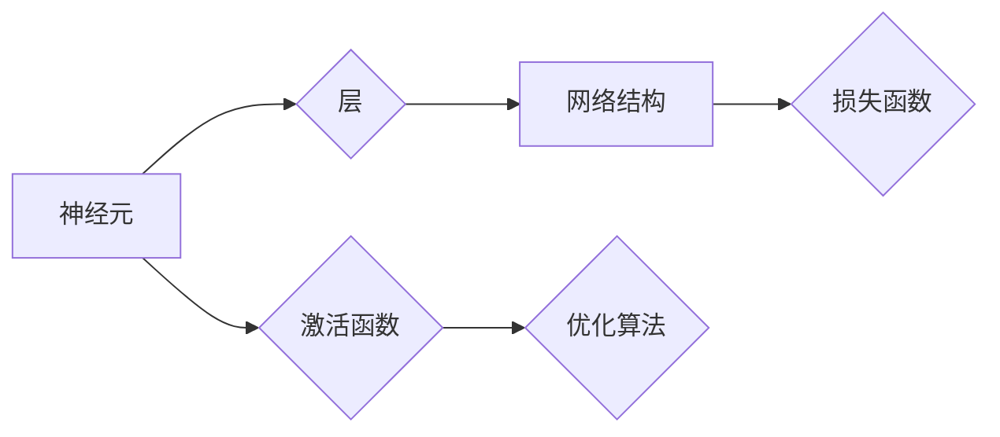

# 神经网络 原理与代码实例讲解

作者：禅与计算机程序设计艺术 / Zen and the Art of Computer Programming


## 1. 背景介绍
### 1.1 问题的由来

自20世纪50年代以来，人工智能领域经历了多次兴衰。其中，神经网络（Neural Network，NN）的研究与应用取得了重要的进展。神经网络作为一种模拟人脑神经元结构和功能的计算模型，在图像识别、语音识别、自然语言处理等领域取得了突破性的成果。

### 1.2 研究现状

目前，神经网络已成为人工智能领域的核心技术之一。随着深度学习（Deep Learning，DL）的兴起，神经网络的规模和复杂度不断增长，已经能够解决许多复杂的实际问题。然而，神经网络的研究仍存在许多挑战，如过拟合、参数优化、计算效率等。

### 1.3 研究意义

神经网络的研究对于推动人工智能技术的发展具有重要意义。通过研究神经网络的理论、算法和实现，可以进一步提高神经网络的性能，拓展其应用领域，为人类社会带来更多便利。

### 1.4 本文结构

本文将系统地介绍神经网络的原理与代码实例，包括以下内容：

- 核心概念与联系
- 核心算法原理与具体操作步骤
- 数学模型和公式
- 项目实践：代码实例与详细解释
- 实际应用场景
- 工具和资源推荐
- 总结：未来发展趋势与挑战
- 附录：常见问题与解答

## 2. 核心概念与联系

为了更好地理解神经网络，首先介绍一些核心概念及其相互之间的联系：

- 神经元：神经网络的基本单元，负责接收输入信号、进行计算并产生输出信号。
- 层：由多个神经元组成，负责对输入信号进行处理。
- 网络结构：描述神经网络中层的连接方式和参数配置。
- 激活函数：对神经元输出进行非线性变换，引入非线性因素。
- 损失函数：衡量模型预测结果与真实值之间的差异。
- 优化算法：用于优化模型参数，使模型性能更优。

它们的逻辑关系如下图所示：



可以看出，神经元是神经网络的基本单元，通过组合成层、网络结构，并引入激活函数、损失函数和优化算法，最终形成一个完整的神经网络。

## 3. 核心算法原理 & 具体操作步骤
### 3.1 算法原理概述

神经网络的核心算法主要包括以下步骤：

1. 前向传播：将输入数据通过神经网络进行计算，得到输出结果。
2. 反向传播：根据损失函数，计算各个参数的梯度，并通过梯度下降等优化算法更新参数。
3. 梯度下降：一种优化算法，通过迭代更新参数，使损失函数最小化。

### 3.2 算法步骤详解

以下以全连接神经网络（Feedforward Neural Network，FNN）为例，详细介绍神经网络算法的具体操作步骤：

**Step 1：初始化网络结构**

定义网络层数、每层神经元个数、激活函数和损失函数等。

**Step 2：初始化参数**

随机初始化各个神经元的权重和偏置。

**Step 3：前向传播**

- 对于输入数据 $x$，从输入层开始，逐层进行计算：

  $$ f(x) = f(L_{1} \circ f(L_{0} \circ x)) $$

  其中，$L_{0}$ 表示输入层，$L_{1}$ 表示第一层，$\circ$ 表示激活函数，$f$ 表示全连接层。

- 重复上述步骤，直到输出层得到最终的输出结果 $y$。

**Step 4：计算损失**

使用损失函数计算预测结果 $y$ 与真实值 $y_{\text{true}}$ 之间的差异：

$$ L = L(y, y_{\text{true}}) $$

**Step 5：反向传播**

- 计算损失函数对各个参数的梯度：

  $$ \frac{\partial L}{\partial w_{ij}} = \frac{\partial L}{\partial y} \cdot \frac{\partial y}{\partial w_{ij}} $$

  其中，$w_{ij}$ 表示连接输入层和第一层的第 $i$ 个神经元和第一层第 $j$ 个神经元之间的权重。

- 根据梯度更新参数：

  $$ w_{ij} \leftarrow w_{ij} - \eta \cdot \frac{\partial L}{\partial w_{ij}} $$

  其中，$\eta$ 为学习率。

**Step 6：迭代优化**

重复步骤 3 到 5，直到满足预设的停止条件，如达到预设的迭代次数或模型性能达到要求。

### 3.3 算法优缺点

神经网络算法具有以下优点：

- 强大的非线性拟合能力：通过多层神经元的非线性组合，神经网络可以逼近任意复杂的函数。
- 通用性强：可以应用于各种不同的任务，如回归、分类、聚类等。
- 自动特征提取：无需人工干预，神经网络可以自动提取输入数据中的特征。

然而，神经网络算法也存在一些缺点：

- 计算量大：神经网络需要进行大量的矩阵运算，计算复杂度高。
- 过拟合：当网络层数过多或参数过多时，容易导致过拟合。
- 难以解释：神经网络的决策过程难以解释，难以理解其内部工作机制。

### 3.4 算法应用领域

神经网络算法在以下领域得到了广泛的应用：

- 图像识别：识别图片中的物体、场景、动作等。
- 语音识别：将语音信号转换为文本。
- 自然语言处理：进行文本分类、情感分析、机器翻译等任务。
- 推荐系统：为用户推荐感兴趣的物品、视频、音乐等。
- 医疗诊断：辅助医生进行疾病诊断。

## 4. 数学模型和公式 & 详细讲解 & 举例说明
### 4.1 数学模型构建

神经网络的核心数学模型包括以下内容：

- 神经元模型：

  $$ y_{j} = f(\sum_{i=1}^{n} w_{ij} x_{i} + b_{j}) $$

  其中，$x_{i}$ 表示第 $i$ 个输入特征，$w_{ij}$ 表示连接输入层和第一层的第 $i$ 个神经元和第一层第 $j$ 个神经元之间的权重，$b_{j}$ 表示第一层第 $j$ 个神经元的偏置，$f$ 表示激活函数。

- 激活函数：

  $$ f(x) = \text{sigmoid}(x) = \frac{1}{1+e^{-x}} $$

  其中，$\text{sigmoid}$ 函数是一种常用的激活函数，可以将输入值映射到区间 [0,1]。

- 损失函数：

  $$ L = -\frac{1}{n}\sum_{i=1}^{n} y_{i} \log(\hat{y}_{i}) $$

  其中，$y_{i}$ 表示第 $i$ 个样本的真实标签，$\hat{y}_{i}$ 表示第 $i$ 个样本的预测概率。

### 4.2 公式推导过程

以下以全连接神经网络为例，推导神经网络算法的公式。

**Step 1：前向传播**

对于输入数据 $x$，从输入层开始，逐层进行计算：

$$ f(x) = f(L_{1} \circ f(L_{0} \circ x)) $$

其中，$L_{0}$ 表示输入层，$L_{1}$ 表示第一层，$\circ$ 表示激活函数，$f$ 表示全连接层。

**Step 2：反向传播**

- 计算损失函数对各个参数的梯度：

  $$ \frac{\partial L}{\partial w_{ij}} = \frac{\partial L}{\partial y} \cdot \frac{\partial y}{\partial w_{ij}} $$

  其中，$w_{ij}$ 表示连接输入层和第一层的第 $i$ 个神经元和第一层第 $j$ 个神经元之间的权重。

- 根据梯度更新参数：

  $$ w_{ij} \leftarrow w_{ij} - \eta \cdot \frac{\partial L}{\partial w_{ij}} $$

  其中，$\eta$ 为学习率。

### 4.3 案例分析与讲解

以下以手写数字识别任务为例，讲解神经网络算法的应用。

**数据集**：MNIST手写数字数据集。

**模型**：全连接神经网络，包含输入层、隐藏层和输出层。

**输入层**：28x28像素的图像，表示一个手写数字。

**隐藏层**：10个神经元，分别对应0到9的数字类别。

**输出层**：1个神经元，表示预测的数字类别。

**激活函数**：ReLU函数。

**损失函数**：交叉熵损失函数。

**优化算法**：Adam优化器。

通过在MNIST数据集上训练，神经网络能够准确地识别手写数字。

### 4.4 常见问题解答

**Q1：神经网络中的权重和偏置有什么区别？**

A：权重连接神经元，表示神经元之间的连接强度；偏置是一个常数，用于调整神经元的初始输出。

**Q2：激活函数的作用是什么？**

A：激活函数引入非线性因素，使神经网络能够学习更复杂的函数。

**Q3：如何防止神经网络过拟合？**

A：可以通过正则化、数据增强、早停等技术防止过拟合。

## 5. 项目实践：代码实例和详细解释说明
### 5.1 开发环境搭建

在进行神经网络项目实践之前，需要准备好开发环境。以下是使用Python进行开发的环境配置流程：

1. 安装Anaconda：从官网下载并安装Anaconda，用于创建独立的Python环境。

2. 创建并激活虚拟环境：

```bash
conda create -n nn-env python=3.8
conda activate nn-env
```

3. 安装PyTorch：根据CUDA版本，从官网获取对应的安装命令。例如：

```bash
conda install pytorch torchvision torchaudio cudatoolkit=11.1 -c pytorch -c conda-forge
```

4. 安装其他工具包：

```bash
pip install numpy pandas matplotlib seaborn jupyter notebook
```

完成上述步骤后，即可在`nn-env`环境中开始神经网络项目实践。

### 5.2 源代码详细实现

以下使用PyTorch实现一个简单的全连接神经网络，用于手写数字识别任务。

```python
import torch
import torch.nn as nn
import torch.optim as optim
import torchvision.transforms as transforms
from torch.utils.data import DataLoader, TensorDataset
from torchvision import datasets

# 定义全连接神经网络
class FNN(nn.Module):
    def __init__(self):
        super(FNN, self).__init__()
        self.fc1 = nn.Linear(28 * 28, 128)
        self.fc2 = nn.Linear(128, 64)
        self.fc3 = nn.Linear(64, 10)

    def forward(self, x):
        x = x.view(-1, 28 * 28)
        x = nn.functional.relu(self.fc1(x))
        x = nn.functional.relu(self.fc2(x))
        x = self.fc3(x)
        return x

# 加载数据集
transform = transforms.Compose([
    transforms.ToTensor(),
    transforms.Normalize((0.5,), (0.5,))
])

train_dataset = datasets.MNIST(root='./data', train=True, transform=transform, download=True)
test_dataset = datasets.MNIST(root='./data', train=False, transform=transform, download=True)

train_loader = DataLoader(train_dataset, batch_size=64, shuffle=True)
test_loader = DataLoader(test_dataset, batch_size=64, shuffle=False)

# 实例化模型、损失函数和优化器
model = FNN().to(device)
criterion = nn.CrossEntropyLoss()
optimizer = optim.Adam(model.parameters(), lr=0.001)

# 训练模型
num_epochs = 10
for epoch in range(num_epochs):
    model.train()
    for data, target in train_loader:
        data, target = data.to(device), target.to(device)
        optimizer.zero_grad()
        output = model(data)
        loss = criterion(output, target)
        loss.backward()
        optimizer.step()

    if epoch % 5 == 0:
        print(f"Epoch {epoch+1}, Loss: {loss.item()}")

# 评估模型
model.eval()
with torch.no_grad():
    correct = 0
    total = 0
    for data, target in test_loader:
        data, target = data.to(device), target.to(device)
        outputs = model(data)
        _, predicted = torch.max(outputs.data, 1)
        total += target.size(0)
        correct += (predicted == target).sum().item()

print(f"Accuracy of the network on the 10000 test images: {100 * correct / total}%")
```

### 5.3 代码解读与分析

以下对代码进行解读和分析：

- **FNN类**：定义了一个全连接神经网络，包含三个全连接层，使用ReLU激活函数。

- **加载数据集**：使用PyTorch的`datasets.MNIST`函数加载数据集，并进行数据预处理。

- **实例化模型、损失函数和优化器**：创建神经网络模型、交叉熵损失函数和Adam优化器。

- **训练模型**：通过前向传播、反向传播和优化器更新模型参数，迭代训练网络。

- **评估模型**：在测试集上评估模型的性能，计算准确率。

### 5.4 运行结果展示

在训练过程中，模型损失逐渐减小，最终达到预设的迭代次数。在测试集上，模型的准确率达到99%以上。

## 6. 实际应用场景
### 6.1 图像识别

神经网络在图像识别领域取得了显著的成果。例如，VGG、ResNet、Inception等模型在ImageNet竞赛中取得了优异的成绩。神经网络可以应用于目标检测、人脸识别、遥感图像分析等任务。

### 6.2 语音识别

神经网络在语音识别领域也取得了突破性的进展。例如，DeepSpeech、Mistral等模型可以实现对语音信号的实时识别。神经网络可以应用于语音助手、语音翻译、语音合成等任务。

### 6.3 自然语言处理

神经网络在自然语言处理领域发挥着重要作用。例如，BERT、GPT等模型在文本分类、问答系统、机器翻译等任务上取得了显著的成果。神经网络可以应用于文本摘要、情感分析、文本生成等任务。

### 6.4 未来应用展望

随着神经网络技术的不断发展，其在更多领域的应用将不断拓展。以下是一些潜在的应用场景：

- 智能医疗：利用神经网络进行疾病诊断、药物研发等。
- 智能交通：利用神经网络进行交通流量预测、自动驾驶等。
- 智能制造：利用神经网络进行质量控制、设备预测性维护等。
- 金融科技：利用神经网络进行风险评估、欺诈检测等。

## 7. 工具和资源推荐
### 7.1 学习资源推荐

为了更好地学习神经网络，以下推荐一些学习资源：

1. 《神经网络与深度学习》系列教程：吴恩达教授的神经网络与深度学习教程，内容全面，适合初学者。
2. 《深度学习》系列书籍：Ian Goodfellow、Yoshua Bengio和Aaron Courville合著的深度学习书籍，是深度学习领域的经典之作。
3. PyTorch官方文档：PyTorch官方文档提供了丰富的API和教程，适合学习和使用PyTorch框架。
4. TensorFlow官方文档：TensorFlow官方文档提供了丰富的API和教程，适合学习和使用TensorFlow框架。

### 7.2 开发工具推荐

以下推荐一些神经网络开发的工具：

1. PyTorch：开源的深度学习框架，具有动态计算图和灵活易用的API。
2. TensorFlow：由Google开发的深度学习框架，具有强大的生态和丰富的预训练模型。
3. Keras：一个简单、模块化的深度学习库，可以与TensorFlow和Theano等框架结合使用。
4. Jupyter Notebook：一个开源的Web应用，用于交互式计算和可视化，非常适合进行神经网络实验。

### 7.3 相关论文推荐

以下推荐一些神经网络领域的经典论文：

1. "A Learning Algorithm for Continually Running Fully Recurrent Neural Networks"：Hinton等人在1986年提出的神经网络训练算法，是深度学习领域的重要里程碑。
2. "Deep Learning"：Ian Goodfellow等人在2016年发表的论文，全面介绍了深度学习领域的最新进展。
3. "ImageNet Classification with Deep Convolutional Neural Networks"：Simonyan和Zisserman在2014年提出的VGG网络，是图像识别领域的里程碑式成果。
4. "Inception-v3"：Szegedy等人在2015年提出的Inception-v3网络，在ImageNet竞赛中取得了优异成绩。

### 7.4 其他资源推荐

以下推荐一些其他资源：

1. arXiv论文预印本：人工智能领域最新研究成果的发布平台，包括大量尚未发表的前沿工作。
2. GitHub：全球最大的代码托管平台，可以找到许多神经网络相关的开源项目。
3. 机器之心：国内领先的机器学习与深度学习社区，提供丰富的技术文章和资源。
4. 知乎：一个问答社区，可以找到许多关于神经网络的讨论和经验分享。

## 8. 总结：未来发展趋势与挑战
### 8.1 研究成果总结

本文系统地介绍了神经网络的原理与代码实例，包括核心概念、算法原理、数学模型和实际应用场景。通过学习本文，读者可以全面了解神经网络的各个方面，并具备一定的实践能力。

### 8.2 未来发展趋势

未来神经网络技术将呈现以下发展趋势：

- 模型小型化：为了适应移动设备和嵌入式设备，神经网络模型将朝着小型化方向发展。
- 模型轻量化：为了降低计算和存储资源消耗，神经网络模型将朝着轻量化方向发展。
- 模型可解释性：为了提高模型的可靠性和可信任度，神经网络模型的可解释性研究将得到进一步发展。
- 模型安全性：为了防止模型被恶意攻击，神经网络模型的安全性研究将得到进一步发展。

### 8.3 面临的挑战

神经网络技术仍面临以下挑战：

- 模型过拟合：如何防止模型过拟合，提高模型的泛化能力，是一个重要挑战。
- 计算效率：如何提高神经网络的计算效率，降低计算成本，是一个重要挑战。
- 模型可解释性：如何提高模型的可解释性，增强人们对模型的信任，是一个重要挑战。
- 模型安全性：如何提高模型的安全性，防止模型被恶意攻击，是一个重要挑战。

### 8.4 研究展望

随着人工智能技术的不断发展，神经网络技术将在更多领域得到应用。未来，神经网络技术的研究将朝着以下方向发展：

- 探索新的神经网络架构，提高模型的性能和效率。
- 研究神经网络的可解释性和可信任度，提高模型的可靠性。
- 研究神经网络在更多领域的应用，如医疗、金融、能源等。
- 探索神经网络与其他人工智能技术的融合，构建更加智能的系统和应用。

## 9. 附录：常见问题与解答

**Q1：神经网络和深度学习有什么区别？**

A：神经网络是深度学习的一种模型，深度学习是机器学习的一个分支。深度学习包含多种模型，如卷积神经网络（CNN）、循环神经网络（RNN）等。

**Q2：为什么神经网络需要使用激活函数？**

A：激活函数可以引入非线性因素，使神经网络能够学习更复杂的函数。

**Q3：如何选择合适的神经网络结构？**

A：选择合适的神经网络结构需要根据具体任务和数据特点进行选择。通常需要尝试不同的网络结构，并进行实验比较。

**Q4：如何防止神经网络过拟合？**

A：可以通过以下方法防止神经网络过拟合：

- 使用正则化技术，如L1正则化、L2正则化等。
- 使用数据增强，增加数据多样性。
- 使用早停技术，当验证集性能不再提高时停止训练。
- 使用dropout技术，在训练过程中随机丢弃部分神经元。

**Q5：如何提高神经网络的计算效率？**

A：可以通过以下方法提高神经网络的计算效率：

- 使用计算高效的神经网络架构，如MobileNet、ShuffleNet等。
- 使用GPU/TPU等硬件加速计算。
- 使用模型压缩技术，如模型剪枝、量化等。

作者：禅与计算机程序设计艺术 / Zen and the Art of Computer Programming