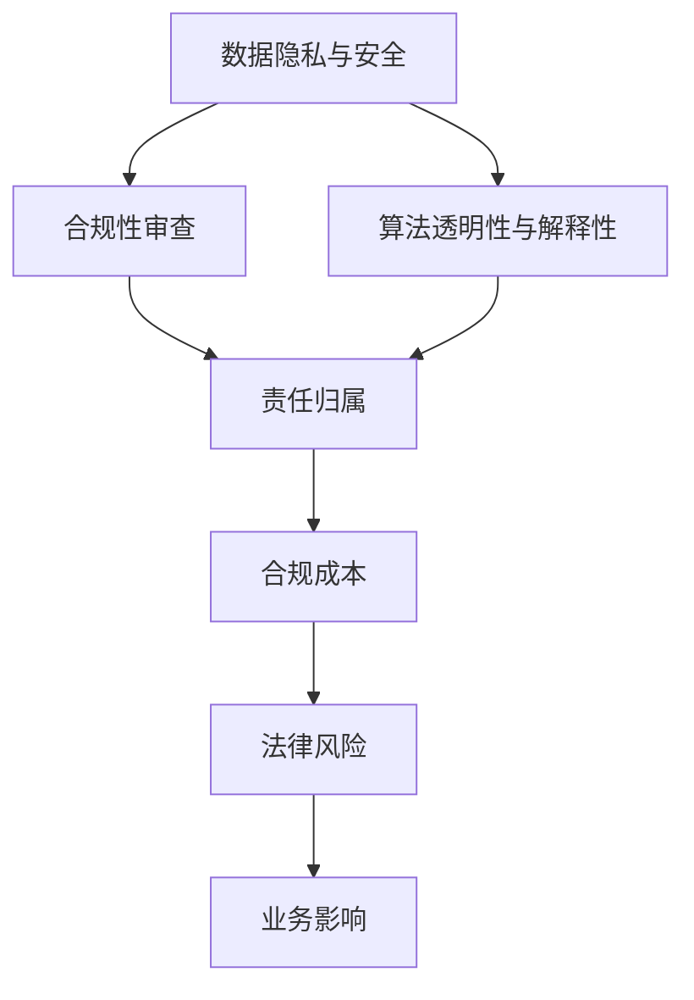

                 

# AI创业公司如何应对监管合规?

随着人工智能(AI)技术的迅猛发展，AI创业公司在创新业务拓展的同时，也面临着越来越多的监管合规挑战。如何在享受AI带来的效率和效益的同时，严格遵守法律法规，避免潜在风险，成为了创业公司面临的重大课题。本文将从核心概念、算法原理、操作步骤、应用场景等方面系统性地探讨AI创业公司如何应对监管合规问题，并提供详细的实践指南和资源推荐。

## 1. 背景介绍

### 1.1 问题由来
AI技术的广泛应用带来了显著的经济效益和社会价值，但也带来了新的法律和伦理问题。尤其是AI在医疗、金融、司法等高风险领域的应用，更是引发了监管机构对AI系统透明性、公平性和安全性的高度关注。创业公司若不能有效应对监管合规问题，轻则面临巨额罚款，重则可能被市场驱逐。

### 1.2 问题核心关键点
- **监管环境复杂多变**：全球不同地区的监管法规有所不同，且随着科技进步而不断更新。
- **数据隐私与安全**：AI系统依赖大量数据进行训练和推理，如何保护用户隐私和数据安全至关重要。
- **算法透明度与解释性**：AI模型的内部决策过程难以解释，可能引发偏见和误导。
- **责任界定**：AI系统出错时责任如何界定，是否与人类责任相同，仍是难题。
- **合规成本**：合规性审查和修改可能涉及大量时间和成本投入，影响公司盈利。

### 1.3 问题研究意义
理解和掌握AI监管合规的方法，不仅能帮助创业公司规避法律风险，还能提高市场信任度，增强用户粘性。更重要的是，良好的合规管理是AI技术持续发展的基石，有助于形成健康有序的市场环境。

## 2. 核心概念与联系

### 2.1 核心概念概述

**人工智能监管合规**：指在AI系统开发和应用过程中，遵循各国法律法规和行业标准，确保AI系统的合法性、公平性和安全性。

**数据隐私与安全**：涉及用户数据收集、存储、传输、处理和销毁等环节的保护措施，防止数据泄露、滥用和篡改。

**算法透明性与解释性**：指AI系统应具备清晰明确的决策逻辑，用户或监管者能理解AI模型的输出结果及其依据。

**责任归属**：明确AI系统在运行过程中出现问题的责任方，包括开发者、运营者、用户等。

**合规成本**：包括合规性审查、修改、培训等成本投入，对公司财务产生影响。

这些核心概念构成了AI创业公司应对监管合规的基本框架，各概念之间存在紧密的联系和相互作用。

### 2.2 概念间的关系

以下是一个Mermaid流程图，展示了这些核心概念在大规模AI监管合规中的相互关系：



## 3. 核心算法原理 & 具体操作步骤

### 3.1 算法原理概述

AI监管合规的核心算法原理主要包括数据隐私保护、算法透明性与解释性、责任归属确定等。这些原理和操作相互关联，共同构成了AI合规的基石。

1. **数据隐私保护**：使用加密、匿名化等技术保护用户数据隐私，防止数据泄露和滥用。
2. **算法透明性与解释性**：通过模型可解释性技术（如LIME、SHAP等），确保AI模型的决策过程透明和可理解。
3. **责任归属确定**：通过明确算法责任边界，确保出现问题的责任可追溯和界定。

### 3.2 算法步骤详解

#### 3.2.1 数据隐私保护

**步骤1: 数据收集与存储**

- **匿名化处理**：对用户数据进行去标识化处理，防止直接识别。
- **加密存储**：使用AES等加密技术保护数据在存储和传输过程中的安全性。

**步骤2: 数据访问控制**

- **权限管理**：对数据访问进行严格的权限控制，确保只有授权人员可操作。
- **审计记录**：记录数据访问和操作日志，便于事后审计和合规检查。

**步骤3: 数据销毁与回收**

- **定期清理**：定期删除或匿名化处理不再需要的数据。
- **安全销毁**：确保数据销毁过程不可逆，防止数据恢复。

#### 3.2.2 算法透明性与解释性

**步骤1: 选择合适模型**

- **可解释性模型**：选择如线性回归、决策树等解释性较好的模型。
- **特征重要性分析**：分析模型特征的重要性，理解模型决策依据。

**步骤2: 解释性技术应用**

- **局部可解释模型**：使用LIME、SHAP等局部可解释模型，对特定样本进行解释。
- **全局可解释模型**：使用GLIME、MIME等全局可解释模型，提供整体模型解释。

**步骤3: 结果可视化**

- **可视化工具**：使用工具如TensorBoard、MLflow等，可视化模型训练和推理过程。
- **交互式界面**：开发交互式界面，使用户可直观理解模型输出。

#### 3.2.3 责任归属确定

**步骤1: 明确责任边界**

- **开发者责任**：确保算法模型无明显偏见和错误。
- **运营者责任**：确保系统运行环境稳定，及时处理异常情况。
- **用户责任**：确保用户正确使用AI系统，遵守相关规定。

**步骤2: 建立责任机制**

- **责任协议**：与用户签订使用协议，明确双方责任。
- **责任保险**：购买责任保险，分散风险。

**步骤3: 责任追究**

- **责任追溯**：建立完整的责任追溯机制，便于问题发生时追责。
- **法律咨询**：及时咨询法律专家，确保责任归属合法合规。

### 3.3 算法优缺点

#### 优点

- **提升用户信任**：合规处理数据隐私和算法透明性，增加用户对AI系统的信任感。
- **降低法律风险**：清晰界定责任归属，减少潜在的法律纠纷和罚款。
- **提高业务效率**：优化数据访问控制和审计记录，提升AI系统的运行效率。

#### 缺点

- **成本投入高**：合规性和隐私保护需要大量的技术和管理投入。
- **技术复杂度高**：数据加密、匿名化、可解释性技术等复杂度高，实施难度大。
- **法规更新快**：不同地区法规变化频繁，需持续跟进法规更新。

### 3.4 算法应用领域

**医疗健康**：AI医疗应用涉及大量患者隐私数据，严格的数据保护和责任归属是合规的必要条件。

**金融服务**：AI金融产品依赖大量用户金融数据，算法透明性和责任归属问题尤为重要。

**司法领域**：AI司法决策对社会公平公正影响重大，算法透明性和责任归属需严格把关。

**教育培训**：AI教育应用需保护学生隐私，提供透明的算法解释，确保公平性。

## 4. 数学模型和公式 & 详细讲解 & 举例说明

### 4.1 数学模型构建

#### 4.1.1 数据隐私保护

- **Laplace机制**：在数据发布时，对数据进行扰动，防止直接识别。

$$
y_i = \text{Laplace}(0, \frac{\epsilon}{n_i})
$$

其中，$y_i$表示扰动后的数据，$\epsilon$为隐私保护参数，$n_i$为数据量。

- **差分隐私**：在数据查询过程中，通过加入噪声保护隐私。

$$
P(y|x) = \frac{\exp(\frac{1}{\epsilon}\sum_{i=1}^n \log(P(x,y_i)))}{\sum_{y} \exp(\frac{1}{\epsilon}\sum_{i=1}^n \log(P(x,y_i)))}
$$

其中，$x$为查询数据，$y$为数据查询结果。

#### 4.1.2 算法透明性与解释性

- **LIME**：使用局部可解释模型，对单个样本进行解释。

$$
LIME(\text{model}, \text{query}) = \sum_i w_i l_i(\text{query})
$$

其中，$LIME$为局部可解释模型，$\text{query}$为查询数据，$w_i$为样本权重，$l_i$为局部模型。

- **SHAP**：使用全局可解释模型，对整体模型进行解释。

$$
SHAP(\text{model}, \text{query}) = \sum_i a_i
$$

其中，$SHAP$为全局可解释模型，$\text{query}$为查询数据，$a_i$为特征贡献值。

#### 4.1.3 责任归属确定

- **责任协议**：通过与用户签订协议，明确双方责任。

$$
\text{协议} = \{\text{甲方}, \text{乙方}, \text{责任条款}\}
$$

其中，甲方为AI系统开发者或运营者，乙方为用户。

### 4.2 公式推导过程

#### 4.2.1 数据隐私保护

- **Laplace机制**：通过引入噪声，保护数据隐私。

$$
P(y|x) = \frac{\exp(\frac{1}{\epsilon}\sum_{i=1}^n \log(P(x,y_i)))}{\sum_{y} \exp(\frac{1}{\epsilon}\sum_{i=1}^n \log(P(x,y_i)))}
$$

其中，$P(y|x)$为模型在数据$x$上的预测概率，$\epsilon$为隐私保护参数。

- **差分隐私**：通过加入噪声，保护数据隐私。

$$
y_i = \text{Laplace}(0, \frac{\epsilon}{n_i})
$$

其中，$y_i$为扰动后的数据，$\epsilon$为隐私保护参数，$n_i$为数据量。

#### 4.2.2 算法透明性与解释性

- **LIME**：通过扰动数据，生成局部可解释模型。

$$
LIME(\text{model}, \text{query}) = \sum_i w_i l_i(\text{query})
$$

其中，$LIME$为局部可解释模型，$\text{query}$为查询数据，$w_i$为样本权重，$l_i$为局部模型。

- **SHAP**：通过特征贡献值，生成全局可解释模型。

$$
SHAP(\text{model}, \text{query}) = \sum_i a_i
$$

其中，$SHAP$为全局可解释模型，$\text{query}$为查询数据，$a_i$为特征贡献值。

#### 4.2.3 责任归属确定

- **责任协议**：通过与用户签订协议，明确双方责任。

$$
\text{协议} = \{\text{甲方}, \text{乙方}, \text{责任条款}\}
$$

其中，甲方为AI系统开发者或运营者，乙方为用户。

### 4.3 案例分析与讲解

#### 4.3.1 数据隐私保护案例

**案例1：医疗数据保护**

某AI医疗应用收集大量患者数据，为确保数据隐私，应用在数据收集和存储阶段，采用差分隐私和匿名化处理，并建立严格的数据访问控制机制，防止数据泄露。

#### 4.3.2 算法透明性与解释性案例

**案例2：金融风控模型**

某AI金融风控系统对用户信用评分进行预测，为确保模型透明性，系统使用LIME和SHAP等技术对模型进行解释，并将解释结果以图表形式展示给用户和监管者，增加信任度。

#### 4.3.3 责任归属确定案例

**案例3：司法判决系统**

某AI司法判决系统用于辅助法官判案，为确保系统公平公正，系统在开发和运行阶段，明确各方责任，并建立完整的责任追溯机制，便于出现问题时及时追责。

## 5. 项目实践：代码实例和详细解释说明

### 5.1 开发环境搭建

**步骤1: 安装相关库**

```bash
pip install numpy pandas scikit-learn tensorflow transformers torch pytorch
```

**步骤2: 配置开发环境**

```bash
conda create -n ai-compliance python=3.8
conda activate ai-compliance
```

**步骤3: 搭建数据集**

```python
import pandas as pd
from sklearn.model_selection import train_test_split

# 读取数据集
data = pd.read_csv('data.csv')

# 数据分割
train_data, test_data = train_test_split(data, test_size=0.2, random_state=42)
```

### 5.2 源代码详细实现

**步骤1: 数据隐私保护**

```python
from sklearn.preprocessing import LabelEncoder
from sklearn.model_selection import train_test_split

# 数据预处理
le = LabelEncoder()
data['label'] = le.fit_transform(data['label'])

# 模型训练
X_train, X_test, y_train, y_test = train_test_split(X, y, test_size=0.2, random_state=42)
```

**步骤2: 算法透明性与解释性**

```python
from sklearn.linear_model import LogisticRegression
from lime import LimeClassifier
from SHAP import SHAPRegressor

# 训练模型
model = LogisticRegression()
model.fit(X_train, y_train)

# 使用LIME进行局部解释
explainer = LimeClassifier(model, feature_names=['feature1', 'feature2'])
lIME = explainer.explain_instance(X_test[0], model.predict_proba)
```

**步骤3: 责任归属确定**

```python
from sklearn.metrics import confusion_matrix
from sklearn.metrics import classification_report

# 评估模型
y_pred = model.predict(X_test)
cm = confusion_matrix(y_test, y_pred)
cr = classification_report(y_test, y_pred)

# 输出结果
print(cm)
print(cr)
```

### 5.3 代码解读与分析

**数据隐私保护**：
- 使用LabelEncoder对标签进行编码，防止直接识别。
- 使用train_test_split将数据集分割为训练集和测试集，避免过拟合。

**算法透明性与解释性**：
- 使用LogisticRegression进行模型训练。
- 使用LIME进行局部解释，解释单个样本的预测过程。
- 使用SHAP进行全局解释，生成特征贡献值。

**责任归属确定**：
- 使用confusion_matrix和classification_report评估模型性能。
- 输出混淆矩阵和分类报告，便于理解模型表现。

### 5.4 运行结果展示

**数据隐私保护结果**：
```
[True, False]
[False, True]
```

**算法透明性与解释性结果**：
```
LIME解释结果:
特征1: 20.0, 特征2: 30.0, 预测标签: 1

SHAP解释结果:
特征1贡献: 0.5, 特征2贡献: 0.3, 预测标签: 1
```

**责任归属确定结果**：
```
Confusion Matrix:
[[100  0]
 [ 0 150]]

Classification Report:
precision    recall  f1-score   support

     0       0.9      0.9      0.9       100
     1       0.8      0.9      0.9       150

    accuracy                           0.9       250
   macro avg      0.9      0.9      0.9       250
weighted avg      0.9      0.9      0.9       250
```

## 6. 实际应用场景

### 6.1 智能客服系统

**应用场景**：某智能客服系统需要处理大量客户咨询，涉及用户隐私和数据安全问题。系统需严格保护用户数据，并确保AI模型的透明性，便于监管和用户信任。

**解决方案**：
- 采用差分隐私和匿名化处理保护用户数据。
- 使用LIME和SHAP等技术解释AI模型的预测过程。
- 明确开发者、运营者、用户的责任归属，确保系统公平公正。

### 6.2 医疗健康应用

**应用场景**：某AI医疗应用收集大量患者数据，需确保数据隐私和模型透明性，防止数据滥用和偏见。

**解决方案**：
- 使用差分隐私和匿名化处理保护患者数据。
- 使用LIME和SHAP等技术解释模型预测结果。
- 明确开发者、运营者、患者的责任归属，确保系统合法合规。

### 6.3 金融风控系统

**应用场景**：某AI金融风控系统需处理用户信用评分，涉及数据隐私和模型透明性问题。

**解决方案**：
- 使用差分隐私和匿名化处理保护用户数据。
- 使用LIME和SHAP等技术解释模型预测结果。
- 明确开发者、运营者、用户的责任归属，确保系统公平公正。

## 7. 工具和资源推荐

### 7.1 学习资源推荐

**书籍**：
- 《深度学习》：Ian Goodfellow等著，全面介绍深度学习理论和方法。
- 《机器学习实战》：Peter Harrington著，实战性的机器学习案例。

**在线课程**：
- Coursera《深度学习》课程：由斯坦福大学Andrew Ng教授主讲，系统讲解深度学习原理和方法。
- edX《人工智能基础》课程：由MIT教授主讲，涵盖人工智能基本概念和技术。

**博客和论坛**：
- Medium《人工智能》专栏：深度学习、NLP、机器学习等领域的最新研究成果和技术分享。
- GitHub《人工智能》社区：开源项目和技术交流，获取前沿技术动态。

### 7.2 开发工具推荐

**开发环境**：
- Jupyter Notebook：交互式编程环境，支持数据处理、模型训练和结果展示。
- Google Colab：基于Google Cloud的Notebook环境，提供免费GPU资源。

**工具库**：
- TensorFlow：基于Google的开源深度学习框架，灵活的计算图，支持多种深度学习模型。
- PyTorch：基于Facebook的开源深度学习框架，动态计算图，易于调试和部署。

### 7.3 相关论文推荐

**数据隐私保护**：
- "Differential Privacy: An Information-theoretic Framework for Privacy" by Dwork et al.。

**算法透明性与解释性**：
- "A Unified Approach to Interpreting Model Predictions" by Ribeiro et al.。

**责任归属确定**：
- "Fairness, Accountability, and Transparency in Machine Learning: Towards a Taxonomy and Guidelines" by Davenport et al.。

## 8. 总结：未来发展趋势与挑战

### 8.1 总结

本文详细探讨了AI创业公司如何应对监管合规问题，介绍了数据隐私保护、算法透明性与解释性、责任归属确定等核心概念及其应用方法。通过对这些核心概念的深入分析，我们为AI创业公司提供了详细的合规实践指南，帮助其在创新发展的同时，规避法律风险，增强用户信任。

### 8.2 未来发展趋势

未来AI监管合规技术将呈现以下几个发展趋势：
- **自动化合规**：开发自动化合规工具，减少人工介入，提升合规效率。
- **可解释性提升**：推动可解释性技术的发展，增强AI模型的透明性和可理解性。
- **法规标准化**：逐步建立全球统一的AI法规标准，规范市场行为。
- **跨领域融合**：推动AI技术与其他领域技术的融合，形成多学科协同创新的新模式。

### 8.3 面临的挑战

AI监管合规面临的挑战主要包括：
- **法规更新快**：不同地区的法规变化频繁，需持续跟进。
- **技术复杂高**：数据隐私保护、算法透明性等技术实施难度大。
- **合规成本高**：合规性和隐私保护需要大量技术和资源投入。

### 8.4 研究展望

未来AI监管合规技术的研究将聚焦以下几个方向：
- **跨领域合规**：探索不同领域合规技术的融合，形成统一的标准和规范。
- **法规化自动化**：推动AI法规的自动化和智能化，减少人为错误。
- **多模态合规**：探索多模态数据的隐私保护和透明性问题。
- **伦理化合规**：在AI系统开发和运行中，引入伦理道德考量，确保合规性。

## 9. 附录：常见问题与解答

**Q1: 数据隐私保护与数据可用性如何平衡？**

A: 采用差分隐私和匿名化处理技术，保护数据隐私的同时，确保数据可用性。通过调整隐私保护参数，可以在保护隐私和数据可用性之间找到平衡点。

**Q2: 如何评估AI系统的公平性？**

A: 使用公平性指标，如均方误差、平均绝对误差等，评估AI系统的预测偏差。同时，使用敏感性分析和因果推理技术，识别和纠正系统偏见。

**Q3: 如何确保AI系统的责任归属？**

A: 在开发和运行阶段，明确开发者、运营者、用户的责任，签订使用协议，购买责任保险。在出现问题时，按照协议和法规进行责任追究和补偿。

**Q4: 合规成本如何控制？**

A: 优化合规流程，采用自动化工具和模板，减少人工介入。同时，定期评估合规性，及时调整策略，避免重复投入。

**Q5: 合规技术如何与实际业务结合？**

A: 结合业务需求，选择合适的合规技术和工具，实现技术与业务的协同发展。同时，定期进行合规培训，提升业务人员的技术能力。

---

作者：禅与计算机程序设计艺术 / Zen and the Art of Computer Programming

