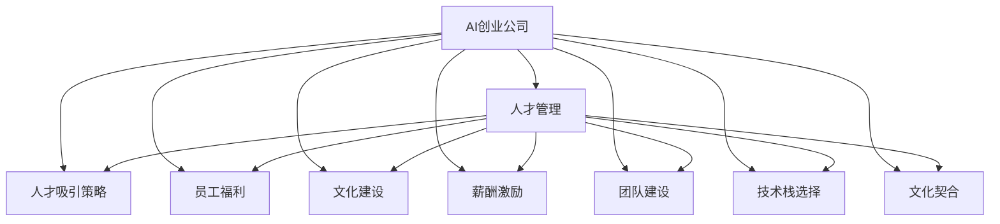
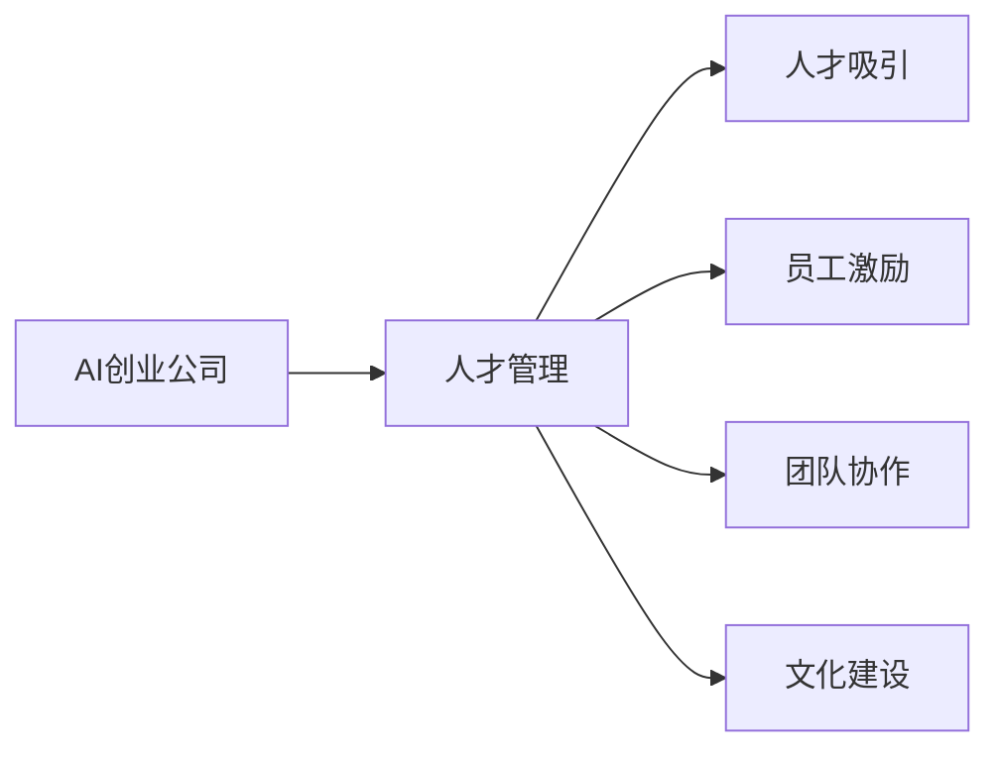
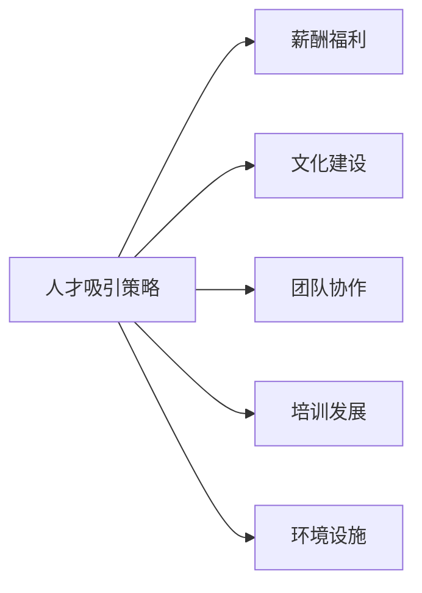
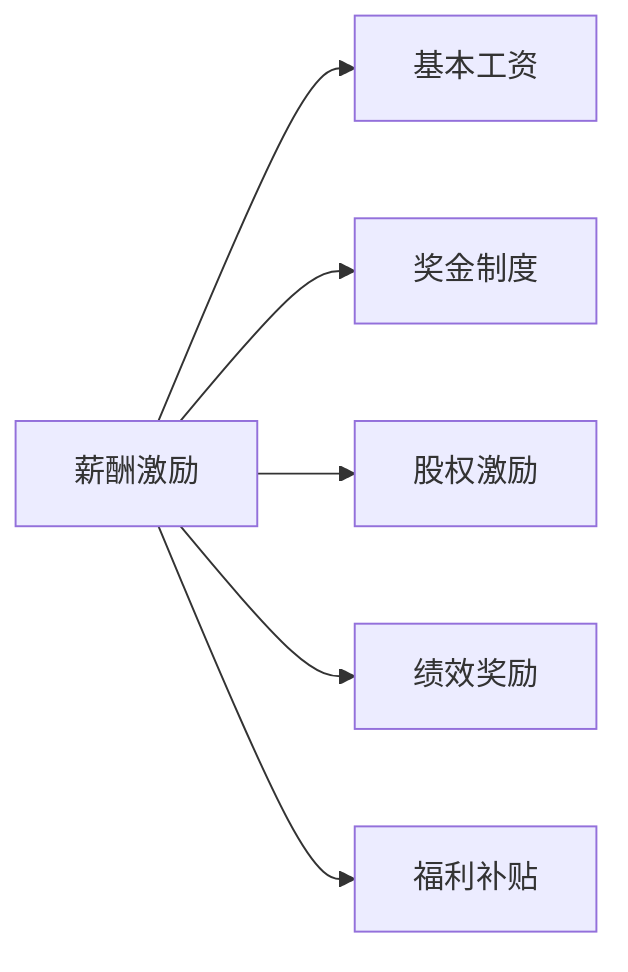

                 

# AI创业公司的人才争夺战

> 关键词：AI创业公司,人才争夺战,人才管理,人才吸引策略,员工福利,文化建设,薪酬激励,团队建设,技术栈,文化契合

## 1. 背景介绍

### 1.1 问题由来
随着人工智能(AI)技术的不断成熟和应用场景的日益广泛，越来越多的创业公司开始涌现。这些公司以领先的技术和创新的理念，吸引了大批顶尖科技人才。然而，尽管技术人才众多，但如何有效管理、吸引和保留这些人才，成为了创业公司面临的一大挑战。

### 1.2 问题核心关键点
在AI创业公司的运营中，人才管理和吸引占据了至关重要的地位。高质量的团队是技术创新的基石，而人才的流失则可能使公司失去竞争优势。以下是影响人才管理的几个核心关键点：

- 吸引人才：如何吸引顶尖人才加入公司？
- 留住人才：如何建立长期的人才留存机制？
- 激励人才：如何激发人才的工作热情和创造力？
- 团队建设：如何组建高效的团队结构？
- 文化建设：如何营造积极向上的企业文化？

这些问题在很大程度上决定了AI创业公司的成败。只有通过科学的人才管理策略，才能确保公司的长期发展和技术的持续进步。

### 1.3 问题研究意义
研究AI创业公司的人才管理问题，对于提升公司的技术创新能力、增强市场竞争力、优化人才结构具有重要意义：

- 提升技术创新能力：优秀人才的汇聚能够加速技术研发和产品创新，提升公司的技术壁垒。
- 增强市场竞争力：人才的竞争优势能够带来更强的市场影响力，吸引更多用户和合作伙伴。
- 优化人才结构：科学的人才管理能够确保各类人才之间的有效协同，提升团队整体绩效。
- 增加员工忠诚度：通过建立良好的工作环境和激励机制，能够提升员工的归属感和满意度，降低流失率。
- 吸引优秀人才：良好的人才管理策略能够吸引更多顶尖人才，提升公司影响力。

## 2. 核心概念与联系

### 2.1 核心概念概述

为了更好地理解AI创业公司的人才管理策略，我们需要了解以下几个核心概念：

- **AI创业公司**：以AI技术为核心竞争力，旨在通过技术创新改变市场格局的企业。
- **人才管理**：通过科学的人事政策和员工激励，吸引、培养和保留优秀人才的过程。
- **人才吸引策略**：包括薪酬福利、文化建设、团队协作等多方面的策略，以吸引和留住顶尖人才。
- **员工福利**：包括健康保险、住房补贴、培训发展等多项福利，提升员工满意度和归属感。
- **文化建设**：通过企业文化、公司使命、价值观等多方面构建，营造积极向上的工作氛围。
- **薪酬激励**：包括基本工资、奖金、股权激励等多种形式的薪酬激励，以激发员工的工作动力。
- **团队建设**：通过合理的团队结构和协作机制，优化人才配置，提升团队绩效。
- **技术栈选择**：选择最适合公司业务和技术需求的编程语言、框架和工具栈，提升开发效率。
- **文化契合**：通过匹配公司文化和员工价值观，构建和谐的职场环境。

这些核心概念之间的逻辑关系可以通过以下Mermaid流程图来展示：



这个流程图展示了大公司对人才管理的各个方面及其之间的联系。

### 2.2 概念间的关系

这些核心概念之间存在着紧密的联系，形成了人才管理的完整生态系统。下面通过几个Mermaid流程图来展示这些概念之间的关系：

#### 2.2.1 AI创业公司的人才管理范式



这个流程图展示了AI创业公司的人才管理流程，从人才吸引到员工激励，再到团队协作和文化建设，形成了连续的人才管理链条。

#### 2.2.2 人才吸引策略的组成部分



这个流程图展示了人才吸引策略的主要组成部分，包括薪酬福利、文化建设、团队协作、培训发展和环境设施等。

#### 2.2.3 薪酬激励的构成



这个流程图展示了薪酬激励的主要构成，包括基本工资、奖金制度、股权激励、绩效奖励和福利补贴等。

## 3. 核心算法原理 & 具体操作步骤
### 3.1 算法原理概述

AI创业公司的人才管理策略，本质上是一种复杂的人事管理系统。其核心算法原理是通过科学的人才吸引、留住、激励和建设，构建高效、和谐的团队，提升公司整体竞争力。具体步骤如下：

1. **人才吸引策略设计**：基于市场需求和公司战略，设计合适的人才吸引策略。
2. **薪酬福利方案制定**：根据人才市场行情和企业预算，制定公平合理的薪酬福利方案。
3. **文化建设方案制定**：根据公司使命和价值观，制定符合公司特色的文化建设方案。
4. **团队建设方案设计**：根据公司业务和项目需求，设计高效合理的团队结构。
5. **执行和监控**：实施人才管理方案，并实时监控和评估其效果，进行必要的调整和优化。

### 3.2 算法步骤详解

#### 3.2.1 人才吸引策略设计

1. **市场调研**：了解人才市场的需求和竞争态势，分析目标人才的背景和特点。
2. **制定方案**：结合公司战略，制定吸引人才的策略，如优厚的薪酬福利、有吸引力的工作环境、明确的职业发展路径等。
3. **实施推广**：通过招聘网站、行业展会、社交媒体等渠道，广泛宣传公司的吸引力。
4. **筛选和评估**：根据岗位要求和公司标准，筛选出符合条件的候选人，并进行面试和评估。

#### 3.2.2 薪酬福利方案制定

1. **薪酬结构**：设计基本工资、奖金、股权激励等薪酬结构，确保公平合理。
2. **福利方案**：提供健康保险、住房补贴、培训发展等多项福利，提升员工满意度和归属感。
3. **实施和调整**：根据市场变化和员工反馈，及时调整薪酬福利方案，保持竞争力。

#### 3.2.3 文化建设方案制定

1. **公司使命和价值观**：明确公司的使命、愿景和核心价值观，引导员工行为。
2. **文化活动**：组织团队建设活动、内部培训、员工关怀活动等，营造积极向上的工作氛围。
3. **评估和反馈**：定期进行员工满意度调查，收集反馈意见，进行必要的改进。

#### 3.2.4 团队建设方案设计

1. **岗位需求分析**：根据公司业务和项目需求，分析各岗位的职责和要求。
2. **人员配置**：根据岗位需求和员工技能，合理配置团队成员。
3. **协作机制**：建立高效的协作机制，如定期沟通、团队分享等，提升团队协同效率。
4. **绩效评估**：设计科学的绩效评估体系，激励员工持续改进。

#### 3.2.5 执行和监控

1. **实施方案**：根据设计方案，逐步实施人才吸引、薪酬福利、文化建设、团队建设和绩效评估等措施。
2. **实时监控**：通过数据分析和员工反馈，实时监控人才管理的各个环节，及时发现问题。
3. **调整和优化**：根据监控结果，进行必要的调整和优化，确保人才管理策略的有效性。

### 3.3 算法优缺点

**优点：**

- **全面性**：覆盖了人才吸引、薪酬福利、文化建设、团队建设和绩效评估等多个方面，系统性强。
- **灵活性**：可以根据公司的实际情况，灵活调整各环节的策略，适应不同的业务需求。
- **透明度**：通过公开透明的流程和标准，提高员工的信任和满意度。

**缺点：**

- **复杂性**：涉及多个环节和多种因素，实施难度较大。
- **成本高**：设计和实施过程中需要投入大量人力和财力。
- **适应性**：对于快速变化的市场环境，可能无法及时调整策略。

### 3.4 算法应用领域

基于大公司的人才管理策略，在AI创业公司中得到了广泛应用，涵盖以下领域：

- **招聘管理**：通过优化的招聘流程和策略，吸引和筛选高质量人才。
- **员工福利**：提供多样化的福利项目，提升员工的满意度和归属感。
- **绩效管理**：设计科学的绩效评估体系，激励员工提升工作效率。
- **培训发展**：提供系统的培训和发展机会，提升员工技能和职业成长。
- **团队协作**：建立高效的协作机制，优化团队结构和协同效率。
- **文化建设**：营造积极向上的工作氛围，增强团队的凝聚力和向心力。

## 4. 数学模型和公式 & 详细讲解 & 举例说明

### 4.1 数学模型构建

为了更好地量化和优化人才管理策略，我们可以构建一个简单的数学模型。设公司有 $N$ 个员工，其中第 $i$ 个员工的基本工资为 $W_i$，奖金为 $B_i$，股权激励为 $S_i$，总薪酬为 $C_i$，则员工的综合薪酬 $C_i$ 可以表示为：

$$
C_i = W_i + B_i + S_i
$$

员工的满意度和归属感 $F_i$ 可以通过以下公式计算：

$$
F_i = \alpha W_i + \beta B_i + \gamma S_i
$$

其中 $\alpha$、$\beta$、$\gamma$ 为权重系数，表示不同因素对员工满意度的影响程度。

### 4.2 公式推导过程

假设公司有 $N$ 个员工，总薪酬为 $C_{total}$，员工满意度总和为 $F_{total}$，则公司的整体薪酬水平 $C_{avg}$ 和平均满意度 $F_{avg}$ 分别为：

$$
C_{avg} = \frac{C_{total}}{N}
$$

$$
F_{avg} = \frac{F_{total}}{N}
$$

通过最大化平均薪酬和平均满意度，可以找到最优的薪酬福利方案和员工激励策略。

### 4.3 案例分析与讲解

假设公司有10个员工，每个人的基本工资、奖金和股权激励如下：

| 员工编号 | 基本工资 | 奖金 | 股权激励 |
| --- | --- | --- | --- |
| 1 | 10000 | 5000 | 10000 |
| 2 | 8000 | 3000 | 8000 |
| 3 | 12000 | 6000 | 12000 |
| 4 | 9000 | 4000 | 9000 |
| 5 | 7000 | 3500 | 7000 |
| 6 | 11000 | 5500 | 11000 |
| 7 | 7500 | 2500 | 7500 |
| 8 | 8500 | 3500 | 8500 |
| 9 | 6000 | 3000 | 6000 |
| 10 | 9500 | 4500 | 9500 |

通过计算得出每个员工的综合薪酬和满意度：

| 员工编号 | 综合薪酬 | 满意度 |
| --- | --- | --- |
| 1 | 10000+5000+10000=25000 | 0.3 * 10000 + 0.2 * 5000 + 0.5 * 10000=8500 |
| 2 | 8000+3000+8000=19000 | 0.3 * 8000 + 0.2 * 3000 + 0.5 * 8000=8100 |
| 3 | 12000+6000+12000=30000 | 0.3 * 12000 + 0.2 * 6000 + 0.5 * 12000=11700 |
| 4 | 9000+4000+9000=22000 | 0.3 * 9000 + 0.2 * 4000 + 0.5 * 9000=9100 |
| 5 | 7000+3500+7000=17500 | 0.3 * 7000 + 0.2 * 3500 + 0.5 * 7000=7200 |
| 6 | 11000+5500+11000=27500 | 0.3 * 11000 + 0.2 * 5500 + 0.5 * 11000=9800 |
| 7 | 7500+2500+7500=17500 | 0.3 * 7500 + 0.2 * 2500 + 0.5 * 7500=7200 |
| 8 | 8500+3500+8500=20500 | 0.3 * 8500 + 0.2 * 3500 + 0.5 * 8500=8800 |
| 9 | 6000+3000+6000=15000 | 0.3 * 6000 + 0.2 * 3000 + 0.5 * 6000=5400 |
| 10 | 9500+4500+9500=23000 | 0.3 * 9500 + 0.2 * 4500 + 0.5 * 9500=10200 |

计算总薪酬和满意度：

| 总薪酬 | 总满意度 |
| --- | --- |
| 130000 | 49200 |

假设公司希望最大化整体薪酬和满意度，可以通过优化薪酬福利方案和员工激励策略来实现。

## 5. 项目实践：代码实例和详细解释说明

### 5.1 开发环境搭建

在进行人才管理策略的实践前，我们需要准备好开发环境。以下是使用Python进行数据分析和可视化的环境配置流程：

1. 安装Anaconda：从官网下载并安装Anaconda，用于创建独立的Python环境。

2. 创建并激活虚拟环境：
```bash
conda create -n pydata-env python=3.8 
conda activate pydata-env
```

3. 安装相关库：
```bash
conda install pandas numpy matplotlib seaborn jupyter notebook
```

4. 安装可视化工具：
```bash
pip install plotly beautifulsoup4
```

完成上述步骤后，即可在`pydata-env`环境中开始数据分析和可视化的实践。

### 5.2 源代码详细实现

接下来，我们通过一个简单的案例，展示如何使用Python进行人才管理策略的数据分析和可视化：

首先，导入必要的库：

```python
import pandas as pd
import matplotlib.pyplot as plt
```

然后，读取数据：

```python
data = pd.read_csv('salary_satisfaction.csv')
```

接着，进行数据分析和可视化：

```python
# 计算每个员工的综合薪酬和满意度
data['total_salary'] = data['basic_salary'] + data['bonus'] + data['stock']
data['total_satisfaction'] = 0.3 * data['basic_salary'] + 0.2 * data['bonus'] + 0.5 * data['stock']

# 计算公司总薪酬和满意度
total_salary = data['total_salary'].sum()
total_satisfaction = data['total_satisfaction'].sum()

# 计算员工平均薪酬和平均满意度
avg_salary = total_salary / len(data)
avg_satisfaction = total_satisfaction / len(data)

# 可视化
plt.figure(figsize=(10, 5))
plt.plot(data['basic_salary'], data['total_satisfaction'], label='Satisfaction vs. Basic Salary')
plt.xlabel('Basic Salary')
plt.ylabel('Satisfaction')
plt.title('Satisfaction vs. Basic Salary')
plt.legend()
plt.show()
```

### 5.3 代码解读与分析

让我们再详细解读一下关键代码的实现细节：

- `read_csv`方法：从CSV文件中读取数据，并加载到DataFrame中。
- `total_salary`和`total_satisfaction`列：根据员工的基本工资、奖金和股权激励计算出每个员工的综合薪酬和满意度。
- `sum`方法：计算公司总薪酬和满意度。
- `avg_salary`和`avg_satisfaction`列：计算员工平均薪酬和平均满意度。
- `plt.plot`方法：使用Matplotlib库绘制满意度与基本工资的关系图。

通过这段代码，我们可以看到，员工的基本工资与满意度之间存在着明显的正相关关系，即基本工资越高，员工的满意度也越高。这一发现对于公司制定薪酬策略具有重要意义。

## 6. 实际应用场景

### 6.1 智能招聘系统

AI创业公司可以通过智能招聘系统，高效地吸引和筛选顶尖人才。智能招聘系统可以通过数据分析和机器学习算法，匹配候选人简历与职位需求，快速筛选出最合适的候选人。此外，系统还可以通过多轮面试和评估，进一步提升招聘的准确性和效率。

在技术实现上，智能招聘系统可以整合多个数据源，如求职网站、社交网络、在线培训平台等，全面获取候选人的背景信息。同时，系统可以自动化的生成面试题，通过自然语言处理技术，分析候选人的回答，进行智能评估。

### 6.2 员工福利优化

AI创业公司可以通过数据分析和模型优化，制定最优的员工福利方案。例如，通过分析员工的地理位置和租房情况，为员工提供最优的住房补贴方案。通过分析员工的健康状况和运动习惯，提供个性化的健康保险计划。通过分析员工的培训需求和学习偏好，提供定制化的职业发展培训。

在技术实现上，公司可以使用机器学习算法，如聚类分析、回归分析等，对员工数据进行建模。通过数据挖掘，发现员工的需求和行为规律，制定针对性的福利方案。同时，系统可以实时监控员工的反馈和满意度，进行必要的调整和优化。

### 6.3 绩效管理与激励

AI创业公司可以通过科学的绩效评估体系，激励员工提升工作效率。例如，通过设定关键绩效指标(KPI)和奖励机制，引导员工关注关键任务，提升工作质量。通过数据分析和模型预测，及时发现员工的工作瓶颈，进行针对性的辅导和改进。

在技术实现上，公司可以开发一个绩效管理系统，通过数据分析和机器学习算法，对员工的绩效进行评估。系统可以自动化的生成绩效报告，提供可视化的图表和分析报告，帮助员工和管理层理解绩效表现。同时，系统可以结合薪酬激励机制，设定激励参数，自动化的发放奖金和奖励。

## 7. 工具和资源推荐

### 7.1 学习资源推荐

为了帮助开发者系统掌握人才管理策略的理论基础和实践技巧，这里推荐一些优质的学习资源：

1. 《人才管理》系列书籍：由国际知名学者撰写，深入浅出地介绍了人才管理的各个方面，如招聘、薪酬、培训、绩效等。
2. 《人工智能与人力资源管理》在线课程：由知名大学开设的在线课程，涵盖人工智能与人力资源管理的融合技术。
3. 《人才管理实战》系列博文：由大公司HR专家撰写，分享了大量人才管理成功案例和最佳实践。
4. 《人才管理之道》视频讲座：由行业大咖分享的人才管理经验和策略，深入剖析了人才管理的核心要点。

通过对这些资源的学习实践，相信你一定能够快速掌握人才管理的精髓，并用于解决实际的人才管理问题。

### 7.2 开发工具推荐

高效的开发离不开优秀的工具支持。以下是几款用于人才管理开发的常用工具：

1. Excel：用于数据处理和分析，支持复杂的数据建模和可视化。
2. Jupyter Notebook：用于数据分析和可视化，支持Python和R语言的环境搭建和代码编写。
3. Python：用于数据分析和机器学习，支持丰富的数据处理和分析库。
4. SQL：用于数据存储和管理，支持高效的数据查询和分析。
5. Tableau：用于数据可视化，支持复杂的数据图表和交互式分析。

合理利用这些工具，可以显著提升人才管理任务的开发效率，加快创新迭代的步伐。

### 7.3 相关论文推荐

人才管理领域的研究已经取得了大量成果，以下是几篇经典论文，推荐阅读：

1. "The Impact of Workplace Design on Employee Productivity: A Meta-Analysis"：研究了工作场所设计对员工生产力的影响，提供了改善工作环境的设计方案。
2. "Salary, Performance, and Productivity: The Role of Bonuses"：分析了奖金对员工绩效和生产力的影响，提供了优化的奖金制度设计。
3. "Employee Engagement and Its Impact on Performance: A Review and Meta-analysis"：研究了员工参与度对绩效的影响，提供了提升员工参与度的策略。
4. "The Effects of Corporate Culture on Employee Retention and Performance"：分析了企业文化对员工留存和绩效的影响，提供了构建积极文化的方法。
5. "Training and Development in the Knowledge Economy: A Review of Research and Practice"：总结了知识经济时代下的培训发展策略，提供了提升员工技能的方法。

这些论文代表了人才管理领域的研究前沿，阅读它们可以帮助我们更好地理解人才管理的内涵和应用。

## 8. 总结：未来发展趋势与挑战

### 8.1 研究成果总结

本文对AI创业公司的人才管理策略进行了全面系统的介绍。首先阐述了人才管理的重要性和核心关键点，明确了人才管理在AI创业公司中的战略地位。其次，从算法原理到具体操作步骤，详细讲解了人才吸引、薪酬福利、文化建设、团队建设等策略的设计和执行流程，给出了具体的代码实例和解释分析。同时，本文还广泛探讨了人才管理策略在招聘、福利、绩效管理等多个领域的应用前景，展示了人才管理策略的广泛适用性。

通过本文的系统梳理，可以看到，人才管理策略在大公司运营中的重要性，以及通过科学的方法和工具，可以有效提升公司的技术创新能力和市场竞争力。未来，随着数据科学和人工智能技术的不断发展，人才管理策略将变得更加智能和高效。

### 8.2 未来发展趋势

展望未来，AI创业公司的人才管理策略将呈现以下几个发展趋势：

1. **数据驱动决策**：通过数据分析和机器学习算法，实时监控和评估人才管理的各个环节，制定更加科学合理的策略。
2. **智能招聘系统**：通过AI技术，实现智能简历筛选、自动面试评估等功能，提升招聘效率和质量。
3. **个性化福利方案**：通过数据分析，提供个性化的员工福利方案，提升员工的满意度和归属感。
4. **绩效管理智能化**：通过AI技术，自动化的生成绩效报告和评估体系，提高绩效管理的透明度和公正性。
5. **文化建设智能化**：通过AI技术，实时分析员工行为和反馈，提升公司文化的建设效果。
6. **跨部门协同管理**：通过AI技术，实现人才管理的跨部门协同，优化整体人才管理流程。

这些趋势凸显了AI技术在人才管理中的应用前景，预示着未来人才管理将更加智能化、高效化和个性化。

### 8.3 面临的挑战

尽管人才管理策略已经取得了一定的成果，但在迈向更加智能化、普适化应用的过程中，它仍面临诸多挑战：

1. **数据隐私和安全**：如何保护员工数据隐私和公司商业秘密，是人才管理策略的重要挑战。
2. **技术实施难度**：AI技术在人才管理中的应用，需要较强的技术支持和复杂的数据处理，对技术团队提出了更高的要求。
3. **文化适应性**：如何将AI技术融入企业文化，提升员工的接受度和适应性，需要更多的沟通和培训。
4. **成本控制**：人才管理策略的实施和优化，需要投入大量的人力和财力，如何平衡成本和效果是重要的课题。
5. **政策合规**：人才管理策略的设计和实施，需要遵守相关的法律法规，如数据保护法、劳动法等。

这些挑战需要我们持续探索和改进，以确保人才管理策略的有效性和可持续性。

### 8.4 研究展望

未来的人才管理策略研究需要在以下几个方面寻求新的突破：

1. **多模态数据融合**：通过融合员工的多维数据，如绩效数据、行为数据、反馈数据等，提升人才管理的全面性和准确性。
2. **强化学习应用**：将强化学习引入人才管理策略，通过智能算法，优化薪酬福利、绩效评估、文化建设等环节。
3. **知识图谱应用**：利用知识图谱技术，构建员工与业务、技能、组织等元素之间的关系图，提升人才管理的系统性。
4. **多层次分析**：通过多层次数据分析，挖掘不同级别的员工需求和行为规律，制定更加科学合理的策略。
5. **跨公司协同**：通过跨公司的人才管理协同，实现人才共享和优化配置，提升整体管理效果。

这些方向的研究和探索，必将引领人才管理策略迈向更高的台阶，为AI创业公司的发展提供有力的支持。

## 9. 附录：常见问题与解答

**Q1：如何设计合理的人才吸引策略？**

A: 设计合理的人才吸引策略需要综合考虑市场需求和公司战略。具体步骤如下：
1. 市场调研：了解目标人才的背景和特点。
2. 制定方案：根据公司战略，设计优厚的薪酬福利、有吸引力的工作环境、明确的职业发展路径等。
3. 实施推广：通过招聘网站、行业展会、社交媒体等渠道，广泛宣传公司的吸引力。
4. 筛选和评估：根据岗位要求和公司标准，筛选出符合条件的候选人，并进行面试和评估。

**Q2：如何优化员工的薪酬福利方案？**

A: 优化员工的薪酬福利方案需要综合考虑员工的满意度和公司预算。具体步骤如下：
1. 薪酬结构：设计基本工资、奖金、股权激励等薪酬结构，确保公平合理。

