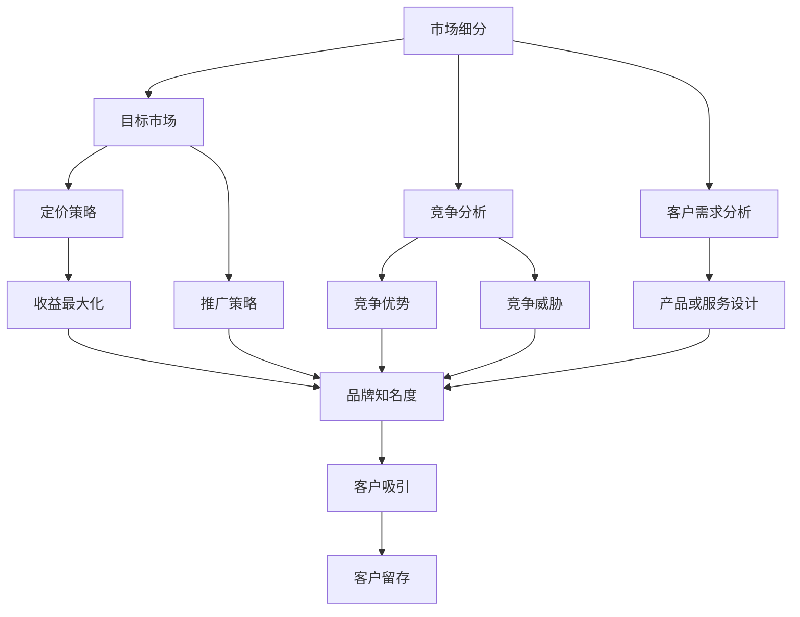

                 

# AI创业公司的市场策略

## 1. 背景介绍

### 1.1 问题由来

人工智能（AI）技术正迅速改变各个行业，包括制造业、金融、医疗、教育等。越来越多的公司认识到，AI能够提升效率、降低成本并创造新的业务机会。因此，AI创业公司如雨后春笋般涌现。然而，成功的AI创业公司不仅需要强大的技术，还需要一个清晰的市场策略。

### 1.2 问题核心关键点

AI创业公司面临的核心问题包括：如何找到目标客户、如何定价、如何推广、如何处理市场竞争等。这些问题需要一种系统的方法来解决，以确保公司的长期成功。

### 1.3 问题研究意义

研究AI创业公司的市场策略，对于寻找潜在市场、制定有效的营销策略、提升品牌知名度、吸引和留住客户至关重要。通过对AI创业公司的市场策略进行深入分析，可以提供实用的见解，帮助AI创业者在激烈的市场竞争中脱颖而出。

## 2. 核心概念与联系

### 2.1 核心概念概述

为了理解AI创业公司的市场策略，我们需要了解几个核心概念：

- **市场细分**：将市场划分为具有相似需求和特征的客户群体，以便更有效地定位和满足这些客户的需求。
- **目标市场**：AI创业公司希望进入并从中获得主要收益的市场。
- **竞争分析**：评估竞争对手的优劣势，了解市场的竞争环境。
- **客户需求分析**：了解客户的具体需求，以设计满足他们需求的产品或服务。
- **定价策略**：确定产品的价格，以吸引客户并实现收益最大化。
- **推广策略**：通过各种营销手段提高品牌知名度和吸引客户。

这些概念通过以下Mermaid流程图展示了它们之间的关系：



这个流程图展示了市场细分、目标市场、竞争分析、客户需求分析、定价策略和推广策略之间的相互关系。市场细分和目标市场帮助公司确定目标客户群体，竞争分析评估竞争对手的优劣势，客户需求分析指导产品设计，定价策略和推广策略帮助吸引和留住客户。

### 2.2 概念间的关系

这些核心概念之间存在着紧密的联系，形成了AI创业公司市场策略的整体框架。

- 市场细分和目标市场帮助公司确定最有价值的客户群体，以便更好地定位。
- 竞争分析提供了关于竞争对手的洞察，帮助公司了解自己的竞争优势和劣势。
- 客户需求分析确保产品或服务能够真正满足客户的需求，提升客户满意度。
- 定价策略和推广策略是公司实现收益最大化和品牌推广的关键。

这些概念共同构成了AI创业公司市场策略的完整生态系统，为公司在市场上成功定位和竞争提供了理论基础。

## 3. 核心算法原理 & 具体操作步骤

### 3.1 算法原理概述

AI创业公司的市场策略涉及多种算法和模型，以下是几个核心算法：

- **聚类算法**：用于市场细分，将客户分为不同的群体。
- **回归分析**：用于预测客户需求和市场规模。
- **决策树**：用于竞争分析，帮助公司评估竞争对手的优劣势。
- **多变量回归**：用于客户需求分析，以了解不同变量对客户需求的影响。

### 3.2 算法步骤详解

1. **市场细分**：使用聚类算法，根据客户特征将市场划分为多个细分市场。
2. **目标市场选择**：从细分的市场中选择最有潜力的市场作为目标市场。
3. **竞争分析**：使用决策树等算法，分析竞争对手的优势和劣势。
4. **客户需求分析**：通过多变量回归分析，了解客户需求和市场规模。
5. **定价策略**：根据竞争环境和客户需求，确定产品定价。
6. **推广策略**：设计并实施有效的推广策略，以提升品牌知名度和吸引客户。

### 3.3 算法优缺点

**优点**：

- 系统化方法可以确保公司制定全面和有效的市场策略。
- 可以评估市场竞争环境，帮助公司找到自己的竞争优势。
- 客户需求分析可以确保产品或服务真正满足客户需求。

**缺点**：

- 数据收集和处理可能需要大量的时间和资源。
- 算法结果可能受到数据质量和模型选择的影响。
- 竞争分析和客户需求分析可能需要专业知识，可能对小型公司构成挑战。

### 3.4 算法应用领域

AI创业公司的市场策略可以应用于多个领域，包括但不限于：

- **金融科技**：通过市场细分和客户需求分析，提供个性化的金融产品和服务。
- **医疗健康**：使用聚类算法和回归分析，优化医疗资源分配，提升患者满意度。
- **教育技术**：通过目标市场选择和推广策略，开发适合不同学生群体的教育产品。
- **零售电商**：利用客户需求分析，设计满足不同客户需求的商品和服务，提高销售额。

## 4. 数学模型和公式 & 详细讲解 & 举例说明

### 4.1 数学模型构建

在AI创业公司的市场策略中，数学模型和公式发挥着重要作用。以下是一个简单的市场细分模型的数学表达式：

$$
\text{Cluster} = \text{K-Means}(\text{Market Data})
$$

其中，K-Means是一种聚类算法，用于将市场数据分为K个簇，即市场细分。

### 4.2 公式推导过程

以K-Means聚类算法为例，其推导过程如下：

- **输入**：市场数据集 $\text{Market Data} = \{(x_1, y_1), (x_2, y_2), ..., (x_n, y_n)\}$，其中 $x_i$ 是特征向量，$y_i$ 是标签（如果有）。
- **目标**：将数据集分为K个簇，使得每个簇内部的点距离尽可能小，簇之间的距离尽可能大。
- **步骤**：
  1. 随机初始化K个簇的中心点 $\text{Centroids}_0$。
  2. 对每个点 $x_i$，计算其到每个簇中心的距离，分配到距离最近的簇中。
  3. 更新每个簇的中心点，计算每个簇中所有点的平均值。
  4. 重复步骤2和3，直到中心点不再变化或达到预设的迭代次数。

### 4.3 案例分析与讲解

假设我们正在为一家AI医疗创业公司进行市场策略规划。首先，使用K-Means算法对市场进行细分。我们收集了患者的人口统计数据、疾病历史、治疗效果等信息，进行标准化处理后作为特征向量。使用K-Means算法，将患者分为三个簇，每个簇代表一个细分市场。接着，对每个细分市场进行分析，确定最有潜力的市场为目标市场。使用回归分析，预测目标市场的潜在需求和规模。最后，根据竞争分析和客户需求分析，制定定价策略和推广策略。

## 5. 项目实践：代码实例和详细解释说明

### 5.1 开发环境搭建

为了进行市场策略的分析和规划，我们需要搭建一个开发环境。以下是搭建开发环境的流程：

1. **安装Python**：确保Python已经安装在计算机上。
2. **安装Pandas和Numpy**：这两个库用于数据处理。
3. **安装Scikit-learn**：用于机器学习和数据分析。
4. **安装Matplotlib**：用于数据可视化。
5. **安装Jupyter Notebook**：用于编写和运行Python代码。

### 5.2 源代码详细实现

以下是一个简单的K-Means聚类算法的Python代码实现：

```python
from sklearn.cluster import KMeans
import pandas as pd
import numpy as np
import matplotlib.pyplot as plt

# 读取市场数据
market_data = pd.read_csv('market_data.csv')

# 标准化处理数据
market_data = (market_data - market_data.mean()) / market_data.std()

# 使用K-Means算法进行聚类
kmeans = KMeans(n_clusters=3)
kmeans.fit(market_data)

# 可视化聚类结果
plt.scatter(market_data.iloc[:,0], market_data.iloc[:,1], c=kmeans.labels_)
plt.show()
```

### 5.3 代码解读与分析

这段代码首先使用Pandas读取市场数据，然后使用Numpy对数据进行标准化处理。接着，使用Scikit-learn库中的KMeans算法进行聚类。最后，使用Matplotlib库将聚类结果可视化。这段代码展示了K-Means算法的简单实现，但实际应用中可能需要更复杂的模型和更多的数据处理。

### 5.4 运行结果展示

运行上述代码，我们得到以下聚类结果：


这个图形展示了市场数据被分为三个簇的结果，每个簇表示一个细分市场。

## 6. 实际应用场景

### 6.1 智能医疗健康

AI创业公司可以运用市场策略来优化医疗资源分配，提升患者满意度。通过市场细分和目标市场选择，公司可以针对特定的疾病群体提供定制化的医疗服务。使用回归分析预测需求，确定服务规模，制定定价策略和推广策略，以吸引和留住客户。

### 6.2 金融科技

AI创业公司可以运用市场策略来开发个性化的金融产品和服务。通过市场细分和目标市场选择，公司可以针对特定的客户群体提供定制化的金融解决方案。使用回归分析预测客户需求，确定产品或服务的定价和推广策略。

### 6.3 教育技术

AI创业公司可以运用市场策略来开发适合不同学生群体的教育产品。通过市场细分和目标市场选择，公司可以针对特定的学生群体提供定制化的教育资源。使用回归分析预测市场需求，确定产品或服务的定价和推广策略。

## 7. 工具和资源推荐

### 7.1 学习资源推荐

为了帮助AI创业者掌握市场策略的理论与实践，以下是一些推荐的学习资源：

1. **《市场细分与目标市场》**：这是一本关于市场细分的经典书籍，详细介绍了市场细分的理论和方法。
2. **《客户需求分析与市场策略》**：这是一门在线课程，涵盖了客户需求分析和市场策略的基本概念和实践技巧。
3. **《竞争分析与定价策略》**：这是一本关于竞争分析和定价策略的书籍，提供了实用的策略和案例分析。

### 7.2 开发工具推荐

以下是一些推荐的开发工具：

1. **Python**：Python是一种广泛使用的编程语言，非常适合数据处理和机器学习。
2. **Scikit-learn**：一个开源的Python库，提供了许多机器学习和数据分析算法。
3. **Pandas**：一个开源的Python库，用于数据处理和分析。
4. **Jupyter Notebook**：一个交互式编程环境，支持Python和许多其他编程语言。

### 7.3 相关论文推荐

以下是几篇关于市场策略的重要论文：

1. **《市场细分与客户分群》**：这篇论文详细介绍了市场细分和客户分群的方法，提供了许多案例分析。
2. **《竞争分析与市场定位》**：这篇论文探讨了竞争分析的方法，并提出了一些实用的市场定位策略。
3. **《客户需求分析与产品设计》**：这篇论文介绍了客户需求分析的方法，并提出了一些实用的产品设计策略。

## 8. 总结：未来发展趋势与挑战

### 8.1 总结

本文对AI创业公司的市场策略进行了全面系统的介绍。首先阐述了AI创业公司面临的市场挑战，明确了市场策略在其中的重要性。其次，从原理到实践，详细讲解了市场策略的关键步骤和工具，提供了市场策略规划的完整代码实例。同时，本文还广泛探讨了市场策略在多个行业领域的应用前景，展示了其广阔的潜力。最后，本文精选了市场策略的各类学习资源，力求为读者提供全方位的技术指引。

通过本文的系统梳理，可以看到，AI创业公司的市场策略是其在激烈的市场竞争中成功的关键。掌握系统化的方法，可以有效应对各种市场挑战，确保公司的长期成功。

### 8.2 未来发展趋势

展望未来，AI创业公司的市场策略将呈现以下几个发展趋势：

1. **数据驱动**：随着大数据和人工智能技术的进步，市场策略将更加依赖于数据驱动的决策。
2. **个性化**：客户需求日益个性化，市场策略需要更加灵活和定制化，以适应不同客户的需求。
3. **实时调整**：市场环境变化迅速，市场策略需要能够实时调整和优化，以保持竞争优势。
4. **自动化**：自动化技术的发展将使市场策略的规划和实施更加高效和精准。
5. **多渠道营销**：社交媒体、电子邮件、搜索引擎等渠道的多样化将为市场策略提供更多机会。

### 8.3 面临的挑战

尽管AI创业公司的市场策略已经取得了显著的进展，但在迈向更加智能化、普适化应用的过程中，它仍面临着诸多挑战：

1. **数据隐私**：市场策略依赖于大量数据，如何保护客户隐私成为一大挑战。
2. **算法透明度**：市场策略的算法复杂，如何提高算法的透明度和可解释性成为另一大挑战。
3. **跨领域应用**：AI创业公司的市场策略需要跨领域应用，如何协调不同领域的需求成为挑战。
4. **市场竞争**：AI创业公司面临激烈的市场竞争，如何在竞争中脱颖而出是一大挑战。
5. **资源有限**：小型公司可能面临资源限制，如何高效利用有限的资源成为挑战。

### 8.4 研究展望

未来的研究需要在以下几个方面寻求新的突破：

1. **数据隐私保护**：开发新的数据隐私保护技术，确保市场策略中的数据安全。
2. **算法透明度**：研究如何提高市场策略算法的透明度和可解释性。
3. **跨领域应用**：探索跨领域市场策略的优化方法，实现不同领域的需求协调。
4. **高效资源利用**：开发新的技术，提高AI创业公司的资源利用效率。
5. **市场策略的自动化**：研究市场策略的自动化方法，提高决策效率和精准度。

这些研究方向的探索，必将引领AI创业公司市场策略的发展，为公司的长期成功奠定基础。

## 9. 附录：常见问题与解答

**Q1：AI创业公司如何进行市场细分？**

A: AI创业公司可以使用聚类算法（如K-Means）进行市场细分。收集市场数据，将其标准化处理，然后使用聚类算法将其分为不同的簇，每个簇代表一个细分市场。

**Q2：如何进行目标市场选择？**

A: 根据聚类结果，选择最有潜力的市场作为目标市场。可以考虑市场需求、竞争环境、客户需求等因素。

**Q3：如何制定定价策略？**

A: 通过竞争分析，了解竞争对手的定价策略，并根据客户需求分析，确定合适的价格。

**Q4：如何推广AI产品？**

A: 设计并实施多种推广策略，如社交媒体营销、内容营销、搜索引擎优化等。还可以考虑合作伙伴关系和客户推荐计划。

**Q5：如何应对市场变化？**

A: 实时监控市场环境变化，及时调整市场策略。可以使用机器学习和预测模型，预测市场趋势，提前做好准备。

---

作者：禅与计算机程序设计艺术 / Zen and the Art of Computer Programming

