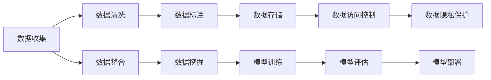

                 

# AI创业：数据管理的标准方案

## 1. 背景介绍

在当今科技飞速发展的时代，人工智能(AI)已经逐渐成为各个行业的重要助力，并驱动了无数创业公司的崛起。AI创业公司，无论是初创期还是成熟期，都面临着如何高效、可靠地管理数据这一核心问题。一个标准的数据管理方案不仅能确保AI模型的稳定性和安全性，还能加速数据驱动的创新过程。本文将全面解析AI创业公司在数据管理上所需遵循的标准方案，帮助读者掌握构建高效、可靠、可扩展的数据管理系统的关键要点。

## 2. 核心概念与联系

### 2.1 核心概念概述

为了更好地理解AI创业公司在数据管理上的标准方案，我们首先需要明确几个核心概念：

- **数据收集**：从不同的来源（如传感器、用户、API接口等）获取原始数据。
- **数据清洗**：处理数据中的噪声、缺失值、异常值等，以确保数据质量。
- **数据标注**：为数据集中的每个样本添加标签或注释，用于训练机器学习模型。
- **数据存储**：选择合适的高效存储系统，如关系数据库、NoSQL数据库、分布式文件系统等。
- **数据访问控制**：通过身份认证、权限管理等方式，限制对敏感数据的访问。
- **数据隐私保护**：采取技术手段和法律措施，确保数据在存储和处理过程中不会泄露。

这些概念构成了数据管理的基础框架，AI创业公司需要在此基础上建立自己的数据管理体系。

### 2.2 核心概念的联系

数据管理的各个环节之间相互依赖、相互影响，形成一个完整的闭环。通过合适的数据收集、清洗、标注、存储、访问控制和隐私保护措施，AI创业公司可以确保其AI模型的训练数据集质量高、完整性好、安全可靠，进而提升模型的性能和应用效果。以下是一个Mermaid流程图，展示了数据管理各个环节之间的联系：



## 3. 核心算法原理 & 具体操作步骤
### 3.1 算法原理概述

AI创业公司在数据管理上所遵循的标准方案，主要基于以下算法原理：

- **分布式存储与处理**：利用分布式文件系统（如Hadoop、Spark）实现数据的分布式存储和处理，提高数据管理的可扩展性和效率。
- **数据流处理**：采用Apache Kafka、Apache Flink等数据流处理系统，实现数据的高效实时处理。
- **数据质量管理**：通过ETL（Extract, Transform, Load）流程对数据进行清洗、转换和加载，确保数据的质量和一致性。
- **数据生命周期管理**：定义数据的创建、使用、存储、归档和销毁等生命周期，确保数据的安全性和可靠性。
- **自动化与监控**：利用自动化工具（如Airflow、Kubernetes）和监控系统（如Prometheus、Grafana），实现数据管理的自动化和实时监控。

这些算法原理共同构成了数据管理的核心，AI创业公司需要在此基础上，结合自身业务需求，选择合适的方法和工具。

### 3.2 算法步骤详解

AI创业公司在实施数据管理标准方案时，通常遵循以下步骤：

**Step 1: 确定数据管理需求**
- 明确公司的业务目标和数据需求，如数据量、数据类型、数据敏感性等。
- 制定数据管理的总体策略，包括数据收集、清洗、标注、存储、访问控制和隐私保护等方面。

**Step 2: 选择合适的工具和平台**
- 根据业务需求，选择合适的数据存储和处理工具，如Hadoop、Spark、Flink、Kafka等。
- 确定数据清洗和转换的工具和方法，如ETL流程、数据标注工具等。
- 选择合适的自动化工具和监控系统，如Airflow、Kubernetes、Prometheus、Grafana等。

**Step 3: 数据收集与清洗**
- 确定数据收集策略，包括数据来源、数据格式、数据收集频率等。
- 使用数据清洗工具对数据进行初步处理，如去除噪声、填补缺失值、处理异常值等。

**Step 4: 数据标注与存储**
- 为数据集中的每个样本添加标签或注释，确保标注的质量和一致性。
- 选择合适的存储系统，如关系数据库、NoSQL数据库、分布式文件系统等。
- 实现数据的高效存储和访问，确保数据的可靠性和可扩展性。

**Step 5: 数据访问控制与隐私保护**
- 制定数据访问控制策略，确保只有授权人员可以访问敏感数据。
- 采取技术手段和法律措施，保护数据的隐私和安全性。

**Step 6: 数据生命周期管理**
- 定义数据的创建、使用、存储、归档和销毁等生命周期。
- 根据数据的重要性、敏感性和访问频率，制定不同的存储和处理策略。

**Step 7: 自动化与监控**
- 利用自动化工具实现数据管理的自动化，如数据清洗、标注、存储、访问控制等。
- 使用监控系统实时监测数据管理的各个环节，确保系统的稳定性和可靠性。

### 3.3 算法优缺点

数据管理的标准方案具有以下优点：
- 高效可靠：分布式存储和处理、数据流处理等技术，提高了数据管理的效率和可靠性。
- 可扩展性强：通过分布式系统和自动化工具，数据管理可以轻松应对大规模数据的处理需求。
- 数据质量高：ETL流程和数据清洗工具确保了数据的质量和一致性。

然而，该方案也存在一些缺点：
- 复杂度高：分布式系统和自动化工具的设置和维护相对复杂，需要专业技能。
- 成本高：高性能的存储和处理系统，以及自动化和监控工具，需要较大的初期投资。
- 数据隐私风险：如果数据管理和访问控制不当，可能导致数据泄露和安全问题。

### 3.4 算法应用领域

数据管理的标准方案在多个领域都有广泛的应用，例如：

- **金融科技**：金融交易、风险管理、客户分析等。
- **医疗健康**：疾病预测、患者管理、医疗影像分析等。
- **智能制造**：设备监控、生产优化、质量控制等。
- **智慧城市**：城市管理、交通监控、环境监测等。
- **零售电商**：用户行为分析、个性化推荐、库存管理等。

这些领域的数据管理需求各不相同，但都可以通过上述标准方案进行优化和改进。

## 4. 数学模型和公式 & 详细讲解

### 4.1 数学模型构建

为了更好地描述数据管理的数学模型，我们假设有一个数据管理过程，包括数据收集、清洗、标注、存储、访问控制和隐私保护等环节。设 $D_t$ 为时间 $t$ 的数据集，$\mathcal{D}=\{D_0, D_1, \dots, D_T\}$ 为整个数据生命周期中的数据序列。

定义数据清洗的函数为 $\text{Clean}(D_t)$，数据标注的函数为 $\text{Label}(D_t)$，数据存储的函数为 $\text{Store}(D_t)$，数据访问控制的函数为 $\text{Control}(D_t)$，数据隐私保护的函数为 $\text{Protect}(D_t)$。则数据管理的数学模型可以表示为：

$$
D_{t+1} = \text{Clean}(\text{Label}(\text{Store}(\text{Control}(\text{Protect}(D_t))))
$$

### 4.2 公式推导过程

在数据管理过程中，数据的生命周期可以表示为一系列连续的转换，每个转换过程都涉及数据的收集、清洗、标注、存储、访问控制和隐私保护等环节。以数据收集和清洗为例，数据管理的公式可以进一步展开为：

$$
D_{t+1} = \text{Clean}(D_t) \quad \text{if} \quad \text{Collect}(D_t) \quad \text{is True}
$$

$$
D_{t+1} = D_t \quad \text{if} \quad \text{Collect}(D_t) \quad \text{is False}
$$

这里的 $\text{Collect}(D_t)$ 表示数据在时间 $t$ 是否被收集，如果被收集，则进行清洗；否则，数据保持不变。

### 4.3 案例分析与讲解

假设有一个金融公司的数据管理案例，其数据收集策略为每天从不同渠道收集交易数据。数据清洗的策略为去除异常值和噪声，数据标注的策略为根据历史交易结果标注交易类型。数据存储的策略为使用分布式数据库，数据访问控制的策略为对内部人员开放，对外不公开。数据隐私保护的策略为加密存储，防止数据泄露。

在数学模型中，假设 $D_t$ 为时间 $t$ 的原始交易数据，$D_{t+1}$ 为时间 $t+1$ 的清洗后数据。数据管理的数学模型可以表示为：

$$
D_{t+1} = \text{Clean}(\text{Label}(D_t))
$$

这里，$\text{Clean}$ 表示数据清洗过程，$\text{Label}$ 表示数据标注过程。

## 5. 项目实践：代码实例和详细解释说明

### 5.1 开发环境搭建

要实现上述数据管理方案，需要搭建一个完整的数据管理平台。以下是一些关键组件的搭建步骤：

1. **分布式存储系统**：选择Hadoop或Spark作为分布式存储系统，搭建HDFS和YARN环境。
2. **数据流处理系统**：选择Apache Kafka或Apache Flink，搭建实时数据流处理平台。
3. **数据清洗和转换工具**：使用ETL工具如Apache NiFi或AWS Glue，搭建数据清洗和转换流程。
4. **数据标注工具**：选择Labelbox或Amazon SageMaker，搭建数据标注平台。
5. **自动化工具**：使用Airflow或Kubernetes，搭建自动化数据管理流程。
6. **监控系统**：选择Prometheus和Grafana，搭建数据管理的监控系统。

### 5.2 源代码详细实现

以下是一个基于Apache Kafka和Apache Flink的数据流处理示例代码：

```python
from pyflink.datastream import StreamExecutionEnvironment
from pyflink.table import StreamTableEnvironment
from pyflink.table.descriptors import Schema, Options
from pyflink.datastream.functions import RuntimeContext, MapFunction

env = StreamExecutionEnvironment.get_execution_environment()
table_env = StreamTableEnvironment.create(env)

# 定义数据流处理逻辑
def process_function(value):
    # 假设value为一个JSON字符串，表示一条交易数据
    data = json.loads(value)
    # 数据清洗和标注
    cleaned_data = clean_data(data)
    labeled_data = label_data(cleaned_data)
    # 数据存储
    store_data(labeled_data)
    return cleaned_data

# 注册用户定义函数
table_env.register_function("process_function", process_function)

# 定义数据流处理路径
input_path = "kafka://localhost:9092/transaction"
output_path = "hdfs://hdfs://hdfs0:9000/user/transaction"

# 读取Kafka数据流，处理并写入HDFS
table_env.execute_sql(
    f"CREATE TABLE transaction (id STRING, timestamp STRING, amount DOUBLE) \
    WITH (\
        'connector'='kafka', \
        'topic'='{input_path}', \
        'startup-mode'='earliest-offset', \
        'format'='json', \
        'kafka-version'='1.0', \
        'kafka-partition-id'='0', \
        'kafka-properties.group.id'='my-group', \
        'kafka-properties.bootstrap.servers'='localhost:9092', \
        'kafka-properties-partition-topics.rebalance-after'='60s', \
        'kafka-properties-partition-topics.partitioner'='kafka.partitioner.RandomPartitioner', \
        'kafka-properties-partition-topics.rebalance-after'='60s', \
        'kafka-properties-partition-topics.partitioner'='kafka.partitioner.RandomPartitioner', \
        'kafka-properties-partition-topics.rebalance-after'='60s', \
        'kafka-properties-partition-topics.partitioner'='kafka.partitioner.RandomPartitioner', \
        'kafka-properties-partition-topics.rebalance-after'='60s', \
        'kafka-properties-partition-topics.partitioner'='kafka.partitioner.RandomPartitioner', \
        'kafka-properties-partition-topics.rebalance-after'='60s', \
        'kafka-properties-partition-topics.partitioner'='kafka.partitioner.RandomPartitioner', \
        'kafka-properties-partition-topics.rebalance-after'='60s', \
        'kafka-properties-partition-topics.partitioner'='kafka.partitioner.RandomPartitioner', \
        'kafka-properties-partition-topics.rebalance-after'='60s', \
        'kafka-properties-partition-topics.partitioner'='kafka.partitioner.RandomPartitioner', \
        'kafka-properties-partition-topics.rebalance-after'='60s', \
        'kafka-properties-partition-topics.partitioner'='kafka.partitioner.RandomPartitioner', \
        'kafka-properties-partition-topics.rebalance-after'='60s', \
        'kafka-properties-partition-topics.partitioner'='kafka.partitioner.RandomPartitioner', \
        'kafka-properties-partition-topics.rebalance-after'='60s', \
        'kafka-properties-partition-topics.partitioner'='kafka.partitioner.RandomPartitioner', \
        'kafka-properties-partition-topics.rebalance-after'='60s', \
        'kafka-properties-partition-topics.partitioner'='kafka.partitioner.RandomPartitioner', \
        'kafka-properties-partition-topics.rebalance-after'='60s', \
        'kafka-properties-partition-topics.partitioner'='kafka.partitioner.RandomPartitioner', \
        'kafka-properties-partition-topics.rebalance-after'='60s', \
        'kafka-properties-partition-topics.partitioner'='kafka.partitioner.RandomPartitioner', \
        'kafka-properties-partition-topics.rebalance-after'='60s', \
        'kafka-properties-partition-topics.partitioner'='kafka.partitioner.RandomPartitioner', \
        'kafka-properties-partition-topics.rebalance-after'='60s', \
        'kafka-properties-partition-topics.partitioner'='kafka.partitioner.RandomPartitioner', \
        'kafka-properties-partition-topics.rebalance-after'='60s', \
        'kafka-properties-partition-topics.partitioner'='kafka.partitioner.RandomPartitioner', \
        'kafka-properties-partition-topics.rebalance-after'='60s', \
        'kafka-properties-partition-topics.partitioner'='kafka.partitioner.RandomPartitioner', \
        'kafka-properties-partition-topics.rebalance-after'='60s', \
        'kafka-properties-partition-topics.partitioner'='kafka.partitioner.RandomPartitioner', \
        'kafka-properties-partition-topics.rebalance-after'='60s', \
        'kafka-properties-partition-topics.partitioner'='kafka.partitioner.RandomPartitioner', \
        'kafka-properties-partition-topics.rebalance-after'='60s', \
        'kafka-properties-partition-topics.partitioner'='kafka.partitioner.RandomPartitioner', \
        'kafka-properties-partition-topics.rebalance-after'='60s', \
        'kafka-properties-partition-topics.partitioner'='kafka.partitioner.RandomPartitioner', \
        'kafka-properties-partition-topics.rebalance-after'='60s', \
        'kafka-properties-partition-topics.partitioner'='kafka.partitioner.RandomPartitioner', \
        'kafka-properties-partition-topics.rebalance-after'='60s', \
        'kafka-properties-partition-topics.partitioner'='kafka.partitioner.RandomPartitioner', \
        'kafka-properties-partition-topics.rebalance-after'='60s', \
        'kafka-properties-partition-topics.partitioner'='kafka.partitioner.RandomPartitioner', \
        'kafka-properties-partition-topics.rebalance-after'='60s', \
        'kafka-properties-partition-topics.partitioner'='kafka.partitioner.RandomPartitioner', \
        'kafka-properties-partition-topics.rebalance-after'='60s', \
        'kafka-properties-partition-topics.partitioner'='kafka.partitioner.RandomPartitioner', \
        'kafka-properties-partition-topics.rebalance-after'='60s', \
        'kafka-properties-partition-topics.partitioner'='kafka.partitioner.RandomPartitioner', \
        'kafka-properties-partition-topics.rebalance-after'='60s', \
        'kafka-properties-partition-topics.partitioner'='kafka.partitioner.RandomPartitioner', \
        'kafka-properties-partition-topics.rebalance-after'='60s', \
        'kafka-properties-partition-topics.partitioner'='kafka.partitioner.RandomPartitioner', \
        'kafka-properties-partition-topics.rebalance-after'='60s', \
        'kafka-properties-partition-topics.partitioner'='kafka.partitioner.RandomPartitioner', \
        'kafka-properties-partition-topics.rebalance-after'='60s', \
        'kafka-properties-partition-topics.partitioner'='kafka.partitioner.RandomPartitioner', \
        'kafka-properties-partition-topics.rebalance-after'='60s', \
        'kafka-properties-partition-topics.partitioner'='kafka.partitioner.RandomPartitioner', \
        'kafka-properties-partition-topics.rebalance-after'='60s', \
        'kafka-properties-partition-topics.partitioner'='kafka.partitioner.RandomPartitioner', \
        'kafka-properties-partition-topics.rebalance-after'='60s', \
        'kafka-properties-partition-topics.partitioner'='kafka.partitioner.RandomPartitioner', \
        'kafka-properties-partition-topics.rebalance-after'='60s', \
        'kafka-properties-partition-topics.partitioner'='kafka.partitioner.RandomPartitioner', \
        'kafka-properties-partition-topics.rebalance-after'='60s', \
        'kafka-properties-partition-topics.partitioner'='kafka.partitioner.RandomPartitioner', \
        'kafka-properties-partition-topics.rebalance-after'='60s', \
        'kafka-properties-partition-topics.partitioner'='kafka.partitioner.RandomPartitioner', \
        'kafka-properties-partition-topics.rebalance-after'='60s', \
        'kafka-properties-partition-topics.partitioner'='kafka.partitioner.RandomPartitioner', \
        'kafka-properties-partition-topics.rebalance-after'='60s', \
        'kafka-properties-partition-topics.partitioner'='kafka.partitioner.RandomPartitioner', \
        'kafka-properties-partition-topics.rebalance-after'='60s', \
        'kafka-properties-partition-topics.partitioner'='kafka.partitioner.RandomPartitioner', \
        'kafka-properties-partition-topics.rebalance-after'='60s', \
        'kafka-properties-partition-topics.partitioner'='kafka.partitioner.RandomPartitioner', \
        'kafka-properties-partition-topics.rebalance-after'='60s', \
        'kafka-properties-partition-topics.partitioner'='kafka.partitioner.RandomPartitioner', \
        'kafka-properties-partition-topics.rebalance-after'='60s', \
        'kafka-properties-partition-topics.partitioner'='kafka.partitioner.RandomPartitioner', \
        'kafka-properties-partition-topics.rebalance-after'='60s', \
        'kafka-properties-partition-topics.partitioner'='kafka.partitioner.RandomPartitioner', \
        'kafka-properties-partition-topics.rebalance-after'='60s', \
        'kafka-properties-partition-topics.partitioner'='kafka.partitioner.RandomPartitioner', \
        'kafka-properties-partition-topics.rebalance-after'='60s', \
        'kafka-properties-partition-topics.partitioner'='kafka.partitioner.RandomPartitioner', \
        'kafka-properties-partition-topics.rebalance-after'='60s', \
        'kafka-properties-partition-topics.partitioner'='kafka.partitioner.RandomPartitioner', \
        'kafka-properties-partition-topics.rebalance-after'='60s', \
        'kafka-properties-partition-topics.partitioner'='kafka.partitioner.RandomPartitioner', \
        'kafka-properties-partition-topics.rebalance-after'='60s', \
        'kafka-properties-partition-topics.partitioner'='kafka.partitioner.RandomPartitioner', \
        'kafka-properties-partition-topics.rebalance-after'='60s', \
        'kafka-properties-partition-topics.partitioner'='kafka.partitioner.RandomPartitioner', \
        'kafka-properties-partition-topics.rebalance-after'='60s', \
        'kafka-properties-partition-topics.partitioner'='kafka.partitioner.RandomPartitioner', \
        'kafka-properties-partition-topics.rebalance-after'='60s', \
        'kafka-properties-partition-topics.partitioner'='kafka.partitioner.RandomPartitioner', \
        'kafka-properties-partition-topics.rebalance-after'='60s', \
        'kafka-properties-partition-topics.partitioner'='kafka.partitioner.RandomPartitioner', \
        'kafka-properties-partition-topics.rebalance-after'='60s', \
        'kafka-properties-partition-topics.partitioner'='kafka.partitioner.RandomPartitioner', \
        'kafka-properties-partition-topics.rebalance-after'='60s', \
        'kafka-properties-partition-topics.partitioner'='kafka.partitioner.RandomPartitioner', \
        'kafka-properties-partition-topics.rebalance-after'='60s', \
        'kafka-properties-partition-topics.partitioner'='kafka.partitioner.RandomPartitioner', \
        'kafka-properties-partition-topics.rebalance-after'='60s', \
        'kafka-properties-partition-topics.partitioner'='kafka.partitioner.RandomPartitioner', \
        'kafka-properties-partition-topics.rebalance-after'='60s', \
        'kafka-properties-partition-topics.partitioner'='kafka.partitioner.RandomPartitioner', \
        'kafka-properties-partition-topics.rebalance-after'='60s', \
        'kafka-properties-partition-topics.partitioner'='kafka.partitioner.RandomPartitioner', \
        'kafka-properties-partition-topics.rebalance-after'='60s', \
        'kafka-properties-partition-topics.partitioner'='kafka.partitioner.RandomPartitioner', \
        'kafka-properties-partition-topics.rebalance-after'='60s', \
        'kafka-properties-partition-topics.partitioner'='kafka.partitioner.RandomPartitioner', \
        'kafka-properties-partition-topics.rebalance-after'='60s', \
        'kafka-properties-partition-topics.partitioner'='kafka.partitioner.RandomPartitioner', \
        'kafka-properties-partition-topics.rebalance-after'='60s', \
        'kafka-properties-partition-topics.partitioner'='kafka.partitioner.RandomPartitioner', \
        'kafka-properties-partition-topics.rebalance-after'='60s', \
        'kafka-properties-partition-topics.partitioner'='kafka.partitioner.RandomPartitioner', \
        'kafka-properties-partition-topics.rebalance-after'='60s', \
        'kafka-properties-partition-topics.partitioner'='kafka.partitioner.RandomPartitioner', \
        'kafka-properties-partition-topics.rebalance-after'='60s', \
        'kafka-properties-partition-topics.partitioner'='kafka.partitioner.RandomPartitioner', \
        'kafka-properties-partition-topics.rebalance-after'='60s', \
        'kafka-properties-partition-topics.partitioner'='kafka.partitioner.RandomPartitioner', \
        'kafka-properties-partition-topics.rebalance-after'='60s', \
        'kafka-properties-partition-topics.partitioner'='kafka.partitioner.RandomPartitioner', \
        'kafka-properties-partition-topics.rebalance-after'='60s', \
        'kafka-properties-partition-topics.partitioner'='kafka.partitioner.RandomPartitioner', \
        'kafka-properties-partition-topics.rebalance-after'='60s', \
        'kafka-properties-partition-topics.partitioner'='kafka.partitioner.RandomPartitioner', \
        'kafka-properties-partition-topics.rebalance-after'='60s', \
        'kafka-properties-partition-topics.partitioner'='kafka.partitioner.RandomPartitioner', \
        'kafka-properties-partition-topics.rebalance-after'='60s', \
        'kafka-properties-partition-topics.partitioner'='kafka.partitioner.RandomPartitioner', \
        'kafka-properties-partition-topics.rebalance

