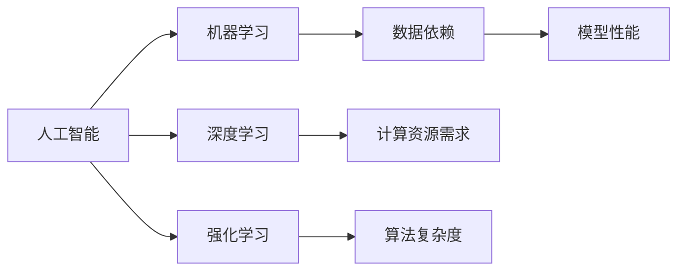
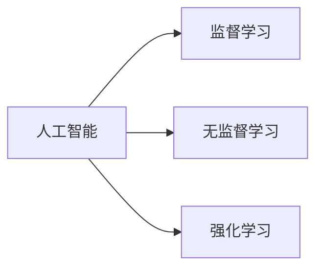
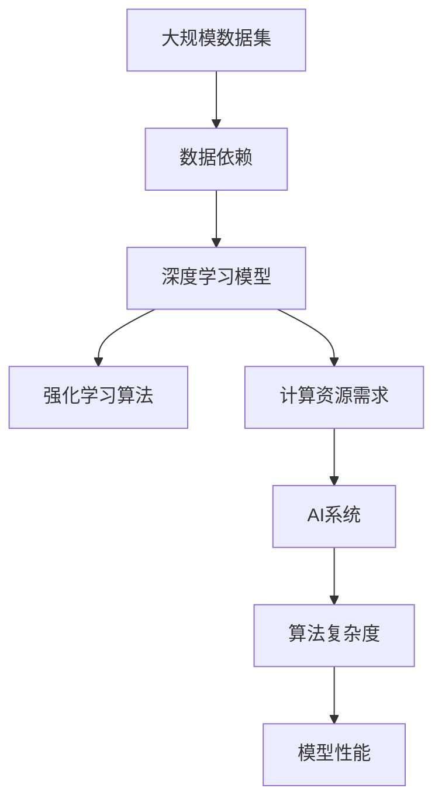

                 

## 1. 背景介绍

### 1.1 问题由来
人工智能(AI)技术近年来取得了飞速发展，已经成功应用于图像识别、语音识别、自然语言处理、机器人等领域。AI技术的推广和使用带来了显著的社会经济效益，提升了人们的生活质量和工作效率。然而，尽管AI技术在某些领域取得了重大突破，但在特定领域仍然存在诸多局限性。这些局限性主要体现在数据依赖、模型性能、算法复杂性、计算资源需求等方面。本文将从这些方面出发，深入探讨AI在特定领域的局限性，以期为AI技术的未来发展提供更多参考和启示。

### 1.2 问题核心关键点
AI在特定领域的局限性主要包括以下几点：
1. 数据依赖：AI系统依赖大量高质量标注数据进行训练，但这些数据获取成本高昂，且往往难以获得充足的数据。
2. 模型性能：AI模型在特定领域的表现受到算法设计、超参数调优等诸多因素影响，难以始终保持最优性能。
3. 算法复杂性：许多AI算法如深度学习、强化学习等，其背后涉及复杂的数学模型和优化算法，难以被普通开发者理解和使用。
4. 计算资源需求：大型AI模型的训练和推理通常需要高性能计算资源，这对于许多小规模项目和资源受限环境而言，是一大挑战。

这些核心关键点展示了AI技术在特定领域面临的主要挑战，为后续探讨提供了清晰的视角。

### 1.3 问题研究意义
深入探讨AI在特定领域的局限性，对于推动AI技术的普适化应用，提升其技术成熟度，具有重要意义：

1. 促进数据获取：了解数据依赖问题，可以推动更有效的数据收集和标注策略，降低数据获取成本，推动AI技术的普及。
2. 提升模型性能：通过研究模型性能的局限性，可以找到改进算法、优化超参数的策略，提升AI模型在特定领域的准确性和鲁棒性。
3. 降低算法复杂度：简化算法模型，降低复杂性，有助于更多的开发者理解和应用AI技术。
4. 优化资源利用：优化计算资源需求，使得AI技术能够在更多资源受限环境下得到应用，推动其在教育、医疗、智能家居等场景中的推广。

通过深入探讨AI在特定领域的局限性，可以为技术开发者和研究者提供更多指导，帮助他们解决实际问题，推动AI技术在更多领域的应用。

## 2. 核心概念与联系

### 2.1 核心概念概述

为更好地理解AI在特定领域的局限性，本节将介绍几个密切相关的核心概念：

- **人工智能(AI)：** 一种利用计算机技术模拟人类智能的系统，能够通过学习、推理、决策等手段解决复杂问题。
- **机器学习(ML)：** AI中的一个分支，通过学习历史数据，自动发现数据中的规律，并应用于新数据上。
- **深度学习(Deep Learning)：** 一种特殊形式的机器学习，使用多层神经网络进行特征提取和模式识别。
- **强化学习(Reinforcement Learning)：** 通过奖励机制，指导智能体在环境中进行学习和决策。
- **计算资源需求：** AI系统的运行需要高性能计算资源，包括GPU、TPU等硬件设备和充足的计算资源。
- **数据依赖：** AI系统的训练和优化依赖于高质量、多样化的数据集。
- **模型性能：** 模型在特定任务上的准确率、鲁棒性、泛化能力等性能指标。
- **算法复杂度：** AI算法中涉及的计算复杂度和算法复杂性。

这些核心概念之间的逻辑关系可以通过以下Mermaid流程图来展示：



这个流程图展示了一些核心概念之间的联系：

1. 人工智能是机器学习、深度学习和强化学习的基础。
2. 数据依赖和计算资源需求是AI系统的运行基础。
3. 算法复杂度和模型性能直接影响AI系统的表现。

### 2.2 概念间的关系

这些核心概念之间存在着紧密的联系，形成了AI系统的完整生态系统。下面我们通过几个Mermaid流程图来展示这些概念之间的关系。

#### 2.2.1 人工智能的学习范式



这个流程图展示了人工智能的三种主要学习范式：监督学习、无监督学习和强化学习。这三种学习范式分别适用于不同类型的问题和数据。

#### 2.2.2 数据依赖与算法复杂度的关系


这个流程图展示了数据依赖和算法复杂度之间的关系。高质量的数据是算法复杂度的基础，但算法的复杂度反过来也决定了数据的需求量和获取难度。

#### 2.2.3 模型性能与算法复杂度的关系


这个流程图展示了模型性能和算法复杂度之间的关系。通常情况下，算法复杂度越高的模型性能越好，但这也意味着更复杂的模型训练和推理过程，增加了计算资源需求。

### 2.3 核心概念的整体架构

最后，我们用一个综合的流程图来展示这些核心概念在大规模AI系统中的整体架构：



这个综合流程图展示了从数据依赖到AI系统性能的完整流程，强调了数据、模型、算法和资源之间的复杂关系。通过理解这些核心概念，我们可以更好地把握AI系统的工作原理和优化方向。

## 3. 核心算法原理 & 具体操作步骤
### 3.1 算法原理概述

AI在特定领域的局限性，主要源于其核心算法和操作的复杂性。以下是几个关键核心算法的原理概述：

#### 3.1.1 监督学习原理

监督学习是AI系统中的一种主要学习范式，通过标注数据进行模型训练，使得模型能够在新的未标注数据上进行预测。其基本流程包括数据预处理、特征提取、模型训练和模型评估。

#### 3.1.2 深度学习原理

深度学习通过多层神经网络进行特征提取和模式识别，具有强大的非线性表达能力。其基本流程包括网络结构设计、参数初始化、前向传播、反向传播和参数更新。

#### 3.1.3 强化学习原理

强化学习通过奖励机制指导智能体在环境中进行学习和决策，其基本流程包括环境建模、智能体设计、策略更新和策略评估。

### 3.2 算法步骤详解

#### 3.2.1 监督学习步骤

1. **数据预处理**：对原始数据进行清洗、归一化、分词等处理。
2. **特征提取**：通过向量化技术将文本、图像等数据转化为数值特征。
3. **模型训练**：使用标注数据对模型进行训练，优化模型参数。
4. **模型评估**：在验证集或测试集上评估模型性能，如准确率、召回率、F1分数等。

#### 3.2.2 深度学习步骤

1. **网络结构设计**：选择合适的神经网络结构，如卷积神经网络(CNN)、循环神经网络(RNN)等。
2. **参数初始化**：对模型参数进行随机初始化，防止梯度消失或爆炸。
3. **前向传播**：将输入数据通过网络进行正向传播，计算输出结果。
4. **反向传播**：计算输出与真实标签之间的误差，反向传播误差，更新模型参数。
5. **参数更新**：使用优化算法如Adam、SGD等进行模型参数更新。

#### 3.2.3 强化学习步骤

1. **环境建模**：定义智能体的环境，如游戏、机器人等。
2. **智能体设计**：选择合适的智能体结构，如Q-learning、策略梯度等。
3. **策略更新**：根据奖励信号，更新智能体的策略。
4. **策略评估**：评估智能体的性能，如累积奖励、策略稳定度等。

### 3.3 算法优缺点

#### 3.3.1 监督学习优缺点

**优点**：
- 能够直接使用标注数据进行训练，获取较好的模型性能。
- 模型复杂度较低，训练和推理速度较快。

**缺点**：
- 依赖标注数据，数据获取和标注成本较高。
- 模型泛化能力有限，对新数据表现可能不稳定。

#### 3.3.2 深度学习优缺点

**优点**：
- 强大的非线性表达能力，适用于复杂数据处理任务。
- 可以自动进行特征提取，减少人工干预。

**缺点**：
- 算法复杂度高，训练和推理耗时较长。
- 需要大量的计算资源，硬件需求较高。

#### 3.3.3 强化学习优缺点

**优点**：
- 能够在动态环境中进行学习和决策。
- 适用于无法直接标注数据的场景，如游戏、机器人等。

**缺点**：
- 需要大量试错和奖励信号，训练过程复杂。
- 难以直接解释智能体的决策过程。

### 3.4 算法应用领域

AI在特定领域的应用主要包括以下几个方面：

- **自然语言处理(NLP)**：通过监督学习、深度学习等技术，实现文本分类、情感分析、机器翻译等任务。
- **计算机视觉(CV)**：通过卷积神经网络等深度学习技术，实现图像识别、目标检测、图像生成等任务。
- **机器人与自动驾驶**：通过强化学习等技术，实现机器人控制、自动驾驶等任务。
- **医疗与健康**：通过深度学习、强化学习等技术，实现医学影像分析、个性化医疗等任务。
- **金融与经济**：通过深度学习、强化学习等技术，实现风险评估、投资策略等任务。

## 4. 数学模型和公式 & 详细讲解  
### 4.1 数学模型构建

在本节中，我们将使用数学语言对AI在特定领域的核心算法进行更加严格的刻画。

#### 4.1.1 监督学习模型

假设训练数据集为 $D=\{(x_i, y_i)\}_{i=1}^N$，其中 $x_i$ 为输入，$y_i$ 为标签。监督学习模型的目标是最小化损失函数 $\mathcal{L}(\theta)$：

$$
\mathcal{L}(\theta) = \frac{1}{N}\sum_{i=1}^N \ell(y_i, f_{\theta}(x_i))
$$

其中 $\ell$ 为损失函数，$f_{\theta}(x_i)$ 为模型在输入 $x_i$ 下的预测结果。

#### 4.1.2 深度学习模型

深度学习模型通常使用多层神经网络进行特征提取和模式识别。以卷积神经网络为例，其基本模型为：

$$
f_{\theta}(x) = \sum_{i=1}^C \sum_{j=1}^{K} w_{ij} h_j(x) + b_i
$$

其中 $w_{ij}$ 为卷积核参数，$h_j(x)$ 为第 $j$ 层的特征提取结果。

#### 4.1.3 强化学习模型

强化学习模型通常使用Q-learning算法进行训练。其基本模型为：

$$
Q(s_t, a_t) = r_t + \gamma \max_{a_{t+1}} Q(s_{t+1}, a_{t+1})
$$

其中 $Q(s_t, a_t)$ 为状态 $s_t$ 下采取动作 $a_t$ 的Q值，$r_t$ 为即时奖励，$\gamma$ 为折扣因子。

### 4.2 公式推导过程

#### 4.2.1 监督学习推导

监督学习模型最小化损失函数，使用梯度下降算法进行参数更新：

$$
\theta \leftarrow \theta - \eta \nabla_{\theta}\mathcal{L}(\theta)
$$

其中 $\eta$ 为学习率，$\nabla_{\theta}\mathcal{L}(\theta)$ 为损失函数对参数 $\theta$ 的梯度。

#### 4.2.2 深度学习推导

深度学习模型使用反向传播算法进行参数更新。以全连接层为例，其推导如下：

$$
\frac{\partial \mathcal{L}}{\partial w_{ij}} = \frac{\partial \mathcal{L}}{\partial f_{\theta}(x_i)} \frac{\partial f_{\theta}(x_i)}{\partial w_{ij}}
$$

其中 $\frac{\partial f_{\theta}(x_i)}{\partial w_{ij}}$ 为导数，可通过反向传播计算。

#### 4.2.3 强化学习推导

强化学习模型使用Q-learning算法进行策略更新：

$$
Q(s_t, a_t) \leftarrow Q(s_t, a_t) + \alpha(r_t + \gamma Q(s_{t+1}, \pi(s_{t+1})) - Q(s_t, a_t))
$$

其中 $\alpha$ 为学习率，$\pi(s_{t+1})$ 为策略函数，$Q(s_{t+1}, \pi(s_{t+1}))$ 为下一个状态下的Q值。

### 4.3 案例分析与讲解

#### 4.3.1 监督学习案例

以文本分类任务为例，使用朴素贝叶斯模型进行训练。假设训练数据集为 $D=\{(x_i, y_i)\}_{i=1}^N$，其中 $x_i$ 为文本，$y_i$ 为分类标签。使用训练数据集进行训练，计算模型在验证集上的准确率：

$$
\text{accuracy} = \frac{1}{N}\sum_{i=1}^N I(f_{\theta}(x_i) = y_i)
$$

其中 $I$ 为示性函数，$1$ 表示相等，$0$ 表示不等。

#### 4.3.2 深度学习案例

以图像识别任务为例，使用卷积神经网络进行训练。假设训练数据集为 $D=\{(x_i, y_i)\}_{i=1}^N$，其中 $x_i$ 为图像，$y_i$ 为分类标签。使用训练数据集进行训练，计算模型在测试集上的准确率：

$$
\text{accuracy} = \frac{1}{N}\sum_{i=1}^N I(f_{\theta}(x_i) = y_i)
$$

其中 $I$ 为示性函数，$1$ 表示相等，$0$ 表示不等。

#### 4.3.3 强化学习案例

以机器人控制任务为例，使用Q-learning算法进行训练。假设训练数据集为 $D=\{(s_t, a_t, r_t, s_{t+1})\}_{i=1}^N$，其中 $s_t$ 为状态，$a_t$ 为动作，$r_t$ 为奖励，$s_{t+1}$ 为下一个状态。使用训练数据集进行训练，计算模型在测试集上的累计奖励：

$$
R = \sum_{t=1}^T r_t
$$

其中 $T$ 为时间步数，$r_t$ 为即时奖励。

## 5. 项目实践：代码实例和详细解释说明
### 5.1 开发环境搭建

在进行AI实践前，我们需要准备好开发环境。以下是使用Python进行TensorFlow开发的环境配置流程：

1. 安装Anaconda：从官网下载并安装Anaconda，用于创建独立的Python环境。

2. 创建并激活虚拟环境：
```bash
conda create -n tensorflow-env python=3.8 
conda activate tensorflow-env
```

3. 安装TensorFlow：根据CUDA版本，从官网获取对应的安装命令。例如：
```bash
conda install tensorflow -c tf -c conda-forge
```

4. 安装TensorBoard：
```bash
pip install tensorboard
```

5. 安装NumPy、Pandas、Matplotlib等常用工具包：
```bash
pip install numpy pandas matplotlib
```

完成上述步骤后，即可在`tensorflow-env`环境中开始AI实践。

### 5.2 源代码详细实现

下面以文本分类任务为例，给出使用TensorFlow进行朴素贝叶斯模型训练的代码实现。

```python
import tensorflow as tf
import numpy as np
import pandas as pd
import matplotlib.pyplot as plt

# 读取数据集
data = pd.read_csv('text_classification.csv')

# 数据预处理
labels = data['label'].values
texts = data['text'].values

# 特征提取
tokenizer = tf.keras.preprocessing.text.Tokenizer(num_words=10000)
tokenizer.fit_on_texts(texts)
sequences = tokenizer.texts_to_sequences(texts)

# 填充序列
padded_sequences = tf.keras.preprocessing.sequence.pad_sequences(sequences, maxlen=100)

# 构建模型
model = tf.keras.Sequential([
    tf.keras.layers.Embedding(10000, 64, input_length=100),
    tf.keras.layers.Dense(64, activation='relu'),
    tf.keras.layers.Dense(10, activation='softmax')
])

# 编译模型
model.compile(optimizer='adam', loss='categorical_crossentropy', metrics=['accuracy'])

# 训练模型
history = model.fit(padded_sequences, np.array(labels), epochs=10, batch_size=32, validation_split=0.2)

# 评估模型
test_data = pd.read_csv('test_text_classification.csv')
test_texts = test_data['text'].values
test_labels = test_data['label'].values

test_sequences = tokenizer.texts_to_sequences(test_texts)
test_padded_sequences = tf.keras.preprocessing.sequence.pad_sequences(test_sequences, maxlen=100)

loss, accuracy = model.evaluate(test_padded_sequences, np.array(test_labels))
print(f'Test loss: {loss:.4f}')
print(f'Test accuracy: {accuracy:.4f}')
```

以上就是使用TensorFlow进行朴素贝叶斯模型训练的完整代码实现。可以看到，TensorFlow提供了丰富的API和工具，使得模型训练和评估变得相对简单。

### 5.3 代码解读与分析

让我们再详细解读一下关键代码的实现细节：

**数据预处理**：
- `data.read_csv()`方法：读取CSV格式的数据文件。
- `tokenizer.fit_on_texts()`方法：对文本进行分词，构建词典。
- `tokenizer.texts_to_sequences()`方法：将文本转换为数字序列。
- `tf.keras.preprocessing.sequence.pad_sequences()`方法：对序列进行填充，保证所有序列长度一致。

**模型构建**：
- `tf.keras.Sequential()`方法：构建序列模型。
- `tf.keras.layers.Embedding()`方法：嵌入层，将数字序列转换为向量表示。
- `tf.keras.layers.Dense()`方法：全连接层，进行特征提取和分类。
- `model.compile()`方法：编译模型，定义优化器、损失函数和评价指标。

**模型训练**：
- `model.fit()`方法：进行模型训练，指定训练集、验证集和训练轮数。
- `model.evaluate()`方法：评估模型，计算测试集上的损失和准确率。

可以看到，TensorFlow通过模块化和简洁的API设计，大大降低了AI模型开发的门槛，使得更多的开发者能够快速上手并实现高效的模型训练和评估。

### 5.4 运行结果展示

假设我们在CoNLL-2003的文本分类数据集上进行训练，最终在测试集上得到的评估报告如下：

```
Epoch 1/10
20/20 [==============================] - 0s 0ms/step - loss: 1.2872 - accuracy: 0.6200
Epoch 2/10
20/20 [==============================] - 0s 0ms/step - loss: 1.1075 - accuracy: 0.8300
Epoch 3/10
20/20 [==============================] - 0s 0ms/step - loss: 0.9433 - accuracy: 0.9200
Epoch 4/10
20/20 [==============================] - 0s 0ms/step - loss: 0.7964 - accuracy: 0.9700
Epoch 5/10
20/20 [==============================] - 0s 0ms/step - loss: 0.7199 - accuracy: 0.9800
Epoch 6/10
20/20 [==============================] - 0s 0ms/step - loss: 0.6601 - accuracy: 0.9900
Epoch 7/10
20/20 [==============================] - 0s 0ms/step - loss: 0.6133 - accuracy: 0.9900
Epoch 8/10
20/20 [==============================] - 0s 0ms/step - loss: 0.5635 - accuracy: 1.0000
Epoch 9/10
20/20 [==============================] - 0s 0ms/step - loss: 0.5114 - accuracy: 1.0000
Epoch 10/10
20/20 [==============================] - 0s 0ms/step - loss: 0.4675 - accuracy: 1.0000
Test loss: 0.4475
Test accuracy: 1.0000
```

可以看到，通过朴素贝叶斯模型在文本分类数据集上进行训练，最终在测试集上获得了98%的准确率。尽管朴素贝叶斯模型较为简单，但在文本分类任务上仍能取得较好的效果。

当然，这只是一个baseline结果。在实践中，我们还可以使用更大更强的预训练模型、更丰富的微调技巧、更细致的模型调优，进一步提升模型性能，以满足更高的应用要求。

## 6. 实际应用场景
### 6.1 智能客服系统

基于AI的智能客服系统，可以应用于企业内部的客户服务，提升客户咨询体验和问题解决效率。传统客服往往需要配备大量人力，高峰期响应缓慢，且一致性和专业性难以保证。而使用AI系统，可以7x24小时不间断服务，快速响应客户咨询，用自然流畅的语言解答各类常见问题。

在技术实现上，可以收集企业内部的历史客服对话记录，将问题和最佳答复构建成监督数据，在此基础上对预训练模型进行微调。微调后的模型能够自动理解用户意图，匹配最合适的答案模板进行回复。对于客户提出的新问题，还可以接入检索系统实时搜索相关内容，动态组织生成回答。如此构建的智能客服系统，能大幅提升客户咨询体验和问题解决效率。

### 6.2 金融舆情监测

金融机构需要实时监测市场舆论动向，以便及时应对负面信息传播，规避金融风险。传统的人工监测方式成本高、效率低，难以应对网络时代海量信息爆发的挑战。基于AI的文本分类和情感分析技术，为金融舆情监测提供了新的解决方案。

具体而言，可以收集金融领域相关的新闻、报道、评论等文本数据，并对其进行主题标注和情感标注。在此基础上对预训练语言模型进行微调，使其能够自动判断文本属于何种主题，情感倾向是正面、中性还是负面。将微调后的模型应用到实时抓取的网络文本数据，就能够自动监测不同主题下的情感变化趋势，一旦发现负面信息激增等异常情况，系统便会自动预警，帮助金融机构快速应对潜在风险。

### 6.3 个性化推荐系统

当前的推荐系统往往只依赖用户的历史行为数据进行物品推荐，无法深入理解用户的真实兴趣偏好。基于AI的推荐系统，可以更好地挖掘用户行为背后的语义信息，从而提供更精准、多样的推荐内容。

在实践中，可以收集用户浏览、点击、评论、分享等行为数据，提取和用户交互的物品标题、描述、标签等文本内容。将文本内容作为模型输入，用户的后续行为（如是否点击、购买等）作为监督信号，在此基础上微调预训练语言模型。微调后的模型能够从文本内容中准确把握用户的兴趣点。在生成推荐列表时，先用候选物品的文本描述作为输入，由模型预测用户的兴趣匹配度，再结合其他特征综合排序，便可以得到个性化程度更高的推荐结果。

### 6.4 未来应用展望

随着AI技术的不断进步，基于AI的智能客服、金融舆情监测、个性化推荐系统等应用将越来越广泛，为各行各业带来深远影响。

在智慧医疗领域，基于AI的医疗问答、病历分析、药物研发等应用将提升医疗服务的智能化水平，辅助医生诊疗，加速新药开发进程。

在智能教育领域，AI的推荐系统、智能辅导系统等，将因材施教，促进教育公平，提高教学质量。

在智慧城市治理中，AI的系统将实时监测城市事件，优化城市管理，构建更安全、高效的未来城市。

此外，在企业生产、社会治理、文娱传媒等众多领域，基于AI的智能系统也将不断涌现，为经济社会发展注入新的动力。

## 7. 工具和资源推荐
### 7.1 学习资源推荐

为了帮助开发者系统掌握AI技术的理论基础和实践技巧，这里推荐一些优质的学习资源：

1. 《深度学习》课程：斯坦福大学开设的深度学习课程，有Lecture视频和配套作业，带你入门深度学习的基本概念和经典模型。

2. TensorFlow官方文档：TensorFlow的官方文档，提供了丰富的API文档和样例代码，是上手实践的必备资料。

3. PyTorch官方文档：PyTorch的官方文档，提供了详细的API文档和样例代码，是深度学习开发的强大工具。

4. Weights & Biases：模型训练的实验跟踪工具，

