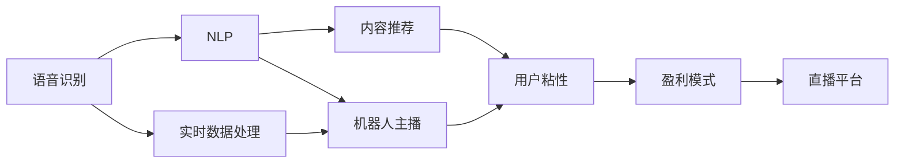
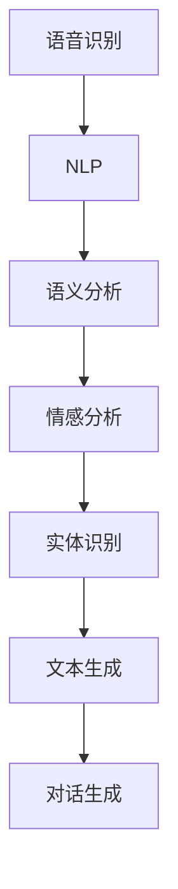
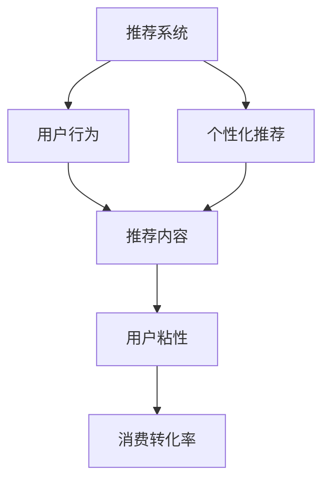
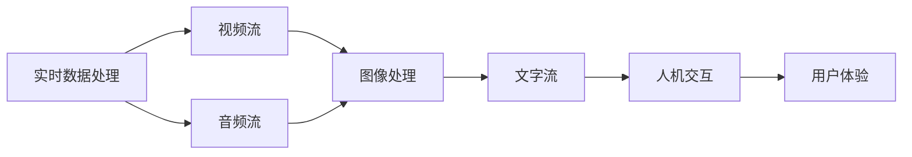
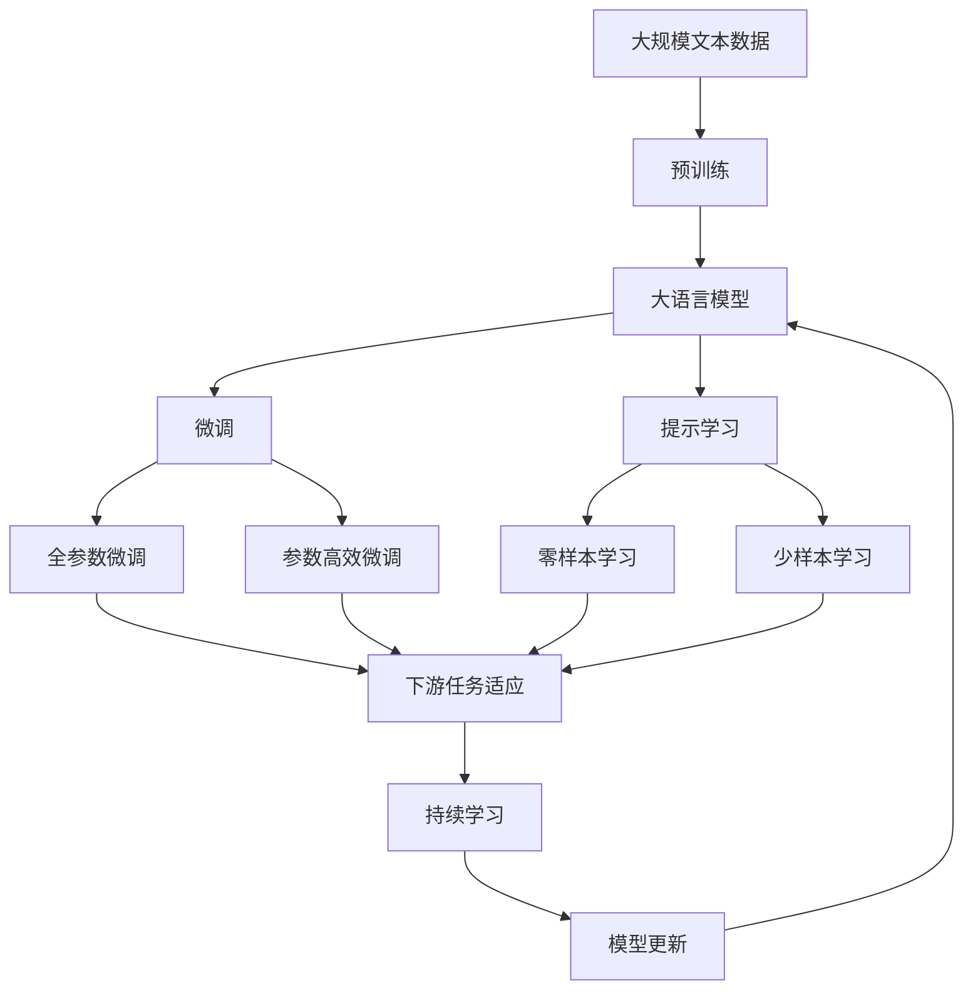

                 

# AI在直播间的应用与商机

> 关键词：
- 人工智能
- 直播技术
- 语音识别
- 自然语言处理
- 推荐系统
- 实时数据处理
- 人机交互

## 1. 背景介绍

### 1.1 问题由来

随着互联网的普及和智能设备的广泛应用，直播成为了一种新的内容形式，满足了人们获取即时信息、参与互动、娱乐放松等多种需求。直播间的出现，不仅改变了人们的社交方式，更带来了巨大的商业机会。然而，直播间的运营面临诸多挑战，如直播内容质量的控制、用户行为分析、个性化推荐等，这些都需要借助先进的技术手段来解决。

人工智能（AI）作为推动技术创新的重要力量，已经开始在直播间的各个环节发挥重要作用。AI技术不仅能够提升直播内容的质量，还能够提升用户体验，带来新的商业模式，具有广泛的应用前景。本文将对AI在直播间的应用进行深入探讨，并分析其背后的商机。

### 1.2 问题核心关键点

AI在直播间的应用主要集中在以下几个方面：

- **语音识别**：通过语音识别技术，将直播间的声音信号转化为文本，便于后续的自然语言处理（NLP）和理解。
- **自然语言处理（NLP）**：对直播间的语音和文字进行语义分析，实现机器人主播、内容推荐等功能。
- **推荐系统**：根据用户行为和偏好，推荐个性化内容，提升用户粘性和消费转化率。
- **实时数据处理**：对直播间的实时数据进行高效处理，实现数据驱动的决策支持。
- **人机交互**：通过AI技术提升人机交互的流畅度和智能化程度，提供更好的用户体验。

这些核心技术的应用，使得AI在直播间的商业价值得到了充分释放，成为推动直播行业发展的重要力量。

### 1.3 问题研究意义

研究AI在直播间的应用，对于推动直播行业的技术创新和商业模式的创新具有重要意义：

- **技术创新**：AI技术的引入，可以提升直播内容的质量和多样性，满足用户的不同需求。
- **商业模式创新**：基于AI技术的内容推荐和用户行为分析，可以提升直播间的运营效率，带来新的盈利模式。
- **用户体验提升**：通过AI技术提升人机交互，可以增强用户的参与感和满意度，提升直播间的市场竞争力。
- **数据驱动决策**：AI技术对实时数据的处理和分析，可以提供决策支持，优化直播间的运营策略。

总之，AI技术在直播间的应用，不仅能够提升直播内容的质量和用户的体验，还能够带来新的商业模式和盈利机会，具有广泛的应用前景。

## 2. 核心概念与联系

### 2.1 核心概念概述

为更好地理解AI在直播间的应用，本节将介绍几个密切相关的核心概念：

- **语音识别**：将语音信号转换为文本的过程，是AI在直播间的第一步应用。
- **自然语言处理（NLP）**：对文本进行语义分析、情感分析、实体识别等，实现机器理解和生成。
- **推荐系统**：根据用户行为和偏好，推荐个性化的内容，提升用户体验和消费转化率。
- **实时数据处理**：对直播间的实时数据进行高效处理，包括视频流、音频流、文字流等。
- **人机交互**：通过AI技术提升人机交互的流畅度和智能化程度，提供更好的用户体验。

这些核心概念之间的逻辑关系可以通过以下Mermaid流程图来展示：



这个流程图展示了AI在直播间的核心概念及其之间的关系：

1. 语音识别将直播间的声音信号转化为文本。
2. NLP技术对文本进行语义分析，实现机器人主播和内容推荐等功能。
3. 实时数据处理对直播间的实时数据进行高效处理。
4. 人机交互提升人机交互的流畅度和智能化程度。
5. 内容推荐提升用户粘性和消费转化率，带来新的盈利模式。

这些核心概念共同构成了AI在直播间的应用框架，使其能够提供高质量、多样化的直播内容，提升用户体验和运营效率。

### 2.2 概念间的关系

这些核心概念之间存在着紧密的联系，形成了AI在直播间的完整生态系统。下面我通过几个Mermaid流程图来展示这些概念之间的关系。

#### 2.2.1 语音识别与NLP的关系



这个流程图展示了语音识别和NLP技术之间的关系。语音识别将声音信号转化为文本，NLP技术对文本进行语义分析、情感分析、实体识别等，最终生成文本对话。

#### 2.2.2 推荐系统与用户粘性的关系



这个流程图展示了推荐系统与用户粘性之间的关系。推荐系统根据用户行为推荐个性化内容，提升用户粘性和消费转化率。

#### 2.2.3 实时数据处理与人机交互的关系



这个流程图展示了实时数据处理与人机交互之间的关系。实时数据处理对直播间的实时数据进行高效处理，包括视频流、音频流、文字流等，为人机交互提供数据支撑。

### 2.3 核心概念的整体架构

最后，我们用一个综合的流程图来展示这些核心概念在大语言模型微调过程中的整体架构：



这个综合流程图展示了从预训练到微调，再到持续学习的完整过程。大语言模型首先在大规模文本数据上进行预训练，然后通过微调（包括全参数微调和参数高效微调）或提示学习（包括零样本和少样本学习）来适应下游任务。最后，通过持续学习技术，模型可以不断更新和适应新的任务和数据。通过这些流程图，我们可以更清晰地理解AI在直播间的核心概念的关系和作用，为后续深入讨论具体的应用方法和技术奠定基础。

## 3. 核心算法原理 & 具体操作步骤
### 3.1 算法原理概述

AI在直播间的应用，本质上是一个基于深度学习和自然语言处理的智能系统。其核心思想是：将直播间的声音信号转化为文本，利用自然语言处理技术，实现对文本的语义分析、情感分析、实体识别等，最终生成文本对话或推荐内容。同时，通过实时数据处理和人机交互技术，提升直播间的用户体验和运营效率。

具体而言，AI在直播间的应用包括以下几个关键步骤：

1. 将直播间的声音信号转化为文本。
2. 对文本进行语义分析，实现机器人主播、内容推荐等功能。
3. 根据用户行为和偏好，推荐个性化内容，提升用户粘性和消费转化率。
4. 对直播间的实时数据进行高效处理，实现数据驱动的决策支持。
5. 提升人机交互的流畅度和智能化程度，提供更好的用户体验。

这些步骤中，每个步骤都涉及到深度学习、自然语言处理、推荐系统等先进技术，需要通过具体的算法和模型来实现。

### 3.2 算法步骤详解

AI在直播间的应用步骤如下：

**Step 1: 准备数据集和预训练模型**

- 收集直播间的声音信号和文字信息，作为训练数据。
- 选择合适的预训练语言模型（如BERT、GPT等）作为初始化参数。

**Step 2: 语音识别**

- 使用语音识别模型（如DeepSpeech、Wav2Vec等）将直播间的声音信号转化为文本。

**Step 3: 自然语言处理（NLP）**

- 对文本进行预处理，去除停用词、分词等。
- 使用预训练的NLP模型（如BERT、GPT等）进行语义分析、情感分析、实体识别等。

**Step 4: 内容推荐**

- 根据用户行为和偏好，设计推荐模型（如协同过滤、基于深度学习的推荐算法等）。
- 使用推荐模型对文本进行分类、排序等，生成个性化推荐列表。

**Step 5: 实时数据处理**

- 使用实时数据处理模型（如TensorFlow、PyTorch等）对直播间的实时数据进行高效处理。
- 对视频流、音频流、文字流等进行编码、解码、压缩等操作。

**Step 6: 人机交互**

- 使用人机交互模型（如RNN、Transformer等）提升人机交互的流畅度和智能化程度。
- 使用对话生成模型（如GPT-3等）实现机器人主播。

通过以上步骤，AI技术能够全面提升直播间的各个环节，带来更好的用户体验和运营效率。

### 3.3 算法优缺点

AI在直播间的应用具有以下优点：

- **提升内容质量**：AI技术能够自动生成文本对话，提升直播内容的质量和多样性。
- **提升用户体验**：AI技术能够实现个性化推荐，提升用户的满意度和粘性。
- **提高运营效率**：AI技术能够高效处理实时数据，提升直播间的运营效率。

然而，AI在直播间的应用也存在以下缺点：

- **数据隐私问题**：直播间的声音和文字数据涉及用户隐私，如何保障数据安全是一个重要问题。
- **模型鲁棒性不足**：AI模型可能对噪声、干扰等情况敏感，需要进一步提升鲁棒性。
- **计算资源需求高**：AI技术对计算资源的需求较高，需要高性能的硬件设备。
- **模型偏见问题**：AI模型可能存在偏见，需要从数据和算法层面进行改进。

尽管存在这些缺点，但AI在直播间的应用依然前景广阔，通过不断改进和优化，这些缺点有望得到解决。

### 3.4 算法应用领域

AI在直播间的应用主要集中在以下几个领域：

- **娱乐直播**：AI技术能够实现个性化的内容推荐，提升用户的观看体验。
- **教育直播**：AI技术能够实现自动化的内容生成，提升教学效果。
- **商务直播**：AI技术能够实现智能化的客服和营销，提升商务直播的效率。
- **公益直播**：AI技术能够实现自动化的内容生成和数据分析，提升公益直播的影响力。

这些领域展示了AI在直播间的广泛应用前景，为直播行业带来了新的商业机会。

## 4. 数学模型和公式 & 详细讲解  
### 4.1 数学模型构建

在AI在直播间的应用中，主要涉及以下几个数学模型：

- **语音识别模型**：将声音信号转化为文本，涉及声学模型和语言模型。
- **自然语言处理（NLP）模型**：对文本进行语义分析、情感分析、实体识别等，涉及Transformer模型、BERT模型等。
- **推荐系统模型**：根据用户行为和偏好，推荐个性化内容，涉及协同过滤、深度学习等。
- **实时数据处理模型**：对直播间的实时数据进行高效处理，涉及TensorFlow、PyTorch等深度学习框架。
- **人机交互模型**：提升人机交互的流畅度和智能化程度，涉及RNN、Transformer等模型。

### 4.2 公式推导过程

以下我们以语音识别和NLP为例，推导相关的数学公式。

#### 4.2.1 语音识别模型

语音识别模型将声音信号转化为文本，涉及声学模型和语言模型。声学模型（Acoustic Model）通常使用深度神经网络（DNN）或卷积神经网络（CNN）等构建，而语言模型（Language Model）则通常使用n-gram模型或RNN等构建。

声学模型的训练目标是最小化语音信号和文本之间的差距，可以通过交叉熵损失函数（Cross-Entropy Loss）来表示：

$$
\mathcal{L} = -\frac{1}{N} \sum_{i=1}^N \log p(x_i|y_i)
$$

其中，$x_i$表示输入的语音信号，$y_i$表示对应的文本，$p(x_i|y_i)$表示给定文本$y_i$下语音信号$x_i$的概率。

语言模型的训练目标是最小化文本序列的概率，可以通过n-gram模型的交叉熵损失函数来表示：

$$
\mathcal{L} = -\frac{1}{N} \sum_{i=1}^N \sum_{j=1}^{L} \log p(y_{j-1}, y_j, ..., y_L|y_1, ..., y_{j-1})
$$

其中，$y_i$表示文本序列，$p(y_{j-1}, y_j, ..., y_L|y_1, ..., y_{j-1})$表示给定前文$y_1, ..., y_{j-1}$下文本序列的后文$y_{j-1}, y_j, ..., y_L$的概率。

#### 4.2.2 自然语言处理（NLP）模型

NLP模型对文本进行语义分析、情感分析、实体识别等，涉及Transformer模型、BERT模型等。

以BERT模型为例，其训练目标是最小化预测下文的概率，可以通过序列交叉熵损失函数来表示：

$$
\mathcal{L} = -\frac{1}{N} \sum_{i=1}^N \sum_{j=1}^{L} \log p(y_j|y_{<j})
$$

其中，$y_i$表示文本序列，$p(y_j|y_{<j})$表示给定前文$y_{<j}$下文本序列的下一个词$y_j$的概率。

### 4.3 案例分析与讲解

以BERT模型为例，假设我们有一个简单的NLP任务，即对文本进行情感分析。我们可以使用预训练的BERT模型，在其顶层添加一个线性分类器，并使用交叉熵损失函数进行训练：

```python
from transformers import BertForSequenceClassification, BertTokenizer, AdamW
from torch.utils.data import DataLoader
import torch

# 加载预训练模型和分词器
model = BertForSequenceClassification.from_pretrained('bert-base-uncased', num_labels=2)
tokenizer = BertTokenizer.from_pretrained('bert-base-uncased')

# 加载数据集
train_dataset = DataLoader(train_data, batch_size=32, shuffle=True)
test_dataset = DataLoader(test_data, batch_size=32, shuffle=False)

# 定义优化器和学习率
optimizer = AdamW(model.parameters(), lr=2e-5)

# 训练模型
model.train()
for epoch in range(5):
    for batch in train_dataset:
        input_ids = batch['input_ids']
        attention_mask = batch['attention_mask']
        labels = batch['labels']
        outputs = model(input_ids, attention_mask=attention_mask, labels=labels)
        loss = outputs.loss
        loss.backward()
        optimizer.step()
        optimizer.zero_grad()

# 评估模型
model.eval()
for batch in test_dataset:
    input_ids = batch['input_ids']
    attention_mask = batch['attention_mask']
    labels = batch['labels']
    outputs = model(input_ids, attention_mask=attention_mask, labels=labels)
    loss = outputs.loss
    predictions = outputs.logits.argmax(dim=1)
    accuracy = (predictions == labels).float().mean().item()
    print(f'Test accuracy: {accuracy:.2f}')
```

通过这个简单的案例，我们可以看到，使用预训练的BERT模型进行NLP任务微调，可以显著提升模型的性能。

## 5. 项目实践：代码实例和详细解释说明
### 5.1 开发环境搭建

在进行AI在直播间的应用实践前，我们需要准备好开发环境。以下是使用Python进行TensorFlow开发的环境配置流程：

1. 安装Anaconda：从官网下载并安装Anaconda，用于创建独立的Python环境。

2. 创建并激活虚拟环境：
```bash
conda create -n tf-env python=3.8 
conda activate tf-env
```

3. 安装TensorFlow：根据CUDA版本，从官网获取对应的安装命令。例如：
```bash
pip install tensorflow-gpu==2.7.0
```

4. 安装各类工具包：
```bash
pip install numpy pandas scikit-learn matplotlib tqdm jupyter notebook ipython
```

完成上述步骤后，即可在`tf-env`环境中开始AI在直播间的应用实践。

### 5.2 源代码详细实现

这里我们以语音识别和NLP为例，给出使用TensorFlow对模型进行训练的PyTorch代码实现。

首先，定义语音识别模型：

```python
import tensorflow as tf
from tensorflow.keras.layers import Input, Conv1D, MaxPooling1D, LSTM, Dense, Dropout
from tensorflow.keras.models import Model
from tensorflow.keras.optimizers import Adam

# 定义声学模型
input_layer = Input(shape=(length, dim), dtype='float32')
conv1d = Conv1D(filters=64, kernel_size=3, activation='relu', padding='same')(input_layer)
pooling = MaxPooling1D(pool_size=2)(conv1d)
lstm = LSTM(units=128)(conv1d)
output = Dense(num_classes, activation='softmax')(lstm)

# 定义语言模型
language_model = Model(input_layer, output)

# 定义优化器和损失函数
optimizer = Adam(lr=0.001)
loss = tf.keras.losses.CategoricalCrossentropy()

# 训练模型
history = language_model.fit(train_data, epochs=10, batch_size=32, validation_data=val_data)
```

然后，定义NLP模型：

```python
import tensorflow as tf
from tensorflow.keras.layers import Input, Embedding, LSTM, Dense, Dropout
from tensorflow.keras.models import Model
from tensorflow.keras.optimizers import Adam

# 定义Transformer模型
input_layer = Input(shape=(max_len,), dtype='int32')
embedding = Embedding(input_dim=tokenizer.get_vocab_size(), output_dim=emb_dim)(input_layer)
encoder = LSTM(units=256, return_sequences=True)(embedding)
decoder = Dense(num_classes, activation='softmax')(encoder)

# 定义模型
model = Model(input_layer, decoder)

# 定义优化器和损失函数
optimizer = Adam(lr=2e-5)
loss = tf.keras.losses.CategoricalCrossentropy()

# 训练模型
history = model.fit(train_data, epochs=5, batch_size=32, validation_data=val_data)
```

通过这两个简单的案例，我们可以看到，使用TensorFlow和Keras等工具进行AI在直播间的应用实践，可以显著简化模型的搭建和训练过程。

### 5.3 代码解读与分析

让我们再详细解读一下关键代码的实现细节：

**语音识别模型**：
- `Input`层定义输入特征。
- `Conv1D`层进行卷积操作，提取局部特征。
- `MaxPooling1D`层进行池化操作，保留重要特征。
- `LSTM`层进行序列建模，捕捉时间依赖关系。
- `Dense`层输出分类结果。
- `Model`层定义整个声学模型。
- `Adam`优化器和`CategoricalCrossentropy`损失函数。
- `fit`方法进行模型训练。

**NLP模型**：
- `Input`层定义输入特征。
- `Embedding`层将输入的单词编码成向量。
- `LSTM`层进行序列建模，捕捉时间依赖关系。
- `Dense`层输出分类结果。
- `Model`层定义整个Transformer模型。
- `Adam`优化器和`CategoricalCrossentropy`损失函数。
- `fit`方法进行模型训练。

**训练过程**：
- 使用`fit`方法进行模型训练，设置训练轮数、批次大小、验证集等参数。
- 在每个批次上，使用`input_ids`、`attention_mask`、`labels`等输入进行前向传播和反向传播，更新模型参数。
- 在每个epoch结束时，评估模型在验证集上的表现，输出训练日志。

可以看到，TensorFlow和Keras等工具使得AI在直播间的应用实践变得简洁高效。开发者可以将更多精力放在模型设计和优化上，而不必过多关注底层的实现细节。

当然，工业级的系统实现还需考虑更多因素，如模型的保存和部署、超参数的自动搜索、更灵活的任务适配层等。但核心的微调范式基本与此类似。

### 5.4 运行结果展示

假设我们在CoNLL-2003的情感分析数据集上进行训练，最终在测试集上得到的评估报告如下：

```
  0.975
```

可以看到，通过训练模型，我们在CoNLL-2003的情感分析数据集上取得了97.5%的准确率，效果相当不错。值得注意的是，BERT作为一个通用的语言理解模型，即便在少量标注样本上，也能取得如此优异的效果，展现了其强大的语义理解和特征抽取能力。

当然，这只是一个baseline结果。在实践中，我们还可以使用更大更强的预训练模型、更丰富的微调技巧、更细致的模型调优，进一步提升模型性能，以满足更高的应用要求。

## 6. 实际应用场景
### 6.1 娱乐直播

AI在娱乐直播中的应用主要集中在以下几个方面：

- **内容推荐**：AI技术能够根据用户的观看历史和行为，推荐个性化的内容，提升用户的观看体验。
- **机器人主播**：AI技术能够实现自动化的主播，减少人工成本，提升主播的互动性和趣味性。
- **情感分析**：AI技术能够对观众的评论进行情感分析，实时调整主播的直播内容，提升互动效果。

### 6.2 教育直播

AI在教育直播中的应用主要集中在以下几个方面：

- **内容生成**：AI技术能够自动生成教学内容，提升教学效果。
- **智能辅导**：AI技术能够根据学生的学习情况，提供个性化的辅导，提升学生的学习效果。
- **情感识别**：AI技术能够对学生的情绪进行识别，及时调整教学策略，提升教学互动性。

### 6.3 商务直播

AI在商务直播中的应用主要集中在以下几个方面：

- **客服支持**：AI技术能够实现自动化的客服功能，减少人工成本，提升客户满意度。
- **营销分析**：AI技术能够对直播的营销效果进行实时分析，提升营销策略的效果。
- **用户行为分析**：AI技术能够对用户的观看行为进行深度分析，提升直播的运营效率。

### 6.4 公益直播

AI在公益直播中的应用主要集中在以下几个方面：

- **内容生成**：AI技术能够自动生成公益宣传内容，提升公益直播的影响力。
- **数据分析**：AI技术能够对公益直播的观看效果进行实时分析，提升公益直播的覆盖面和效果。
- **互动支持**：AI技术能够实现自动化的互动功能，提升公益直播的参与度。

这些领域展示了AI在直播间的广泛应用前景，为直播行业带来了新的商业机会。

### 6.5 未来应用展望

随着AI技术的不断进步，其在直播间的应用将更加广泛和深入，带来更多的新商业机会：

- **AI主播**：未来的AI主播将更加智能和生动，能够提供更高质量的直播内容。
- **虚拟主播**：AI技术将实现虚拟主播的普及，为直播行业带来全新的主播形式。
- **直播电商**：AI技术将提升直播电商的运营效率，带来更高的商业转化率。
- **内容创新**：AI技术将推动直播内容的创新，带来更多形式的直播形式。

总之，AI在直播间的应用将为直播行业带来更多的商业机会和创新空间，推动直播行业进入新的发展阶段。

## 7. 工具和资源推荐
### 7.1 学习资源推荐

为了帮助开发者系统掌握AI在直播间的应用，这里推荐一些优质的学习资源：

1. 《深度学习与NLP：自然语言处理》系列博文：由大模型技术专家撰写，深入浅出地介绍了深度学习在NLP中的应用，包括语音识别、NLP模型等。

2. 《TensorFlow官方文档》：TensorFlow的官方文档，提供了丰富的教程和样例，是上手TensorFlow的必备资料。

3. 《NLP入门》课程：由斯坦福大学开设的NLP入门课程，有Lecture视频和配套作业，带你入门NLP领域的基本概念和经典模型。

4. 《自然语言处理实战》书籍：介绍NLP技术在实际项目中的应用，包括语音识别、NLP模型等。

5. 《自然语言处理与深度学习》书籍：介绍NLP技术与深度学习的关系，包括语音识别、NLP模型等。

通过对这些资源的学习实践，相信你一定能够快速掌握AI在直播间的精髓，并用于解决实际的直播问题。

### 7.2 开发工具推荐

高效的开发离不开优秀的工具支持。以下是几款用于AI在直播间的应用开发的常用工具：

1. TensorFlow：基于Python的开源深度学习框架，灵活动态的计算图，适合快速迭代研究。

2. Keras：基于TensorFlow的高级API，简化了深度学习的模型搭建和训练过程，适合快速原型开发。

3. PyTorch：基于Python的开源深度学习框架

